**Dokumentacja -- wersja dla Business Central on-premises 2019 wave 1
(Business Central 14)**

[Wprowadzenie 5](#wprowadzenie)

[ROZDZIAŁ 1: Obsługa księgi głównej 6](#obsługa-księgi-głównej)

[1.1. Informacja o numerze zaksięgowanego dokumentu
6](#informacja-o-numerze-zaksięgowanego-dokumentu)

[1.2. Opis księgowania 7](#opis-księgowania)

[1.3. Księgowanie korekty (storno czerwone)
17](#księgowanie-korekty-storno-czerwone)

[1.4. Szablony serii numeracji dokumentów
21](#szablony-serii-numeracji-dokumentów)

[1.5. Seria numeracji w szablonach głównych
35](#seria-numeracji-w-szablonach-głównych)

[1.6. Import kursów wymiany NBP 39](#import-kursów-wymiany-nbp)

[1.6.1. Podstawowe ustawienia 39](#podstawowe-ustawienia)

[1.6.2. Kurs wymiany dla kwoty różnej od 1
43](#kurs-wymiany-dla-kwoty-różnej-od-1)

[1.6.3. Przechwytywanie danych historycznych
47](#przechwytywanie-danych-historycznych)

[1.7. Korygowanie kursów wymiany 48](#korygowanie-kursów-wymiany)

[1.8. Rejestry korekt kursów wymiany
52](#rejestry-korekt-kursów-wymiany)

[1.9. Informacja o nazwie i wersji programu księgowego
55](#informacja-o-nazwie-i-wersji-programu-księgowego)

[1.10. Typy działalności 58](#typy-działalności)

[1.11. Wybrane elementy sprawozdania finansowego
69](#wybrane-elementy-sprawozdania-finansowego)

[1.11.1. Kategorie kont 69](#kategorie-kont)

[1.11.2. Bilans 72](#bilans)

[1.11.3. Rachunek zysków i strat 79](#rachunek-zysków-i-strat)

[1.12. Podział kosztów na podatkowe i niepodatkowe
87](#podział-kosztów-na-podatkowe-i-niepodatkowe)

[ROZDZIAŁ 2: Obsługa podatku VAT 92](#obsługa-podatku-vat)

[2.1. Data obowiązku VAT 92](#_Toc34944018)

[2.1.1. Podstawowe ustawienia i transakcje z VAT 92](#_Toc34944019)

[2.1.2. Przełożony VAT (oznaczanie podpisanych faktur korygujących
sprzedaży)
104](#przełożony-vat-oznaczanie-podpisanych-faktur-korygujących-sprzedaży)

[2.2. Rejestr VAT sprzedaży/zakupu 113](#rejestr-vat-sprzedażyzakupu)

[2.3. Arkusz rozliczania VAT 117](#arkusz-rozliczania-vat)

[2.4. Deklaracja VAT 128](#deklaracja-vat)

[2.5. Szczegółowe zapisy VAT 134](#szczegółowe-zapisy-vat)

[2.6. Księgowanie dokumentów z VAT w dziennikach głównych
137](#księgowanie-dokumentów-z-vat-w-dziennikach-głównych)

[2.7. Księgowanie pełnego VAT 141](#księgowanie-pełnego-vat)

[2.8. VAT nie do odliczenia 146](#vat-nie-do-odliczenia)

[2.9. Pomijanie transakcji w ewidencji VAT
157](#pomijanie-transakcji-w-ewidencji-vat)

[2.10. Zamówienia i faktury wewnętrzne sprzedaży
161](#zamówienia-i-faktury-wewnętrzne-sprzedaży)

[2.11. Obsługa odwrotnego obciążenia
174](#obsługa-odwrotnego-obciążenia)

[2.11.1. Odwrotne obciążenie w transakcjach zakupu
174](#odwrotne-obciążenie-w-transakcjach-zakupu)

[2.11.2. Odwrotne obciążenie w transakcjach sprzedaży
187](#odwrotne-obciążenie-w-transakcjach-sprzedaży)

[2.12. Dodatkowy kurs wymiany waluty do przeliczenia VAT
194](#dodatkowy-kurs-wymiany-waluty-do-przeliczenia-vat)

[2.13. Deklaracja VAT-UE 202](#deklaracja-vat-ue)

[2.14. Nr taryfy usługowej 216](#nr-taryfy-usługowej)

[2.15. Deklaracja VAT-27 223](#deklaracja-vat-27)

[2.16. Sprawdzenie statusu podmiotu w VAT
233](#sprawdzenie-statusu-podmiotu-w-vat)

[2.17. Pobieranie danych z serwisów rządowych
241](#pobieranie-danych-z-serwisów-rządowych)

[2.17.1. Dane kontrahentów w Bazie Internetowej Regon (BIR)
241](#dane-kontrahentów-w-bazie-internetowej-regon-bir)

[2.17.2. Wykaz podatników VAT 246](#wykaz-podatników-vat)

[2.17.3. Aktualizacja kont bankowych 258](#aktualizacja-kont-bankowych)

[2.17.4. Rejestr zapytań wykazu podatników VAT
261](#rejestr-zapytań-wykazu-podatników-vat)

[2.17.5. Dokumenty zakupu 263](#dokumenty-zakupu)

[2.17.6. Bankowość elektroniczna -- Arkusz płatności do
dostawców/nabywców
265](#bankowość-elektroniczna-arkusz-płatności-do-dostawcównabywców)

[2.17.7. Bankowość elektroniczna -- Dziennik przelewów bankowych
267](#bankowość-elektroniczna-dziennik-przelewów-bankowych)

[2.17.8. Bankowość elektroniczna -- Zapisy rejestru polecenia przelewu
268](#bankowość-elektroniczna-zapisy-rejestru-polecenia-przelewu)

[ROZDZIAŁ 3: Obsługa środków pieniężnych
270](#obsługa-środków-pieniężnych)

[3.1. Zarządzanie kasą gotówkową 270](#zarządzanie-kasą-gotówkową)

[3.2. Dziennik wyciągów bankowych 291](#dziennik-wyciągów-bankowych)

[3.3. Kalkulacja i księgowanie różnic kursowych w transakcjach bankowych
297](#kalkulacja-i-księgowanie-różnic-kursowych-w-transakcjach-bankowych)

[ROZDZIAŁ 4: Bankowość elektroniczna 306](#bankowość-elektroniczna)

[4.1. Ustawienia 306](#_Toc34944052)

[4.2. Wprowadzanie przelewów 316](#wprowadzanie-przelewów)

[4.3. Rejestry przelewów 325](#rejestry-przelewów)

[4.4. Import/przekazywanie wyciągów bankowych
329](#importprzekazywanie-wyciągów-bankowych)

[4.5. Mechanizm podzielonej płatności (Split Payment)
330](#mechanizm-podzielonej-płatności-split-payment)

[ROZDZIAŁ 5: Obsługa należności I zobowiązań
331](#obsługa-należności-i-zobowiązań)

[5.1. Precyzja zaokrąglania cen sprzedaży 331](#_Toc34944058)

[5.2. Paragony fiskalne 334](#paragony-fiskalne)

[5.2.1. Drukowanie paragonów fiskalnych
334](#drukowanie-paragonów-fiskalnych)

[5.2.2. NIP nabywcy na paragonie fiskalnym
345](#nip-nabywcy-na-paragonie-fiskalnym)

[5.3. Wydruki dokumentów sprzedaży 351](#wydruki-dokumentów-sprzedaży)

[5.3.1. Wydruk faktury sprzedaży 353](#wydruk-faktury-sprzedaży)

[5.3.2. Wydruk faktury korygującej sprzedaży
355](#wydruk-faktury-korygującej-sprzedaży)

[5.3.3. Wydruk faktury sprzedaży serwisu
357](#wydruk-faktury-sprzedaży-serwisu)

[5.3.4. Wydruk faktury korygującej sprzedaży serwisu
359](#wydruk-faktury-korygującej-sprzedaży-serwisu)

[5.3.5. Faktura Pro-forma sprzedaży 361](#faktura-pro-forma-sprzedaży)

[5.3.6. Baza Danych Odpadowych (BDO) 364](#baza-danych-odpadowych-bdo)

[5.4. Faktura korygująca sprzedaży 366](#faktura-korygująca-sprzedaży)

[5.4.1. Kreator faktury korygującej 366](#kreator-faktury-korygującej)

[5.4.2. Korygowanie danych nagłówkowych
374](#korygowanie-danych-nagłówkowych)

[5.5. Wybór konta bankowego na dokumentach sprzedaży
382](#wybór-konta-bankowego-na-dokumentach-sprzedaży)

[5.6. Noty korygujące 386](#noty-korygujące)

[5.7. Faktura rozliczenia zaliczki pracowniczej
392](#faktura-rozliczenia-zaliczki-pracowniczej)

[5.8. Szablony nabywców i dostawców 396](#szablony-nabywców-i-dostawców)

[5.9. Wiele kont należności/zobowiązań
403](#wiele-kont-należnościzobowiązań)

[5.10. Kompensaty nabywców i dostawców
418](#kompensaty-nabywców-i-dostawców)

[5.10.1. Wyświetlanie salda jako dostawca/nabywca
418](#wyświetlanie-salda-jako-dostawcanabywca)

[5.10.2. Sugerowanie i księgowanie kompensaty
424](#sugerowanie-i-księgowanie-kompensaty)

[5.11. Faktury zaliczkowe 429](#faktury-zaliczkowe)

[5.12. Potwierdzenie salda nabywcy/dostawcy
441](#potwierdzenie-salda-nabywcydostawcy)

[5.13. Sprawozdanie kwartalne GUS DNU-K
445](#sprawozdanie-kwartalne-gus-dnu-k)

[ROZDZIAŁ 6: Obsługa środków trwałych 452](#obsługa-środków-trwałych)

[6.1. Klasyfikacja środków trwałych 452](#_Toc34944084)

[6.2. Zwiększenie wartości środka trwałego w fakturze zakupu
460](#zwiększenie-wartości-środka-trwałego-w-fakturze-zakupu)

[6.3. Roczny plan amortyzacji 462](#roczny-plan-amortyzacji)

[ROZDZIAŁ 7: Obsługa zapasów 465](#obsługa-zapasów)

[7.1. Polska Klasyfikacja Wyrobów i Usług (PKWiU) 465](#_Toc34944088)

[7.2. Obsługa gł. gospodarczej grupy księgowej w operacjach magazynowych
472](#obsługa-gł.-gospodarczej-grupy-księgowej-w-operacjach-magazynowych)

[7.3. Kalkulacja podatku od opakowań
479](#kalkulacja-podatku-od-opakowań)

[7.4. Intrastat 484](#intrastat)

[7.5. Dokument inwentaryzacji 505](#dokument-inwentaryzacji)

[7.6. Dokumenty operacji magazynowych
508](#dokumenty-operacji-magazynowych)

[ROZDZIAŁ 8: Analizy i raporty 515](#analizy-i-raporty)

[8.1. Zestawienie obrotów i sald kont K/G 515](#_Toc34944095)

[8.2. Dziennik K/G 518](#dziennik-kg)

[8.3. Dokument księgowy -- rejestr K/G
522](#dokument-księgowy-rejestr-kg)

[8.4. Analityczny rejestr K/G 524](#analityczny-rejestr-kg)

[8.5. Analityczny dokument K/G 526](#analityczny-dokument-kg)

[8.6. K/G - faktura zakupu 528](#kg---faktura-zakupu)

[8.7. K/G - faktura korygująca zakupu
531](#kg---faktura-korygująca-zakupu)

[8.8. K/G - faktura sprzedaży 534](#kg---faktura-sprzedaży)

[8.9. K/G - faktura korygująca sprzedaży
537](#kg---faktura-korygująca-sprzedaży)

[8.10. Konto bankowe - szczegółowy bilans próbny
540](#konto-bankowe---szczegółowy-bilans-próbny)

[8.11. Zestawienie obrotów i sald nabywcy/dostawcy
542](#zestawienie-obrotów-i-sald-nabywcydostawcy)

[8.12. Dziennik zapisów księgi nabywców/ dostawców
547](#dziennik-zapisów-księgi-nabywców-dostawców)

[8.13. Wiekowanie należności/zobowiązań w zadanych okresach
552](#wiekowanie-należnościzobowiązań-w-zadanych-okresach)

[8.14. Analiza wiekowania należności/zobowiązań
558](#analiza-wiekowania-należnościzobowiązań)

[8.15. Nabywca/dostawca - saldo na dzień
563](#nabywcadostawca---saldo-na-dzień)

[8.16. Nabywca/dostawca - szczegółowy bilans próbny
569](#nabywcadostawca---szczegółowy-bilans-próbny)

[8.17. Raporty środków trwałych 575](#raporty-środków-trwałych)

[8.18. Wiekowanie zapasów 586](#wiekowanie-zapasów)

[ROZDZIAŁ 9: Jednolity Plik Kontrolny 589](#jednolity-plik-kontrolny)

[9.1. JPK Ustawienia 589](#_Toc34944114)

[9.1.1. Ustawienia raportowania ustawowego
589](#ustawienia-raportowania-ustawowego)

[9.1.2. Ustawienia ogólne JPK 591](#ustawienia-ogólne-jpk)

[9.1.3. Obszary JPK 594](#obszary-jpk)

[9.1.3.1. Wersje obszarów JPK 594](#wersje-obszarów-jpk)

[9.1.3.2. Elementy obszarów JPK 595](#elementy-obszarów-jpk)

[9.1.4. Ustawienia elementów obszaru JPK\_VAT
596](#ustawienia-elementów-obszaru-jpk_vat)

[9.1.5. Ustawienia elementów obszaru JPK\_FA
600](#ustawienia-elementów-obszaru-jpk_fa)

[9.1.6. Dodatkowe ustawienia dla pliku JPK\_VAT
602](#dodatkowe-ustawienia-dla-pliku-jpk_vat)

[9.1.7. Przygotowanie danych pliku JPK\_FA
603](#przygotowanie-danych-pliku-jpk_fa)

[9.2. JPK Uruchamianie eksportu plików
605](#jpk-uruchamianie-eksportu-plików)

[9.2.1. Generowanie pliku JPK\_VAT 605](#generowanie-pliku-jpk_vat)

[9.2.2. Generowanie pliku JPK\_FA 606](#generowanie-pliku-jpk_fa)

[9.2.3. Generowanie pliku JPK\_KR 608](#generowanie-pliku-jpk_kr)

[9.2.4. Generowanie pliku JPK\_WB 609](#generowanie-pliku-jpk_wb)

[9.2.5. Generowanie pliku JPK\_MAG 610](#generowanie-pliku-jpk_mag)

[9.3. JPK Rejestr eksportu plików 612](#jpk-rejestr-eksportu-plików)

[9.3.1. Funkcje rejestru plików JPK 613](#funkcje-rejestru-plików-jpk)

[ROZDZIAŁ 10: *Obowiązkowa podzielona płatność*
614](#obowiązkowa-podzielona-płatność)

[10.1. Dokumenty sprzedaży i zakupu 616](#dokumenty-sprzedaży-i-zakupu)

[10.1.1. Wsparcie procesu sprzedaży z obowiązkową podzieloną płatnością
618](#wsparcie-procesu-sprzedaży-z-obowiązkową-podzieloną-płatnością)

[10.1.2. Wsparcie procesu zakupu z obowiązkową podzieloną płatnością
626](#wsparcie-procesu-zakupu-z-obowiązkową-podzieloną-płatnością)

[10.2. Bankowość elektroniczna 633](#bankowość-elektroniczna-1)

[10.2.1. Generowanie przelewów 634](#generowanie-przelewów)

[10.2.2. Import wyciągów bankowych 648](#import-wyciągów-bankowych-1)

Wprowadzenie {#wprowadzenie .wprowadzenie}
============

Podręcznik zawiera opis dodatków zaimplementowanych w ramach Polskiej
Lokalizacji systemu Microsoft Dynamics 365 Business Central on‑premises.
Opis ten stanowi objaśnienie i instrukcję obsługi nowych możliwości,
jakie dają zaimplementowane dodatki.

### Cele

W podręczniku zostały przedstawione następujące zagadnienia:

-   Objaśnienie celu korzystania z rozszerzeń standardowej
    funkcjonalności.

-   Instrukcja do zdefiniowania ustawień i obsługi rozszerzeń
    standardowej funkcjonalności.

Obsługa księgi głównej {#obsługa-księgi-głównej .Rozdzial}
======================

Informacja o numerze zaksięgowanego dokumentu {#informacja-o-numerze-zaksięgowanego-dokumentu .Poziom-1}
---------------------------------------------

### Informacje ogólne

Polskie ustawodawstwo wymaga umieszczania na dokumencie papierowym
informacji o numerze księgowym, pod jakim dokument został
zaewidencjonowany w księgach firmy. W celu ułatwienia użytkownikom
odnalezienia numeru księgowego, do standardowej funkcjonalności systemu
Microsoft Dynamics 365 Business Central on‑premises został dodany
komunikat, który wyświetla numer księgowy dokumentu po jego poprawnym
zaksięgowaniu.

### Obsługa

Poprawne zaksięgowanie dokumentu po wywołaniu funkcji księgującej
powoduje wyświetlenie komunikatu o numerze zaksięgowanego dokumentu, pod
jakim zaewidencjonowany jest dokument w księgach firmy. Komunikat ten
wyświetla się po zaksięgowaniu następujących typów dokumentu:

1)  Wydanie sprzedaży

2)  Faktura sprzedaży

3)  Przyjęcie zwrotu sprzedaży

4)  Faktura korygująca sprzedaży

5)  Przyjęcie zakupu

6)  Faktura zakupu

7)  Wydanie zwrotu zakupu

8)  Faktura korygująca zakupu

  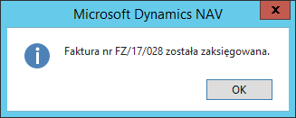{width="3.1304352580927386in" height="1.2540890201224848in"}
  ------------------------------------------------------------------------------------
  Rysunek 1.1: komunikat wyświetlany po zaksięgowaniu dokumentu

Opis księgowania {#opis-księgowania .Poziom-1}
----------------

### Informacje ogólne

Jest to element Polskiej Lokalizacji systemu Microsoft Dynamics 365
Business Central on‑premises wprowadzający ułatwienia w opisywaniu
księgowanych transakcji zapisywanych w tabeli **Zapis księgi głównej**.
Pozwala też na ujednolicenie systemu opisywania transakcji poprzez
zablokowanie dokonywania zmian w wybranych opisach wstawianych
domyślnie.

### Ustawienia

### Możliwe jest zdefiniowanie różnych sposobów tworzenia opisów transakcji zapisywanych w tabeli Zapis księgi głównej, które będą generowane przez system w różnych typach dokumentów. W tym celu należy postępować według następujących kroków:

1.  Należy wybrać **Działy \> Zarządzanie Finansami \> Administracja \>
    Opisy księgowania.**

2.  W oknie **Opisy księgowania**, które się otworzy, należy w pustym
    > wierszu wypełnić kolejno pola:

-   **Kod** --w tym polu należy wprowadzić unikalny kod dla opisu
    > księgowania

-   **Opis -- w **tym polu należy wprowadzić krótki opis dla opisu
    > księgowania

-   **Typ -- w **tym polu należy wybrać spośród dostępnych opcji, gdzie
    > opis księgowania będzie używany. Dostępne opcje:

```{=html}
<!-- -->
```
-   **Dokument sprzedaży**

-   **Dokument zakupu**

-   **Księgowanie kosztu zapasów**

-   **Nota odsetkowa**

-   **Dokument serwisowy**

```{=html}
<!-- -->
```
-   **Formuła opisu księgowania --** to pole przedstawia, w jaki sposób
    > będą generowane elementy opisu księgowania. Tutaj można wprowadzić
    > znaki specjalne, jak np. %1 lub %2, w miejsce których system
    > wstawi wartości z księgowanego dokumentu. Parametry dla znaków
    > specjalnych definiowane są w odrębnym oknie, co zostanie opisane
    > w dalszej części tego rozdziału.

-   **Sprawdź przy księgowaniu** -- jeśli pole jest zaznaczone, system
    > podczas księgowania umieści w zapisach domyślną treść opisu.
    > Jakiekolwiek zmiany w opisie wprowadzone przez użytkownika,
    > zostaną zignorowane. W przypadku, gdy pole nie jest zaznaczone,
    > opis, który zostanie przeniesiony do zapisów księgi głównej
    > podczas księgowania, będzie uwzględniał wszystkie zmiany
    > wprowadzone przez użytkownika.

  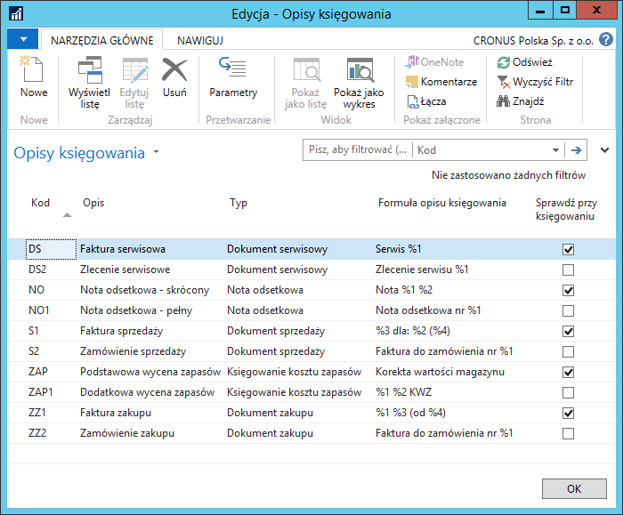{width="6.425628827646544in" height="5.3125in"}
  -----------------------------------------------------------------------
  Rysunek 1.2: Opisy księgowania

3.  W następnym kroku, dla każdego wiersza, w którym, w polu **Formuła
    > opisu księgowania** umieszczone zostały znaki specjalne %1 %2 %3
    > ... , konieczne jest zdefiniowanie parametrów, według
    > których system będzie podstawiał odpowiednie wartości w miejsce
    > znaków specjalnych. W tym celu, dla każdego opisu oddzielnie,
    > należy wybrać **Parametry.**

4.  W oknie **Parametry opisu księgowania**, które się otworzy, należy
    > odpowiednio wypełnić pola:

-   **Nr** -- w tym polu należy wprowadzić cyfrę odpowiadającą znakowi
    > specjalnemu zawartemu w polu **Formuła opisu księgowania**.
    > Parametr wprowadzony w wierszu z tym numerem zostanie wstawiony
    > w odpowiednie miejsce opisu księgowania, np. parametr w wierszu
    > z numerem 1 zostanie wstawiony w miejsce znaku specjalnego %1.

> {width="0.19in"
> height="0.19in"}**Uwaga: Z **uwagi na ograniczenia techniczne, numery
> w oknie **Parametry opisu księgowania** zawsze muszą zaczynać się od 1
> i nie może być ich więcej niż 10 dla każdego opisu księgowania.
> Dodatkowo, pole **Opis** w oknie **Zapis księgi głównej** nie może
> zawierać więcej niż 50 znaków.

-   **Typ** -- w tym polu należy wybrać, jakiego typu parametr będzie
    > użyty. Dostępne opcje to:

```{=html}
<!-- -->
```
-   **Etykieta** -- wybranie tej opcji oznacza, że w miejsce
    > odpowiedniego znaku specjalnego zostanie podstawiona nazwa pola
    > wybranego w polu **Nazwa pola**

-   **Wartość** -- wybranie tej opcji oznacza, że w miejsce
    > odpowiedniego znaku specjalnego zostanie podstawiona zawartość
    > pola wybranego w polu **Nazwa pola**

-   **Stała** -- wybranie tej opcji oznacza, że w miejsce odpowiedniego
    > znaku specjalnego zostanie podstawiona treść ręcznie wpisana
    > w polu **Nazwa pola.**

> {width="0.19in" height="0.19in"}
> **Uwaga:** Należy pamiętać, że zawartość niektórych rodzajów pól (np.
> typu **Opcja**) oraz nazwy pól będą tłumaczone na język aplikacji.
> Jeśli wymagane jest, aby parametry ulegające tłumaczeniom w opisach
> były wyświetlane zawsze w jednym, wybranym, języku, należy użyć opcji
> **Stała** i ręcznie wpisać treść.

-   **Nazwa pola** -- w tym polu należy wybrać pola, których nazwa
    > lub zawartość (dla typów: **Etykieta** lub **Wartość**) będą użyte
    > w miejscu znaków specjalnych w polu **Formuła Opisu Księgowania**
    > albo wprowadzić stałą treść (dla typu **Stała**) w tym samym celu.
    > W zależności od wybranego typu w polu **Typ** w oknie **Opisy
    > księgowania**, lista pól dostępnych do wyboru w polu **Nazwa
    > pola** będzie różna:

```{=html}
<!-- -->
```
-   **Dokument sprzedaży** -- lista rozwijana w polu **Nazwa pola**
    > będzie zestawieniem pól tabeli **Nagłówek sprzedaży**.

-   **Dokument zakupu** -- lista rozwijana w polu **Nazwa pola** będzie
    > zestawieniem pól tabeli **Nagłówek zakupu**.

-   **Księgowanie kosztu zapasów --** lista rozwijana w polu **Nazwa
    > pola** będzie zestawieniem pól tabeli **Zapisy wyceny**.

-   **Nota odsetkowa --** lista rozwijana w polu **Nazwa pola** będzie
    > zestawieniem pól tabeli **Nagłówek noty odsetkowej**.

-   **Dokument serwisowy --** lista rozwijana w polu **Nazwa pola**
    > będzie zestawieniem pól tabeli **Nagłówek serwisu**.

  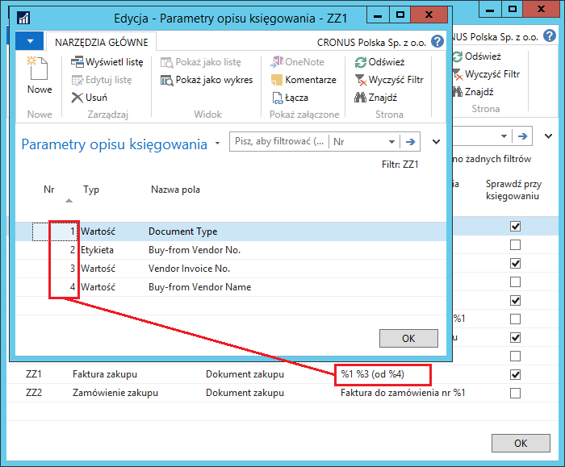{width="6.382608267716535in" height="5.279290244969379in"}
  ----------------------------------------------------------------------------------
  Rysunek 1.3: Parametry opisu księgowania

Na podstawie przykładowych ustawień zaprezentowanych na powyższym
rysunku, dla faktury zakupu z numerem 13/078 system wygeneruje opis
księgowania:

  Formuła    %1                                              %3             %4
  ---------- ----------------------------------------------- -------------- ------------------
  Etykieta                                                                   
  Wartość    Faktura                                          2017/548765   Delta Sp. z o.o.
  Stała                                                                      
  Rezultat   **Faktura 2017/548765 (od Delta Sp. z o.o.)**                  

W ramach definiowania ustawień konieczne jest też wybranie opisów
domyślnych, które system będzie automatycznie generował w różnych
miejscach. W tym celu należy postępować według następujących kroków:

1.  Należy wybrać **Działy \> Zarządzanie Finansami \> Administracja \>
    Ustawienia sprzedaży i należności**.

2.  W oknie **Ustawienia sprzedaży i należn.**, które się otworzy,
    na karcie skróconej **Ogólne**, należy uzupełnić pola:

-   **Kod opisu księgowania** -- z listy rozwijanej należy wybrać
    > właściwy kod spośród wcześniej zdefiniowanych opisów, który będzie
    > domyślnie stosowany w dokumentach sprzedaży: ofercie, zamówieniu,
    > fakturze, zamówieniu zwrotu oraz fakturze korygującej.

-   **Kod opisu księgowania odsetek** -- z listy rozwijanej należy
    > wybrać właściwy kod spośród wcześniej zdefiniowanych opisów,
    > który będzie domyślnie stosowany w notach odsetkowych.

  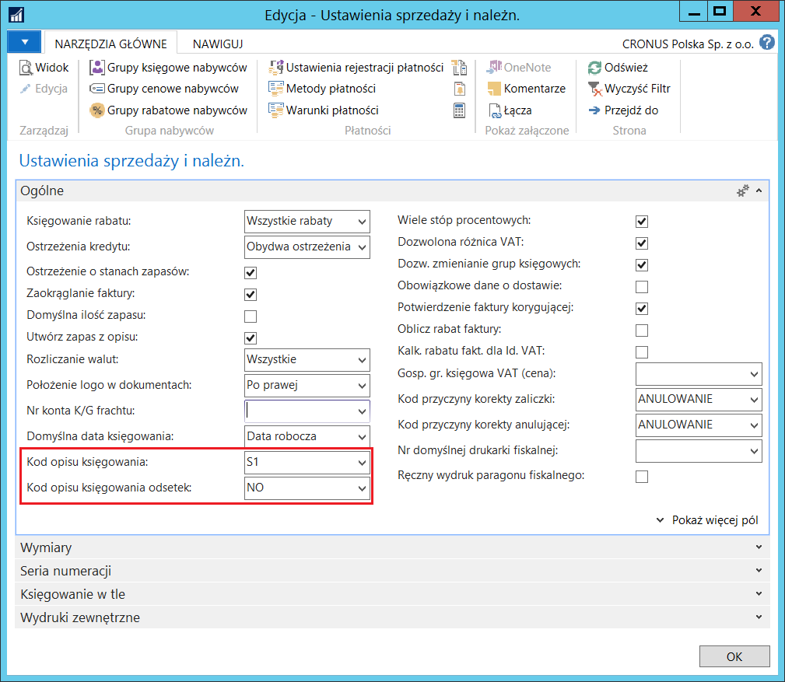{width="6.395329177602799in" height="5.558333333333334in"}
  ----------------------------------------------------------------------------------
  Rysunek 1.4: Ustawienia sprzedaży i należności

> {width="0.19in" height="0.19in"}
> **Uwaga:** Należy zwrócić uwagę, że lista rozwijana w polu **Kod opisu
> księgowania** składa się wyłącznie z kodów opisów zdefiniowanych
> z typem **Dokument sprzedaży**, a w polu **Kod opisu księgowania
> odsetek** - z kodów opisów zdefiniowanych z typem **Nota odsetkowa.**

3.  Należy wybrać **Działy \> Zarządzanie Finansami \> Administracja \>
    > Ustawienia zakupów i zobowiązań**.

4.  W oknie **Ustawienia zakupów i zobow.**, które się otworzy,
    > na karcie skróconej **Ogólne**, należy uzupełnić pole **Kod opisu
    > księgowania** -- z listy rozwijanej należy wybrać właściwy kod
    > spośród wcześniej zdefiniowanych opisów, który będzie domyślnie
    > stosowany w dokumentach zakupu: ofercie, zamówieniu, fakturze,
    > zamówieniu zwrotu oraz fakturze korygującej.

  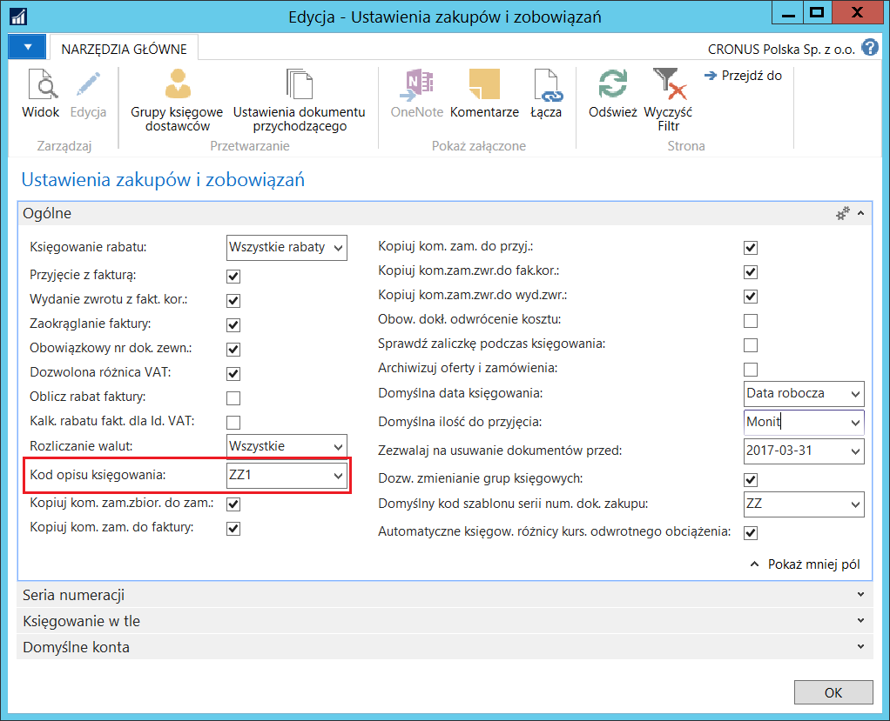{width="6.408333333333333in" height="5.197870734908136in"}
  ----------------------------------------------------------------------------------
  Rysunek 1.5: Ustawienia zakupów i zobowiązań

> {width="0.19in" height="0.19in"}
> **Uwaga:** Należy zwrócić uwagę, że lista rozwijana w polu **Kod opisu
> księgowania** składa się wyłącznie z kodów opisów zdefiniowanych
> z typem **Dokument zakupu.**

5.  Należy wybrać **Działy \> Zarządzanie Finansami \> Administracja \>
    > Ustawienia zapasów**.

6.  W oknie **Ustawienia zapasów**, które się otworzy, na karcie
    > skróconej **Ogólne**, należy uzupełnić pole **Kod opisu
    > księgowania** -- z listy rozwijanej należy wybrać właściwy kod
    > spośród wcześniej zdefiniowanych opisów, który będzie domyślnie
    > stosowany w skrypcie **Księguj koszt zapasów do K/G**.

  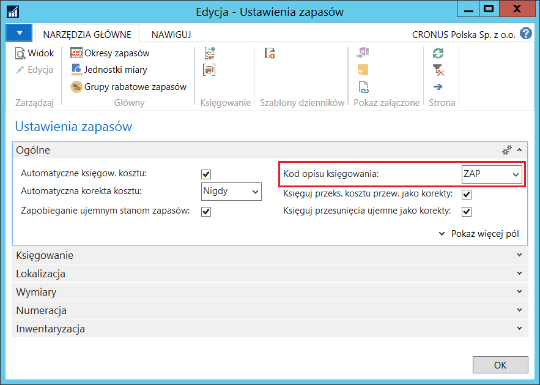{width="6.4in" height="4.559316491688539in"}
  --------------------------------------------------------------------
  Rysunek 1.6: Ustawienia zapasów

> {width="0.19in" height="0.19in"}
> **Uwaga:** Należy zwrócić uwagę, że lista rozwijana w polu **Kod opisu
> księgowania** składa się wyłącznie z kodów opisów zdefiniowanych
> z typem **Księgowanie kosztów zapasu.**

7.  Należy wybrać **Działy \> Serwis \> Administracja \> Ustawienia
    > serwisu.**

8.  W oknie **Ustawienia zarz. serwisem**, które się otworzy, na karcie
    > skróconej **Ogólne**, należy uzupełnić pole **Kod opisu
    > księgowania** -- z listy rozwijanej należy wybrać właściwy kod
    > spośród wcześniej zdefiniowanych opisów, który będzie domyślnie
    > stosowany w dokumentach serwisu: zleceniu, fakturze oraz fakturze
    > korygującej.

  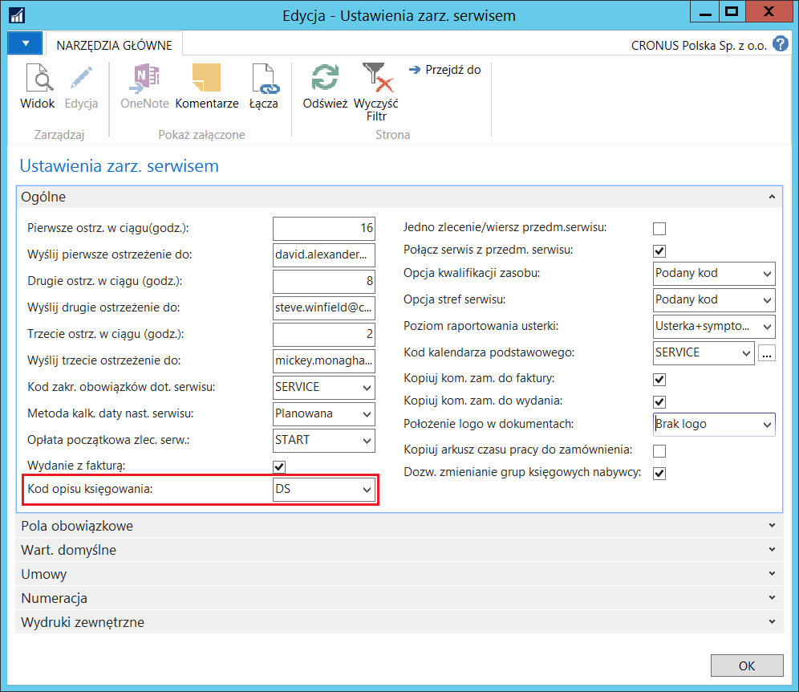{width="6.4in" height="5.538461286089239in"}
  --------------------------------------------------------------------
  Rysunek 1.7: Ustawienia zarządzania serwisem

> {width="0.19in" height="0.19in"}
> **Uwaga:** Należy zwrócić uwagę, że lista rozwijana w polu **Kod opisu
> księgowania** składa się wyłącznie z kodów opisów zdefiniowanych
> z typem **Dokument serwisowy.**

### Obsługa

### Po zdefiniowaniu opisów księgowania i ustawieniu reguł ich księgowania, można zacząć korzystać z tej funkcjonalności, np. w fakturze zakupu. W tym celu należy postępować według następujących kroków:

1.  Należy wybrać **Nowe w **oknie **Faktury zakupu** i wprowadzić co
    > najmniej dostawcę oraz numer jego faktury.

2.  W kartotece nowej faktury zakupu system uzupełni domyślnie pole Kod
    > **opisu księgowania** oraz **Opis księgowania na **podstawie
    > wcześniej zdefiniowanych ustawień i parametrów.

  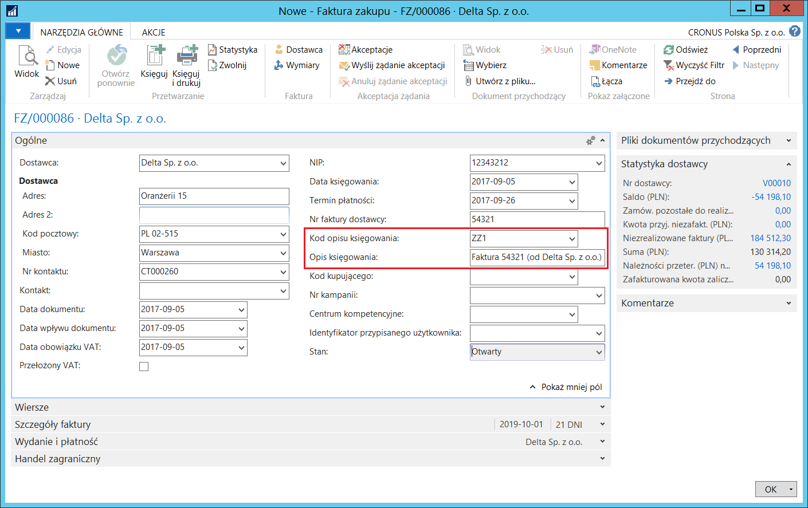{width="6.345448381452319in" height="3.9916666666666667in"}
  -----------------------------------------------------------------------------------
  Rysunek 1.8: Opis księgowania w fakturze zakupu

3.  Pozostałe pola faktury zakupu należy uzupełnić standardowo.

4.  Jeśli konieczna jest zmiana treści w polu **Opis księgowania**,
    można to zrobić w dwojaki sposób, w zależności od ustawień:

-   Jeżeli pole **Sprawdź przy księgowaniu** nie jest zaznaczone
    > dla wybranego **Kodu opisu księgowania**, wszelkie konieczne
    > zmiany należy wprowadzić w treści opisu wstawionego domyślnie

-   Jeżeli pole **Sprawdź przy księgowaniu** jest zaznaczone
    > dla wybranego **Kodu opisu księgowania**, wszelkie zmiany
    > wprowadzone w treści opisu wstawionego domyślnie zostaną
    > zignorowane w trakcie księgowania. Wprowadzenie nowej treści opisu
    > w zamówieniu zakupu jest możliwe po wyczyszczeniu pola **Kod opisu
    > księgowania.**

5.  Należy zaksięgować fakturę zakupu, aby sprawdzić opis księgowania
    > utworzony w tabeli **Zapis księgi głównej**.

  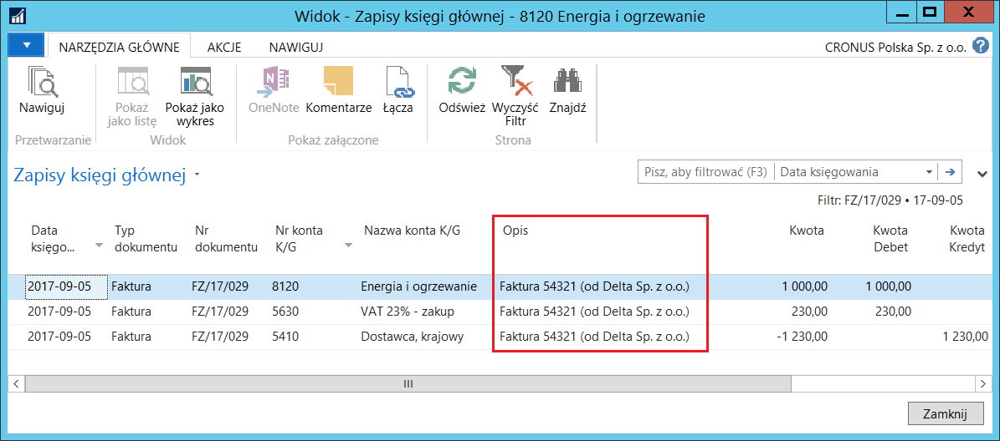{width="6.408333333333333in" height="2.831032370953631in"}
  -----------------------------------------------------------------------------------
  Rysunek 1.9: Opis księgowania w zapisach księgi głównej

> {width="0.19in" height="0.19in"}
> **Uwaga:** Jeżeli w oknach z ustawieniami nie zostanie wskazany
> domyślny **Kod opisu księgowania**, system wygeneruje opis zgodnie
> ze standardem wersji międzynarodowej.

Księgowanie korekty (storno czerwone) {#księgowanie-korekty-storno-czerwone .Poziom-1}
-------------------------------------

### Informacje ogólne

Dla wielu kont bilansowych, księgowi muszą wiedzieć, jakie w danym
okresie były dokładne przychody i rozchody z konta. W polskiej praktyce
ewidencyjnej, w celu określenia kwot przychodów i rozchodów z konta
używa się obrotów konta po określonej stronie, na przykład dla konta
„Środki trwałe" przychodami są obroty strony debet a rozchodami obroty
strony kredyt. Aby zapewnić, że tak określone kwoty rozchodów
i przychodów są prawidłowe, księgowi muszą zachować tak zwaną „czystość
obrotów", czyli księgować korekty po tej samej stronie konta, po której
była zaksięgowana pierwotna operacja, lecz z przeciwnym znakiem
(„czerwone storno"). Co prawda w wersji międzynarodowej możliwe jest
ręczne zaksięgowanie takiej operacji, jednak system nie wspiera
wymuszania tego sposobu księgowania, dodatkowo, automatycznie księgowane
przez system korekty są księgowane po przeciwnej stronie konta
niż pierwotna transakcja („czarne storno").

Aby ułatwić użytkownikom stosowanie „czerwonego" storna do księgowania
operacji korygujących, do modułu Polska Lokalizacja dodano następujące
elementy:

-   Możliwość wymuszenia księgowań po właściwych stronach właściwych
    > kont księgi głównej.

-   Możliwość księgowania korekt transakcji magazynowych jako „czerwone
    > storno" (wydania w transakcjach przesunięć magazynowych,
    > wyksięgowanie kosztu przewidywanego itp.).

-   Ułatwienia procesu -- obsługi księgowania korekt -- za pomocą
    > jednego kliknięcia (księgowania w księdze głównej, zapasach
    > i zleceniach).

### Ustawienia

Aby wymusić zasadę polityki rachunkowości, w której kontach księgi
głównej zapisy mogą być dokonywane tylko po jednej stronie (debet
lub kredyt) oraz ustawić automatyczne księgowanie korekt dla ilości
ujemnych, należy postępować według następujących kroków:

1.  Należy wybrać **Działy \> Zarządzanie Finansami \> Administracja \>
    > Ustawienia księgi głównej.**

2.  W oknie **Ustawienia księgi głównej**, które się otworzy, na karcie
    > skróconej **Ogólne** należy zaznaczyć pole **Sprawdź księgowanie
    > debetu/kredytu**. Efektem tego ustawienia będzie wyświetlenie
    > komunikatu o błędzie, jeśli podjęta zostanie próba zaksięgowania
    > kwoty po stronie kredyt na koncie K/G, które w polu
    > **Debet/kredyt** ma wybraną opcję **Debet** (i odwrotnie).

> {width="0.19in" height="0.19in"}
> **Uwaga:** To ustawienie działa dla kont K/G, dla których w polu
> **Debet/kredyt** została wybrana inna opcja niż **Obydwa**.

3.  W oknie **Ustawienia księgi głównej** na karcie skróconej **Ogólne**
    > należy zaznaczyć pole **Oznacz ilość ujemną jako korektę**.
    > Efektem tego ustawienia będzie zaksięgowanie wierszy sprzedaży
    > i zakupu z ilością ujemną, jako zapisy korekty. To ustawienie
    > dotyczy dokumentów:

-   **Zamówienie**

-   **Faktura**

-   **Zamówienie zwrotu**

-   **Faktura korygująca**

> {width="0.19in" height="0.19in"}
> **Uwaga:** To ustawienie odnosi się również do transakcji
> zaksięgowanych w dziennikach zapasów i zleceń.

  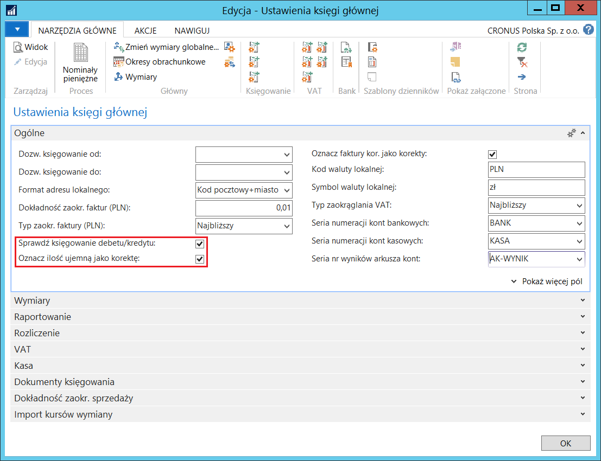{width="6.391666666666667in" height="4.907106299212598in"}
  -----------------------------------------------------------------------------------
  Rysunek 1.10: Ustawienia księgi głównej

Definiując odpowiednie ustawienia w oknie **Ustawienia księgi głównej**
można zdecydować, czy faktury korygujące sprzedaży domyślnie będą
oznaczane jako korekty, czyli tzw. storno czerwone. W celu zdefiniowania
takiego ustawienia, należy postępować według następujących kroków:

1.  Należy wybrać **Działy \> Zarządzanie Finansami \>
    > Administracja \>** **Ustawienia księgi głównej**.

2.  W oknie **Ustawienia księgi głównej**, które się otworzy, na karcie
    > skróconej **Ogólne** należy zaznaczyć pole **Oznacz faktury kor.
    > jako korekty**:

  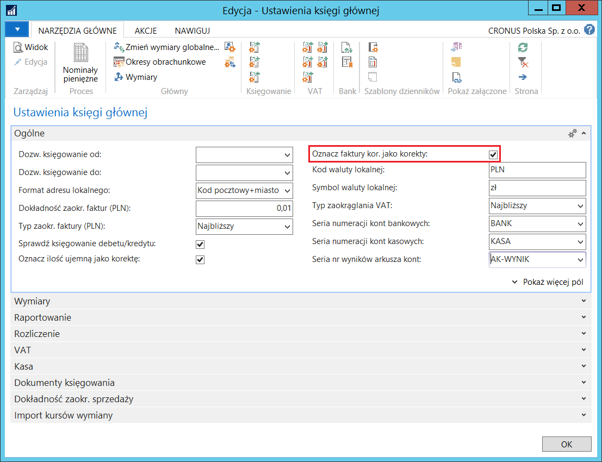{width="6.408333333333333in" height="4.919901574803149in"}
  -----------------------------------------------------------------------------------
  Rysunek 1.11: Ustawienia księgi głównej

> {width="0.19in" height="0.19in"}
> **Uwaga: Ustawienie Oznacz faktury kor. jako korekty w oknie
> Ustawienia księgi głównej ma odniesienie również do serwisowych faktur
> korygujących wystawianych w module Serwis. Zasady działania i sposób
> obsługi tego ustawienia są takie same w obydwu modułach: Sprzedaż
> i Marketing oraz Serwis.**
>
> Więcej informacji na temat wystawiania faktur korygujących sprzedaży
> znajduje się w rozdziale **Faktury korygujące sprzedaży**.

Aby wymusić zasadę polityki rachunkowości i wyksięgowanie kosztu
przewidywanego zarejestrować jako korektę oraz w ten sam sposób
rejestrować zapisy wydań magazynowych w ramach przesunięć
międzymagazynowych, należy postępować według następujących kroków:

1.  Należy wybrać **Działy \> Zarządzanie Finansami \> Administracja \>
    > Ustawienia zapasów.**

2.  W oknie **Ustawienia zapasów**, które się otworzy, na karcie
    > skróconej **Ogólne**, należy zaznaczyć pole **Księguj przeks.
    > kosztu przew. jako korekty.** Efektem tego ustawienia będzie
    > wyksięgowanie kosztu przewidywanego jako korekty, w ramach jego
    > konwersji w koszt rzeczywisty.

3.  W tym samym oknie, na tej samej karcie skróconej, należy zaznaczyć
    > pole **Księguj przesunięcia ujemne jako korekty**. Efektem tego
    > ustawienia będą zapisy księgi głównej utworzone jako korekty,
    > będące rezultatem księgowania wydania przesunięcia
    > międzymagazynowego z lokalizacji pierwotnej i lokalizacji zapasów
    > w drodze.

> {width="0.19in" height="0.19in"}
> **Uwaga:** To ustawienie odnosi się również do transakcji
> zaksięgowanych w dziennikach przeszacowań.

  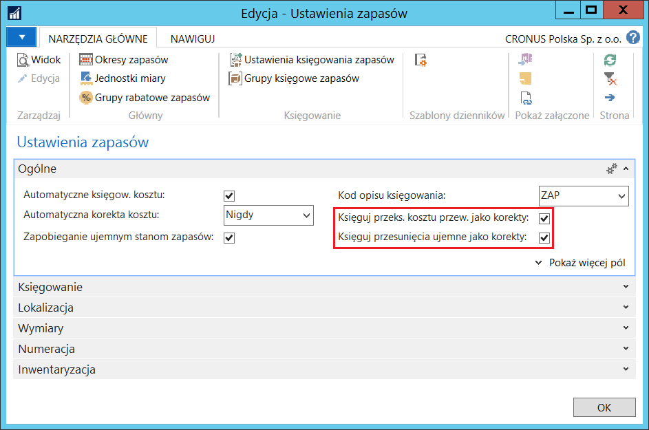{width="6.4in" height="4.2420516185476815in"}
  ----------------------------------------------------------------------
  Rysunek 1.12: Ustawienia zapasów

Szablony serii numeracji dokumentów {#szablony-serii-numeracji-dokumentów .Poziom-1}
-----------------------------------

### Informacje ogólne

> Funkcjonalność **Szablony serii numeracji dokumentów** ułatwia
> definiowanie różnych zestawów serii numeracji dla dokumentów
> określonego typu. W ramach tej funkcjonalności możliwe jest
> utworzenie:

-   Szablonów serii numeracji dokumentów sprzedaży,

-   Szablonów serii numeracji dokumentów zakupu,

-   Szablonów serii numeracji zleceń przesunięcia.

### Ustawienia

> Każdy obiekt (dokument, dziennik itp.) tworzony w ramach
> zdefiniowanego wcześniej szablonu dziedziczy wszystkie jego
> ustawienia.

Raport ustawiony dla szablonu zastępuje pierwszy raport z przypisanych
do danej funkcji w standardowej funkcjonalności. Jeśli do formatki
przypisanych jest więcej raportów, dalsze raporty zostaną wydrukowane
po raporcie z szablonu.

W celu zdefiniowania **Szablonu serii numeracji dokumentu sprzedaży**,
należy postępować według następujących kroków:

1.  Należy wybrać **Działy \> Sprzedaż i Marketing \> Administracja \>
    > Szablony numeracji dok. sprzedaży**

2.  W oknie **Szablony serii nr dok. sprzedaży**, które się otworzy,
    > w pierwszym wolnym wierszu należy wypełnić pola:

-   **Kod** -- w tym polu należy wprowadzić unikalny kod identyfikujący
    > szablon numeracji dokumentu sprzedaży

-   **Opis** -- w tym polu można wprowadzić tekst opisujący szablon
    > numeracji dokumentu sprzedaży

-   **Typ dokumentu** -- w tym polu należy wybrać z listy dostępnych
    > opcji typ dokumentu sprzedaży, w którym szablon zostanie
    > wykorzystany. Dostępne opcje to:

```{=html}
<!-- -->
```
-   **Oferta**

-   **Zamówienie**

-   **Faktura**

-   **Faktura korygująca**

```{=html}
<!-- -->
```
-   **Zamówienie zbiorcze**

-   **Zamówienie zwrotu**

```{=html}
<!-- -->
```
-   **Seria numeracji** -- z listy rozwijanej w tym polu należy wybrać
    > kod wcześniej zdefiniowanej serii numeracji, na podstawie której
    > będą nadawane numery nowotworzonym dokumentom.

```{=html}
<!-- -->
```
-   **Seria numeracji księgowania** -- z listy rozwijanej w tym polu
    > należy wybrać kod wcześniej zdefiniowanej serii numeracji,
    > na podstawie której będą nadawane numery dokumentom zaksięgowanym
    > (fakturom i fakturom korygującym).

-   **Seria numeracji wydań** -- z listy rozwijanej w tym polu należy
    > wybrać kod wcześniej zdefiniowanej serii numeracji, na podstawie
    > której będą nadawane numery dokumentom wydań.

-   **Seria numeracji zaliczek** -- z listy rozwijanej w tym polu należy
    > wybrać kod wcześniej zdefiniowanej serii numeracji, na podstawie
    > której będą nadawane numery zaksięgowanym fakturom zaliczkowym.

-   **Seria numeracji faktur korygujących zaliczki** -- z listy
    > rozwijanej w tym polu należy wybrać kod wcześniej zdefiniowanej
    > serii numeracji, na podstawie której będą nadawane numery
    > zaksięgowanym fakturom korygującym faktury zaliczkowe.

-   **Kod opisu księgowania** -- z listy rozwijanej w tym polu można
    > wybrać wcześniej zdefiniowany kod opisu księgowania, który będzie
    > kopiowany do dokumentów stworzonych w ramach danego szablonu.
    > Niewypełnienie tego pola spowoduje przypisywanie kodu opisu
    > księgowania ustawionego jako domyślny dla sprzedaży.

-   **Kod VAT'u przekazanego** -- z listy rozwijanej w tym polu można
    > wybrać wcześniej zdefiniowany kod VAT'u przekazanego,
    > którego ustawienia zostaną wykorzystane do automatycznego
    > rozliczenia VAT z faktury wystawionej z wykorzystaniem tego
    > szablonu.

```{=html}
<!-- -->
```
-   **Kod szablonu nast. kroku procesu** -- w tym polu należy wskazać,
    > jaki kod szablonu ma być przypisany do dokumentu sprzedaży
    > w następnym kroku procesu. Kod ten zostanie przypisany
    > do zamówienia tworzonego z oferty lub z zamówienia zbiorczego.
    > Jeśli pole to jest puste, a w systemie zdefiniowano więcej
    > niż jeden szablon dla zamówienia, podczas tworzenia zamówienia
    > z oferty lub z zamówienia zbiorczego zostanie otwarte okno wyboru
    > szablonu i użytkownik będzie mógł wybrać szablon, jaki zostanie
    > przypisany do zamówienia. Jeśli natomiast pole **Kod szablonu
    > nast. kroku procesu** jest puste, a w systemie zdefiniowano tylko
    > jeden szablon dla zamówienia, ten właśnie szablon zostanie
    > automatycznie przypisany do nowego dokumentu.

-   **ID raportu faktury** -- z listy rozwijanej w tym polu należy
    > wybrać raport, który zawiera wzór dokumentu, na podstawie
    > którego zostanie wydrukowana faktura (lub faktura korygująca).

-   **Nazwa raportu faktury** -- pole wypełniane automatycznie
    > przez system nazwą przypisaną do raportu wybranego w polu **ID
    > raportu faktury.**

-   **ID raportu wydania** -- z listy rozwijanej w tym polu należy
    > wybrać raport, który zawiera wzór dokumentu, na podstawie
    > którego zostanie wydrukowane wydanie z magazynu.

-   **Nazwa raportu wydania** -- pole wypełniane automatycznie
    > przez system nazwą przypisaną do raportu wybranego w polu **ID
    > raportu wydania.**

-   **Pobierz kurs wymiany dla daty** -- w tym polu należy wybrać datę,
    > według której będzie pobierany kurs wymiany waluty. Dostępne opcje
    > to:

```{=html}
<!-- -->
```
-   **Data księgowania**

-   **Data dokumentu**

-   **Data sprzedaży**

  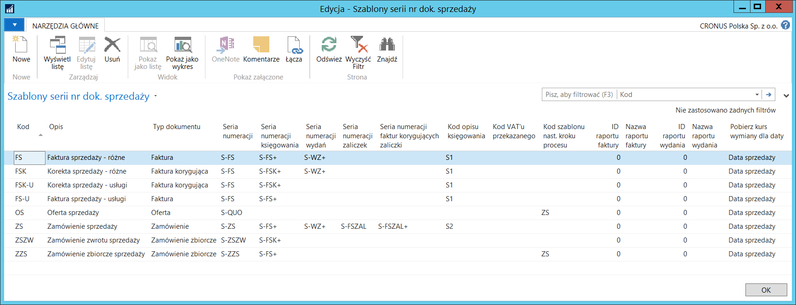{width="6.4in" height="2.453333333333333in"}
  ---------------------------------------------------------------------
  Rysunek 1.13: Szablony serii nr dok. sprzedaży

W celu zdefiniowania **Szablonu serii numeracji dokumentu zakupu**,
należy postępować według następujących kroków:

1.  Należy wybrać **Działy \> Zakup \> Administracja \> Szablony
    numeracji dok. zakupu**

2.  W oknie **Szablony serii nr dok. zakupu**, które się otworzy,
    w pierwszym wolnym wierszu należy wypełnić pola:

-   **Kod** -- w tym polu należy wprowadzić unikalny kod identyfikujący
    > szablon numeracji dokumentu zakupu

-   **Opis** -- w tym polu można wprowadzić tekst opisujący szablon
    > numeracji dokumentu zakupu

-   **Typ dokumentu** -- w tym polu należy wybrać z listy dostępnych
    > opcji typ dokumentu zakupu, w którym szablon zostanie
    > wykorzystany. Dostępne opcje to:

```{=html}
<!-- -->
```
-   **Oferta**

-   **Zamówienie**

-   **Faktura**

-   **Faktura korygująca**

```{=html}
<!-- -->
```
-   **Zamówienie zbiorcze**

-   **Zamówienie zwrotu**

```{=html}
<!-- -->
```
-   **Seria numeracji** -- z listy rozwijanej w tym polu należy wybrać
    > kod wcześniej zdefiniowanej serii numeracji, na podstawie której
    > będą nadawane numery nowotworzonym dokumentom.

```{=html}
<!-- -->
```
-   **Seria numeracji księgowania** -- z listy rozwijanej w tym polu
    > należy wybrać kod wcześniej zdefiniowanej serii numeracji,
    > na podstawie której będą nadawane numery dokumentom zaksięgowanym
    > (fakturom i fakturom korygującym).

-   **Seria numeracji przyjęć** -- z listy rozwijanej w tym polu należy
    > wybrać kod wcześniej zdefiniowanej serii numeracji, na podstawie
    > której będą nadawane numery dokumentom przyjęć.

-   **Seria numeracji zaliczek** -- z listy rozwijanej w tym polu należy
    > wybrać kod wcześniej zdefiniowanej serii numeracji, na podstawie
    > której będą nadawane numery zaksięgowanym fakturom zaliczkowym.

-   **Seria numeracji faktur korygujących zaliczki** -- z listy
    > rozwijanej w tym polu należy wybrać kod wcześniej zdefiniowanej
    > serii numeracji, na podstawie której będą nadawane numery
    > zaksięgowanym fakturom korygującym faktury zaliczkowe.

-   **Kod opisu księgowania** -- z listy rozwijanej w tym polu można
    > wybrać wcześniej zdefiniowany kod opisu księgowania, który będzie
    > kopiowany do dokumentów stworzonych w ramach danego szablonu.
    > Niewypełnienie tego pola spowoduje przypisywanie kodu opisu
    > księgowania ustawionego jako domyślny dla zakupu.

```{=html}
<!-- -->
```
-   **Kod szablonu nast. kroku procesu** -- w tym polu należy wskazać,
    > jaki kod szablonu ma być automatycznie przypisany do dokumentu
    > zakupu w następnym kroku procesu. Kod ten zostanie przypisany
    > do zamówienia tworzonego z oferty lub z zamówienia zbiorczego.
    > Jeśli pole to jest puste, a w systemie zdefiniowano więcej
    > niż jeden szablon dla zamówienia, podczas tworzenia zamówienia
    > z oferty lub z zamówienia zbiorczego zostanie otwarte okno wyboru
    > szablonu i użytkownik będzie mógł wybrać szablon, jaki zostanie
    > przypisany do zamówienia. Jeśli natomiast pole **Kod szablonu
    > nast. kroku procesu** jest puste, a w systemie zdefiniowano tylko
    > jeden szablon dla zamówienia, ten właśnie szablon zostanie
    > automatycznie przypisany do nowego dokumentu.

-   **ID raportu faktury** -- z listy rozwijanej w tym polu należy
    > wybrać raport, który zawiera wzór dokumentu, na podstawie
    > którego zostanie wydrukowana faktura (lub faktura korygująca).

-   **Nazwa raportu faktury** -- pole wypełniane automatycznie
    > przez system nazwą przypisaną do raportu wybranego w polu **ID
    > raportu faktury.**

-   **Identyfikator raportu przyjęcia** -- z listy rozwijanej w tym polu
    > należy wybrać raport, który zawiera wzór dokumentu, na podstawie
    > którego zostanie wydrukowane przyjęcie do magazynu.

-   **Nazwa raportu przyjęcia** -- pole wypełniane automatycznie
    > przez system nazwą przypisaną do raportu wybranego w polu
    > **Identyfikator raportu przyjęcia.**

-   **Pobierz kurs wymiany dla daty** -- w tym polu należy wybrać datę,
    > według której będzie pobierany kurs wymiany waluty. Dostępne opcje
    > to:

```{=html}
<!-- -->
```
-   **Data księgowania**

-   **Data dokumentu**

  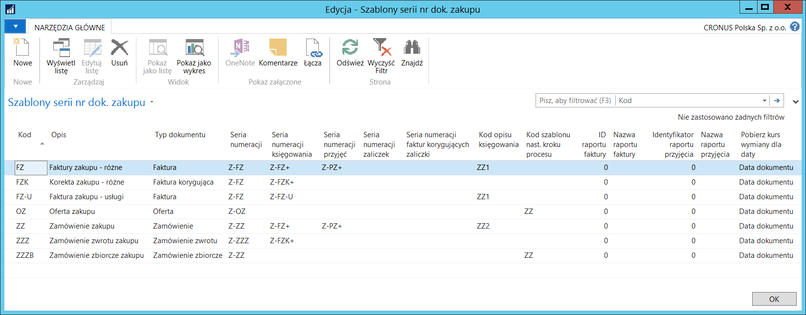{width="6.4in" height="2.504615048118985in"}
  ---------------------------------------------------------------------
  Rysunek 1.14: Szablony serii nr dok. zakupu

W celu zdefiniowania **Szablonu serii numeracji zlecenia przesunięcia**,
należy postępować według następujących kroków:

1.  Należy wybrać **Działy \> Magazyn \> Administracja \> Szablony
    numeracji zlec. przesunięcia.**

2.  W oknie **Szablony serii nr zlec. przesunięcia**, które się otworzy,
    w pierwszym wolnym wierszu należy wypełnić pola:

-   **Kod** -- w tym polu należy wprowadzić unikalny kod identyfikujący
    > szablon numeracji zlecenia przesunięcia.

-   **Opis** -- w tym polu można wprowadzić tekst opisujący szablon
    > numeracji zlecenia przesunięcia.

-   **Kod lokalizacji pierwotnej** -- z listy rozwijanej w tym polu
    > należy wybrać wcześniej zdefiniowaną lokalizację, z której będzie
    > dokonane wydanie w ramach przesunięcia międzymagazynowego.

-   **Kod lokalizacji docelowej** -- z listy rozwijanej w tym polu
    > należy wybrać wcześniej zdefiniowaną lokalizację, w której będzie
    > dokonane przyjęcie w ramach przesunięcia międzymagazynowego.

```{=html}
<!-- -->
```
-   **Seria numeracji zlec. przes.** -- z listy rozwijanej w tym polu
    > należy wybrać kod wcześniej zdefiniowanej serii numeracji,
    > na podstawie której będą nadawane numery kolejnym zleceniom
    > przesunięcia.

-   **Seria num. zaks. wyd. przes.** -- z listy rozwijanej w tym polu
    > należy wybrać kod wcześniej zdefiniowanej serii numeracji,
    > na podstawie której będą nadawane numery zaksięgowanym dokumentom
    > wydań z lokalizacji pierwotnej.

-   **Seria num. zaks. przyj. przes.** -- z listy rozwijanej w tym polu
    > należy wybrać kod wcześniej zdefiniowanej serii numeracji,
    > na podstawie której będą nadawane numery zaksięgowanym dokumentom
    > przyjęć do lokalizacji docelowej.

  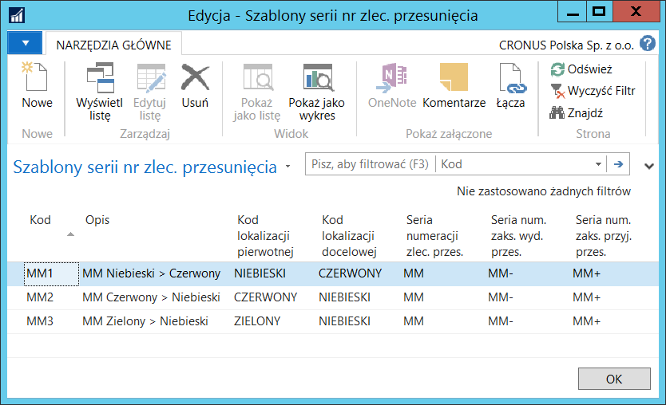{width="5.618110236220472in" height="3.421259842519685in"}
  -----------------------------------------------------------------------------------
  Rysunek 1.15: Szablony serii nr zlec. przesunięcia

> Funkcjonalności **Szablony serii nr dok. zakupu i Szablony serii nr
> zlec. przesunięcia** mają zastosowanie w **Arkuszach
> zapotrzebowania**. W celu ułatwienia pracy użytkownikom, można wybrać
> domyślne kody szablonów serii numeracji dokumentów, które będą użyte
> przy uzupełnianiu stanów magazynowych.
>
> W celu zdefiniowania domyślnych szablonów serii nr dok. zakupu i zlec.
> przesunięcia dla **Jednostki składowania** **zapasu**, należy
> postępować według następujących kroków:

1.  Należy wybrać **Działy \> Magazyn \> Planowanie i wykonywanie \>
    Jednostki składowania zapasu.**

2.  W oknie **Jednostki składowania zapasu** należy zaznaczyć wiersz
    z wybraną jednostką składowania zapasów i wybrać **Edycja**.

3.  W kartotece wybranej jednostki składowania zapasów, która się
    otworzy, na karcie skróconej **Uzupełnienie** należy wypełnić pola:

-   **Domyślny kod szablonu serii num. dok. zakupu** -- z listy
    > rozwijanej w tym polu należy wybrać jeden z wcześniej
    > zdefiniowanych szablonów numeracji dokumentów zakupu.

-   **Domyślny kod szablonu serii num. dok. przesunięcia -- z **listy
    > rozwijanej w tym polu należy wybrać jeden z wcześniej
    > zdefiniowanych szablonów numeracji zleceń przesunięcia.

  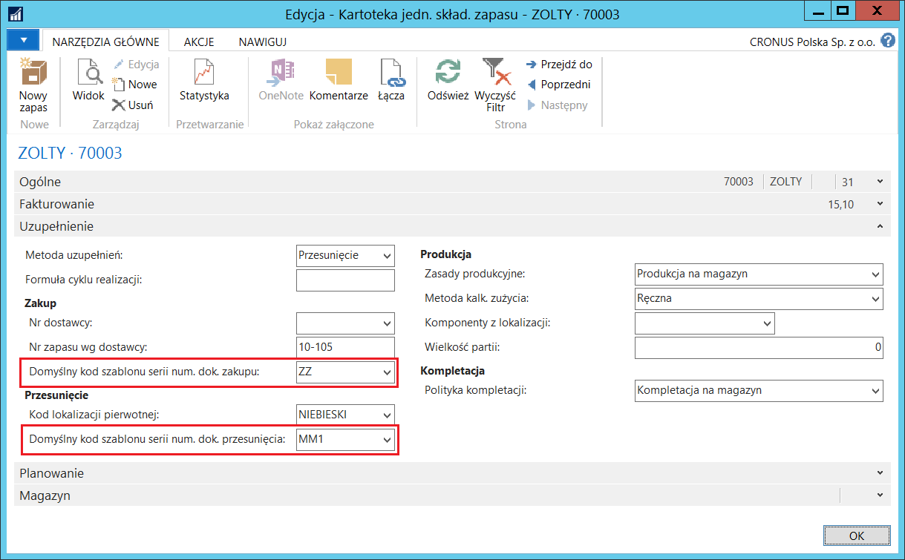{width="6.391666666666667in" height="3.9585990813648295in"}
  ----------------------------------------------------------------------------------------------
  Rysunek 1.16: Domyślne szablony serii numeracji dokumentów dla jednostki składowania zapasów

> W celu zdefiniowania domyślnych szablonów serii nr dok. zakupu i zlec.
> przesunięcia dla **Zapasu**, należy postępować według następujących
> kroków:

1.  Należy wybrać **Działy \> Magazyn \> Planowanie i wykonywanie \>
    Zapasy.**

2.  W oknie **Zapasy** należy zaznaczyć wiersz z wybranym zapasem
    i wybrać **Edycja**.

3.  W kartotece wybranego zapasu, która się otworzy, na karcie skróconej
    **Uzupełnienie** należy wypełnić pola:

-   **Domyślny kod szablonu serii num. dok. zakupu** -- z listy
    > rozwijanej w tym polu należy wybrać jeden z wcześniej
    > zdefiniowanych szablonów numeracji dokumentów zakupu.

-   **Domyślny kod szablonu serii num. dok. przesunięcia -- z **listy
    > rozwijanej w tym polu należy wybrać jeden z wcześniej
    > zdefiniowanych szablonów numeracji zleceń przesunięcia.

  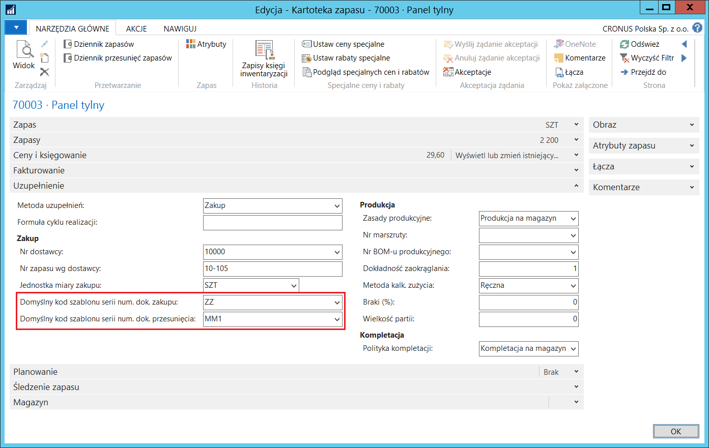{width="6.4in" height="4.047178477690289in"}
  -----------------------------------------------------------------------
  Rysunek 1.17: Domyślne szablony serii numeracji dokumentów dla zapasu

> W celu zdefiniowania domyślnego szablonu serii nr dok. zakupu
> dla zapasów nie mających przypisanego domyślnego szablonu serii nr
> dok. zakupu w kartotece ani jednostce składowania, należy postępować
> według następujących kroków:

1.  Należy wybrać **Działy \> Zakup \> Administracja \> Ustawienia
    > zakupów i zobowiązań**.

2.  W oknie **Ustawienia zakupów i zobowiązań**, które się otworzy,
    > na karcie skróconej **Ogólne** należy z listy rozwijanej w polu
    > **Domyślny kod szablonu serii num. dok. zakupu** wybrać jeden
    > z wcześniej zdefiniowanych szablonów serii nr dok. zakupu.

  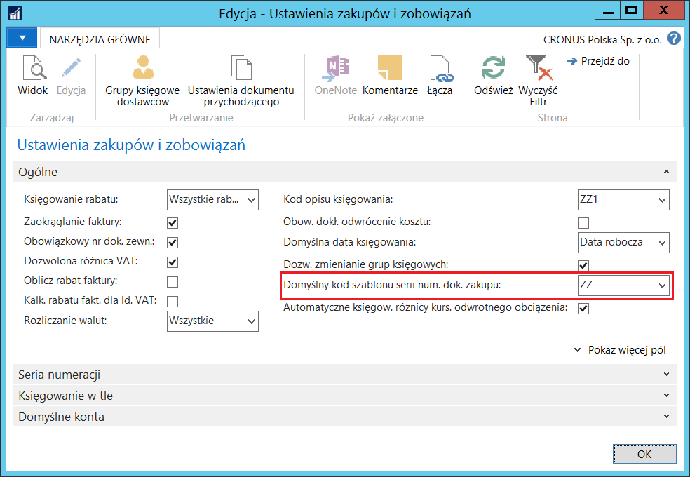{width="6.391465441819773in" height="4.416666666666667in"}
  -----------------------------------------------------------------------------------
  Rysunek 1.18: Domyślny szablon serii numeracji dokumentów zakupu

> W celu zdefiniowania domyślnego szablonu serii nr zlec. przesunięcia
> dla zapasów niemających przypisania domyślnego szablonu serii nr zlec.
> przesunięcia w kartotece ani jednostce składowania, należy postępować
> według następujących kroków:

1.  Należy wybrać **Działy \> Magazyn \> Administracja \> Ustawienia
    > magazynu.**

2.  W oknie **Ustawienia magazynu**, które się otworzy, na karcie
    > skróconej **Ogólne** należy z listy rozwijanej w polu **Domyślny
    > kod szablonu serii num. dok. przesunięcia** wybrać jeden
    > z wcześniej zdefiniowanych szablonów serii nr zlec. przesunięcia.

  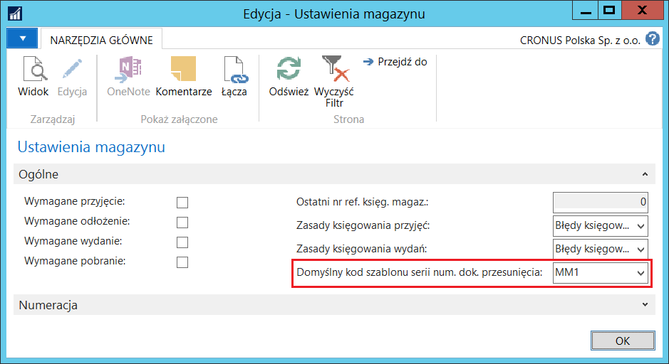{width="6.383333333333334in" height="3.480825678040245in"}
  -----------------------------------------------------------------------------------
  Rysunek 1.19: Domyślny szablon serii numeracji zleceń przesunięcia

### Obsługa

> W celu utworzenia faktury sprzedaży z wykorzystaniem jednego
> z wcześniej zdefiniowanych **Szablonów serii nr dok. sprzedaży**,
> należy postępować według następujących kroków:

1.  Należy wybrać **Działy \> Sprzedaż i Marketing \> Przetwarzanie
    zamówień \> Faktury sprzedaży.**

2.  W oknie **Faktury sprzedaży**, które się otworzy, należy wybrać
    > **Nowe**.

3.  W kartotece nowej faktury sprzedaży należy przenieść kursor
    > do innego pola niż to, w którym się znalazł domyślnie.

4.  Otworzy się okno **Lista szablonów serii nr dok. sprzedaży**,
    > w którym należy zaznaczyć wiersz z wybranym szablonem i wybrać
    > **OK**.

  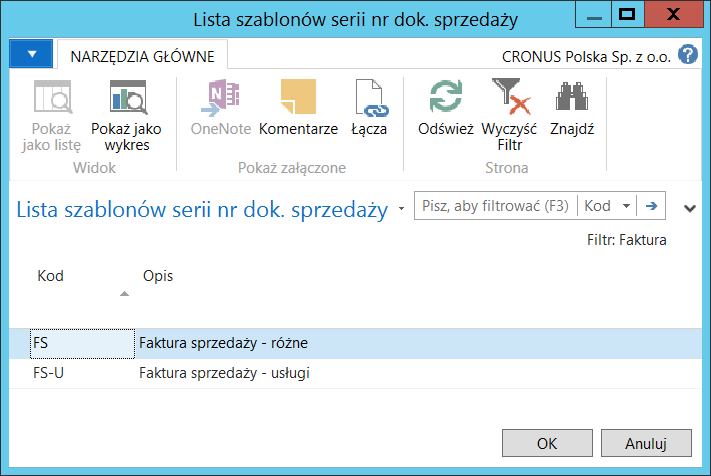{width="4.799212598425197in" height="3.2125984251968505in"}
  ------------------------------------------------------------------------------------
  Rysunek 1.20: Lista szablonów serii nr dok. sprzedaży

5.  Do nagłówka wprowadzanej faktury sprzedaży system wstawi parametry
    > domyślnie przypisane do wybranego szablonu (np. **Seria
    > numeracji**, **Kod opisu księgowania** itp.). Parametry wstawione
    > domyślnie do pól edytowalnych mogą zostać ręcznie zmienione.

6.  Dalsze kroki procesu wystawiania faktury należy wykonać standardowo.

> {width="0.19in" height="0.19in"}
> **Uwaga:** Obsługa funkcjonalności **Szablony serii nr dok.
> sprzedaży** działa w ten sam sposób dla następujących typów dokumentów
> sprzedaży: **Oferta, Zamówienie, Faktura, Faktura korygująca,
> Zamówienie zbiorcze, Zamówienie zwrotu.**
>
> W celu utworzenia faktury zakupu z wykorzystaniem jednego z wcześniej
> zdefiniowanych **Szablonów serii nr dok. zakupu**, należy postępować
> według następujących kroków:

1.  Należy wybrać **Działy \> Zakup \> Przetwarzanie zamówień \> Faktury
    zakupu.**

2.  W oknie **Faktury zakupu**, które się otworzy, należy wybrać
    > **Nowe**.

3.  W kartotece nowej faktury zakupu należy przenieść kursor do innego
    > pola niż to, w którym się znalazł domyślnie.

4.  Otworzy się okno **Lista szablonów serii nr dok. zakupu**, w którym
    > należy zaznaczyć wiersz z wybranym szablonem i wybrać **OK**.

  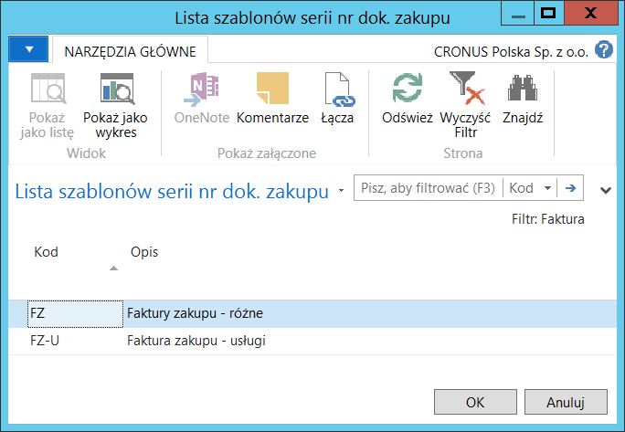{width="4.606299212598425in" height="3.1850393700787403in"}
  ------------------------------------------------------------------------------------
  Rysunek 1.21: Lista szablonów serii nr dok. zakupu

5.  Do nagłówka wprowadzanej faktury zakupu system wstawi parametry
    > domyślnie przypisane do wybranego szablonu (np. **Seria
    > numeracji**, **Kod opisu księgowania** itp.). Parametry wstawione
    > domyślnie do pól edytowalnych mogą zostać ręcznie zmienione.

6.  Dalsze kroki procesu wprowadzania faktury należy wykonać
    > standardowo.

> {width="0.19in" height="0.19in"}
> **Uwaga:** Obsługa funkcjonalności **Szablony serii nr dok. zakupu**
> działa w ten sam sposób dla następujących typów dokumentów zakupu:
> **Oferta, Zamówienie, Faktura, Faktura korygująca, Zamówienie
> zbiorcze, Zamówienie zwrotu.**
>
> W celu utworzenia zlecenia przesunięcia z wykorzystaniem jednego
> z wcześniej zdefiniowanych **Szablonów serii nr zlec. przesunięcia**,
> należy postępować według następujących kroków:

1.  Należy wybrać **Działy \> Magazyn \> Planowanie i wykonywanie \>
    Zlecenia przesunięcia.**

2.  W oknie **Zlecenia przesunięcia**, które się otworzy, należy wybrać
    > **Nowe**.

3.  W kartotece nowego zlecenia przesunięcia należy przenieść kursor
    > do innego pola niż to, w którym się znalazł domyślnie.

4.  Otworzy się okno **Lista szablonów serii nr zlec. przesunięcia**,
    > w którym należy zaznaczyć wiersz z wybranym szablonem i wybrać
    > **OK**.

  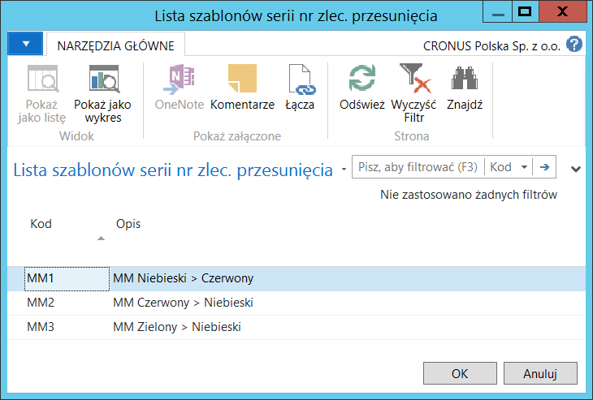{width="4.925196850393701in" height="3.326771653543307in"}
  -----------------------------------------------------------------------------------
  Rysunek 1.22: Lista szablonów serii nr zlec. przesunięcia

5.  Do nagłówka wprowadzanego zlecenia przesunięcia system wstawi
    > parametry domyślnie przypisane do wybranego szablonu (np. **Seria
    > numeracji**, **Kody lokalizacji** itp.). Parametry wstawione
    > domyślnie do pól edytowalnych mogą zostać ręcznie zmienione.

6.  Dalsze kroki procesu księgowania zlecenia przesunięcia należy
    > wykonać standardowo.

> W **Arkuszach zapotrzebowania** funkcja **Wykonaj komunikat akcji**
> tworząca odpowiednie dokumenty korzysta z szablonów serii nr dok.
> zakupu w przypadku metody uzupełnień **Zakup** i z szablonów serii nr
> zlec. przesunięcia w przypadku metody uzupełnień **Przesunięcie**.
>
> W przypadku tworzenia wierszy arkusza zapotrzebowania przy użyciu
> funkcji **Oblicz plan**, system uzupełnia pole **Kod szablonu serii
> numeracji** w wierszach arkusza zapotrzebowania odpowiednimi kodami
> pobranymi z kartoteki jednostki składowania, a jeśli tam domyślne kody
> nie są przypisane, wtedy pobierane są one z kartoteki zapasu,
> a gdy również tutaj ich brak, wtedy pobierane są z okna **Ustawienia
> zakupów i zobowiązań** lub **Ustawienia magazynu**.

Ręczne wprowadzanie wierszy arkuszy zapotrzebowania wymaga ręcznego
uzupełnienia pola **Kod szablonu serii numeracji***.* Pole to można też
pozostawić puste, wtedy system podczas tworzenia dokumentów przy pomocy
funkcji **Wykonaj komunikat akcji** skorzysta z domyślnych szablonów
serii numeracji dokumentów w takiej kolejności, jak przy funkcji
**Oblicz plan**.

  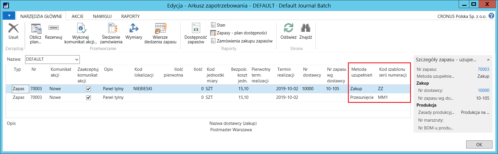{width="6.4in" height="1.9808552055993in"}
  -----------------------------------------------------------------------------
  Rysunek 1.23: szablony serii numeracji dokumentów w arkuszu zapotrzebowania

 {#section .list-paragraph .Poziom-1}

Seria numeracji w szablonach głównych {#seria-numeracji-w-szablonach-głównych .Poziom-1}
-------------------------------------

### Informacje ogólne

> Standardowa funkcjonalność **Szablony główne** umożliwia zdefiniowanie
> domyślnych parametrów w różnych zestawach, na podstawie których system
> automatycznie uzupełnia część pól w rekordach zakładanych przy użyciu
> wybranego szablonu głównego. Polska Lokalizacja umożliwia dodatkowo
> przypisywanie domyślnej serii numeracji w szablonach zdefiniowanych
> dla nabywców, dostawców i środków trwałych.

### Ustawienia

W celu przypisania serii numeracji do szablonu głównego, należy
postępować według następujących kroków:

1.  Należy wybrać **Działy \> Administracja \> Ustawienia aplikacji \>
    > Ogólne \> Konfiguruj szablony główne.**

2.  W oknie **Konfiguruj szablony główne**, które się otworzy, należy
    > zaznaczyć wiersz z wybranym szablonem i wybrać **Edycja**.

3.  Na karcie skróconej **Wiersze** należy wstawić nowy wiersz, w którym
    > w polu **Nazwa pola** należy wybrać **No. Series**, a w polu
    > **Wartość domyślna** należy ręcznie wprowadzić kod wcześniej
    > zdefiniowanej serii numeracji, przeznaczonej do numerowania
    > kartotek zakładanych przy użyciu danego szablonu. Pozostałe pola
    > należy uzupełnić w sposób standardowy.

  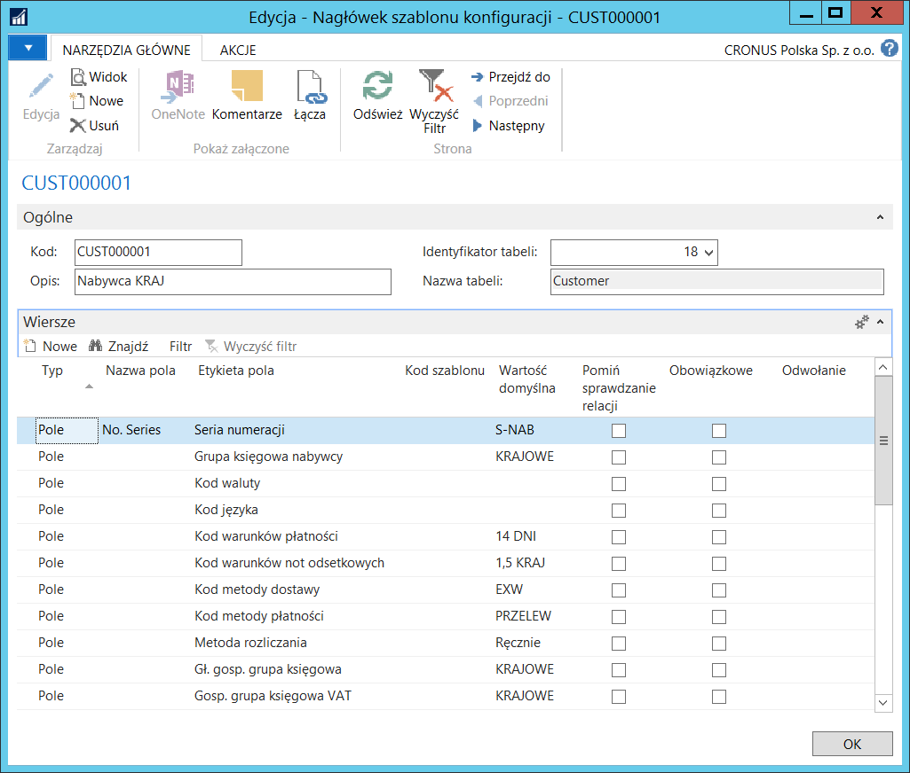{width="6.4in" height="5.4441021434820644in"}
  ----------------------------------------------------------------------
  Rysunek 1.24: Seria numeracji w szablonie głównym

> {width="0.19in" height="0.19in"}
> **Uwaga:** Przypisywanie domyślnych serii numeracji jest możliwe
> dla **Szablonów głównych** zdefiniowanych dla nabywców (identyfikator
> tabeli = 18), dostawców (identyfikator tabeli = 23) i środków trwałych
> (identyfikator tabeli = 5600).
>
> Brak przypisania domyślnej serii numeracji do szablonu głównego
> skutkuje tym, że podczas tworzenia nowej kartoteki z wykorzystaniem
> tego szablonu, system zastosuje odpowiednią serię numeracji
> ze standardowych ustawień zdefiniowanych w oknach: **Ustawienia
> sprzedaży i należn.**, **Ustawienia zakupów i zobowiązań**,
> **Ustawienia ŚT.**

### Obsługa

Zasada działania funkcjonalności jest taka sama dla nabywców, dostawców
i środków trwałych, dlatego obsługa zostanie opisana tylko
na przykładzie nabywcy.

W celu zdefiniowania kartoteki nabywcy z wykorzystaniem szablonu
głównego z przypisaną domyślną serią numeracji, należy postępować
według następujących kroków:

1.  Należy wybrać **Działy \> Zarządzanie Finansami \> Należności \>
    > Nabywcy**.

2.  W oknie **Nabywcy**, które się otworzy, należy wybrać **Nowe**.

3.  W oknie **Wybierz szablon dla nowego nabywcy** należy zaznaczyć
    > wiersz z wybranym szablonem i wybrać **OK.**

  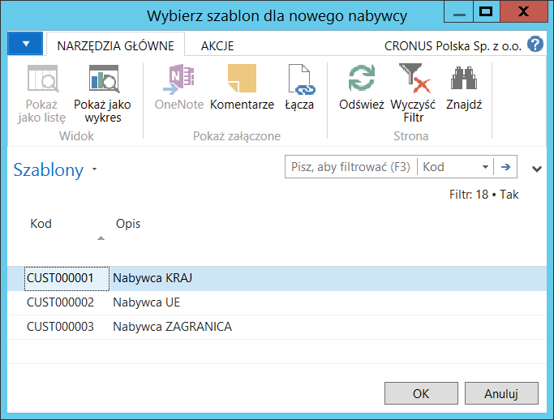{width="4.610236220472441in" height="3.4960629921259843in"}
  ------------------------------------------------------------------------------------
  Rysunek 1.25: Lista Szablonów głównych dla nabywców

4.  System nadał nowej kartotece nabywcy numer kolejny zgodny z serią
    numeracji przypisaną do wybranego szablonu głównego:

  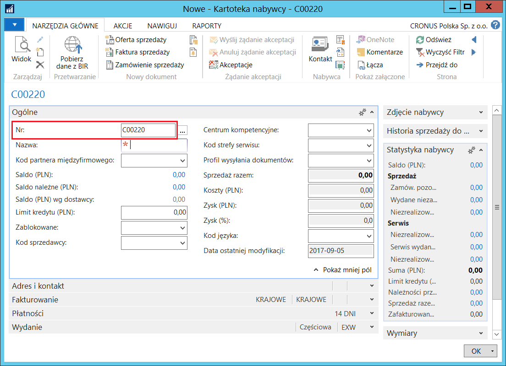{width="6.383333333333334in" height="4.625189195100613in"}
  -----------------------------------------------------------------------------------
  Rysunek 1.26: Kartoteka nabywcy

5.  Pozostałe pola w kartotece nabywcy należy uzupełnić standardowo.

Import kursów wymiany NBP {#import-kursów-wymiany-nbp .Poziom-1}
-------------------------

### Informacje ogólne

Narodowy Bank Polski publikuje API webowe (interfejsy webowe), dzięki
którym użytkownicy mogą pobierać dane dotyczące wcześniejszych i
bieżących kursów walut. W Microsoft Dynamics 365 Business Central można
w prosty sposób zdefiniować ustawienia umożliwiające korzystanie z API w
celu pobierania i aktualizacji kursów wymiany.

#### Podstawowe ustawienia {#podstawowe-ustawienia .Poziom-2}

W celu zdefiniowania ustawień niezbędnych do poprawnego działania
importu, należy wykonać następujące kroki:

1.  Należy wybrać **Działy \> Zarządzanie Finansami \> Działania
    okresowe \> Waluta \> Waluty**.

2.  W oknie **Waluty**, które się otworzy, należy kliknąć **Usługa
    kursów wymiany** na wstążce.

  ----------------------
  Rysunek 1.27: Waluty
  ----------------------

3.  W oknie **Usługi kursów wymiany walut**, które się otworzy, należy
    > kliknąć **Nowy** na wstążce.

4.  W oknie **Usługa wymiany walut** należy wypełnić niżej opisane pola.

> Na karcie skróconej **Ogólne**:

-   **Kod** -- nazwa kodu usługi wymiany walut

-   **Opis** -- pole opcjonalne; opis usługi wymiany walut

> Na karcie skróconej **Serwis**:

-   **Adres URL usługi** -- Adres URL dla API webowego.\
    > W przypadku API udostępnianego przez NBP wprowadź:
    > <http://api.nbp.pl/api/exchangerates/tables/A?format=xml>

> Na karcie skróconej **Mapowanie pola** zmapuj wymienione poniżej pola,
> wybierając je w kolejnych wierszach, w polu **Etykieta** i
> wprowadzając odpowiednie wartości w kolumnie **Źródło**:

-   **Nadrzędny węzeł dla kodu waluty** -
    /ArrayOfExchangeRatesTable/ExchangeRatesTable/Rates/Rate

-   **Kod waluty**
    --/ArrayOfExchangeRatesTable/ExchangeRatesTable/Rates/Rate/Code

-   **Data początkowa**
    --/ArrayOfExchangeRatesTable/ExchangeRatesTable/EffectiveDate

> {width="0.19in" height="0.19in"}
> **Uwaga:** tabela kursu wymiany walut publikowana przez NBP obowiązuje
> od dnia następującego po dacie określonej w tabeli w polu Data
> początkowa, konieczne jest przygotowanie reguły transformacji
> obsługującej tę różnicę czasową. Sposób konfiguracji reguły
> transformacji opisany jest w kolejnym kroku.

-   **Kurs wymiany** -- pozostaw pole **Źródło** puste i wypełnij pole
    **Wartość domyślna** liczbą 1.

-   **Relacyjny kurs wymiany**
    /ArrayOfExchangeRatesTable/ExchangeRatesTable/Rates/Rate

  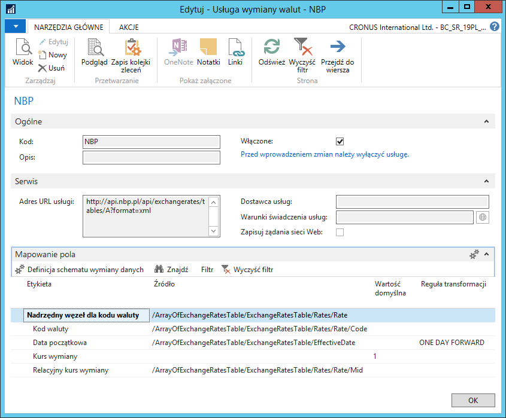{width="6.367925415573054in" height="5.267825896762905in"}
  -----------------------------------------------------------------------------------
  Rysunek 1.28: Usługa wymiany Walut

### Aby utworzyć i zdefiniować regułę transformacji dla daty początkowej, należy wykonać następujące kroki:

### W oknie Usługa wymiany walut, na karcie skróconej Mapowanie pola, w wierszu z polem Data początkowa, w kolumnie Reguła transformacji kliknij przycisk asysty, a następnie na wyświetlonej liście kliknij Nowy.

  -----------------------------------------
  Rysunek 1.29: Nowa reguła transformacji
  -----------------------------------------

2.  W oknie **Karta reguły transformacji**, które się otworzy, należy
    wypełnić niżej opisane pola:

-   **Kod** -- wprowadź tekst **ONE DAY FORWARD**. Jeśli zostanie
    wprowadzony inny kod, transformacja nie powiedzie się.

-   **Typ transformacji** -- z listy rozwijanej w tym polu wybierz opcję
    **Niestandardowy**.

3.  Aby przetestować transformację, w polu **Testowy tekst** wprowadź
    datę w formacie DD-MM-RRRR, a następnie kliknij link **Aktualizuj**.

  ------------------------------------------
  Rysunek 1.30: Karta reguły transformacji
  ------------------------------------------

4.  Kliknij przycisk **OK**, aby zamknąć stronę.

5.  W oknie **Usługa wymiany walut** zaznacz pole **Włączone**, aby
    aktywować usługę. W wyniku tego działania system utworzy zapis
    kolejki zleceń, w którym codziennie będzie rejestrowany kurs
    wymiany.

#### Kurs wymiany dla kwoty różnej od 1 {#kurs-wymiany-dla-kwoty-różnej-od-1 .Poziom-2}

### Niektóre firmy określają kurs wymiany dla kwoty wymiany równej 100. Poniższa instrukcja umożliwia ustawienie kursu wymiany walut dla kwoty wymiany innej niż 1.

### Aby ustawić kurs wymiany walut dla kwoty wymiany innej niż 1, należy wykonać następujące kroki:

1.  W oknie **Usługa wymiany walut**, na karcie skróconej **Mapowanie
    pola**, w wierszu z wybranym polem **Kurs wymiany**, w kolumnie
    **Wartość domyślna** wprowadź odpowiednią liczbę, np. 100

2.  ### Kliknij Definicja schematu wymiany danych w akcjach karty skróconej Mapowanie pola.

  ------------------------------------
  Rysunek 1.31: Usługa wymiany walut
  ------------------------------------

### W oknie Definicja schematu wymiany danych, które się otworzy, kliknij Mapowanie pola w akcjach karty skróconej Definicje wierszy

  -------------------------------------------------
  Rysunek 1.32: Definicja schematu wymiany danych
  -------------------------------------------------

### W oknie Mapowanie pola, które się otworzy, w wierszu z polem Relacyjny kurs wymiany, w kolumnie Mnożnik wprowadź tę samą liczbę, co w pierwszym kroku, np. 100

  ------------------------------
  Rysunek 1.33: Mapowanie pola
  ------------------------------

5.  Zamknij poszczególne okna i włącz **Usługę wymiany walut**

  ------------------------------------
  Rysunek 1.34: Usługa wymiany walut
  ------------------------------------

#### Przechwytywanie danych historycznych {#przechwytywanie-danych-historycznych .Poziom-2}

> Interfejs wymiany walut API ułatwia pobieranie kursów obowiązujących
> w przeszłości. W tym celu należy wykonać następujące kroki:

1.  Wyłącz **Usługę wymiany walut**

2.  W polu **Adres URL usługi** wprowadź nowy adres:

> [http://api.nbp.pl/api/exchangerates/tables/A/{startDate}/{endDate}?format=xml](http://api.nbp.pl/api/exchangerates/tables/A/%7bstartDate%7d/%7bendDate%7d?format=xml%20)

{width="0.19in" height="0.19in"}
**Uwaga:** {startDate} i {endDate}, które określają okres, definiuje się
w formacie DD‑MM‑RRRR. Okres nie może być dłuższy od 93 dni

3.  Włącz **Usługę wymiany walut**.

4.  Otwórz okno **Waluty** i kliknij akcję **Aktualizuj kursy wymiany**
    na wstążce, aby zaktualizować kursy wymiany dla określonych dat.

5.  Przywróć pierwotną wartość w polu **Adres URL usługi** w oknie
    **Usługa wymiany walut**.

Korygowanie kursów wymiany {#korygowanie-kursów-wymiany .Poziom-1}
--------------------------

### Informacje ogólne

Korygowanie kursów wymiany, czyli wycena bilansowa, to przeliczenie
otwartych rozrachunków nabywców i dostawców oraz środków pieniężnych
zgromadzonych w kasie i na rachunkach bankowych według kursu wymiany
obowiązującego na dzień przeprowadzenia wyceny bilansowej. Wycena taka
powinna być przeprowadzana co najmniej raz w roku. W ramach Polskiej
Lokalizacji do standardowej funkcjonalności zostały dodane następujące
ulepszenia:

-   Możliwość uruchomienia skryptu **Korygowanie kursów wymiany**
    > oddzielnie dla nabywców, dostawców i kont bankowych.

-   Możliwość zaksięgowania zapisów szczegółowo lub zagregowanych
    > według waluty, w wyniku uruchomienia skryptu **Korygowanie kursów
    > wymiany**.

-   Możliwość uruchomienia skryptu **Korygowanie kursów wymiany**
    > w trybie testowym, wyłącznie jako symulacji (czyli bez wykonywania
    > wynikających z przeliczeń księgowań).

### Obsługa

W celu uruchomienia skryptu **Korygowanie kursów wymiany**
z wykorzystaniem ulepszeń Polskiej Lokalizacji, należy postępować
według następujących kroków:

1.  Należy wybrać **Działy \> Zarządzanie Finansami \> Działania
    okresowe \> Waluta \>** **Koryguj kursy wymiany.**

2.  W oknie wstępnym skryptu należy we właściwy sposób wypełnić pola
    na karcie skróconej **Opcje**:

-   **Data początkowa** -- w tym polu należy wprowadzić datę początkową
    > okresu objętego korygowaniem kursów wymiany. Pozostawienie pola
    > pustego oznacza, że skorygowane zostaną wszystkie zapisy z okresu
    > przed **Datą końcową** włącznie.

-   **Data końcowa** -- w tym polu należy wprowadzić datę końcową okresu
    > objętego korygowaniem kursów wymiany. Pozostawienie pola pustego
    > oznacza, że skorygowane zostaną wszystkie zapisy z okresu
    > po **Dacie początkowej** włącznie.

-   **Opis księgowania** -- opis, jaki zostanie przeniesiony do zapisów
    > księgi głównej po wykonaniu skryptu. Pole wypełniane jest
    > automatycznie przez system, w razie potrzeby można ręcznie zmienić
    > jego zawartość.

-   **Data księgowania** -- data, z jaką zostaną zaksięgowane zapisy
    > w wyniku uruchomienia skryptu. Pole jest wypełniane automatycznie
    > przez system **Data końcową**, w razie potrzeby, można ją ręcznie
    > zmienić.

-   **Nr dokumentu** -- w tym polu należy wprowadzić numer dokumentu,
    > na podstawie którego zostaną zaksięgowane zapisy w wyniku
    > uruchomienia skryptu.

-   **Koryguj konta bankowe** -- pole należy zaznaczyć, jeśli podczas
    > uruchomienia skryptu mają zostać skorygowane kwoty na kontach
    > bankowych i kontach kas.

-   **Koryguj nabywcę** -- pole należy zaznaczyć, jeśli podczas
    > uruchomienia skryptu mają zostać skorygowane otwarte zapisy księgi
    > nabywców.

-   **Koryguj dostawcę** -- pole należy zaznaczyć, jeśli podczas
    > uruchomienia skryptu mają zostać skorygowane otwarte zapisy księgi
    > dostawców.

-   **Koryguj konta K/G dla dodat. waluty raportowania** -- pole należy
    > zaznaczyć, jeśli podczas uruchomienia skryptu mają zostać
    > skorygowane kwoty na kontach K/G dla dodatkowej waluty
    > raportowania.

-   **Sumuj zapisy** -- pole należy zaznaczyć, jeśli zapisy księgowe
    > będące wynikiem działania skryptu mają zostać zsumowane
    > według waluty. Niezaznaczenie pola spowoduje utworzenie
    > szczegółowych zapisów księgowych będących wynikiem działania
    > skryptu.

-   **Tryb testowy --** pole należy zaznaczyć, jeśli skrypt ma zostać
    > uruchomiony w trybie testowym, wyłącznie jako symulacja, bez
    > księgowania. Niezaznaczenie tego pola spowoduje zaksięgowanie
    > korekty kursów wymiany podczas wykonania skryptu.

> {width="0.19in" height="0.19in"}
> **Uwaga:** Skrypt nie może być uruchomiony w **Trybie testowym**,
> gdy zaznaczone jest pole **Sumuj zapisy**.
>
> W kartach skróconych: **Waluta**, **Nabywca**, **Dostawca**, **Konto
> bankowe** można w standardowy sposób ustawić filtry ograniczające
> zakres danych wybranych do skorygowania.

  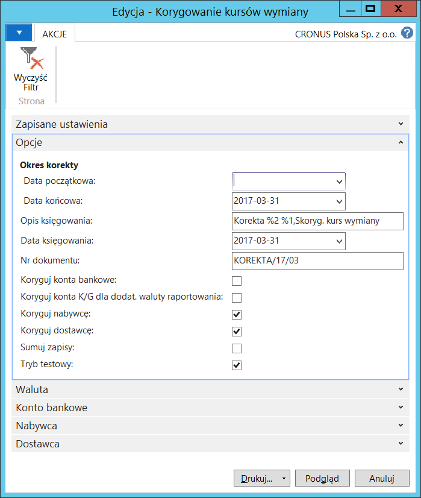{width="4.744094488188976in" height="5.606299212598425in"}
  -----------------------------------------------------------------------------------
  Rysunek 1.35: okno wstępne skryptu Korygowanie kursów wymiany

3.  Należy wybrać **Drukuj** w celu uruchomienia skryptu z jednoczesnym
    wydrukiem lub **Podgląd w **celu uruchomienia skryptu z jednoczesnym
    wyświetleniem na ekranie:

  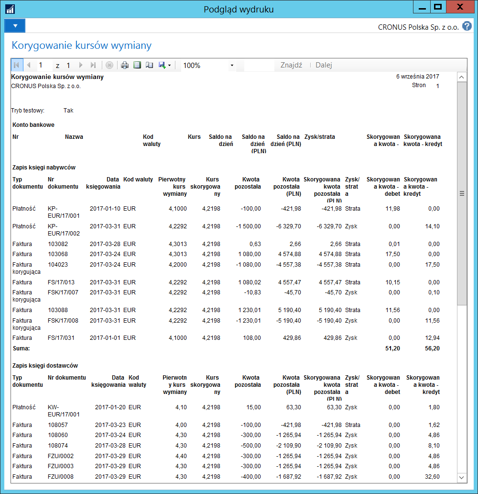{width="6.387618110236221in" height="6.591666666666667in"}
  -----------------------------------------------------------------------------------
  Rysunek 1.36: Zestawienie korygowanych kursów wymiany

 {#section-1 .list-paragraph .Poziom-1}

Rejestry korekt kursów wymiany {#rejestry-korekt-kursów-wymiany .Poziom-1}
------------------------------

### Informacje ogólne

Zapisy historii korekt kursów wymiany, czyli wycen bilansowych jest
przechowywana w **Rejestrach korekt kursów wymiany**. W ramach Polskiej
Lokalizacji rozszerzono standardowy wygląd okna rejestrów i dodano
raport księgowania. Pozwala to na uzyskanie pełnej informacji o historii
przeprowadzonych korekt kursów wymiany.

### Obsługa

W celu uzyskania informacji o historii dokonanych korekt kursów wymiany,
należy postępować według następujących kroków:

1.  Należy wybrać **Działy \> Zarządzanie Finansami \> Działania
    okresowe \> Waluta \>** **Rejestry korekt kursów wymiany**.

2.  W oknie **Rejestry korekt kursów wymiany**, które się otworzy,
    wyświetlone są informacje w następujących polach:

-   **Nr** -- pole wypełniane automatycznie przez system numerem
    > kolejnym księgowania korekty kursów wymiany.

-   **Data utworzenia** -- pole wypełniane automatycznie przez system
    > datą, kiedy fizycznie zostało dokonane księgowanie korekty kursów
    > wymiany.

-   **Typ konta** -- pole wypełniane automatycznie przez system typem
    > konta, na którym została dokonana korekta kursów wymiany.

-   **Nr konta** -- pole wypełniane automatycznie przez system numerem
    > konta (zgodnym z **Typem konta**), na którym została dokonana
    > korekta kursów wymiany.

-   **Nr dokumentu** -- pole wypełniane automatycznie przez system
    > numerem dokumentu, na podstawie którego zostało dokonane
    > księgowanie korekty kursów wymiany.

-   **Nr dokumentu źródłowego** -- pole wypełniane automatycznie
    > przez system numerem dokumentu źródłowego dla zapisu, dla
    > którego została dokonana korekta kursów wymiany.

-   **Grupa księgowa** -- pole wypełniane automatycznie przez system
    > kodem grupy księgowej w zapisie, dla którego została dokonana
    > korekta kursów wymiany.

-   **Kod waluty** -- pole wypełniane automatycznie przez system kodem
    > waluty, dla której została dokonana korekta kursów wymiany.

-   **Skorygowana podstawa** -- pole wypełniane automatycznie
    > przez system kwotą w walucie źródłowej, dla której została
    > dokonana korekta kursów wymiany.

-   **Skorygowana podstawa (PLN)** -- pole wypełniane automatycznie
    > przez system równowartością kwoty w walucie lokalnej, dla której
    > została dokonana korekta kursów wymiany.

-   **Skorygowana kwota (PLN)** -- pole wypełniane automatycznie
    > przez system kwotą niezrealizowanych różnic kursowych w walucie
    > lokalnej, będącą wynikiem dokonanej korekty kursów wymiany.

-   **Kwota zysków (PLN)** -- pole wypełniane automatycznie przez system
    > kwotą dodatnich niezrealizowanych różnic kursowych w walucie
    > lokalnej, będącą wynikiem dokonanej korekty kursów wymiany.

-   **Kwota strat (PLN)** -- pole wypełniane automatycznie przez system
    > kwotą ujemnych niezrealizowanych różnic kursowych w walucie
    > lokalnej, będącą wynikiem dokonanej korekty kursów wymiany.

  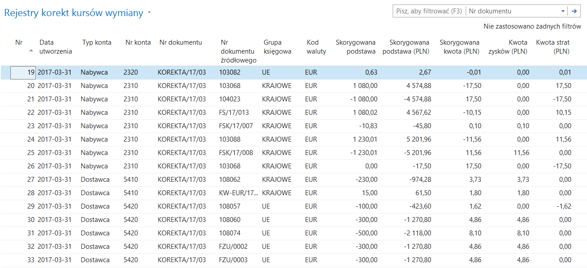{width="6.425in" height="2.93998687664042in"}
  ----------------------------------------------------------------------
  Rysunek 1.37: Rejestry korekt kursów wymiany

**Rejestry korekt kursów wymiany** mogą być też drukowane. W tym celu
należy postępować według następujących kroków:

1.  W oknie **Rejestry korekt kursów wymiany** należy wybrać **Rejestr
    > korekt kursów wymiany**.

2.  W oknie wstępnym raportu, które się otworzy, można ograniczyć zakres
    > prezentowanych danych, ustawiając w sposób standardowy filtry
    > w polach na karcie skróconej **Rejestr korekt kursu wymiany**.
    > Następnie należy wybrać **Drukuj** lub **Podgląd**.

  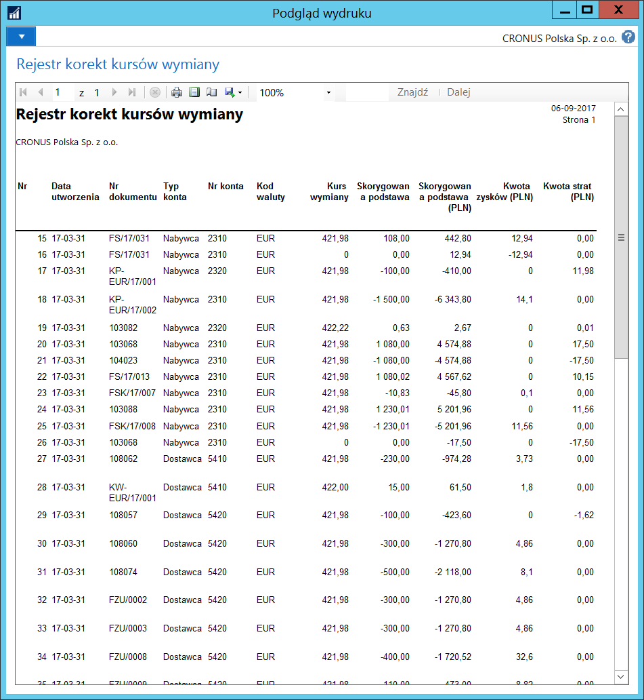{width="6.3579440069991255in" height="6.9in"}
  ----------------------------------------------------------------------
  Rysunek 1.38: Podgląd Wydruku rejestru korekt kursów wymiany

 {#section-2 .list-paragraph .Poziom-1}

Informacja o nazwie i wersji programu księgowego {#informacja-o-nazwie-i-wersji-programu-księgowego .Poziom-1}
------------------------------------------------

### Informacje ogólne

Przepisy ustawy o rachunkowości narzucają obowiązek drukowania
informacji o nazwie i wersji programu księgowego na oficjalnych
raportach księgowych:

*...„* *Księgi rachunkowe, z uwzględnieniem techniki ich prowadzenia,
powinny być \[...\] trwale oznaczone nazwą (pełną lub skróconą)
jednostki, której dotyczą (każda księga wiązana, każda luźna karta
kontowa, **także jeżeli mają one postać wydruku komputerowego
lub zestawienia wyświetlanego na ekranie monitora komputera**), nazwą
danego rodzaju księgi rachunkowej oraz **nazwą programu
przetwarzania**;*"...

**Obsługa**

Przykładowy raport z informacją o nazwie i wersji programu księgowego:

  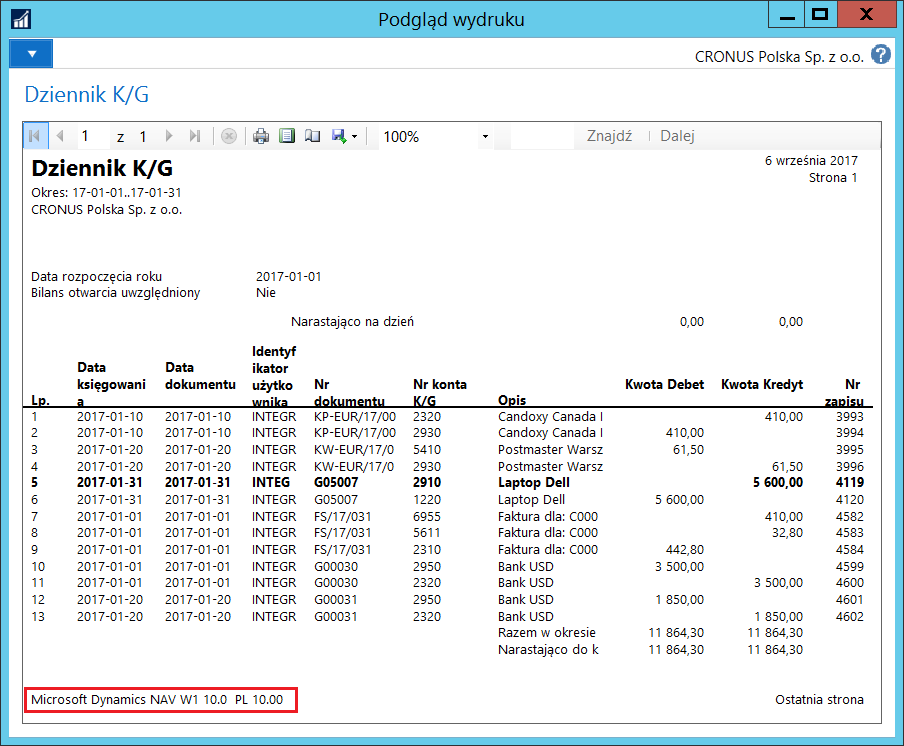{width="6.383333333333334in" height="5.267613735783027in"}
  -----------------------------------------------------------------------------------
  Rysunek 1.39: Raport „dziennik K/G"

Lista raportów z informacją o nazwie i wersji programu księgowego:

1)  Dziennik K/G (G/L Journal)

2)  Dokument księgow.- rejestr K/G (G/L Register Posting Document)

3)  Analityczny rejestr K/G (Analytical G/L Register)

4)  Analityczny dokument K/G (Analytical G/L Document)

5)  Zest. obrotów i sald kont K/G (G/L Acc. Net Change & Balance)

6)  Rejestr VAT sprzedaży/zakupu (Sale/Purchase VAT Reg.)

7)  K/G - faktura sprzedaży (G/L Sales Invoice)

8)  K/G - faktura kor. sprzedaży (G/L Sales Credit Memo)

9)  Zest. obrotów i sald nabywcy (Customer Net Change & Balance)

10) Dziennik zapisów księgi nabywców (Customer Ledger Entry Journal)

11) K/G - faktura zakupu (G/L Purchase Invoice)

12) K/G - faktura kor. zakupu (G/L Purchase Credit Memo)

13) Zest. obrotów i sald dostawcy (Vendor Net Change & Balance)

14) Dziennik zapisów księgi dostawców (Vendor Ledger Entry Journal)

15) Lista inwentaryzacji (Phys. Inventory List)

Typy działalności {#typy-działalności .Poziom-1}
-----------------

### Informacje ogólne

Ustawa CIT na rok 2018 wprowadza wymóg podziału wyniku finansowego na
część operacyjną i kapitałową, z zakazem kompensaty strat pomiędzy tymi
typami działalności. W większości przypadków, podział księgowań pomiędzy
typy działalności, może być zrealizowany za pomocą standardowej
funkcjonalności systemu Microsoft Dynamics 365 Business Central
on‑premises, przy użyciu kont K/G, czy też funkcjonalności wymiarów
księgowych. Tego typu podział jest niestety niemożliwy w przypadku
księgowań automatycznych związanych z naliczaniem różnic kursowych. W
standardzie systemu, konta różnic kursowych są przypisane do waluty. Nie
jest zatem możliwe rozdzielenie różnic kursowych, dotyczących różnych
typów działalności na odrębne konta księgi głównej. W przypadku
wykorzystania wymiarów księgowych, pobierane są one automatycznie
z zapisów ksiąg nabywców i dostawców. Użytkownik nie ma możliwości
zmiany wartości wymiarów, z jakimi będą zaksięgowane różnice kursowe
podczas procesu rozliczania należności i zobowiązań.

Opisana poniżej funkcjonalność umożliwia podział zapisów ksiąg nabywców
i dostawców pomiędzy definiowalne przez użytkownika typy działalności.
Do typu działalności można przypisać zestaw kont różnic kursowych, co
sprawia, iż w przypadku rozliczenia zapisu księgi nabywcy lub dostawcy z
określonym typem działalności, konta różnic kursowych nie są pobierane z
ustawień waluty, lecz z ustawień typu działalności.

### Ustawienia

Z uwagi na to, że do podziału wyniku finansowego wykorzystywana jest
standardowa funkcjonalność wymiarów, należy utworzyć nowy, dedykowany,
wymiar. W tym celu, należy postępować według następujących kroków:

1.  Należy wybrać **Działy \> Zarządzanie Finansami \> Administracja \>
    > Wymiary**.

2.  W oknie **Wymiary**, które się otworzy, należy utworzyć nowy wiersz
    > i wprowadzić **Kod**, **Nazwę** oraz pozostałe dane wymiaru,
    > którego wartości będą używane do podziału różnic kursowych.

  -----------------------
  Rysunek 1.40: Wymiary
  -----------------------

3.  Należy ustawić kursor w wierszu z nowym wymiarem i na wstążce, na
    > karcie **Nawiguj**, wybrać **Wartości wymiaru**.

4.  W oknie **Wartości wymiaru**, które się otworzy, należy w kolejnych
    > wierszach wprowadzić **Kod**, **Nazwę** i pozostałe dane wartości
    > nowego wymiaru.

  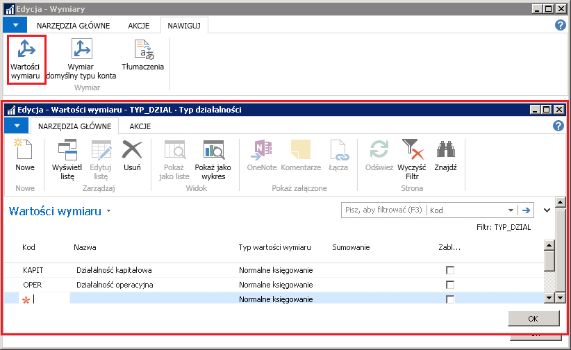{width="6.358490813648294in" height="3.8986515748031496in"}
  ------------------------------------------------------------------------------------
  Rysunek 1.41: Wartości wymiaru

Aby możliwe było korzystanie z opisywanej funkcjonalności, konieczne
jest wskazanie w **Ustawieniach księgi głównej** nowo utworzonego
wymiaru. W tym celu, należy postępować według następujących kroków:

1.  Należy wybrać **Działy \> Zarządzanie Finansami \> Administracja \>
    Ustawienia księgi głównej**.

2.  W oknie **Ustawienia księgi głównej**, które się otworzy, na karcie
    > skróconej **Wymiary**, w polu **Kod wymiaru typu działalności** z
    > listy rozwijanej należy wybrać zdefiniowany w poprzednich krokach
    > wymiar.

  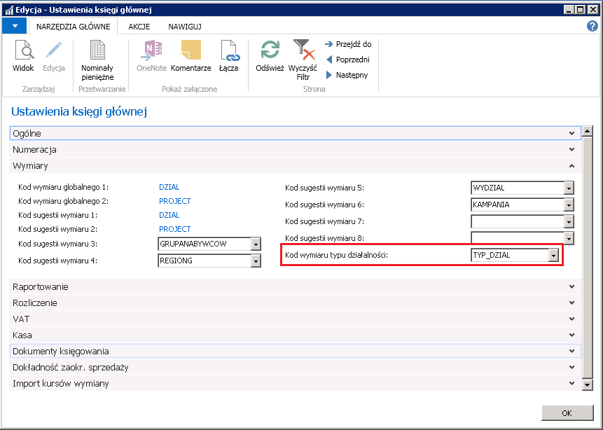{width="6.386792432195976in" height="4.554001531058618in"}
  -----------------------------------------------------------------------------------
  Rysunek 1.42: Ustawienia księgi głównej

Po utworzeniu odpowiedniego wymiaru wraz z wartościami, należy
zdefiniować konta różnic kursowych. W tym celu, należy postępować według
następujących kroków:

1.  Należy wybrać **Działy \> Zarządzanie Finansami \> Administracja \>
    Typy działalności gospodarczych**.

2.  W oknie **Typy działalności gospodarczych**, które się otworzy,
    należy wybrać właściwe konta księgi głównej, na których księgowane
    będą zrealizowane i niezrealizowane różnice kursowe związane z
    wybranymi wartościami wymiaru:

-   **Konto zysków niezrealiz. --** w tym polu należy wybrać konto do
    > zaksięgowania niezrealizowanych dodatnich różnic kursowych.

-   **Konto zysków zrealizowanych --** w tym polu należy wybrać konto
    > do zaksięgowania zrealizowanych dodatnich różnic kursowych.

-   **Konto strat niezrealiz. --** w tym polu należy wybrać konto do
    > zaksięgowania niezrealizowanych ujemnych różnic kursowych.

-   **Konto strat zrealizowanych. --** w tym polu należy wybrać konto
    > do zaksięgowania zrealizowanych ujemnych różnic kursowych.

> {width="0.19in" height="0.19in"}
> **Uwaga:** W oknie **Typy działalności gospodarczych** nie można
> tworzyć nowych wierszy, ponieważ są one zsynchronizowane z wartościami
> wymiaru wybranego w polu **Kod wymiaru typu działalności** w oknie
> **Ustawienia księgi głównej**.

  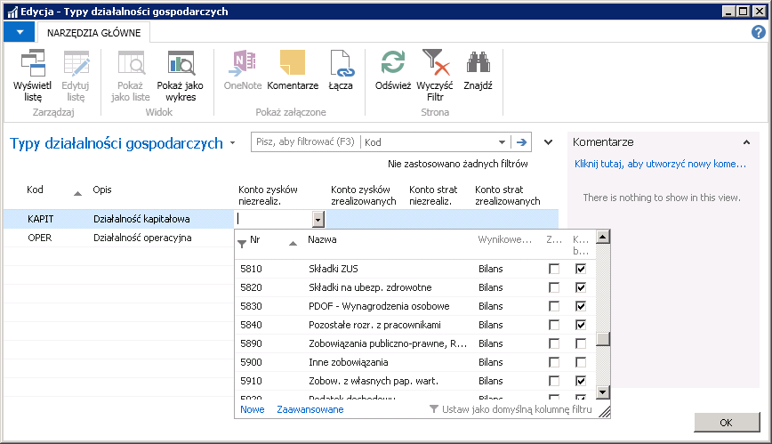{width="6.207638888888889in" height="3.5659722222222223in"}
  -------------------------------------------------------------------------------------------------------------------
  Rysunek 1.43: Typy działalności gospodarczych

### Obsługa

### Dzięki wykorzystaniu wymiarów, przypisywanie odpowiednich typów działalności może odbywać się w wielu miejscach w systemie Microsoft Dynamics 365 Business Central on‑premises. Można przypisać domyślny typ działalności do nabywcy lub dostawcy, do dokumentu sprzedaży lub zakupu, oraz do każdego wiersza dziennika głównego.

### Z uwagi na to, że dostawcy i nabywcy mogą mieć przypisane różne typy działalności, może zdarzyć się, że będą wzajemnie rozliczane zapisy księgi nabywców lub dostawców z przypisanymi różnymi typami działalności. W takiej sytuacji do określenia kont różnic kursowych zostanie wykorzystany typ działalności z zapisu rozliczającego.

### Można ustawić domyślną wartość wymiaru typu działalności dla danej tabeli w systemie. W tym celu, należy postępować według następujących kroków:

1.  Należy wybrać **Działy \> Zarządzanie Finansami \> Administracja \>
    Wymiary**.

2.  W oknie **Wymiary**, które się otworzy, należy ustawić kursor w
    wierszu z wybranym wymiarem i na wstążce, na karcie **Nawiguj**
    wybrać **Wymiar domyślny typu konta**.

3.  W oknie **Wymiar domyślny typu konta**, które się otworzy, należy
    wypełnić poszczególne pola, w oddzielnym wierszu dla każdej wybranej
    tabeli:

-   **Identyfikator tabeli -- w tym polu należy wybrać z listy
    > rozwijanej tabelę, dla której wybrana wartość wymiaru będzie
    > traktowana jako wartość domyślna.**

-   **Kod wartości wymiaru -- w tym polu należy wybrać domyślną dla
    > danej tabeli wartość wymiaru.**

-   **Księgowanie wartości -- w tym polu należy wybrać jedną z opcji:**

```{=html}
<!-- -->
```
-   **pusta**

-   **Kod obowiązkowy**

-   **Ten sam kod**

-   **Bez kodu**.

  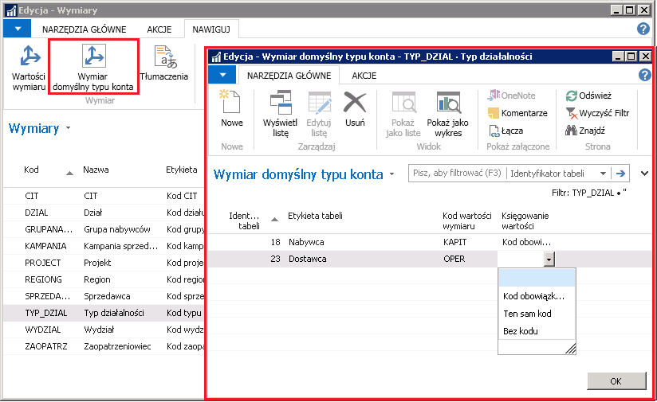{width="6.358490813648294in" height="3.8972933070866143in"}
  ------------------------------------------------------------------------------------
  Rysunek 1.44: Wymiar domyślny typu konta

### Domyślne wartości wymiarów można również przypisywać do kartotek nabywców i dostawców. W tym celu, należy postępować według następujących kroków:

1.  Należy otworzyć kartotekę wybranego nabywcy lub dostawcy i na
    wstążce wybrać **Wymiary**

> lub
>
> na liście nabywców lub dostawców zaznaczyć wiersze z wybranymi
> kontrahentami (lub jednym kontrahentem) i na wstążce wybrać **Wymiary
> -- zakres** (lub **Wymiary -- wiersz)**.

2.  W oknie **Wymiary domyślne**, które się otworzy, należy utworzyć
    nowy wiersz, wypełniając pola:

-   **Kod wymiaru --** w tym polu należy wybrać z listy rozwijanej
    > utworzony wcześniej wymiar.

-   **Kod wartości wymiaru -- w tym polu należy wybrać domyślną dla
    > wybranych kontrahentów (lub kontrahenta) wartość wymiaru.**

-   **Księgowanie wartości -- w tym polu należy wybrać jedną z opcji:**

```{=html}
<!-- -->
```
-   **pusta**

-   **Kod obowiązkowy**

-   **Ten sam kod**

-   **Bez kodu**.

  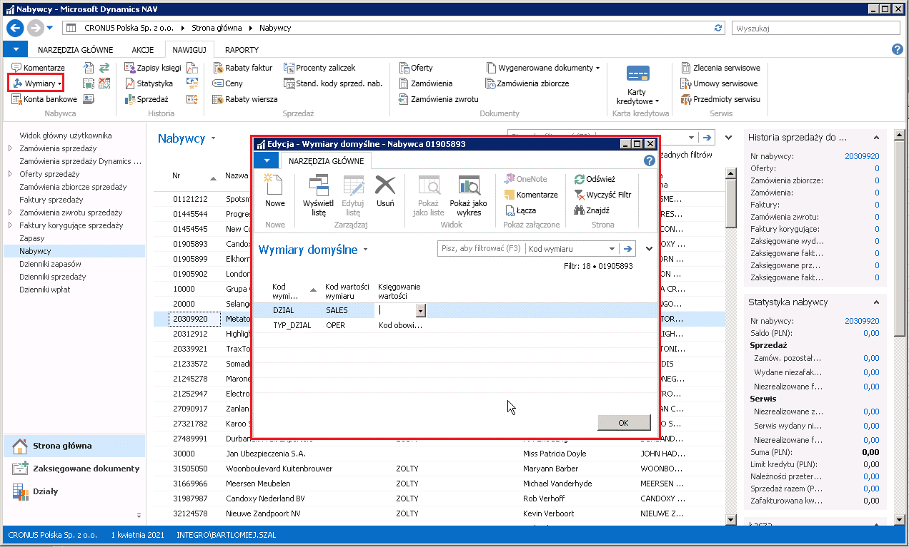{width="6.358490813648294in" height="3.834115266841645in"}
  -----------------------------------------------------------------------------------
  Rysunek 1.45: Wymiary domyślne -- lista nabywców

  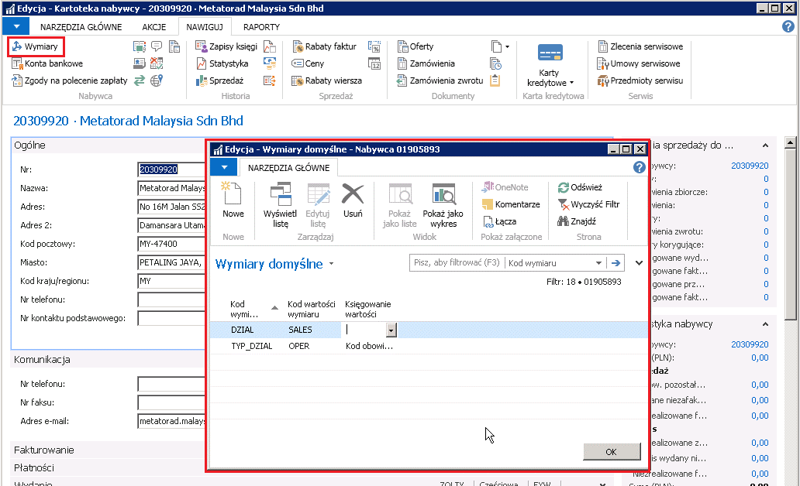{width="6.5in" height="3.954861111111111in"}
  ---------------------------------------------------------------------
  Rysunek 1.46: Wymiary domyślne -- kartoteka nabywcy

### Typ działalności można również przypisywać bezpośrednio do dokumentu, zarówno w kartotekach dokumentów, jak i w wierszach dzienników. Aby przypisać wartość wymiaru do dokumentu w wierszu dziennika, należy postępować według następujących kroków:

1.  W oknie **Dziennik główny** należy zaznaczyć wybrany wiersz i na
    wstążce, na karcie **Nawiguj**, wybrać **Wymiary**.

2.  W oknie **Edytuj zapisy zestawu wymiarów**, które się otworzy,
    należy ustawić żądaną wartość wymiaru odpowiedzialnego za podział
    różnic kursowych, wypełniając pola:

-   **Kod wymiaru -- w tym polu należy wybrać z listy rozwijanej
    > utworzony wcześniej wymiar.**

-   **Kod wartości wymiaru -- w tym polu należy wybrać właściwą wartość
    > wymiaru wybranego w polu Kod wymiaru.**

  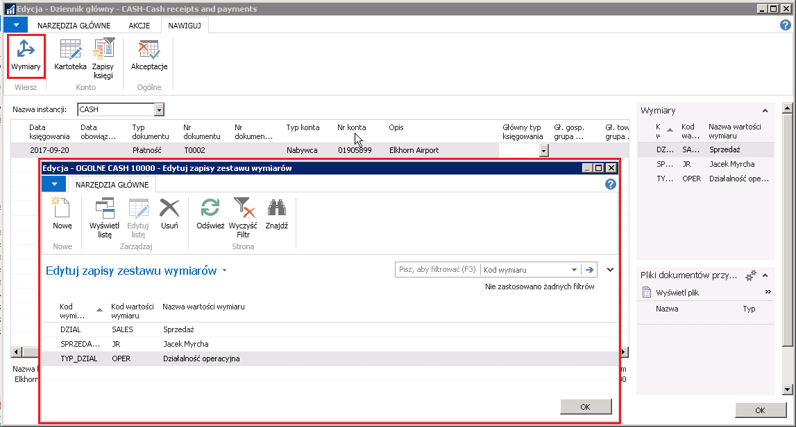{width="6.358490813648294in" height="3.4204057305336835in"}
  ------------------------------------------------------------------------------------
  Rysunek 1.47: Zapisy zestawu wymiarów wiersza dziennika głównego

### W celu przypisania typu działalności do dokumentu, należy postępować według następujących kroków:

1.  Należy otworzyć jedną z list lub kartotek dokumentów sprzedaży lub
    zakupu.

2.  W oknie, które się otworzy, należy na wstążce, na karcie
    **Nawiguj**, wybrać **Wymiary.**

```{=html}
<!-- -->
```
3.  W oknie **Edytuj zapisy zestawu wymiarów**, które się otworzy,
    należy ustawić żądaną wartość wymiaru odpowiedzialnego za podział
    różnic kursowych, wypełniając pola:

-   **Kod wymiaru -- w tym polu należy wybrać z listy rozwijanej
    > utworzony wcześniej wymiar.**

-   **Kod wartości wymiaru -- w tym polu należy wybrać właściwą wartość
    > wymiaru wybranego w polu Kod wymiaru.**

  ------------------------------------------------------
  Rysunek 1.48: Zapisy zestawu wymiarów faktury zakupu
  ------------------------------------------------------

  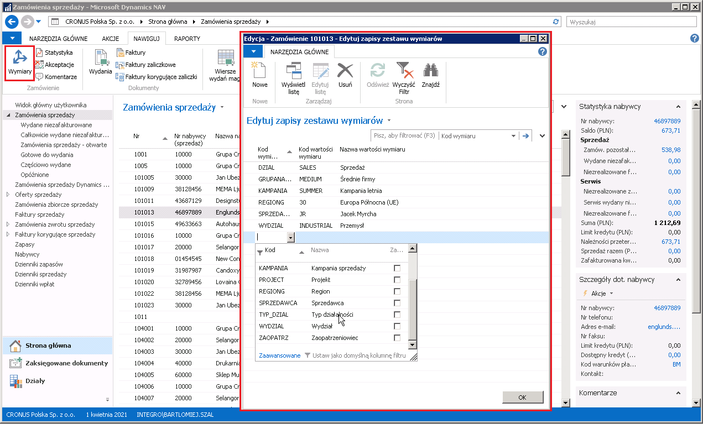{width="6.386792432195976in" height="3.8539107611548555in"}
  ------------------------------------------------------------------------------------
  Rysunek 1.49: Zapisy zestawu wymiarów zamówienia sprzedaży

### 

Wybrane elementy sprawozdania finansowego {#wybrane-elementy-sprawozdania-finansowego .Poziom-1}
-----------------------------------------

### Informacje ogólne

Bilans i rachunek zysków i strat są sprawozdaniami wymaganymi
przez polskie ustawodawstwo. Konstrukcja bilansu i rachunku zysków i
strat jest ściśle określona ustawą o rachunkowości i należy je
zaimplementować w aplikacji zgodnie z opublikowanymi wzorami.
Standardowa funkcjonalność systemu Microsoft Dynamics 365 Business
Central on‑premises dostarcza narzędzia do przygotowania m.in. bilansu i
rachunku zysków i strat, w postaci **Kategorii kont K/G**,
**Podkategorii kont** i **Arkuszy kont**. W ramach Polskiej Lokalizacji
przygotowane zostały rozszerzenia, ułatwiające sporządzanie tych
sprawozdań zgodnie z polskimi przepisami, zmiany obejmują:

-   Automatyczne generowanie pozycji bilansu oraz rachunku zysków i
    strat (wariant porównawczy) w **Kategoriach kont K/G** podczas
    tworzenia nowej firmy w Microsoft Dynamics 365 Business Central

-   Nowe opcje w **Kategoriach kont K/G**

-   Usprawnione zarządzanie kolejnością **Kategorii kont K/G**

-   Usprawnione generowanie **Arkuszy kont** na podstawie **Kategorii
    kont K/G**.

#### Kategorie kont {#kategorie-kont .Poziom-2}

### Nowe Kategorie kont stanowiące odwzorowanie pozycji bilansu oraz rachunku zysków i strat (w wersji porównawczej) generowane są automatycznie podczas tworzenia nowej firmy w Microsoft Dynamics 365 Business Central. Można również wymusić ich utworzenie uruchamiając *Codeunit 52063168* (spowoduje to usunięcie wszystkich powiązań kont księgi głównej z kategoriami). Zastępuje on całkowicie dotychczasowe, standardowe kategorie kont.

Pozycje bilansu w oknie **Kategorie kont K/G** odzwierciedlone są z
opcją **Aktywa** lub **Pasywa** w polu **Kategorii konta**, natomiast
pozycje rachunku zysków i strat -- z opcją **Przychód**.

  ----------------------------------
  Rysunek 1.50: Kategorie kont K/G
  ----------------------------------

W oknie **Kategorie kont K/G** zostało dodane pole **Typ źródła, za
pomocą którego można zmienić standardowy sposób liczenia salda dla danej
kategorii lub podkategorii. W polu dostępne są opcje:**

-   **K/G** -- kalkulacja salda zgodna ze standardem **Microsoft
    Dynamics 365 Business Central**;

-   **Należności** lub **Zobowiązania** -- umożliwia **pobranie salda
    należności lub salda zobowiązań (z ksiąg pomocniczych nabywców i
    dostawców) powiązanego z kontami księgi głównej przyporządkowanymi
    do danej kategorii lub podkategorii.** Konto przypisane do takiej
    podkategorii musi mieć przypisaną przeciwstawną podkategorię konta
    (szczegóły w podrozdziale *1.11.2 Bilans*);

-   **Rozliczenie** -- umożliwia umieszczenie salda konta księgi głównej
    w pozycji aktywów lub pasywów bilansu, w zależności od tego, czy
    saldo konta K/G jest dodatnie, czy ujemne. Konto przypisane do
    takiej podkategorii musi mieć przypisaną przeciwstawną podkategorię
    konta (szczegóły w podrozdziale *1.11.2 Bilans*).

> {width="0.19in" height="0.19in"}
> **Uwaga:** W sytuacji, gdy do danej podkategorii będzie przypisane
> więcej niż jedno konto K/G, saldo każdego z nich będzie rozpatrywane
> oddzielnie.

-   **Wynik** -- umożliwia umieszczenie salda konta K/G w pozycji
    przychodów lub kosztów rachunku zysków i strat, w zależności od
    tego, czy saldo konta K/G jest dodatnie, czy ujemne. Konto
    przypisane do takiej podkategorii musi mieć przypisaną przeciwstawną
    podkategorię konta (szczegóły w podrozdziale *1.11.3 Rachunek zysków
    i strat*).

> {width="0.19in" height="0.19in"}
> **Uwaga:** W sytuacji, gdy do danej podkategorii będzie przypisane
> więcej niż jedno konto K/G, rozpatrywana będzie suma sald wszystkich
> przypisanych kont K/G.

-   **Formuła** -- umożliwia ręczne przypisanie wybranych kont K/G do
    danej podkategorii, pomimo że dane konto zostało już przypisane do
    innej podkategorii. Przydatne do ustawienia pozycji rachunku zysków
    i strat „w tym" (szczegóły w podrozdziale *1.11.3 Rachunek zysków i
    strat*).

  --------------------------
  Rysunek 1.51: Typ źródła
  --------------------------

> {width="0.19in" height="0.19in"}
> **Uwaga:** Dla podkategorii z **Typem źródła** innym niż **K/G** lub
> **Formuła** zablokowana jest możliwość edycji pola **Konta K/G w
> kategorii**. Konfigurację dla takich podkategorii należy przeprowadzić
> z poziomu kartoteki konta K/G.

Zmianą w stosunku do standardowej funkcjonalności **Kategorii kont K/G**
jest możliwość dowolnej manipulacji kolejnością pozycji. Do tej pory
zmiana kolejności mogła się odbywać wyłącznie w ramach tego samego typu
kategorii (**Aktywa**, **Pasywa**, **Przychód** itp.). Rozszerzenie
umożliwia pełne zarządzanie kolejnością -- np. dzieckiem kategorii o
typie **Przychód** może być kategoria o typie **Aktywa** lub **Pasywa.**

#### Bilans {#bilans .Poziom-2}

### Informacje ogólne

### Rozszerzenia dodane w ramach Polskiej Lokalizacji dają możliwość takiego skonfigurowania wybranych pozycji bilansu, aby opierały się one wyłącznie o zapisy debetowe lub wyłącznie o zapisy kredytowe związane z księgami pomocniczymi nabywców i dostawców. Przepisy prawa wymagają takiej prezentacji należności i zobowiązań w bilansie. Ponadto salda niektórych kont księgi głównej mogą być prezentowane w aktywach lub pasywach, w zależności od tego, czy wykazują saldo debetowe, czy kredytowe -- w taki sposób należy prezentować np. rozrachunki publiczno-prawne.

### Ustawienia

W standardowej funkcjonalności systemu Microsoft Dynamics 365 Business
Central on‑premises konto księgi głównej może należeć tylko do jednej
kategorii/podkategorii kont. Niektóre pozycje bilansu sporządzanego
zgodnie z polskimi przepisami wymagają, aby jedno konto księgi głównej
przynależało do dwóch kategorii: należności i zobowiązań.

Jeżeli podkategoria konta, widoczna w kartotece konta księgi głównej,
jest oparta o źródło typu **Należności** lub **Zobowiązania**, należy
określić również przeciwstawną podkategorię dla tego konta, która ma
przeciwny typ źródła. W tym celu, należy wykonać następujące kroki:

1.  Należy wybrać **Działy \> Zarządzanie Finansami \> Księga główna \>
    Plan kont**.

2.  W oknie **Plan kont**, które się otworzy, należy ustawić kursor w
    wierszu z wybranym kontem rozrachunkowym używanym w konfiguracji
    **Grup księgowych nabywcy** lub **Grup księgowych dostawcy**, a
    następnie wybrać **Edytuj**.

3.  W oknie **Kartoteka konta K/G**, na karcie skróconej **Ogólne**,
    należy wypełnić pola zgodnie z poniższym opisem:

-   **Kategoria konta -- należy wybrać jedną z opcji:**

```{=html}
<!-- -->
```
-   **Aktywa** -- jeśli jest to konto rozrachunków z odbiorcami,

-   **Pasywa** -- jeśli jest to konto rozrachunków z dostawcami.

```{=html}
<!-- -->
```
-   **Podkategoria konta -- z listy rozwijanej w tym polu należy
    > wybrać:**

```{=html}
<!-- -->
```
-   podkategorię, dla której ustawione jest źródło typu **Należności**,
    > jeśli w polu **Kategoria konta** została wybrana opcja **Aktywa**,

-   podkategorię, dla której ustawione jest źródło typu
    > **Zobowiązania**, jeśli w polu **Kategoria konta** została wybrana
    > opcja **Pasywa**.

```{=html}
<!-- -->
```
-   **Przeciwst. podkategoria konta -- z listy rozwijanej w tym polu
    > należy wybrać:**

```{=html}
<!-- -->
```
-   podkategorię, dla której ustawione jest źródło typu
    > **Zobowiązania**, jeśli w polu **Kategoria konta** została wybrana
    > opcja **Aktywa**,

-   podkategorię, dla której ustawione jest źródło typu **Należności**,
    > jeśli w polu **Kategoria konta** została wybrana opcja **Pasywa**.

  -----------------------------------
  Rysunek 1.52: Kartoteka konta K/G
  -----------------------------------

W oknie **Kategorie kont K/G**, w polu **Konta K/G w kategorii**
prezentowany jest zestaw kont księgi głównej przyporządkowanych do danej
podkategorii. Konto przyporządkowane do podkategorii ze źródłem typu
**Należności**, powinno być przyporządkowane również do podkategorii ze
źródłem typu **Zobowiązania** i odwrotnie, aby zagwarantować ujęcie
wszystkich sald wszystkich kont księgi głównej w bilansie.

  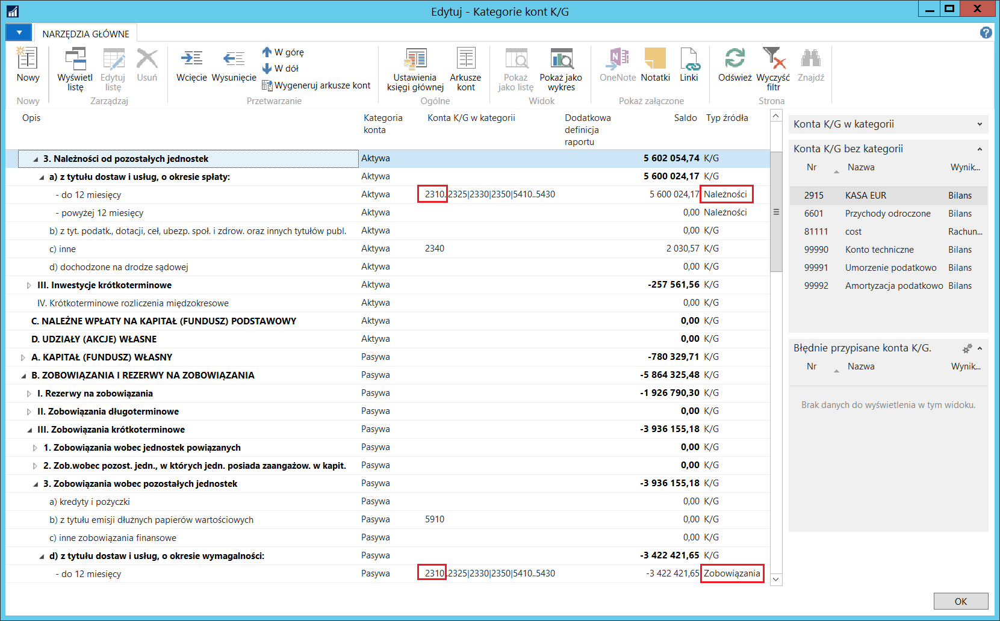{width="6.391666666666667in" height="3.971573709536308in"}
  -----------------------------------------------------------------------------------
  Rysunek 1.53: Kategorie kont K/G

Jeżeli podkategoria konta, widoczna w kartotece konta księgi głównej,
jest oparta o źródło typu **Rozliczenie**, należy określić przeciwstawną
podkategorię dla tego konta, również ze źródłem **Rozliczenie**, ale
przynależącą do przeciwnej kategorii. W tym celu, należy wykonać
następujące kroki:

1.  Należy wybrać **Działy \> Zarządzanie Finansami \> Księga główna \>
    Plan kont**.

2.  W oknie **Plan kont**, które się otworzy, należy ustawić kursor w
    wierszu z wybranym kontem księgi głównej, np. dotyczącym
    rozrachunków publiczno-prawnych, a następnie wybrać **Edytuj**.

3.  W oknie **Kartoteka konta K/G**, na karcie skróconej **Ogólne**,
    należy wypełnić pola zgodnie z poniższym opisem:

-   **Kategoria konta -- należy wybrać jedną z opcji: Aktywa lub
    > Pasywa**

-   **Podkategoria konta -- z listy rozwijanej w tym polu należy
    > wybrać** podkategorię, dla której ustawione jest źródło typu
    > **Rozliczenie,** przypisaną do kategorii wybranej w polu
    > **Kategoria konta**

-   **Przeciwst. podkategoria konta -- z listy rozwijanej w tym polu
    > należy wybrać** podkategorię, dla której ustawione jest źródło
    > typu **Rozliczenie**, przypisaną do kategorii przeciwnej do tej
    > wybranej w polu **Kategoria konta.**

  -----------------------------------
  Rysunek 1.54: Kartoteka konta K/G
  -----------------------------------

W oknie **Kategorie kont K/G**, w polu **Konta K/G w kategorii**
prezentowany jest zestaw kont księgi głównej przyporządkowanych do danej
podkategorii. Konto przyporządkowane do podkategorii ze źródłem typu
**Rozliczenie** w kategorii Aktywa, powinno być przyporządkowane również
do podkategorii ze źródłem typu **Rozliczenie** w kategorii Pasywa, aby
zagwarantować ujęcie wszystkich sald wszystkich kont księgi głównej w
bilansie.

  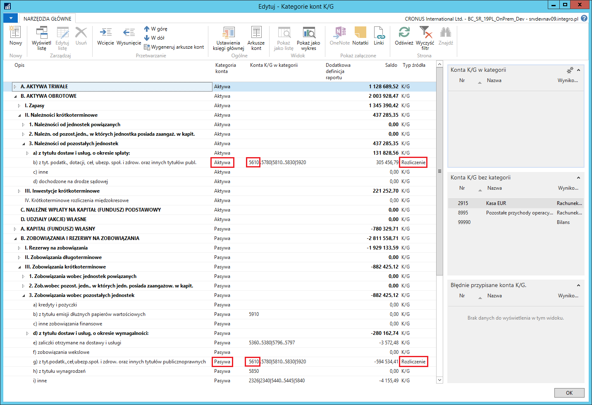{width="6.320754593175853in" height="4.334714566929134in"}
  -----------------------------------------------------------------------------------------------------------------------------------------------------------
  Rysunek 1.55: Kategorie kont K/G

Standardowa funkcjonalność systemu Microsoft Dynamics 365 Business
Central on‑premises zawiera pole informacji **Konta K/G bez kategorii**,
prezentujące konta księgi głównej, które nie zostały przypisane do
żadnej kategorii i podkategorii. W ramach Polskiej Lokalizacji zostało
dodane pole informacji **Błędnie przypisane konta K/G**, które
prezentuje konta księgi głównej przypisane wyłącznie do jednej
podkategorii, mającej źródło typu **Należności**, **Zobowiązania lub
Rozliczenie,** czyli analizującej wyłącznie zapisy po jednej stronie
danego konta. Aby w bilansie pojawiła się całość obrotów danego konta
księgi głównej, należy przypisać je do przeciwstawnej kategorii lub
wybrać dla niego kategorię ze źródłem typu **K/G**.

  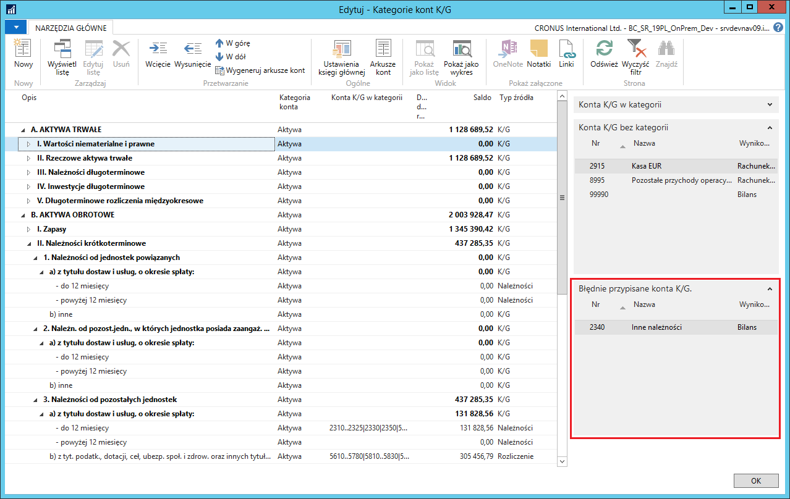{width="6.311321084864392in" height="3.99042760279965in"}
  ------------------------------------------------------------------------------------------------------------------------------------------------
  Rysunek 1.56: Kategorie kont K/G

### Obsługa

Na podstawie kategorii kont można w standardowy sposób wygenerować
arkusze kont, przy użyciu akcji **Wygeneruj arkusze kont** w oknie
**Kategorie kont K/G**. Funkcja generująca arkusze kont została
dostosowana w taki sposób, aby ustawiać typ źródła w poszczególnych
pozycjach bilansu w wygenerowanym arkuszu kont, na podstawie ustawienia
typów źródła poszczególnych podkategorii kont K/G. W przypadku
podkategorii z  typem źródła **Rozliczenie**, pod wierszem z pozycją
bilansu tworzone są wiersze techniczne z kontami księgi głównej
wchodzącymi w skład pozycji bilansu. W pozycjach z typem źródła
**Formuła** są prezentowane salda powiązanych z nimi kont księgi
głównej.

Arkusze kont mogą być też tworzone ręcznie. W tej sytuacji, w wierszu
arkusza kont jest możliwość zaznaczenia, że dane mają dotyczyć wyłącznie
należności lub zobowiązań, poprzez wybranie odpowiedniej opcji w polu
**Typ źródła**.

 **Uwaga:** Typ źródła **Należności** lub
**Zobowiązania** nie może być użyty, gdy:

**--** kwoty pochodzą z budżetu

**--** kwoty pochodzą z arkusza analitycznego

**--** kwoty mają być wyrażone w dodatkowej walucie raportowania

**--** kwota jest innego typu niż **Kwota netto**

W takich przypadkach wartość komórki arkusza nie będzie obliczona.

  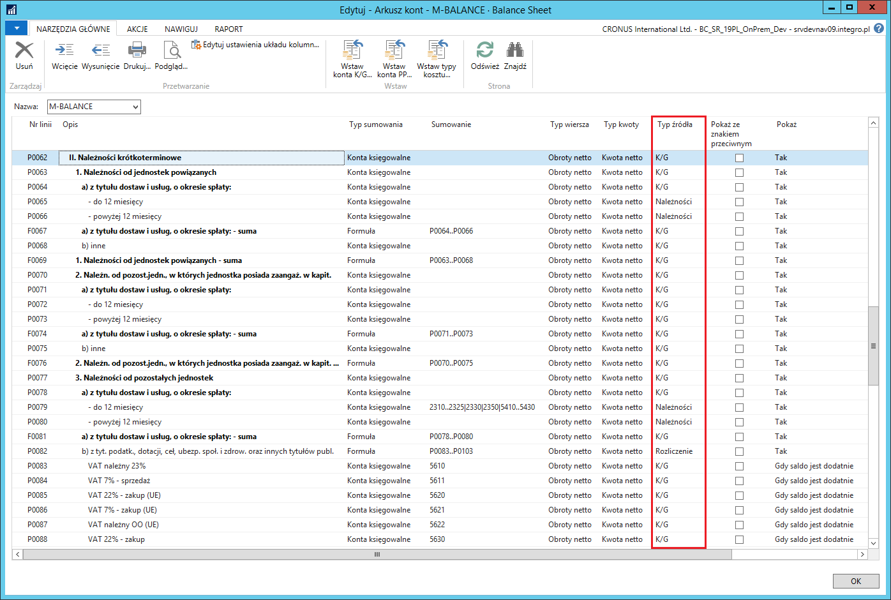{width="6.320754593175853in" height="4.256380139982502in"}
  -----------------------------------------------------------------------------------
  Rysunek 1.57: Arkusz kont

Aby w pozycjach z typem źródła **Należności** lub **Zobowiązania** saldo
było poprawnie obliczone, program analizuje zapisy szczegółowe ksiąg
nabywcy, dostawcy i pracownika, połączone z danym kontem księgi głównej
poprzez konfigurację **Grup księgowych nabywców**, **Grup księgowych
dostawców** i **Grup księgowych pracownika**. Wymagane jest, aby saldo
konta księgi głównej było zgodne z saldem w księgach pomocniczych do
niego przypisanych.

**[Przykład]{.underline}*:***

Konto księgi głównej połączone jest z wybraną **Grupą księgową
nabywców**. W tej grupie księgowej zaksięgowano fakturę na 100 zł i
płatność na 50 zł. Oto wyniki, które dla tego konta pokaże arkusz kont,
w zależności od wybranego typu źródła:

**K/G** 50 zł

**Należności** 100 zł

**Zobowiązania** 50 zł

W sytuacji, gdy faktura zostanie rozliczona z płatnością, wyniki będą
następujące:

**K/G** 50 zł

**Należności** 50 zł

**Zobowiązania** 0 zł

W powyższym przykładzie można zauważyć, że aby bilans ujmował całość
zapisów, konto musi wystąpić w dwóch pozycjach bilansu, raz jako
**Zobowiązania**, raz jako **Należności**. Alternatywnie jego obroty
można ująć całościowo (per saldo) w jednej pozycji z typem źródła
**K/G**.

Aby w pozycjach z typem źródła **Rozliczenie** saldo było poprawnie
obliczone, program analizuje znak kwoty salda każdego konta księgi
głównej przypisanego do danej pozycji.

**[Przykład]{.underline}*:***

Do dwóch pozycji bilansu z typem źródła **Rozliczenie** (jednej w
aktywach i jednej w pasywach) przypisane są trzy konta księgi głównej z
grupy rozrachunków publiczno-prawnych, prezentujące salda dodatnie i
ujemne:

**Konto nr 1** -50 zł

**Konto nr 2** 100 zł

**Konto nr 3** -250 zł

Oto wyniki, które dla tych kont pokaże arkusz kont:

**Aktywa** 100 zł

**Pasywa** 300 zł

W powyższym przykładzie można zauważyć, że aby w bilansie poprawnie
zostały zaprezentowane salda poszczególnych rozrachunków
publiczno-prawnych, każde powiązane z nimi konto księgi głównej musi
wystąpić w dwóch pozycjach bilansu, raz w **Aktywach**, raz w
**Pasywach**. Alternatywnie obroty tych kont można ująć całościowo (per
saldo) w jednej pozycji z typem źródła **K/G.**

#### Rachunek zysków i strat {#rachunek-zysków-i-strat .Poziom-2}

### Informacje ogólne

### Rozszerzenia dodane w ramach Polskiej Lokalizacji dają możliwość takiego skonfigurowania wybranych pozycji rachunku zysków i strat, aby opierały się one o te same konta księgi głównej, ale prezentowały wartość tylko w przychodach lub tylko w kosztach, w zależności od tego, czy suma ich sald jest dodatnia, czy ujemna. Przepisy prawa wymagają takiej prezentacji różnic kursowych walut w rachunku zysków i strat. Ponadto salda niektórych kont księgi głównej mogą być prezentowane w więcej niż jednej pozycji przychodów lub kosztów, np. w pozycjach „w tym".

### Ustawienia

W standardowej funkcjonalności systemu Microsoft Dynamics 365 Business
Central on‑premises konto księgi głównej może należeć tylko do jednej
kategorii/podkategorii kont. Niektóre pozycje rachunku zysków i strat
sporządzanego zgodnie z polskimi przepisami wymagają, aby jedno konto
księgi głównej przynależało do dwóch kategorii: przychodów i kosztów.

Jeżeli podkategoria konta występująca jako pozycja przychodów, widoczna
w kartotece konta księgi głównej, jest oparta o źródło typu **Wynik**,
należy określić również przeciwstawną podkategorię dla tego konta,
również ze źródłem **Wynik**, ale występującą jako pozycja kosztów (i
odwrotnie). W tym celu, należy wykonać następujące kroki:

1.  Należy wybrać **Działy \> Zarządzanie Finansami \> Księga główna \>
    Plan kont**.

2.  W oknie **Plan kont**, które się otworzy, należy ustawić kursor w
    wierszu z wybranym kontem księgi głównej, np. dotyczącym różnic
    kursowych, a następnie wybrać **Edytuj**.

3.  W oknie **Kartoteka konta K/G**, na karcie skróconej **Ogólne**,
    należy wypełnić pola zgodnie z poniższym opisem:

-   **Kategoria konta -- należy wybrać opcję Przychód**

-   **Podkategoria konta -- z listy rozwijanej w tym polu należy
    > wybrać** podkategorię, dla której ustawione jest źródło typu
    > **Wynik, należącą do grupy przychodów lub kosztów**

-   **Przeciwst. podkategoria konta -- z listy rozwijanej w tym polu
    > należy wybrać** podkategorię, dla której ustawione jest źródło
    > typu **Wynik**, należącą do grupy przychodów lub kosztów,
    > przeciwnej do grupy przynależności pozycji wybranej w polu
    > **Podkategoria konta**.

  -----------------------------------
  Rysunek 1.58: Kartoteka konta K/G
  -----------------------------------

W oknie **Kategorie kont K/G**, w polu **Konta K/G w kategorii**
prezentowany jest zestaw kont księgi głównej przyporządkowanych do danej
podkategorii. Konto przyporządkowane do podkategorii ze źródłem typu
**Wynik** w pozycji przychodów, powinno być przyporządkowane również do
podkategorii ze źródłem typu **Wynik** w pozycji kosztów, aby
zagwarantować poprawną prezentację dodatniego lub ujemnego wyniku
wybranych operacji w rachunku zysków i strat.

  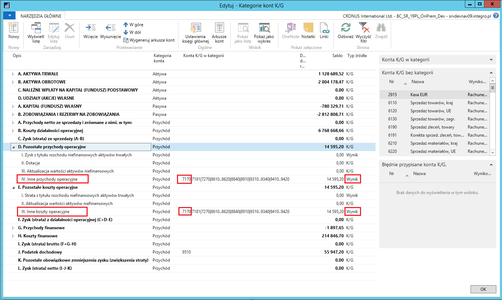{width="6.320754593175853in" height="3.7897517497812774in"}
  ------------------------------------------------------------------------------------
  Rysunek 1.59: Kategorie kont K/G

Standardowa funkcjonalność systemu Microsoft Dynamics 365 Business
Central on‑premises zawiera pole informacji **Konta K/G bez kategorii**,
prezentujące konta księgi głównej, które nie zostały przypisane do
żadnej kategorii i podkategorii. W ramach Polskiej Lokalizacji zostało
dodane pole informacji **Błędnie przypisane konta K/G**, które
prezentuje konta księgi głównej przypisane wyłącznie do jednej
podkategorii, mającej źródło typu **Wynik,** czyli prezentującej
wyłącznie saldo po jednej stronie danego konta. Aby w bilansie pojawiła
się całość obrotów danego konta księgi głównej, należy przypisać je
do przeciwstawnej kategorii lub wybrać dla niego kategorię ze źródłem
typu **K/G**.

  {width="6.311321084864392in" height="3.99042760279965in"}
  ------------------------------------------------------------------------------------------------------------------------------------------------
  Rysunek 1.60: Kategorie kont K/G

### W oknie Kategorie kont K/G, do nadrzędnych pozycji rachunku zysków i strat, zawierających treść „w tym", należy w polu Typ źródła wybrać opcję Formuła, a następnie w polu Konta K/G w kategorii wprowadzić odpowiedni zestaw kont księgi głównej. W ten sposób salda wybranych kont księgi głównej będą zaprezentowane dwukrotnie, w dwóch różnych, ale powiązanych ze sobą pozycjach.

  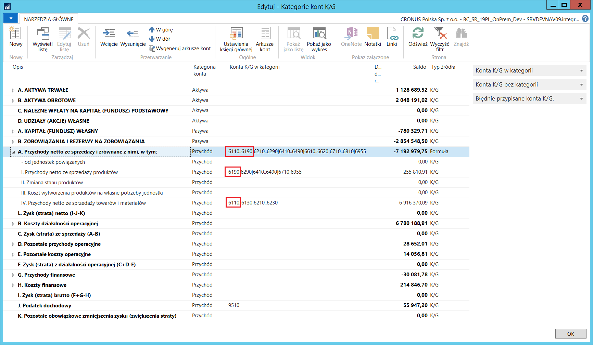{width="6.383333333333334in" height="3.718837489063867in"}
  -------------------------------------------------------------------------------------------------------------------------------------------------
  Rysunek 1.61: Kategorie kont K/G

### Obsługa

Na podstawie kategorii kont można w standardowy sposób wygenerować
arkusze kont, przy użyciu akcji **Wygeneruj arkusze kont** w oknie
**Kategorie kont K/G**. W ramach Polskiej Lokalizacji funkcja generująca
arkusze kont została dostosowana w taki sposób, aby ustawiać typ źródła
w poszczególnych pozycjach rachunku zysków i strat w wygenerowanym
arkuszu kont, na podstawie ustawienia typów źródła poszczególnych
podkategorii kont K/G.

Arkusze kont mogą być też tworzone ręcznie. W tej sytuacji, w wierszu
arkusza kont należy odpowiednio wypełnić pole **Typ źródła.**

  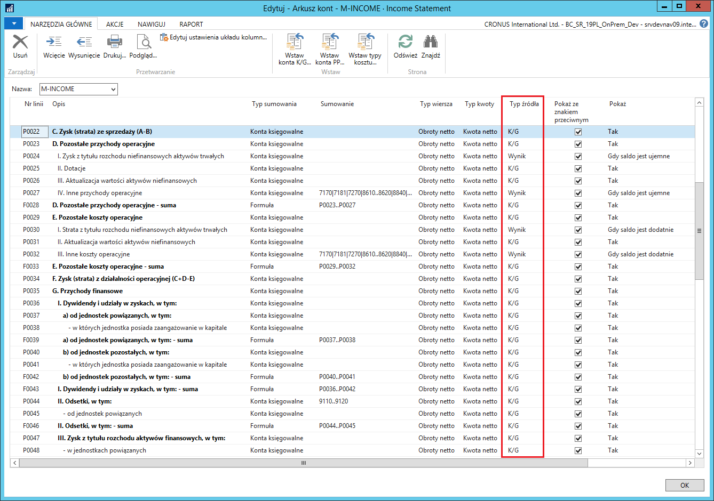{width="6.351397637795276in" height="4.462263779527559in"}
  -------------------------------------------------------------------------------------------------------------------------------------------------
  Rysunek 1.62: Arkusz kont

Aby w pozycjach z typem źródła **Wynik** saldo było poprawnie obliczone,
program analizuje znak kwoty sumy sald wszystkich kont księgi głównej
przypisanych do danej pozycji.

**[Przykład]{.underline}*:***

Do dwóch pozycji rachunku zysków i strat z typem źródła **Wynik**
(jednej w przychodach i jednej w kosztach) przypisane są trzy konta
księgi głównej, prezentujące salda dodatnie i ujemne:

**Konto nr 1** -50 zł

**Konto nr 2** 100 zł

**Konto nr 3** -250 zł

Oto wyniki, które dla tych kont pokaże arkusz kont:

**Przychody** 200 zł

**Koszty** 0 zł

W powyższym przykładzie można zauważyć, że aby w bilansie poprawnie
zostały ujęte salda niektórych kont księgi głównej, każde konto musi
wystąpić w dwóch pozycjach rachunku zysków i strat, raz w grupie
przychodów, raz w **grupie kosztów**. Alternatywnie obroty tych kont
można ująć całościowo (per saldo) w jednej pozycji z typem źródła
**K/G.**

Podział kosztów na podatkowe i niepodatkowe {#podział-kosztów-na-podatkowe-i-niepodatkowe .Poziom-1}
-------------------------------------------

### Informacje ogólne

Zgodnie z aktualnie obowiązującymi przepisami, podatnik może zaliczyć
tylko 75% wydatków związanych z używaniem samochodu do kosztów uzyskania
przychodu w przypadku, gdy wykorzystuje ten samochód również do celów
niezwiązanych z prowadzoną działalnością, czyli również do celów
prywatnych. W ramach Polskiej Lokalizacji w systemie Microsoft Dynamics
365 Business Central on‑premises zostało dodane narzędzie umożliwiające
poprawne i przejrzyste rozliczenie takich wydatków.

### Ustawienia

W celu ustawienia zasad alokacji kosztów, należy wykonać następujące
kroki:

1.  Należy wybrać **Działy \> Zarządzanie Finansami \> Administracja \>
    Zobowiązania \> Ustawienia \> Typy alokacji.**

2.  W oknie **Typy alokacji**, które się otworzy, należy na wstążce
    kliknąć **Nowy**.

3.  W oknie **Kartoteka typu alokacji** należy wypełnić pola zgodnie z
    poniższym opisem:

> Karta skrócona **Ogólne**:

-   **Kod** -- w tym polu należy wprowadzić unikalny kod identyfikujący
    dany schemat alokacji kosztów,

-   **Opis** -- w tym polu można wprowadzić opis danego schematu
    alokacji kosztów,

-   **Zachowaj pierwotny wiersz** -- zaznaczenie tego pola spowoduje,
    że źródłowy wiersz dokumentu z kosztem podlegającym alokowaniu
    nie zostanie usunięty po wykonaniu alokacji. Brak znacznika
    spowoduje, że wiersz źródłowy zostanie usunięty z dokumentu.

> Karta skrócona **Wiersze**:

-   **Typ** -- domyślnie ustawiona jest opcja **Konto K/G**, bez
    możliwości zmiany -- wskazuje na bezpośrednią ewidencję kosztu na
    kontach księgi głównej (ewidencja wartościowa),

```{=html}
<!-- -->
```
-   **Nr** -- z listy rozwijanej w tym polu należy wybrać właściwe dla
    ewidencji kosztów konto księgi głównej,

-   **Typ alokacji** -- z listy rozwijanej w tym polu należy wybrać
    wartość w dokumencie zakupu, która będzie dzielona w wyniku
    alokowania kosztu:

```{=html}
<!-- -->
```
-   **Ilość** -- nowe wiersze dokumentu zakupu zostaną utworzone w
    wyniku podzielenia wartości z pola **Ilość** w pierwotnym wierszu
    zakupu,

-   **Koszt jednostkowy** -- nowe wiersze dokumentu zakupu zostaną
    utworzone w wyniku podzielenia wartości z pola **Bezpośr. koszt
    jedn.** w pierwotnym wierszu zakupu.

```{=html}
<!-- -->
```
-   **Opis** -- pole opcjonalne -- w tym polu można wprowadzić krótki
    opis wiersza (np. zdefiniowanych w nim zasad alokacji),

-   **Udział** -- w tym polu należy wprowadzić wartość klucza podziału
    kosztów według udziału ilościowego -- na tej podstawie zostanie
    wyliczona wartość procentowa w polu **Procent**,

-   **Procent** -- pole nieedytowalne, prezentujące wartość klucza
    > podziału kosztów według udziału procentowego, wyliczonego na
    > podstawie wartości wprowadzonych w polu **Udział**.

> Do każdego wiersza alokacji można przypisać zestaw wartości wymiarów,
> który będzie miał zastosowanie w utworzonych wierszach dokumentu
> zakupu. Aby przypisać wartości wymiarów, w karcie skróconej
> **Wiersze** można wyświetlić kolumny z odpowiednimi wymiarami, lub
> zaznaczyć wiersz i kliknąć akcję **Wiersze**, następnie kliknąć
> **Wymiary** (można też nacisnąć **Ctrl+Shift+D**). Czynność należy
> powtórzyć dla każdego wiersza w oknie **Kartoteka typu alokacji**.

  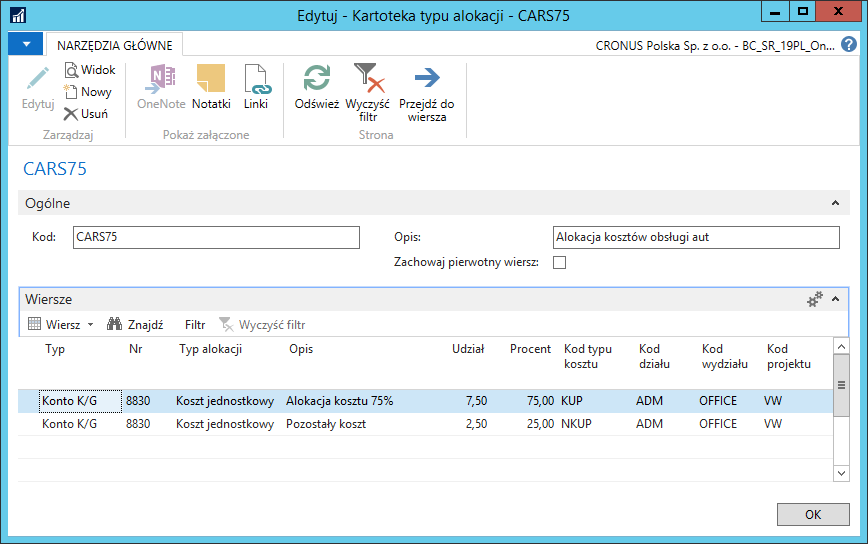{width="6.333333333333333in" height="3.9691590113735784in"}
  ------------------------------------------------------------------------------------
  Rysunek 1.63: Kartoteka typu alokacji

### Obsługa

Alokowanie kosztów w głównej mierze dotyczy wydatków, które należy
podzielić na podatkowe i niepodatkowe, dlatego funkcjonalność jest
dostępna w dokumentach zakupu typu faktura i zamówienie.

{width="0.19in" height="0.19in"}
**Uwaga:** Opis funkcji alokowania kosztów zamieszczony w dalszej części
rozdziału **bazuje na przykładzie faktury zakupu. W zamówieniu zakupu
mechanizm jest identyczny, więc należy wzorować się na opisie dotyczącym
faktury zakupu**.

W celu zaksięgowania kosztów z faktury zakupu według wybranego klucza
alokacji, należy wykonać następujące kroki:

1.  Należy wybrać **Działy \> Zarządzanie Finansami \> Zobowiązania \>
    Faktury zakupu.**

2.  W oknie **Faktury zakupu**, które się otworzy, należy na wstążce
    kliknąć **Nowy**.

3.  Należy wypełnić nagłówek i wiersze nowej faktury zakupu w
    standardowy sposób.

4.  W wybranych wierszach faktury z kosztami do alokowania należy z
    > listy rozwijanej w polu **Typ alokacji** wybrać wcześniej
    > zdefiniowany klucz, według którego ma zostać dokonany podział
    > kosztu z danego wiersza.

  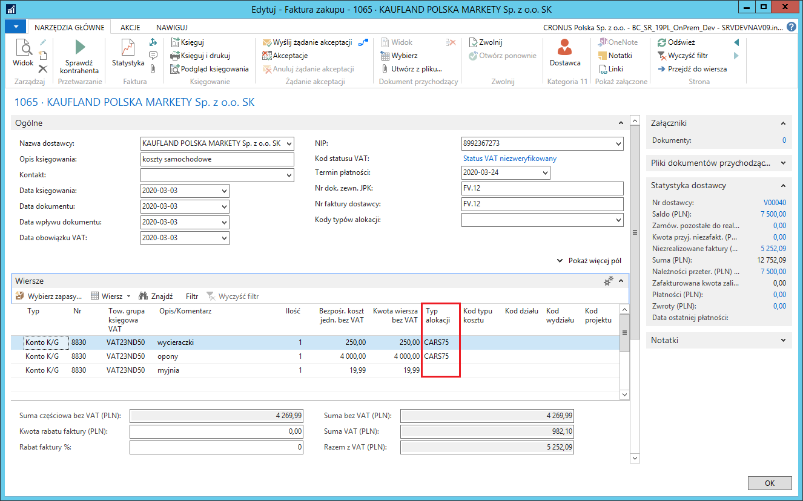{width="6.372112860892388in" height="3.9791666666666665in"}
  --------------------------------------------------------------------------------------------------------------------------------------------------
  Rysunek 1.64: Faktura zakupu

5.  Jeśli wszystkie koszty, we wszystkich wierszach faktury, mają zostać
    > podzielone według tego samego klucza, można w nagłówku dokumentu,
    > w karcie skróconej **Ogólne**, z listy rozwijanej w polu **Typ
    > alokacji** wybrać klucz, który zostanie skopiowany do wszystkich
    > wierszy.

> Zmiana wartości w polu **Typ alokacji** w karcie skróconej **Ogólne**
> w sytuacji, gdy istnieje choć jeden wiersz dokumentu, spowoduje
> wyświetlenie komunikatu, w którym należy kliknąć **Tak**, aby
> zastosować zmianę do wszystkich wierszy dokumentu.

  -------------------------
  Rysunek 1.65: Komunikat
  -------------------------

  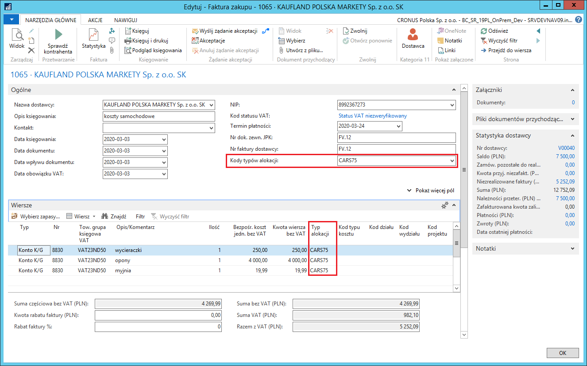{width="6.40625in" height="4.0004844706911635in"}
  ----------------------------------------------------------------------------------------------------------------------------------------
  Rysunek 1.66: Kartoteka typu alokacji

6.  Po przypisaniu typu alokacji do wszystkich wymaganych wierszy,
    > należy na wstążce kliknąć **Zaalokuj wszystkie wiersze**.

  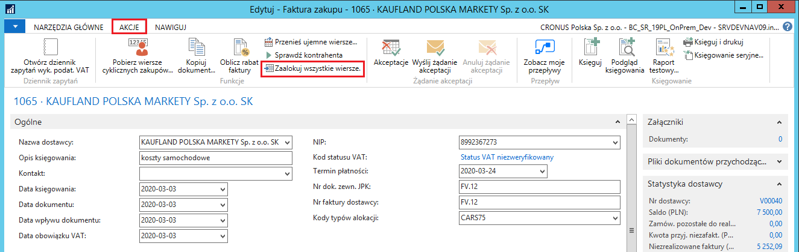{width="6.364583333333333in" height="2.017491251093613in"}
  -------------------------------------------------------------------------------------------------------------------------------------------------
  Rysunek 1.67: Faktura zakupu -- Zaalokuj wszystkie wiersze

W wyniku działania tej funkcji, system utworzył nowe wiersze faktury
zakupu na podstawie wybranego typu alokacji, włącznie z wymiarami.
Wiersz źródłowy, który podlegał alokowaniu, został zachowany lub
usunięty, w zależności od parametru **Zachowaj pierwotny wiersz**
ustawionego dla wybranego typu alokacji.

  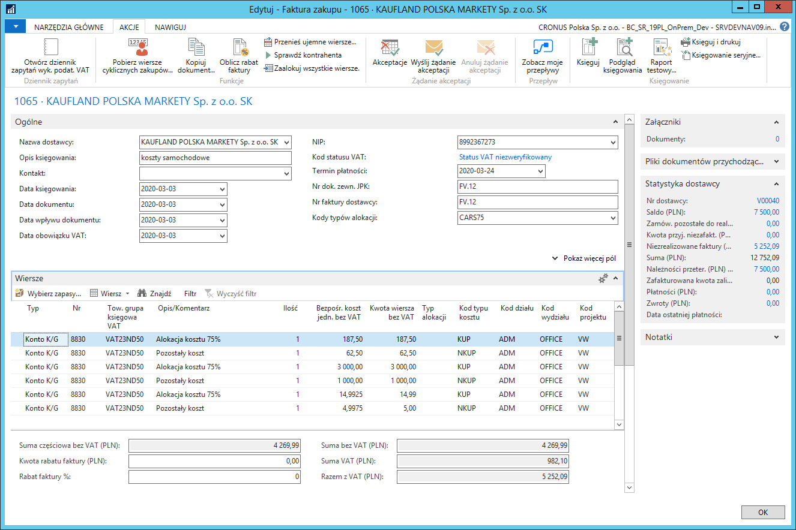{width="6.364583333333333in" height="4.243055555555555in"}
  -----------------------------------------------------------------------------------
  Rysunek 1.68: Faktura zakupu -- wiersze z zaalokowanymi kosztami

Dalsze procesy weryfikacji i księgowania faktury zakupu należy wykonać
w standardowy sposób.

Obsługa podatku VAT {#obsługa-podatku-vat .Rozdzial}
===================

1.  

```{=html}
<!-- -->
```
1.  

```{=html}
<!-- -->
```
1.  

Data obowiązku VAT {#data-obowiązku-vat .Poziom-1}
------------------

1.  

    1.  

#### Podstawowe ustawienia i transakcje z VAT {#podstawowe-ustawienia-i-transakcje-z-vat .Poziom-2}

### Informacje ogólne

Funkcjonalność **Data obowiązku VAT** została wprowadzona ze względu
na wymagania przepisów polskiego prawa, zgodnie z którymi podatek VAT
może być rozliczony w innym okresie niż dokument został zaksięgowany.

Funkcjonalność **Data obowiązku VAT** ma wpływ na sposób obsługi
poniższych elementów systemu:

-   Ustawienie funkcji **Daty obowiązku VAT**.

-   Księgowanie transakcji sprzedaży, zakupu i serwisu z **Datą
    > obowiązku VAT**.

-   Przekładanie podatku VAT w fakturach korygujących sprzedaży.

-   Przygotowanie deklaracji VAT.

-   Kalkulowanie i księgowanie podatku VAT.

-   Uzgadnianie podatku VAT z zapisami księgi głównej.

### Ustawienia

W celu ustawienia możliwości i sposobu obsługi **Daty obowiązku VAT**,
należy postępować według następujących kroków:

1.  Należy wybrać **Działy \> Zarządzanie Finansami \> Administracja \>
    Ustawienia księgi głównej.**

2.  W oknie **Ustawienia księgi głównej**, na karcie skróconej **VAT**
    należy wypełnić pola zgodnie z potrzebami:

-   **Użyj daty obowiązku VAT** -- zaznaczenie tego pola umożliwia
    > korzystanie z funkcjonalności **Data obowiązku VAT**, a system
    > kontroluje, czy pole **Data obowiązku VAT** nie jest puste
    > w transakcjach sprzedaży, zakupu i serwisu. Niezaznaczenie tego
    > pola powoduje, że w całym systemie, we wszystkich dokumentach
    > do pola **Data obowiązku VAT** kopiowana jest **Data
    > księgowania**, a system uniemożliwia ręczną zmianę daty obowiązku
    > VAT na inną.

-   **Dozw. księgowanie VAT od **-- w tym polu należy wprowadzić datę
    > początkową okresu, w jakim dozwolone jest rozliczanie podatku VAT
    > z księgowanych transakcji. Pozostawienie pola pustego powoduje,
    > że system nie kontroluje początku okresu rozliczenia VAT
    > i istnieje ryzyko, że podatek VAT z księgowanej transakcji może
    > zostać przypisany do okresu już rozliczonego.

-   **Dozw. księgowanie VAT do **-- w tym polu należy wprowadzić datę
    > końcową okresu, w jakim dozwolone jest rozliczanie podatku VAT
    > z księgowanych transakcji. Pozostawienie pola pustego powoduje,
    > że system nie kontroluje końca okresu rozliczenia VAT i istnieje
    > ryzyko, że podatek VAT z księgowanej transakcji może zostać
    > przypisany do okresu, który będzie rozliczany w dalekiej
    > przyszłości.

-   **Dozw. zmiana daty obowiązku VAT w wierszach** -- zaznaczenie tego
    > pola spowoduje umożliwienie wprowadzenia innej daty obowiązku VAT
    > w wierszach dokumentu, a to oznacza, że możliwe jest w takiej
    > sytuacji rozliczenie podatku VAT z każdego wiersza jednego
    > dokumentu w innym okresie. Domyślnie w każdym wierszu system
    > wstawi datę obowiązku VAT taką samą, jak w nagłówku, ale pozwoli
    > ją zmienić na inną.

> Pozostawienie pustego pola spowoduje, że system będzie kontrolował,
> czy data obowiązku VAT w nagłówku dokumentu jest taka sama,
> jak w wierszach.

-   **Użyj przełożonego VAT** -- zaznaczenie tego pola oznacza
    > pozwolenie na używanie funkcji **Przełożony VAT**.

> {width="0.19in" height="0.19in"}
> **Uwaga:** Funkcja **Przełożony VAT** wykorzystana jest do oznaczania
> faktur korygujących sprzedaży jako podpisane przez odbiorcę.
>
> Zaznaczenie pola **Użyj przełożonego VAT** możliwe jest tylko
> w sytuacji, gdy zaznaczone jest pole **Użyj daty obowiązku VAT.**

-   **Zezwalaj na przełożony VAT w wierszu --** zaznaczenie tego pola
    > spowoduje, że możliwe będzie zaznaczanie lub odznaczanie pola
    > **Przełożony VAT w **wierszach dokumentu, niezależnie od tego, czy
    > pole **Przełożony VAT** w nagłówku jest zaznaczone. Domyślnie
    > w każdym wierszu system wstawi znacznik w polu **Przełożony VAT**,
    > jeśli pole to jest zaznaczone w nagłówku, ale pozwoli na zmianę
    > w wierszach.

3.  Na karcie skróconej **Ogólne** jest pole **Drukowanie specyfikacji
    > VAT w PLN** -- zaznaczenie tego pola powoduje, że specyfikacja VAT
    > na dokumentach sprzedaży wystawionych w walucie obcej drukowana
    > jest w PLN.

  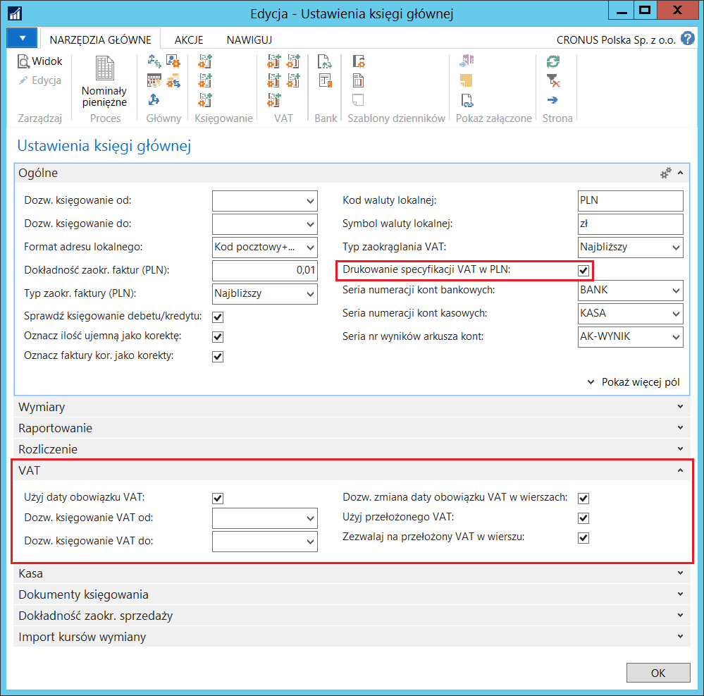{width="6.4in" height="6.323418635170603in"}
  ---------------------------------------------------------------------
  Rysunek 2.1: Ustawienia księgi głównej

4.  Należy wybrać **Działy \> Zarządzanie Finansami \> Administracja \>
    Ustawienia sprzedaży i należności**.

5.  W oknie **Ustawienia sprzedaży i należn.**, na karcie skróconej
    **Ogólne** należy zaznaczyć pole **Potwierdzenie faktury
    korygującej**, jeśli podatek VAT z faktur korygujących sprzedaży ma
    być automatycznie traktowany jako **Przełożony VAT** do chwili, aż
    dokument zostanie podpisany przez odbiorcę.

  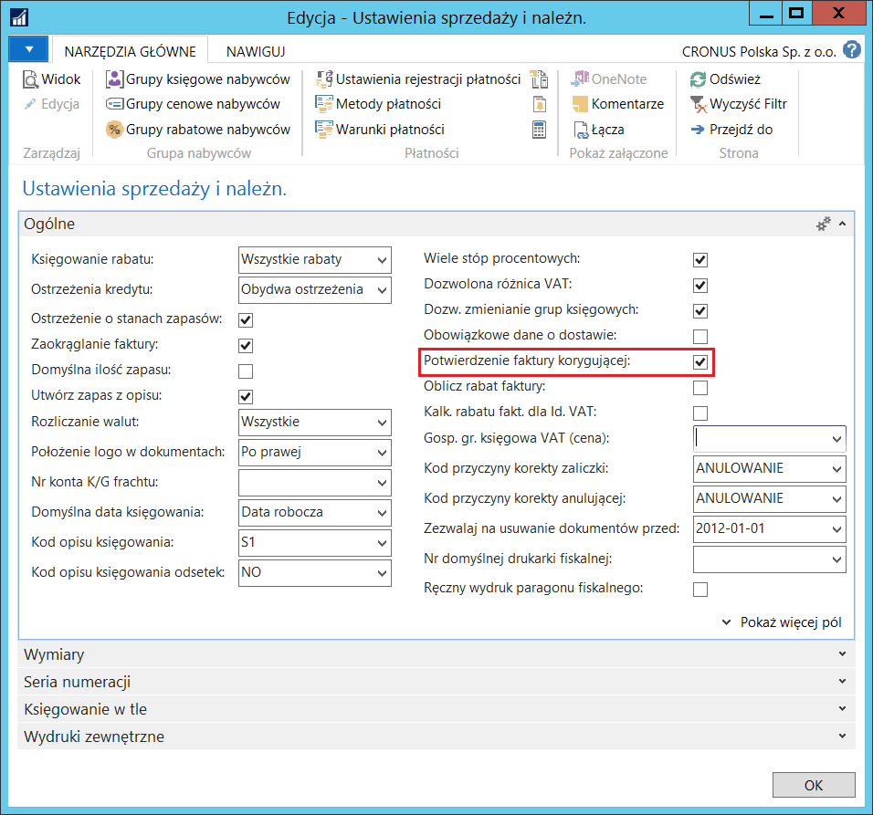{width="6.3698961067366575in" height="5.95in"}
  -----------------------------------------------------------------------
  Rysunek 2.2: Ustawienia sprzedaży i należności

Po zdefiniowaniu podstawowych ustawień dla **Daty obowiązku VAT** można,
na wzór standardowej funkcjonalności dla dozwolonych okresów
księgowania, ustawić dozwolone okresy VAT, czyli, oprócz ogólnego
ustawienia w oknie **Ustawienia księgi głównej**, można definiować
ustawienia dla poszczególnych użytkowników. W tym celu należy postępować
według następujących kroków:

1.  Należy wybrać **Działy \> Administracja \> Użytkownicy \> Ustawienia
    użytkownika**.

2.  W oknie **Ustawienia użytkownika**, które się otworzy, w wierszu
    z ustawieniami wybranego użytkownika, należy uzupełnić pola:

-   **Dozw. księgowanie VAT od **-- w tym polu należy wprowadzić datę
    > początkową okresu, w jakim dozwolone dla wybranego użytkownika
    > jest rozliczanie podatku VAT z księgowanych transakcji.
    > Pozostawienie pola pustego powoduje, że system nie kontroluje
    > początku okresu rozliczenia VAT i istnieje ryzyko, że podatek VAT
    > z księgowanej transakcji może zostać przypisany do okresu już
    > rozliczonego.

-   **Dozw. księgowanie VAT do **-- w tym polu należy wprowadzić datę
    > końcową okresu, w jakim dozwolone jest rozliczanie podatku VAT
    > z księgowanych transakcji. Pozostawienie pola pustego powoduje,
    > że system nie kontroluje końca okresu rozliczenia VAT i istnieje
    > ryzyko, że podatek VAT z księgowanej transakcji może zostać
    > przypisany do okresu, który będzie rozliczany w dalekiej
    > przyszłości.

> {width="0.19in" height="0.19in"}
> **Uwaga:** Jeśli obydwa pola: **Dozw. księgowanie VAT od i Dozw.
> księgowanie VAT do są **puste w wierszu z ustawieniami wybranego
> użytkownika w oknie **Ustawienia użytkownika**, system traktuje
> to jako brak ustawienia szczególnego okresu VAT dla tego użytkownika
> i stosuje dla niego dozwolony okres ustawiony w oknie **Ustawienia
> księgi głównej.**
>
> Ustawienia zdefiniowane w oknie **Ustawienia użytkownika** mają wyższy
> priorytet niż ustawienia zdefiniowane w oknie **Ustawienia księgi
> głównej.** Oznacza to, że dla wybranych użytkowników można ustawić
> inne dozwolone okresy VAT (w oknie **Ustawienia użytkownika**),
> niż obowiązujące dla pozostałych użytkowników (w oknie **Ustawienia
> księgi głównej**), nie mających specjalnych ustawień w oknie
> **Ustawienia użytkownika**.

  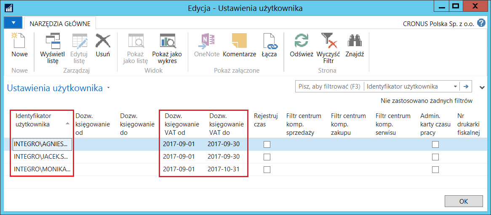{width="6.4in" height="2.810255905511811in"}
  ---------------------------------------------------------------------
  Rysunek 2.3: Ustawienia użytkownika

Zdarza się, iż okresy sprawozdawcze VAT i okresy obrachunkowe się nie
pokrywają. Aby ułatwić raportowanie i księgowanie VAT zgodne z okresami
VAT oraz tworzenie wewnętrznych i ustawowych raportów zgodnych
z okresami obrachunkowymi, w ramach funkcji **Data obowiązku VAT**
zostały dodane **Okresy VAT**.

W celu ich zdefiniowania należy postępować według następujących kroków:

1.  Należy wybrać **Działy \> Zarządzanie Finansami \> Administracja \>
    Okresy VAT**.

2.  W oknie **Okresy VAT**, które się otworzy, należy wybrać **Utwórz
    okresy**.

3.  W oknie **Utwórz okres VAT**, które się otworzy, należy wypełnić
    pola:

-   **Data początkowa** -- w tym polu należy wprowadzić datę początkową
    > roku rozliczeniowego dla podatku VAT

-   **Liczba okresów** -- w tym polu należy wprowadzić ilość okresów,
    > które składają się na rok rozliczenia podatku VAT

-   **Długość okresu** -- w tym polu należy wprowadzić formułę,
    > na podstawie której zostanie obliczona długość jednego okresu roku
    > rozliczenia podatku VAT, np. 1M = 1 miesiąc, 3M = 3 miesiące itp.

  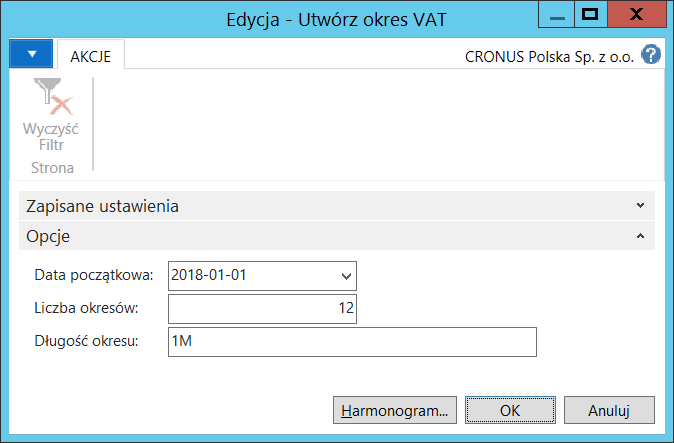{width="4.543307086614173in" height="2.984251968503937in"}
  -----------------------------------------------------------------------------------
  Rysunek 2.4: Tworzenie okresów VAT

4.  Zatwierdzenie przyciskiem **OK** w poprzednim oknie, powoduje
    automatyczne dodanie kolejnych wierszy w oknie **Okresy VAT**,
    zgodnie z wprowadzonymi parametrami podczas tworzenia okresów:

  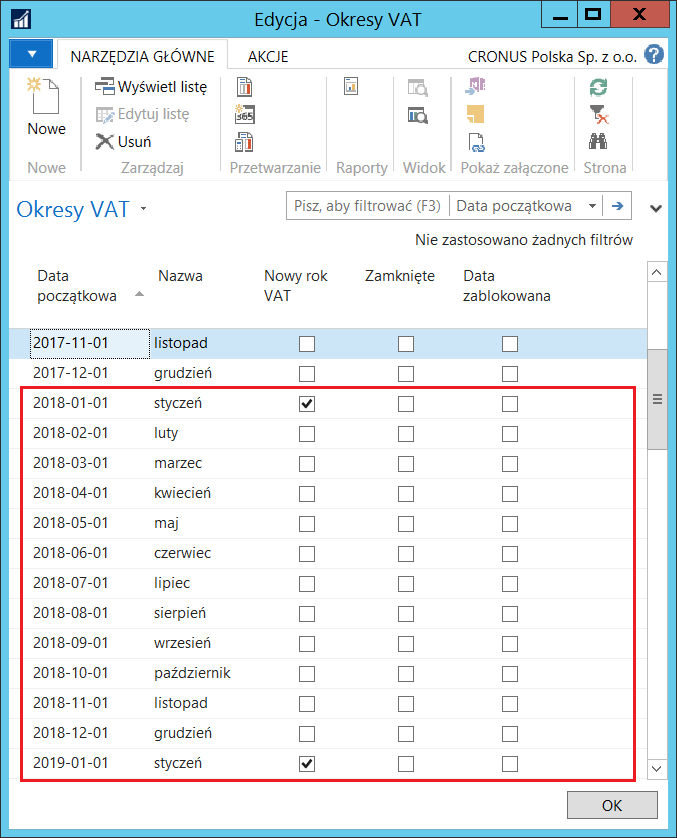{width="4.559055118110236in" height="5.641732283464567in"}
  -----------------------------------------------------------------------------------
  Rysunek 2.5: Okresy VAT

> Dla podatku VAT zaksięgowanego z transakcji oznaczonych jako
> **Przełożony VAT**, konieczne jest wskazanie kont księgi głównej,
> które mogą być inne niż te przeznaczone do księgowania zwykłego
> podatku VAT należnego i naliczonego. W tym celu należy postępować
> według następujących kroków:

1.  Należy wybrać **Działy \> Zarządzanie Finansami \> Administracja \>
    > Ustawienia księgowe VAT**.

2.  W oknie **Ustawienia księgowe VAT**, które się otworzy, należy
    > zaznaczyć wiersz z wybraną kombinacją kodów w polach **Gosp. grupa
    > księgowa VAT** i **Tow. grupa księgowa VAT**, a następnie wybrać
    > **Edycja**.

3.  W oknie **Kartoteka ustaw. księg. VAT**, które się otworzy,
    > na karcie skróconej **Sprzedaż** należy uzupełnić pole **Konto
    > przełoż. należnego VAT**, a na karcie skróconej **Zakupy** należy
    > uzupełnić pola: **Konto przełoż. naliczonego VAT i Konto przełoż.
    > odwrotnego obciążenia**. W wymienionych polach można rozwinąć
    > listę kont księgi głównej i wybrać spośród nich właściwe.

  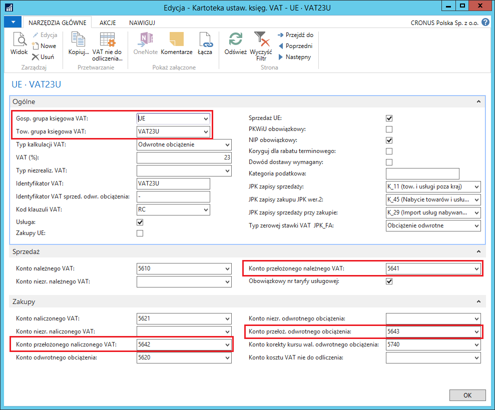{width="6.382731846019247in" height="5.291666666666667in"}
  -----------------------------------------------------------------------------------
  Rysunek 2.6: Konta do księgowania przełożonego VAT

### Obsługa

Aby księgować transakcje zakupu, sprzedaży i serwisu z wykorzystaniem
funkcjonalności **Data obowiązku VAT**, użytkownik musi mieć możliwość
wprowadzania daty obowiązku VAT we wszystkich właściwych oknach
w systemie: nagłówkach i wierszach dokumentów, wierszach dzienników itp.
W celu zaksięgowania np. transakcji zakupu z użyciem funkcjonalności
**Data obowiązku VAT**, należy postępować według następujących kroków:

1.  Należy wybrać **Działy \> Zarządzanie Finansami \> Zobowiązania \>
    > Faktury zakupu.**

2.  W oknie, które się otworzy, należy wybrać **Nowe** i standardowo
    > wprowadzić dane o fakturze zakupu.

3.  Na karcie skróconej **Ogólne** pole **Data obowiązku VAT** jest
    > wypełniane automatycznie przez system. Przyjmowana jest wartość
    > z pola **Data dokumentu** lub z pola **Data wpływu dokumentu**,
    > w zależności od tego, która z nich jest późniejsza. Należy zmienić
    > datę w polu **Data obowiązku VAT na **inną niż domyślna.

4.  Na karcie skróconej **Wiersze**, należy zwrócić uwagę na pole **Data
    > obowiązku VAT** -- powinno przyjąć wartość taką samą, jak w polu
    > **Data obowiązku VAT** na karcie skróconej **Ogólne**. Jeśli
    > w ustawieniach dozwolona jest zmiana daty obowiązku VAT
    > w wierszach, należy zmienić datę w polu **Data obowiązku VAT
    > na **inną niż domyślna.

  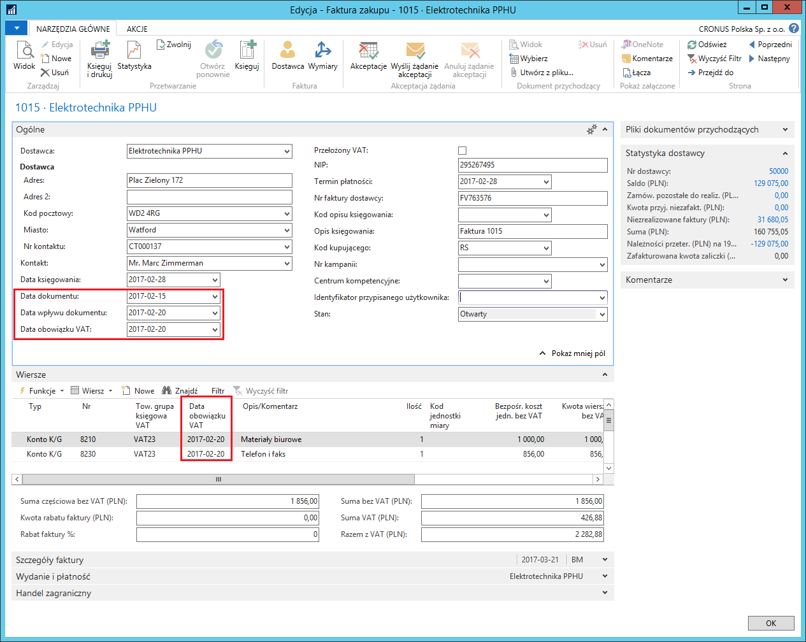{width="6.37599956255468in" height="5.081045494313211in"}
  ----------------------------------------------------------------------------------
  Rysunek 2.7: Data obowiązku VAT w fakturze zakupu

5.  Należy zaksięgować fakturę zakupu.

6.  Należy sprawdzić daty obowiązku VAT w zaksięgowanej fakturze zakupu.
    > W tym celu należy wybrać **Działy \> Zarządzanie Finansami \>
    > Archiwum \> Zaksięgowane faktury zakupu.**

7.  Wybraną zaksięgowaną fakturę zakupu należy wyświetlić w formie
    > kartoteki:

  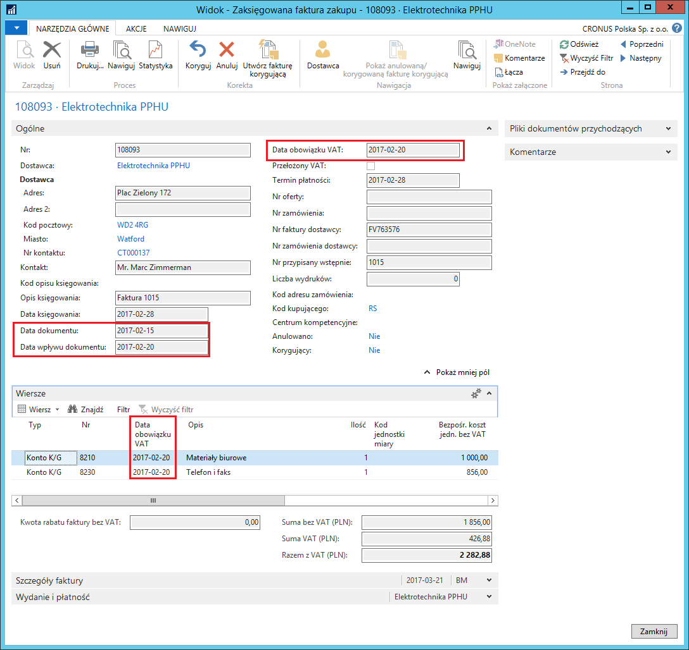{width="6.43200021872266in" height="6.077415791776028in"}
  ----------------------------------------------------------------------------------
  Rysunek 2.8: Data obowiązku VAT w zaksięgowanej fakturze zakupu

8.  Można też sprawdzić, jak daty obowiązku VAT zostały zapisane w oknie
    **Zapisy VAT**. W tym celu, w zaksięgowanej fakturze zakupu należy
    wybrać **Nawiguj**, następnie należy zaznaczyć wiersz **Zapis VAT**
    i wybrać **Pokaż powiązane zapisy**:

  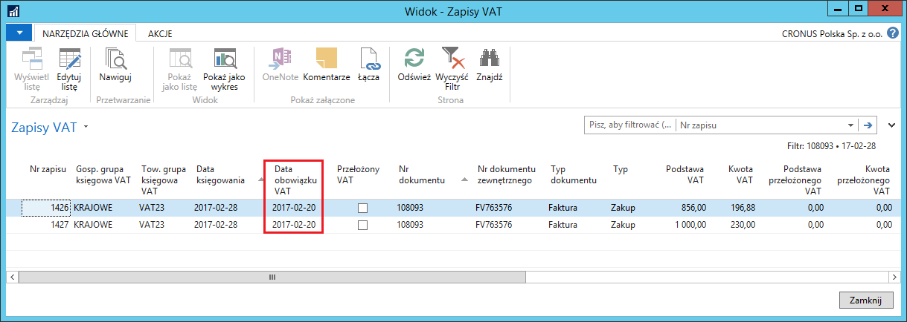{width="6.40799978127734in" height="2.2811384514435695in"}
  -----------------------------------------------------------------------------------
  Rysunek 2.9: Data obowiązku VAT w zapisach VAT

> {width="0.19in"
> height="0.19in"}**Uwaga:** Pole **Data obowiązku VAT** jest dostępne
> do edycji w następujących dokumentach: Zamówienie **zakupu, Faktura
> zakupu, Zamówienie zwrotu zakupu, Faktura korygująca zakupu,
> Zamówienie sprzedaży, Faktura sprzedaży, Zamówienie zwrotu sprzedaży,
> Faktura korygująca sprzedaży.** Datę obowiązku VAT można też edytować
> w wierszach dzienników głównych oraz w oknie **VAT-dodatkowe
> informacje**.
>
> Po zaksięgowaniu transakcji z VAT, data obowiązku VAT zapisywana jest
> w zaksięgowanych dokumentach: **Zaksięgowana faktura zakupu,
> Zaksięgowana faktura korygująca zakupu, Zaksięgowana faktura
> sprzedaży, Zaksięgowana faktura korygująca sprzedaży**. Data obowiązku
> VAT zapamiętana jest również w tabelach: **Zapis VAT**
> oraz **Szczegółowy zapis VAT.**

VAT pochodzący z różnych transakcji może być rozliczany w okresie innym
niż księgowana jest transakcja podlegająca opodatkowaniu. Okres
rozliczenia zależy od różnych czynników i może być ustalany w różny
sposób. W sytuacji, gdy okres rozliczenia podatku VAT zależy od terminu
zapłaty, zastosowanie mają ustawienia związane z VAT niezrealizowanym,
a kwota podatku może być księgowana na odrębnych kontach. W sytuacji,
gdy okres rozliczenia VAT jest znany w momencie księgowania transakcji,
można od razu wybrać okres rozliczenia wprowadzając właściwą datę
obowiązku VAT, która może różnić się od daty księgowania. W sytuacji,
gdy z jakichś przyczyn okres rozliczenia VAT nie jest znany w momencie
księgowania transakcji podlegającej opodatkowaniu, można użyć
funkcjonalności przełożonego VAT, a podatek może być zaksięgowany
na odrębnym koncie KG. Zasady te dotyczą zarówno normalnego VAT,
jak i odwrotnego obciążenia. W oknie **Kartoteka ustaw. księg. VAT**
dla każdej kombinacji grup **Gosp. grupa księgowa VAT** i **Tow. grupa
księgowa VAT** można przypisać oddzielne konta KG do księgowania kwoty
podatku VAT przełożonego i niezrealizowanego, dotyczy to również
odwrotnego obciążenia, która też może być przełożona
lub niezrealizowana.

W sytuacji, gdy podatek VAT jest jednocześnie przełożony
i niezrealizowany, konieczne jest zachowanie właściwej kolejności w jego
realizacji: najpierw realizacja przełożonego VAT (funkcją **Realizuj
przełożony VAT** uruchamianą w oknie **Arkusz rozliczania VAT**),
a później realizacja niezrealizowanego VAT (poprzez rozliczenie
należności lub zobowiązania z płatnością). Polska Lokalizacja w ramach
obsługi podatku VAT została wyposażona w zabezpieczenia, które nie
dopuszczają innej kolejności realizacji podatku VAT.

W sytuacji, gdy kwota odwrotnego obciążenia jest jednocześnie przełożona
i niezrealizowana, obowiązują zasady opisane powyżej. Jeżeli w odwrotnym
obciążeniu wystąpiła różnica w kursie wymiany, może ona zostać
zaksięgowana po realizacji przełożonego i niezrealizowanego VAT.

#### Przełożony VAT (oznaczanie podpisanych faktur korygujących sprzedaży) {#przełożony-vat-oznaczanie-podpisanych-faktur-korygujących-sprzedaży .Poziom-2}

**Przełożony VAT** to funkcjonalność wykorzystywana, gdy kwota podatku
VAT musi zostać zawieszona, ze względu na brak możliwości jej
rozliczenia w danym momencie.

**Przełożony VAT** ma szczególne znaczenie w obsłudze faktur
korygujących sprzedaży. Zgodnie z przepisami polskiego prawa, podatek
VAT z tytułu faktury korygującej sprzedaży może być obniżony dopiero
po otrzymaniu potwierdzenia, iż odbiorca otrzymał fakturę korygującą
sprzedaży. Stąd wynika potrzeba przełożenia zmniejszenia kwoty podatku
VAT na okres pomiędzy wystawieniem faktury korygującej sprzedaży
a otrzymaniem potwierdzenia.

Funkcjonalność **Przełożonego VAT** zostanie opisana na przykładzie
faktur korygujących sprzedaży, ale może być wykorzystana w następujących
dokumentach: **Zamówienie zakupu, Faktura zakupu, Zamówienie zwrotu
zakupu, Faktura korygująca zakupu, Zamówienie sprzedaży, Faktura
sprzedaży, Zamówienie zwrotu sprzedaży, Faktura korygująca sprzedaży.**
Pole **Przełożony VAT** można też edytować w wierszach dzienników
głównych oraz w oknie **VAT-dodatkowe informacje**. Po zaksięgowaniu
transakcji z VAT, informacja o przełożonym podatku VAT zapisywana jest
w zaksięgowanych dokumentach: **Zaksięgowana faktura zakupu,
Zaksięgowana faktura korygująca zakupu, Zaksięgowana faktura sprzedaży,
Zaksięgowana faktura korygująca sprzedaży**. **Przełożony VAT**
zapamiętany jest również w tabelach: **Zapis VAT** oraz **Szczegółowy
zapis VAT.**

> {width="0.19in" height="0.19in"}
> **Uwaga:** Pole **Przełożony VAT** może być automatycznie zaznaczane
> w dokumentach **Faktura korygująca sprzedaży i Zamówienie zwrotu
> sprzedaż**, jeśli pole **Potwierdzenie faktury korygującej** w oknie
> **Ustawienia sprzedaży i należn.** jest zaznaczone, w przeciwnym
> wypadku, pole **Przełożony VAT**, w razie potrzeby, musi być
> zaznaczane ręcznie w ww. dokumentach.
>
> W pozostałych dokumentach pole **Przełożony VAT** musi być zawsze
> zaznaczane ręcznie, jeśli użycie przełożonego VAT jest wymagane.

Warunkiem do rozpoczęcia korzystania z funkcjonalności **Przełożony
VAT** jest zdefiniowanie właściwych ustawień, opisanych na początku tego
rozdziału.

W celu wystawienia faktury korygującej sprzedaży, należy postępować
według następujących kroków:

1.  Należy wybrać **Działy \> Zarządzanie Finansami \> Należności \>
    > Faktury korygujące sprzedaży.**

2.  W oknie, które się otworzy, należy wybrać **Nowe** i standardowo
    > wprowadzić dane faktury korygującej sprzedaży.

3.  Na karcie skróconej **Ogólne**, należy zwrócić uwagę na pole
    > **Przełożony VAT** -- powinno przyjąć wartość zgodną z wcześniej
    > zdefiniowanymi ustawieniami.

4.  Na karcie skróconej **Wiersze**, należy zwrócić uwagę,
    > że **Przełożony VAT** -- przyjęło wartość taką samą, jak w polu
    > **Przełożony VAT** na karcie skróconej **Ogólne**.

  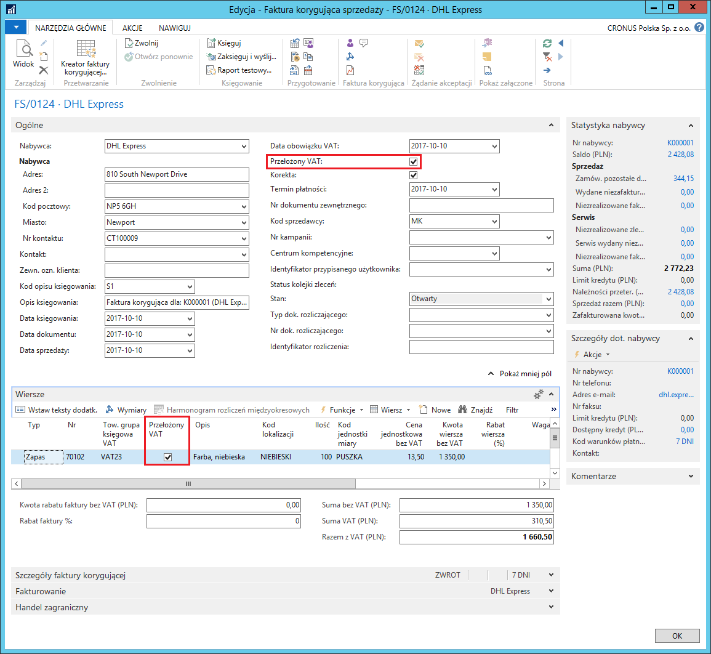{width="6.412189413823272in" height="5.8956517935258095in"}
  ------------------------------------------------------------------------------------
  Rysunek 2.10: Przełożony VAT w fakturze korygującej sprzedaży

> {width="0.19in" height="0.19in"}
> **Uwaga:** Jeśli podatek VAT z faktury korygującej sprzedaży powinien
> być zaksięgowany i rozliczony jak zwykły (nie przełożony), należy
> zdjąć znacznik z pola **Przełożony VAT** na karcie skróconej
> **Ogólne** -- system zaktualizuje tę informację we wszystkich
> wierszach dokumentu.

5.  Należy zaksięgować fakturę korygującą sprzedaży.

6.  Należy sprawdzić pole **Przełożony** **VAT** w zaksięgowanej
    > fakturze korygującej sprzedaży. W tym celu należy wybrać
    > **Działy \> Zarządzanie Finansami \> Archiwum \> Zaks. faktury
    > koryg. sprzed.**.

7.  Wybraną zaksięgowaną fakturę korygującą sprzedaży należy wyświetlić
    > w formie kartoteki:

  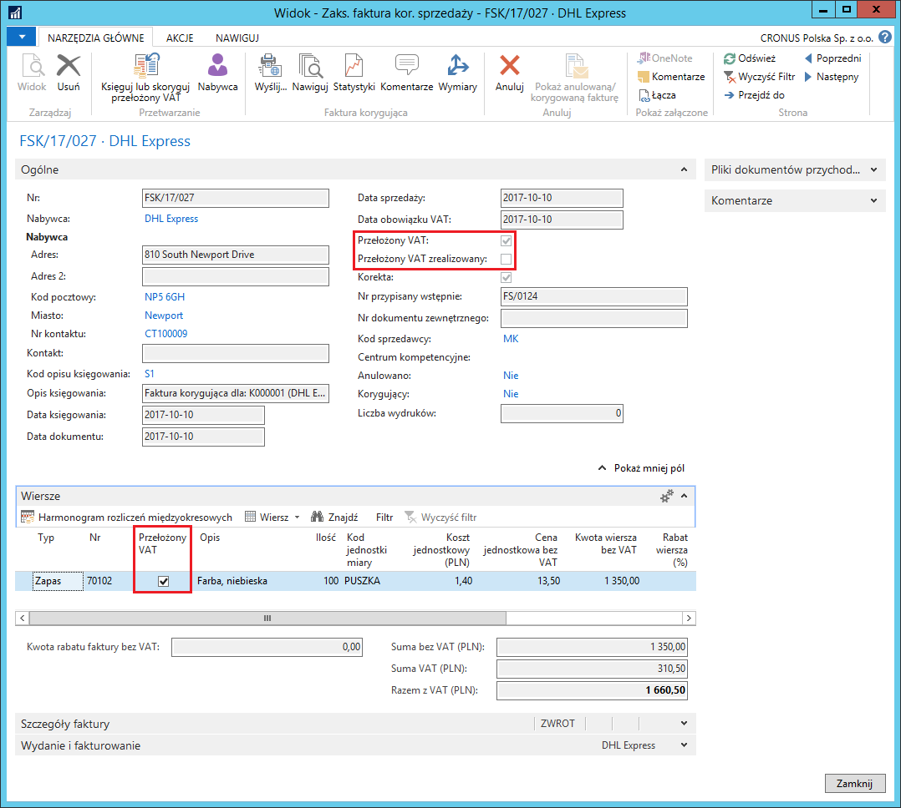{width="6.373912948381452in" height="5.723582677165354in"}
  -----------------------------------------------------------------------------------
  Rysunek 2.11: Przełożony VAT w zaksięgowanej fakturze korygującej sprzedaży

8.  Można też sprawdzić, jak przełożony VAT został zapisany w oknie
    **Zapisy VAT**. W tym celu, w zaksięgowanej fakturze zakupu należy
    wybrać **Nawiguj**, następnie należy zaznaczyć wiersz **Zapis VAT**
    i wybrać **Pokaż powiązane zapisy**:

  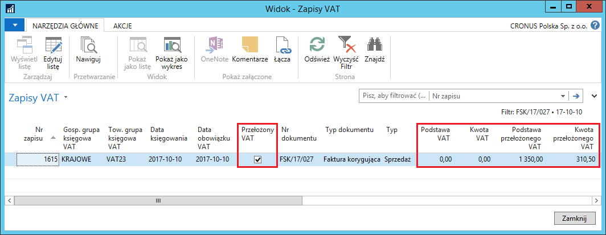{width="6.356521216097987in" height="2.4672265966754154in"}
  ------------------------------------------------------------------------------------
  Rysunek 2.12: Przełożony VAT w zapisach VAT

9.  Na uwagę zasługują też zapisy utworzone w oknie **Zapisy księgi
    głównej**. Kwota przełożonego należnego podatku VAT została
    zaksięgowana na inne konto KG niż zwykły należny podatek VAT
    (zgodnie z wcześniej zdefiniowanymi ustawieniami). W celu
    sprawdzenia zapisów księgi głównej, w zaksięgowanej fakturze zakupu
    należy wybrać **Nawiguj**, następnie należy zaznaczyć wiersz **Zapis
    K/G** i wybrać **Pokaż powiązane zapisy**:

  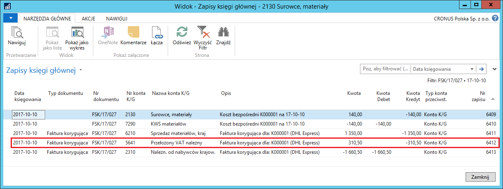{width="6.391303587051619in" height="2.4124442257217846in"}
  ------------------------------------------------------------------------------------
  Rysunek 2.13: Przełożony VAT w zapisach księgi głównej

Po otrzymaniu od odbiorcy potwierdzenia faktury korygującej sprzedaży,
należy postępować według następujących kroków:

1.  Należy wybrać **Działy \> Zarządzanie Finansami \> Archiwum \> Zaks.
    faktury koryg. sprzed.**

2.  Wybraną zaksięgowaną fakturę korygującą sprzedaży należy wyświetlić
    w formie kartoteki i wybrać **Księguj lub skoryguj przełożony VAT**.

3.  W oknie **Księguj lub skoryguj przełożony VAT** należy uzupełnić
    pola:

-   **Nowa data obowiązku VAT -- w **polu należy wpisać datę, z jaką
    > **ma** być rozliczony podatek VAT z podpisanej faktury korygującej
    > sprzedaży.

-   **Korekta** -- pole należy pozostawić puste.

4.  Należy wybrać **OK** w celu wykonania skryptu.

  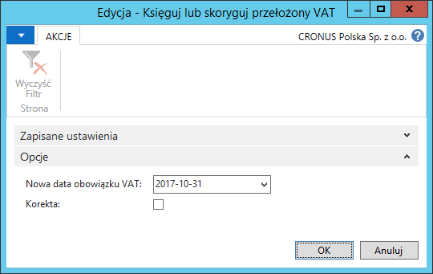{width="4.574803149606299in" height="2.8897637795275593in"}
  ------------------------------------------------------------------------------------------
  Rysunek 2.14: realizacja Przełożonego VAT w zaksięgowanej fakturze korygującej sprzedaży

5.  Efekty czynności wykonanej w poprzednim punkcie można zobaczyć:

-   W kartotece zaksięgowanej faktury korygującej sprzedaży:

  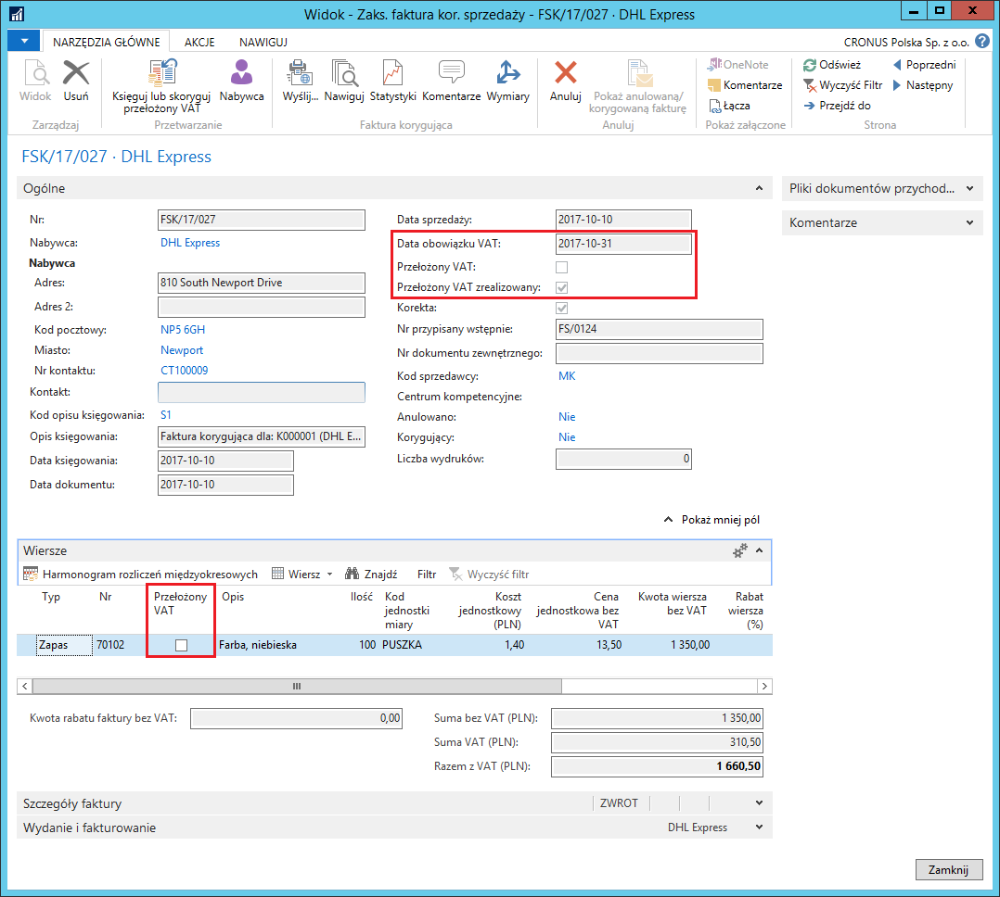{width="6.339130577427822in" height="5.69234908136483in"}
  ------------------------------------------------------------------------------------------
  Rysunek 2.15: Zrealizowany Przełożony VAT w zaksięgowanej fakturze korygującej sprzedaży

-   W oknie **Zapisy VAT**:

  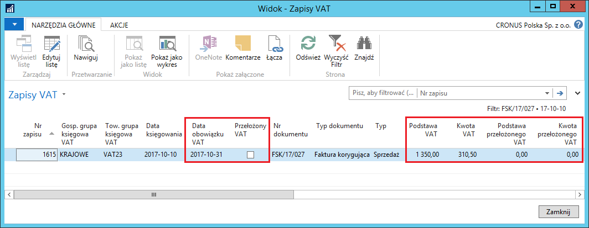{width="6.356521216097987in" height="2.4672265966754154in"}
  ------------------------------------------------------------------------------------
  Rysunek 2.16: Zrealizowany Przełożony VAT w Zapisach VAT

-   W oknie **Szczegółowe zapisy VAT**:

  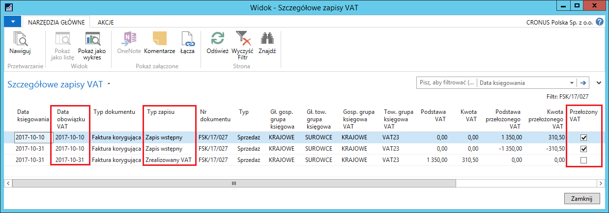{width="6.365217629046369in" height="2.2291863517060366in"}
  ------------------------------------------------------------------------------------
  Rysunek 2.17: Zrealizowany Przełożony VAT w Szczegółowych zapisach VAT

-   W oknie **Zapisy księgi głównej:**

  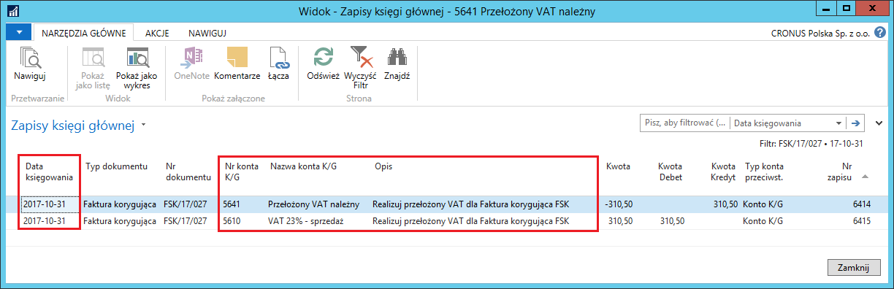{width="6.35625in" height="2.0562740594925635in"}
  --------------------------------------------------------------------------
  Rysunek 2.18: Zrealizowany Przełożony VAT w Zapisach księgi głównej

W sytuacji, gdy przełożony podatek VAT z faktury korygującej sprzedaży
został zrealizowany przez pomyłkę, można ten proces odwrócić, postępując
według kroków:

1.  W kartotece zaksięgowanej faktury korygującej sprzedaży, z której
    przez pomyłkę został zrealizowany przełożony VAT, należy wybrać
    **Księguj lub koryguj przełożony VAT**.

2.  W oknie **Księguj lub koryguj przełożony VAT** należy uzupełnić
    pola:

-   **Nowa data obowiązku VAT -- w **polu należy wpisać datę, z jaką
    > przełożony podatek VAT został pomyłkowo zrealizowany (jest to data
    > aktualnie wyświetlona w polu **Data obowiązku VAT** na karcie
    > skróconej **Ogólne** w zaksięgowanej fakturze korygującej
    > sprzedaży).

-   **Korekta** -- pole należy zaznaczyć.

  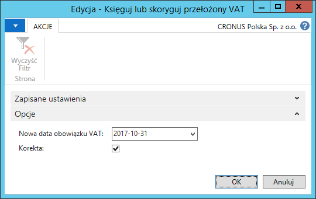{width="4.570866141732283in" height="2.8858267716535435in"}
  -----------------------------------------------------------------------------------------------------
  Rysunek 2.19: Odwrócenie realizacji przełożonego VAT w zaksięgowanej fakturze korygującej sprzedaży

3.  Należy wybrać **OK** w celu wykonania skryptu.

Rezultatem powyższego księgowania będzie odwrócenie realizacji
przełożonego VAT z tą samą datą księgowania, z jaką zostało dokonane
pomyłkowe księgowanie. Dzięki temu, raporty nie będą wykazywały
rozbieżności w danych. Teraz zaksięgowana faktura korygująca sprzedaży
ponownie została oznaczona jako **Przełożony VAT i **będzie można
ponownie uruchomić skrypt do realizacji przełożonego VAT:

  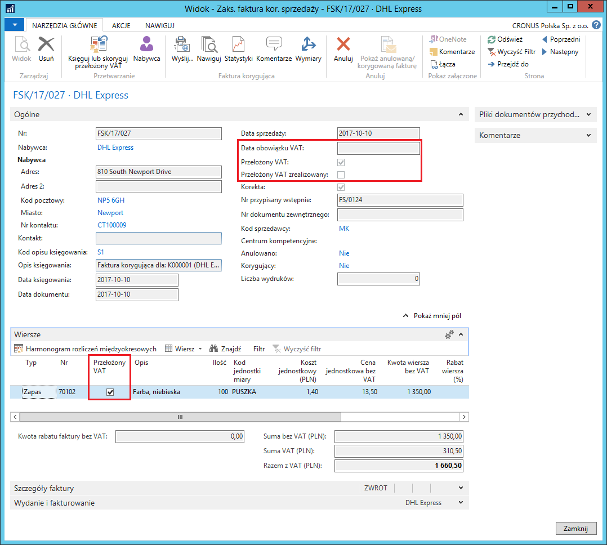{width="6.400909886264217in" height="5.747825896762905in"}
  ----------------------------------------------------------------------------------------------------
  Rysunek 2.20: Odwrócona realizacja przełożonego VAT w zaksięgowanej fakturze korygującej sprzedaży

> {width="0.19in" height="0.19in"}
> **Uwaga:** Pole **Przełożony VAT** musi mieć taką samą wartość
> (zaznaczenie) w nagłówku oraz wszystkich wierszach faktury korygującej
> sprzedaży oraz zamówienia zwrotu sprzedaży. W pozostałych dokumentach,
> w których pole **Przełożony VAT** jest obsługiwane, jego zaznaczenie
> może być różne w nagłówku i wierszach (na wzór wartości pola **Data
> obowiązku VAT**)**.**
>
> Sposób, w jaki należy realizować przełożony VAT z dokumentów innych
> niż zaksięgowana faktura korygująca sprzedaży, opisany jest
> w rozdziale **Arkusz rozliczania VAT.**

Rejestr VAT sprzedaży/zakupu {#rejestr-vat-sprzedażyzakupu .Poziom-1}
----------------------------

### Informacje ogólne

Raport **Rejestr VAT sprzedaży/zakupu** jest podstawowym raportem
do kalkulacji kwoty podatku VAT należnego i naliczonego za wybrany
okres. Raport pokazuje kwotę podstawy VAT, kwotę VAT i szczegółowe
informacje o nabywcy lub dostawcy dla każdego dokumentu oraz kwotę VAT
niezrealizowanego.

Kwota podstawy VAT i kwota VAT są podzielone i wyświetlone
dla poszczególnych stawek VAT. Wyświetlone są również suma kwoty VAT
i zsumowane są kwoty VAT dla każdej kombinacji **Gosp. grupy księgowej
VAT** i **Tow. grupy księgowej VAT**. Raport **Rejestr VAT
sprzedaży/zakupu** może prezentować **Zapisy VAT** według grup
księgowych VAT lub identyfikatorów VAT, w zależności od opcji wybranej
podczas przygotowywania wydruku raportu.

### Obsługa

W celu przygotowania i wydrukowania **Rejestru VAT sprzedaży/zakupu**,
należy postępować według następujących kroków:

1.  Należy wybrać **Działy \> Zarządzanie Finansami \> Raporty
    i analizy \> Rejestr VAT sprzedaży/zakupu.**

2.  W oknie wstępnym raportu, na karcie skróconej **Opcje** należy
    wybrać/wprowadzić właściwe parametry, które zostaną użyte
    do wybranie właściwych **Zapisów VAT** i wyświetlenia
    ich w raporcie:

-   **Typ rejestru VAT** -- w tym polu należy wybrać typ transakcji
    > spośród dostępnych opcji określając w ten sposób, czy w oknie mają
    > zostać wyświetlone tylko transakcje zakupu lub tylko transakcje
    > sprzedaży, albo oba typy transakcji. Dostępne opcje, to:

```{=html}
<!-- -->
```
-   **Sprzedaż**

-   **Zakup**

-   **Sprzedaż i zakup**

```{=html}
<!-- -->
```
-   **Grupowanie pozycji rejestru** -- w tym polu należy wybrać sposób
    > przyporządkowywania wielu zapisów VAT do jednego dokumentu
    > prezentowanego w raporcie. Dostępne opcje, to:

```{=html}
<!-- -->
```
-   **Nr dokumentu** -- wszystkie zapisy VAT z tym samym ciągiem znaków
    > w polu **Nr dokumentu** zostaną zaprezentowane jako wiersze
    > jednego dokumentu, niezależnie od wypełnienia pola **Nr dokumentu
    > zewnętrznego**;

-   **Nr dokumentu zewnętrznego** -- wszystkie zapisy VAT z tym samym
    > ciągiem znaków w polu **Nr dokumentu zewnętrznego** zostaną
    > zaprezentowane jako wiersze jednego dokumentu, niezależnie
    > od wypełnienia pola **Nr dokumentu**;

```{=html}
<!-- -->
```
-   **Pozycje rejestru według **-- w tym polu należy wybrać opcję
    > do określenia sposobu prezentacji danych. Dostępne opcje, to:

```{=html}
<!-- -->
```
-   **Grupy księgowe VAT**

-   **Identyfikator VAT**

```{=html}
<!-- -->
```
-   **Uwzględnij zapisy wycofane** -- zaznaczenie tego pola spowoduje,
    > że w raporcie zostaną wyświetlone również te zapisy VAT,
    > które zostały wycofane: zarówno zapisy pierwotne,
    > jak i wycofujące.

-   **Pokaż tylko podsumowanie --** zaznaczenie tego pola powoduje
    > ograniczenie wydruku do jednej strony, na której znajduje się
    > wyłącznie podsumowanie kwot związanych z VAT w wybranym okresie.
    > Raport wyświetlony w ten sposób nie zawiera szczegółowych pozycji
    > rejestru.

-   **Pokaż opis taryfy usługowej** -- zaznaczenie tego pola spowoduje,
    > że dla pozycji rejestru VAT sprzedaży oznaczonych jako **Usługa**
    > zostanie wyświetlona nazwa zgodna z przyporządkowanym **Nr taryfy
    > usługowej**.

> W tym samym oknie, na karcie skróconej **Zapisy VAT** wymagane jest
> ustawienie filtru okresu dla daty obowiązku VAT, który należy
> wprowadzić w polu **Data obowiązku VAT**. Dodatkowo można standardowo
> ustawić filtry w innych polach w celu ograniczenia zakresu danych
> objętych raportem:

  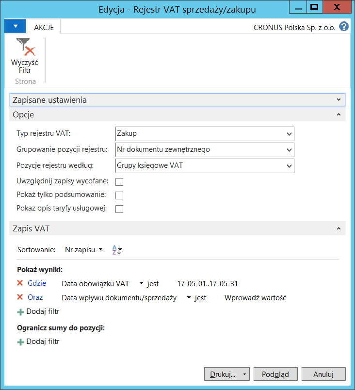{width="4.929133858267717in" height="5.413385826771654in"}
  -----------------------------------------------------------------------------------
  Rysunek 2.21: Opcje raportu Rejestr VAT sprzedaży/zakupu

3.  Należy wybrać **Drukuj lub Podgląd**.

4.  Wydrukowany (lub wyświetlony w formie podglądu na ekranie) raport
    > przedstawia wymagane, szczegółowe, dane o dokumentach:

> Pierwsza strona zawiera nazwy poszczególnych kolumn, a ostatnia strona
> zawiera podsumowania: ogółem dla rejestru i w podziale na kombinacje
> grup księgowych VAT:

  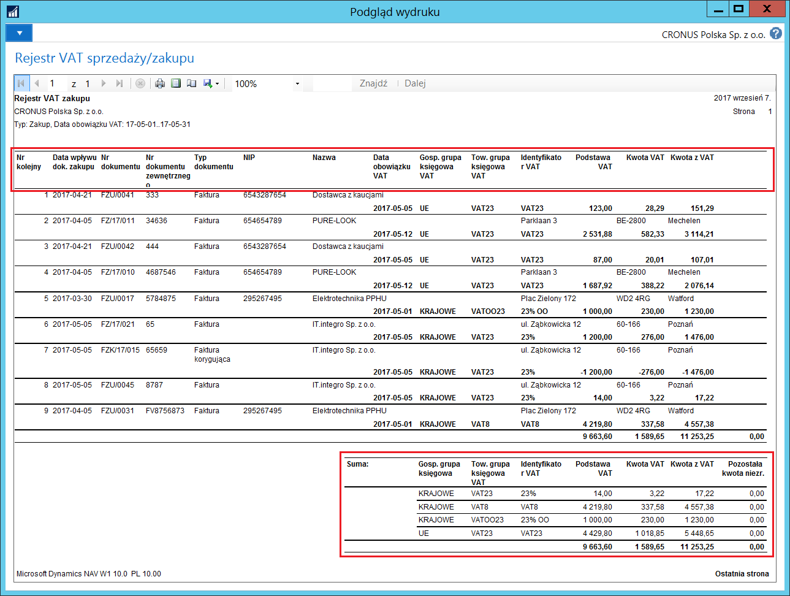{width="6.391666666666667in" height="4.8196992563429575in"}
  ------------------------------------------------------------------------------------
  Rysunek 2.22: Ostatnia strona raportu Rejestr VAT sprzedaży/zakupu

 {#section-4 .list-paragraph .Poziom-1}

Arkusz rozliczania VAT {#arkusz-rozliczania-vat .Poziom-1}
----------------------

### Informacje ogólne

Dzięki Polskiej Lokalizacji użytkownik Microsoft Dynamics 365 Business
Central on‑premises uzyskuje pełną kontrolę nad działaniami związanymi
z podatkiem VAT takimi, jak: przekładanie i realizacja niektórych
zapisów VAT, zmiana daty obowiązku VAT, pomijanie w ewidencji VAT,
zmiana kursu wymiany do przeliczenia VAT z odwrotnego obciążenia.
Narzędzie **Arkusz rozliczania VAT** umożliwia zarządzanie zapisami VAT.

### Obsługa

W celu zarządzania zapisami VAT, należy postępować według następujących
kroków:

1.  Należy wybrać **Działy \> Zarzadzanie Finansami \> Działania
    okresowe \> VAT \> Arkusz rozliczania VAT**. W oknie **Arkusz
    rozliczania VAT** użytkownik może dokonać czynności wymienione
    w następnych punktach.

```{=html}
<!-- -->
```
2.  Użytkownik może wybrać zapisy do wyświetlenia poprzez ustawienie
    filtrów w polach:

-   **Filtr typu** -- w tym polu należy wybrać typ transakcji spośród
    > dostępnych opcji określając w ten sposób, czy w oknie mają zostać
    > wyświetlone tylko transakcje zakupu lub tylko transakcje
    > sprzedaży, albo oba typy transakcji.

-   **Filtr typu dokumentu** -- w tym polu można wybrać jeden
    > z dostępnych typów dokumentu, do którego zostaną ograniczone dane
    > wyświetlane w tym oknie. Wybranie opcji pustej oznacza brak filtru
    > w tym polu.

-   **Filtr przełożonego VAT** -- wybranie opcji **Tak** spowoduje
    > wyświetlenie wyłącznie zapisów VAT oznaczonych jako przełożony,
    > wybranie opcji **Nie** spowoduje wyświetlenie wyłącznie zapisów
    > VAT nieoznaczonych jako przełożony. Wybranie opcji pustej oznacza
    > brak filtru w tym polu.

-   **Filtr daty księgowania** -- w tym polu można wprowadzić datę
    > lub zakres dat, wyznaczających okres, w jakim ma przypadać data
    > księgowania zapisów VAT, które będą wyświetlone w oknie. Puste
    > pole oznacza brak filtru w tym polu.

-   **Filtr daty obowiązku VAT** -- w tym polu można wprowadzić datę
    > lub zakres dat, wyznaczających okres, w jakim ma przypadać data
    > obowiązku VAT zapisów VAT, które będą wyświetlone w oknie. Puste
    > pole oznacza brak filtru w tym polu.

-   **Filtr daty wpływu dokumentu/sprzedaży** -- w tym polu można
    > wprowadzić datę lub zakres dat, wyznaczających okres, w jakim ma
    > przypadać data wpływu dokumentu/sprzedaży zapisów VAT, które będą
    > wyświetlone w oknie. Puste pole oznacza brak filtru w tym polu.

-   **Filtr gospodarczej grupy księgowej VAT** -- w tym polu można
    > wybrać z listy jeden lub więcej kodów **Gospodarczej grupy
    > księgowej VAT**, z jakimi zostały zaksięgowane transakcje VAT,
    > które będą wyświetlone w oknie. Puste pole oznacza brak filtru
    > w tym polu.

-   **Filtr towarowej grupy księgowej VAT** -- w tym polu można wybrać
    > z listy jeden lub więcej kodów **Towarowej grupy księgowej VAT**,
    > z jakimi zostały zaksięgowane transakcje VAT, które będą
    > wyświetlone w oknie. Puste pole oznacza brak filtru w tym polu.

-   **Filtr -- pomiń w ewidencji VAT** -- wybranie opcji **Tak**
    > spowoduje wyświetlenie wyłącznie zapisów VAT oznaczonych jako
    > pominięte w ewidencji VAT, wybranie opcji **Nie** spowoduje
    > wyświetlenie wyłącznie zapisów VAT nieoznaczonych jako pominięte w
    > ewidencji VAT. Wybranie opcji pustej oznacza brak filtru w tym
    > polu.

-   **Zamknięty** -- w tym polu są do wyboru 3 opcje:

```{=html}
<!-- -->
```
-   **Nie** -- wybór tej opcji powoduje ograniczenie zakresu
    wyświetlonych zapisów VAT do tych, które są otwarte;

-   **Tak** -- wybór tej opcji powoduje ograniczenie zakresu
    wyświetlonych zapisów VAT do tych, które są zamknięte;

-   **Oba** -- wybór tej opcji powoduje wyświetlenie wszystkich zapisów
    VAT, niezależnie od tego, czy zostały zamknięte.

> {width="0.19in" height="0.19in"}
> **Uwaga:** Zapisy VAT zostają oznaczone jako zamknięte w wyniku użycia
> funkcji **Oblicz i księguj dekl. VAT**.

  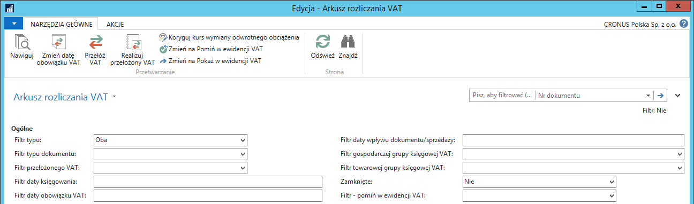{width="6.385416666666667in" height="1.8821970691163605in"}
  ------------------------------------------------------------------------------------
  Rysunek 2.23: Filtry w arkuszu rozliczania VAT

3.  Zapisy VAT w oknie **Arkusz rozliczania VAT** są pogrupowane
    > według numeru dokumentu. Każdy zapis VAT zawiera:

-   **Nr dokumentu** -- numer zaksięgowanego dokumentu związanego
    > z zapisem VAT

-   **Nr dokumentu zewnętrznego** -- numer dokumentu źródłowego
    > związanego z zapisem VAT

-   **Data księgowania** -- data księgowania dokumentu związanego
    > z zapisem VAT

-   **Typ dokumentu** -- typ zaksięgowanego dokumentu związanego
    > z zapisem VAT

-   **Data wpływu dokumentu/sprzedaży** -- data wpływu dokumentu (dla
    > transakcji zakupu) lub data sprzedaży (dla transakcji sprzedaży)
    > w zaksięgowanym dokumencie związanym z zapisem VAT

-   **Data obowiązku VAT** -- data obowiązku VAT w zaksięgowanym
    > dokumencie związanym z zapisem VAT

-   **Przełożony VAT** -- jeśli pole jest zaznaczone, kwota podstawy VAT
    > i kwota VAT z transakcji są umieszczone w polach **Podstawa
    > przełożonego VAT** i **Kwota przełożonego VAT**, zamiast w polach
    > **Podstawa VAT** i **Kwota VAT.** Kwota przełożonego podatku VAT
    > może być zaksięgowana na inne konto księgi głównej niż standardowe
    > konto do księgowania VAT (konta wybrane w polach **Konto przełoż.
    > należnego VAT** i **Konto przełoż. naliczonego VAT** w oknie
    > **Ustawienia księgowe VAT**).

-   **Pomiń w ewidencji VAT** -- jeśli pole jest zaznaczone, zapis VAT
    > nie zostanie przekazany do pliku JPK\_VAT, a w narzędziach do
    > rozliczania VAT może zostać wykluczony poprzez ustawienie
    > właściwego filtru

-   **VAT niezrealizowany** -- w polu wykazana jest kwota podatku VAT,
    > która w danym zapisie oczekuje na realizację (rozliczenie
    > należności lub zobowiązania z płatnością)

-   **Gosp. grupa księgowa VAT** -- kod **Gospodarczej grupy księgowej
    > VAT** w zaksięgowanym dokumencie związanym z zapisem VAT

-   **Tow. grupa księgowa VAT**-- kod **Towarowej grupy księgowej VAT**
    > w zaksięgowanym dokumencie związanym z zapisem VAT

-   **Typ** -- typ transakcji związanej z zapisem VAT: **Zakup**
    > lub **Sprzedaż**.

-   **Podstawa VAT** -- kwota podstawy do kalkulacji podatku VAT
    > (podlegającego odliczeniu w przypadku zakupu) z zaksięgowanego
    > dokumentu związanego z zapisem. Kwota jest zerowa w przypadku,
    > gdy zapis VAT został oznaczony jako **Przełożony VAT.**

-   **Kwota VAT** -- kwota podatku VAT z zaksięgowanego dokumentu
    > związanego z zapisem. Kwota jest zerowa w przypadku, gdy zapis VAT
    > został oznaczony jako **Przełożony VAT.**

-   **Podstawa przełożonego VAT** -- kwota podstawy do kalkulacji
    > przełożonego podatku VAT z zaksięgowanego dokumentu związanego
    > z zapisem. Kwota jest niezerowa w przypadku, gdy zapis VAT został
    > oznaczony jako **Przełożony VAT.**

-   **Kwota przełożonego VAT** -- kwota przełożonego podatku VAT
    > z zaksięgowanego dokumentu związanego z zapisem. Kwota jest
    > niezerowa w przypadku, gdy zapis VAT został oznaczony jako
    > **Przełożony VAT.**

-   **Podstawa VAT (nie do odliczenia)** -- kwota podstawy do kalkulacji
    > podatku VAT niepodlegającego odliczeniu z zaksięgowanego dokumentu
    > związanego z zapisem.

-   **Kwota VAT (nie do odliczenia)** -- kwota podatku VAT
    > niepodlegającego odliczeniu z zaksięgowanego dokumentu związanego
    > z zapisem.

-   **Zamknięte** -- pole jest zaznaczone w tych zapisach VAT,
    > które zostały zamknięte przy użyciu funkcji **Oblicz i księguj
    > dekl. VAT**.

-   **Typ kalkulacji VAT** -- w polu prezentowany jest typ kalkulacji
    > VAT zdefiniowany w **Ustawieniach księgowych VAT** dla kombinacji
    > **Gosp. grupy księgowej VAT** i **Tow. grupy księgowej VAT**
    > użytej w danym zapisie VAT.

-   **Inny kurs dla odwrotnego obciążenia** -- pole zaznaczane jest
    > automatycznie w zapisach VAT z **Typem kalkulacji VAT**:
    > **Odwrotne obciążenie**, utworzonych na podstawie faktury w obcej
    > walucie, jeśli zastosowane zostały różne kursy wymiany dla kwoty
    > faktury i kwoty odwrotnego obciążenia, gdy nie była włączona opcja
    > automatycznego księgowania różnicy w kwocie odwrotnego obciążenia.

  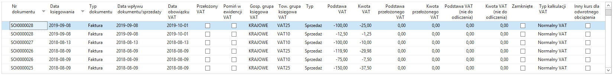{width="6.395833333333333in" height="0.7871795713035871in"}
  ------------------------------------------------------------------------------------
  Rysunek 2.24: Wiersze arkusza rozliczania VAT

4.  Na dole okna **Arkusz rozliczania VAT** są pola sumujące kwoty
    > z zapisów VAT wyfiltrowanych w oknie arkusza:

-   **Podstawa VAT (Normalny)** -- suma kwot w polu **Podstawa VAT**
    > wyfiltrowanych zapisów VAT.

-   **Kwota VAT (Normalny)** -- suma kwot w polu **Kwota VAT**
    > wyfiltrowanych zapisów VAT.

-   **Podstawa VAT (Przełożony)** -- suma kwot w polu **Podstawa
    > przełożonego VAT** wyfiltrowanych zapisów VAT.

-   **Kwota VAT (Przełożony)** -- suma kwot w polu **Kwota przełożonego
    > VAT** wyfiltrowanych zapisów VAT.

-   **Podstawa VAT (Nie do odliczenia)** -- suma kwot w polu **Podstawa
    > VAT (nie do odliczenia)** wyfiltrowanych zapisów VAT.

-   **Kwota VAT (Nie do odliczenia)** -- suma kwot w polu **Kwota VAT
    > (nie do odliczenia)** wyfiltrowanych zapisów VAT.

  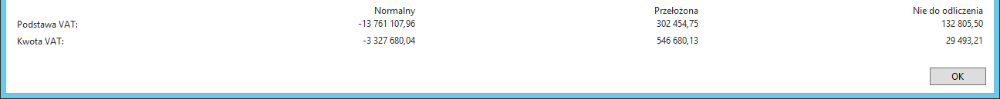{width="6.40625in" height="0.6378871391076115in"}
  --------------------------------------------------------------------------
  Rysunek 2.25: Podsumowanie arkusza rozliczania VAT

W celu zmiany daty obowiązku VAT w wybranym zapisie VAT, należy
postępować według następujących kroków:

1.  W oknie **Arkusz rozliczania VAT** należy zaznaczyć wiersz, w którym
    data obowiązku VAT ma zostać zmieniona i wybrać **Zmień datę
    obowiązku VAT.**

2.  W oknie **Zmień datę obowiązku VAT**, które się otworzy, należy
    uzupełnić dwa pola z datami (pola są domyślnie uzupełnione datą
    roboczą).

-   **Data księgowania** -- zmiana daty obowiązku VAT faktycznie
    > dokonywana jest jako wyksięgowanie zapisu ze starą datą obowiązku
    > VAT i zaksięgowanie zapisu z nową datą obowiązku VAT. Data
    > księgowania wprowadzona w tym polu będzie użyta jako data
    > księgowania zmiany daty obowiązku VAT.

-   **Data obowiązku VAT** -- w tym polu należy wprowadzić nową datę
    > obowiązku VAT.

3.  Należy wybrać **OK** w celu wykonania skryptu.

  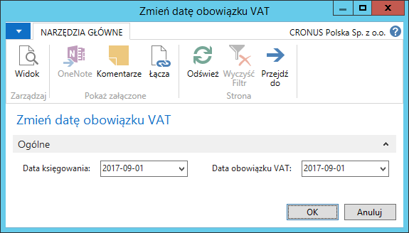{width="4.850393700787402in" height="2.767716535433071in"}
  -----------------------------------------------------------------------------------
  Rysunek 2.26: Zmiana daty obowiązku VAT

4.  Rezultatem zmiany daty obowiązku VAT są nowe szczegółowe zapisy VAT,
    które odwracają zapisy ze starą datą obowiązku VAT i tworzą nowe
    zapisy z nową datą obowiązku VAT, a w efekcie w zapisie VAT zostaje
    zmieniona data w polu **Data obowiązku VAT**:

  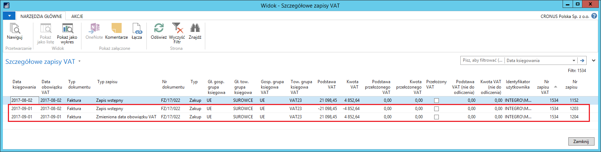{width="6.4in" height="1.6198293963254593in"}
  ----------------------------------------------------------------------
  Rysunek 2.27: Szczegółowe zapisy VAT

  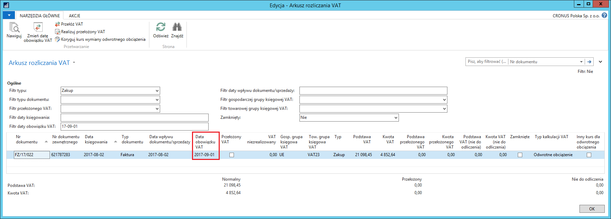{width="6.382608267716535in" height="2.295284339457568in"}
  -----------------------------------------------------------------------------------
  Rysunek 2.28: Nowa data obowiązku VAT w zapisach VAT

W celu przełożenia podatku VAT w wybranym zapisie VAT, należy postępować
według następujących kroków:

1.  W oknie **Arkusz rozliczania VAT** należy zaznaczyć wiersz, w którym
    podatek VAT ma zostać przełożony i wybrać **Przełóż VAT.**

2.  W oknie **Przełóż VAT**, które się otworzy, należy uzupełnić pole
    z datą księgowania (pole jest domyślnie uzupełnione datą roboczą).

-   **Data księgowania** -- przełożenie VAT faktycznie dokonywane jest
    > jako wyksięgowanie zwykłego zapisu i zaksięgowanie zapisu jako
    > przełożony VAT. Data księgowania wprowadzona w tym polu będzie
    > użyta jako data księgowania przełożenia VAT.

-   **Data obowiązku VAT** -- pole jest nieedytowalne.

3.  Należy wybrać **OK** w celu wykonania skryptu.

  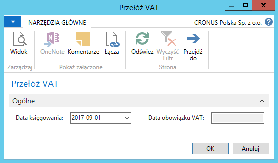{width="4.724409448818897in" height="2.783464566929134in"}
  -----------------------------------------------------------------------------------
  Rysunek 2.29: Przekładanie VAT

4.  Rezultatem przełożenia VAT są nowe szczegółowe zapisy VAT,
    które odwracają zwykłe zapisy VAT i tworzą nowe zapisy z przełożonym
    podatkiem VAT, a w efekcie w zapisie VAT zostaje wstawiony znacznik
    w polu **Przełożony VAT**, a kwoty z pól **Podstawa VAT** i **Kwota
    VAT** zostają przeniesione do pól **Podstawa przełożonego VAT**
    i **Kwota przełożonego VAT.**

  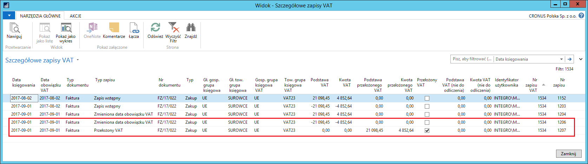{width="6.4086953193350835in" height="1.790463692038495in"}
  ------------------------------------------------------------------------------------
  Rysunek 2.30: Szczegółowe zapisy VAT

  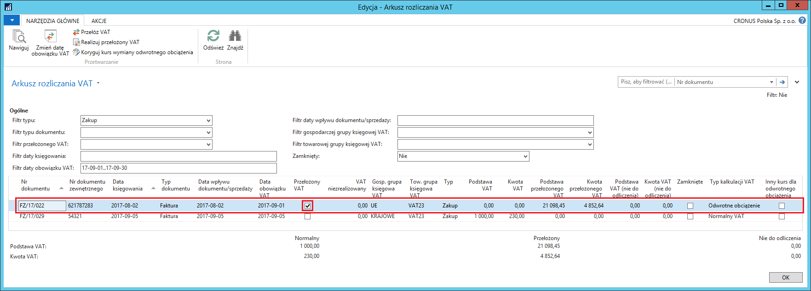{width="6.356521216097987in" height="2.285903324584427in"}
  ------------------------------------------------------------------------------------
  Rysunek 2.31: Przełożony VAT w zapisach VAT

W celu zrealizowania przełożonego podatku VAT w wybranym zapisie VAT,
należy postępować według następujących kroków:

1.  W oknie **Arkusz rozliczania VAT** należy zaznaczyć wiersz, w którym
    przełożony podatek VAT ma zostać zrealizowany i wybrać **Realizuj
    przełożony VAT.**

2.  W oknie **Realizuj przełożony VAT** które się otworzy, należy
    uzupełnić 2 pola z datami (pola są domyślnie uzupełnione datą
    roboczą).

-   **Data księgowania** -- realizacja przełożonego VAT faktycznie
    > dokonywana jest jako wyksięgowanie zapisu przełożonego VAT
    > i zaksięgowanie zwykłego zapisu VAT z nową datą obowiązku VAT.
    > Data księgowania wprowadzona w tym polu będzie użyta jako data
    > księgowania realizacji podatku VAT.

-   **Data obowiązku VAT** -- w tym polu należy wprowadzić nową datę
    > obowiązku VAT.

3.  Należy wybrać **OK** w celu wykonania skryptu.

  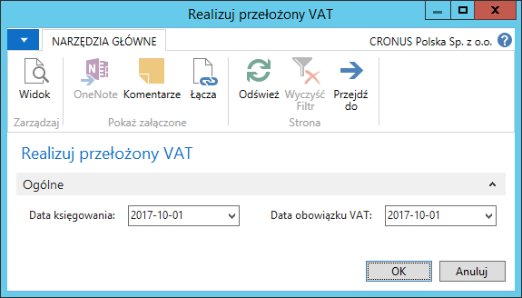{width="4.881889763779528in" height="2.783464566929134in"}
  ------------------------------------------------------------------------------------
  Rysunek 2.32: Realizacja przełożonego VAT

4.  Rezultatem zrealizowania przełożonego VAT są nowe szczegółowe zapisy
    VAT, które odwracają zapisy VAT z przełożonym podatkiem VAT i tworzą
    nowe, zwykłe zapisy VAT. W efekcie w zapisie VAT zostaje zdjęty
    znacznik z pola **Przełożony VAT**, kwoty z pól **Podstawa
    przełożonego VAT** i **Kwota przełożonego VAT** zostają przeniesione
    do pól **Podstawa VAT** i **Kwota VAT i w **polu **Data obowiązku
    VAT** pojawia się nowa data obowiązku VAT.

  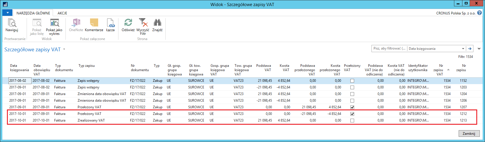{width="6.382608267716535in" height="1.8786417322834645in"}
  -------------------------------------------------------------------------------------
  Rysunek 2.33: Szczegółowe zapisy VAT

  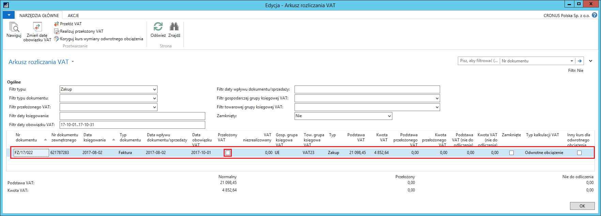{width="6.391303587051619in" height="2.298410979877515in"}
  ------------------------------------------------------------------------------------
  Rysunek 2.34: Zrealizowany VAT w zapisach VAT

> {width="0.19in" height="0.19in"}
> **Uwaga:** Funkcjonalność **Przełożony VAT** jest wykorzystywana
> do oznaczania faktur korygujących sprzedaży jako podpisane
> przez odbiorcę, dlatego przekładanie podatku VAT i jego realizacja nie
> są dostępne w oknie **Arkusz rozliczania VAT** dla dokumentów
> sprzedaży typu faktura korygująca.

W celu pominięcia wybranego zapisu VAT w ewidencji VAT, należy
postępować według następujących kroków:

1.  W oknie **Arkusz rozliczania VAT** należy zaznaczyć wiersz (lub
    wiele wierszy), który ma być pominięty w ewidencji VAT i wybrać
    **Zmień na Pomiń w ewidencji VAT**.

2.  Rezultatem wykonania tej akcji jest wstawiony znacznik w polu
    > **Pomiń w ewidencji VAT** we wszystkich wybranych zapisach VAT.

  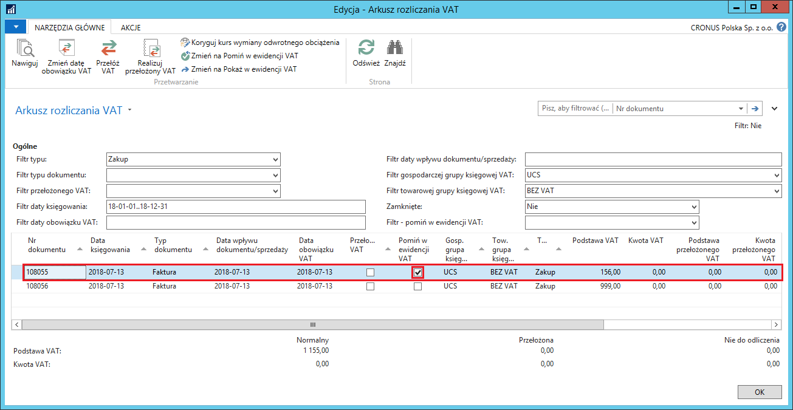{width="6.384527559055118in" height="3.3020833333333335in"}
  -------------------------------------------------------------------------------------
  Rysunek 2.35: Pomiń w ewidencji VAT w zapisach VAT

W celu pokazania zapisu VAT, który jest oznaczony jako pominięty
w ewidencji VAT, należy postępować według następujących kroków:

1.  W oknie **Arkusz rozliczania VAT** należy zaznaczyć wiersz (lub
    wiele wierszy) oznaczony jako pomijany w ewidencji VAT, który ma być
    pokazany w ewidencji VAT i wybrać **Zmień na Pokaż w ewidencji
    VAT**.

2.  Rezultatem wykonania tej akcji jest usunięcie znacznika z pola
    > **Pomiń w ewidencji VAT** we wszystkich wybranych zapisach VAT.

  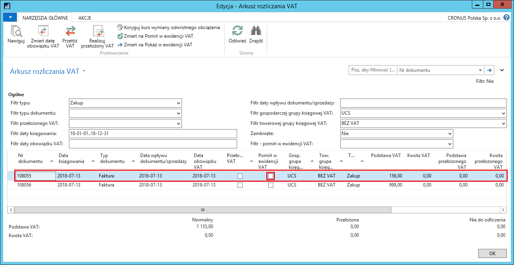{width="6.385416666666667in" height="3.3025426509186353in"}
  -------------------------------------------------------------------------------------
  Rysunek 2.36: Pokaż w ewidencji VAT w zapisach VAT

Deklaracja VAT  {#deklaracja-vat .Poziom-1}
--------------

### Informacje ogólne

**Deklaracja VAT** jest standardowym narzędziem pomocnym w przygotowaniu
deklaracji na potrzeby Urzędu Skarbowego. Narzędzie umożliwia
generowanie sprawozdania dla wybranego, wcześniej zdefiniowanego, okresu
VAT.

### Obsługa

W celu podglądu danych deklaracji VAT dla wybranego okresu VAT, należy
postępować według następujących kroków:

1.  Należy wybrać **Działy \> Zarządzanie Finansami \> Działania
    okresowe \> VAT \> Deklaracje VAT**.

2.  W oknie **Deklaracja VAT,** które się otworzy, z listy rozwijanej
    w polu **Nazwa** należy wybrać jedną z wcześniej zdefiniowanych
    deklaracji. Następnie należy wybrać **Podgląd**.

3.  W oknie **Podgląd deklaracji VAT**, które się otworzy, można
    uzupełnić nowe pola:

-   W polu **Data początkowa okresu VAT** należy wprowadzić datę
    > początkową wybranego okresu, zgodną z okresami zdefiniowanymi
    > wcześniej w oknie **Okresy VAT**.

-   Pole **Data końcowa okresu VAT** zostanie uzupełnione automatycznie
    > na podstawie daty w polu **Data początkowa okresu VAT** i okresów
    > zdefiniowanych wcześniej w oknie **Okresy VAT**.

-   W polu **Uwzględnij zapisy VAT** należy wybrać datę w oknie **Zapisy
    > VAT**, na którą będzie zakładany filtr okresu VAT. Dostępne opcje
    > to: **Data obowiązku VAT i Data księgowania**.

  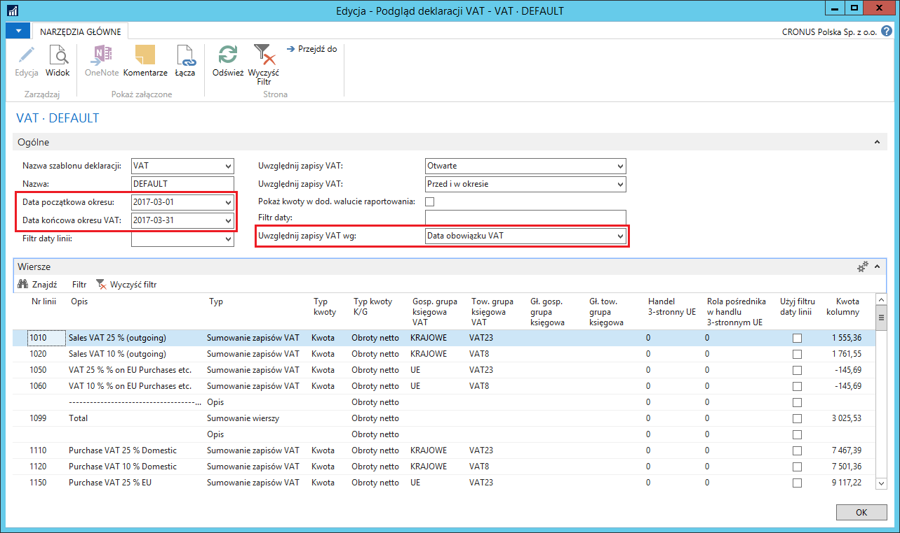{width="6.373912948381452in" height="3.7855325896762904in"}
  -------------------------------------------------------------------------------------
  Rysunek 2.37: Okresy VAT w deklaracji VAT

Po uzgodnieniu danych w oknie **Podgląd deklaracji VAT**, można na
ich podstawie obliczyć i zaksięgować rozliczenie podatku VAT. W tym celu
należy postępować według następujących kroków:

1.  W oknie **Deklaracja VAT** należy wybrać **Oblicz i księguj dekl.
    VAT.**

2.  W oknie wstępnym skryptu **Oblicz i księguj dekl. VAT** należy
    standardowo wprowadzić właściwe parametry w standardowych polach.

> Nowe pola należy uzupełnić następująco:

-   W polu **Data początkowa** należy wprowadzić datę początkową
    > wybranego okresu (lub wybrać z listy rozwijanej w tym polu),
    > zgodną z okresami zdefiniowanymi wcześniej w oknie **Okresy VAT**.

-   Pole **Data końcowa** zostanie uzupełnione automatycznie
    > na podstawie daty w polu **Data początkowa** i okresów
    > zdefiniowanych wcześniej w oknie **Okresy VAT**. Data może zostać
    > zmieniona ręcznie.

  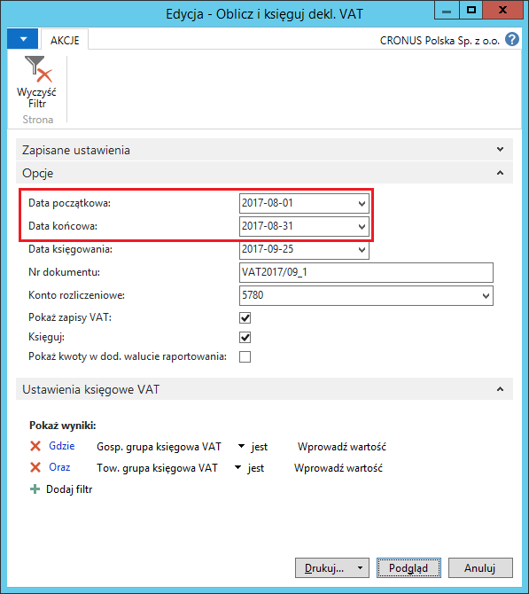{width="5.062992125984252in" height="5.681102362204724in"}
  ------------------------------------------------------------------------------------
  Rysunek 2.38: Kalkulacja i księgowanie deklaracji VAT

3.  Następnie w tym samym oknie należy wybrać **Podgląd lub Drukuj**
    w celu wykonania skryptu.

> {width="0.19in" height="0.19in"}
> **Uwaga:** Zaznaczenie pola **Księguj** spowoduje zaksięgowanie
> dokumentu po wybraniu **Podgląd lub Drukuj**. Aby uruchomić skrypt
> w trybie testowym, pole **Księguj** nie może być zaznaczone.

  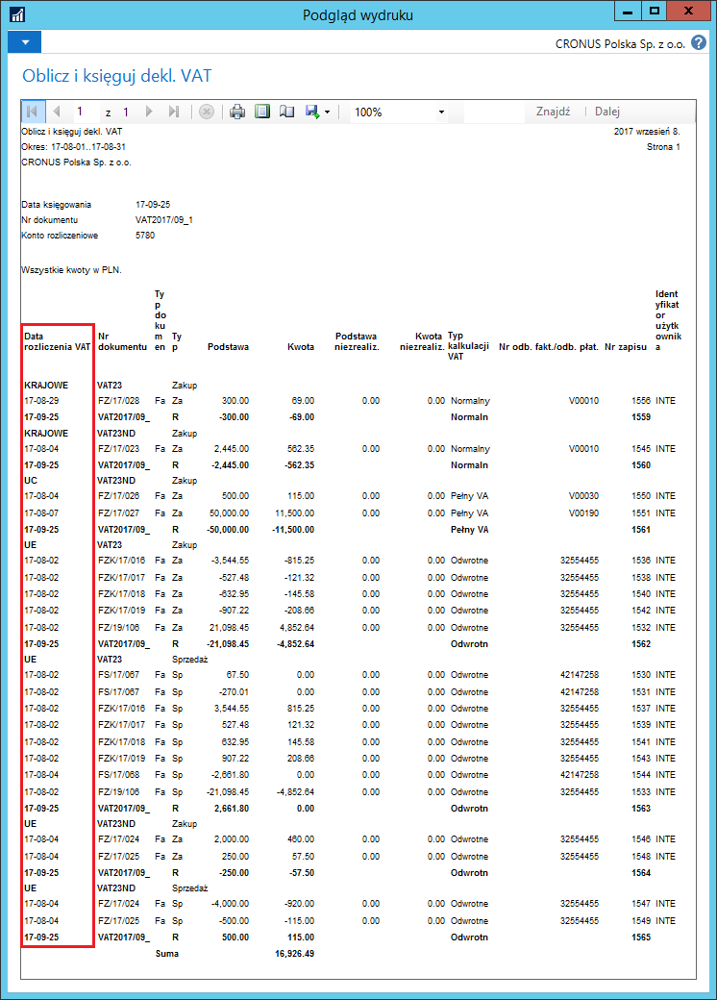{width="6.186573709536308in" height="8.625in"}
  ------------------------------------------------------------------------
  Rysunek 2.39: Podgląd Kalkulacji deklaracji VAT w trybie testowym

> {width="0.19in" height="0.19in"}
> **Uwaga:** System filtruje **Zapisy VAT** używając **Daty obowiązku
> VAT** (w odróżnieniu od **Daty księgowania**) **i **przygotowuje
> raport pokazujący zapisy, które zostaną przeksięgowane na konto KG
> wybrane w polu **Konto rozliczeniowe.** Wydruk (i podgląd wydruku)
> zawiera również informację o **Dacie obowiązku VAT**.

4.  Należy powrócić do okna **Oblicz i księguj dekl. VAT** i zaznaczyć
    > pole **Księguj**, a następnie ponownie wykonać skrypt.

5.  System zaksięguje przeniesienie kwoty podatku VAT należnego
    > i naliczonego na konto rozliczeniowe i zamknie rozliczony **Okres
    > VAT.**

  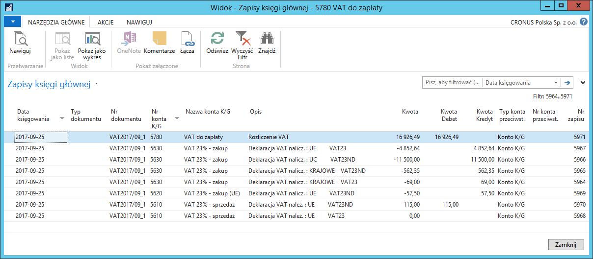{width="6.4086953193350835in" height="2.8065430883639544in"}
  --------------------------------------------------------------------------------------
  Rysunek 2.40: Zapisy księgi głównej rozliczenia VAT

  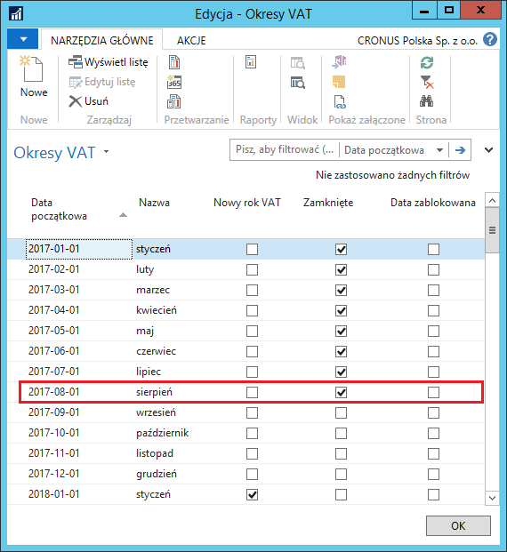{width="4.830708661417323in" height="5.2637795275590555in"}
  -------------------------------------------------------------------------------------
  Rysunek 2.41: Zamknięty okres VAT

Szczegółowe zapisy VAT {#szczegółowe-zapisy-vat .Poziom-1}
----------------------

### Informacje ogólne

Funkcjonalność **Szczegółowe zapisy VAT** została dodana do systemu
Microsoft Dynamics 365 Business Central on‑premises w celu
dokładniejszej obsługi i większej kontroli nad zmianą wartości podatku
VAT, który ma być rozliczony w danym okresie.

Zasada działania szczegółowych zapisów VAT jest podobna do zasady
działania szczegółowych zapisów w innych księgach pomocniczych
w systemie, takich jak szczegółowe zapisy księgi nabywców i szczegółowe
zapisy księgi dostawców. Oznacza to, że w **Szczegółowych zapisach VAT**
system przechowuje, w postaci oddzielnych zapisów, informacje o zmianach
wartości **Zapisów VAT**. Kwoty w **Zapisach VAT** są sumą kwot
zarejestrowanych w **Szczegółowych zapisach VAT** powiązanych z danym
**Zapisem VAT.**

### Obsługa

Użytkownik może dokonać przeglądu **Szczegółowych zapisów VAT**
uzyskując do nich dostęp za pomocą dwóch najczęściej stosowanych metod:

[Z okna **Arkusz rozliczania VAT.**]{.underline}

W tym celu należy postępować według następujących kroków:

1.  Należy wybrać: **Działy \> Zarządzanie Finansami \> Działania
    > okresowe \> VAT \> Arkusz rozliczania VAT**

2.  W oknie **Arkusz rozliczania VAT**, które się otworzy, w wybranym
    > wierszu należy kliknąć kwotę np. w polu **Podstawa VAT**:

  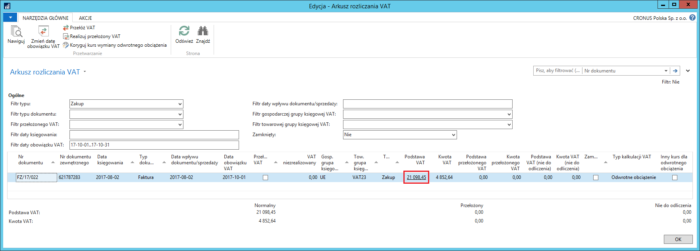{width="6.365217629046369in" height="2.2890299650043744in"}
  -------------------------------------------------------------------------------------
  Rysunek 2.42: Arkusz rozliczania VAT

3.  W oknie **Szczegółowe zapisy VAT** przedstawiona jest historia
    zapisu VAT:

  {width="6.4in" height="1.8837609361329835in"}
  -----------------------------------------------------------------------
  Rysunek 2.43: Szczegółowe zapisy VAT

> Kolumny w oknie **Szczegółowe zapisy VAT** są praktycznie takie same,
> jak w oknie **Zapisy VAT**, jednak 2 z nich są specyficzne dla okna
> **Szczegółowe zapisy VAT**:

1)  **Typ zapisu** -- to pole informuje o pochodzeniu szczegółowego
    zapisu VAT i może przyjmować następujące wartości:

-   **Zapis wstępny** -- oznacza, że jest to początkowy (pierwszy)
    > szczegółowy zapis VAT dla danego zapisu VAT lub odwrócenie tego
    > zapisu

-   **Przełożony VAT** -- oznacza, że ten szczegółowy zapis VAT
    > zarejestrował fakt przełożenia VAT w danym zapisie VAT
    > lub odwrócenie tego zapisu

-   **Zrealizowany VAT** -- oznacza, że ten szczegółowy zapis VAT
    > zarejestrował fakt realizacji przełożonego VAT w danym zapisie VAT
    > lub odwrócenie tego zapisu

-   **Zmieniona data obowiązku VAT** -- oznacza, że ten szczegółowy
    > zapis VAT zarejestrował zmianę daty obowiązku VAT w danym zapisie
    > VAT lub odwrócenie tego zapisu

-   **Korekta odwrotnego obciążenia** -- oznacza, że ten szczegółowy
    > zapis VAT zarejestrował kwotę podstawy i podatku VAT z tytułu
    > odwrotnego obciążenia przeliczoną według innego kursu, niż zostało
    > dokonane przeliczenie kwot zakupu i zobowiązania.

2)  **Nr zapisu VAT** -- to pole informuje o numerze zapisu VAT,
    z którym powiązany jest dany szczegółowy zapis VAT.

[Z okna **Arkusz rozliczania VAT.**]{.underline}

W tym celu należy postępować według następujących kroków:

1.  Należy wybrać **Nawiguj** w danym zapisie VAT lub jakimkolwiek
    > zaksięgowanym dokumencie mającym powiązanie z zapisami VAT.

2.  W oknie **Nawigacja**, które się otworzy, jest wiersz odwołujący się
    > do okna **Szczegółowe zapisy VAT**:

  {width="5.196850393700787in" height="5.031496062992126in"}
  ------------------------------------------------------------------------------------
  Rysunek 2.44: Nawigacja

3.  Należy zaznaczyć wiersz z tabelą **Szczegółowy zapis VAT** i wybrać
    **Pokaż powiązane zapisy.** Otworzy się okno **Szczegółowe zapisy
    VAT**, które zostało już wcześniej opisane.

Księgowanie dokumentów z VAT w dziennikach głównych {#księgowanie-dokumentów-z-vat-w-dziennikach-głównych .Poziom-1}
---------------------------------------------------

### Informacje ogólne

W związku z wymaganiami przepisów polskiego prawa, istnieje obowiązek
umieszczania danych kontrahentów w rejestrze VAT zakupu i sprzedaży.
W przypadku ewidencji faktur zakupu od dostawców jednorazowych można
uniknąć konieczności zakładania dla nich kartotek rozrachunkowych.
Polska Lokalizacja umożliwia to dzięki rozszerzeniu funkcji dzienników
głównych w zakresie księgowania transakcji z podatkiem VAT poprzez
dodanie możliwości podania danych kontrahenta.

### Obsługa

W celu zarejestrowania dokumentu z podatkiem VAT przez dzienniki główne,
należy postępować według następujących kroków:

1.  Należy wybrać **Działy \> Zarządzanie Finansami \> Księga główna \>
    Dzienniki główne.**

2.  Jeśli są zdefiniowane szablony dzienników głównych, należy wybrać
    jeden z nich i w oknie **Dziennik główny**, które się otworzy,
    należy w sposób standardowy wprowadzić dane z księgowanego
    dokumentu, pamiętając o właściwym wypełnieniu pól:

-   **Główny typ księgowania**

-   **Gł. gosp. grupa księgowa**

-   **Gł. tow. grupa księgowa**

-   **Gosp. grupa księgowa VAT**

-   **Tow. grupa księgowa VAT.**

3.  W polu **Kwota VAT** należy kliknąć przycisk asysty.

4.  W oknie **VAT -- dodatkowe informacje**, na karcie skróconej
    **Ogólne** należy uzupełnić ważne pola, m.in.:

-   **Data wpływu dokumentu/sprzedaży**

-   **Data obowiązku VAT**

-   **Nr dokumentu zewnętrznego**

5.  W tym samym oknie, w tej samej karcie skróconej, w polu **NIP**
    należy rozwinąć listę. Lista ta zawiera dane kontrahentów,
    które mogą zostać użyte do wyświetlenia w rejestrze VAT, bez
    konieczności zakładania dla nich kartoteki rozrachunkowej.

> Jeśli konieczne jest dodanie nowego kontrahenta VAT do listy, należy
> wybrać **Nowe** i w oknie **kontrahenci VAT**, które się otworzy,
> wprowadzić niezbędne dane.

  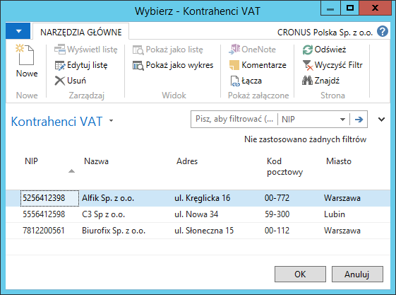{width="4.7362204724409445in" height="3.5196850393700787in"}
  --------------------------------------------------------------------------------------
  Rysunek 2.45: Kontrahenci VAT

6.  Wybranie kontrahenta z listy rozwijanej w polu **NIP** powoduje
    automatyczne uzupełnienie pól z nazwą i danymi adresowymi
    kontrahenta na karcie skróconej **Nazwa/Adres** w oknie **VAT --
    dodatkowe informacje.**

7.  W oknie **VAT -- dodatkowe informacje**, na karcie skróconej
    > **Nazwa/Adres** należy uzupełnić pole **Kod kraju/regionu**,
    > zgodnie z miejscem transakcji.

  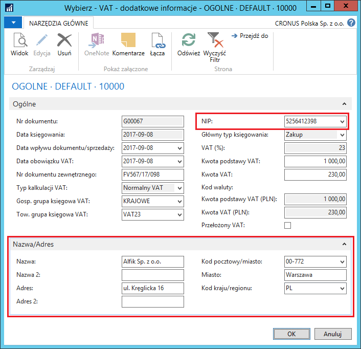{width="6.418048993875765in" height="6.2in"}
  ----------------------------------------------------------------------
  Rysunek 2.46: VAT -- dodatkowe informacje

8.  Zaksięgowanie dokumentu z danymi kontrahenta VAT wprowadzonymi
    > w oknie **VAT -- dodatkowe informacje** ma odzwierciedlenie
    > w raporcie **Rejestr VAT sprzedaży/zakupu**.

  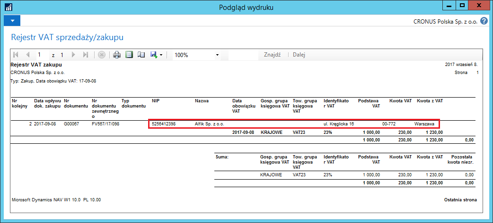{width="6.354166666666667in" height="2.883814523184602in"}
  ------------------------------------------------------------------------------------
  Rysunek 2.47: Dane kontrahenta w rejestrze VAT

> {width="0.19in" height="0.19in"}
> **Uwaga:** Ta funkcjonalność dostępna jest również w dziennikach
> zleceń.

Księgowanie pełnego VAT {#księgowanie-pełnego-vat .Poziom-1}
-----------------------

### Informacje ogólne

Zgodnie z wymogami polskiego prawa, dla wszystkich transakcji
w rejestrze VAT powinna być widoczna kwota netto. Aby spełnić ten wymóg,
Polska Lokalizacja umożliwia ręczne wprowadzanie kwoty podstawy VAT
dla księgowań obejmujących wyłącznie kwotę podatku VAT.

Ta funkcjonalność ma szczególne znaczenie dla ewidencji zakupów spoza
UE. W takich transakcjach muszą być zaksięgowane 2 dokumenty:

-   Faktura zakupu, aby ująć wartość netto zakupów i zobowiązanie
    > na podstawie faktury od dostawcy

-   Dokument PZC (Poświadczone Zgłoszenie Celne), aby ująć podatek VAT
    > i inne dodatkowe koszty celne obciążające dostawę spoza terytorium
    > UE.

> Ponieważ wartość netto stanowiąca podstawę kalkulacji podatku VAT jest
> zaksięgowana na podstawie faktury zakupu, nie może być zaksięgowana
> ponownie na podstawie dokumentu PZC przy okazji księgowania podatku
> VAT. Dlatego podczas księgowania dokumentu PZC, podstawa kalkulacji
> podatku VAT podawana jest wyłącznie informacyjnie, co zapewnia
> poprawność wydruku transakcji zakupu w rejestrze VAT.

### Ustawienia

Żeby księgowanie wyłącznie podatku VAT na podstawie dokumentu zakupu
było możliwe, należy zdefiniować właściwe ustawienia. W tym celu należy
postępować według następujących kroków:

1.  Należy wybrać: **Działy \> Zarządzanie Finansami \> Administracja \>
    Ustawienia Księgowe VAT**

2.  W oknie **Ustawienia Księgowe VAT**, które się otworzy, należy
    zaznaczyć wiersz z właściwą kombinacją **Gospodarczej grupy
    księgowej VAT** (właściwej dla Urzędu Celno-Skarbowego lub Agencji
    Celnej -- dostawcy PZC, wobec którego podmiot jest zobowiązany
    do uiszczenia zobowiązania z tytułu VAT i innych kosztów związanych
    z odprawą celną) oraz **Towarowej grupy księgowej VAT** (właściwej
    dla stawki podatku VAT w transakcji zakupu, zdefiniowanej specjalnie
    na potrzeby dokumentów PZC), a następnie wybrać akcję **Edycja**.

3.  W oknie **Kartoteka ustaw. Księg. VAT** wybranej kombinacji grup
    VAT, które się otworzy, należy zwrócić uwagę na 2 pola:

```{=html}
<!-- -->
```
1)  W polu **Typ kalkulacji VAT** musi być wybrana opcja **Pełny VAT**

2)  Konto KG wybrane w polu **Konto naliczonego VAT** musi mieć
    domyślnie przypisaną towarową grupę księgową VAT zgodną z tą,
    która użyta jest w definiowanych właśnie ustawieniach.

  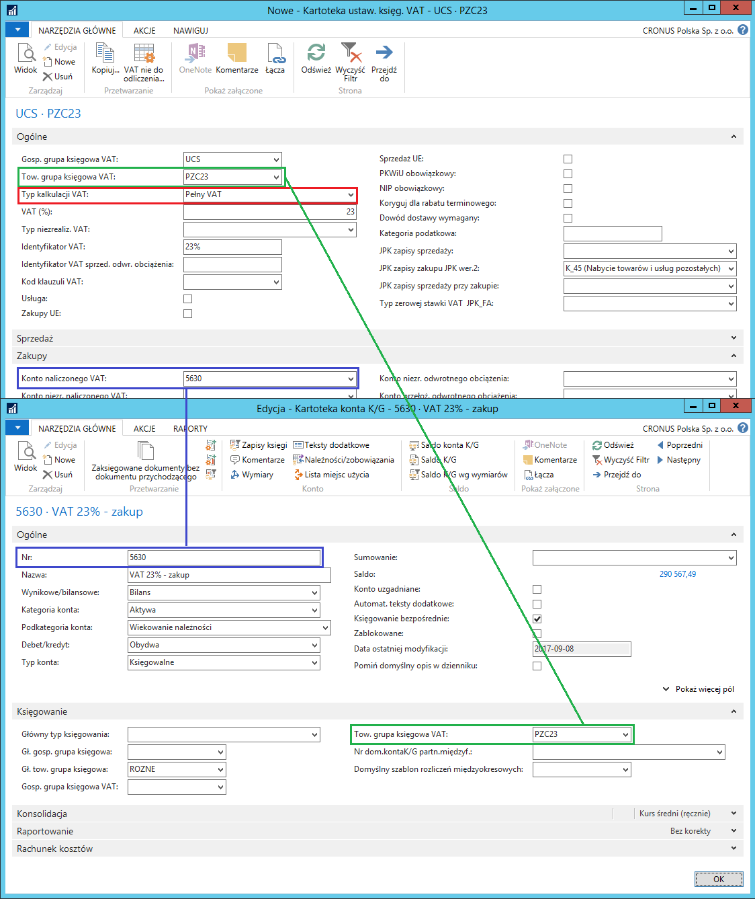{width="6.3893514873140855in" height="7.617390638670166in"}
  -------------------------------------------------------------------------------------
  Rysunek 2.48: Ustawienia księgowe VAT

### Obsługa

Dokument PZC wprowadzany jest analogicznie, jak zwykła faktura zakupu.
W celu jego zaewidencjonowania należy postępować według następujących
kroków:

1.  Należy wybrać **Działy \> Zarządzanie Finansami \> Zobowiązania \>
    Faktury zakupu**

2.  Należy wybrać **Nowe.**

3.  Z listy rozwijanej w polu **Nr dostawcy (zakup)** należy wybrać
    kartotekę urzędu celno-skarbowego.

4.  Wiersz należy wypełnić w sposób następujący:

```{=html}
<!-- -->
```
1)  W polu **Typ** należy wybrać **Konto K/G**

2)  W polu **Nr** należy wybrać konto KG, które zostało wybrane jako
    konto VAT-u naliczonego w ustawieniach księgowania VAT

3)  W polu **Ilość** należy wprowadzić cyfrę 1

4)  W polu **Bezpośr. koszt jedn. bez VAT** należy wprowadzić kwotę
    podatku VAT wykazaną na dokumencie PZC

5)  W polu **Kwota podstawy VAT** należy wprowadzić kwotę stanowiąca
    podstawę do obliczenia podatku VAT, wykazaną na dokumencie PZC

```{=html}
<!-- -->
```
5.  Pozostałe wymagane pola należy uzupełnić w sposób standardowy.

  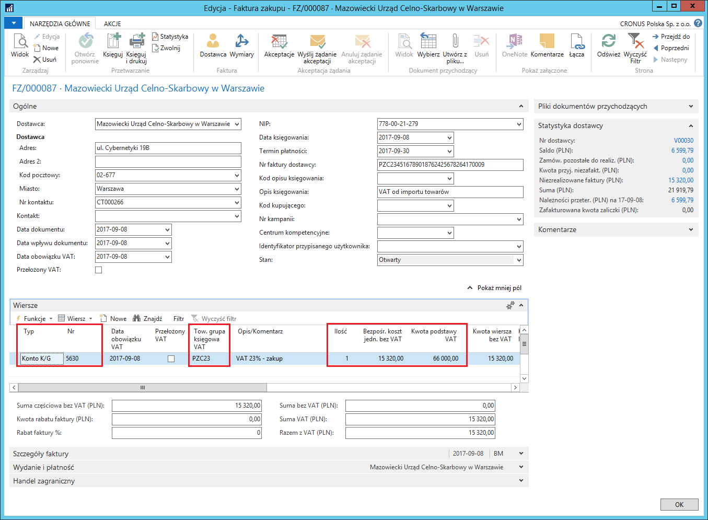{width="6.4086953193350835in" height="4.705871609798775in"}
  -------------------------------------------------------------------------------------
  Rysunek 2.49: Dokument PZC przed zaksięgowaniem

6.  Dokument należy zaksięgować wybierając **Księguj**.

Zaksięgowanie dokumentu powoduje zarejestrowanie w księgach firmowych
kwoty podatku VAT na wskazanym koncie VAT-u naliczonego
oraz zobowiązania wobec urzędu celno-skarbowego w tej samej wysokości,
na koncie zobowiązań zgodnym z ustawieniami grupy księgowej dostawcy
przypisanej do dokumentu. Ręcznie wprowadzona kwota podstawy VAT
kopiowana jest do zapisów VAT powiązanych z zaksięgowaną fakturą zakupu
(dokumentem PZC) i drukowana w rejestrze VAT zakupu.

  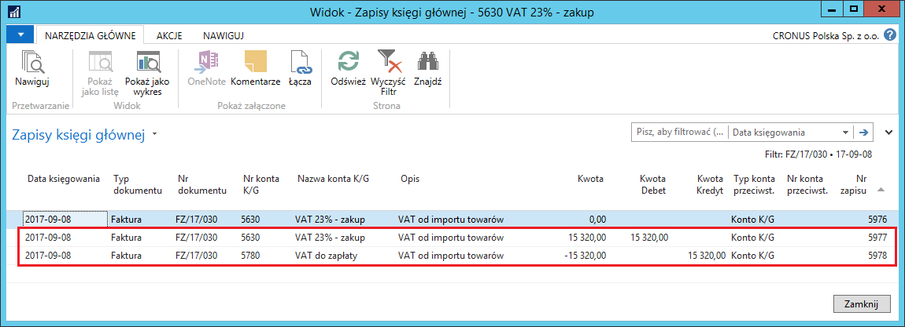{width="6.391303587051619in" height="2.3175306211723536in"}
  -------------------------------------------------------------------------------------
  Rysunek 2.50: Zapisy K/G zaksięgowanego dokumentu PZC

  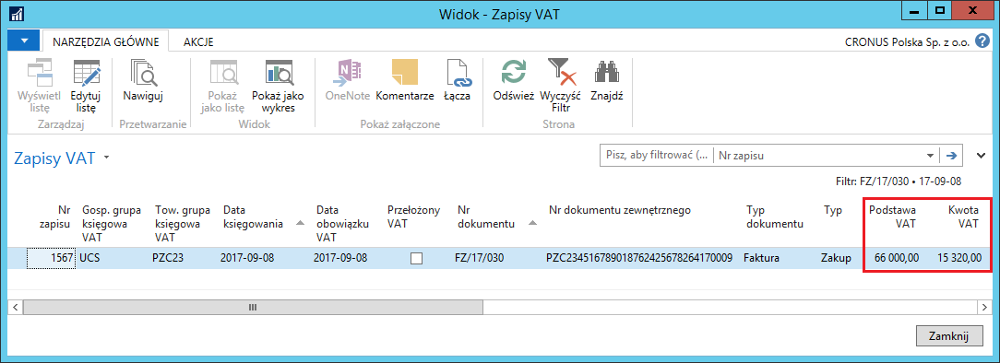{width="6.3909722222222225in" height="2.3228729221347333in"}
  --------------------------------------------------------------------------------------
  Rysunek 2.51: Zapisy vat zaksięgowanego dokumentu PZC

  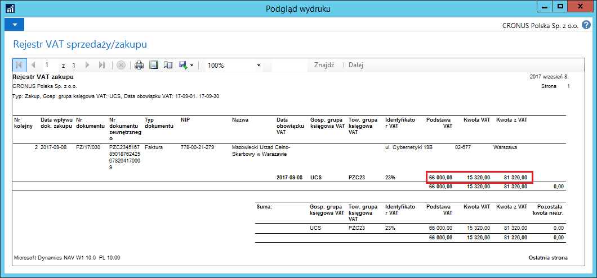{width="6.4in" height="2.9948720472440944in"}
  -----------------------------------------------------------------------
  Rysunek 2.52: zaksięgowany dokument PZC w rejestrze vAT

 {#section-5 .list-paragraph .Poziom-1}

VAT nie do odliczenia {#vat-nie-do-odliczenia .Poziom-1}
---------------------

### Informacje ogólne

W niektórych przypadkach VAT naliczony nie może być w 100% odliczony,
to znaczy, że tylko część kwoty podatku VAT może być wykazana
w rejestrze VAT, a pozostała część powinna zostać doliczona do kwoty
zakupu i zaksięgowana w koszty. W przypadku zakupu zapasu lub środka
trwałego, nieodliczalna część kwoty podatku VAT jest doliczana
do wartości zakupu zapasu lub środka trwałego i zaksięgowana jako część
kosztu nabycia.

Celem wdrożenia tego elementu Polskiej Lokalizacji systemu Microsoft
Dynamics 365 Business Central on‑premises jest umożliwienie:

-   Ustawienia częściowego odliczania podatku VAT naliczonego.

-   Księgowania transakcji zakupu z podatkiem naliczonym VAT częściowo
    > odliczanym.

-   Zwiększania kosztu nabycia zapasów i środków trwałych
    > o nieodliczalną część podatku naliczonego VAT.

### Ustawienia

Żeby system automatycznie wyliczał kwotę podatku VAT, która nie podlega
odliczeniu, muszą by zdefiniowane właściwe ustawienia kalkulacji podatku
VAT. W celu zdefiniowania niezbędnych ustawień, należy postępować
według następujących kroków:

1.  Należy wybrać **Działy \> Zarządzanie Finansami \> Administracja \>
    > Ustawienia księgowe VAT.**

2.  W oknie **Ustawienia księgowe VAT**, które się otworzy, należy
    > zaznaczyć wiersz z wybraną kombinacją kodów w polach: **Gosp.
    > grupa księgowa** **VAT** i **Tow. grupa księgowa VAT**,
    > a następnie wybrać **VAT nie do odliczenia**.

3.  W oknie **Ustawienia VAT nie do odliczenia**, które się otworzy,
    należy wypełnić pola:

-   **Od dnia** -- należy wprowadzić datę początkową okresu, w którym
    > kwota podatku VAT nie będzie podlegać odliczeniu w części
    > wprowadzonej w polu **VAT nie do odliczenia (%)**.

-   **VAT nie do odliczenia (%)** -- należy wprowadzić wartość kwoty
    > podatku VAT wyrażoną w procentach, jaka nie będzie podlegać
    > odliczeniu w okresie rozpoczynającym się datą wprowadzoną w polu
    > Od **dnia**.

  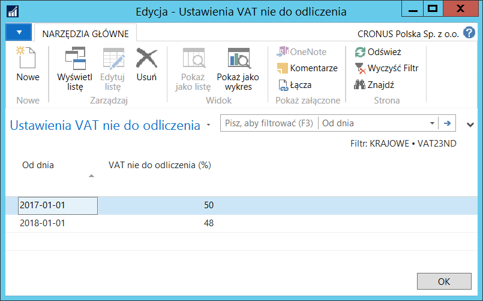{width="5.44488188976378in" height="3.4015748031496065in"}
  ------------------------------------------------------------------------------------
  Rysunek 2.53: Ustawienia VAT nie do odliczenia

Funkcjonalność VAT nie do odliczenia wymaga dodatkowych ustawień
w transakcjach zakupu, gdzie **Typ kalkulacji VAT** jest **Odwrotne
obciążenie** lub **Pełny VAT**. Aby je zdefiniować, należy postępować
według następujących kroków:

1.  Należy zamknąć okno **Ustawienia VAT nie do odliczenia** wybierając
    **OK**.

2.  W oknie **Ustawienia księgowe VAT** należy zaznaczyć wiersz
    z kombinacją grup dedykowanych do ewidencji zakupu z odwrotnym
    obciążeniem, a następnie należy wybrać **Edycja**.

3.  W oknie **Kartoteka ustaw. księg. VAT** na karcie skróconej
    **Zakupy** należy uzupełnić pole **Konto korekty kurs wal.
    odwrotnego obciążenia**. Konto to będzie używane tylko wtedy,
    gdy w ustawieniach dla wybranej kombinacji grup księgowych VAT
    wybrany jest **Typ kalkulacji VAT** = **Odwrotne obciążenie**.

> Na konto wybrane w tym polu system zaksięguje kwotę VAT naliczonego
> nie do odliczenia, ale tylko w części wynikającej z różnicy pomiędzy
> kursami waluty zastosowanymi do przeliczenia kwoty netto i kwoty VAT.
> Część kwoty VAT naliczonego nie do odliczenia wynikająca
> z przeliczenia kwoty VAT po kursie dla kwoty netto zostanie
> zaksięgowana standardowo, czyli dodana do wartości netto.

4.  W oknie **Ustawienia księgowe VAT** należy zaznaczyć wiersz
    z kombinacją grup dedykowanych do ewidencji zakupu z samym VAT (np.
    dokumentów SAD), a następnie należy wybrać **Edycja**.

5.  W oknie **Kartoteka ustaw. księg. VAT** na karcie skróconej
    **Zakupy** należy uzupełnić pole **Konto kosztu nie do odliczenia
    dla Pełny VAT**. Konto to będzie używane tylko wtedy,
    gdy w ustawieniach dla wybranej kombinacji grup księgowych VAT
    wybrany jest **Typ kalkulacji VAT** = **Pełny VAT**.

> Na konto wybrane w tym polu system zaksięguje kwotę VAT naliczonego
> nie do odliczenia. W tego typu transakcji kwota VAT nie do odliczenia
> nie może być dodana do wartości netto, gdyż w dokumentach z pełnym VAT
> koszt nie jest w ogóle księgowany (tylko VAT i zobowiązanie).

  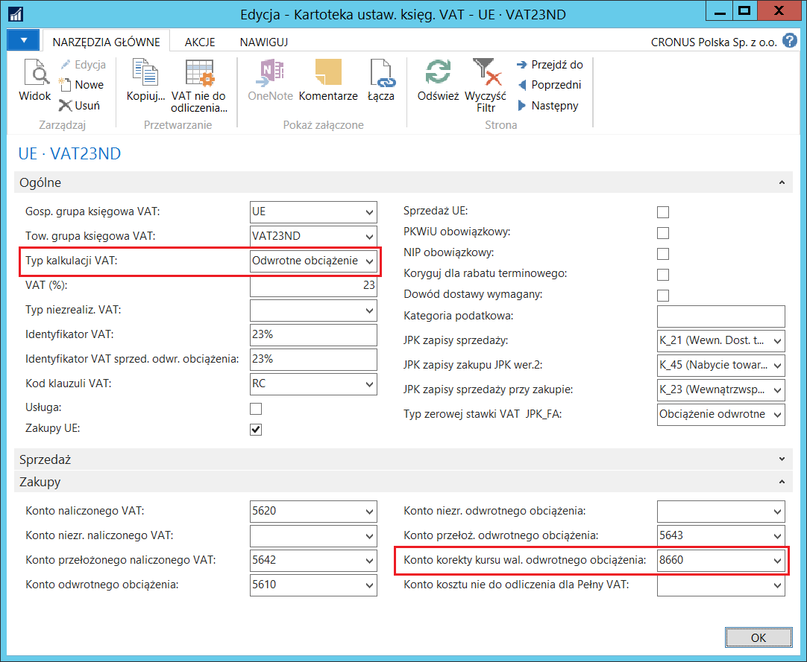{width="6.330949256342957in" height="5.201388888888889in"}
  ---------------------------------------------------------------------------------------------------------
  Rysunek 2.54: Ustawienia księgowe VAT -- VAT nie do odliczenia z typem kalkulacji „Odwrotne obciążenie"

  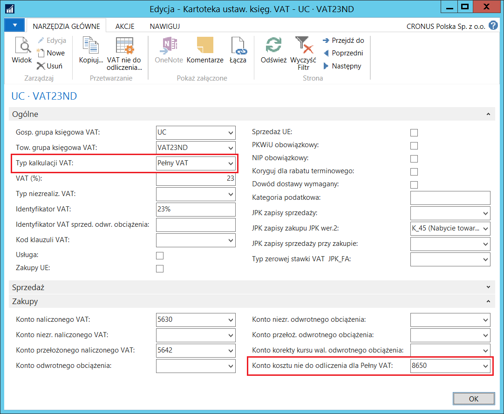{width="6.395833333333333in" height="5.254695975503062in"}
  -----------------------------------------------------------------------------------------------
  Rysunek 2.55: Ustawienia księgowe VAT -- VAT nie do odliczenia z typem kalkulacji „Pełny VAT"

### Obsługa

Żeby zaksięgować dokument zakupu z podatkiem VAT częściowo odliczalnym,
należy w sposób standardowy wprowadzić zamówienie lub fakturę zakupu,
wykorzystując grupy księgowe VAT, dla kombinacji których zostały
zdefiniowane ustawienia VAT nie do odliczenia. System, bazując
na zdefiniowanych wcześniej ustawieniach, podzieli odpowiednio obliczoną
kwotę podatku VAT i wykaże w oknie **Statystyki dokumentu zakupu**.

> {width="0.19in" height="0.19in"}
> **Uwaga:** Na podstawie **Daty obowiązku VAT** w wierszu
> faktury/zamówienia zakupu system ustala, czy kwota VAT z danego
> wiersza ma podlegać nieodliczeniu zgodnie z ustawieniami, tzn., czy
> mieści się ona w okresie wyznaczonym datami w polu Od **dnia** w oknie
> **Ustawienia VAT nie do odliczenia**. W sytuacji, gdy pole **Data
> obowiązku VAT** w wierszu faktury/zamówienia nie jest wypełnione
> lub data ta wykracza poza okres, o którym mowa powyżej, kwota VAT
> zostanie policzona zgodnie z **Ustawieniami księgowymi VAT**, bez
> uwzględnienia **Ustawień VAT nie do odliczenia**.

W celu przygotowania i zaksięgowania faktury zakupu z wykorzystaniem tej
funkcjonalności, należy postępować według następujących kroków:

1.  Należy standardowo wprowadzić fakturę zakupu zwracając uwagę,
    > aby użyta w niej była właściwa kombinacja kodów w polach **Gosp.
    > grupa księgowa** **VAT** i **Tow. grupa księgowa VAT**, a data
    > obowiązku VAT przypadała w okresie zaczynającym się od daty
    > wprowadzonej w polu Od **dnia** w oknie **Ustawienia VAT
    > nie do odliczenia** dla wybranej kombinacji grup księgowych VAT.

2.  W kartotece wprowadzonej faktury zakupu należy wybrać
    > **Statystyka.**

3.  W oknie **Statystyka zakupów**, które się otworzy, na karcie
    > skróconej **Wiersze** system wyświetla szczegóły obliczonych kwot.

> W polach: **VAT%**, **Kwota wiersza**, **Podstawa VAT**, **Kwota
> VAT**, **Kwota z VAT** pokazane są kwoty ogólne dla całej faktury
> zakupu, obejmują zarówno część kwoty podatku VAT podlegającą
> odliczeniu, jak i nie podlegającą odliczeniu.
>
> W polach: **VAT% (nie do odliczenia)**, **Podstawa VAT (nie
> do odliczenia)**, **Kwota VAT (nie do odliczenia)** pokazane
> są wartości dotyczące kalkulacji podatku VAT w części nie
> do odliczenia.

  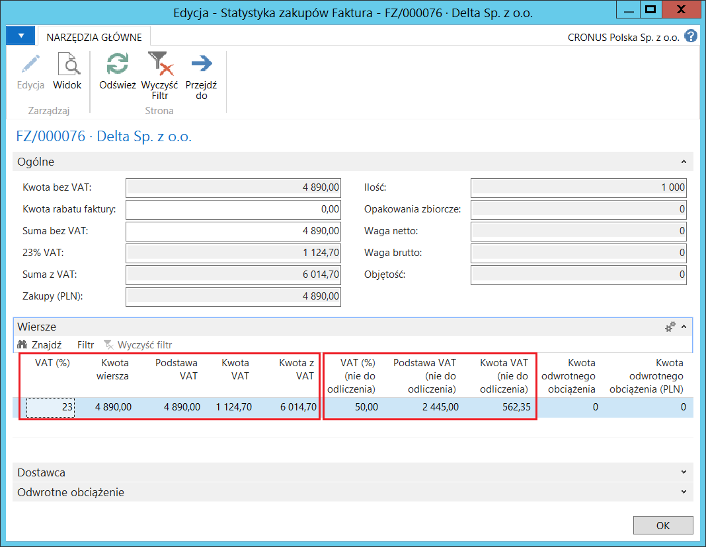{width="6.409722222222222in" height="4.975067804024497in"}
  ------------------------------------------------------------------------------------
  Rysunek 2.56: VAT w Statystyce faktury zakupu

### Z kalkulacji wyświetlonej w przykładowym oknie statystyk wynika, że system zaksięguje kwotę zakupu netto w wysokości 5 452,35 zł, kwotę podatku VAT w wysokości 562,35 zł i kwotę brutto w wysokości 6 014,70 zł. Żeby ją sprawdzić, trzeba wykonać kolejne kroki:

1.  Należy w sposób standardowy zaksięgować wprowadzoną fakturę zakupu.
    W oknie z komunikatem o treści *„Fakturę zaksięgowano i przeniesiono
    do okna Zaksięgowana faktura zakupu. Czy chcesz otworzyć
    zaksięgowaną fakturę?"* należy wybrać **Tak**.

2.  W oknie **Zaksięgowana faktura zakupu**, które się otworzy, należy
    wybrać **Nawiguj**.

```{=html}
<!-- -->
```
4.  W oknie **Nawigacja**, które się otworzy, należy zaznaczyć wiersz
    > **Zapis K/G** i wybrać **Pokaż powiązane zapisy**.

  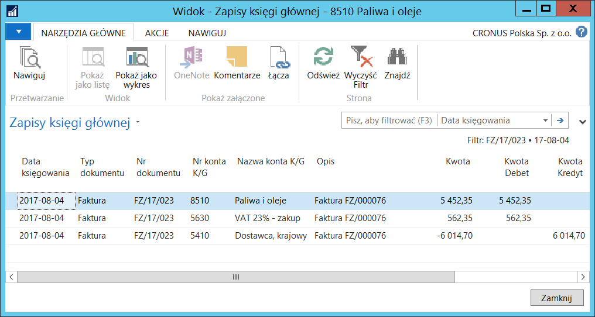{width="6.409722222222222in" height="3.41920384951881in"}
  -----------------------------------------------------------------------------------
  Rysunek 2.57: VAT nie do odliczenia w zapisach K/G

5.  Należy wybrać **Zamknij**, aby zamknąć okno **Zapisy księgi
    > głównej**.

6.  W oknie **Nawigacja** należy zaznaczyć wiersz **Zapis VAT** i wybrać
    > **Pokaż powiązane zapisy**.

  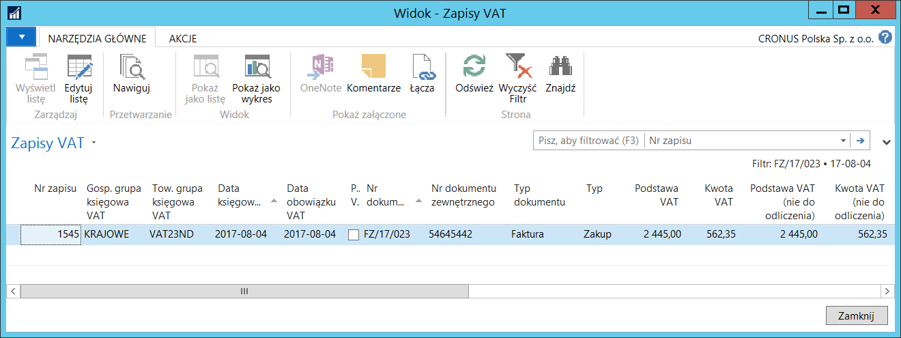{width="6.361111111111111in" height="2.3854166666666665in"}
  -------------------------------------------------------------------------------------
  Rysunek 2.58: VAT nie do odliczenia w zapisach VAT

Kwota VAT nie do odliczenia przy zakupie z odwrotnym obciążeniem
księgowana jest zwykle standardowo, a wyjątek stanowi sytuacja, w której
kurs wymiany waluty do przeliczenia wartości netto zakupu jest inny
niż kurs wymiany waluty do przeliczenia VAT. W tej sytuacji system
wykorzystuje konto K/G podane w polu **Konto korekty kursu wal.
odwrotnego obciążenia** w oknie **Ustawienia księgowe VAT**
do zaksięgowania nieodliczalnej kwoty VAT w koszty, ale tylko różnicy
wynikającej z zastosowania różnych kursów waluty, o czym mowa powyżej.

**[Przykład:]{.underline}**

Zakup o wartości 100 EUR.

VAT 23% (odwrotne obciążenie) nieodliczalny w 50%

**Wartość netto** 100 EUR \* kurs wymiany waluty 4,00 = **400 PLN**

**VAT należny** 23% \* wartość netto 100 EUR = **23 EUR** \* kurs
wymiany waluty 4,00 = **92 PLN**

**VAT naliczony** 50% \* (23% \* wartość netto 100 EUR = **23 EUR**) \*
kurs wymiany waluty 4,00 = **46 PLN**

**Kwota kosztu** = wartość netto PLN + nieodliczalna część wartości VAT
naliczonego = **446 PLN**

[Przeliczenie VAT po innym kursie wymiany waluty (1 EUR = 5
PLN)]{.underline}

**Różnica w kwocie VAT należnego** = (23 EUR \* 5,00) -- (23 EUR \*
4,00) = **23 PLN**

**Różnica w kwocie VAT naliczonego nie do odliczenia** = 50% \* ((23 EUR
\* 5,00) -- (23 EUR \* 4,00)) = **11,50 PLN**

**Różnica w kwocie VAT naliczonego do odliczenia =** ((23 EUR \* 5,00)
-- (23 EUR \* 4,00)) -- VAT naliczony nie do odliczenia = **11,50 PLN**

  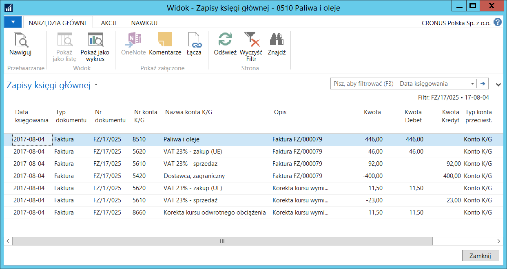{width="6.395833333333333in" height="3.406327646544182in"}
  ------------------------------------------------------------------------------------
  Rysunek 2.59: Zapisy K/G - VAT nie do odliczenia przy odwrotnym obciążeniu

  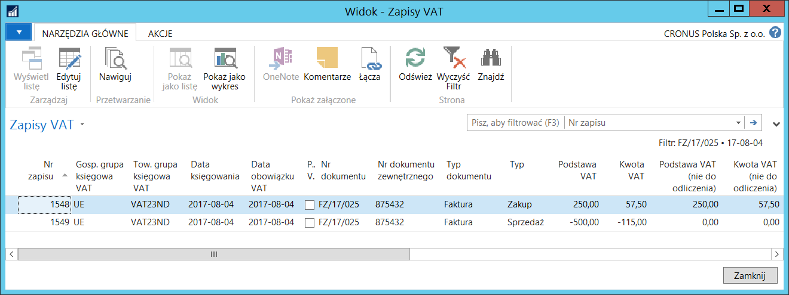{width="6.388888888888889in" height="2.3958333333333335in"}
  -------------------------------------------------------------------------------------
  Rysunek 2.60: Zapisy VAT - VAT nie do odliczenia przy odwrotnym obciążeniu

Kwota VAT nie do odliczenia przy ewidencji samego podatku VAT (np.
z dokumentu PZC) jest księgowana na konto kosztowe wybrane
w ustawieniach. W tego typu transakcji kwota VAT nie do odliczenia nie
może być dodana do wartości netto, gdyż w dokumentach z pełnym VAT koszt
nie jest w ogóle księgowany (tylko VAT i zobowiązanie).

W celu przygotowania i zaksięgowania faktury zakupu tylko z VAT,
którego częściowo nie można odliczyć, należy postępować
według następujących kroków:

1.  Fakturę zakupu należy wprowadzić w sposób typowy dla ewidencji
    dokumentów z pełnym VAT, zwracając uwagę, aby użyta w niej była
    właściwa kombinacja kodów w polach **Gosp. grupa księgowa** **VAT**
    i **Tow. grupa księgowa VAT**, a data obowiązku VAT przypadała
    w okresie zaczynającym się od daty wprowadzonej w polu Od **dnia**
    w oknie **Ustawienia VAT nie do odliczenia** dla wybranej kombinacji
    grup księgowych VAT.

> {width="0.19in" height="0.19in"}
> **Uwaga:** Księgowanie dokumentów tylko z VAT opisane jest w rozdziale
> **2.7. Księgowanie pełnego VAT**.

2.  W kartotece wprowadzonej faktury zakupu należy wybrać
    > **Statystyka.**

  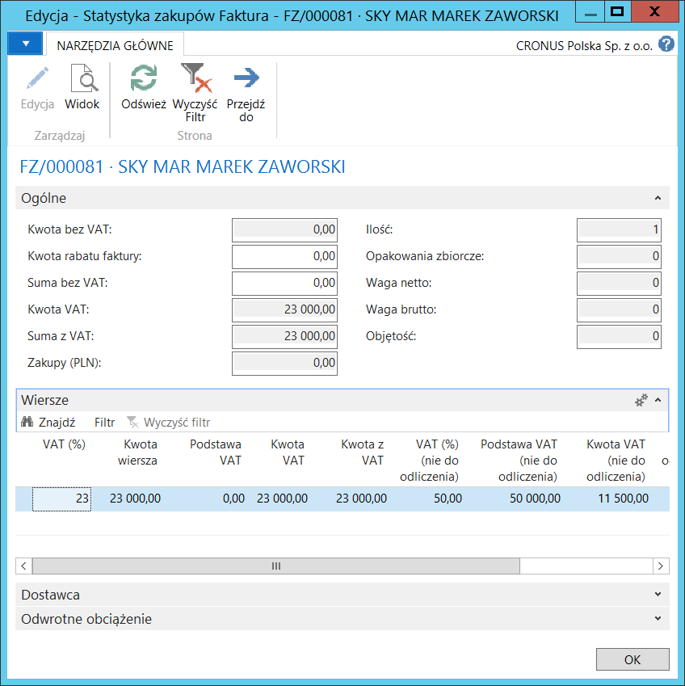{width="5.744094488188976in" height="5.751968503937008in"}
  ------------------------------------------------------------------------------------
  Rysunek 2.61: Statystyka faktury zakupu z pełnym VAT częściowo nieodliczalnym

3.  Należy w sposób standardowy zaksięgować wprowadzoną fakturę zakupu.
    > W oknie z komunikatem o treści *„Fakturę zaksięgowano
    > i przeniesiono do okna Zaksięgowana faktura zakupu. Czy chcesz
    > otworzyć zaksięgowaną fakturę?"* należy wybrać **Tak**.

4.  W oknie **Zaksięgowana faktura zakupu**, które się otworzy, należy
    wybrać **Nawiguj**.

```{=html}
<!-- -->
```
3.  

4.  

5.  W oknie **Nawigacja**, które się otworzy, należy zaznaczyć wiersz
    **Zapis K/G** i wybrać **Pokaż powiązane zapisy**. Można zauważyć,
    że kwota VAT w części nie do odliczenia została zaksięgowana
    na konto kosztowe, które zostało wybrane w polu **Konto kosztu nie
    do odliczenia dla Pełny VAT** w **Ustawieniach księgowych VAT**
    dla kombinacji grup księgowych VAT użytych w tej fakturze zakupu:

  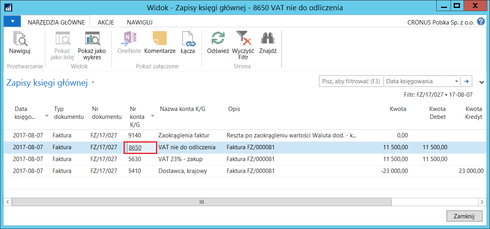{width="6.375in" height="2.979086832895888in"}
  ------------------------------------------------------------------------
  Rysunek 2.62: Zapisy K/G - VAT nie do odliczenia przy Pełnym VAT

6.  Należy wybrać **Zamknij**, aby zamknąć okno **Zapisy księgi
    głównej**.

7.  W oknie **Nawigacja** należy zaznaczyć wiersz **Zapis VAT** i wybrać
    **Pokaż powiązane zapisy**.

  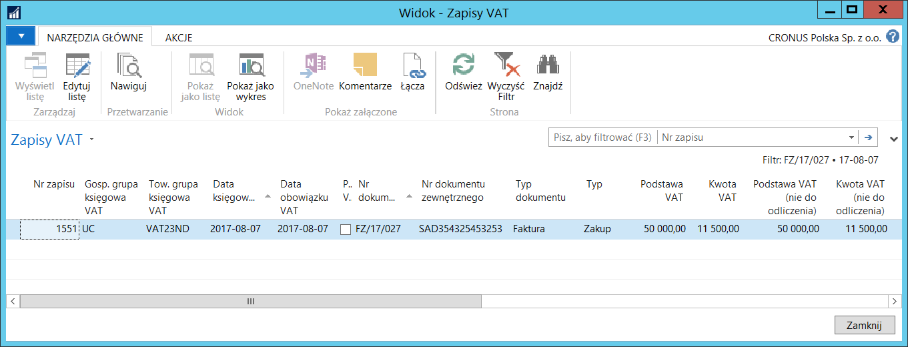{width="6.402777777777778in" height="2.4461898512685916in"}
  -------------------------------------------------------------------------------------
  Rysunek 2.63: Zapisy VAT - VAT nie do odliczenia przy Pełnym VAT

 {#section-6 .list-paragraph .Poziom-1}

Pomijanie transakcji w ewidencji VAT {#pomijanie-transakcji-w-ewidencji-vat .Poziom-1}
------------------------------------

### Informacje ogólne

Księgowanie dokumentów zakupu i dokumentów sprzedaży w Microsoft
Dynamics 365 Business Central on‑premises skutkuje powstaniem zapisów
VAT, które są bazą do rozliczenia VAT za dany okres. Jednak są takie
transakcje, które nie podlegają opodatkowaniu VAT, dlatego w ramach
Polskiej Lokalizacji zostało dodane narzędzie, które umożliwia
wykluczanie wybranych zapisów VAT z rozliczenia VAT.

### Ustawienia

W przypadku, gdy transakcje z wybraną kombinacją grup księgowych VAT
nigdy nie podlegają opodatkowaniu VAT, możliwe jest ich domyślne
oznaczenie jako pomijane w ewidencji VAT. W tym celu, należy postępować
według następujących kroków:

1.  Należy wybrać **Działy \> Zarządzanie Finansami \> Administracja \>
    > Ustawienia księgowe VAT**.

2.  W oknie **Ustawienia księgowe VAT**, które się otworzy, należy
    > ustawić kursor w wierszu z wybraną kombinacją grup księgowych VAT,
    > a następnie wybrać **Edycja**.

3.  W oknie **Kartoteka ustaw. księg. VAT**, które się otworzy, należy
    > zaznaczyć pole **Pomiń w ewidencji VAT**.

  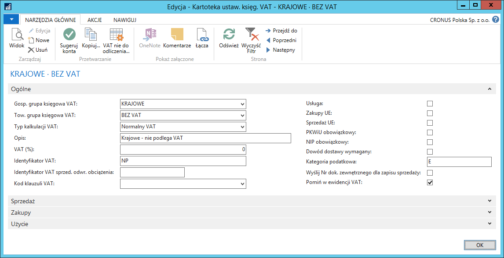{width="6.395833333333333in" height="3.2874311023622047in"}
  -------------------------------------------------------------------------------------
  Rysunek 2.64: Kartoteka ustawień księgowych VAT

### Obsługa

Funkcjonalność **Pomiń w ewidencji VAT** opisana jest na przykładzie
faktur zakupu, ale może być wykorzystana w wierszach następujących
dokumentów: **Zamówienie zakupu**, **Faktura zakupu**, **Zamówienie
zwrotu zakupu**, **Faktura korygująca zakupu**, **Zamówienie
sprzedaży**, **Faktura sprzedaży**, **Zamówienie zwrotu sprzedaży**,
**Faktura korygująca sprzedaży**. Pole **Pomiń w ewidencji VAT** można
też edytować w wierszach dzienników głównych oraz w oknie
**VAT‑dodatkowe informacje**. Po zaksięgowaniu transakcji z VAT,
informacja o pominięciu w ewidencji VAT zapisywana jest w wierszach
zaksięgowanych dokumentów: **Zaksięgowana faktura zakupu**,
**Zaksięgowana faktura korygująca zakupu**, **Zaksięgowana faktura
sprzedaży**, **Zaksięgowana faktura korygująca sprzedaży**. **Pomiń w
ewidencji VAT** zapamiętane jest również w tabelach: **Zapis VAT**
oraz **Szczegółowy zapis VAT**.

> {width="0.19in" height="0.19in"}
> **Uwaga:** Zarządzanie pomijaniem i pokazywaniem poszczególnych
> zapisów VAT w ewidencji VAT po zaksięgowaniu dokumentów możliwe jest w
> oknie **Arkusz rozliczania VAT**. Więcej informacji na ten temat
> znajduje się w rozdziale **Arkusz rozliczania VAT**.

Aby zaksięgować fakturę zakupu z pominięciem w ewidencji VAT, należy
postępować według następujących kroków:

1.  Fakturę zakupu należy wprowadzić w standardowy sposób.

2.  W wybranym wierszu faktury należy zaznaczyć pole **Pomiń w ewidencji
    VAT**.

> {width="0.19in" height="0.19in"}
> **Uwaga:** W przypadku wprowadzenia wiersza dokumentu z kombinacją
> grup księgowych VAT, dla której w oknie **Ustawienia księgowe VAT**
> zaznaczone jest pole **Pomiń w ewidencji VAT**, spowoduje automatyczne
> zaznaczenie tego pola w wierszu dokumentu.

  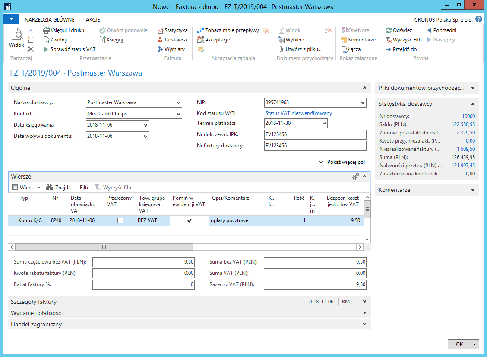{width="6.354166666666667in" height="4.652933070866141in"}
  ------------------------------------------------------------------------------------
  Rysunek 2.65: Wiersz faktury zakupu

Po zaksięgowaniu dokumentu utworzone zostaną m.in. zapisy w tabelach
**Zapisy VAT** i **Szczegółowe zapisy VAT**, w których pole **Pomiń w
ewidencji VAT** będzie zaznaczone.

  ---------------------------------------------------
  Rysunek 2.66: Zapisy VAT i Szczegółowe zapisy VAT
  ---------------------------------------------------

Zamówienia i faktury wewnętrzne sprzedaży {#zamówienia-i-faktury-wewnętrzne-sprzedaży .Poziom-1}
-----------------------------------------

### Informacje ogólne

Zgodnie z polskim prawem w przypadku nieodpłatnego przekazania towarów
i usług, w pewnych przypadkach, transakcję taką należy potraktować
z punktu widzenia podatku VAT jako sprzedaż i naliczyć VAT należny. Tak
naliczona kwota podatku VAT jest traktowana jako koszt. Polska
Lokalizacja została wyposażona w narzędzie upraszczające proces
dodatkowej ewidencji podatku VAT dla tego rodzaju transakcji

### Ustawienia

Żeby móc tworzyć i księgować wewnętrzne zamówienia i faktury sprzedaży,
konieczne jest zdefiniowanie kartoteki nabywcy wewnętrznego z właściwymi
parametrami. W tym celu, należy postępować według następujących kroków:

1.  Należy wybrać **Działy \> Zarządzanie Finansami \> Administracja \>
    Gł. gospodarcze grupy księgowe**.

2.  W oknie **Gł. gospodarcze grupy księgowe**, które się otworzy,
    > należy zdefiniować kod nowej grupy, która będzie wykorzystana
    > do dokonania technicznych księgowań wewnętrznych faktur sprzedaży.

  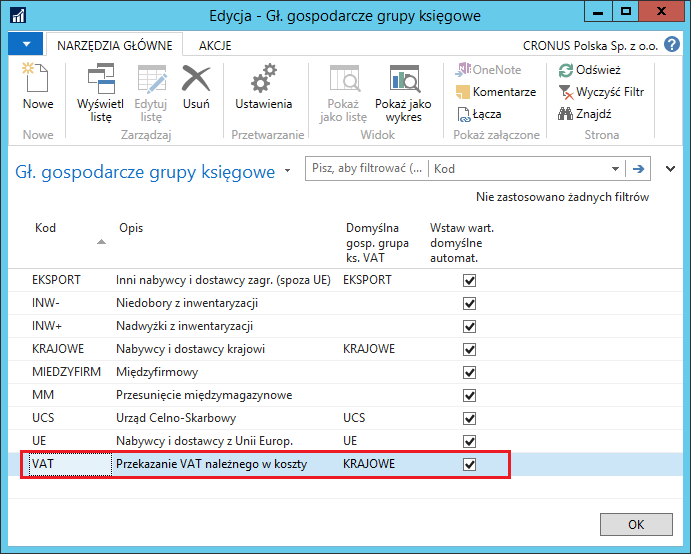{width="5.811023622047244in" height="4.65748031496063in"}
  -----------------------------------------------------------------------------------
  Rysunek 2.67: Główne gospodarcze grupy księgowe

3.  W tym samym oknie należy zaznaczyć wiersz z nową grupą i wybrać
    > **Ustawienia**.

4.  W oknie **Główne ustawienia księgowania**, które się otworzy, należy
    > wybrać **Nowe** (czynność z tego i następnego kroku należy
    > powtórzyć dla każdej wybranej kombinacji kodów **Głównej
    > gospodarczej grupy księgowej** i **Głównej towarowej grupy
    > księgowej**).

5.  W oknie **Kartoteka gł. ustawień księg.**, które się otworzy, należy
    > zdefiniować właściwe ustawienia, wprowadzając to samo konto
    > pozabilansowe K/G przeznaczone do technicznych księgowań w polach
    > umieszczonych na karcie skróconej **Sprzedaż**: **Konto
    > sprzedaży**, **Konto faktury kor. sprzedaży**, **Konto rabatu
    > wiersza sprzedaży**, **Konto rabatu faktury sprzedaży**. Na karcie
    > skróconej **Zapasy** należy uzupełnić pole **Konto KWS**
    > wybierając w nim konto K/G przeznaczone do zaksięgowania w koszty
    > wartości towaru wydanego bezpłatnie.

  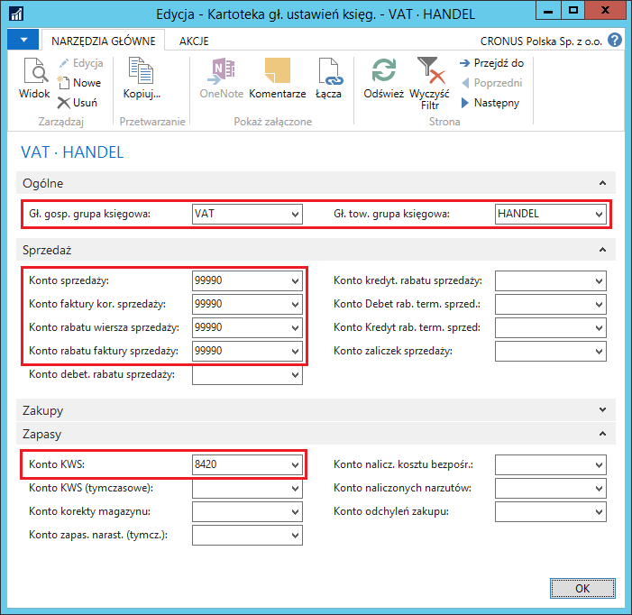{width="5.909448818897638in" height="5.748031496062992in"}
  ------------------------------------------------------------------------------------
  Rysunek 2.68: Kartoteka głównych ustawień księgowania

6.  Należy wybrać **Działy \> Zarządzanie Finansami \> Administracja \>
    > Grupy księgowe nabywców**.

7.  W oknie **Grupy księgowe nabywców**, które się otworzy, w pierwszym
    > wolnym wierszu należy wprowadzić unikalny kod grupy księgowej
    > nabywców przeznaczonej do księgowań technicznych i w polu **Konto
    > należności** wybrać to samo konto pozabilansowe K/G przeznaczone
    > do technicznych księgowań, które zostało użyte w oknie **Główne
    > ustawienia księgowania**:

  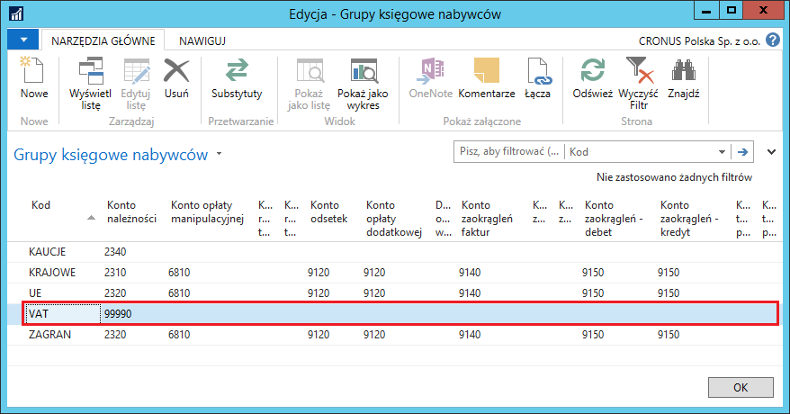{width="6.382608267716535in" height="3.344050743657043in"}
  ------------------------------------------------------------------------------------
  Rysunek 2.69: Grupy księgowe nabywców

8.  Należy wybrać **Działy \> Zarządzanie Finansami \> Administracja \>
    > Metody płatności**.

9.  W oknie **Metody płatności**, które się otworzy, w pierwszym wolnym
    > wierszu należy wprowadzić unikalny kod i opis metody płatności
    > przeznaczonej do rozliczenia księgowań technicznych, w polu **Typ
    > konta przeciwst.** należy wybrać **Konto K/G**, a w polu **Nr
    > konta przeciwst.** wybrać to samo konto pozabilansowe K/G
    > przeznaczone do technicznych księgowań, które zostało użyte
    > we wcześniej zdefiniowanych ustawieniach.

  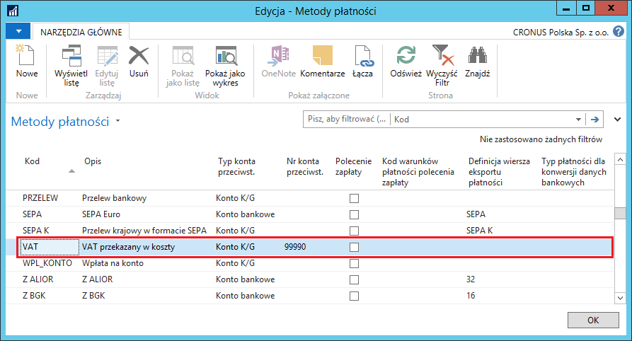{width="6.391303587051619in" height="3.4496653543307088in"}
  -------------------------------------------------------------------------------------
  Rysunek 2.70: Metody płatności

10. Należy zdefiniować kartotekę nabywcy technicznego do księgowania
    > faktur wewnętrznych sprzedaży. W tym celu należy w sposób
    > standardowy założyć nową kartotekę nabywcy, wprowadzając
    > specyficzne parametry: zalecane jest, żeby nazwa, dane adresowe
    > i NIP nabywcy technicznego były identyczne z danymi firmy,
    > lecz nie jest to wymóg obligatoryjny. Niżej wymienione pola należy
    > wypełnić zgodnie z opisem:

-   Na karcie skróconej **Fakturowanie**:

```{=html}
<!-- -->
```
-   **Gł. gosp. grupa księgowa** -- z listy rozwijanej w tym polu należy
    > wybrać kod wcześniej zdefiniowanej grupy.

-   **Gosp. grupa księgowa VAT** -- z listy rozwijanej w tym polu należy
    > wybrać kod grupy, której ustawienia będą obowiązywały w kalkulacji
    > podatku VAT należnego do przekazania w koszty.

-   **Grupa księgowa nabywcy** -- z listy rozwijanej w tym polu należy
    > wybrać kod wcześniej zdefiniowanej grupy.

```{=html}
<!-- -->
```
-   Na karcie skróconej **Płatności**:

```{=html}
<!-- -->
```
-   **Kod metody płatności** -- z listy rozwijanej w tym polu należy
    > wybrać kod wcześniej zdefiniowanej metody.

  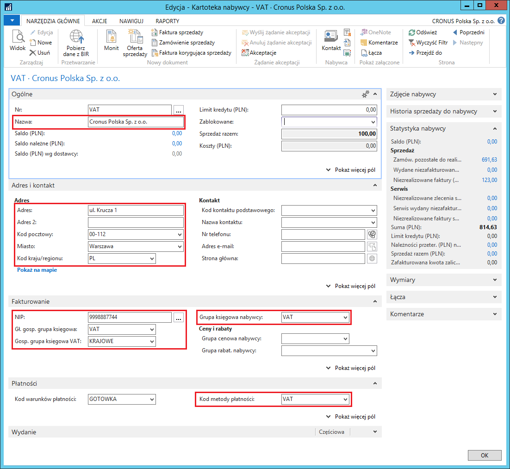{width="6.4086953193350835in" height="5.8910695538057745in"}
  --------------------------------------------------------------------------------------
  Rysunek 2.71: Kartoteka nabywcy technicznego

11. Należy zdefiniować kody dla podatku VAT przekazywanego w koszty,
    > wraz z przypisanymi do nich właściwymi kontami K/G. W tym celu
    > należy wybrać **Działy \> Zarządzanie Finansami \>
    > Administracja \> Kody VAT'u przekazanego**.

12. W oknie **Kody VAT'u przekazanego**, które się otworzy, w pierwszym
    wolnym wierszu należy wprowadzić ustawienia:

-   **Kod --** w tym polu należy wprowadzić unikalny kod dla danego typu
    > podatku VAT do przekazania w koszty

-   **Opis --** w tym polu należy wprowadzić opis danego typu podatku
    > VAT do przekazania w koszty

-   **Konto kosztu VAT** -- z listy rozwijanej w tym polu należy wybrać
    > konto K/G kosztowe, na którym ma być zaksięgowana kwota podatku
    > VAT

-   **Konto rozliczenia VAT** - z listy rozwijanej w tym polu należy
    > wybrać to samo konto pozabilansowe K/G przeznaczone
    > do technicznych księgowań, które zostało użyte we wcześniej
    > zdefiniowanych ustawieniach.

  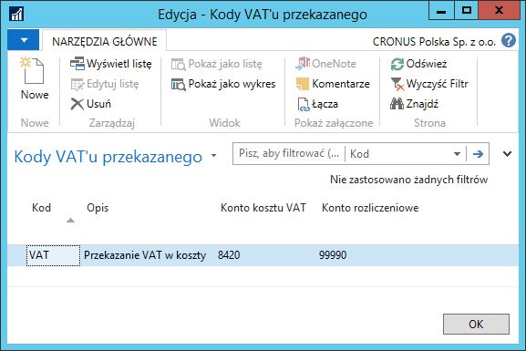{width="4.8700787401574805in" height="3.248031496062992in"}
  -------------------------------------------------------------------------------------
  Rysunek 2.72: Kody VAT'u przekazanego

### Obsługa

W celu obliczenia i zaksięgowania podatku VAT należnego od wartości
bezpłatnie przekazanych towarów lub produktów, należy postępować
według następujących kroków:

1.  Należy otworzyć nową kartotekę zamówienia sprzedaży i z listy
    > rozwijanej w polu **Nr nabywcy (sprzedaż)** należy wybrać
    > wcześniej zdefiniowanego nabywcę technicznego lub nabywcę, któremu
    > przekazywany jest towar -- w tym drugim przypadku konieczne jest
    > wybranie nabywcy technicznego w polu **Nr odbiorcy faktury**
    > na karcie skróconej **Fakturowanie**. System automatycznie
    > uzupełnił część pól w nagłówku faktury sprzedaży na podstawie
    > danych przypisanych domyślnie do kartoteki wybranego nabywcy
    > (odbiorcy faktury), m.in. nazwa i adres nabywcy, **Gł. gosp. grupa
    > księgowa**, **Gosp. grupa księgowa VAT**, **Grupa księgowa
    > nabywcy**, **Kod metody płatności**.

> Konieczne jest wybranie właściwego, wcześniej zdefiniowanego typu
> podatku VAT do przekazania z listy rozwijanej w polu **Kod VAT'u
> przekazanego**.

  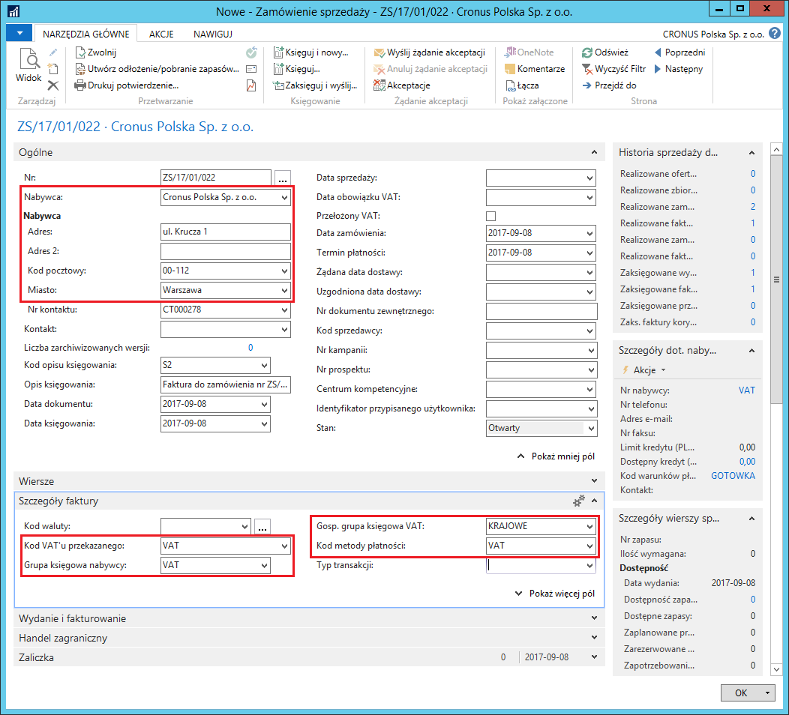{width="6.4in" height="5.803760936132983in"}
  ----------------------------------------------------------------------
  Rysunek 2.73: Nagłówek zamówienia sprzedaży

2.  Na karcie skróconej **Wiersze**, w polu **Typ** należy wybrać
    **Zapas**, a w polu **Nr** należy wybrać zapas, który zostanie
    przekazany bezpłatnie. Pola: **Ilość i Kod lokalizacji** należy
    wypełnić standardowo. W polu **Cena jednostkowa bez VAT** należy
    wprowadzić cenę sprzedaży, na podstawie której zostanie ustalona
    kwota stanowiąca podstawę do obliczenia podatku VAT należnego
    do przekazania w koszty.

  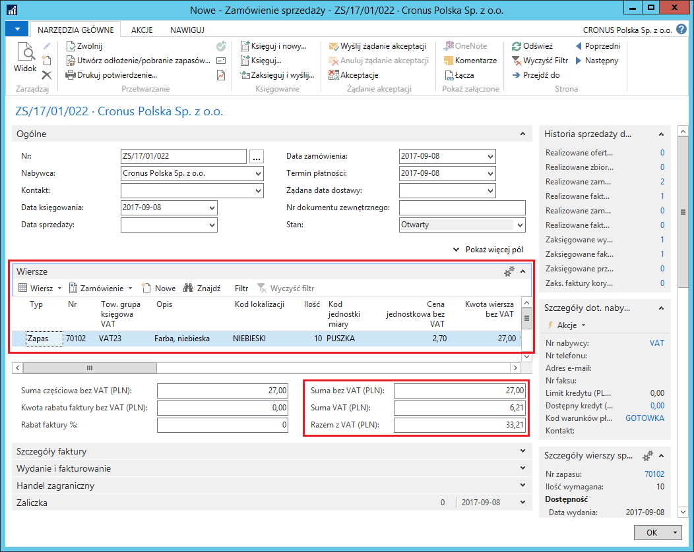{width="6.382608267716535in" height="5.084266185476816in"}
  ------------------------------------------------------------------------------------
  Rysunek 2.74: Wiersze zamówienia sprzedaży i podsumowanie

3.  Pozostałe dane w zamówieniu sprzedaży należy wprowadzić standardowo
    i zaksięgować wydanie i fakturę sprzedaży.

W wyniku zaksięgowania faktury sprzedaży z zamówienia wewnętrznego
powstaną zapisy księgi głównej, zgodne z ustawieniami. Kwota podatku VAT
zostanie zaksięgowana na kontach K/G: podatku VAT należnego i kosztowym,
wartość wydanego towaru zostanie zaksięgowana na kontach K/G:
magazynowym i kosztowym, a pozostałe kwoty netto i brutto, będące
wynikiem technicznych automatycznych księgowań, zostaną zaksięgowane
na pozabilansowym koncie technicznym K/G użytym w ustawieniach.

Efekty zaksięgowania wewnętrznej faktury sprzedaży można zobaczyć
postępując według kroków:

1.  Należy otworzyć kartotekę zaksięgowanej faktury sprzedaży i wybrać
    > akcję **Nawiguj**.

2.  W oknie **Nawigacja**, które się otworzy, należy zaznaczyć tabelę
    > **Zapis K/G i **wybrać akcję **Pokaż powiązane zapisy**.

  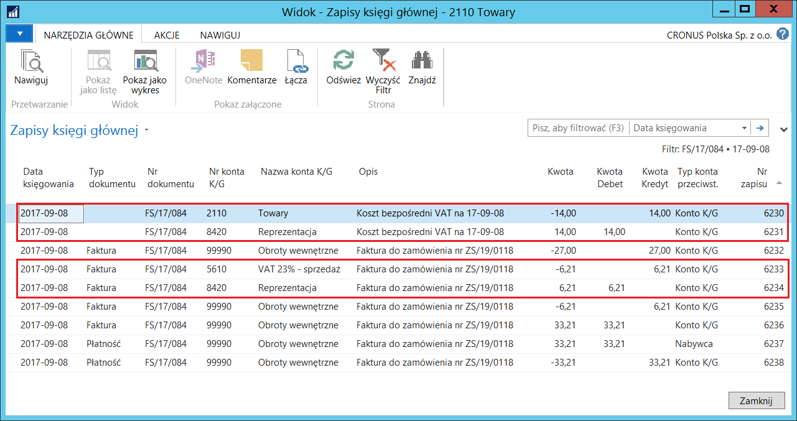{width="6.395833333333333in" height="3.379678477690289in"}
  ---------------------------------------------------------------------------------------------
  Rysunek 2.75: Zapisy K/G zaksięgowanej wewnętrznej faktury sprzedaży do bezpłatnego wydania

W celu wystawienia wewnętrznej faktury sprzedaży do zakupów kosztowych
związanych z reklamą i reprezentacją, należy postępować
według następujących kroków:

1.  Należy otworzyć nową kartotekę faktury sprzedaży i z listy
    > rozwijanej w polu **Nr nabywcy (sprzedaż)** należy wybrać
    > wcześniej zdefiniowanego nabywcę technicznego. System
    > automatycznie uzupełnił część pól w nagłówku faktury sprzedaży
    > na podstawie danych przypisanych domyślnie do kartoteki wybranego
    > nabywcy, m.in. nazwa i adres nabywcy, **Gł. gosp. grupa
    > księgowa**, **Gosp. grupa księgowa VAT**, **Grupa księgowa
    > nabywcy**, **Kod metody płatności**.

> Konieczne jest wybranie właściwego, wcześniej zdefiniowanego typu
> podatku VAT do przekazania z listy rozwijanej w polu **Kod VAT'u
> przekazanego**.

  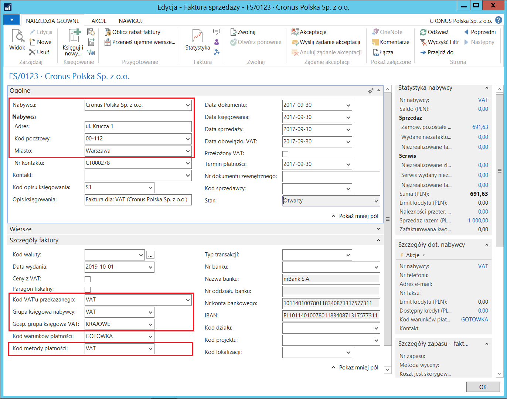{width="6.402777777777778in" height="5.040135608048994in"}
  ------------------------------------------------------------------------------------
  Rysunek 2.76: Nagłówek wewnętrznej faktury sprzedaży

2.  Na karcie skróconej **Wiersze**, w polu **Typ** należy wybrać
    **Konto K/G**, a w polu **Nr** należy wybrać to samo konto
    pozabilansowe K/G przeznaczone do technicznych księgowań,
    które zostało użyte we wcześniej zdefiniowanych ustawieniach. W polu
    **Ilość** należy wprowadzić cyfrę **1**, a w polu **Cena jednostkowa
    bez VAT** należy wprowadzić kwotę stanowiąca podstawę do obliczenia
    podatku VAT należnego do przekazania w koszty.

  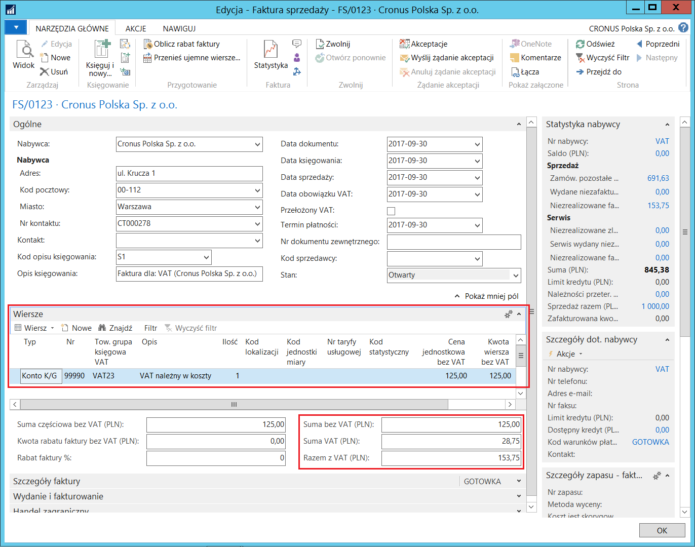{width="6.395833333333333in" height="5.034668635170604in"}
  ------------------------------------------------------------------------------------
  Rysunek 2.77: Wiersze wewnętrznej faktury sprzedaży i podsumowanie

3.  Pozostałe dane w fakturze sprzedaży należy wprowadzić standardowo
    i ją zaksięgować.

W wyniku zaksięgowania wewnętrznej faktury sprzedaży powstaną zapisy
księgi głównej, zgodne z ustawieniami. Kwota podatku VAT zostanie
zaksięgowana na kontach K/G: podatku VAT należnego i konto kosztowe,
a pozostałe kwoty netto i brutto, będące wynikiem technicznych
automatycznych księgowań, zostaną zaksięgowane na pozabilansowym koncie
technicznym K/G użytym w ustawieniach.

Efekty zaksięgowania wewnętrznej faktury sprzedaży można zobaczyć
postępując według kroków:

1.  Należy otworzyć kartotekę zaksięgowanej faktury sprzedaży i wybrać
    > **Nawiguj**.

2.  W oknie **Nawigacja**, które się otworzy, należy zaznaczyć tabelę
    > **Zapis K/G** i wybrać **Pokaż**.

  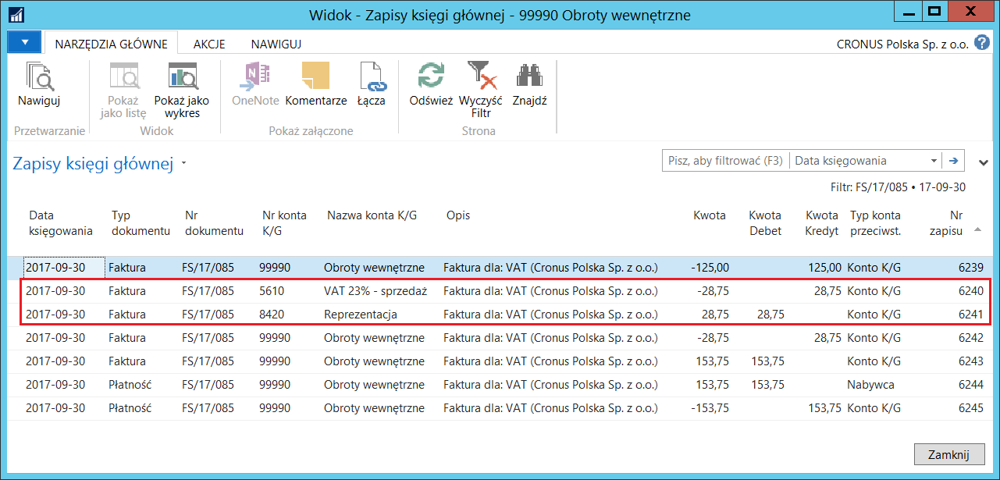{width="6.395833333333333in" height="3.070136701662292in"}
  ------------------------------------------------------------------------------------
  Rysunek 2.78: Zapisy K/G zaksięgowanej wewnętrznej faktury sprzedaży

> {width="0.19in" height="0.19in"}
> **Uwaga:** Proces przekazania podatku VAT w koszty może być
> obsługiwany w dokumentach: **Faktura sprzedaży**, **Zamówienie
> sprzedaży**, **Faktura korygująca sprzedaży**, **Zamówienie zwrotu
> sprzedaży**.

Obsługa odwrotnego obciążenia {#obsługa-odwrotnego-obciążenia .Poziom-1}
-----------------------------

#### Odwrotne obciążenie w transakcjach zakupu {#odwrotne-obciążenie-w-transakcjach-zakupu .Poziom-2}

### Informacje ogólne

Zgodnie z wymaganiami przepisów polskiego prawa, wewnątrzwspólnotowe
nabycie towarów (WNT) i usług oraz import usług podlegają opodatkowaniu
VAT, co jest jednoznaczne z koniecznością wykazania transakcji
z obliczonym podatkiem VAT w rejestrze VAT. Do obliczania naliczonego
i należnego podatku VAT z tytułu tego typu transakcji wykorzystywana
jest standardowa funkcjonalność **Odwrotne obciążenie**.
Aby przystosować tą funkcjonalność do wymagań polskiego prawa, zostały
do niej dodane następujące elementy:

-   Funkcjonalność **Odwrotne obciążenie** została rozszerzona
    > o tworzenie zapisu VAT dla sprzedaży. Dzięki temu transakcja WNT
    > i zakupu usług z kwotą podatku VAT należnego wykazywane są zarówno
    > w rejestrze VAT sprzedaży, jak i zakupu.

-   Polska Lokalizacja dla Microsoft Dynamics 365 Business Central
    > on‑premises umożliwia również kalkulację podatku VAT w walucie
    > lokalnej według kursu wymiany z innego dnia niż data przeliczenia
    > wartości zakupu i zobowiązań na potrzeby ksiąg rachunkowych.

### Ustawienia

Do kalkulacji i księgowania podatku VAT w ramach odwrotnego obciążenia
konieczne jest zdefiniowanie właściwych ustawień. W tym celu, należy
postępować według następujących kroków:

1.  Należy wybrać **Działy \> Zarządzanie Finansami \> Administracja \>
    Ustawienia Księgowe VAT**.

2.  W oknie **Ustawienia księgowe VAT**, które się otworzy, należy
    zaznaczyć wiersz z kombinacją kodów w polach **Gosp. grupa księgowa
    VAT** i **Tow. grupa księgowa VAT**, która odnosi się do transakcji
    wewnątrzwspólnotowego nabycia towarów i usług oraz importu usług,
    a następnie należy wybrać **Edycja**.

3.  W oknie **Kartoteka ustaw. księg. VAT** należy zwrócić uwagę
    na kilka pól:

-   **Typ kalkulacji VAT na **karcie skróconej **Ogólne** -- w tym polu
    > musi być wybrana opcja **Odwrotne obciążenie**.

-   **Konto odwrotnego obciążenia na **karcie skróconej **Zakupy** --
    > z listy rozwijanej w tym polu należy wybrać konto K/G, na
    > które zostanie zaksięgowana kwota podatku VAT należnego obliczona
    > dla transakcji wewnątrzwspólnotowego nabycia towarów i usług
    > oraz importu usług.

-   **Konto niezr. odwrotnego obciążenia** na karcie skróconej
    > **Zakupy** -- z listy rozwijanej w tym polu należy wybrać konto
    > K/G, na które zostanie zaksięgowana niezrealizowana kwota podatku
    > VAT należnego obliczona dla transakcji wewnątrzwspólnotowego
    > nabycia towarów i usług oraz importu usług.

-   **Konto przełoż. odwrotnego obciążenia** na karcie skróconej
    > **Zakupy** -- z listy rozwijanej w tym polu należy wybrać konto
    > K/G, na które zostanie zaksięgowana przełożona kwota podatku VAT
    > należnego obliczona dla transakcji wewnątrzwspólnotowego nabycia
    > towarów i usług oraz importu usług.

-   **Konto korekty kursu wal. odwrotnego obciążenia** na karcie
    > skróconej **Zakupy** -- z listy rozwijanej w tym polu należy
    > wybrać konto K/G, na które zostanie zaksięgowana różnica
    > wynikająca z przeliczenia VAT według innego kursu
    > niż zobowiązanie, ale dotyczy to tylko kwoty VAT nie podlegającej
    > odliczeniu.

  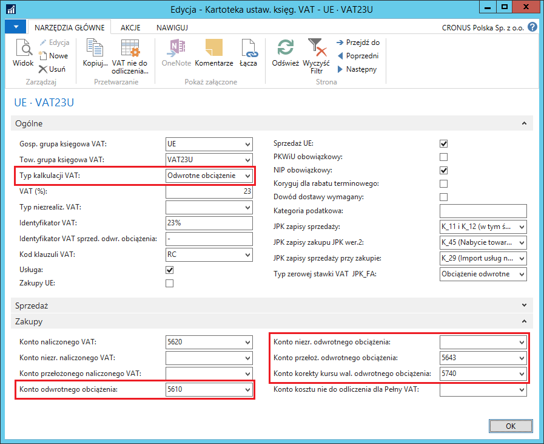{width="6.417390638670166in" height="5.229899387576553in"}
  ------------------------------------------------------------------------------------
  Rysunek 2.79: Kartoteka Ustawień księgowych VAT

W sytuacji, gdy kurs wymiany waluty do obliczenia podatku VAT jest inny
niż kurs wymiany waluty zastosowany do całości zaksięgowanej faktury
zakupu, musi zostać doksięgowana kwota różnicy w podatku VAT.
Księgowanie tej różnicy może być dokonywane ręcznie, po zaksięgowaniu
faktury zakupu (opcja zalecana) lub automatycznie (opcja niezalecana
z powodu wpływu na obniżenie wydajności systemu). W celu zdefiniowania
tego ustawienia, należy postępować według następujących kroków:

1.  Należy wybrać **Działy \> Zakup \> Administracja \> Ustawienia
    > zakupów i zobowiązań.**

2.  W oknie **Ustawienia zakupów i zobowiązań**, które się otworzy,
    > na karcie skróconej **Ogólne**, należy zaznaczyć pole
    > **Automatyczne księgow. różnicy kurs. odwrotnego obciążenia**,
    > jeśli kwota różnicy w kalkulacji podatku VAT wynikająca
    > z zastosowania różnych kursów wymiany ma być księgowana
    > automatycznie. Pozostawienie pola pustego oznacza, że różnica ta
    > musi być zaksięgowana ręcznie po zaksięgowania faktury zakupu
    > (sposób ręcznego księgowania opisany jest w dalszej części tego
    > rozdziału).

  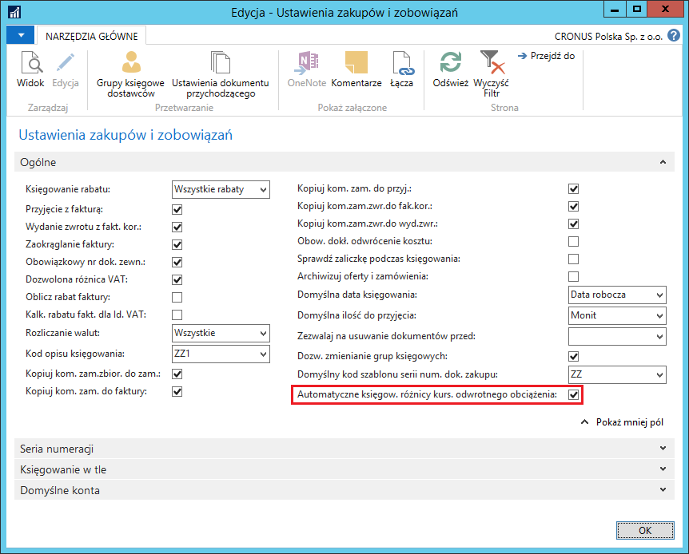{width="6.382608267716535in" height="5.138817804024497in"}
  ------------------------------------------------------------------------------------
  Rysunek 2.80: Ustawienia zakupów i zobowiązań

> {width="0.19in" height="0.19in"}
> **Uwaga:** Ze względu na możliwość zablokowania tabel podczas operacji
> księgowania, pole **Automatyczne księgow. różnicy kurs. odwrotnego
> obciążenia** nie powinno zawierać ustawienia **Tak**, jeśli w polu
> **Użyj poprzednich zasad blokowania tabeli Zapis K/G** w tabeli
> **Ustawienia księgi głównej** wybrano ustawienie **Nie**.

### Obsługa

Zaksięgowanie faktury zakupu za towary i usługi nabyte na terenie Unii
Europejskiej lub za usługi nabyte poza Unią Europejską spowoduje
obliczenie i zaksięgowanie podatku VAT, bez wpływu na wartość zakupów
oraz wysokość zobowiązań wobec dostawcy. W tym celu, należy postępować
według następujących kroków:

1.  Należy w standardowy sposób utworzyć nową fakturę zakupu, w której
    należy zwrócić uwagę na to, żeby wybrane były: **Gosp. grupa
    księgowa VAT** i **Tow. grupa księgowa VAT**, dla kombinacji
    których są zdefiniowane właściwe ustawienia (opisane powyżej).

  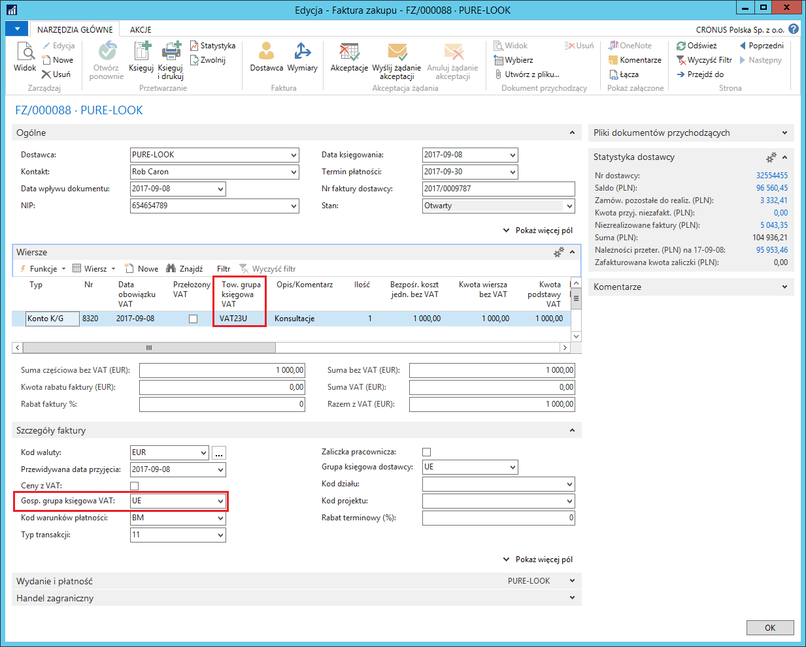{width="6.373912948381452in" height="5.122964785651794in"}
  ------------------------------------------------------------------------------------
  Rysunek 2.81: Faktura zakupu

> {width="0.19in" height="0.19in"}
> **Uwaga:** Kurs wymiany waluty do przeliczenia na walutę lokalną
> wartości zakupu i zobowiązań z faktury zakupu pobierany jest z tabeli
> kursów według daty w polu **Data księgowania**, a kurs wymiany waluty
> do przeliczenia na walutę lokalną kwoty podatku VAT pobierany jest
> z tabeli kursów według daty w polu **Data obowiązku VAT**.

2.  Należy sprawdzić podsumowanie wartości w fakturze zakupu, w tym
    celu, należy w oknie kartoteki faktury zakupu wybrać **Statystyka**.

3.  W oknie **Statystyka zakupów Faktura**, które się otworzy, należy
    zwrócić uwagę na pola na karcie skróconej **Odwrotne obciążenie**:

-   **Kod waluty odwrotnego obciążenia** -- kod waluty pobrany
    > z parametrów faktury zakupu.

-   **Data obowiązku VAT** -- data obowiązku VAT pobrana z parametrów
    > faktury zakupu; jednocześnie jest to data, według której ustalany
    > jest kurs wymiany waluty dla kwoty podatku VAT.

-   **Kwota odwrotnego obciążenia** -- kwota obliczonego podatku VAT
    > naliczonego i należnego wyrażona w walucie faktury.

-   **Kwota odwrotnego obciążenia (PLN)** -- równowartość w walucie
    > lokalnej kwoty obliczonego podatku VAT naliczonego i należnego.

  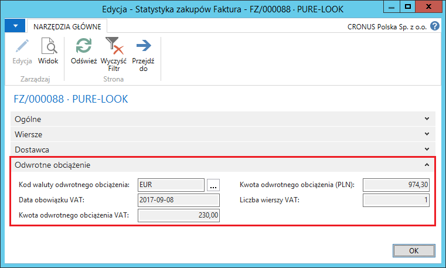{width="6.373912948381452in" height="3.8270713035870516in"}
  -------------------------------------------------------------------------------------
  Rysunek 2.82: Statystyka Faktury zakupu

4.  W przypadku wystąpienia na jednej fakturze zakupu wierszy z kilkoma
    > różnymi stawkami VAT, podsumowanie kalkulacji kwoty odwrotnego
    > obciążenia dla każdej stawki oddzielnie można zobaczyć na karcie
    > skróconej **Wiersze** w oknie **Statystyka faktury zakupu**, gdzie
    > zostały dodane 2 nowe pola:

-   **Kwota odwrotnego obciążenia** -- kwota obliczonego podatku VAT
    > naliczonego i należnego wyrażona w walucie faktury.

-   **Kwota odwrotnego obciążenia (PLN)** -- równowartość w walucie
    > lokalnej kwoty obliczonego podatku VAT naliczonego i należnego.

  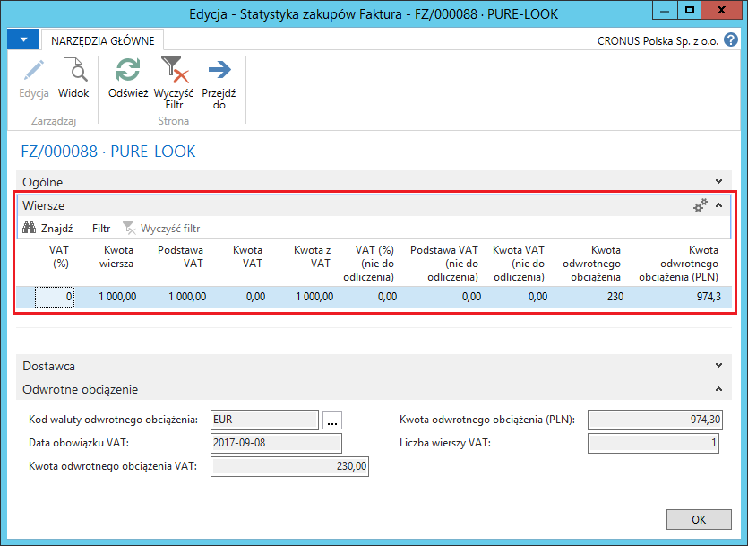{width="6.365217629046369in" height="4.642665135608049in"}
  ------------------------------------------------------------------------------------
  Rysunek 2.83: Statystyka Faktury zakupu -- wiersze

5.  W przypadku, gdy kurs wymiany waluty do kalkulacji kwoty odwrotnego
    obciążenia pobrany z tabeli kursów wymiany według **Daty obowiązku
    VAT** z jakiegoś powodu jest niewłaściwy, należy go zmienić. W tym
    celu, w oknie **Statystyka zakupów Faktura**, na karcie skróconej
    **Odwrotne obciążenie**, w polu **Kod waluty odwrotnego obciążenia**
    należy kliknąć przycisk asysty. Otworzy się okno **Zmiana kursu
    wymiany**, w którym, w polu **Relacyjny kurs wymiany** należy
    zmienić ręcznie wartość wstawioną domyślnie na właściwą.

  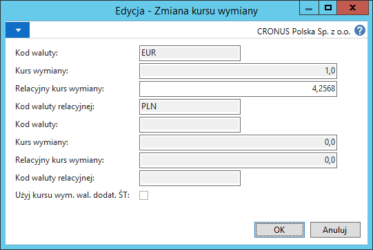{width="4.547244094488189in" height="3.059055118110236in"}
  ------------------------------------------------------------------------------------
  Rysunek 2.84: Zmienianie kursu wymiany dla kwoty odwrotnego obciążenia

6.  Należy w standardowy sposób zaksięgować fakturę zakupu.

Efekty księgowania w postaci **Zapisów K/G** i **Zapisów VAT** można
zobaczyć nawigując zaksięgowaną fakturę zakupu:

  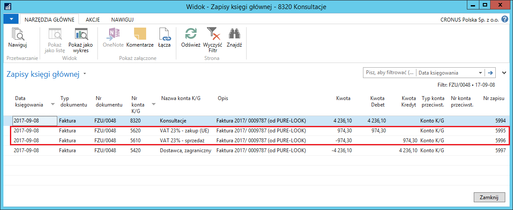{width="6.391303587051619in" height="2.6159273840769903in"}
  -------------------------------------------------------------------------------------
  Rysunek 2.85: Odwrotne obciążenie w zapisach K/G

  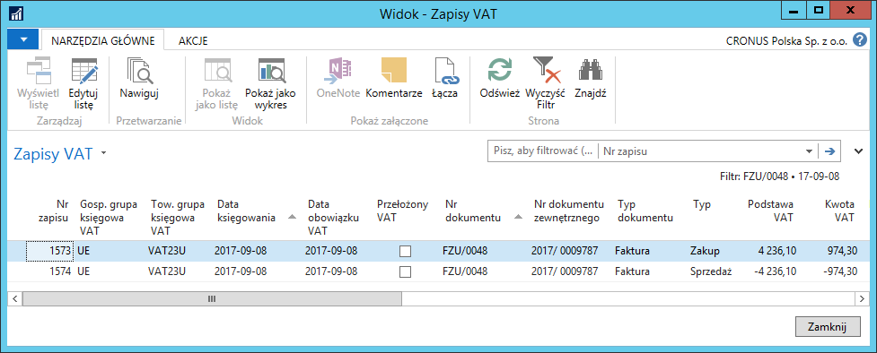{width="6.4in" height="2.58051290463692in"}
  ---------------------------------------------------------------------
  Rysunek 2.86: Odwrotne obciążenie w zapisach VAT

W sytuacji, gdy w zaksięgowanej fakturze zakupu zostały użyte różne
kursy wymiany: inny dla wartości zakupu i zobowiązań, a inny dla kwoty
odwrotnego obciążenia (niezależnie od tego, czy zostały one pobrane
z tabeli na podstawie **Daty księgowania** i **Daty obowiązku VAT**, czy
zostały ręcznie zmienione przed zaksięgowaniem), po zaksięgowaniu
faktury zakupu, jeżeli pole **Automatyczne księgow. różnicy kurs.
odwrotnego obciążenia w Ustawieniach zakupów i zobowiązań** nie jest
zaznaczone, konieczne jest dokonanie dodatkowego księgowania korekty
kwoty VAT. W tym celu, należy postępować według następujących kroków:

1.  Należy wybrać **Działy \> Zarządzanie Finansami \> Działania
    > okresowe \> VAT \> Arkusz rozliczania VAT**.

2.  W oknie **Arkusz rozliczania VAT**, które się otworzy, należy
    > ustawić odpowiednie filtry, aby na ekranie wyświetlić wybrane
    > zapisy VAT. W wierszach **Arkusza rozliczenia VAT**, w
    > których występuje różnica kwoty VAT, zaznaczone jest pole **Inny
    > kurs dla odwrotnego obciążenia**:

  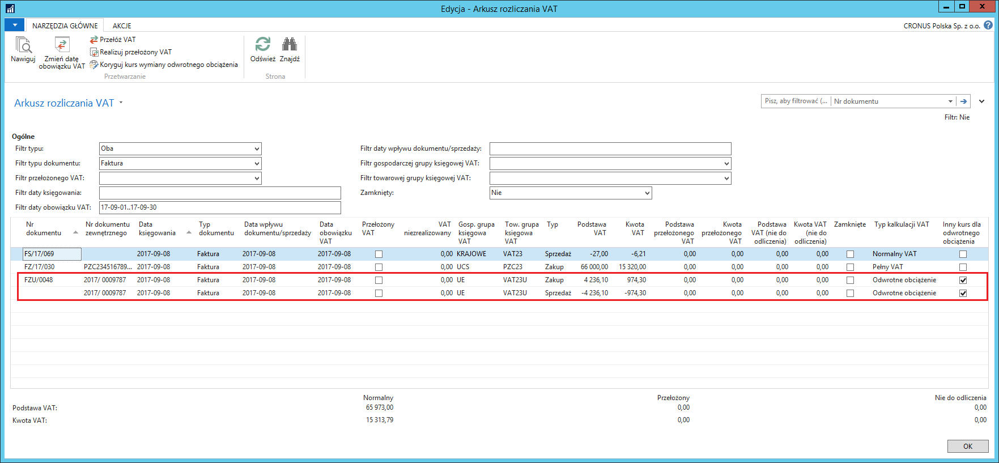{width="6.391303587051619in" height="2.9614402887139106in"}
  -------------------------------------------------------------------------------------
  Rysunek 2.87: Arkusz rozliczania VAT

3.  Należy zaznaczyć wiersz typu **Zakup** z kwotą odwrotnego obciążenia
    > do skorygowania.

4.  Należy wybrać **Koryguj kurs wymiany odwrotnego obciążenia**.

5.  Otworzy się okno z podsumowaniem informacji o odwrotnym obciążeniu
    > obliczonym w danym wierszu. Jeśli kursy wymiany waluty są różne
    > (inny dla wartości zakupu i zobowiązań, a inny dla kwoty
    > odwrotnego obciążenia), wartość w polu **Różnica kwot** jest różna
    > od 0:

  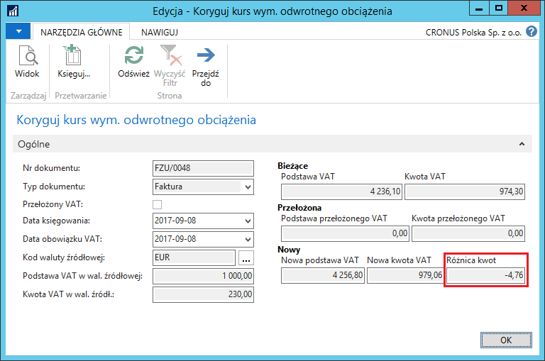{width="6.375913167104112in" height="4.22608595800525in"}
  -----------------------------------------------------------------------------------
  Rysunek 2.88: Księgowanie korekty kursu wymiany ODWROTNEGO OBCIĄŻENIA

6.  W tym samym oknie należy zwrócić uwagę na pola dat:

-   **Data księgowania** -- data, z jaką zostanie zaksięgowana korekta
    > kursu wymiany. Domyślnie wstawiana jest data robocza, w razie
    > potrzeby można ją zmienić ręcznie.

-   **Data obowiązku VAT** -- data, z jaką zostanie zakwalifikowana
    > korekta kwoty VAT do okresu rozliczenia podatku VAT. Domyślnie
    > wstawiana jest data z korygowanego zapisu VAT, w razie potrzeby
    > można ją zmienić ręcznie.

7.  Należy wybrać **Księguj**.

8.  Efektem zaksięgowania korekty kursu wymiany będą **Zapisy K/G**
    > i **Szczegółowe zapisy VAT**.

  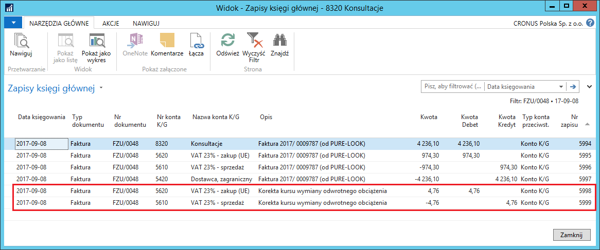{width="6.4086953193350835in" height="2.6764523184601923in"}
  --------------------------------------------------------------------------------------
  Rysunek 2.89: korekta kursu wymiany odwrotnego obciążenia w zapisach k/G

  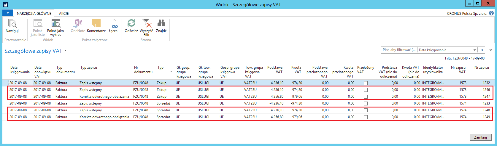{width="6.373912948381452in" height="1.8760826771653543in"}
  ----------------------------------------------------------------------------------------
  Rysunek 2.90: korekta kursu wymiany odwrotnego obciążenia w szczegółowych zapisach VAT

W sytuacji, gdy w zaksięgowanej fakturze zakupu kursy wymiany waluty
są identyczne dla wartości zakupu i zobowiązań oraz kwoty odwrotnego
obciążenia, może okazać się, że powinny być one różne. W celu zmiany
kursu wymiany waluty dla zaksięgowanej kwoty odwrotnego obciążenia,
należy postępować według następujących kroków:

1.  Należy wybrać **Działy \> Zarządzanie Finansami \> Działania
    > okresowe \> VAT \> Arkusz rozliczania VAT**.

2.  W oknie **Arkusz rozliczania VAT**, które się otworzy, należy
    > ustawić odpowiednie filtry, aby na ekranie wyświetlić wybrane
    > zapisy VAT, a następnie zaznaczyć wiersz z odwrotnym obciążeniem
    > do skorygowania.

3.  Należy wybrać **Koryguj kurs wymiany odwrotnego obciążenia**.

4.  Otworzy się okno z podsumowaniem informacji o odwrotnym obciążeniu
    > obliczonym w danym wierszu. W polu **Kod waluty odwrotnego
    > obciążenia** należy kliknąć przycisk asysty. Otworzy się okno
    > **Zmiana kursu wymiany**, w którym, w polu **Relacyjny kurs
    > wymiany** należy ręcznie wprowadzić nowy kurs wymiany:

  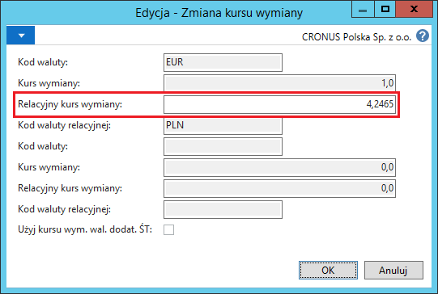{width="4.570866141732283in" height="3.074803149606299in"}
  ------------------------------------------------------------------------------------
  Rysunek 2.91: Zmiana kursu wymiany

5.  Zmieniony kurs wymiany należy zatwierdzić wybierając **OK**.

6.  W oknie **Koryguj kurs wym. Odwrotnego** obciążenia można zauważyć,
    > że w polu **Różnica kwot** jest kwota różna od zera. Skorygowaną
    > kwotę odwrotnego obciążenia należy zaksięgować wybierając
    > **Księguj**.

Zaksięgowana kwota odwrotnego obciążenia jest wykazywana, w wybranym
okresie VAT, w rejestrze VAT zakupu i w rejestrze VAT sprzedaży:

  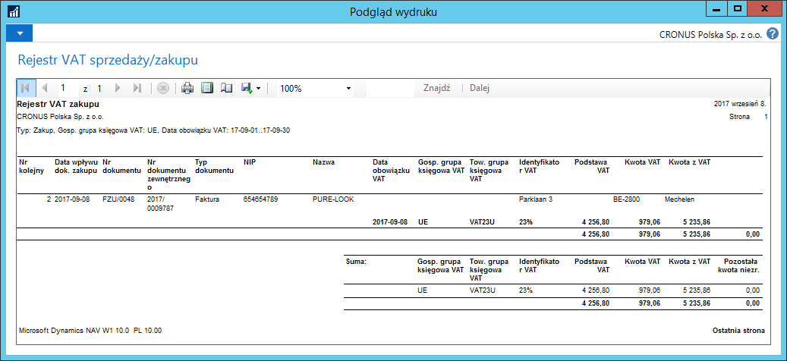{width="6.402777777777778in" height="2.93871062992126in"}
  -----------------------------------------------------------------------------------
  Rysunek 2.92: Rejestr VAT zakupu

  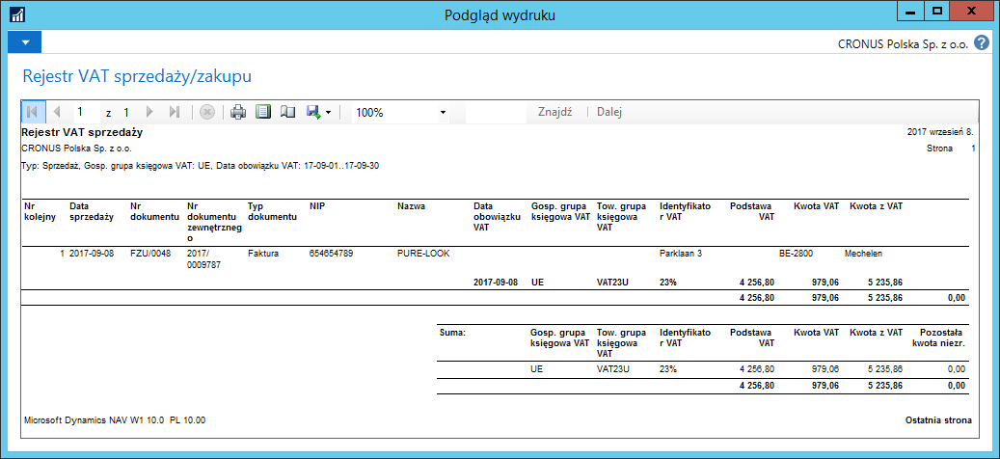{width="6.402777777777778in" height="2.93871062992126in"}
  -----------------------------------------------------------------------------------
  Rysunek 2.93: Rejestr VAT sprzedaży

> {width="0.19in" height="0.19in"}
> **Uwaga:** Obsługa odwrotnego obciążenia została dodana również
> do dokumentu **Zamówienie zakupu**.

#### Odwrotne obciążenie w transakcjach sprzedaży {#odwrotne-obciążenie-w-transakcjach-sprzedaży .Poziom-2}

### Informacje ogólne

W transakcjach sprzedaży z odwrotnym obciążeniem mają zastosowanie inne
stawki VAT niż w transakcjach zakupu. W Rejestrze VAT sprzedaży
wykazywane są pozycje związane z VAT należnym dotyczącym zakupu
z odwrotnym obciążeniem, jak i VAT należnym od sprzedaży z odwrotnym
obciążeniem, dlatego Polska Lokalizacja zawiera rozwiązanie
umożliwiające odróżnienie tych transakcji.

### Ustawienia

Aby zdefiniować identyfikator rozróżniający pochodzenie VAT należnego,
należy postępować według następujących kroków:

1.  Należy wybrać **Działy \> Zarządzanie Finansami \> Administracja \>
    Ustawienia Księgowe VAT**.

2.  W oknie **Ustawienia księgowe VAT**, które się otworzy, należy
    zaznaczyć wiersz z kombinacją kodów w polach **Gosp. grupa księgowa
    VAT** i **Tow. grupa księgowa VAT**, która odnosi się do transakcji
    wewnątrzwspólnotowych, a następnie należy wybrać **Edycja**.

3.  W oknie **Kartoteka ustaw. księg. VAT** należy zwrócić uwagę na 3
    pola:

-   **Typ kalkulacji VAT na **karcie skróconej **Ogólne** -- w tym polu
    > musi być wybrana opcja **Odwrotne obciążenie**.

-   **Identyfikator VAT** -- w tym polu należy wprowadzić identyfikator,
    > który będzie wyświetlany w Rejestrze VAT sprzedaży i w Rejestrze
    > VAT zakupu w pozycjach związanych z transakcją zakupu z odwrotnym
    > obciążeniem.

-   **Identyfikator VAT sprzed. odwr. obciążenia -- w **tym polu należy
    > wprowadzić identyfikator, który będzie wyświetlany w Rejestrze VAT
    > sprzedaży w pozycjach związanych z transakcją sprzedaży
    > z odwrotnym obciążeniem. Identyfikator ten może być też
    > prezentowany na wydrukach dokumentów sprzedaży w pozycji **Stawka
    > VAT**.

  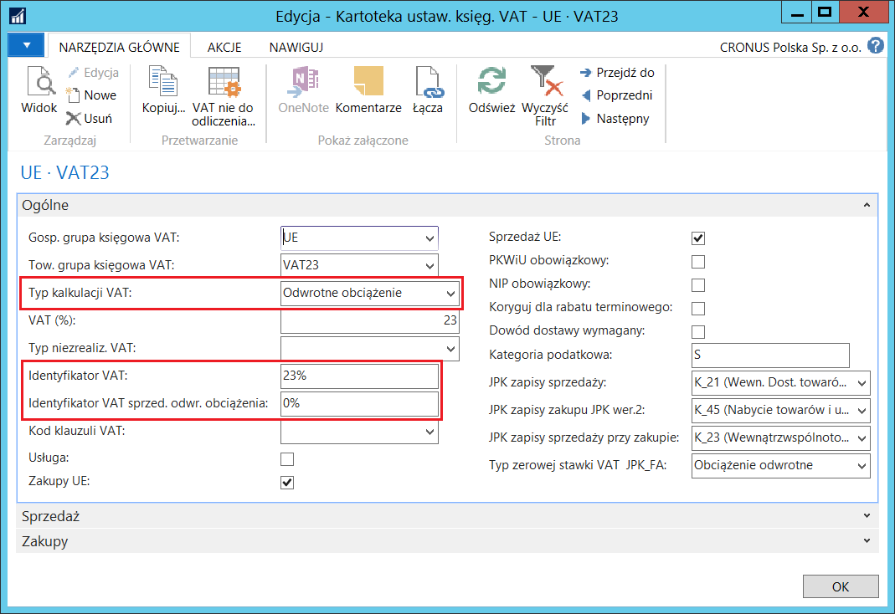{width="6.375in" height="4.376683070866142in"}
  ------------------------------------------------------------------------
  Rysunek 2.94: Kartoteka ustawień księgowych VAT

### Obsługa

Aby sprawdzić zastosowanie identyfikatora VAT sprzedaży odwrotnego
obciążenia, należy postępować według następujących kroków:

1.  Należy wybrać **Działy \> Zarządzanie Finansami \> Należności \>
    Faktury sprzedaży**.

2.  Należy wprowadzić nową fakturę sprzedaży dla nabywcy **Gospodarczą
    grupą księgową VAT** oraz w wierszu faktury wybrać **Towarową grupę
    księgową VAT**, dla których zdefiniowane zostały ustawienia księgowe
    VAT sprzedaży z odwrotnym obciążeniem. Pozostałe dane należy
    wprowadzić standardowo.

  {width="6.37126312335958in" height="5.395833333333333in"}
  -----------------------------------------------------------------------------------
  Rysunek 2.95: Faktura sprzedaży z odwrotnym obciążeniem

3.  Należy wybrać **Statystyka**.

> W oknie **Statystyka sprzedaży** można zauważyć, że w tej fakturze VAT
> nie został policzony. Stało się tak dlatego, że w **Ustawieniach
> księgowych VAT** dla kombinacji **Gospodarczej grupy księgowej VAT**
> i **Towarowej grupy księgowej VAT** użytych w fakturze sprzedaży,
> **Typ kalkulacji** = **Odwrotne obciążenie**.

  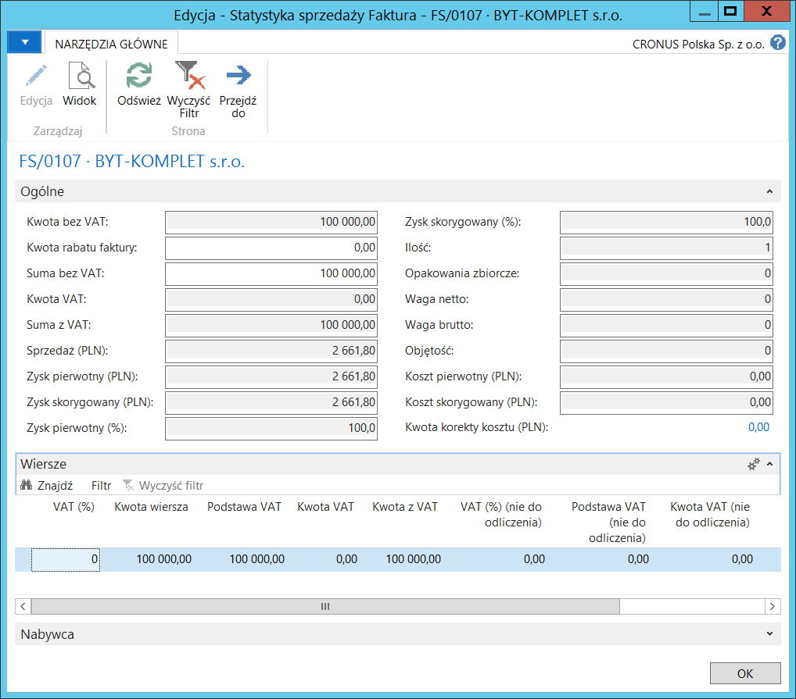{width="6.351482939632546in" height="5.583333333333333in"}
  ------------------------------------------------------------------------------------
  Rysunek 2.96: Statystyki sprzedaży Faktury z odwrotnym obciążeniem

4.  Należy wybrać **Księguj**, aby zaksięgować fakturę.

5.  W oknie z komunikatem o treści *„Fakturę zaksięgowano i przeniesiono
    do okna Zaksięgowana faktura sprzedaży. Czy chcesz otworzyć
    zaksięgowaną fakturę?"* należy wybrać **Tak**.

6.  W oknie **Zaksięgowana faktura sprzedaży**, które się otworzy,
    należy wybrać **Nawiguj**.

7.  W oknie **Nawigacja**, które się otworzy, należy zaznaczyć wiersz
    **Zapis VAT** i wybrać **Pokaż powiązane zapisy**.

8.  W oknie **Zapisy VAT**, które się otworzy można zauważyć, że w polu
    **Kwota VAT** jest 0.

  {width="6.409722222222222in" height="2.6330533683289588in"}
  -------------------------------------------------------------------------------------
  Rysunek 2.97: Zapisy VAT Faktury sprzedaży z odwrotnym obciążeniem

9.  Należy wybrać **Zamknij**, aby zamknąć okno **Zapisy VAT**.

10. Należy wybrać **OK**, aby zamknąć okno **Nawigacja**.

11. Należy wybrać **Zamknij**, aby zamknąć okno **Zaksięgowana faktura
    sprzedaży**.

12. Należy wybrać **Działy \> Zarządzanie Finansami \> Działania
    okresowe \> VAT \> Rejestr VAT sprzedaży/zakupu**.

13. W oknie z parametrami wstępnymi raportu należy wypełnić pola:

-   **Typ rejestru VAT** -- w tym polu należy wybrać opcję **Sprzedaż**.

-   **Data obowiązku VAT** -- w tym polu należy wprowadzić okres,
    > w którym do rozliczenia została zakwalifikowana zaksięgowana
    > wcześniej faktura sprzedaży.

  {width="5.102362204724409in" height="5.543307086614173in"}
  ------------------------------------------------------------------------------------
  Rysunek 2.98: Opcje wstępne raportu Rejestr VAT sprzedaży/zakupu

14. Należy wybrać **Podgląd**, aby wyświetlić raport na ekranie.

> W jednej z pozycji oraz w podsumowaniu raportu można zauważyć,
> że dla zaksięgowanej wcześniej faktury sprzedaży został zastosowany
> **Identyfikator VAT sprz. odwr. obciążenia** z **Ustawień księgowych
> VAT** dla grup księgowych VAT użytych w fakturze.

  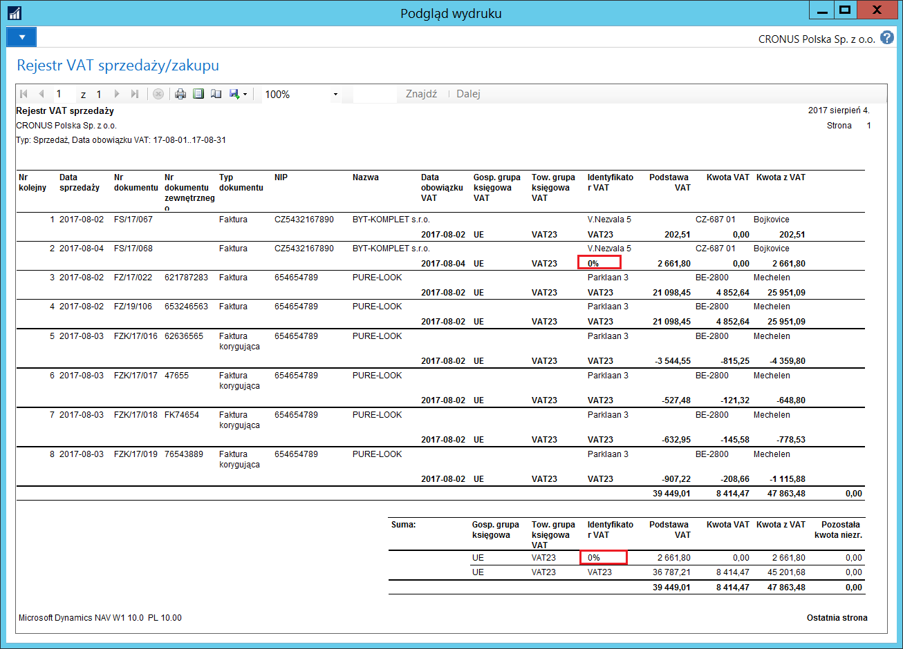{width="6.368055555555555in" height="4.58282261592301in"}
  -----------------------------------------------------------------------------------
  Rysunek 2.99: Wydruk raportu Rejestr VAT sprzedaży/zakupu

####  {#section-7 .list-paragraph .Poziom-2}

Dodatkowy kurs wymiany waluty do przeliczenia VAT {#dodatkowy-kurs-wymiany-waluty-do-przeliczenia-vat .Poziom-1}
-------------------------------------------------

### Informacje ogólne

**Podczas księgowania faktur zakupu z naliczonym VAT od dostawców
krajowych, wystawionych w obcej walucie, jak również w przypadku
wystawiania faktur sprzedaży w obcej walucie z VAT dla nabywców
krajowych, w niektórych sytuacjach konieczne jest zastosowanie innego
kursu wymiany waluty do przeliczenia podstawy i kwoty VAT, niż do
przeliczenia wartości kosztów/przychodów i zobowiązania/należności. W
Polskiej Lokalizacji systemu Microsoft Dynamics 365 Business Central
on-premises zostało dodane narzędzie umożliwiające podanie dwóch różnych
kursów wymiany waluty w dokumentach zakupu i dokumentach sprzedaży. W
wyniku działania tej funkcji, powstają dwa zapisy księgi
dostawcy/nabywcy, w podziale na kwotę VAT i pozostałą część
zobowiązania/należności.**

**Dodatkowy zapis księgi dostawcy/nabywcy z kwotą VAT może być
utworzony:**

-   **w walucie lokalnej**

-   **w walucie obcej**

> {width="0.19in" height="0.19in"}
> **Uwaga:** **Opis ustawień i obsługi dodatkowego kursu wymiany waluty
> do przeliczenia VAT zamieszczony w dalszej części rozdziału bazuje
> na przykładzie faktury zakupu. W dokumentach sprzedaży mechanizm
> jest identyczny, więc należy wzorować się na opisie dotyczącym
> zakupu.**

### Ustawienia

Sposób tworzenia zapisów księgi dostawcy dla zobowiązań w zakresie kwoty
VAT księgowanej z dokumentu zakupu określany jest indywidualnie dla
każdego dokumentu. Może być też ustawiony jako domyślny dla dostawcy, w
tym celu należy wykonać następujące kroki:

1.  Należy wybrać **Działy \> Zarządzanie Finansami \> Zobowiązania \>
    Dostawcy.**

2.  W oknie **Dostawcy**, które się otworzy, należy zaznaczyć wiersz z
    wybranym dostawcą i kliknąć na wstążce **Edytuj**.

3.  W kartotece dostawcy, która się otworzy, na karcie skróconej
    **Fakturowanie**, z listy rozwijanej w polu **Typ księgowania
    płatności VAT (wal. obca)** należy wybrać właściwą opcję spośród
    dostępnych:

-   **pusta** -- opcja domyślna -- zapis zobowiązania będzie jeden, nie
    będzie księgowany dodatkowy zapis księgi dostawców dla kwoty VAT;
    w tej sytuacji nie będzie możliwości podania innego kursu wymiany
    waluty do przeliczenia VAT,

-   **Waluta lokalna** -- dla dokumentów zakupu w walucie obcej
    dodatkowy zapis księgi dostawców dla kwoty VAT zostanie zaksięgowany
    w walucie lokalnej,

-   **Waluta obca** -- dla dokumentów zakupu w walucie obcej dodatkowy
    zapis księgi dostawców dla kwoty VAT zostanie zaksięgowany w walucie
    dokumentu.

> Wybrana opcja będzie domyślnie wstawiana w analogicznym polu
> w księgowanych dokumentach zakupu od tego dostawcy.

  -----------------------------------
  Rysunek 2.100: Kartoteka dostawcy
  -----------------------------------

Kwota podstawy VAT skalkulowana przez system na podstawie dodatkowego
kursu wymiany może wymagać ręcznej zmiany przez użytkownika. Aby było
to możliwe, należy zdefiniować właściwe ustawienia. W tym celu należy
wykonać następujące kroki:

1.  Należy wybrać **Działy \> Zarządzanie Finansami \> Administracja \>
    Ustawienia księgi głównej.**

2.  W oknie **Ustawienia księgi głównej**, które się otworzy, na karcie
    > skróconej **Ogólne**, w polu **Maks. dozwolona różnica podstawy
    > VAT** wprowadź dopuszczalną wartość, o jaką można ręcznie zmienić
    > skalkulowaną kwotę podstawy VAT w walucie lokalnej w księgowanym
    > dokumencie.

  ------------------------------------------
  Rysunek 2.101: Ustawienia księgi głównej
  ------------------------------------------

### Obsługa

Wprowadzając fakturę zakupu w obcej walucie od wybranego dostawcy,
system stosuje domyślne ustawienia, a w oknie **Statystyka** można
zweryfikować i, w razie potrzeby, zmienić skalkulowane przez system
wartości. W tym celu należy wykonać następujące kroki:

1.  Należy wybrać **Działy \> Zarządzanie Finansami \> Zobowiązania \>
    Faktury zakupu**.

2.  W oknie **Faktury zakupu, które się otworzy,** należy kliknąć na
    wstążce **Nowy**.

3.  Z listy rozwijanej w polu **Nr dostawcy** należy wybrać właściwego
    dostawcę. Pozostałe pola należy wypełnić w standardowy sposób.

> Pole **Typ księgowania płatności VAT (wal. obca)** przyjęło domyślną
> opcję z kartoteki wybranego dostawcy.

  -------------------------------
  Rysunek 2.102: Faktura zakupu
  -------------------------------

4.  Kurs wymiany waluty do przeliczenia VAT pobierany jest z okna
    > **Kursy wymiany walut** według **Daty obowiązku VAT** wprowadzonej
    > w fakturze zakupu. Zmiana **Daty obowiązku VAT** wywołuje
    > komunikat, w którym należy zaznaczyć wybraną opcję i kliknąć
    > **OK**. Dostępne opcje:

-   **Kurs wymiany odwrotnego obciążenia -- wybór tej opcji spowoduje
    uaktualnienie kursu wymiany waluty do przeliczenia odwrotnego
    obciążenia,**

-   **Kurs wymiany VAT -- wybór tej opcji spowoduje uaktualnienie kursu
    wymiany waluty do przeliczenia VAT,**

-   **Oba -- wybór tej opcji spowoduje uaktualnienie obydwu kursów
    wymiany waluty: do przeliczenia odwrotnego obciążenia i do
    przeliczenia kwoty VAT,**

-   **Żaden -- wybór tej opcji spowoduje, że żaden z kursów wymiany
    waluty nie zostanie uaktualniony: ani do przeliczenia odwrotnego
    obciążenia, ani do przeliczenia kwoty VAT.**

  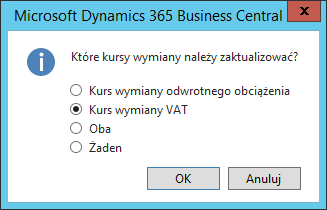{width="3.40625in" height="2.1875in"}
  ---------------------------------------------------------------
  Rysunek 2.103: Komunikat po zmianie Daty obowiązku VAT

5.  Na wstążce należy kliknąć przycisk **Statystyka** (można też
    nacisnąć klawisz **F7**).

6.  W oknie **Statystyka zakupów**, które się otworzy, na karcie
    skróconej **Kalkulacja kwoty VAT (wal. obca)** prezentowane są
    informacje dotyczące przeliczenia kwoty VAT dokumentu:

-   **Kod waluty VAT -- w tym polu prezentowana jest waluta, w jakiej
    księgowany jest dokument zakupu; można kliknąć przycisk asysty,
    aby w oknie Zmiana kursu wymiany sprawdzić i ewentualnie ręcznie
    zmienić kurs wymiany waluty zastosowany do przeliczenia kwoty VAT z
    dokumentu,**

-   **Data obowiązku VAT -- w tym polu prezentowana jest data obowiązku
    VAT przypisana do dokumentu,**

-   **Podstawa VAT (PLN) -- w tym polu prezentowana jest kwota podstawy
    VAT z dokumentu po przeliczeniu na PLN według podanego kursu wymiany
    waluty do przeliczenia VAT,**

-   **Kwota VAT (PLN) -- w tym polu prezentowana jest kwota VAT
    z dokumentu po przeliczeniu na PLN według podanego kursu wymiany
    waluty do przeliczenia VAT.**

> **Na karcie skróconej Wiersze prezentowane są informacje dotyczące
> przeliczenia kwoty VAT dokumentu według stawek VAT zastosowanych
> w dokumencie.**

  -----------------------------------
  Rysunek 2.104: Statystyka zakupów
  -----------------------------------

> Na karcie skróconej **Wiersze** w oknie **Statystyka zakupów** można
> ręcznie zmienić niektóre wartości wyliczone przez system, w granicach
> maksymalnych dozwolonych różnic:

-   dla waluty lokalnej -- zdefiniowanych w oknie **Ustawienia księgi
    głównej**;

-   dla waluty obcej -- zdefiniowanych w kartotece wybranej waluty.

  -------------------------------------------------------------
  Rysunek 2.105: Statystyka zakupów -- karta skrócona Wiersze
  -------------------------------------------------------------

7.  Po weryfikacji i ewentualnym poprawieniu skalkulowanych wartości
    > należy kliknąć **OK**, aby zamknąć okno **Statystyka zakupów**.

8.  W oknie **Faktura zakupu**, na wstążce, należy kliknąć **Księguj**
    > (można nacisnąć klawisz **F9**), aby zaksięgować fakturę zakupu.

W wyniku zaksięgowania dokumentu zakupu tworzone są m.in. zapisy księgi
dostawców i zapisy VAT. Sposób ich utworzenia zależy od opcji wybranej w
polu **Typ księgowania płatności VAT (wal. obca)** w księgowanym
dokumencie:

-   **Waluta lokalna**:

```{=html}
<!-- -->
```
-   **Zapisy księgi dostawców** -- tworzone są dwa zapisy:

1)  w kwocie netto w walucie zaksięgowanego dokumentu

2)  w kwocie VAT w walucie lokalnej, wynikającej z przeliczenia według
    **kursu wymiany waluty dla VAT**

-   **Zapisy VAT** -- tworzony jest jeden zapis dla każdej towarowej
    > grupy księgowej VAT zastosowanej w dokumencie, w którym wartość
    > podstawy VAT oraz kwoty VAT wynika z przeliczenia według kursu
    > wymiany waluty dla VAT.

  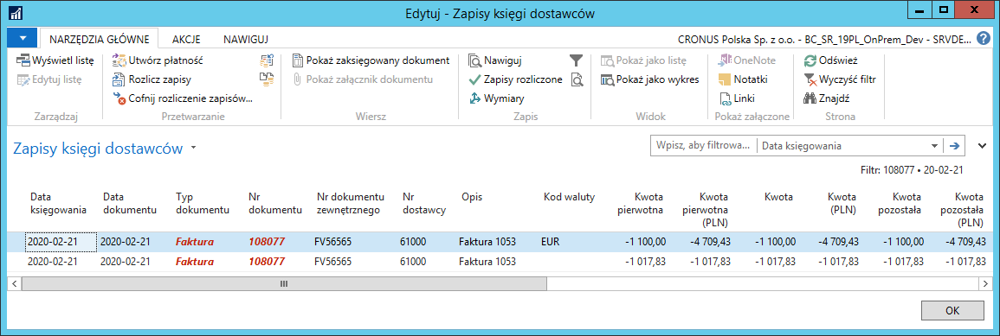{width="6.416666666666667in" height="2.160825678040245in"}
  ------------------------------------------------------------------------------------
  Rysunek 2.106: Zapisy księgi dostawców

  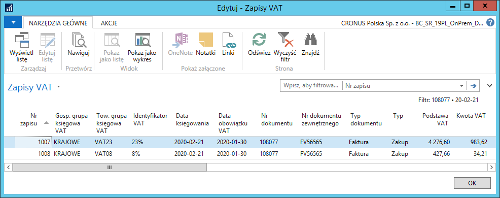{width="6.395833333333333in" height="2.529633639545057in"}
  ------------------------------------------------------------------------------------
  Rysunek 2.107: Zapisy VAT

-   **Waluta obca**:

```{=html}
<!-- -->
```
-   **Zapisy księgi dostawców** -- tworzone są dwa zapisy:

1)  w kwocie netto w walucie zaksięgowanego dokumentu

2)  w kwocie VAT w walucie zaksięgowanego dokumentu

-   **Zapisy VAT** -- tworzony jest jeden zapis dla każdej towarowej
    > grupy księgowej VAT zastosowanej w dokumencie, w którym wartość
    > podstawy VAT oraz kwoty VAT wynika z przeliczenia według kursu
    > wymiany waluty dla VAT.

  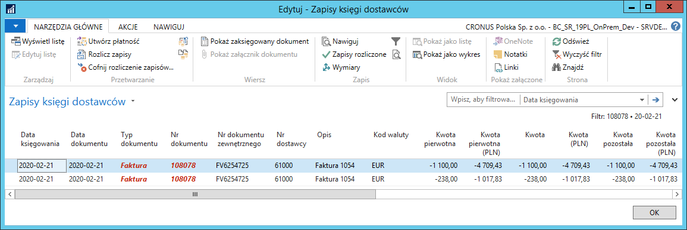{width="6.40625in" height="2.1573184601924758in"}
  ---------------------------------------------------------------------------
  Rysunek 2.108: Zapisy księgi dostawców

  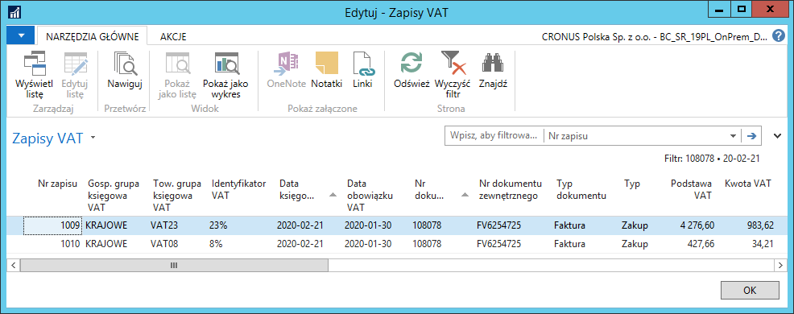{width="6.40625in" height="2.5337543744531934in"}
  ---------------------------------------------------------------------------
  Rysunek 2.109: Zapisy VAT

Deklaracja VAT-UE {#deklaracja-vat-ue .Poziom-1}
-----------------

### Informacje ogólne

**Deklaracja VAT-UE** to informacja podsumowująca o dokonanych
wewnątrzwspólnotowych transakcjach w danym okresie. Konieczność
składania tego sprawozdania wynika z przepisów Ustawy o VAT. Polska
Lokalizacja wyposażona została w narzędzie ułatwiające i automatyzujące
przygotowanie danych do deklaracji VAT-UE.

### Ustawienia

Żeby móc automatycznie tworzyć deklarację VAT-UE, muszą być zdefiniowane
odpowiednie ustawienia. W tym celu, należy postępować
według następujących kroków:

1.  Należy wybrać **Działy \> Zarządzanie Finansami \> Administracja \>
    Ustawienia raportowania stat.**

2.  W oknie **Ustawienia raportowania stat.**, które się otworzy, należy
    odpowiednio wypełnić pola na karcie skróconej **VAT-UE**:

-   **Numer urzędu skarbowego** -- należy wpisać numer (kod) urzędu
    > skarbowego, do którego należy dostarczyć deklaracje VAT-UE

-   **Nazwisko upoważnionego pracownika (dekl. VAT-UE)** -- należy
    > wpisać imię i nazwisko przedstawiciela firmy upoważnionego
    > do podpisywania deklaracji VAT-UE

-   **Wypełnił pracownik o nazwisku (dekl. VAT-UE)** -- należy wpisać
    > imię i nazwisko przedstawiciela firmy wypełniającego deklarację
    > VAT-UE

-   **Seria numeracji deklaracji VAT-UE** -- z listy rozwijanej w tym
    > polu należy wybrać kod serii numeracji, według której system
    > będzie nadawał numery kolejnym deklaracjom VAT-UE

  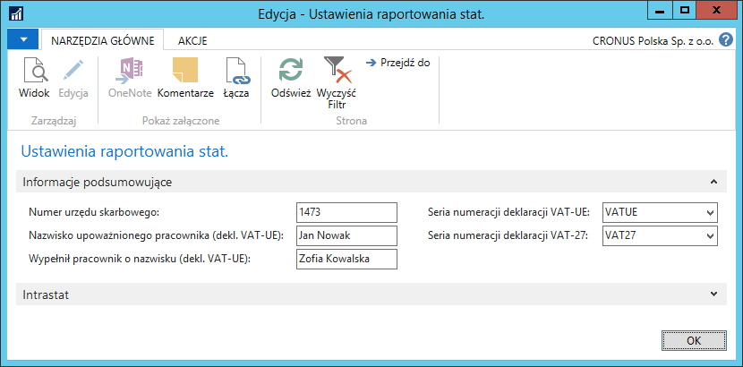{width="6.382608267716535in" height="3.152435476815398in"}
  ------------------------------------------------------------------------------------
  Rysunek 2.110: Ustawienia raportowania statystycznego

3.  Należy wybrać **Działy \> Zarządzanie Finansami \> Administracja \>
    > Ustawienia księgowe VAT**.

4.  W oknie **Ustawienia Księgowe VAT**, które się otworzy, należy
    > odnaleźć wiersze z takimi kombinacjami kodów w polach **Gosp.
    > grupa księgowa VAT i Tow. grupa księgowa VAT**,
    > które są zdefiniowane dla zakupów i sprzedaży wewnątrzunijnej.
    > W tych wierszach należy zaznaczyć odpowiednio pola **Zakupy UE
    > i Sprzedaż UE** (jedno lub obydwa, w zależności od przeznaczenia)
    > oraz **Usługa**, jeśli kombinacja grup księgowania VAT w danym
    > wierszu odnosi się do zakupu/sprzedaży wewnątrzunijnej usług.

  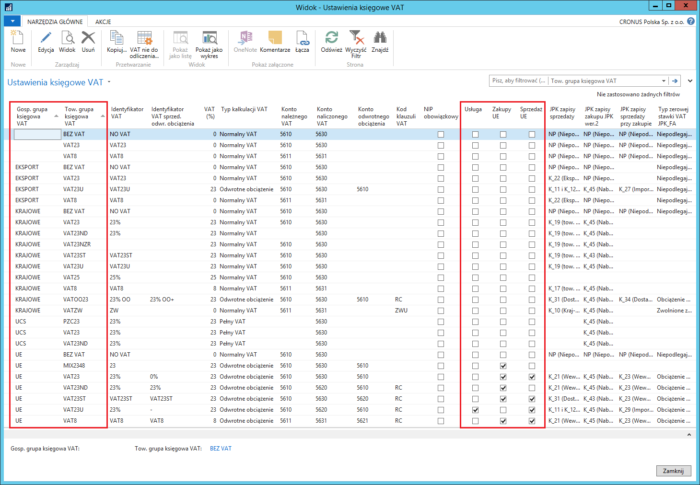{width="6.4in" height="4.436239063867017in"}
  ----------------------------------------------------------------------
  Rysunek 2.111: Ustawienia księgowe VAT

W **Deklaracji VAT-UE** można wykazywać wewnątrzwspólnotowe transakcje
trójstronne oraz rolę firmy w każdej takiej transakcji.
Wewnątrzwspólnotowa transakcja trójstronna zachodzi pomiędzy trzema
podatnikami VAT zidentyfikowanymi na potrzeby transakcji
wewnątrzwspólnotowych w trzech różnych państwach członkowskich.
Uczestniczą oni w dostawie towaru w ten sposób, że pierwszy z nich
wydaje towar bezpośrednio ostatniemu w kolejności, przy czym dostawa
tego towaru jest dokonana między pierwszym i drugim oraz drugim
i ostatnim w kolejności.

W celu oznaczenia poszczególnych transakcji zakupu/sprzedaży jako
trójstronne oraz określenia roli firmy w tych transakcjach, należy
postępować według następujących kroków:

1.  Należy wybrać Działy **\> Zakup \> Przetwarzanie zamówień \>
    > Zamówienia zakupu.**

2.  Należy otworzyć kartotekę nowego zamówienia zakupu i wypełnić ją
    > standardowo.

3.  W kartotece zamówienia zakupu, na karcie skróconej **Handel
    > zagraniczny**, należy odpowiednio zaznaczyć (lub nie) pola:
    > **Handel 3-stronny UE** i **Rola pośrednika w handlu 3-stronnym
    > UE**.

  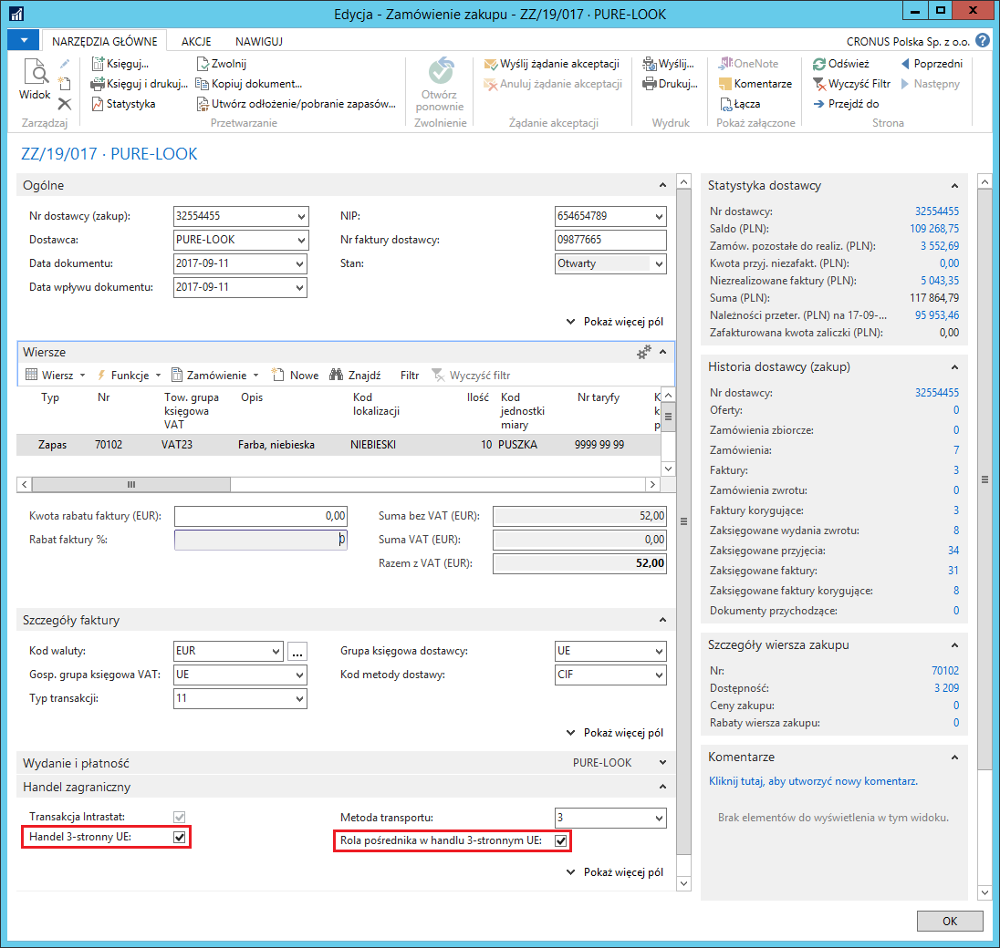{width="6.387045056867891in" height="6.060869422572178in"}
  ------------------------------------------------------------------------------------
  Rysunek 2.112: Handel 3-stronny UE w zamówieniu zakupu

4.  Zaksięgowanie dokumentu powoduje skopiowanie informacji z ww. pól\
    do odpowiednich **Zapisów VAT**, na podstawie których tworzona jest
    **Deklaracja VAT-UE**.

> {width="0.19in" height="0.19in"}
> **Uwaga:** Pola: **Handel 3-stronny UE** i **Rola pośrednika w handlu
> 3‑stronnym UE** są dostępne w następujących dokumentach zakupu:
> **Oferta**, **Zamówienie zbiorcze**, **Zamówienie**, **Faktura**,
> **Faktura korygująca**, **Zamówienie zwrotu**, **Zaksięgowana
> faktura**, **Zaksięgowana faktura korygująca**, **Zaksięgowane wydanie
> zwrotu**, **Archiwum ofert**, **Archiwum zamówień**, **Archiwum
> zamówień zwrotu** oraz w dokumentach sprzedaży: **Oferta**,
> **Zamówienie zbiorcze**, **Zamówienie**, **Faktura**, **Faktura
> korygująca**, **Zamówienie zwrotu**, **Zaksięgowana faktura**,
> **Zaksięgowana faktura korygująca**, **Zaksięgowane przyjęcie
> zwrotu**, **Archiwum ofert**, **Archiwum zamówień**, **Archiwum
> zamówień zwrotu**.

### Obsługa

W celu przygotowania deklaracji VAT-UE za wybrany okres, należy
postępować według następujących kroków:

1.  Należy wybrać **Działy \> Zarządzanie Finansami \> Działania
    okresowe \> VAT \> Deklaracje VAT-UE**.

2.  W oknie **Deklaracje VAT-UE** należy wybrać **Nowe**.

3.  W kartotece nowej deklaracji, na karcie skróconej **Ogólne**, należy
    wypełnić pola:

-   **Nr** -- w tym polu system wstawia numer kolejny deklaracji VAT-UE,
    > zgodny z serią numeracji wybraną w ustawieniach.

-   **Deklaracja za okres** -- z listy opcji dostępnych w tym polu
    > należy wybrać, za jaki okres przygotowywana jest deklaracja.
    > Możliwe opcje do wyboru, to **Kwartał** i **Miesiąc**.

-   **Typ deklaracji** -- od typu deklaracji wybranego w tym polu zależą
    > dalsze czynności podczas tworzenia deklaracji VAT-UE. Możliwe
    > opcje do wyboru, to: **Normalna**, **Korygująca**,
    > **Korygująco-uzupełniająca**.

-   **Nr skorygowanej deklaracji** -- dostępność tego pola do edycji
    > zależy od wybranego **Typu deklaracji**:

```{=html}
<!-- -->
```
-   dla typu **Normalna** -- pole jest nieedytowalne.

-   dla typu **Korygująca** -- pole jest edytowalne, z listy w nim
    > rozwijanej należy wybrać wcześniej utworzoną deklarację, która ma
    > zostać skorygowana.

-   dla typu **Korygująco-uzupełniająca** -- pole jest edytowalne,
    > z listy w nim rozwijanej należy wybrać wcześniej utworzoną
    > deklarację, która ma zostać skorygowana lub uzupełniona.

```{=html}
<!-- -->
```
-   **Nazwa** -- pole wypełniane automatycznie przez system -- wstawiana
    > jest nazwa firmy skopiowana z okna **Dane Firmy.**

-   **NIP** -- pole wypełniane automatycznie przez system -- wstawiany
    > jest NIP skopiowany z okna **Dane Firmy.**

-   **Numer urzędu skarbowego** -- pole wypełniane automatycznie
    > przez system -- wstawiany jest numer urzędu skarbowego skopiowany
    > z okna **Ustawienia raportowania statystycznego.**

-   **Typ transakcji handlowej** -- z listy opcji dostępnych w tym polu
    > należy wybrać typ transakcji, jakie mają być zestawione
    > w deklaracji. Możliwe opcje do wyboru, to: **Zakupy**,
    > **Sprzedaż**, **Oba**. System analizuje **Ustawienia księgowe
    > VAT**, dla których zaznaczone są pola **Zakup UE** i **Sprzedaż
    > UE**.

-   **Towary/usługi UE** -- z listy opcji dostępnych w tym polu należy
    > wybrać rodzaj transakcji, jakie mają być zestawione w deklaracji.
    > Możliwe opcje do wyboru, to: **Oba**, **Towary**, **Usługi**.
    > System analizuje **Ustawienia księgowe VAT**,
    > dla których zaznaczone są pola **Zakup UE** i **Sprzedaż UE**, dla
    > których zaznaczone jest (lub nie) pole **Usługa**.

-   **Data dokumentu** -- w tym polu system automatycznie wstawia datę
    > roboczą jako datę utworzenia deklaracji VAT. Datę ta można zmienić
    > ręcznie.

-   **Nr okresu** -- w zależności od wybranej opcji w polu **Deklaracja
    > za okres**, należy podać numer kolejny miesiąca lub kwartału
    > w roku, którego dotyczy tworzona deklaracja VAT-UE.

-   **Rok** -- w tym polu należy wpisać rok, z którego pochodzi okres
    > (miesiąc lub kwartał), którego dotyczy tworzona deklaracja VAT-UE.

-   **Data początkowa** -- pole nieedytowalne, system wstawia w nim datę
    > początkową okresu, jakim objęta jest deklaracja, na podstawie
    > wcześniej wprowadzonych parametrów w polach **Deklaracja
    > za okres**, **Nr okresu**, **Rok**.

-   **Data końcowa** -- pole nieedytowalne, system wstawia w nim datę
    > końcową okresu, jakim objęta jest deklaracja, na podstawie
    > wcześniej wprowadzonych parametrów w polach **Deklaracja
    > za okres**, **Nr okresu**, **Rok**.

-   **Kwota (PLN)** -- pole nieedytowalne, system wstawia sumę kwot
    > z wierszy deklaracji VAT-UE.

-   **Liczba dostaw** -- pole nieedytowalne, system wstawia sumę ilości
    > dostaw z wierszy deklaracji VAT-UE.

-   **Stan** -- pole nieedytowalne, którego bieżąca opcja wskazuje
    > na stan edycji deklaracji. Zmiana stanu następuje poprzez wybranie
    > akcji **Zwolnij** lub **Otwórz ponownie**.

4.  Do pól w karcie skróconej **Osoby** system kopiuje dane z wcześniej
    zdefiniowanych ustawień. W razie potrzeby, zawartość tych pól może
    zostać ręcznie zmieniona.

  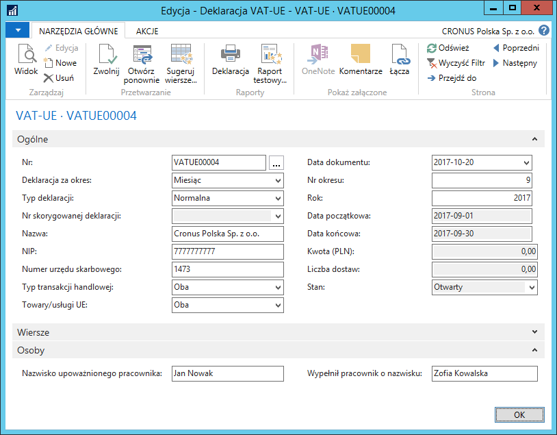{width="6.391303587051619in" height="4.986035651793526in"}
  ------------------------------------------------------------------------------------
  Rysunek 2.113: Nagłówek deklaracji VAT-UE

5.  Po prawidłowym wypełnieniu pól nagłówka deklaracji, należy wypełnić
    wiersze. W tym celu, w kartotece deklaracji należy wybrać **Sugeruj
    wiersze**.

6.  W oknie **Sugeruj wiersze deklaracji VAT-UE**, które się otworzy,
    należy zaznaczyć pole **Usuń istniejące wiersze**, aby skrypt
    nadpisał istniejące wiersze deklaracji.

  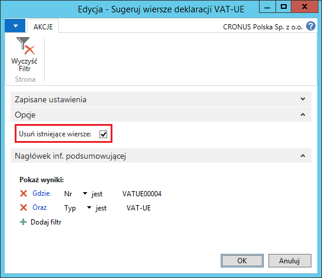{width="4.610236220472441in" height="3.9881889763779528in"}
  -------------------------------------------------------------------------------------
  Rysunek 2.114: sugerowanie wierszy deklaracji VAT-UE

7.  Następnie należy wybrać **OK** w celu wykonania skryptu.

> W wyniku użycia skryptu **Sugeruj wiersze deklaracji VAT-UE** system
> wypełnia automatycznie wiersze deklaracji według poniższej logiki:

1)  Skrypt przetwarza **Zapisy VAT** mające datę obowiązku VAT (jeżeli
    > pole **Użyj daty obowiązku VAT** jest zaznaczone, w przeciwnym
    > wypadku system analizuje datę księgowania) przypadającą w okresie
    > wyznaczonym datami w polach **Data początkowa** i **Data końcowa**
    > w nagłówku deklaracji VAT-UE.

2)  Dodatkowe filtrowanie **Zapisów VAT** zależy od wybranego w nagłówku
    > deklaracji **Typu transakcji handlowej**. System wybiera właściwe
    > **Zapisy VAT** pod względem grup księgowych VAT,
    > których kombinacje zostały oznaczone jako **Zakupy UE**
    > lub **Sprzedaż UE**. Następnym etapem filtrowania jest wybranie
    > przez system **Zapisów VAT** zgodnych z opcją wybraną w polu
    > **Towary/usługi UE**. W tym celu analizowane jest zaznaczenie pola
    > **Usługa** w oknie **Ustawienia księgowe VAT dla **kombinacji grup
    > księgowych VAT w **Zapisach VAT**.

3)  System wstawia wiersze deklaracji VAT-UE pogrupowane kolejno według:
    > **NIP**, **Handel 3-stronny UE**, **Rola pośrednika w handlu
    > 3-stronnym UE**.

4)  Podczas wstawiania wierszy, system automatycznie uzupełnia m.in.
    > pola:

-   **Kod kraju/regionu** -- w tym polu wstawiany jest kod kraju
    > z kartoteki nabywcy lub dostawcy, którego NIP jest wprowadzony
    > w danym wierszu.

-   **Kwota (PLN)** -- suma wartości typu transakcji
    > zakupu/sprzedaży/obu dla danego wiersza, skalkulowana z pola
    > **Podstawa VAT** w **Zapisach VAT**.

-   **Liczba dostaw** -- zawiera liczbę zapisów VAT z unikalnym
    > **Numerem transakcji**.

  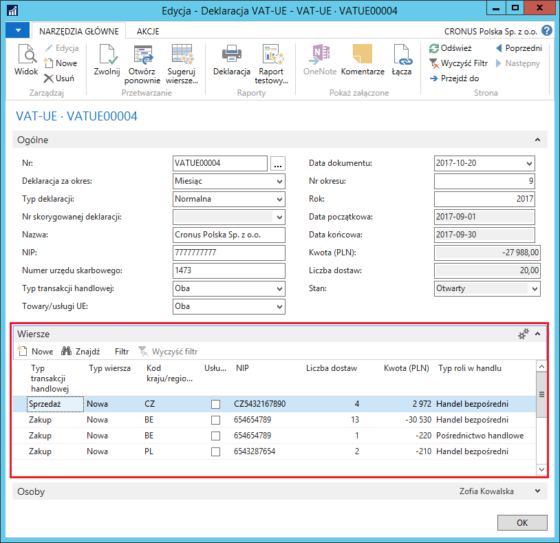{width="6.396119860017498in" height="6.2in"}
  ----------------------------------------------------------------------
  Rysunek 2.115: wiersze deklaracji VAT-UE

8.  Przygotowana deklaracja VAT-UE może być testowo wydrukowana jeszcze
    przed zatwierdzeniem. W tym celu należy wybrać **Raport testowy**,
    a następnie **Podgląd** lub **Drukuj**:

  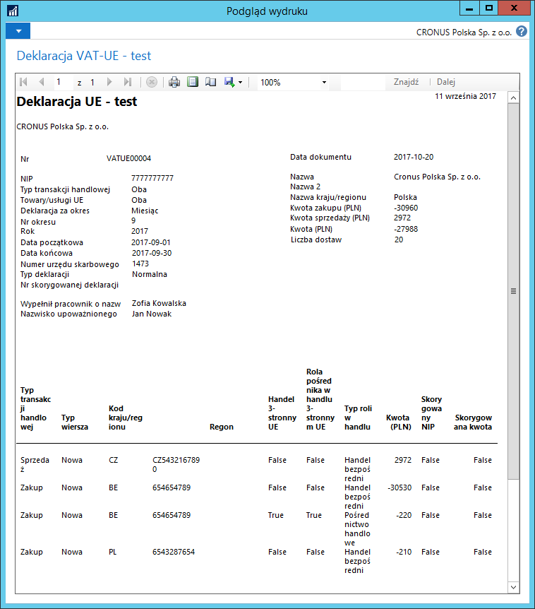{width="6.392626859142607in" height="7.269564741907262in"}
  ------------------------------------------------------------------------------------
  Rysunek 2.116: Raport testowy deklaracji VAT-UE

> {width="0.19in" height="0.19in"}
> **Uwaga:** Raport testowy sprawdza wprowadzone dane pod kątem
> wymagalności i wyświetla błędy/ostrzeżenia, które mogłyby uniemożliwić
> zatwierdzenie **Deklaracji VAT-UE.**

9.  W kartotece deklaracji VAT-UE należy poprawić/uzupełnić dane tak,
    aby na raporcie testowym nie pojawiały się ostrzeżenia.

10. Deklarację VAT-UE należy zatwierdzić, zmieniając jej stan
    na **Zwolniony**. W tym celu należy wybrać **Zwolnij.**

  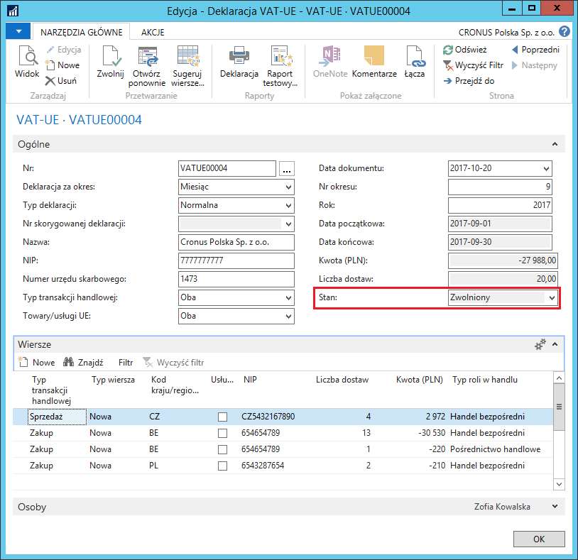{width="6.4050907699037625in" height="6.208695319335083in"}
  -------------------------------------------------------------------------------------
  Rysunek 2.117: Zatwierdzona deklaracja VAT-UE

11. Zatwierdzoną deklarację (ze stanem **Zwolniona**) można wydrukować,
    wybierając **Deklaracja**, a następnie **Drukuj lub Podgląd
    wydruku**:

  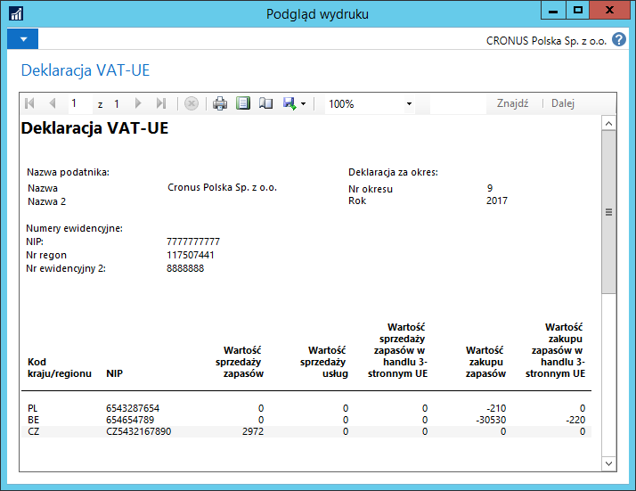{width="6.377887139107612in" height="4.921738845144357in"}
  ------------------------------------------------------------------------------------
  Rysunek 2.118: Wydruk deklaracji VAT-UE

Aby poprawić błąd, który wystąpił w jednej z wcześniej złożonych
deklaracji VAT‑UE, należy utworzyć deklarację korygującą. Przepisy
polskiego prawa wymagają, aby na deklaracji korygującej wykazane były
wiersze przed i po korekcie. Jeśli na pierwotnej deklaracji jakiś wiersz
nie był wykazany, w deklaracji korygującej powinien mieć wykazaną
wartość zero przed korektą. Jeśli na pierwotnej deklaracji został
wykazany wiersz, którego nie powinno być, w deklaracji korygującej
powinien mieć wykazana wartość zero po korekcie. Zwykle, wiersz przed
korektą powinien mieć wartość identyczną, jak w wierszu deklaracji
pierwotnej, a wiersz po korekcie powinien mieć nową, prawidłowo
skalkulowaną wartość dla danego okresu.

W celu przygotowanie korygującej deklaracji VAT-UE, należy postępować
według następujących kroków:

1.  Należy utworzyć nowy nagłówek deklaracji VAT-UE w ten sam sposób,
    > jak dla zwykłej deklaracji.

2.  W polu **Typ deklaracji** należy wybrać **Korygująca**
    > lub **Korygująco-uzupełniająca**.

3.  Z listy rozwijanej w polu **Nr skorygowanej deklaracji** należy
    > wybrać zatwierdzona deklaracje, podlegającą korygowaniu.

4.  Pozostałe pola w nagłówku deklaracji korygującej zostaną uzupełnione
    > automatycznie przez system.

5.  Należy wybrać **Sugeruj wiersze**, a następnie **OK**.

6.  System automatycznie wstawi wiersze korygujące -- po 2 dla każdego
    > korygowanego wiersza. Wiersz z typem **Anulowanie** (przed
    > korektą) jest utworzony na podstawie wiersza w pierwotnej
    > deklaracji, a wiersz z typem **Korekta** (po korekcie) jest
    > utworzony na podstawie nowej kalkulacji:

  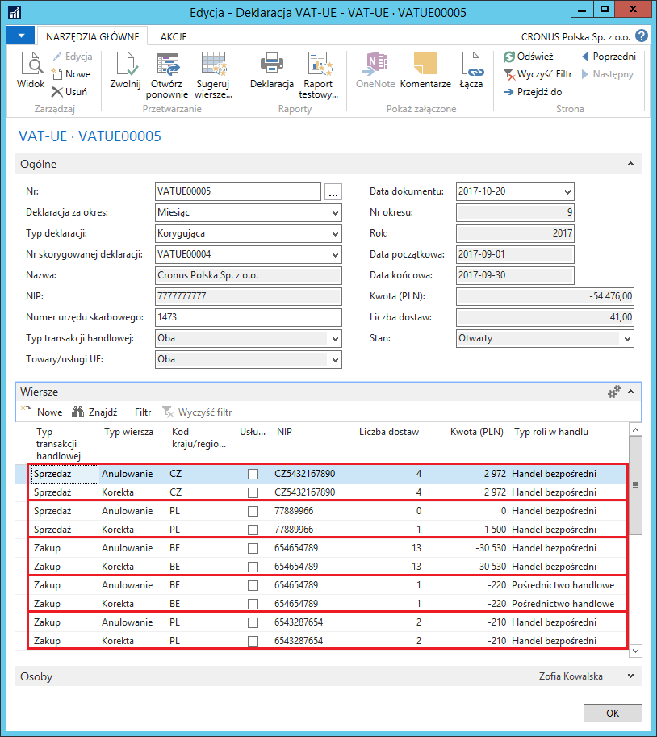{width="6.373912948381452in" height="7.148860454943132in"}
  ------------------------------------------------------------------------------------
  Rysunek 2.119: Korygująca deklaracjA VAT-UE

7.  Należy sprawdzić w **Raporcie testowym**, czy wszystkie wymagane
    > dane są poprawnie uzupełnione.

8.  W celu zatwierdzenia korygującej deklaracji VAT-UE, należy zmienić
    > jej stan na **Zwolniony**, wybierając **Zwolnij**.

9.  Zatwierdzoną korygującą deklarację VAT-UE można wydrukować
    > wybierając **Deklaracja**.

Nr taryfy usługowej {#nr-taryfy-usługowej .Poziom-1}
-------------------

### Informacje ogólne

Dla niektórych transakcji sprzedaży usług poza granice Polski,
w rejestrze VAT należy podać krótki opis świadczonej usługi dla celów
badania poprawności kalkulacji VAT. Celem funkcjonalności numeru taryfy
usługowej jest udostępnienie użytkownikom listy takich opisów
i możliwości ich przypisania do wybranych transakcji.

### Ustawienia

Numery taryf usługowych mogą być przypisywane w wierszach dokumentów
sprzedaży wyłącznie dla wybranych ustawień VAT, w tym celu należy
postępować według następujących kroków:

1.  Należy wybrać **Działy \> Zarządzanie Finansami \> Administracja \>
    > Ustawienia księgowe VAT**.

2.  W oknie **Ustawienia księgowe VAT**, które się otworzy, należy
    > zaznaczyć wiersz z wybraną kombinacją kodów w polach **Gosp. grupa
    > księgowa VAT** i **Tow. grupa księgowa VAT**, a następnie wybrać
    > **Edycja**.

3.  W oknie **Kartoteka ustaw. księg. VAT**, które się otworzy,
    > na karcie skróconej **Ogólne** należy zaznaczyć pole **Usługa**,
    > pole **Obowiązkowy numer taryfy usługowej** zostanie automatycznie
    > zaznaczone.

  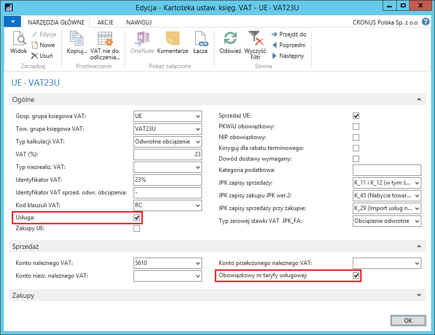{width="6.396484033245844in" height="4.921738845144357in"}
  ------------------------------------------------------------------------------------
  Rysunek 2.120: Ustawienia księgowe VAT

### Obsługa

Przypisanie numeru taryfy usługowej możliwe jest w dokumentach
sprzedaży. W tym celu należy postępować według następujących kroków:

1.  Należy wybrać **Działy \> Zarządzanie Finansami \> Należności \>
    > Faktury sprzedaży**.

2.  Należy w sposób standardowy wprowadzić dane do faktury sprzedaży.
    > Konieczne jest użycie właściwej kombinacji grup księgowych VAT,
    > dzięki czemu możliwe jest wybranie jednej z taryf z listy
    > rozwijanej w polu **Nr taryfy usługowej** w wierszach faktury
    > sprzedaży:

  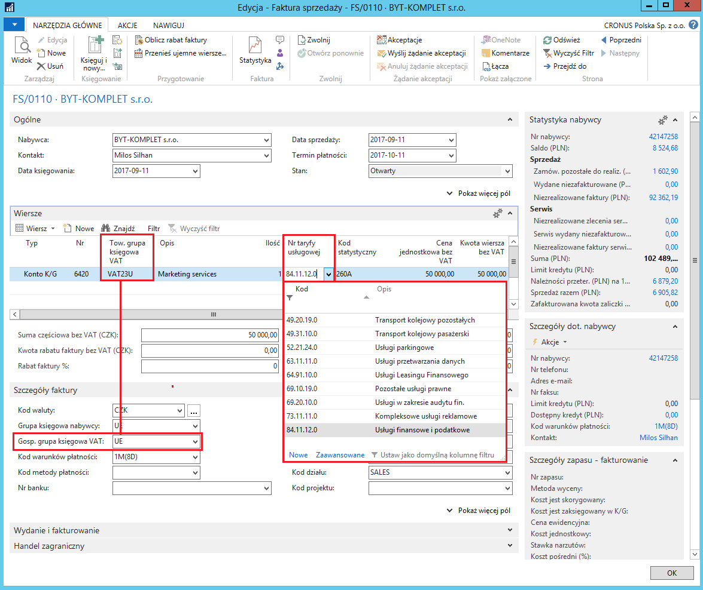{width="6.369843613298338in" height="5.356521216097987in"}
  ------------------------------------------------------------------------------------
  Rysunek 2.121: Faktura sprzedaży usług

3.  W przypadku, gdy na liście rozwijanej w polu **Nr taryfy usługowej**
    nie ma pożądanej taryfy, można ją wprowadzić wybierając **Nowe**.
    Otworzy się wtedy okno **Numery taryf usługowych**, w którym,
    w nowym wierszu, należy wprowadzić unikalny kod oraz pełny opis
    nowej taryfy usługowej:

  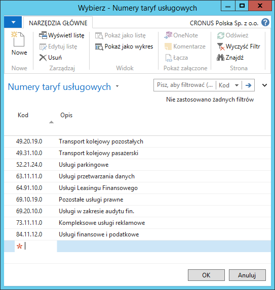{width="4.559055118110236in" height="4.818897637795276in"}
  ------------------------------------------------------------------------------------
  Rysunek 2.122: Numery taryf usługowych

4.  Pozostałe dane do faktury sprzedaży należy wprowadzić standardowo.

5.  Należy zaksięgować fakturę sprzedaży.

6.  **Nr taryfy usługowej** zostanie skopiowany do zaksięgowanej faktury
    > sprzedaży:

  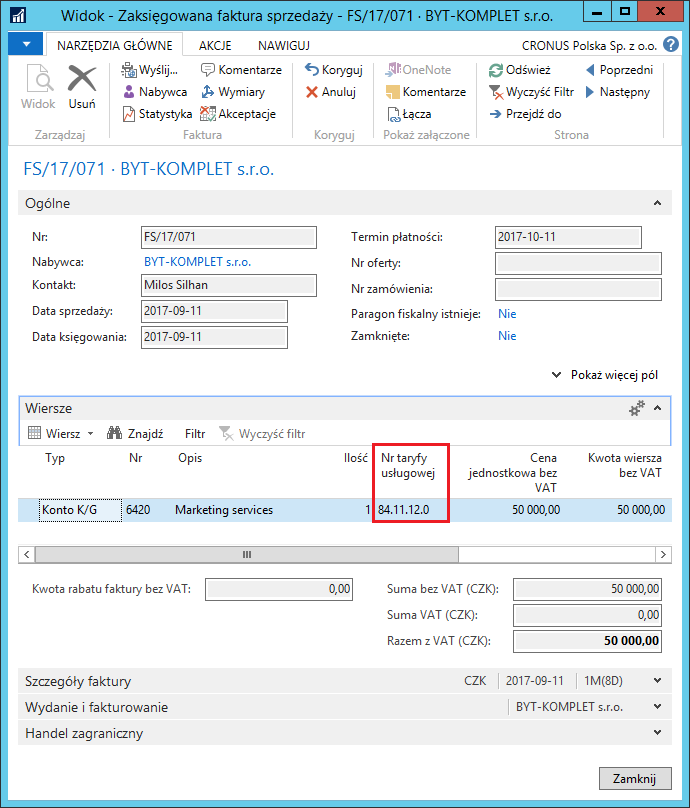{width="6.2952755905511815in" height="7.3700787401574805in"}
  --------------------------------------------------------------------------------------
  Rysunek 2.123: Zaksięgowana faktura sprzedaży usług

> {width="0.19in" height="0.19in"}
> **Uwaga:** Pole **Nr taryfy usługowej** jest dostępne w następujących
> dokumentach: **Zamówienie sprzedaży**, **Faktura sprzedaży**,
> **Zamówienie zwrotu sprzedaży**, **Faktura korygująca sprzedaży**.

W raporcie **Rejestr VAT sprzedaży/zakupu** możliwe jest wydrukowanie
nazwy usługi zgodnej z numerem taryfy usługowej przypisanym do wiersza
zaksięgowanego dokumentu sprzedaży. W tym celu należy postępować
według następujących kroków:

1.  Należy wybrać **Działy \> Zarządzanie Finansami \> Raporty
    > i analizy \> Rejestr VAT sprzedaży/zakupu**.

2.  W oknie wstępnym raportu należy zaznaczyć pole **Pokaż opis taryfy
    > usługowej**:

  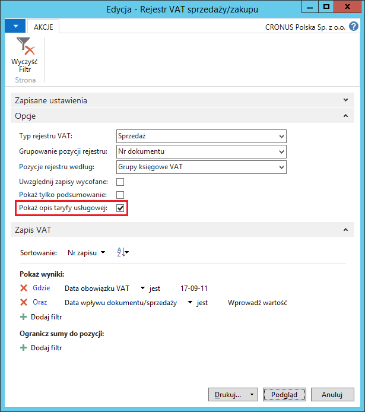{width="5.177165354330708in" height="5.84251968503937in"}
  -----------------------------------------------------------------------------------
  Rysunek 2.124: Okno wstępne raportu Rejestr VAT sprzedaży/zakupu

3.  W pozycjach rejestru VAT sprzedaży pochodzących z transakcji
    z przypisanym numerem taryfy usługowej, wydrukowany jest dodatkowy
    wiersz z nazwą usługi przypisaną do wybranego numeru taryfy:

  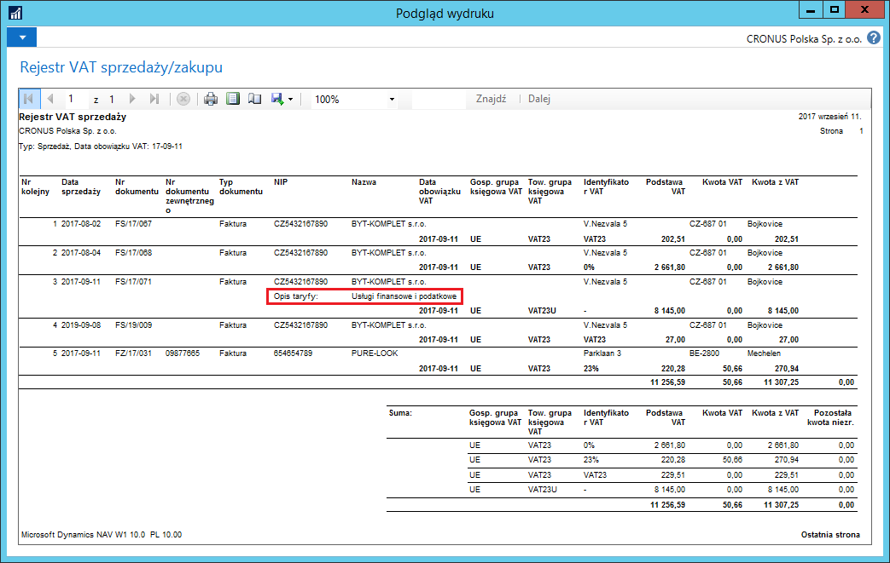{width="6.381944444444445in" height="4.044625984251969in"}
  ------------------------------------------------------------------------------------
  Rysunek 2.125: Rejestr VAT sprzedaży/zakupu

 {#section-8 .list-paragraph .Poziom-1}

Deklaracja VAT-27 {#deklaracja-vat-27 .Poziom-1}
-----------------

### Informacje ogólne

**Deklaracja VAT-27** to informacja podsumowująca o dokonanych w danym
okresie transakcjach, dla których podatnikiem jest nabywca. Obowiązek
składania deklaracji VAT-27 wynika ze zmian, jakie do ustawy o podatku
VAT wprowadza ustawa z 9 kwietnia 2015 r. o zmiana ustawy o podatku
od towarów i usług oraz ustawy -- Prawo zamówień publicznych. Deklaracja
VAT-27 dotyczy transakcji (dostawy towarów lub świadczenia usług), dla
których podatnikiem jest nabywca. Wypełnią ją zatem m.in., podatnicy,
którzy stosując odwrotne obciążenie sprzedawać będą towary wrażliwe,
jak laptopy, smartfony, tablety, telefony, metale, makulaturę., a także
usługi w zakresie przenoszenia uprawnień do emisji gazów cieplarnianych.

Polska Lokalizacja wyposażona została w narzędzie ułatwiające
i automatyzujące przygotowanie danych do deklaracji VAT-27.

### Ustawienia

Żeby móc automatycznie tworzyć deklarację VAT-27, muszą być zdefiniowane
odpowiednie ustawienia.

1.  Należy wybrać **Działy \> Zarządzanie Finansami \> Administracja \>
    Ustawienia raportowania stat.**

2.  W oknie **Ustawienia raportowania stat.**, które się otworzy, należy
    odpowiednio wypełnić pola na karcie skróconej **Informacje
    podsumowujące**:

-   **Seria numeracji deklaracji VAT-27** -- z listy rozwijanej w tym
    > polu należy wybrać kod serii numeracji, według której system
    > będzie nadawał numery kolejnym deklaracjom VAT-27

> Jeżeli nie korzystamy z funkcjonalności deklaracji VAT-UE, należy
> dodatkowo uzupełnić poniższe dane:

-   **Numer urzędu skarbowego** -- należy wpisać numer (kod) urzędu
    > skarbowego, do którego należy dostarczyć deklarację VAT-27

-   **Nazwisko upoważnionego pracownika (dekl. VAT-UE)** -- należy
    > wpisać imię i nazwisko przedstawiciela firmy upoważnionego
    > do podpisywania deklaracji VAT‑27

-   **Wypełnił pracownik o nazwisku (dekl. VAT-UE)** -- należy wpisać
    > imię i nazwisko przedstawiciela firmy wypełniającego deklarację
    > VAT-27

  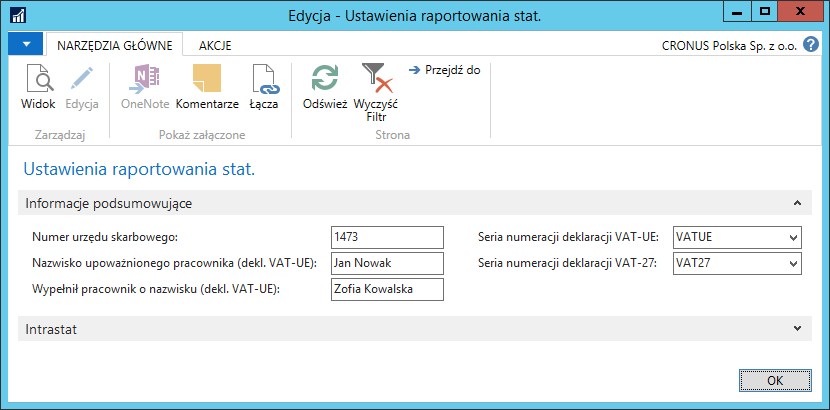{width="6.4in" height="3.161025809273841in"}
  ----------------------------------------------------------------------
  Rysunek 2.126: Ustawienia raportowania statystycznego

Deklaracja VAT-27 będzie pobierała informacje dotyczące transakcji
sprzedaży, dla których zastosowane zostały ustawienia VAT z **Typem
kalkulacji VAT** **=** **Odwrotne obciążenie**.

Można zastosować poniższe przykładowe ustawienia (usługi, środki trwałe
i pozostałe):

  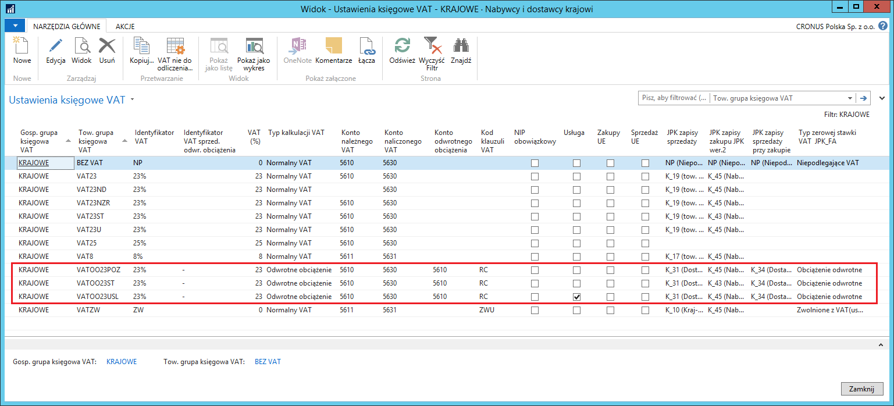{width="6.4086953193350835in" height="2.9106157042869643in"}
  --------------------------------------------------------------------------------------
  Rysunek 2.127: Ustawienia księgowe VAT

### Obsługa

W celu przygotowania deklaracji VAT-27 za wybrany okres, należy
postępować według następujących kroków:

1.  Należy wybrać **Działy \> Zarządzanie Finansami \> Działania
    okresowe \> VAT \> Deklaracje VAT-27**.

2.  W oknie **Deklaracje VAT-27** należy wybrać **Nowe**.

3.  W kartotece nowej deklaracji, na karcie skróconej **Ogólne**, należy
    wypełnić pola:

-   **Nr** -- w tym polu system wstawia numer kolejny deklaracji VAT-27,
    > zgodny z serią numeracji wybraną w ustawieniach.

-   **Deklaracja za okres** -- z listy opcji dostępnych w tym polu
    > należy wybrać, za jaki okres przygotowywana jest deklaracja.
    > Możliwe opcje do wyboru, to **Kwartał** i **Miesiąc**.

-   **Typ deklaracji** -- od typu deklaracji wybranego w tym polu zależą
    > dalsze czynności podczas tworzenia deklaracji VAT-27. Możliwe
    > opcje do wyboru, to: **Normalna**, **Korygująca**,
    > **Korygująco-uzupełniająca**.

-   **Nr skorygowanej deklaracji** -- dostępność tego pola do edycji
    > zależy od wybranego **Typu deklaracji**:

```{=html}
<!-- -->
```
-   dla typu **Normalna** -- pole jest nieedytowalne.

-   dla typu **Korygująca** -- pole jest edytowalne, z listy w nim
    > rozwijanej należy wybrać wcześniej utworzoną deklarację, która ma
    > zostać skorygowana.

-   dla typu **Korygująco-uzupełniająca** -- pole jest edytowalne,
    > z listy w nim rozwijanej należy wybrać wcześniej utworzoną
    > deklarację, która ma zostać skorygowana lub uzupełniona.

```{=html}
<!-- -->
```
-   **Nazwa** -- pole wypełniane automatycznie przez system -- wstawiana
    > jest nazwa firmy skopiowana z okna **Dane Firmy.**

-   **NIP** -- pole wypełniane automatycznie przez system -- wstawiany
    > jest NIP skopiowany z okna **Dane Firmy.**

-   **Numer urzędu skarbowego** -- pole wypełniane automatycznie
    > przez system -- wstawiany jest numer urzędu skarbowego skopiowany
    > z okna **Ustawienia raportowania statystycznego.**

-   **Data dokumentu** -- w tym polu system automatycznie wstawia datę
    > roboczą jako datę utworzenia deklaracji VAT-27. Datę ta można
    > zmienić ręcznie.

-   **Nr okresu** -- w zależności od wybranej opcji w polu **Deklaracja
    > za okres**, należy podać numer kolejny miesiąca lub kwartału
    > w roku, którego dotyczy tworzona deklaracja VAT-27.

-   **Rok** -- w tym polu należy wpisać rok, z którego pochodzi okres
    > (miesiąc lub kwartał), którego dotyczy tworzona deklaracja VAT-27.

-   **Data początkowa** -- pole nieedytowalne, system wstawia w nim datę
    > początkową okresu, jakim objęta jest deklaracja, na podstawie
    > wcześniej wprowadzonych parametrów w polach **Deklaracja
    > za okres**, **Nr okresu**, **Rok**.

-   **Data końcowa** -- pole nieedytowalne, system wstawia w nim datę
    > końcową okresu, jakim objęta jest deklaracja, na podstawie
    > wcześniej wprowadzonych parametrów w polach **Deklaracja
    > za okres**, **Nr okresu**, **Rok**.

-   **Kwota (PLN)** -- pole nieedytowalne, system wstawia sumę kwot
    > z wierszy deklaracji VAT-27.

-   **Stan** -- pole nieedytowalne, którego bieżąca opcja wskazuje
    > na stan edycji deklaracji. Zmiana stanu następuje poprzez wybranie
    > akcji **Zwolnij**, lub **Otwórz ponownie**.

-   **Towary/usługi** -- z listy opcji dostępnych w tym polu należy
    > wybrać rodzaj transakcji, jakie mają być zestawione w deklaracji.
    > Możliwe opcje do wyboru, to: **Oba**, **Towary**, **Usługi**.
    > System analizuje **Ustawienia księgowe VAT**,
    > dla których zaznaczone jest (lub nie) pole **Usługa**.

4.  Do pól w karcie skróconej **Osoby** system kopiuje dane z wcześniej
    > zdefiniowanych ustawień. W razie potrzeby, zawartość tych pól może
    > zostać ręcznie zmieniona.

  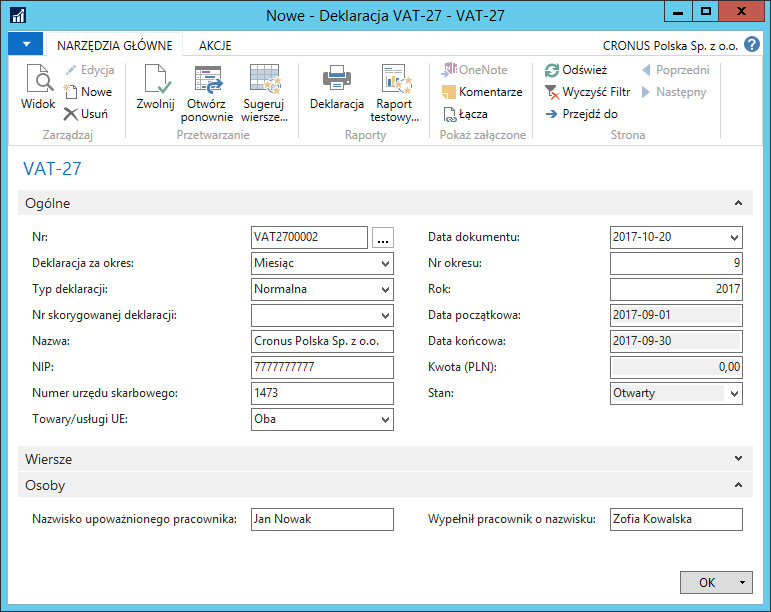{width="6.382608267716535in" height="5.066536526684165in"}
  ------------------------------------------------------------------------------------
  Rysunek 2.128: Nagłówek deklaracji VAT-27

5.  Po prawidłowym wypełnieniu pól nagłówka deklaracji, należy wypełnić
    > wiersze. W tym celu, w kartotece deklaracji należy wybrać
    > **Sugeruj wiersze**.

6.  W oknie **Sugeruj wiersze deklaracji VAT-27**, które się otworzy,
    > należy zaznaczyć pole **Usuń istniejące wiersze**, aby skrypt
    > nadpisał istniejące wiersze deklaracji.

  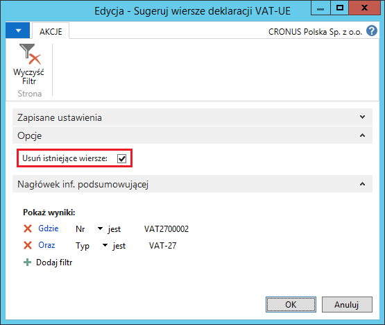{width="4.669291338582677in" height="3.937007874015748in"}
  ------------------------------------------------------------------------------------
  Rysunek 2.129: sugerowanie wierszy deklaracji VAT-27

7.  Następnie należy wybrać **OK** w celu wykonania skryptu.

> W wyniku użycia skryptu **Sugeruj wiersze deklaracji VAT-27** system
> wypełnia automatycznie wiersze deklaracji według poniższej logiki:

1)  Skrypt przetwarza **Zapisy VAT** mające datę obowiązku VAT (jeżeli
    pole **Użyj daty obowiązku VAT** jest zaznaczone, w przeciwnym
    wypadku system analizuje datę księgowania) przypadającą w okresie
    wyznaczonym datami w polach **Data początkowa** i **Data końcowa**
    w nagłówku deklaracji VAT-27.

2)  System wybiera właściwe **Zapisy VAT** pod względem grup księgowych
    VAT, dla których dla transakcji sprzedaży **Typ kalkulacji VAT**
    jest **Odwrotne obciążenie** i nie dotyczy transakcji
    wewnątrzunijnych. Dodatkowe filtrowanie **Zapisów VAT** zależy
    od wybranego w nagłówku deklaracji **Typu transakcji handlowej**.
    System wybiera **Zapisy VAT** zgodne z opcją wybraną w polu
    **Towary/usługi**. W tym celu analizowane jest zaznaczenie pola
    **Usługa** w oknie **Ustawienia księgowe VAT dla **kombinacji grup
    księgowych VAT w **Zapisach VAT**.

3)  Podczas wstawiania wierszy, system automatycznie uzupełnia m.in.
    pola:

-   **Kwota (PLN)** -- suma wartości typu transakcji
    > zakupu/sprzedaży/obu dla danego wiersza, skalkulowana z pola
    > **Podstawa VAT** w **Zapisach VAT**.

  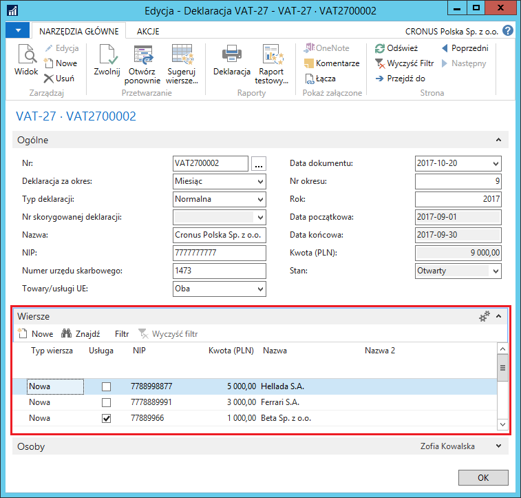{width="6.409337270341207in" height="6.121738845144357in"}
  ------------------------------------------------------------------------------------
  Rysunek 2.130: wiersze deklaracji VAT-27

8.  Przygotowana deklaracja VAT-27 może być testowo wydrukowana jeszcze
    przed zatwierdzeniem. W tym celu należy wybrać **Raport testowy**,
    a następnie **Podgląd** lub **Drukuj**:

  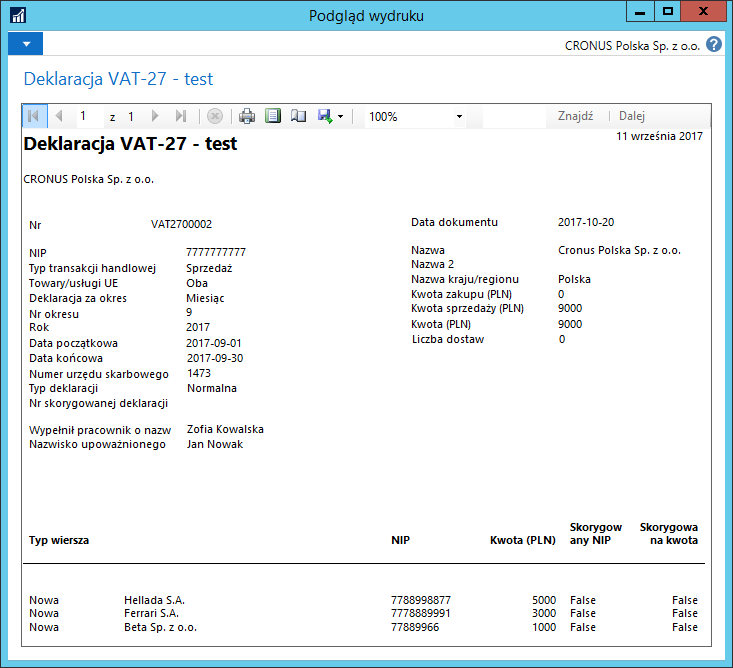{width="6.373912948381452in" height="5.8087051618547685in"}
  -------------------------------------------------------------------------------------
  Rysunek 2.131: Raport testowy deklaracji VAT-27

> {width="0.19in" height="0.19in"}
> **Uwaga:** Raport testowy sprawdza wprowadzone dane pod kątem
> wymagalności i wyświetla błędy/ostrzeżenia, które mogłyby uniemożliwić
> zatwierdzenie **Deklaracji VAT-27.**

9.  W kartotece deklaracji VAT-27 należy poprawić/uzupełnić dane tak,
    > aby na raporcie testowym nie pojawiały się ostrzeżenia.

10. Deklarację VAT-27 należy zatwierdzić, zmieniając jej stan
    > na **Zwolniony**. W tym celu należy wybrać **Zwolnij.**

  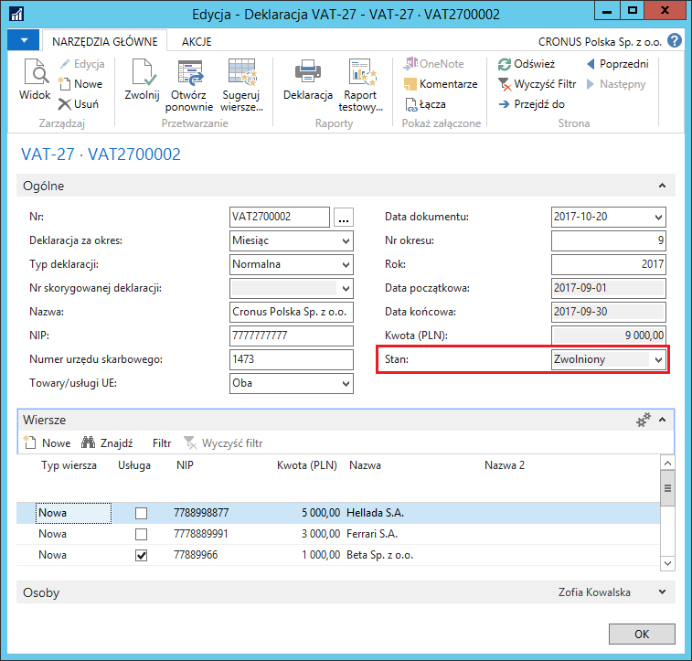{width="6.409337270341207in" height="6.121738845144357in"}
  ------------------------------------------------------------------------------------
  Rysunek 2.132: Zatwierdzona deklaracja VAT-27

11. Zatwierdzoną deklarację (ze stanem **Zwolniony**) można wydrukować,
    wybierając **Deklaracja**, a następnie **Drukuj lub Podgląd
    wydruku**:

  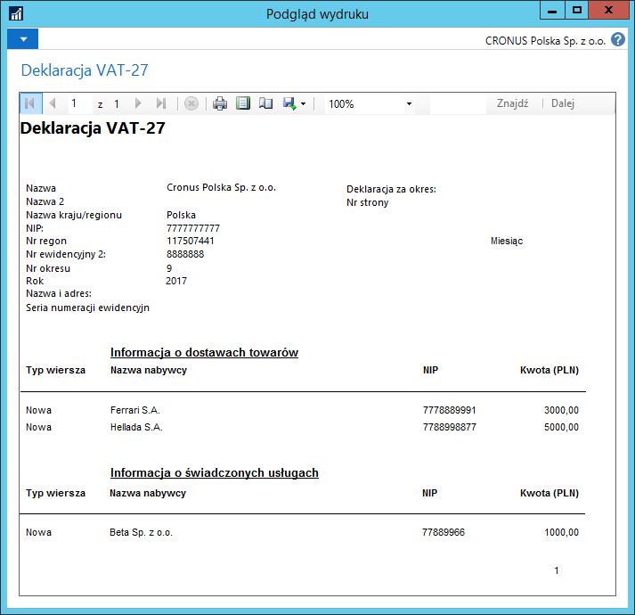{width="6.388741251093613in" height="6.182608267716535in"}
  ------------------------------------------------------------------------------------
  Rysunek 2.133: Wydruk deklaracji VAT-27

**\
**

Sprawdzenie statusu podmiotu w VAT {#sprawdzenie-statusu-podmiotu-w-vat .Poziom-1}
----------------------------------

### Informacje ogólne

W kwietniu 2018 roku Ministerstwo Finansów poinformowało, że
udostępnione zostało API do dostępnej na Portalu Podatkowym usługi
*Sprawdzenie statusu podmiotu w VAT*. Przedstawione zostały zasady
wymiany informacji pomiędzy usługą sieciową udostępnioną przez
Ministerstwo Finansów a oprogramowaniem interfejsowym systemów
klienckich, pobierających informacje dotyczące statusu podatników jako
płatników podatku VAT.

Aktualnie dostępna jest tylko usługa *SprawdzNIP*, która na podstawie
numeru NIP weryfikuje, czy podmiot jest zarejestrowany jako podatnik VAT
w dniu poprzedzającym przesłanie zapytania. W planach Ministerstwa
Finansów jest uruchomienie usługi *SprawdzNIPNaDzien*.

W odpowiedzi na przesłane zapytanie usługa *SprawdzNIP* zwraca **Kod**
oraz **Komunikat**:

-   **Kod** -- jednoznakowy kod rezultatu wykonanej operacji, może
    > oznaczać status rejestracji podmiotu jako podatnika VAT lub błąd
    > zapytania.

> Możliwe kody statusu rejestracji:

-   **N** -- podmiot o podanym identyfikatorze podatkowym NIP nie jest
    > zarejestrowany jako podatnik VAT,

-   **C** -- podmiot o podanym identyfikatorze podatkowym NIP jest
    > zarejestrowany jako podatnik VAT czynny,

-   **Z** -- podmiot o podanym identyfikatorze podatkowym NIP jest
    > zarejestrowany jako podatnik VAT zwolniony.

> Możliwe kody błędów:

-   **I** -- błąd zapytania -- niepoprawny Numer Identyfikacji
    > Podatkowej.

```{=html}
<!-- -->
```
-   **Komunikat** -- opis kodu rezultatu wykonanej operacji.

> Użytkownik może otrzymać jeden z trzech poniższych komunikatów:

-   Podmiot o podanym identyfikatorze podatkowym NIP nie jest
    > zarejestrowany jako podatnik VAT.

-   Podmiot o podanym identyfikatorze podatkowym NIP jest zarejestrowany
    > jako podatnik VAT czynny.

-   Podmiot o podanym identyfikatorze podatkowym NIP jest zarejestrowany
    > jako podatnik VAT zwolniony.

### W ramach Polskiej Lokalizacji, do standardowej funkcjonalności systemu Microsoft Dynamics 365 Business Central on‑premises została dodana funkcja Sprawdź status VAT, którą można stosować zarówno w transakcjach zakupu, jak i sprzedaży.

### Ustawienia

> Funkcjonalność sprawdzania statusu podmiotu w VAT wymaga aktywnego
> połączenia z Internetem.

Należy upewnić się, że w oknie **Kraje/Regiony**, dla kodu kraju PL
wypełnione jest pole **Kod kraju/regionu UE** również PL.

### Obsługa

Funkcjonalność sprawdzania statusu podmiotu w VAT dostępna jest w
kartotekach: **Nabywcy**, **Dostawcy**, **Kontaktu** oraz w dokumentach:
**Zamówienie sprzedaży**, **Faktura sprzedaży**, **Faktura korygująca
sprzedaży**, **Zamówienie zakupu**, **Faktura zakupu**, **Faktura
korygująca zakupu**.

W celu sprawdzenia statusu VAT w kartotece kontrahenta, należy
postępować według następujących kroków:

1.  Należy otworzyć kartotekę wybranego nabywcy, dostawcy lub kontaktu,
    > a następnie kliknąć przycisk asysty w polu **NIP**.

  ----------------------------------
  Rysunek 2.134: Kartoteka nabywcy
  ----------------------------------

2.  W oknie **Rejestr NIP**, które się otworzy, na wstążce należy wybrać
    > akcję **Sprawdź status VAT**.

  ----------------------------
  Rysunek 2.135: Rejestr NIP
  ----------------------------

3.  W oknie **Rejestr NIP** pojawi się odpowiedź systemu sprawdzania
    statusu podmiotu w VAT, poprzez wypełnienie poszczególnych pól:

-   **Nr zapisu** -- kolejny numer w rejestrze NIP,

```{=html}
<!-- -->
```
-   **NIP** -- NIP, dla którego sprawdzany był status,

-   **Stan** -- możliwe opcje:

```{=html}
<!-- -->
```
-   **Niezweryfikowany**,

-   **Poprawny**,

-   **Niepoprawny.**

```{=html}
<!-- -->
```
-   **Kod statusu VAT** -- możliwe kody:

```{=html}
<!-- -->
```
-   **N** -- podmiot o podanym identyfikatorze podatkowym NIP nie jest
    > zarejestrowany jako podatnik VAT,

-   **C** -- podmiot o podanym identyfikatorze podatkowym NIP jest
    > zarejestrowany jako podatnik VAT czynny,

-   **Z** -- podmiot o podanym identyfikatorze podatkowym NIP jest
    > zarejestrowany jako podatnik VAT zwolniony.

```{=html}
<!-- -->
```
-   **Komunikat statusu VAT --** możliwe komunikaty:

```{=html}
<!-- -->
```
-   Podmiot o podanym identyfikatorze podatkowym NIP nie jest
    > zarejestrowany jako podatnik VAT,

-   Podmiot o podanym identyfikatorze podatkowym NIP jest zarejestrowany
    > jako podatnik VAT czynny,

-   Podmiot o podanym identyfikatorze podatkowym NIP jest zarejestrowany
    > jako podatnik VAT zwolniony.

```{=html}
<!-- -->
```
-   **Data statusu VAT** -- data dnia poprzedzającego dzień sprawdzenia
    > statusu,

-   **Zweryfikowana data** -- data i godzina weryfikacji,

-   **Identyfikator użytkownika** -- identyfikator użytkownika
    > sprawdzającego status.

  --------------------------------------------------------
  Rysunek 2.136: Rejestr NIP -- zweryfikowany status VAT
  --------------------------------------------------------

W celu sprawdzenia statusu VAT w dokumencie sprzedaży, należy postępować
według następujących kroków:

1.  Należy utworzyć nową kartotekę zamówienia sprzedaży, faktury
    sprzedaży lub faktury korygującej sprzedaży, a następnie wybrać
    nabywcę.

2.  Na wstążce należy wybrać akcję **Sprawdź status VAT**.

  -----------------------------------------------
  Rysunek 2.137: Kartoteka zamówienia sprzedaży
  -----------------------------------------------

3.  System wyświetli okno informacyjne z jednym z komunikatów:

-   Podmiot o podanym identyfikatorze podatkowym NIP nie jest
    > zarejestrowany jako podatnik VAT,

-   Podmiot o podanym identyfikatorze podatkowym NIP jest zarejestrowany
    > jako podatnik VAT czynny,

-   Podmiot o podanym identyfikatorze podatkowym NIP jest zarejestrowany
    > jako podatnik VAT zwolniony.

  ----------------------------------
  Rysunek 2.138: Okno informacyjne
  ----------------------------------

4.  W skróconej karcie **Szczegóły faktury** pod polem **NIP** dodane
    > jest pole **Status VAT** z informacją, czy dany NIP był dla tego
    > dokumentu sprawdzany i jaki był wynik sprawdzenia. Przed
    > weryfikacją wyświetlany jest status: **Status nie był
    > weryfikowany**. Po weryfikacji pojawi się jeden ze statusów:

-   **Niezarejestrowany**,

-   **Czynny**,

-   **Zwolniony**.

> Należy kliknąć informację wyświetloną w polu **Status VAT**.

  -----------------------------------------------
  Rysunek 2.139: Kartoteka zamówienia sprzedaży
  -----------------------------------------------

5.  W oknie **Rejestr NIP**, które się otworzy, wyświetlone są szczegóły
    > weryfikacji NIP w poszczególnych polach:

-   **Nr zapisu** -- kolejny numer w rejestrze NIP,

```{=html}
<!-- -->
```
-   **NIP** -- NIP, dla którego sprawdzany był status,

-   **Stan** -- możliwe opcje:

```{=html}
<!-- -->
```
-   **Niezweryfikowany**,

-   **Poprawny**,

-   **Niepoprawny.**

```{=html}
<!-- -->
```
-   **Kod statusu VAT** -- możliwe kody:

```{=html}
<!-- -->
```
-   **N** -- podmiot o podanym identyfikatorze podatkowym NIP nie jest
    > zarejestrowany jako podatnik VAT,

-   **C** -- podmiot o podanym identyfikatorze podatkowym NIP jest
    > zarejestrowany jako podatnik VAT czynny,

-   **Z** -- podmiot o podanym identyfikatorze podatkowym NIP jest
    > zarejestrowany jako podatnik VAT zwolniony.

```{=html}
<!-- -->
```
-   **Komunikat statusu VAT --** możliwe komunikaty:

```{=html}
<!-- -->
```
-   Podmiot o podanym identyfikatorze podatkowym NIP nie jest
    > zarejestrowany jako podatnik VAT,

-   Podmiot o podanym identyfikatorze podatkowym NIP jest zarejestrowany
    > jako podatnik VAT czynny,

-   Podmiot o podanym identyfikatorze podatkowym NIP jest zarejestrowany
    > jako podatnik VAT zwolniony.

```{=html}
<!-- -->
```
-   **Data statusu VAT** -- data dnia poprzedzającego dzień sprawdzenia
    > statusu,

-   **Zweryfikowana data** -- data i godzina weryfikacji,

-   **Identyfikator użytkownika** -- identyfikator użytkownika
    > sprawdzającego status.

  --------------------------------------------------------
  Rysunek 2.140: Rejestr NIP -- zweryfikowany status VAT
  --------------------------------------------------------

W wyniku zaksięgowania dokumentu sprzedaży, informacja o przeprowadzonej
weryfikacji VAT przenoszona jest do zaksięgowanego dokumentu. W celu
sprawdzenia weryfikacji VAT w zaksięgowanym dokumencie sprzedaży, należy
postępować według następujących kroków:

1.  Należy otworzyć kartotekę zaksięgowanej faktury sprzedaży lub
    > zaksięgowanej faktury korygującej sprzedaży.

2.  W skróconej karcie **Ogólne** pod polem **NIP** dodane jest pole
    > **Status VAT** z informacją, czy dany NIP był dla tego dokumentu
    > sprawdzany i jaki był wynik sprawdzenia. Przed weryfikacją
    > wyświetlany jest status: **Status nie był weryfikowany**. Po
    > weryfikacji pojawi się jeden ze statusów:

-   **Niezarejestrowany**,

-   **Czynny**,

-   **Zwolniony**.

> Należy kliknąć informację wyświetloną w polu **Status VAT**.

  ----------------------------------------------------------
  Rysunek 2.141: Kartoteka zaksięgowanej faktury sprzedaży
  ----------------------------------------------------------

3.  W oknie **Rejestr NIP**, które się otworzy, wyświetlone są szczegóły
    > weryfikacji NIP w poszczególnych polach:

-   **Nr zapisu** -- kolejny numer w rejestrze NIP,

```{=html}
<!-- -->
```
-   **NIP** -- NIP, dla którego sprawdzany był status,

-   **Stan** -- możliwe opcje:

```{=html}
<!-- -->
```
-   **Niezweryfikowany**,

-   **Poprawny**,

-   **Niepoprawny.**

```{=html}
<!-- -->
```
-   **Kod statusu VAT** -- możliwe kody:

```{=html}
<!-- -->
```
-   **N** -- podmiot o podanym identyfikatorze podatkowym NIP nie jest
    > zarejestrowany jako podatnik VAT,

-   **C** -- podmiot o podanym identyfikatorze podatkowym NIP jest
    > zarejestrowany jako podatnik VAT czynny,

-   **Z** -- podmiot o podanym identyfikatorze podatkowym NIP jest
    > zarejestrowany jako podatnik VAT zwolniony.

```{=html}
<!-- -->
```
-   **Komunikat statusu VAT --** możliwe komunikaty:

```{=html}
<!-- -->
```
-   Podmiot o podanym identyfikatorze podatkowym NIP nie jest
    > zarejestrowany jako podatnik VAT,

-   Podmiot o podanym identyfikatorze podatkowym NIP jest zarejestrowany
    > jako podatnik VAT czynny,

-   Podmiot o podanym identyfikatorze podatkowym NIP jest zarejestrowany
    > jako podatnik VAT zwolniony.

```{=html}
<!-- -->
```
-   **Data statusu VAT** -- data dnia poprzedzającego dzień sprawdzenia
    > statusu,

-   **Zweryfikowana data** -- data i godzina weryfikacji,

-   **Identyfikator użytkownika** -- identyfikator użytkownika
    > sprawdzającego status.

  --------------------------------------------------------
  Rysunek 2.142: Rejestr NIP -- zweryfikowany status VAT
  --------------------------------------------------------

> {width="0.19in" height="0.19in"}
> **Uwaga:** Funkcjonalność sprawdzania statusu podmiotu w VAT w
> dokumentach zakupu (**Zamówienie zakupu**, **Faktura zakupu**,
> **Faktura korygująca zakupu**, **Zaksięgowana faktura zakupu**,
> **Zaksięgowana faktura korygująca zakupu**), działa analogicznie, jak
> w dokumentach sprzedaży, z tą różnicą, że akcja w niezaksięgowanych
> dokumentach zakupu ma nazwę Sprawdź kontrahenta i oprócz weryfikacji
> statusu podatnika, obejmuje też weryfikację rachunków bankowych
> dostawcy. Więcej szczegółów na ten temat w rozdziale
> 2.17.5. Sprawdzanie danych dostawcy.

Pobieranie danych z serwisów rządowych  {#pobieranie-danych-z-serwisów-rządowych .Poziom-1}
--------------------------------------

> **Informacje ogólne**

Z punktu widzenia rozliczeń z tytułu podatku VAT istotne jest, czy
kontrahent jest zarejestrowany jako czynny podatnik VAT. Ponadto
płatność za transakcję pow. 15 tys. zł powinna być dokonana na rachunek
bankowy kontrahenta znajdujący się w wykazie podatników VAT. W ramach
Polskiej Lokalizacji systemu Microsoft Dynamics 365 Business Central
on‑premises udostępniona została funkcja, która umożliwia pobieranie
danych kontrahentów z Bazy Internetowej Regon oraz z Wykazu podatników
VAT, włącznie z zarejestrowanymi rachunkami bankowymi.

> {width="0.19in" height="0.19in"}
> **Uwaga:** Opis ustawień i obsługi pobierania danych z serwisów
> rządowych zamieszczony w dalszej części rozdziału **bazuje
> na przykładzie kartoteki dostawcy. W kartotece nabywcy i w kartotece
> kontaktu mechanizm jest identyczny, więc należy wzorować się na opisie
> dotyczącym kartoteki dostawcy**.

#### Dane kontrahentów w Bazie Internetowej Regon (BIR) {#dane-kontrahentów-w-bazie-internetowej-regon-bir .Poziom-2}

> **Informacje ogólne**

Główny Urząd Statystyczny udostępnia aktualną informację o podatnikach
VAT w Bazie Internetowej Regon (BIR), którą każdy może dowolnie
przeszukiwać.

Polska Lokalizacja umożliwia bezpośrednie połączenie z systemu Microsoft
Dynamics 365 Business Central on‑premises z Bazą Internetową Regon
i wyszukiwanie podmiotów podając numer NIP lub regon. Możliwe jest
również tworzenie i aktualizacja danych nabywców, dostawców i kontaktów
w oparciu o dane w Bazie Internetowej Regon.

> **Ustawienia**

W Bazie Internetowej Regon dane kontrahentów zdefiniowane są w pełnym
brzmieniu, np. spółka z ograniczoną odpowiedzialnością. Aby system
automatycznie podpowiadał w nazwie kontrahenta skrót np. sp. z o.o.,
należy wcześniej zdefiniować te skróty. W tym celu należy wykonać
następujące kroki:

1.  Należy wybrać **Działy \> Zarządzanie Finansami \> Administracja \>
    Ustawienia \> Skróty danych BIR**.

2.  W oknie **Skróty danych BIR**, które się otworzy, w pierwszym wolnym
    wierszu należy w polu **Tekst** wprowadzić treść danych BIR, dla
    których w polu **Skrót** należy zdefiniować ich skróconą formę:

+----------------------------------------------------------------------+
|   {width="4.846456692913386in" height="3.4448818897637796in"} |
|   -----------------                                                  |
| -------------------------------------------------------------------- |
|   Rysunek 2.143: Skróty danych BIR                                   |
+----------------------------------------------------------------------+

3.  Zmiany należy zatwierdzić klikając przycisk **OK**.

### Obsługa

Wprowadzając do bazy nowego dostawcę, należy wykonać następujące kroki:

1.  Należy wybrać **Działy \> Zakup \> Przetwarzanie zamówień \>
    Dostawcy.**

2.  W oknie **Dostawcy**, które się otworzy, na wstążce należy kliknąć
    > **Nowy**.

3.  W nowej kartotece dostawcy, która się otworzy, na wstążce należy
    > kliknąć **Pobierz dane z serwisów rządowych**.

4.  W oknie **Kartoteka danych serwisów rządowych**, które się otworzy,
    w polu **Wyszukaj nr VAT/NIP** należy wprowadzić NIP (10 cyfr)
    kontrahenta, którego wprowadzamy do bazy. Jest też możliwość
    wyszukiwania kontrahenta według numeru regon, w tym celu należy
    wypełnić pole **Wyszukaj regon**.

5.  Na wstążce należy kliknąć **Pobierz dane z BIR**.

  ----------------------------------------------------
  Rysunek 2.144: Kartoteka danych serwisów rządowych
  ----------------------------------------------------

W wyniku działania akcji **Pobierz dane z BIR**, w oknie **Kartoteka
danych serwisów rządowych** pojawi się nowa karta skrócona **Dane BIR**,
w której prezentowane są dane kontrahenta zarejestrowane w Bazie
Internetowej Regon. Pola tej karty skróconej są nieedytowalne.

W polach na karcie skróconej **Dane aktualizujące** jest kopia danych
z Bazy Internetowej Regon. Wszystkie pola są edytowalne -- użytkownik
może zmienić ich zawartość. Dane z tych pól zostaną skopiowane
do kartoteki dostawcy po kliknięciu akcji **Aktualizuj kartotekę
dostawcy**.

  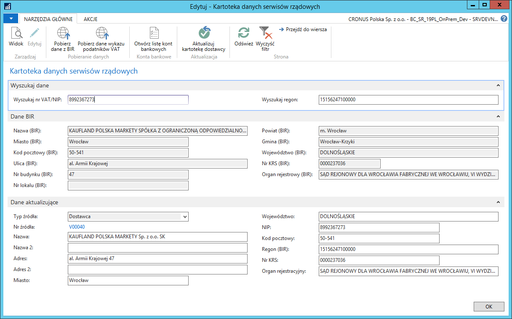{width="6.3125in" height="3.9399168853893265in"}
  --------------------------------------------------------------------------
  Rysunek 2.145: Kartoteka danych serwisów rządowych

6.  W oknie **Kartoteka danych serwisów rządowych** na wstążce należy
    kliknąć **Aktualizuj kartotekę dostawcy**, a następnie **OK**.

> {width="0.19in" height="0.19in"}
> **Uwaga:** Jeśli wcześniej pobrane były dane kontrahenta z Wykazu
> podatników VAT lub pola na karcie skróconej **Dane aktualizujące**
> były wypełnione ręcznie, pojawi się komunikat z pytaniem, czy zastąpić
> dane aktualizujące danymi z Bazy Internetowej Regon.
>
> System automatycznie wypełnił pola w kartotece dostawcy danymi z karty
> skróconej **Dane aktualizujące** w **Kartotece danych serwisów
> rządowych**.

  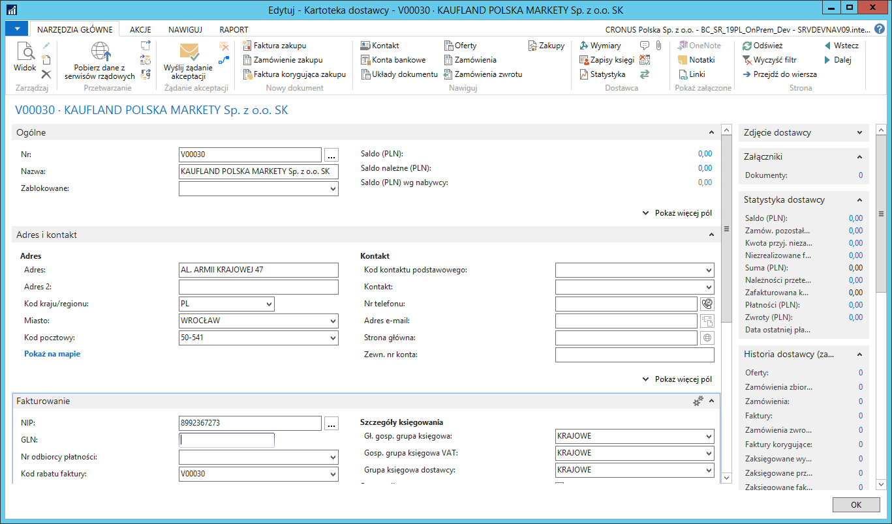{width="6.393732502187227in" height="3.7604166666666665in"}
  -------------------------------------------------------------------------------------
  Rysunek 2.146: dane KONTRAHENTA W KARTOTECE dostawcy

Funkcja **Pobierz dane z BIR** w oknie **Kartoteka danych serwisów
rządowych** może być uruchomiona również w istniejącej kartotece
dostawcy i służyć do sprawdzenia, czy dany kontrahent jest aktualnie
zarejestrowany jako czynny podatnik VAT. W tej sytuacji funkcja
**Pobierz dane z BIR** automatycznie pobiera NIP z kartoteki kontrahenta
w celu przeszukania Bazy Internetowej Regon. W przypadku, gdy dany NIP
nie zostanie odnaleziony, zostanie wyświetlony stosowny komunikat:

  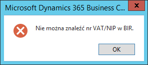{width="3.0833333333333335in" height="1.3645833333333333in"}
  --------------------------------------------------------------------------------------
  Rysunek 2.147: Komunikat o braku kontrahenta w bir

W sytuacji, gdy podatnik zostanie odnaleziony, a jego dane się nie
zmieniły, nie ma potrzeby uruchamiania akcji **Aktualizuj kartotekę
dostawcy**.

#### Wykaz podatników VAT {#wykaz-podatników-vat .Poziom-2}

> **Informacje ogólne**

Zgodnie z przepisami przy transakcjach powyżej 15 tys. zł płatności na
rzecz kontrahenta należy dokonać przelewem na jego rachunek bankowy. Od
stycznia 2020 r. taka płatność powinna trafić na rachunek kontrahenta
znajdujący się w wykazie podatników VAT. Wówczas płatność jest
bezpieczna, a płatnik nie ponosi negatywnych konsekwencji podatkowych.

Jeśli płatność dokonywana jest na inny rachunek niż wskazany w wykazie,
wówczas nie można zaliczyć tego wydatku do kosztów uzyskania przychodów.
Nabywca będzie również solidarnie odpowiadać ze sprzedawcą, który jest
czynnym podatnikiem VAT, za jego zaległości podatkowe w tej części
podatku VAT, która przypada na płatność za transakcję potwierdzoną
fakturą, a dokonaną przelewem na rachunek inny, niż zawarty w wykazie
podatników VAT, na dzień zlecenia przelewu.

> {width="0.19in" height="0.19in"}
> **Uwaga:** Istotne będzie, czy rachunek znajdował się w wykazie w dniu
> zlecenia przelewu. Decyduje przy tym dzień zlecenia przelewu, a nie
> obciążenia rachunku nabywcy czy uznania rachunku sprzedawcy.

Jeżeli w ciągu 3 dni od dnia zlecenia przelewu płatnik poinformuje
naczelnika urzędu skarbowego właściwego dla wystawcy faktury o numerze
rachunku, na który został zlecony przelew, to będzie mógł zaliczyć
wydatek do kosztów uzyskania przychodów. Nie poniesie on również
odpowiedzialności solidarnej, mimo że wpłata trafiła na inny rachunek,
niż wskazany w wykazie podatników VAT. Dodatkowo płatnik nie będzie
odpowiadał solidarnie, jeśli zapłaci przy użyciu mechanizmu podzielonej
płatności.

> **Ustawienia**

Status kont bankowych kontrahentów zdefiniowanych w systemie Microsoft
Dynamics 365 Business Central on‑premises sprawdzany jest w wykazie
podatników VAT dla tych nabywców/dostawców, w których kartotekach
wybrany jest kod **PL** w polu **Kod kraju/regionu**. Wynika to z faktu,
że w wykazie podatników VAT widnieją tylko przedsiębiorstwa
zarejestrowane w Polsce. W przypadku innego kodu kraju/regionu, status
konta bankowego wykaże wartość **Nie dotyczy**. Dodatkowo została
przygotowana strona ustawień dla wykazu podatników VAT.

Przed rozpoczęciem korzystania z funkcjonalności weryfikowania kont
bankowych nabywców/dostawców konieczne jest zdefiniowanie podstawowych
ustawień. W tym celu należy wykonać następujące kroki:

1.  Należy wybrać **Działy \> Zarządzanie Finansami \> Ustawienia wykazu
    podatników VAT \> Ustawienia wykazu podatników VAT**.

2.  W oknie **Kartoteka ustawień wykazu podatników VAT**, które się
    otworzy, należy wypełnić pola zgodnie z poniższym opisem:

-   **Metoda sprawdzania** -- określa miejsce, w którym będą sprawdzane
    konta bankowe kontrahentów. Opcje dostępne w tym polu:

```{=html}
<!-- -->
```
-   **Plik** -- konta będą weryfikowane tylko w pliku płaskim,

-   **API** -- konta będą weryfikowane tylko w API,

-   **Plik i API** -- konta będą weryfikowane w pierwszej kolejności w
    pliku płaskim. Jeśli ta weryfikacja wykaże, że dane konto nie
    zostało zgłoszone, zostanie wykonana dodatkowa weryfikacja w API.

> {width="0.19in" height="0.19in"}
> **Uwaga:** W przypadku wybrania opcji **Plik i API**, system będzie
> dokonywać weryfikacji zarówno w pliku, jak i w API. Wystarczy
> potwierdzenie weryfikacji tylko w jednym ze źródeł, aby system uznał,
> że konto zostało zgłoszone.

-   **Użyj API, jeśli plik jest niedostępny** -- zaznaczenie tego pola
    spowoduje, że konta bankowe będą weryfikowane w API w sytuacji, gdy
    aktualny plik płaski nie będzie dostępny,

-   **Użyj API dla zamówienia zakupu** -- zaznaczenie tego pola
    spowoduje, że konto bankowe wybrane w zamówieniu zakupu będzie
    weryfikowane w API. Domyślnie konta bankowe wprowadzane w
    zamówieniach zakupu nie są weryfikowane w API, niezależnie od
    pozostałych ustawień.

-   **Maks. rozmiar żądania API** -- określa maksymalny rozmiar paczki
    wysyłanej do API. Wartość ta nie powinna być większa, niż wartość
    podana przez Ministerstwo Finansów; w przypadku wprowadzenia zbyt
    dużej wartości, zapytanie może zwrócić błąd.

> {width="0.19in" height="0.19in"}
> **Uwaga:** Według specyfikacji Ministerstwa Finansów, dostęp do API
> jest limitowany. Zalecane jest więc korzystanie z pliku i ograniczenie
> wykorzystania API do minimum.
>
> {width="0.19in" height="0.19in"}
> **Uwaga:** W związku z techniczną naturą ustawień, dostęp do nich
> powinni mieć wyłącznie administratorzy systemu.

  ---------------------------------------------------------
  Rysunek 2.148: Kartoteka ustawień wykazu podatnikóW VAT
  ---------------------------------------------------------

> **Obsługa**

W przypadku gdy weryfikacja odbywa się za pomocą pliku płaskiego,
konieczne jest wgranie pliku do systemu. Proces wgrywania pliku zakłada,
że raz dziennie -- najlepiej przed rozpoczęciem pracy -- administrator
pobierze plik płaski, rozpakuje go, a następnie zaimportuje do systemu.
Do tego celu służy **Rejestr plików wykazu podatników VAT.**

W celu zaimportowania pliku do systemu Microsoft Dynamics 365 Business
Central on‑premises, należy wykonać następujące kroki:

1.  Należy wybrać **Działy \> Administracja \> Ustawienia aplikacji \>
    Ogólne \> Rejestr plików wykazu podatników VAT**.

2.  W oknie **Rejestr plików wykazu podatników VAT**, które się otworzy,
    należy na wstążce kliknąć **Pobierz plik wykazu podatników VAT**:

  -----------------------------------------------------
  Rysunek 2.149: Rejestr plików wykazu podatnikóW VAT
  -----------------------------------------------------

3.  Pojawi się komunikat, w którym należy kliknąć **Tak**, aby
    kontynuować proces.

  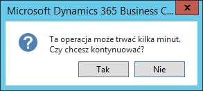{width="3.0520833333333335in" height="1.375in"}
  -------------------------------------------------------------------------
  Rysunek 2.150: Komunikat

4.  W oknie zapisu pliku pobranego z zasobów Ministerstwa Finansów,
    które się pojawi, należy kliknąć **Zapisz** i wskazać lokalną
    ścieżkę dostępu.

  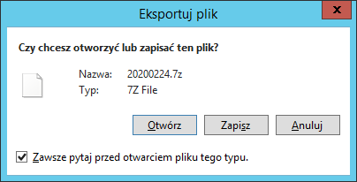{width="4.208333333333333in" height="2.1458333333333335in"}
  -------------------------------------------------------------------------------------
  Rysunek 2.151: Okno zapisu pliku

5.  Należy rozpakować zapisany plik.

6.  W oknie **Rejestr plików wykazu podatników VAT** należy na wstążce
    kliknąć **Wstaw dane z pliku**.

  -----------------------------------------------------
  Rysunek 2.152: Rejestr plików wykazu podatnikóW VAT
  -----------------------------------------------------

7.  Pojawi się komunikat, w którym należy kliknąć **Tak**, aby
    kontynuować proces.

  {width="3.0520833333333335in" height="1.375in"}
  -------------------------------------------------------------------------
  Rysunek 2.153: Komunikat

8.  W oknie, które się otworzy, należy wskazać rozpakowany wcześniej
    plik w formacie .json i kliknąć **Otwórz**.

  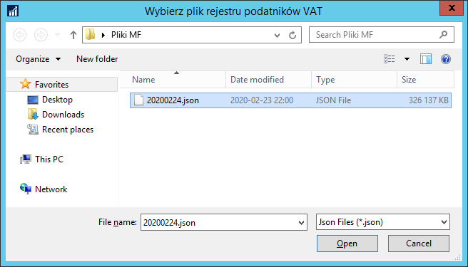{width="6.375in" height="3.644511154855643in"}
  ------------------------------------------------------------------------
  Rysunek 2.154: Okno wyboru pliku wykazu podatnikóW VAT

9.  System przeprowadza walidację. W sytuacji, gdy wgrywany plik jest
    nieaktualny, system wyświetli stosowną informację, następnie
    nieaktualne dane zastąpi aktualnymi.

> Szacowany czas wstawiania danych z pliku to 10 minut.

10. Po zakończeniu procesu pobierania i wstawiania danych z pliku w
    oknie **Rejestr plików wykazu podatników VAT** zostaną utworzone dwa
    wiersze jako efekt wykonanych operacji, z odpowiednimi informacjami
    w poszczególnych polach.

  -----------------------------------------------------
  Rysunek 2.155: Rejestr plików wykazu podatnikóW VAT
  -----------------------------------------------------

> **Obsługa**

Wprowadzając dane dostawcy do systemu Microsoft Dynamics 365 Business
Central on‑premises, należy wykonać następujące kroki:

1.  Należy wybrać **Działy \> Zakup \> Przetwarzanie zamówień \>
    Dostawcy**.

2.  W oknie **Dostawcy**, które się otworzy, na wstążce należy kliknąć
    **Nowy**.

3.  W nowej kartotece dostawcy, która się otworzy, na wstążce należy
    kliknąć **Pobierz dane z serwisów rządowych**.

4.  W oknie **Kartoteka danych serwisów rządowych**, które się otworzy,
    w polu **Wyszukaj nr VAT/NIP** należy wprowadzić NIP (10 cyfr)
    kontrahenta, którego wprowadzamy do bazy. Jest też możliwość
    wyszukiwania kontrahenta wg numeru regon, w tym celu należy wypełnić
    pole **Wyszukaj regon**.

5.  Na wstążce należy kliknąć **Pobierz dane wykazu podatników VAT**.

  ----------------------------------------------------
  Rysunek 2.156: Kartoteka danych serwisów rządowych
  ----------------------------------------------------

W wyniku działania tej akcji, w oknie **Kartoteka danych serwisów
rządowych** pojawi się nowa karta skrócona **Dane rejestru podatników
VAT**, w której prezentowane są dane kontrahenta zarejestrowane w
Wykazie podatników VAT. Pola tej karty skróconej są nieedytowalne.

W polach na karcie skróconej **Dane aktualizujące** jest kopia danych
z Wykazu podatników VAT. Wszystkie pola są edytowalne -- użytkownik może
zmienić ich zawartość. Dane z tych pól zostaną skopiowane do kartoteki
dostawcy po wybraniu akcji **Aktualizuj kartotekę dostawcy**.

{width="0.19in" height="0.19in"}
**Uwaga:** Jeśli wcześniej pobrane były dane kontrahenta z BIR lub pola
na karcie skróconej **Dane aktualizujące** były wypełnione ręcznie,
pojawi się komunikat z pytaniem, czy zastąpić dane aktualizujące danymi
z Wykazu podatników VAT .

  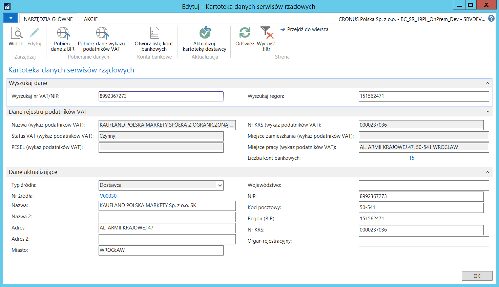{width="6.333333333333333in" height="3.646403105861767in"}
  ------------------------------------------------------------------------------------
  Rysunek 2.157: Dane kontrahenta z Wykazu podatników VAT

W polu **Liczba kont bankowych** na karcie skróconej **Dane rejestru
podatników VAT** wyświetlona jest ilość zarejestrowanych rachunków
bankowych kontrahenta. Jeśli jest ona większa od 0, należy wykonać
następujące kroki:

1.  Na wstążce należy kliknąć **Otwórz listę kont bankowych**.

2.  Otworzy się okno **Lista kont bankowych wykazu podatników VAT**,
    które należy wypełnić zgodnie z poniższym opisem:

-   **Istniejący kod konta** -- w tym polu wyświetlony jest kod konta
    bankowego zdefiniowanego już w systemie dla danego kontrahenta,
    które rozpoznawane jest na podstawie numeru IBAN,

-   **Nr konta bankowego (wykaz podatników VAT)** -- w tym polu znajduje
    się numer rachunku bankowego pobrany z wykazu podatników VAT,

-   **Akcja** -- w wierszu z wybranym numerem rachunku bankowego, który
    ma być przypisany do kontrahenta w systemie, należy wybrać jedną z
    opcji:

```{=html}
<!-- -->
```
-   **Puste** -- dany rachunek bankowy nie zostanie przypisany do
    kartoteki kontrahenta w systemie,

-   **Utwórz nowe** -- dany rachunek bankowy zostanie przypisany
    do kartoteki kontrahenta w systemie (zostanie założone nowe konto
    bankowe dostawcy) -- tę opcję można wybrać, jeśli pole **Istniejący
    kod konta** jest puste,

-   **Zaktualizuj istniejące** -- informacje o danym rachunku bankowym
    zastąpią informacje w istniejącym w systemie koncie bankowym
    kontrahenta -- tę opcję można wybrać, jeśli pole **Istniejący kod
    konta** nie jest puste.

  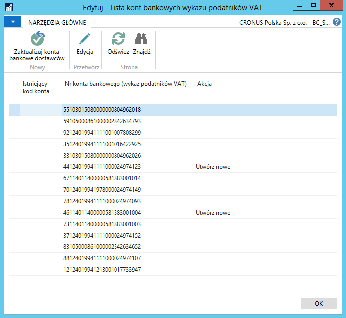{width="6.391403105861767in" height="5.885416666666667in"}
  ------------------------------------------------------------------------------------
  Rysunek 2.158: Lista kont bankowych Wykazu podatników VAT

3.  Należy zaznaczyć wiersz z wybranym rachunkiem bankowym, dla którego
    > zostało wypełnione pole **Akcja**, następnie na wstążce należy
    > kliknąć **Edycja**.

4.  W oknie **Kartoteka konta bankowego -- wykaz podatników VAT** na
    > karcie skróconej **Dane aktualizujące** wyświetlone są domyślne
    > informacje o rachunku bankowym. W razie potrzeby należy ręcznie
    > wprowadzić zmiany, a następnie kliknąć **OK**, aby zamknąć okno.

W razie potrzeby, czynności opisane w krokach 3. i 4. należy powtórzyć
dla wszystkich rachunków z wypełnionym polem **Akcja**.

  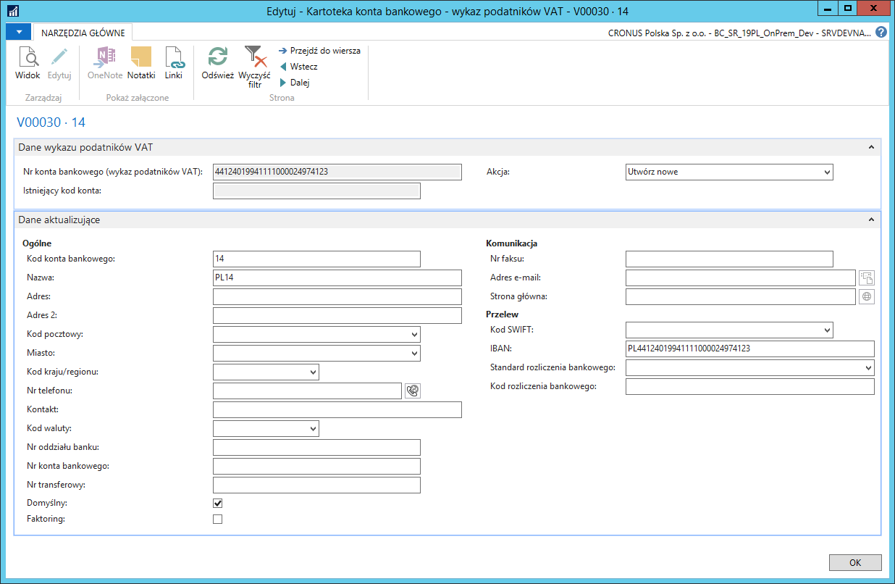{width="6.375in" height="4.1573720472440945in"}
  -------------------------------------------------------------------------
  Rysunek 2.159: Kartoteka konta bankowego - Wykaz podatników VAT

5.  W oknie **Lista kont bankowych wykazu podatników VAT** na wstążce
    należy kliknąć **Zaktualizuj konta bankowe dostawców**.

6.  W oknie komunikatu, które się wyświetli, należy kliknąć **Tak**.

  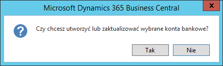{width="4.59375in" height="1.3645833333333333in"}
  ---------------------------------------------------------------------------
  Rysunek 2.160: Komunikat

7.  W komunikacie potwierdzającym utworzenie i/lub zaktualizowanie
    informacji o kontach bankowych dostawcy należy kliknąć **OK**.

8.  W oknie **Lista kont bankowych wykazu podatników VAT** należy
    kliknąć **OK**, aby je zamknąć.

9.  W oknie **Kartoteka danych serwisów rządowych** na wstążce należy
    kliknąć **Aktualizuj kartotekę dostawcy**, a następnie **OK**.

{width="0.19in" height="0.19in"}
**Uwaga:** Jeśli akcja **Aktualizuj kartotekę dostawcy** zostanie
uruchomiona dla kartoteki dostawcy, w której wprowadzone są już jakieś
dane, zostanie wyświetlony komunikat z pytaniem, czy aktualne dane mają
zostać zastąpione danymi znajdującymi się na karcie skróconej **Dane
aktualizujące**. Należy kliknąć **Tak** lub **Nie**.

{width="0.19in" height="0.19in"}
**Uwaga:** Jeśli krok 5. zostanie pominięty, czyli w oknie **Lista kont
bankowych wykazu podatników VAT** nie będzie uruchomiona akcja
**Zaktualizuj konta bankowe dostawców**, to przy wykonywaniu kroku 9.,
czyli aktualizacji kartoteki dostawcy, system sprawdzi, czy w oknie
**Lista kont bankowych wykazu podatników VAT** w co najmniej jednym
wierszu jest wybrana akcja **Utwórz nowe** lub **Zaktualizuj
istniejące** i wykona wybraną akcję, tzn. utworzy nowe lub zaktualizuje
istniejące konta bankowe dostawcy.

W wyniku akcji uruchomionych w krokach 5. i/lub 9. system uzupełnił
kartotekę dostawcy jego danymi pobranymi z serwisów rządowych oraz
wstawił i/lub zaktualizował informacje o jego kontach bankowych

  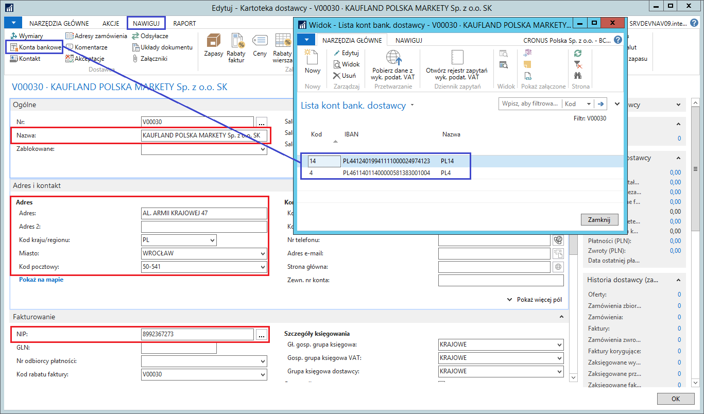{width="6.375in" height="3.7493985126859144in"}
  -----------------------------------------------------------------------------------------------------------------------------------------------
  Rysunek 2.161: Kartoteka dostawcy i konta bankowe dostawcy

#### Aktualizacja kont bankowych {#aktualizacja-kont-bankowych .Poziom-2}

> **Informacje ogólne**

W przypadku kontrahentów, dla których zdefiniowana jest już kartoteka
dostawcy lub kartoteka nabywcy w systemie Microsoft Dynamics 365
Business Central on‑premises, z Wykazu podatników VAT można pobrać
informację o jego zarejestrowanych rachunkach bankowych i na tej
podstawie zaktualizować konta bankowe przypisane do kartoteki
dostawcy/nabywcy lub założyć nowe.

> {width="0.19in" height="0.19in"}
> **Uwaga:** Opis aktualizacji kont bankowych zamieszczony w dalszej
> części rozdziału **bazuje na przykładzie kartoteki dostawcy.
> W kartotece nabywcy mechanizm jest identyczny, więc należy wzorować
> się na opisie dotyczącym kartoteki dostawcy**.
>
> **Obsługa**

W celu pobrania informacji o zarejestrowanych rachunkach bankowych
dostawcy, należy wykonać następujące kroki:

1.  Należy wybrać **Działy \> Zakup \> Przetwarzanie zamówień \>
    Dostawcy**.

2.  W oknie **Dostawcy**, które się otworzy, należy zaznaczyć wiersz z
    wybranym dostawcą, następnie na wstążce należy kliknąć **Konta
    bankowe**.

3.  W oknie **Lista kont bank. dostawcy**, które się otworzy, należy na
    wstążce kliknąć **Pobierz dane z wyk. podat. VAT**.

+----------------------------------------------------------------------+
|   {width="6.239583333333333in" height="3.0491294838145233in"} |
|   -----------------                                                  |
| -------------------------------------------------------------------- |
|   Rysunek 2.162: Lista kont bankowych dostawcy                       |
+----------------------------------------------------------------------+

4.  Dane w oknie **Lista kont bankowych wykazu podatników VAT**, które
    się otworzy, należy wypełnić zgodnie z poniższym opisem:

-   **Istniejący kod konta** -- w tym polu wyświetlony jest kod konta
    bankowego zdefiniowanego już w systemie dla danego kontrahenta,
    które rozpoznawane jest na podstawie numeru IBAN,

-   **Nr konta bankowego (wykaz podatników VAT)** -- w tym polu znajduje
    się numer rachunku bankowego pobrany z wykazu podatników VAT,

-   **Akcja** -- w wierszu z wybranym numerem rachunku bankowego, który
    ma być przypisany do kontrahenta w systemie, należy wybrać jedną z
    opcji:

```{=html}
<!-- -->
```
-   **Puste** -- dany rachunek bankowy nie zostanie przypisany do
    kartoteki kontrahenta w systemie lub konto nie zostanie
    zaktualizowane,

-   **Utwórz nowe** -- dany rachunek bankowy zostanie przypisany
    do kartoteki kontrahenta w systemie (zostanie założone nowe konto
    bankowe dostawcy) -- tę opcję można wybrać, jeśli pole **Istniejący
    kod konta** jest puste,

-   **Zaktualizuj istniejące** -- informacje o danym rachunku bankowym
    zastąpią informacje w istniejącym w systemie koncie bankowym
    kontrahenta -- tę opcję można wybrać, jeśli pole **Istniejący kod
    konta** nie jest puste.

  -----------------------------------------------------------
  Rysunek 2.163: Lista kont bankowych Wykazu podatników VAT
  -----------------------------------------------------------

5.  Należy zaznaczyć wiersz z wybranym rachunkiem bankowym, dla którego
    zostało wypełnione pole **Akcja**, następnie na wstążce należy
    kliknąć **Edycja**.

6.  W oknie **Kartoteka konta bankowego -- wykaz podatników VAT** na
    karcie skróconej **Dane aktualizujące** wyświetlone są domyślne
    informacje o rachunku bankowym. W razie potrzeby należy ręcznie
    wprowadzić zmiany, a następnie kliknąć **OK**, aby zamknąć okno.

W razie potrzeby, czynności opisane w krokach 5. i 6. należy powtórzyć
dla wszystkich rachunków z wypełnionym polem **Akcja**.

  {width="6.375in" height="4.1573720472440945in"}
  -------------------------------------------------------------------------
  Rysunek 2.164: Kartoteka konta bankowego - Wykaz podatników VAT

7.  W oknie **Lista kont bankowych wykazu podatników VAT** na wstążce
    należy kliknąć **Zaktualizuj konta bankowe dostawców**.

8.  W oknie komunikatu, które się wyświetli, należy kliknąć **Tak**.

  {width="4.59375in" height="1.3645833333333333in"}
  ---------------------------------------------------------------------------
  Rysunek 2.165: Komunikat

9.  W komunikacie potwierdzającym utworzenie i/lub zaktualizowanie
    informacji o kontach bankowych dostawcy należy kliknąć **OK**.

W wyniku powyższych działań, lista kont bankowych zdefiniowanych
dla wybranego dostawcy, została zaktualizowana:

  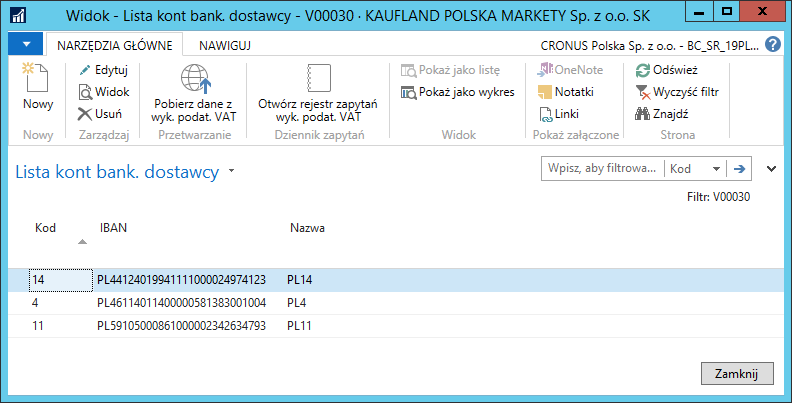{width="6.366260936132983in" height="3.2395833333333335in"}
  -------------------------------------------------------------------------------------
  Rysunek 2.166: Lista kont bankowych dostawcy

#### Rejestr zapytań wykazu podatników VAT {#rejestr-zapytań-wykazu-podatników-vat .Poziom-2}

### Informacje ogólne

Każda weryfikacja numeru konta bankowego kontrahenta w wykazie
podatników VAT zostaje zapisana w oknie **Rejestr zapytań wykazu
podatników VAT**, gdzie istnieje możliwość sprawdzenia m.in.
identyfikatora zapytania, który został zwrócony podczas weryfikacji w
wykazie podatników VAT.

### Obsługa

W celu sprawdzenia historii weryfikacji kont bankowych kontrahentów w
wykazie podatników VAT, należy wykonać następujące kroki:

1.  Należy wybrać **Działy \> Zarządzanie Finansami \> Bankowość
    elektroniczna \> Rejestr zapytań wykazu podatników VAT.**

2.  W oknie **Rejestr zapytań wykazu podatników VAT, które się otworzy,
    w niżej opisanych polach prezentowane są informacje o dokonanej
    weryfikacji:**

-   **Nr zapisu -- w tym polu prezentowany jest numer kolejny
    uruchomienia weryfikacji,**

-   **NIP/Regon -- w tym polu prezentowany jest numer będący podstawą
    zapytania,**

-   **Nr konta bankowego -- w tym polu prezentowany jest numer rachunku
    bankowego, który był weryfikowany,**

-   **Identyfikator użytkownika -- w tym polu prezentowany jest
    identyfikator użytkownika, który dokonał weryfikacji,**

-   **Stan -- w tym polu prezentowana jest odpowiedź zwrócona przez API
    Ministerstwa Finansów,**

-   **Data weryfikacji -- w tym polu prezentowana jest data, w której
    weryfikowany rachunek bankowy widnieje w wykazie podatników VAT jako
    zgłoszony,**

-   **Data i godzina zapytania -- w tym polu prezentowana jest data i
    godzina dokonania weryfikacji,**

-   **ID zapytania -- w tym polu prezentowany jest identyfikator**
    zwrócony podczas składania zapytania, będący dowodem że zapytanie
    zostało złożone. W przypadku weryfikacji w pliku, **ID zapytania**
    to nazwa pliku w którym konto bankowe było weryfikowane,

-   **Źródło weryfikacji -- w tym polu prezentowane jest** miejsce, w
    którym konto bankowe zostało zweryfikowane: **API** lub **Plik**, w
    zależności od zdefiniowanych ustawień.

> {width="0.19in" height="0.19in"}
> **Uwaga:** W przypadku, gdy podczas konfiguracji **Metody
> sprawdzania** została wybrana opcja **Plik i API**, w **Rejestrze
> zapytań wykazu podatników VAT** mogą utworzyć się dwa zapisy
> weryfikacji dla jednego konta bankowego.

  ------------------------------------------------------
  Rysunek 2.167: Rejestr zapytań wykazu podatników VAT
  ------------------------------------------------------

#### Dokumenty zakupu {#dokumenty-zakupu .Poziom-2}

### Informacje ogólne

W niezaksięgowanych dokumentach zakupu (fakturach i zamówieniach)
funkcja sprawdzająca status podatnika VAT, opisana w rozdziale *2.16.
Sprawdzenie statusu podmiotu w VAT*, rozbudowana jest o mechanizm
weryfikujący rachunki bankowe przypisane do kartoteki dostawcy.

{width="0.19in" height="0.19in"}
**Uwaga:** Opis sprawdzania kontrahenta zamieszczony w tym rozdziale
**bazuje na przykładzie faktury zakupu. W zamówieniach zakupu mechanizm
jest identyczny, więc należy wzorować się na opisie dotyczącym faktury
zakupu**.

### Obsługa

W celu sprawdzenia podczas ewidencji dokumentu zakupu, czy rachunki
bankowe przypisane do wybranego dostawcy są zarejestrowane w wykazie
podatników VAT, należy wykonać następujące kroki:

1.  Należy wybrać **Działy \> Zakup \> Przetwarzanie zamówień \> Faktury
    zakupu.**

2.  W oknie **Faktury zakupu, które się otworzy, należy na wstążce
    kliknąć Nowy.**

3.  **W nagłówku nowej faktury zakupu należy wybrać dostawcę.**

4.  Na karcie skróconej **Szczegóły faktury**, z listy rozwijanej w polu
    > **Kod konta bank. dostawcy** należy wybrać rachunek bankowy
    > widniejący na wprowadzanej fakturze zakupu.

5.  Na wstążce należy kliknąć **Sprawdź kontrahenta**.

System sprawdzi status podatnika VAT i zweryfikuje jego konta bankowe na
dzień wprowadzony w polu **Data księgowania** w nagłówku dokumentu.
Zostanie wyświetlony stosowny komunikat:

  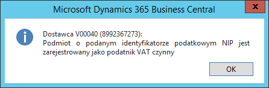{width="4.645833333333333in" height="1.53125in"}
  --------------------------------------------------------------------------
  Rysunek 2.168: Komunikat -- informacja o statusie podatnika

Na karcie skróconej **Szczegóły faktury** system zaktualizuje status
podatnika i jego rachunku bankowego w polach:

-   **Kod statusu VAT** -- opcje w tym polu i ich znaczenie opisane są w
    rozdziale *2.16. Sprawdzenie statusu podmiotu w VAT*

-   **Stan konta bankowego** -- pole przyjmuje jedną z opcji:

```{=html}
<!-- -->
```
-   **Niezweryfikowane --** w sytuacji, gdy nie została dokonana
    weryfikacja wybranego rachunku bankowego,

-   **Zgłoszone** -- w sytuacji, gdy wybrany rachunek bankowy znajduje
    się w wykazie podatników VAT,

-   **Niezgłoszone** -- w sytuacji, gdy wybrany rachunek bankowy
    nie znajduje się w wykazie podatników VAT,

-   **Nie dotyczy** -- jest to opcja wyświetlana dla kontrahentów
    zagranicznych.

  -------------------------------
  Rysunek 2.169: Faktura zakupu
  -------------------------------

Aby sprawdzić szczegóły dotyczące weryfikacji konta bankowego, należy
kliknąć link statusu konta bankowego lub akcję **Otwórz dziennik zapytań
wyk. podat. VAT** na wstążce.

#### Bankowość elektroniczna -- Arkusz płatności do dostawców/nabywców {#bankowość-elektroniczna-arkusz-płatności-do-dostawcównabywców .Poziom-2}

### Informacje ogólne

Podatnik zobowiązany jest do zapłaty zobowiązania na zarejestrowany
rachunek dostawcy, dlatego weryfikację konta bankowego najlepiej
przeprowadzić tuż przed zleceniem przelewu. W ramach modułu Bankowość
elektroniczna zostały dodane funkcje umożliwiające sprawdzenie, czy
rachunek bankowy, na który ma być złożony przelew, widnieje w Wykazie
podatników VAT.

{width="0.19in" height="0.19in"}
**Uwaga:** Opis weryfikacji rachunku bankowego do przelewu zamieszczony
w tym rozdziale **bazuje na przykładzie Arkusza płatności do dostawców.
W Arkuszu płatności do nabywców mechanizm jest identyczny, więc należy
wzorować się na opisie dotyczącym Arkusza płatności do dostawców**.

### Obsługa

W celu sprawdzenia statusu konta bankowego podczas przygotowywania
przelewów bankowych dla dostawców w **Arkuszu płatności do dostawców**,
należy wykonać następujące kroki:

1.  Należy wybrać **Działy \> Zarządzanie Finansami \> Bankowość
    elektroniczna \> Arkusz płatności do dostawców.**

2.  W oknie **Szablony poleceń przelewu, które się otworzy, należy
    zaznaczyć wybrany wiersz i kliknąć OK.**

**W oknie Arkusz płatności do dostawców, które się otworzy, w wierszach
z wypełnionym polem Kod konta bank. dostawcy, w polu Status jest
informacja o statusie danego konta bankowego dostawcy.**

**Ponadto, w polu informacji Globalny stan kont bankowych dostawców
prezentowana jest informacja, czy są jakieś konta niezweryfikowane
lub niezgłoszone.**

  ----------------------------------------------
  Rysunek 2.170: Arkusz płatności do dostawców
  ----------------------------------------------

3.  W wierszach arkusza, do których mają być wygenerowane przelewy,
    > należy przypisać konta bankowe odbiorców płatności, wybierając je
    > w polu **Kod konta bank. dostawcy**.

4.  Na wstążce należy kliknąć **Zweryfikuj wszystkie konta bankowe**.

System weryfikuje wszystkie konta bankowe dostawców występujących
w arkuszu płatności, którzy w kartotece mają przypisany kod **PL** w
polu **Kod kraju/regionu** oraz poprawnie zdefiniowany polski **IBAN**
dla konta bankowego dostawcy wybranego w **Arkuszu płatności do
dostawców**. Weryfikacja konta dokonywana jest na datę dokumentu. W
wyniku weryfikacji system aktualizuje informację w polu **Status.**

{width="0.19in" height="0.19in"}
**Uwaga:** Niezbędna jest weryfikacja wszystkich kont bankowych
powiązanych z generowanymi przelewami eksportowanymi do pliku lub
przenoszonymi do dziennika płatności. Próba wygenerowania przelewów z
niezweryfikowanymi kontami bankowymi zakończy się błędem. W przypadku
kont niezgłoszonych -- zostanie wyświetlony stosowny komunikat, w którym
należy potwierdzić tę operację.

Aby sprawdzić historię weryfikacji danego konta bankowego, należy
ustawić kursor w wybranym wierszu arkusza płatności do dostawców,
następnie należy na wstążce kliknąć **Otwórz rejestr zapytań wyk. podat.
VAT**.

#### Bankowość elektroniczna -- Dziennik przelewów bankowych {#bankowość-elektroniczna-dziennik-przelewów-bankowych .Poziom-2}

### Informacje ogólne

W dzienniku przelewów jest możliwość ręcznego przygotowania przelewu,
bez powiązania z zaksięgowanym zobowiązaniem, możliwa jest też zmiana
konta bankowego dostawcy w wierszach dziennika przygotowanych z poziomu
**Arkusza płatności do dostawców**, dlatego w oknie **Dziennik przelewów
bankowych** zostały dodane funkcje umożliwiające sprawdzenie, czy
rachunek bankowy, na który ma być złożony przelew, widnieje w Wykazie
podatników VAT.

### Obsługa

W celu sprawdzenia statusu konta bankowego podczas przygotowywania
przelewów bankowych dla dostawców w **Dzienniku przelewów bankowych**,
należy wykonać następujące kroki:

1.  Należy wybrać **Działy \> Zarządzanie Finansami \> Bankowość
    elektroniczna \> Dziennik przelewów bankowych.**

**W oknie Dziennik przelewów bankowych, które się otworzy, w polu Status
jest informacja o statusie danego konta bankowego dostawcy.**

2.  W wierszach można zmienić konta bankowe odbiorców płatności,
    wybierając je w polu **Konto bankowe odbiorcy płatności**.

3.  Na wstążce należy kliknąć **Zweryfikuj wszystkie konta bankowe**.

System weryfikuje wszystkie konta bankowe dostawców występujących
w dzienniku przelewów bankowych, którzy w kartotece mają przypisany kod
**PL** w polu **Kod kraju/regionu** oraz poprawnie zdefiniowany polski
**IBAN** dla konta bankowego dostawcy wybranego w **Dzienniku przelewów
bankowych**. Weryfikacja konta dokonywana jest na datę księgowania.
W wyniku weryfikacji system aktualizuje informację w polu **Status.**

  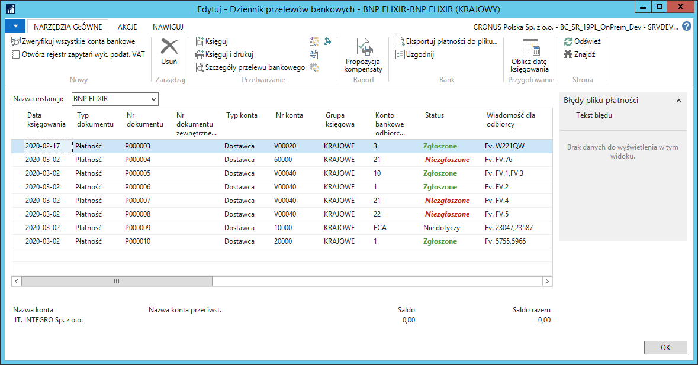{width="6.385416666666667in" height="3.341428258967629in"}
  ------------------------------------------------------------------------------------
  Rysunek 2.171: Dziennik przelewów bankowych

{width="0.19in" height="0.19in"}
**Uwaga:** Niezbędna jest weryfikacja wszystkich kont bankowych
powiązanych z generowanymi przelewami eksportowanymi do pliku. Próba
wygenerowania przelewów z niezweryfikowanymi kontami bankowymi zakończy
się błędem. W przypadku kont niezgłoszonych -- zostanie wyświetlony
stosowny komunikat, w którym należy potwierdzić tę operację.

Aby sprawdzić historię weryfikacji danego konta bankowego, należy
ustawić kursor w wybranym wierszu dziennika przelewów bankowych,
następnie należy na wstążce kliknąć **Otwórz rejestr zapytań wyk. podat.
VAT**.

#### Bankowość elektroniczna -- Zapisy rejestru polecenia przelewu {#bankowość-elektroniczna-zapisy-rejestru-polecenia-przelewu .Poziom-2}

### Informacje ogólne

W wyniku wyeksportowania przelewów do pliku utworzony zostaje rejestr
polecenia przelewu, w którego zapisach zachowana jest m.in. informacja
o statusie konta bankowego odbiorcy płatności w momencie generowania
przelewu. Można tam również znaleźć informacje o identyfikatorze żądania
weryfikacji, który został zwrócony podczas weryfikacji.

### Obsługa

W celu sprawdzenia szczegółów wygenerowanego polecenia przelewu, należy
wykonać następujące kroki:

1.  Należy wybrać **Działy \> Zarządzanie Finansami \> Bankowość
    elektroniczna \> Rejestry polecenia przelewu.**

2.  **W oknie Rejestry polecenia przelewu, które się otworzy, należy
    zaznaczyć wiersz z wybranym rejestrem i na wstążce należy kliknąć
    Zapisy.**

**W oknie Zapisy rejestru polecenie przelewu można przejrzeć informacje
związane z wygenerowanym przelewem.**

  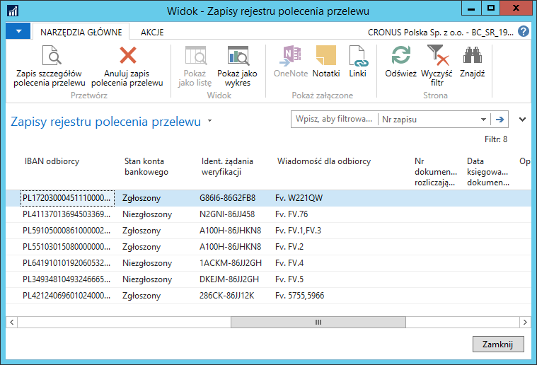{width="6.282413604549431in" height="4.270833333333333in"}
  ------------------------------------------------------------------------------------
  Rysunek 2.172: Zapisy rejestru polecenia przelewu

####  {#section-9 .list-paragraph .Poziom-2}

 Obsługa środków pieniężnych {#obsługa-środków-pieniężnych .Rozdzial}
===========================

2.  

 Zarządzanie kasą gotówkową {#zarządzanie-kasą-gotówkową .Poziom-1}
--------------------------

### Informacje ogólne

W obsłudze przepływu środków pieniężnych firmy ważna jest elastyczność
i bieżąca kontrola salda. Dlatego Polska Lokalizacja zawiera funkcję
**Zarządzanie kasą gotówkową**. Właściwe zdefiniowanie wszystkich
ustawień w ramach tej funkcjonalności zapewnia najbardziej optymalną
i dostosowaną do potrzeb użytkownika obsługę transakcji gotówkowych.

### Ustawienia

W pierwszej kolejności należy zdefiniować serię numeracji dla kartotek
kas. W tym celu należy postępować według następujących kroków:

1.  Należy wybrać **Działy \> Zarządzanie Finansami \> Administracja \>
    Ustawienia księgi głównej.**

2.  W oknie **Ustawienia księgi głównej**, które się otworzy, na karcie
    skróconej **Ogólne**, w polu **Seria numeracji kont kasowych**
    z listy rozwijanej należy wybrać kod wcześniej zdefiniowanej
    właściwej serii numeracji:

  {width="6.386801181102363in" height="5.495651793525809in"}
  ------------------------------------------------------------------------------------
  Rysunek 3.1: Seria numeracji kont kasowych

3.  W tym samym oknie, na karcie skróconej **Kasa** należy wprowadzić
    właściwe parametry. Są to parametry domyślne, obowiązujące
    dla wszystkich kont kasowych.

-   **Obowiązkowy raport kasowy** -- zaznaczenie tego pola powoduje
    > wymuszenie otworzenia raportu kasowego (dla każdego konta kasowego
    > oddzielnie) przed zaksięgowaniem jakiegokolwiek dokumentu
    > kasowego.

-   **Domyślny limit wypłaty gotówkowej (PLN)** -- w tym polu należy
    > wprowadzić domyślną maksymalną kwotę jednorazowej wypłaty gotówki
    > w walucie lokalnej. Kwota z tego pola domyślnie kopiowana jest
    > do właściwego pola w kartotekach kont kasowych w walucie lokalnej.

-   **Domyślny limit wpłaty gotówkowej (PLN)** -- w tym polu należy
    > wprowadzić domyślną maksymalną kwotę jednorazowej wpłaty gotówki
    > w walucie lokalnej. Kwota z tego pola domyślnie kopiowana jest
    > do właściwego pola w kartotekach kont kasowych w walucie lokalnej.

-   **Wyłącz z korekty kursu wymiany** -- zaznaczenie tego pola oznacza,
    > że zapisy w walucie obcej kont kasowych będą wykluczone z funkcji
    > **Koryguj kursy wymiany**. Informacja ta będzie kopiowana
    > do właściwego pola w kartotekach kont kasowych w walucie obcej.

  {width="6.384937664041995in" height="4.165216535433071in"}
  ------------------------------------------------------------------------------------
  Rysunek 3.2: Domyślne parametry kont kasowych

Kolejnym ustawieniem, jakie należy zdefiniować, jest grupa księgowa
do obsługi transakcji kasowych. W tym celu należy postępować
według następujących kroków:

1.  Należy wybrać **Działy \> Zarządzanie Finansami \> Administracja \>
    Grupy księgowe kont bankowych**.

2.  W oknie **Grupy księgowe kont bankowych**, które się otworzy,
    w pierwszym wolnym wierszu należy uzupełnić pole **Kod**, a w polu
    **Nr konta bankowego K/G** należy z listy rozwijanej wybrać konto
    K/G przeznaczone do księgowania transakcji gotówkowych.

3.  Opcjonalnie, dla wybranych grup księgowych, w polu **Nr konta
    tymczasowego K/G** można wybrać konto, które będzie używane jako
    środki pieniężne w drodze dla transakcji przeniesienia gotówki:

-   z jednego konta kasowego na inne konto kasowe,

-   z konta kasowego na konto bankowe,

-   z konta bankowego na konto kasowe.

> Pozostawienie tego pola pustego oznacza konieczność ręcznego wskazania
> konta środków pieniężnych w drodze podczas ewidencji transferu gotówki
> w ww. transakcjach.

  {width="5.633858267716535in" height="4.094488188976378in"}
  ------------------------------------------------------------------------------------
  Rysunek 3.3: Grupy księgowe kont bankowych

W ramach funkcjonalności **Zarządzanie kasą gotówkową** można też
zdefiniować nominały pieniężne dla każdej waluty oddzielnie.

W celu zdefiniowania nominałów pieniężnych dla waluty lokalnej, należy
postępować według następujących kroków:

1.  Należy wybrać **Działy \> Zarządzanie Finansami \> Administracja \>
    > Ustawienia księgi głównej.**

2.  W oknie **Ustawienia księgi głównej**, które się otworzy, należy
    > wybrać **Nominały pieniężne.**

3.  W oknie **Nominały pieniężne**, które się otworzy, należy wprowadzić
    > tyle wierszy, ile jest nominałów monet i banknotów waluty
    > lokalnej:

  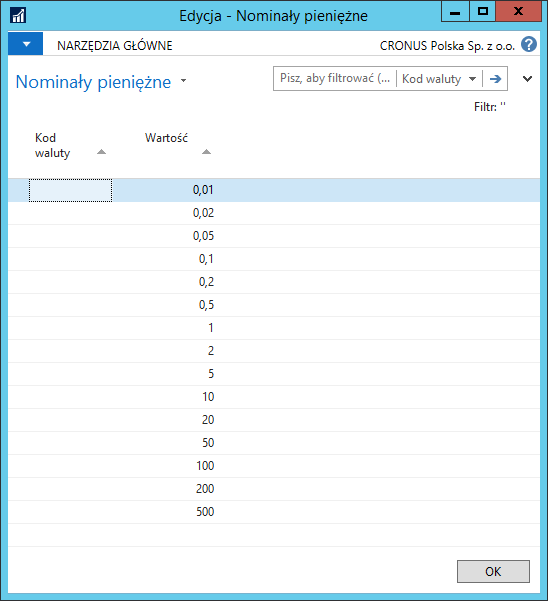{width="4.610236220472441in" height="5.05511811023622in"}
  -----------------------------------------------------------------------------------
  Rysunek 3.4: Nominały waluty lokalnej

W celu zdefiniowania nominałów pieniężnych dla waluty obcej, należy
postępować według następujących kroków:

1.  Należy wybrać **Działy \> Zarządzanie Finansami \> Działania
    > okresowe \> Waluta \> Waluty.**

2.  W oknie **Waluty**, które się otworzy, należy ustawić kursor
    > w wierszu z wybraną walutą i wybrać **Nominały pieniężne.**

3.  W oknie **Nominały pieniężne**, które się otworzy, należy wprowadzić
    > tyle wierszy, ile jest nominałów monet i banknotów waluty
    > lokalnej:

  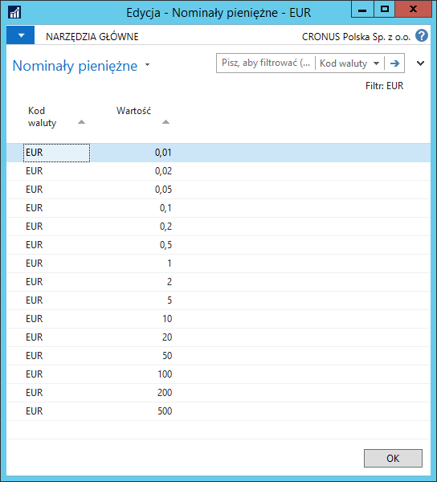{width="4.574803149606299in" height="5.047244094488189in"}
  ------------------------------------------------------------------------------------
  Rysunek 3.5: Nominały waluty obcej

Ostatnią niezbędną czynnością jest zdefiniowanie trzech nowych serii
numeracyjnych, które będą używane do numerowania dokumentów:

-   Wpłat gotówkowych

-   Wypłat gotówkowych

-   Raportów kasowych

> {width="0.19in" height="0.19in"}
> **Uwaga:** Serie numeracyjne dokumentów powinny być zdefiniowane
> dla każdego konta kasowego oddzielnie. Ułatwi to kontrolę i nawigację
> transakcji.

### Obsługa

I.  **Zakładanie kartoteki kasy**

W celu utworzenia kartoteki kasy, należy postępować według następujących
kroków:

1.  Należy wybrać **Działy \> Zarządzanie Finansami \> Zarządzanie kasą
    gotówkową \> Kasy.**

2.  W oknie **Kasy**, które się otworzy, należy wybrać **Nowe**.
    W wyniku tego działania utworzona zostanie kartoteka kasy
    z częściowo uzupełnionymi danymi na podstawie domyślnych ustawień
    opisanych wcześniej.

3.  W kartotece nowej kasy konieczne jest uzupełnienie niektórych pól,
    a niektóre z nich mogą zostać uzupełnione w celach informacyjnych.

```{=html}
<!-- -->
```
1)  Na karcie skróconej **Ogólne:**

-   Pole **Nr** wypełniane jest automatycznie zgodnie z wybraną serią
    > numeracji

-   W polu **Nr kasjera** z listy rozwijanej można wybrać wcześniej
    > zdefiniowanego pracownika, który obsługuje daną kasę. Jest to pole
    > wyłącznie informacyjne, nie ma obowiązku jego uzupełniania.

-   Podobnie nazwa, dane adresowe oraz komunikacyjne (na karcie
    > skróconej **Komunikacja**) -- te pola również pełnią rolę
    > wyłącznie informacyjną, mogą pozostać puste.

2)  Na karcie skróconej **Księgowanie** są bardzo ważne pola,
    które muszą być odpowiednio wypełnione.

-   W polu **Grupa księgowa kasy** należy wybrać kod grupy powiązanej
    > z właściwym kontem K/G

-   W polu **Kod waluty** należy wybrać walutę, w jakiej będą
    > realizowane transakcje w tej kasie

```{=html}
<!-- -->
```
-   W polach: **Seria numeracji dokumentów kasowych wpłaty**, **Seria
    > numeracji dokumentów kasowych wypłaty** i **Seria numeracji
    > raportów kasowych** należy z list rozwijanych wybrać wcześniej
    > zdefiniowane serie numeracji dla dokumentów księgowanych w danej
    > kasie

-   Pole **Wyłącz z korekty kursu wymiany** wypełniane jest
    > automatycznie przez system domyślną, wcześniej ustawioną
    > wartością, ale może zostać ręcznie zmienione dla tej jednej
    > konkretnej kasy. Znaczenie tego pola zostało opisane wcześniej --
    > przy definiowaniu domyślnych ustawień.

3)  Na karcie skróconej Limity**:**

-   W polu **Kontrola limitu salda** należy wybrać jedną z opcji:

```{=html}
<!-- -->
```
-   **Brak** -- Saldo nie będzie kontrolowane

-   **Minimum** -- System będzie kontrolował tylko saldo minimalne,
    > czyli nie dopuści do osiągnięcia salda poniżej poziomu określonego
    > w polu **Saldo minimalne.**

-   **Maksimum** -- System będzie kontrolował tylko saldo maksymalne,
    > czyli nie dopuści do osiągnięcia salda powyżej poziomu określonego
    > w polu **Saldo maksymalne.**

-   **Obie** -- System będzie kontrolował saldo minimalne i maksymalne,
    > czyli nie dopuści do osiągnięcia salda poniżej poziomu określonego
    > w polu **Saldo minimalne** i powyżej poziomu określonego w polu
    > **Saldo maksymalne**.

```{=html}
<!-- -->
```
-   Pola: **Limit wpłaty gotówkowej** i **Limit wypłaty gotówkowej**
    > wypełniane są automatycznie przez system na podstawie domyślnych
    > ustawień. Możliwa jest ręczna zmiana tych wartości bezpośrednio
    > w kartotece nowej kasy. W polach tych ustalane są limity
    > dla jednorazowej transakcji wpłaty lub wypłaty gotówkowej
    > rejestrowanej w danej kasie.

-   Pola: **Saldo dokumentu kasowego** i Saldo **dokumentu kasowego
    > (PLN)** są nieedytowalne, wypełniane automatycznie przez system
    > i przedstawia sumę kwot z niezaksięgowanych dokumentów kasowych.

  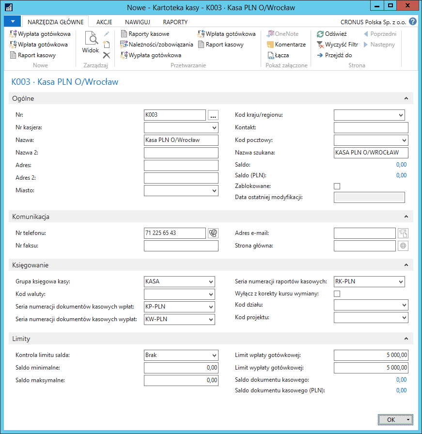{width="6.4in" height="6.583931539807524in"}
  ----------------------------------------------------------------------
  Rysunek 3.6: Kartoteka kasy

II. **Ewidencja dokumentów kasowych**

W kasie ewidencjonowane są dwa rodzaje transakcji: wpłaty i wypłaty
gotówki. Obydwa rodzaje transakcji mogą być wprowadzane dwoma sposobami:
z poziomu menu głównego i z poziomu kartoteki kasy.

> {width="0.19in" height="0.19in"}
> **Uwaga:** W sytuacji, gdy podczas konfiguracji modułu Zarządzanie
> kasą gotówkową zdefiniowano obowiązek tworzenia raportów kasowych,
> przed zarejestrowaniem pierwszej operacji w kasie konieczne jest
> otworzenie raportu kasowego. Procedura tworzenia raportu kasowego
> opisana jest w dalszej części tego rozdziału.

W celu wprowadzenia dokumentu wpłaty (wypłaty) gotówkowej z poziomu
kartoteki kasy, należy postępować według następujących kroków:

1.  Należy wybrać **Działy \> Zarządzanie Finansami \> Zarządzanie kasą
    > gotówkową \> Kasy**. Wybraną kasę należy otworzyć w formie
    > kartoteki.

2.  W kartotece wybranej kasy należy wybrać **Wpłata gotówkowa**
    > (**Wypłata gotówkowa**)**.** Z listy kas, która się otworzy,
    > należy wybrać właściwą.

W celu wprowadzenia dokumentu wpłaty (wypłaty) gotówkowej z poziomu menu
głównego, należy postępować według następujących kroków:

1.  Należy wybrać **Działy \> Zarządzanie Finansami \> Zarządzanie kasą
    > gotówkową \> Wpłaty gotówkowe** (**Wypłaty gotówkowe**).

2.  W oknie **Wpłaty gotówkowe** (**Wypłaty gotówkowe**), które się
    > otworzy, należy wybrać **Nowe.** Z listy kas, która się otworzy,
    > należy wybrać właściwą.

Dalsza obsługa jest taka sama dla dokumentów kasowych, niezależnie
od sposobu ich wprowadzenia:

3.  W oknie **Wpłata gotówkowa** (**Wypłata gotówkowa**) część pól
    wypełniona jest automatycznie.

```{=html}
<!-- -->
```
1)  Na karcie skróconej **Ogólne**:

-   Pole **Nr** uzupełniane jest automatycznie, zgodnie z przypisaną
    > wcześniej serią numeracji

-   W polu **Nazwa odbiorcy płatności/płatnika** można wpisać imię
    > i nazwisko osoby wpłacającej lub odbierającej gotówkę.

-   Pole **Kod waluty** wypełniane jest automatycznie przez system kodem
    > waluty przypisanym do kartoteki konta kasy. Pod przyciskiem asysty
    > edycji obok tego pola otwiera się okno **Zmiana kursu wymiany**,
    > w którym w polu **Relacyjny kurs wymiany** wstawiony jest domyślny
    > kurs pobrany z okna **Kursy wymiany walut** dla danej waluty.
    > W razie potrzeby, kurs ten może być ręcznie zmieniony w danym
    > dokumencie kasowym.

-   Pola **Kwota i Kwota (PLN)** są nieedytowalne. W polach tych
    > prezentowana jest suma wartości danego dokumentu kasowego, zarówno
    > w walucie źródłowej, jak i w przeliczeniu na walutę lokalną.

-   W polach **Data księgowania, Data dokumentu** i **Data obowiązku
    > VAT** system automatycznie wstawia datę roboczą, można ręcznie
    > zmienić te daty na inne.

-   Zaznaczenie pola **Korekta** spowoduje zaksięgowanie transakcji
    > na kontach KG po przeciwnej stronie z minusem (jako tzw. storno
    > czerwone).

-   Pole **Nr raportu kasowego** pozostaje puste w sytuacji, gdy pole
    > **Obowiązkowy raport kasowy** w oknie **Ustawienia księgi
    > głównej** jest niezaznaczone. W przeciwnym wypadku raport kasowy
    > musi być otwarty przed rozpoczęciem wprowadzania dokumentów
    > kasowych. W takiej sytuacji, pole **Nr raportu kasowego** będzie
    > uzupełniane automatycznie przez system, zgodnie z wybraną seria
    > numeracyjną.

-   Pole **Liczba wydruków** jest nieedytowalne, wypełniane
    > automatycznie przez system.

2)  Na karcie skróconej **Wymiary** można wprowadzić wartości wymiarów
    globalnych, zgodnie z ustalonymi regułami księgowania wymiarów.
    Wartości wymiarów dodatkowych można wprowadzić w oknie **Edytuj
    zapisy zestawu wymiarów** otwieranym poprzez wybranie **Nawiguj \>
    Wymiary**.

3)  Na karcie skróconej **Podformularz wpłaty gotówkowej**
    (**Podformularz wypłaty gotówkowej**) należy wprowadzić szczegółowe
    dane transakcji:

-   W polu **Typ konta** należy wybrać typ konta jako konto
    > przeciwstawne do konta kasy w księgowanej transakcji.

-   W polu **Nr konta** należy wybrać z listy rozwijanej konto
    > przeciwstawne do konta kasy w księgowanej transakcji. Lista kont
    > jest zgodna z typem wybranym w polu **Typ konta**.

-   Pole **Typ dokumentu** jest uzupełniane automatycznie przez system
    > na podstawie wprowadzonych parametrów.

-   Pole **Grupa księgowa** wypełniane jest automatycznie przez system
    > kodem domyślnie wybranym w kartotekach kont ksiąg pomocniczych.
    > Kod grupy księgowej może być ręcznie zmieniony zgodnie z zasadami
    > funkcjonalności **Zastępcze grupy księgowe.**

-   W polach **Typ dokumentu rozliczającego** i **Nr dokumentu
    > rozliczającego** można wybrać typ i numer dokumentu, z jakim
    > zostanie rozliczona księgowana transakcja gotówkowa.

> Użycie tych pól jest możliwe wyłącznie dla wybranych typów kont:
> **Nabywca** lub **Dostawca** i ma odniesienie wyłącznie do jednego
> dokumentu rozliczającego.
>
> W celu rozliczenia większej ilości dokumentów, należy wybrać **Funkcje
> \> Rozlicz zapisy**. Dalsza procedura rozliczania dokumentów jest
> standardowa.

-   Do pola **Opis** kopiowana jest nazwa konta, ale treść opisu może
    > zostać ręcznie zmieniona.

-   W polu **Kwota** należy wprowadzić kwotę transakcji, a na tej
    > podstawie system uzupełni pole **Kwota (PLN)**: dla transakcji
    > w walucie lokalnej będzie to ta sama kwota, a dla transakcji
    > w walucie obcej będzie to kwota przeliczona zgodnie z kursem
    > wymiany walut obowiązującym dla daty księgowania transakcji.

-   Pole **Wstrzymany** ma standardową obsługę. Wypełnienie tego pola ma
    > znaczenie tylko przy zapisach księgi nabywców i dostawców --
    > zapisy wstrzymane są pomijane przy sugerowaniu płatności.

  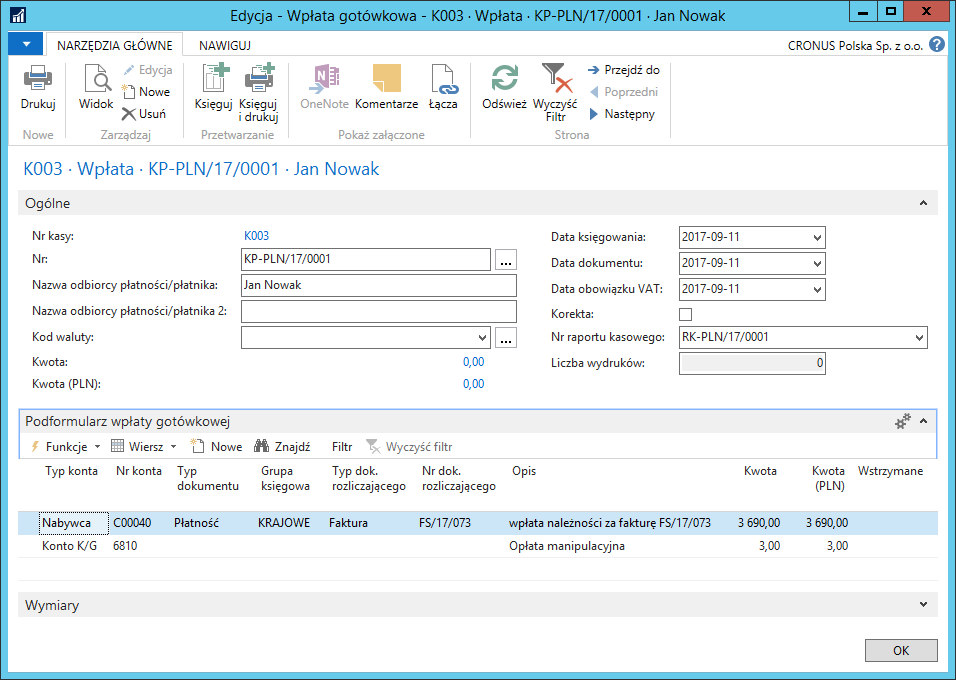{width="6.365217629046369in" height="4.527057086614173in"}
  ------------------------------------------------------------------------------------
  Rysunek 3.7: Wpłata gotówkowa

W następnym kroku należy wybrać **Księguj lub Księguj i drukuj**

> Podczas księgowania dokumentów kasowych system dokonuje kontroli:

1)  Czy saldo kasy po zaksięgowaniu mieści się w ustawionych limitach

2)  Czy kwota wpłaty (wypłaty) mieści się w ustawionych limitach

Po zaksięgowaniu dokumentów kasowych można wydrukować zaksięgowane
dokumenty. W tym celu należy postępować według następujących kroków:

1.  Należy wybrać **Działy \> Zarządzanie Finansami \> Zarządzanie kasą
    > gotówkową \> Zaksięgowane wpłaty gotówkowe** (**Zaksięgowane
    > wypłaty gotówkowe**).

2.  W oknie z listą zaksięgowanych dokumentów kasowych należy
    > podświetlić wiersz z wybraną zaksięgowaną wpłatą gotówkową
    > (zaksięgowaną wypłatą gotówkową) i wybrać **Drukuj zaksięgowane
    > wpłaty gotówkowe** (**Drukuj zaksięgowane wypłaty gotówkowe**).

> Opcjonalnie można wybraną zaksięgowaną wpłatę gotówkową (zaksięgowaną
> wypłatę gotówkową) otworzyć w formie kartoteki i tam wybrać
> **Drukuj**.

3.  W oknie wstępnym raportu, które się otworzy, można zmienić filtry
    > wstawione domyślnie przez system a następnie wybrać **Drukuj**
    > lub **Podgląd**.

  {width="6.391082677165354in" height="6.434782370953631in"}
  ------------------------------------------------------------------------------------
  Rysunek 3.8: Wydruk wpłaty gotówkowej

III. **Tworzenie raportów kasowych**

Raporty kasowe są zestawieniem dokumentów kasowych z wybranego okresu.
W celu utworzenia raportu kasowego należy postępować
według następujących kroków:

1.  Należy wybrać **Działy \> Zarządzanie Finansami \> Zarządzanie kasą
    gotówkową \> Raporty kasowe**.

2.  W oknie **Raporty kasowe**, które się otworzy, widać wszystkie
    dotychczas utworzone raporty kasowe, zarówno te ze stanem
    **Otwarty**, jak i **Zamknięty**.

W sytuacji, gdy, zgodnie z wcześniej zdefiniowanymi ustawieniami, raport
kasowy jest obowiązkowy, dalsza procedura jest następująca:

1.  Należy wybrać **Nowe**, a z listy kas, która się otworzy, należy
    wybrać właściwą.

2.  W oknie **Raport kasowy**, które się otworzy, na karcie skróconej
    > **Ogólne**, część pól jest automatycznie uzupełniona, niektóre
    > z nich można zmienić.

  {width="6.4in" height="5.923418635170604in"}
  ----------------------------------------------------------------------
  Rysunek 3.9: Kartoteka raportu kasowego

-   W polu **Nr** jest wstawiany automatycznie numer kolejny raportu
    > kasowego, zgodny z wcześniej zdefiniowana serią numeracji.

-   W polu **Data otwarcia** wstawiana jest automatycznie data robocza,
    > ale można ją ręcznie zmienić na inną.

-   W polu **Data zamknięcia** wstawiana jest automatycznie data robocza
    > w momencie zmiany stanu na **Zamknięty**.

-   Pola: **Saldo początkowe** i **Saldo początkowe (PLN)**
    > są nieedytowalne i prezentują saldo (w walucie przypisanej
    > do wybranego konta kasowego oraz walucie lokalnej) wybranego konta
    > kasy w chwili otwierania raportu kasowego.

-   Pola: **Obroty netto** i **Obroty netto (PLN)** są nieedytowalne
    > i prezentują sumę obrotów (w walucie przypisanej do wybranego
    > konta kasowego oraz walucie lokalnej) wybranego konta kasy
    > w bieżącym raporcie kasowym.

-   Pola: **Saldo końcowe** i **Saldo końcowe (PLN)** są nieedytowalne
    > i prezentują saldo końcowe (w walucie przypisanej do wybranego
    > konta kasowego oraz walucie lokalnej) wybranego konta kasy
    > w bieżącym raporcie kasowym obliczone jako suma salda początkowego
    > i obrotów netto.

-   Pole **Kod waluty** jest nieedytowalne i prezentuje kod waluty
    > przypisany do konta kasy, dla którego utworzony jest bieżący
    > raport kasowy.

-   Pole **Stan** może mieć opcję:

```{=html}
<!-- -->
```
-   **Otwarty** -- edycja raportu kasowego jest dozwolona

-   **Zamknięty** -- edycja raportu kasowego nie jest dozwolona.

> Opcja w polu **Stan** zmieniana jest poprzez wybranie **Zamknij**
> lub **Otwórz ponownie**.

-   Pole **Nominał kwoty** wyświetla kwotę -- sumę wartości nominałów
    > pieniężnych, które są ręcznie przypisywane do danego raportu
    > kasowego. Celem tej czynności jest określenie ilości monet
    > i banknotów o określonych nominałach w momencie zamykania raportu
    > kasowego.

> W celu wprowadzenia nominałów, należy kliknąć w polu **Nominał
> kwoty**. Otworzy się okno **Specyfikacja nominału**, w którym należy
> wybrać **Edytuj listę**, a następnie, w polu **Ilość** należy
> wprowadzić odpowiednią ilość monet lub banknotów w wierszach
> z odpowiednimi nominałami (nominały odpowiadają nominałom
> zdefiniowanym dla waluty przypisanej do konta kasy, dla
> którego tworzony jest raport kasowy):

  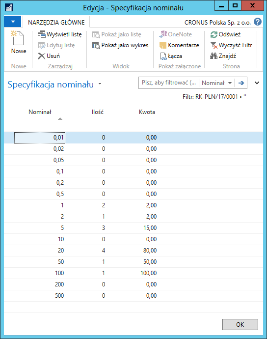{width="4.590551181102362in" height="5.822834645669292in"}
  ------------------------------------------------------------------------------------
  Rysunek 3.10: Specyfikacja nominału

-   Na karcie skróconej **Podformularz raportu kasowego**, w oknie
    > **Raport kasowy** wszystkie pola są nieedytowalne. Wiersze raportu
    > kasowego wypełniane są zaksięgowanymi dokumentami kasowymi

3.  Ostatnim krokiem w tworzeniu raportu kasowego jest zmiana jego stanu
    na **Zamknięty**. W tym celu należy wybrać **Zamknij**. System
    zmieni stan raportu kasowego na **Zamknięty** i zablokuje edycję.

4.  W sytuacji, gdy konieczne jest naniesienie zmian w raporcie (dodanie
    do niego kolejnych dokumentów kasowych), należy zmienić stan raportu
    poprzez wybranie w jego kartotece **Otwórz ponownie**.

> {width="0.19in" height="0.19in"}
> **Uwaga:** Dla jednego konta kasy w tym samym czasie może być otwarty
> tylko jeden raport kasowy. Przed ponownym otworzeniem zamkniętego
> raportu kasowego, należy tymczasowo zamknąć otwarty raport kasowy
> (jeżeli jest taki).

5.  Jeżeli w ustawieniach nie został zdefiniowany obowiązek tworzenia
    > raportów kasowych, wiersze raportu kasowego mogą zostać wstawione
    > poprzez wybranie **Sugeruj wiersze** w kartotece raportu kasowego.
    > W oknie, które się otworzy należy podać parametry precyzujące
    > zakres dokumentów kasowych, które mają zostać pobrane do raportu
    > kasowego.

6.  W celu wydrukowania raportu kasowego, należy wybrać **Drukuj**
    > w kartotece wybranego raportu kasowego lub na liście raportów
    > kasowych po zaznaczeniu wiersza z wybranym raportem. Następnie
    > należy wybrać **Drukuj** lub **Podgląd**:

  {width="6.365217629046369in" height="7.423367235345582in"}
  ------------------------------------------------------------------------------------
  Rysunek 3.11: Wydruk raportu kasowegO

IV. **Księgowanie transakcji kasowych**

Większość operacji księgowanych przez dokumenty (raporty) kasowe ma ten
sam skutek, jak transakcje księgowane przez dzienniki główne.
Specyficznymi transakcjami gotówkowymi, które mogą być zaksięgowane
w inny sposób, niż standardowy, są przekazania gotówki na inne konta
kasowe lub bankowe.

Standardowo, w przypadku wpłaty gotówki do kasy z innego konta kasowego
lub bankowego, należy zaksięgować dokument **Wpłata gotówkowa**, w
którego wierszach wskazane jest konto K/G „Środki pieniężne w drodze".
W przypadku wypłaty gotówki z kasy na inne konto kasowe lub bankowe,
należy zaksięgować dokument **Wypłata gotówkowa**, w którego wierszach
wskazane jest konto K/G „Środki pieniężne w drodze".

W celu zarejestrowania operacji transferu gotówki pomiędzy kontami
kasowymi i/lub kontami bankowymi z wykorzystaniem funkcjonalności
związanej z kontem tymczasowym wybranym w polu **Nr konta tymczasowego
K/G** w oknie **Grupy księgowe kont bankowych**, należy postępować
według następujących kroków:

1.  Należy wybrać **Działy \> Zarządzanie Finansami \> Zarządzanie kasą
    > gotówkową \> Wpłaty gotówkowe** (**Wypłaty gotówkowe**).

2.  W oknie **Wpłaty gotówkowe** (**Wypłaty gotówkowe**), które się
    > otworzy, należy wybrać **Nowe.** Z listy kas, która się otworzy,
    > należy wybrać właściwą.

3.  Pola w kartach skróconych **Ogólne** i **Wymiary** należy wypełnić
    standardowo, zgodnie z opisem zamieszczonym we wcześniejszej części
    tego rozdziału.

4.  Na karcie skróconej **Podformularz wpłaty gotówkowej**
    (**Podformularz wypłaty gotówkowej**) należy uzupełnić pola:

-   **Typ konta** -- z listy rozwijanej należy wybrać opcję **Konto
    > bankowe**

-   **Nr konta** -- z listy rozwijanej należy wybrać konto bankowe, z
    > którego gotówka jest transferowana (w przypadku wpłaty gotówkowej)
    > lub na które gotówka jest transferowana (w przypadku wypłaty
    > gotówkowej).

-   **Kwota** -- należy wprowadzić kwotę transferowanej gotówki
    > w walucie przypisanej do konta kasy.

-   **Opis** -- pole domyślnie uzupełniane jest nazwa wybranego konta,
    > w razie potrzeby można ręcznie zmienić treść opisu.

5.  Dokument kasowy należy zaksięgować wybierając **Księguj**.

  {width="6.382608267716535in" height="4.493056649168854in"}
  ------------------------------------------------------------------------------------
  Rysunek 3.12: Dokument kasowy -- transfer gotówki

Zapisy na kontach K/G utworzone na podstawie zaksięgowanego dokumentu
kasowego obejmują m.in. konto ustawione jako **Nr konta tymczasowego
K/G** dla grup księgowych kont bankowych (definiowanie grup księgowych
kont bankowych zostało opisane we wcześniejszej części tego rozdziału).
W celu sprawdzenia zapisów księgowych, należy postępować
według następujących kroków:

1.  Należy wybrać **Działy \> Zarządzanie Finansami \> Zarządzanie kasą
    gotówkową \> Zaksięgowane Wpłaty gotówkowe** (**Zaksięgowane Wypłaty
    gotówkowe**).

```{=html}
<!-- -->
```
2.  W oknie z listą zaksięgowanych wpłat gotówkowych (zaksięgowanych
    > wypłat gotówkowych), które się otworzy, należy zaznaczyć wiersz
    > z wybranym zaksięgowanym dokumentem kasowym i wybrać **Nawiguj.**

3.  W oknie **Nawiguj**, które się otworzy, należy zaznaczyć wiersz
    > **Zapis K/G** i wybrać **Pokaż powiązane zapisy**.

4.  W oknie **Zapisy K/G** należy zwrócić uwagę na numery kont
    > księgowych użytych w transakcji -- jest między innymi konto
    > ustawione jako tymczasowe dla grup księgowych kont bankowych.

  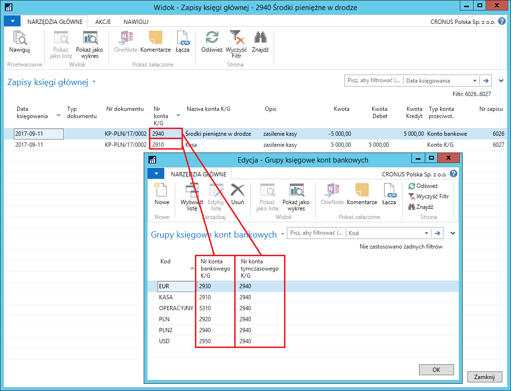{width="6.382608267716535in" height="4.89265091863517in"}
  -----------------------------------------------------------------------------------
  Rysunek 3.13: Zapisy K/G -- transfer gotówki

 {#section-10 .list-paragraph .Poziom-1}

Dziennik wyciągów bankowych {#dziennik-wyciągów-bankowych .Poziom-1}
---------------------------

### Informacje ogólne

> W obsłudze przepływu środków pieniężnych firmy ważna jest elastyczność
> i bieżąca kontrola salda. W celu zapewnienia sprawnej obsługi
> rejestracji operacji bankowych, Polska Lokalizacja została wyposażona
> w **Dziennik wyciągów bankowych**. Właściwe zdefiniowanie wszystkich
> ustawień w ramach tej funkcjonalności zapewnia najbardziej optymalną
> i dostosowaną do potrzeb użytkownika ewidencję transakcji na kontach
> bankowych.

### Ustawienia

> Żeby możliwe było korzystanie z funkcjonalności **Dziennik wyciągów
> bankowych**, konieczne jest zdefiniowanie szablonów i (opcjonalnie)
> instancji dziennika głównego dla każdego konta bankowego oddzielnie.
> W tym celu należy postępować według następujących kroków:

1.  Należy wybrać **Działy \> Zarządzanie Finansami \> Administracja \>
    Szablony dzienników głównych**

2.  W oknie, które się otworzy, należy wybrać **Nowe**.

3.  W nowym wierszu należy wprowadzić parametry szablonu dziennika
    przeznaczonego do księgowania wyciągów bankowych konkretnego konta
    bankowego. Większość pól należy uzupełnić w sposób standardowy,
    a charakterystyczne dla tego typu dokumentów są pola:

-   **Typ** -- z listy rozwijanej należy wybrać **Wpłaty gotówkowe**

-   **Typ konta przeciwst.** -- z listy rozwijanej należy wybrać **Konto
    > bankowe**

-   **Nr konta przeciwst.** -- z listy rozwijanej należy wybrać
    > wcześniej zdefiniowane konto bankowe, z którego wyciągi bankowe
    > będą księgowane przy użyciu tego szablonu dziennika głównego

-   **Seria numeracji** -- z listy rozwijanej należy wybrać wcześniej
    > zdefiniowaną serię numeracji, która będzie miała zastosowanie
    > dla nadawania kolejnych numerów księgowanym wyciągom bankowym
    > z wybranego konta bankowego

-   **Seria numeracji księgowania** -- pole należy pozostawić puste.

-   **Identyfikator strony -- w tym polu należy wprowadzić numer
    > 52063175**

  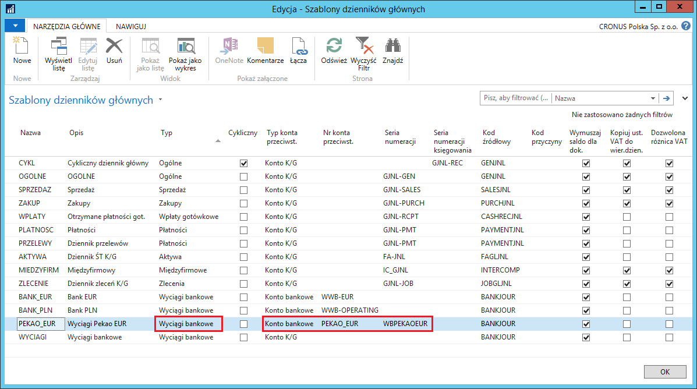{width="6.4in" height="3.571281714785652in"}
  ----------------------------------------------------------------------
  Rysunek 3.14: szablon dziennika głównego

Definiowanie instancji dziennika głównego do szablonu typu **Wyciąg
bankowy** odbywa się w sposób standardowy, tzn. część pól skopiowana
jest z szablonu dziennika (m.in. typ i numer konta przeciwstawnego
oraz serie numeracji) oraz część pól jest wypełniona domyślnie (m.in.
nazwa i opis instancji). Możliwe jest ręczne dokonanie niezbędnych zmian
w domyślnych instancjach i ręczne definiowanie kolejnych instancji.
W tym celu należy otworzyć okno **Instancje dziennika głównego** poprzez
wybranie **Instancje** dla zaznaczonego wiersza z wybranym szablonem
dziennika:

  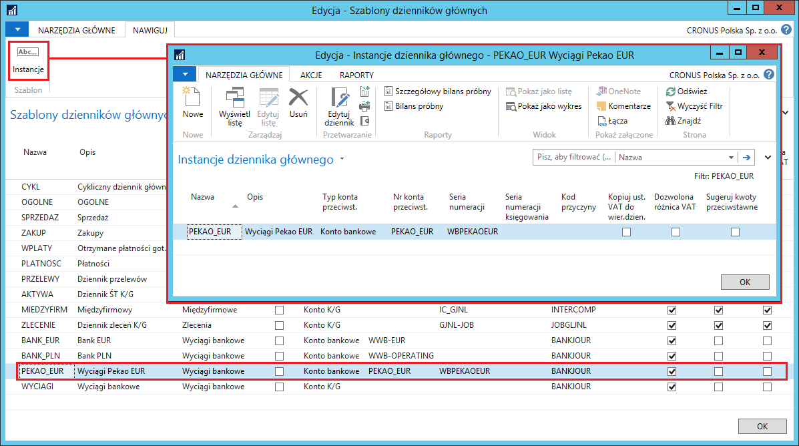{width="6.391303587051619in" height="3.5664293525809274in"}
  -------------------------------------------------------------------------------------
  Rysunek 3.15: Instancje dziennika głównego

### Obsługa

### W celu wprowadzenia i zaksięgowania wyciągu bankowego, należy postępować według następujących kroków:

1.  Należy wybrać **Działy \> Zarządzanie Finansami \> Zarządzanie
    środkami pieniężnymi \> Dziennik wyciągów bankowych.**

2.  W oknie **Lista szablonów dziennika gł.**, które się otworzy, należy
    wybrać jeden z wcześniej zdefiniowanych szablonów dziennika.

3.  W oknie **Dziennik wyciągów bankowych**, które się otworzy,
    w kolejnych wierszach należy wprowadzić kolejne pozycje wyciągu
    bankowego, wypełniając pola odpowiednimi danymi:

-   **Data księgowania** -- data, z jaką zostanie zaksięgowany wyciąg
    > bankowy -- system wstawia domyślnie datę bieżącą, którą można
    > ręcznie zmienić na inną.

-   **Typ dokumentu** -- z listy rozwijanej można wybierać spośród 2
    > opcji:

```{=html}
<!-- -->
```
-   **Płatność** (od nabywcy lub dla dostawcy)

-   **Zwrot** (do nabywcy lub od dostawcy)

> Pole może pozostać puste.

-   **Nr dokumentu** -- pole wypełnione automatycznie przez system
    > numerem kolejnym zgodnym z przypisaną do dziennika serią
    > numeracji.

-   **Typ konta** -- z listy rozwijanej należy wybrać typ konta
    > przeciwstawnego wobec konta bankowego w danej transakcji bankowej

-   **Nr konta -- z **listy rozwijanej należy wybrać numer konta
    > przeciwstawnego wobec konta bankowego w danej transakcji bankowej.
    > Konta wyświetlone na liście są zgodne z typem wybranym w polu
    > **Typ konta**.

-   **Grupa księgowa** -- pole uzupełnia się automatycznie domyślną
    > grupą księgową przypisaną do wybranego w tym wierszu nabywcy
    > lub dostawcy. W razie potrzeby, kod grupy księgowej może zostać
    > zmieniony na inny zgodnie z regułami ustawionymi dla zastępczych
    > grup księgowych.

> Więcej o definiowaniu i obsłudze zastępczych grup księgowych można
> przeczytać w rozdziale **Wiele kont należności/zobowiązań.**

-   **Opis** -- pole uzupełnia się automatycznie nazwą wybranego konta.
    > Treść opisu należy ręcznie zmienić na odpowiednią dla wprowadzanej
    > transakcji.

-   **Kod waluty --** pole uzupełnia się automatycznie kodem waluty
    > przypisanym do kartoteki konta bankowego i domyślnie przypisywane
    > jest do transakcji wprowadzanych w dzienniku wyciągów bankowych
    > danego konta bankowego. Kodu waluty w tym polu nie można zmieniać.

> Wyjątek stanowi dziennik wyciągów bankowych dla konta bankowego
> z domyślnym pustym kodem waluty -- w wierszach takiego dziennika
> dozwolone jest przypisywanie wszystkich kodów walut.

-   **Kwota -- w **tym polu należy wprowadzić kwotę transakcji w walucie
    > wybranej w polu **Kod waluty.**

-   **Kwota (PLN) -- w **tym polu system wstawi kwotę w walucie
    > lokalnej, stanowiącą równowartość kwoty w walucie, obliczoną
    > na podstawie właściwego kursu wymiany waluty pobranego z wcześniej
    > uzupełnionej tabeli.

> {width="0.19in" height="0.19in"}
> **Uwaga:** W sytuacji, gdy kwota wyliczona w polu **Kwota (PLN)** jest
> niewłaściwa, można ją poprawić dwoma sposobami: 1) zmienić ręcznie
> kwotę w polu **Kwota (PLN)** na właściwą, wtedy system dokona
> rekalkulacji kursu wymiany waluty; 2) zmienić kurs wymiany waluty
> w tym konkretnym wierszu dziennika wyciągów bankowych, wtedy system
> dokona rekalkulacji kwoty w polu **Kwota (PLN)**.

-   **Nr dok. rozliczającego** -- pole jest aktywne wtedy, gdy w polach
    > **Typ konta** i **Numer konta** wybrany jest nabywca lub dostawca.
    > Lista rozwijana w tym polu wyświetla nierozliczone dokumenty
    > kontrahenta, spośród których należy wybrać jeden, który będzie
    > rozliczony z transakcją w wierszu dziennika wyciągów bankowych.

-   **Rozliczone automatycznie** -- pole wypełniane po wybraniu
    > **Rozlicz automatycznie**, jeżeli w wyniku użycia tej funkcji
    > system znalazł i zasugerował otwarty zapis księgi nabywcy/dostawcy
    > do rozliczenia z daną pozycją wyciągu bankowego.

-   **Rozliczony (Tak/Nie)** -- pole wypełniane automatycznie
    > po połączeniu danej pozycji wyciągu bankowego z otwartym zapisem
    > księgi nabywcy/dostawcy.

4.  W sytuacji, gdy w jednym wierszu dziennika wyciągów bankowych
    rozliczanych jest więcej niż jeden dokumentów nabywcy lub dostawcy,
    należy wybrać **Rozlicz zapisy**.

5.  W oknie **Rozlicz zapisy nabywcy**, które się otworzy, należy
    zaznaczyć wszystkie wiersze z dokumentami, które mają być
    rozliczone, a następnie należy wybrać **Ustaw id. rozliczenia**,
    a następnie **OK.**

Podczas wprowadzania wierszy w dzienniku wyciągów bankowych, jak również
po zakończeniu tego procesu, możliwa jest bieżąca kontrola salda konta
bankowego. Umożliwiają to pola w dzienniku wyświetlone bezpośrednio pod
wierszami. Pola są zgrupowane w 2 kolumny dla konta bankowego w walucie
obcej i w 1 kolumnę dla konta bankowego w walucie lokalnej:

-   **Kod waluty** -- jest to kod waluty, w jakiej są wyświetlone kwoty
    > w polach poniżej.

-   **Bieżące saldo konta bankowego** -- jest to saldo konta bankowego
    > pochodzące z zaksięgowanych dotychczas zapisów (saldo początkowe
    > wyciągu bankowego).

-   **Saldo wiersza dziennika** -- jest to kwota skalkulowana poprzez
    > zsumowanie salda początkowego z pola **Bieżące saldo konta
    > bankowego** z sumą kwot wprowadzonych w polu **Kwota** (lub
    > **Kwota (PLN)**) do bieżącego wiersza włącznie (wiersza, w którym
    > ustawiony jest kursor).

-   **Saldo razem -** -- jest to kwota skalkulowana poprzez zsumowanie
    > salda początkowego z pola **Bieżące saldo konta bankowego** z sumą
    > kwot wprowadzonych w polu **Kwota** (lub **Kwota (PLN)**)
    > we wszystkich wierszach dziennika (przewidywane saldo końcowe
    > wyciągu bankowego).

  {width="6.391303587051619in" height="2.698549868766404in"}
  ------------------------------------------------------------------------------------
  Rysunek 3.16: Dziennik wyciągów bankowych

Tak wprowadzony i sprawdzony wyciąg bankowy można zaksięgować wybierając
**Księguj** lub **Księguj i drukuj**.

Kalkulacja i księgowanie różnic kursowych w transakcjach bankowych {#kalkulacja-i-księgowanie-różnic-kursowych-w-transakcjach-bankowych .Poziom-1}
------------------------------------------------------------------

### Informacje ogólne

Zgodnie z przepisami polskiego prawa, wypłaty środków pieniężnych
w walucie obcej z kasy i kont bankowych powinny być przeliczone
według kursu wymiany wpływu środków pieniężnych w walucie obcej do kasy
lub na konto bankowe. Oznacza to, że równowartość wypłaty w walucie
lokalnej powinna być oparta na równowartości w walucie lokalnej
powiązanego wpływu. Proces ten jest bardzo podobny do sposobu wyceny
zapasów i dopuszczalne metody rozliczania wypłat środków pieniężnych
z wpływami są zasadniczo takie same: FIFO, LIFO, średnia ważona.
Najczęściej stosowaną metodą jest FIFO, dlatego na niej oparta jest
rekalkulacja wypłat środków pieniężnych w walucie obcej dodana w ramach
Polskiej Lokalizacji.

> {width="0.19in" height="0.19in"}
> **Uwaga:** Skrypt do kalkulacji i księgowania różnic kursowych
> w transakcjach bankowych nie obsługuje rachunków kredytowych.

Wśród zapisów księgi kont bankowych, odzwierciedlających wpływy i
wypływy środków pieniężnych na rachunku bankowym lub w kasie, mogą
znaleźć się zapisy błędne i korygujące. Obydwa rodzaje zapisów nie
powinny być brane pod uwagę podczas rozliczania wypłat środków
pieniężnych w walucie obcej z wpływami.

Źródłem pochodzenia zapisów korygujących mogą być dwa procesy:

1)  wycofywanie rejestrów/zapisów

> w wyniku tego procesu, stornowane, jak i stornujące zapisy księgi kont
> bankowych, oznaczane są przez system jako **Wycofane**, oraz pomijane
> są automatycznie przez mechanizm skryptu do kalkulacji i księgowania
> różnic kursowych w transakcjach bankowych

2)  księgowanie zapisów korygujących

> proces ten jest realizowany poprzez zwykłe wyksięgowanie błędnych
> wartości, na podstawie kolejnego dokumentu księgowego. Taki zapis nie
> jest jednoznacznie identyfikowany przez system jako zapis stornujący,
> dlatego uprawniony użytkownik ma możliwość ręcznego pominięcia zapisu,
> zarówno korygującego, jak i pierwotnego, w kalkulacji i księgowaniu
> różnic kursowych w transakcjach bankowych.

### Ustawienia

W celu nadania użytkownikowi uprawnień do oznaczania zapisów księgi kont
bankowych w walucie obcej jako pomijane podczas działania skryptu
**Oblicz i zaksięguj różnice kursowe**, należy postępować
według następujących kroków:

1.  Należy wybrać **Działy \> Administracja \> Ustawienia aplikacji \>
    Użytkownicy \> Ustawienia użytkownika**.

2.  W oknie **Ustawienia użytkownika**, które się otworzy, należy wybrać
    **Edytuj listę**.

3.  W wierszu z identyfikatorem wybranego użytkownika należy zaznaczyć
    > pole **Dozwolone Pomiń w zapisach księgi kont bankowych**.

  --------------------------------------
  Rysunek 3.17: Ustawienia użytkownika
  --------------------------------------

### Obsługa

W celu przeszacowania wypłat środków pieniężnych w walucie, czyli
obliczenia i zaksięgowania zrealizowanych różnic kursowych, należy
postępować według następujących kroków:

1.  Należy wybrać **Działy \> Zarządzanie Finansami \> Zarządzanie
    środkami pieniężnymi \>** **Konta bankowe**.

2.  W oknie **Konta bankowe**, które się otworzy, należy zaznaczyć
    wiersz z wybranym kontem bankowym i wybrać **Edycja**.

3.  W oknie **Kartoteka konta bankowego**, które się otworzy, należy
    wybrać akcję **Oblicz i zaksięguj różnice kursowe**.

4.  W oknie wstępnym skryptu, które się otworzy, należy wprowadzić
    parametry, zgodnie z oczekiwaniami:

-   **Data końcowa** -- w tym polu należy wprowadzić datę końcową
    > okresu, w jakim zostały zaksięgowane transakcje podlegające
    > przeszacowaniu (włącznie z rozliczanym wpływem środków
    > pieniężnych). Pozostawienie pola pustego oznacza,
    > że przeszacowaniem zostaną objęte wszystkie zapisy konta
    > bankowego.

> {width="0.19in" height="0.19in"}
> **Uwaga:** *Data księgowania różnicy kursowej jest taka sama, jak data
> księgowania zapisu księgi kont bankowych, dla którego ta różnica
> została skalkulowana, z tym, że w przypadku, gdy data księgowania
> zapisu księgi kont bankowych zawiera się w okresie zamkniętym dla
> księgowań (tj. jest wcześniejsza niż pierwsza dozwolona data
> księgowania), przesuwana jest na pierwszą dozwoloną datę księgowania.
> Pierwsza dozwolona data księgowania jest definiowana jako data w polu
> **Dozw. księgowanie od** w oknie **Ustawienia księgi głównej**.*

-   **Opis księgowania** -- w tym polu należy wprowadzić opis
    > dla transakcji, który zostanie skopiowany do zapisów księgi
    > głównej i ksiąg pomocniczych podczas księgowania różnic kursowych
    > konta bankowego lub kasy.

-   **Nr dokumentu** -- w tym polu należy wprowadzić numer dokumentu,
    > z jakim zostaną zaksięgowane różnice kursowe w zapisach księgi
    > głównej i ksiąg pomocniczych.

-   **Tryb testowy** -- zaznaczenie tego pola oznacza uruchomienie
    > skryptu w trybie testowym, tzn., że różnice kursowe zostaną
    > obliczone i wyświetlone w raporcie, ale nie zostaną zaksięgowane.
    > Brak znacznika w tym polu oznacza, że różnice kursowe zostaną
    > jednocześnie obliczone i zaksięgowane.

  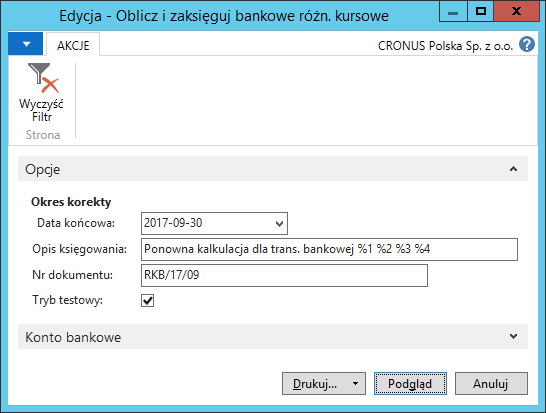{width="4.622047244094488in" height="3.4960629921259843in"}
  --------------------------------------------------------------------------------------------
  Rysunek 3.18: Skrypt do kalkulacji i księgowania różnic kursowych w transakcjach bankowych

5.  W celu wykonania skryptu należy wybrać **Drukuj** lub **Podgląd**.
    > Efekt będzie uzależniony od pola **Tryb testowy:**

```{=html}
<!-- -->
```
1)  Zaznaczone pole **Tryb testowy** i wybrana opcja **Drukuj**:

> różnice kursowe zostaną obliczone i wydrukowany zostanie raport
> testowy przed zaksięgowaniem

2)  Zaznaczone pole **Tryb testowy** i wybrana opcja **Podgląd**:

> różnice kursowe zostaną obliczone i wyświetlony zostanie na ekranie
> raport testowy przed zaksięgowaniem

3)  Niezaznaczone pole **Tryb testowy** i wybrana opcja **Drukuj**:

> różnice kursowe zostaną obliczone i zaksięgowane oraz wydrukowany
> zostanie raport księgowania

4)  Niezaznaczone pole **Tryb testowy** i wybrana opcja **Podgląd**:

> różnice kursowe zostaną obliczone i zaksięgowane oraz wyświetlony
> zostanie na ekranie raport księgowania

  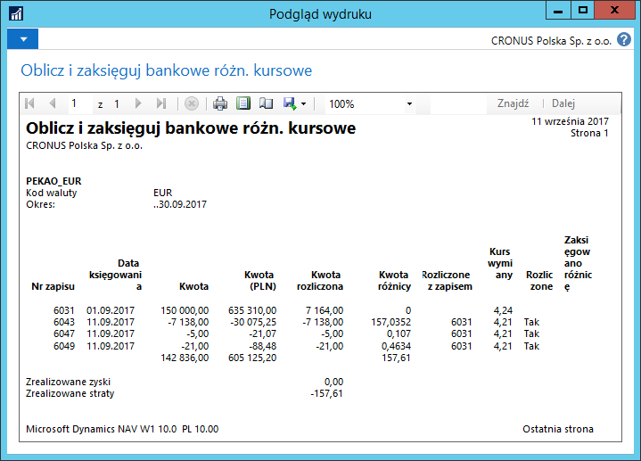{width="6.347222222222222in" height="4.564081364829397in"}
  ------------------------------------------------------------------------------------
  Rysunek 3.19: Podgląd wydruku raportu testowego

  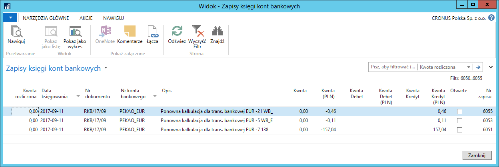{width="6.373912948381452in" height="2.1450667104111987in"}
  -------------------------------------------------------------------------------------
  Rysunek 3.20: Zapisy księgi konta bankowego

  {width="6.382608267716535in" height="2.4425754593175855in"}
  -------------------------------------------------------------------------------------
  Rysunek 3.21: Zapisy księgi głównej

> Po zaksięgowaniu różnic kursowych od transakcji kont bankowych
> lub kasowych możliwe jest wydrukowanie raportu zestawiającego
> szczegóły zapisów źródłowych i zapisów różnic kursowych, m.in. kurs
> wymiany, kwota obliczonej różnicy kursowej, informacje, które zapisy
> zostały rozliczone i do których zapisów zostały zaksięgowane różnice
> kursowe. W tym celu należy postępować według następujących kroków:

1.  W kartotece konta bankowego należy wybrać akcję **Raportuj różnice
    > kursowe**.

2.  W oknie wstępnym raportu, w polach **Data początkowa** i **Data
    > końcowa** można podać daty ograniczające okres księgowania
    > zapisów, które mają być wyświetlone w raporcie:

  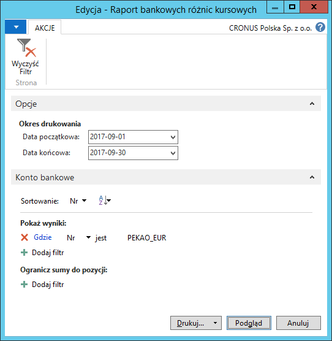{width="4.590551181102362in" height="4.708661417322834in"}
  ------------------------------------------------------------------------------------
  Rysunek 3.22: Filtry raportu różnic kursowych

3.  Należy wybrać **Drukuj** w celu wydrukowania raportu lub **Podgląd**
    w celu wyświetlenia raportu na ekranie.

  {width="6.397637795275591in" height="5.196850393700787in"}
  ------------------------------------------------------------------------------------
  Rysunek 3.23: raport bankowych różnic kursowych

> {width="0.19in" height="0.19in"}
> **Uwaga:** Skrypt do kalkulacji różnic kursowych od środków
> pieniężnych, jak również raport zaksięgowanych różnic kursowych
> dostępne są też w oknie **Kartoteka kasy.**
>
> Aby niektóre z zapisów księgi kont bankowych wykluczyć z kalkulacji
> różnic kursowych od środków pieniężnych w walucie obcej, należy
> postępować według następujących kroków:

1.  Należy wybrać **Działy \> Zarządzanie Finansami \> Zarządzanie
    środkami pieniężnymi \> Konta bankowe**.

2.  W oknie **Konta bankowe**, które się otworzy, należy zaznaczyć
    > wiersz z wybranym kontem bankowym i wybrać **Zapisy księgi**.

3.  W oknie **Zapisy księgi kont bankowych**, które się otworzy, w
    > wierszu z zapisem wybranym do pominięcia należy zaznaczyć pole
    > **Pomiń w kalkulacji różnic kursowych**. Czynność ta jest
    > odwracalna -- np. w sytuacji, gdy pole zostało zaznaczone przez
    > pomyłkę, należy usunąć zaznaczenie. Działanie tego pola jest
    > następujące:

-   pole zaznaczone -- dany zapis zostanie pominięty podczas działania
    skryptu **Oblicz i zaksięguj różnice kursowe**.

> Po zaznaczeniu pola, system automatycznie wypełnia pole **Pominięte
> przez ID użytkownika** identyfikatorem użytkownika, który dokonał
> zaznaczenia.

-   pole niezaznaczone -- dany zapis będzie uwzględniony podczas
    działania skryptu **Oblicz i zaksięguj różnice kursowe**.

> Po usunięciu zaznaczenia pola, system automatycznie wypełnia pole
> **Usunięte pominięcie przez ID użytkownika** identyfikatorem
> użytkownika, który usunął zaznaczenie.
>
> Zaznaczenie pola **Pomiń w kalkulacji różnic kursowych** dla danego
> zapisu może być wielokrotnie wstawiane i usuwane. System każdorazowo
> aktualizuje zawartość pól: **Pominięte przez ID użytkownika** i
> **Usunięte pominięcie przez ID użytkownika** identyfikatorem
> użytkownika, który dokonał danej czynności jako ostatni.
>
> {width="0.19in" height="0.19in"}
> **Uwaga:** Pole **Pomiń w kalkulacji różnic kursowych** może być
> zaznaczone tylko w tych zapisach, które nie były wcześniej rozliczone,
> częściowo rozliczone, wycofane i nie są wcześniejsze od ostatniego
> rozliczonego zapisu.

  {width="6.341666666666667in" height="3.3063385826771654in"}
  -------------------------------------------------------------------------------------
  Rysunek 3.24: Zapisy księgi kont bankowych

Bankowość elektroniczna {#bankowość-elektroniczna .Rozdzial}
=======================

### Informacje ogólne

Bankowość elektroniczna jest modułem usprawniającym wprowadzanie
i wysyłanie przelewów do oprogramowania dostarczonego przez bank. Moduł
Bankowość elektroniczna wymaga zdefiniowania podstawowych parametrów
używanych przez programy bankowe oraz utworzenia szablonów i instancji
dzienników dla przelewów.

Większość banków obecnych na polskim rynku oferuje oprogramowanie
umożliwiające wprowadzanie przelewów w siedzibie firmy i
ich przekazywanie w formie elektronicznej do banku. Moduł Bankowość
elektroniczna pozwala na automatyczne przygotowanie w systemie Microsoft
Dynamics 365 Business Central on‑premises przelewów do banku
kontrahenta.

Przygotowane przelewy można wyeksportować i przekazać w postaci pliku
do systemu bankowego.

Moduł Bankowość elektroniczna umożliwia również import wyciągów
bankowych przekazywanych przez bank w formie plików i automatyczne ich
rozliczanie z rozrachunkami w systemie.

3.  

Ustawienia {#ustawienia-23 .Poziom-1}
----------

Oprogramowanie oferowane przez każdy z banków jest inne. Brak standardu
powoduje konieczność zdefiniowania w module Bankowości Elektronicznej
podstawowych cech programu bankowego. Operację tę można wykonać w oknie
**Kartoteka szablonu poleceń przelewów**. Aby je otworzyć, należy wybrać
**Działy \> Zarządzanie Finansami \> Bankowość elektroniczna \> Szablony
poleceń przelewu**. Na liście należy odszukać i zaznaczyć wiersz
z wybranym szablonem, a następnie, na wstążce należy kliknąć przycisk
**Edycja**.

  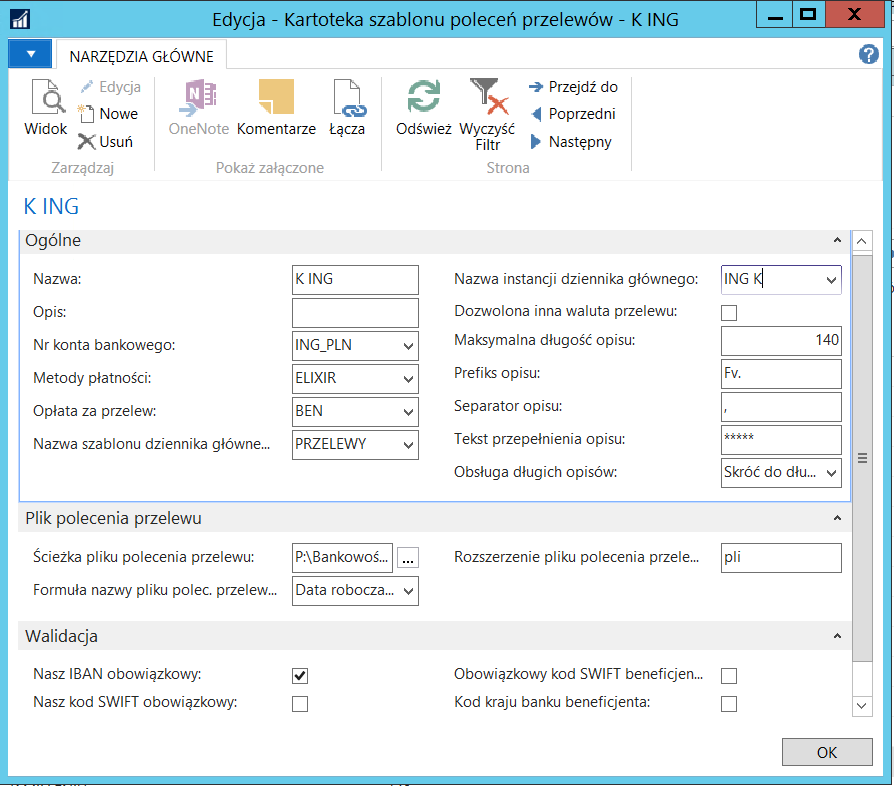{width="6.0318832020997375in" height="5.303030402449694in"}
  -------------------------------------------------------------------------------------
  Rysunek 4.1: Kartoteka szablonu poleceń przelewów

Dzięki wprowadzeniu szablonów poleceń przelewów użytkownik może między
innymi definiować następujące informacje o przelewach:

-   nr konta bankowego,

-   opłata,

-   metoda płatności,

-   nazwa szablonu i instancji dziennika,

-   prefiks opisu,

-   walidacja danych w systemie.

Przed rozpoczęciem pracy z modułem konieczne jest zdefiniowanie
następujących elementów:

  ------------------------------------------- --------------------------------------------------------------------------------------------------------------------------------------------------------------------------------------------------
  **Nazwa**                                   **Uwagi**
  **Szablon poleceń przelewów**               **Szablony poleceń przelewów umożliwiają definiowanie różnych typów przelewów. Wymagane jest, aby dla przelewów krajowych i zagranicznych danego banku zdefiniowane były odrębne szablony.**
  **Domyślny szablon dziennika głównego**     **Szablon, na podstawie którego będą tworzone instancje dziennika głównego, do których będą przenoszone wygenerowane przelewy. Do szablonu przypisana jest domyślna seria numeracji przelewów.**
  **Domyślne instancje dziennika głównego**   **Instancje, do których przenoszone będą wygenerowane przelewy, które następnie będzie można wyeksportować.**
  **Metoda płatności**                        **Metoda płatności jest powiązana z wierszem schematu wymiany danych, na tej podstawie przelewy generowane są wg właściwego schematu.**
  ------------------------------------------- --------------------------------------------------------------------------------------------------------------------------------------------------------------------------------------------------

### Definiowanie szablonów poleceń przelewów

Szablony poleceń przelewów umożliwiają elastyczne definiowanie
przelewów. Ich wprowadzanie wymaga wiedzy związanej z oprogramowaniem
bankowym na poziomie użytkownika.

> {width="0.19in" height="0.19in"}
> **Uwaga:** Zalecane jest, aby definiowanie szablonów przelewów
> przeprowadzała osoba, która jest odpowiedzialna za generowanie
> przelewów w danej firmie, po ukończeniu (z wynikiem pozytywnym)
> szkolenia obejmującego obsługę tego modułu. Nie zalecane jest,
> aby definiowaniem szablonów przelewów zajmował się użytkownik końcowy.

Definiowanie szablonów poleceń przelewów możliwe jest w oknie **Szablony
poleceń przelewów**. Aby je otworzyć, należy wybrać **Zarządzanie
Finansami \> Bankowość elektroniczna \> Administracja \> Szablony
poleceń przelewów**.

  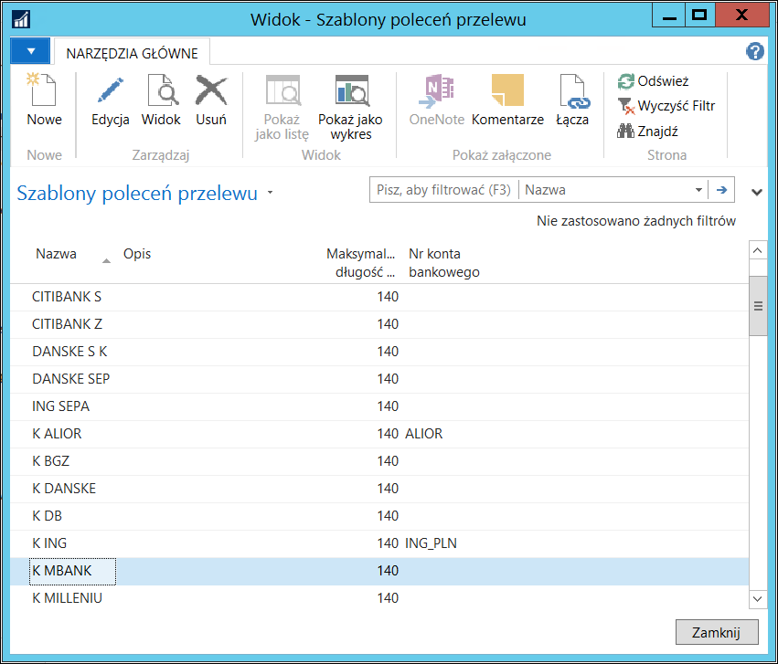{width="5.852926509186352in" height="5.0in"}
  ----------------------------------------------------------------------
  Rysunek 4.2: szablony poleceń przelewu

Wprowadzając definicję nowego szablonu polecenia przelewów część pól
należy wypełnić obligatoryjnie, a pozostałe mogą być wypełniane
w zależności od potrzeb.

W poniższym zestawieniu podano wszystkie pola. Znak umieszczony
w kolumnie **Wypełnienie** informuje o tym, czy pole musi być
wypełnione:

\^ pole należy zawsze wypełnić,

• pole należy wypełnić w zależności od potrzeb,

○ pole jest automatycznie wypełniane przez system.

Kolumna **Uwagi** zawiera opis pola oraz krótkie wyjaśnienie,
jak wykorzystywane jest pole.

+--------------------------+-------------+--------------------------+
| Nazwa                    | Wypełnienie | Uwagi                    |
+--------------------------+-------------+--------------------------+
| **Nazwa**                | \^          | W tym polu należy        |
|                          |             | wprowadzić nazwę         |
|                          |             | szablonu poleceń         |
|                          |             | przelewów.               |
+--------------------------+-------------+--------------------------+
| **Opis**                 | •           | W tym polu należy        |
|                          |             | wprowadzić tekst         |
|                          |             | opisujący szablon        |
|                          |             | poleceń przelewów.       |
+--------------------------+-------------+--------------------------+
| **Nr konta bankowego**   | •           | Zawiera numer konta      |
|                          |             | źródłowego, które system |
|                          |             | będzie sugerował         |
|                          |             | w przypadku tworzenia    |
|                          |             | przelewu na podstawie    |
|                          |             | wybranego szablonu.      |
+--------------------------+-------------+--------------------------+
| **Metoda płatności**     | \^          | W tym polu należy wybrać |
|                          |             | metodę płatności. Należy |
|                          |             | sprawdzić, czy           |
|                          |             | w zdefiniowanej metodzie |
|                          |             | płatności ustawiona jest |
|                          |             | wartość **Definicja      |
|                          |             | wiersza eksportu         |
|                          |             | płatności**.             |
+--------------------------+-------------+--------------------------+
| **Opłata za przelew**    | •           | Pole zawiera informację  |
|                          |             | o tym, kto ponosi koszty |
|                          |             | wykonania przelewu.      |
|                          |             | Wprowadzoną opcję system |
|                          |             | będzie sugerował         |
|                          |             | w przypadku tworzenia    |
|                          |             | przelewu na podstawie    |
|                          |             | wybranego szablonu.      |
|                          |             | Dostępne opcje to:       |
|                          |             |                          |
|                          |             | -   **BEN** -- jeżeli    |
|                          |             |     > opłatę za przelew  |
|                          |             |     > ponosi             |
|                          |             |     > beneficjent,       |
|                          |             |                          |
|                          |             | -   **OUR** -- jeżeli    |
|                          |             |     > opłatę za przelew  |
|                          |             |     > ponosi             |
|                          |             |     > wystawiający,      |
|                          |             |                          |
|                          |             | -   **SHA** -- 50/50.    |
+--------------------------+-------------+--------------------------+
| **Nazwa szablonu         | \^          | Domyślny szablon         |
| dziennika głównego**     |             | dziennika głównego,      |
|                          |             | w którym zdefiniowana    |
|                          |             | jest instancja,          |
|                          |             | do której będą           |
|                          |             | przekazywane             |
|                          |             | wygenerowane przelewy.   |
+--------------------------+-------------+--------------------------+
| **Nazwa instancji        | \^          | Domyślna instancja       |
| dziennika głównego**     |             | dziennika głównego,      |
|                          |             | do której będą           |
|                          |             | przekazywane             |
|                          |             | wygenerowane przelewy.   |
+--------------------------+-------------+--------------------------+
| **Dozwolona inna waluta  | •           | Po zaznaczeniu tego pola |
| przelewu**               |             | możliwe jest wykonanie   |
|                          |             | przelewu w innej walucie |
|                          |             | niż przypisana do konta  |
|                          |             | bankowego.               |
+--------------------------+-------------+--------------------------+
| **Maksymalna długość     | \^          | Maksymalna ilość znaków  |
| opisu**                  |             | do przyjęcia w opisie    |
|                          |             | przelewu.                |
+--------------------------+-------------+--------------------------+
| **Prefiks opisu**        | •           | Pole to wykorzystywane   |
|                          |             | jest przez skrypty       |
|                          |             | tworzące przelewy. Opis  |
|                          |             | w wierszu utworzonym     |
|                          |             | przez skrypty rozpoczyna |
|                          |             | się od tekstu podanego   |
|                          |             | w tym polu. Następnie    |
|                          |             | do opisu dodawane        |
|                          |             | są numery dokumentów     |
|                          |             | (faktur lub list płac),  |
|                          |             | w zależności czy         |
|                          |             | przelewy\                |
|                          |             | są tworzone              |
|                          |             | dla nabywców, czy        |
|                          |             | dla pracowników.         |
+--------------------------+-------------+--------------------------+
| **Separator opisu**      | \^          | Znacznik używany         |
|                          |             | do dzielenia opisów      |
|                          |             | w przelewach.            |
+--------------------------+-------------+--------------------------+
| **Tekst przepełnienia    | \^          | Tekst, który pojawia się |
| opisu**                  |             | po przekroczeniu ilości  |
|                          |             | znaków opisu             |
|                          |             | wprowadzonej w polu      |
|                          |             | **Maksymalna długość     |
|                          |             | opisu**.                 |
+--------------------------+-------------+--------------------------+
| **Obsługa długich        | ○           | Możliwe są dwie opcje    |
| opisów**                 |             | do wyboru:               |
|                          |             |                          |
|                          |             | -   **Skróć do długości  |
|                          |             |     > maksymalnej** --   |
|                          |             |     > system skraca opis |
|                          |             |     > przelewu do ilości |
|                          |             |     > znaków             |
|                          |             |     > zdefiniowanej      |
|                          |             |     > w polu             |
|                          |             |     > **Maksymalna       |
|                          |             |     > długość opisu**,   |
|                          |             |                          |
|                          |             | -   **Użyj tekst         |
|                          |             |     > przepełnienia      |
|                          |             |     > opisu** -- system  |
|                          |             |     > w miejsce          |
|                          |             |     > dłuższego opisu    |
|                          |             |     > wstawia tekst      |
|                          |             |     > zdefiniowany       |
|                          |             |     > w polu **Tekst     |
|                          |             |     > przepełnienia      |
|                          |             |     > opisu**.           |
+--------------------------+-------------+--------------------------+
| **Ścieżka pliku          | •           | Domyślna ścieżka zapisu  |
| polecenia przelewu**     |             | plików poleceń           |
|                          |             | przelewów.               |
+--------------------------+-------------+--------------------------+
| **Formuła nazwy pliku    | •           | Do wyboru domyślnej      |
| polec. przelewu**        |             | nazwy dla pliku          |
|                          |             | polecenia przelewu       |
|                          |             | możliwe są następujące   |
|                          |             | opcje:                   |
|                          |             |                          |
|                          |             | -   **Data robocza** --  |
|                          |             |     > system zapisuje    |
|                          |             |     > jako nazwę pliku   |
|                          |             |     > datę roboczą       |
|                          |             |     > z NAV,             |
|                          |             |                          |
|                          |             | -   **Data robocza + Nr  |
|                          |             |     > rejestru** --      |
|                          |             |     > system zapisuje    |
|                          |             |     > plik jako          |
|                          |             |     > kombinację daty    |
|                          |             |     > roboczej i numeru  |
|                          |             |     > rejestru,          |
|                          |             |                          |
|                          |             | -   **Nazwa szablonu +   |
|                          |             |     > Nr rejestru** --   |
|                          |             |     > system zapisuje    |
|                          |             |     > plik jako          |
|                          |             |     > kombinację nazwy   |
|                          |             |     > szablonu i numeru  |
|                          |             |     > rejestru,          |
|                          |             |                          |
|                          |             | -   **Data robocza +     |
|                          |             |     > Nazwa szablonu +   |
|                          |             |     > Nr rejestru** --   |
|                          |             |     > system zapisuje    |
|                          |             |     > plik jako          |
|                          |             |     > kombinacje daty    |
|                          |             |     > roboczej, nazwy    |
|                          |             |     > szablonu i numeru  |
|                          |             |     > rejestru.          |
+--------------------------+-------------+--------------------------+
| **Rozszerzenie pliku     | \^          | Rozszerzenie pliku       |
| polecenia przelewu**     |             | stosowane przez system   |
|                          |             | bankowy (znane           |
|                          |             | standardy: pli, pla,     |
|                          |             | txt).                    |
+--------------------------+-------------+--------------------------+

Pola na karcie skróconej **Walidacja** należy zaznaczyć opcjonalnie.
System wówczas, w zależności od zaznaczonych opcji walidacji, będzie
sprawdzał wypełnienie wymaganych pól w momencie generowania/importowania
przelewów. Domyślnie zaznaczone pola, to:

-   **Nasz IBAN obowiązkowy**

-   **Obowiązkowy IBAN beneficjenta**

### Definiowanie domyślnego szablonu dziennika głównego

Przed rozpoczęciem korzystania z modułu Bankowość elektroniczna
niezbędne jest zdefiniowanie nowego szablonu dziennika głównego.

> {width="0.19in" height="0.19in"}
> **Uwaga:** Zalecane jest, aby definiowanie nowego szablonu dziennika
> głównego przeprowadzała osoba, która jest odpowiedzialna za tworzenie
> szablonów poleceń przelewów. Nie zalecane jest, aby definiowaniem
> nowego szablonu dziennika głównego zajmował się użytkownik końcowy.

Definiowanie nowego szablonu dziennika głównego możliwe jest w oknie
**Szablony dzienników głównych**. Aby otworzyć to okno, należy wybrać
**Działy \>** **Zarządzanie Finansami \> Administracja \> Ogólne \>
Szablony dzienników głównych**.

  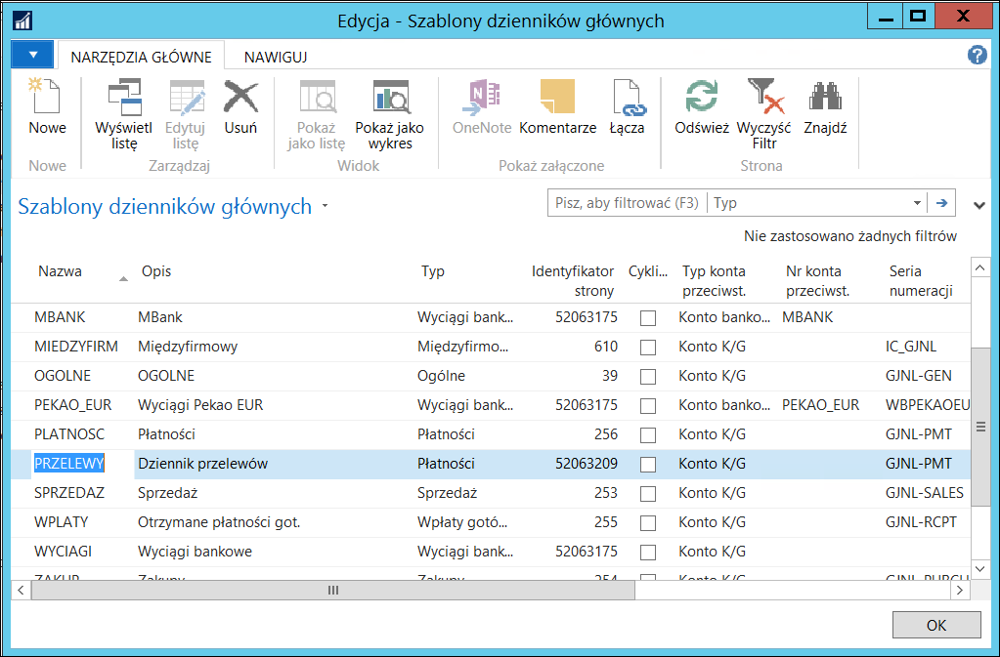{width="5.832132545931758in" height="3.836994750656168in"}
  ------------------------------------------------------------------------------------
  Rysunek 4.3: szablony dzienników głównych

Wprowadzając definicję nowego szablonu dziennika głównego część pól
należy wypełnić obligatoryjnie, a pozostałe mogą być wypełniane
w zależności od potrzeb.

W poniższym zestawieniu podano wybrane pola. Znaczek umieszczony
w kolumnie **Wypełnienie** informuje o tym, czy pole musi być
wypełnione:

\^ pole należy zawsze wypełnić,

• pole należy wypełnić w zależności od potrzeb,

○ pole jest automatycznie wypełniane przez system.

Kolumna **Uwagi** zawiera opis pola oraz krótkie wyjaśnienie,
jak wykorzystywane jest pole.

  -------------------------- ----------------- -----------------------------------------------------------------------------------------------------------------------------------------------------------
  **Nazwa**                  **Wypełnienie**   **Uwagi**
  **Nazwa**                  \^                W tym polu należy wprowadzić nazwę szablonu dziennika głównego. W bieżącym przykładzie jest to: PRZELEWY.
  **Opis**                   •                 W tym polu należy wprowadzić tekst opisujący szablon dziennika głównego. W bieżącym przykładzie jest to: Dziennik przelewów.
  **Typ**                    \^                W tym polu należy wybrać typ szablonu dziennika głównego. W bieżącym przykładzie jest to: Płatności.
  **Identyfikator strony**   \^                W tym polu należy wprowadzić identyfikator strony, na której ten szablon będzie wykorzystywany. W bieżącym przykładzie jest to: 52063209
  **Seria numeracji**        \^                W tym polu należy wybrać serię numeracji, według której system będzie numerował tworzone przelewy. W bieżącym przykładzie należy ją ustawić samodzielnie.
  -------------------------- ----------------- -----------------------------------------------------------------------------------------------------------------------------------------------------------

### Definiowanie instancji dziennika głównego

Jeżeli potrzebnych jest wiele instancji dzienników głównych tego samego
typu, to na podstawie danego szablonu dziennika głównego (PRZELEWY --
utworzonego w przykładzie powyżej) można utworzyć dowolną ich liczbę.

> {width="0.19in" height="0.19in"}
> **Uwaga:** Zalecane jest, aby definiowanie instancji dziennika
> głównego przeprowadzała osoba, która jest odpowiedzialna za tworzenie
> szablonów poleceń przelewów. Nie zalecane jest, aby definiowaniem
> instancji szablonu dziennika głównego zajmował się użytkownik końcowy.

Definiowanie instancji dziennika głównego dostępne jest w oknie
**Instancje dziennika głównego**. Aby otworzyć to okno, należy wybrać
**Zarządzanie Finansami \> Administracja \> Ogólne \> Szablony
dzienników głównych**. Następnie należy zaznaczyć wiersz szablonu
dziennika głównego o nazwie PRZELEWY i kliknąć przycisk **Instancje**
na zakładce **Nawiguj**.

  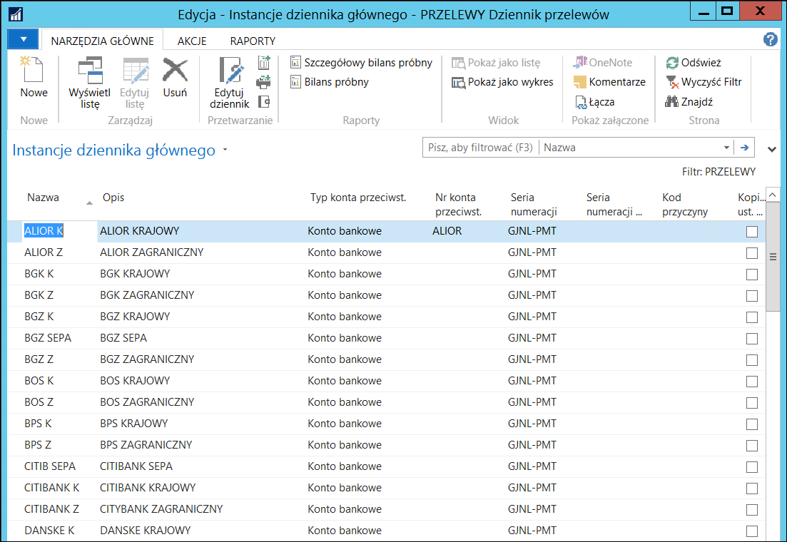{width="5.862270341207349in" height="4.039079177602799in"}
  ------------------------------------------------------------------------------------
  Rysunek 4.4: Instancje dziennika głównego

Wprowadzając definicję nowej instancji dziennika głównego część pól
należy wypełnić obligatoryjnie, a pozostałe mogą być wypełniane
w zależności od potrzeb.

W poniższym zestawieniu podano wszystkie pola. Znaczek umieszczony
w kolumnie **Wypełnienie** informuje o tym, czy pole musi być
wypełnione:

\^ pole należy zawsze wypełnić,

• pole należy wypełnić w zależności od potrzeb,

○ pole jest automatycznie wypełniane przez system.

Kolumna **Uwagi** zawiera opis pola oraz krótkie wyjaśnienie,
jak wykorzystywane jest pole.

  -------------------------- ------------- ----------------------------------------------------------------------------------------------------------------------------------------------------------------------------------------------------------------------------------------------------
  Nazwa                      Wypełnienie   Uwagi
  **Nazwa**                  \^            W tym polu należy wprowadzić nazwę instancji dziennika głównego.
  **Opis**                   •             W tym polu należy wprowadzić tekst opisujący instancję dziennika głównego.
  **Typ konta przeciwst.**   \^            W tym polu należy wybrać **Konto bankowe**.
  **Nr konta przeciwst.**    \^            W tym polu należy wybrać odpowiednie konto bankowe, z którego będą wykonywane przelewy.
  **Seria numeracji**        •             W tym polu należy wybrać serię numeracji, według której system będzie numerował przelewy tworzone w danej instancji dziennika głównego. Jeśli to pole nie jest wypełnione, będzie użyta seria numeracji przypisana do szablonu dziennika głównego.
  -------------------------- ------------- ----------------------------------------------------------------------------------------------------------------------------------------------------------------------------------------------------------------------------------------------------

### Ustawienia konta bankowego

Do prawidłowego działania eksportu przelewów niezbędne jest wypełnienie
pola **Format eksportu płatności** w kartotece konta bankowego.
Odpowiednie wartości będą zaimportowane.

  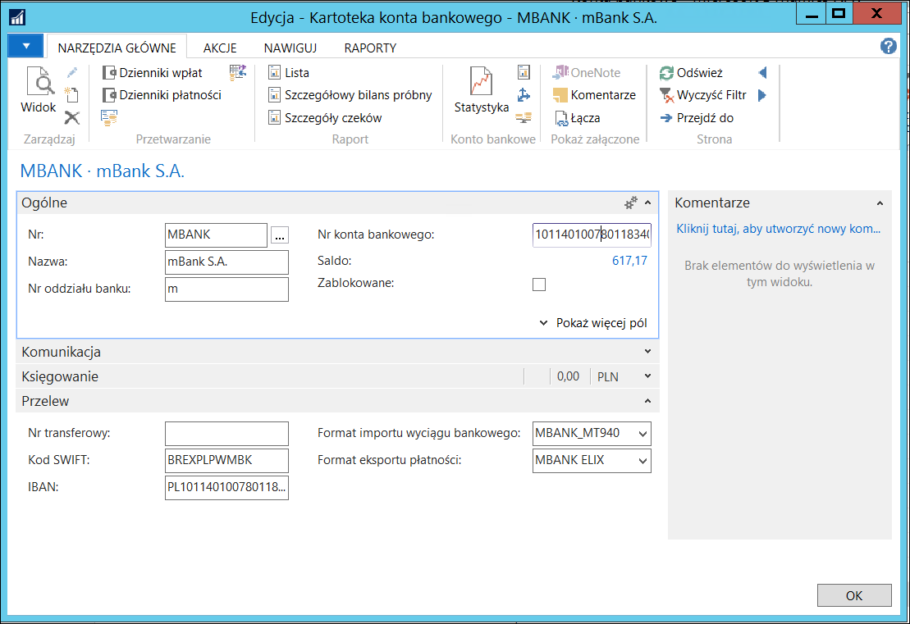{width="5.506412948381453in" height="3.7785990813648294in"}
  -------------------------------------------------------------------------------------
  Rysunek 4.5: Kartoteka konta bankowego

Wprowadzanie przelewów {#wprowadzanie-przelewów .Poziom-1}
----------------------

Wprowadzanie przelewów odbywa się za pośrednictwem specjalnie
utworzonego **Arkusza płatności do dostawców**/**nabywców**,
które następnie przenoszone są do dziennika przelewów bankowych, skąd
mogą być wyeksportowane.

W czasie przenoszenia przelewów do dziennika przelewów informacje o nich
przenoszone są do zapisów w rejestrach przelewów.

Tylko niektóre informacje można modyfikować w przelewach przeniesionych
do **Dziennika przelewów bankowych**.

**Arkusz płatności do dostawców**/**nabywców** ma następującą strukturę:

  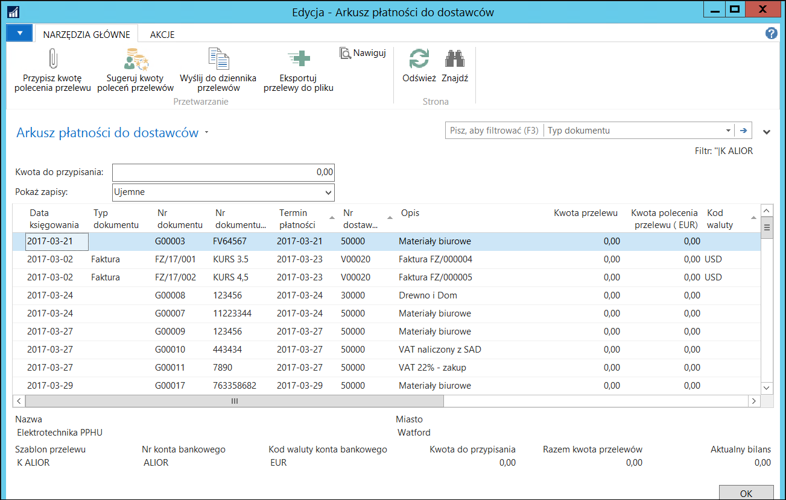{width="6.036698381452318in" height="3.8496850393700788in"}
  -------------------------------------------------------------------------------------
  Rysunek 4.6: Arkusz płatności do dostawców

W poniższym zestawieniu podano wszystkie pola. Znaczek umieszczony
w kolumnie **Wypełnienie** informuje o tym, czy pole musi być
wypełnione:

\^ pole należy zawsze wypełnić,

• pole należy wypełnić w zależności od potrzeb,

○ pole jest automatycznie wypełniane przez system.

Kolumna **Uwagi** zawiera opis pola oraz krótkie wyjaśnienie,
jak wykorzystywane jest pole.

  --------------------------------------- ------------- ---------------------------------------------------------------------------------------------------------
  **Nazwa**                               Wypełnienie   Uwagi
  **Data księgowania**                    ○             Pole przepisane z zapisów księgi dostawcy/nabywcy.
  **Typ dokumentu**                       ○             Pole przepisane z zapisów księgi dostawcy/nabywcy.
  **Nr dokumentu**                        ○             Pole przepisane z zapisów księgi dostawcy/nabywcy.
  **Termin płatności**                    ○             Pole przepisane z zapisów księgi dostawcy/nabywcy.
  **Nr dostawcy/ nabywcy**                ○             Pole przepisane z zapisów księgi dostawcy/nabywcy.
  **Opis**                                ○             Pole przepisane z zapisów księgi dostawcy/nabywcy.
  **Kwota polecenia przelewu**            \^            Kwota, jaką chcemy zapłacić za określoną fakturę.
  **Kwota polecenia przelewu (Waluta)**   ○             Kwota, jaką chcemy zapłacić za określoną fakturę w walucie konta banku, z którego dokonujemy przelewu.
  **Kod waluty**                          ○             Pole przepisane z zapisów księgi dostawcy/nabywcy.
  **Kwota pozostała**                     ○             Pole przepisane z zapisów księgi dostawcy/nabywcy.
  **Kwota pozostała (PLN)**               ○             Pole przepisane z zapisów księgi dostawcy/nabywcy.
  **Kwota poleceń przelewu (dziennik)**   ○             Zsumowana kwota wszystkich przelewów dotyczących danego zapisu, znajdujących się w różnych dziennikach.
  **Kwota poleceń przelewu (zapisy)**     ○             Zsumowana kwota wszystkich przelewów dotyczących danego zapisu, które zostały już wyeksportowane.
  **Wstrzymane**                          ○             Pole przepisane z zapisów księgi dostawcy/nabywcy.
  **Kod konta bank. dostawcy/nabywcy**    ○/\^          Kod konta bankowego dostawcy/nabywcy, na które chcemy wysłać przelew.
  **Szablon polecenia przelewu**          ○             Pole uzupełniane automatycznie zgodnie z wybranym szablonem.
  **Kwota pierwotna (PLN)**               ○             Pole przepisane z zapisów księgi dostawcy/nabywcy.
  --------------------------------------- ------------- ---------------------------------------------------------------------------------------------------------

### Tworzenie przelewów

Moduł Bankowość elektroniczna umożliwia automatyczne tworzenie przelewów
dla dostawców lub nabywców.

Do automatycznego tworzenia przelewów służą funkcje znajdujące się
w oknach **Arkusz płatności do dostawców** i **Arkusz płatności
do nabywców**.

Po otworzeniu okna **Arkusz płatności do dostawców** lub **Arkusz
płatności do nabywców** na ekranie wyświetlana jest lista dostępnych
szablonów w przypadku, gdy zdefiniowanych jest klika szablonów poleceń
przelewu. Gdy jest tylko jeden szablon, automatycznie otworzy się
odpowiednia strona. Brak szablonów sygnalizowany jest odpowiednim
komunikatem.

Wyświetlona zostanie lista zaksięgowanych zapisów księgi
dostawców/nabywców, wyfiltrowana według waluty konta bankowego
zdefiniowanego w szablonie polecenia przelewu. W przypadku zaznaczenia
opcji **Dozwolona inna waluta przelewu** na szablonie polecenia
przelewu, filtr ten nie jest stosowany.

**Szablon polecenia przelewu** zostanie wypełniony automatycznie zgodnie
z wcześniejszym wyborem.

W przypadku wypełnienia pola **Kod konta bankowego beneficjenta**
są trzy możliwości:

-   Gdy konto bankowe zostało wcześniej wybrane z listy, wpisanie
    wartości w polu **Kwota polecenia przelewu** niczego nie zmienia,

-   Gdy pole **Kod konta bankowego** nie jest wypełnione, wpisanie
    wartości w polu **Kwota polecenia przelewu** powoduje wybranie
    domyślnego kodu konta bankowego,

-   Gdy żadne konto beneficjenta nie zostało oznaczone jako domyślne
    na kartotece konta dostawcy/nabywcy, pojawi się błąd i wymagane
    będzie ręczne uzupełnienie pola **Kod konta bankowego**.

W zapisach księgi dostawcy/nabywcy wystarczy uzupełnić pole **Kwota
polecenia przelewu**. Istnieją trzy sposoby uzupełnienia pola **Kwoty
polecenia przelewu**:

1)  Ręczne wprowadzanie kwoty

Użytkownik może ręcznie wpisać kwotę w polu **Kwota polecenia
przelewu**. Zostanie ona poddana walidacji pod kątem poprawności:

-   Wpisanie kwoty większej od **Kwoty pozostałej** spowoduje błąd.

-   Wpisanie kwoty większej od **Kwoty pozostałej** pomniejszonej o już
    > zdefiniowane lub wyeksportowane przelewy wywoła komunikat
    > z informacją o błędzie. Od decyzji użytkownika zależeć będzie, czy
    > dana kwota zostanie przypisana, czy też nie.

2)  Automatyczne wprowadzanie kwoty

Przypisana zostanie kwota równa **Kwocie pozostałej** pomniejszonej
o już zdefiniowane lub wyeksportowane przelewy. Można to uczynić zarówno
dla jednego, jak i wielu wierszy za pomocą funkcji **Przypisz kwotę
polecenia przelewu (F9)**.

  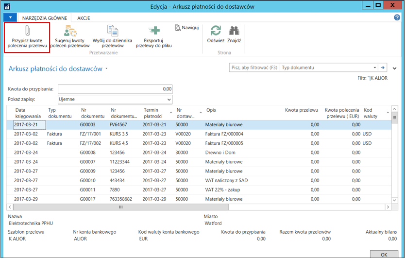{width="5.974285870516185in" height="3.8181813210848645in"}
  -------------------------------------------------------------------------------------------------
  Rysunek 4.7: Funkcja Przypisz kwotę polecenia przelewu na stronie Arkusz płatności do dostawców

3)  Sugerowanie kwoty

Jeżeli znana jest kwota, dla której mają być utworzone przelewy, system
może zasugerować przelewy. W tym celu należy na wstążce kliknąć przycisk
**Sugeruj kwoty poleceń przelewów**.

  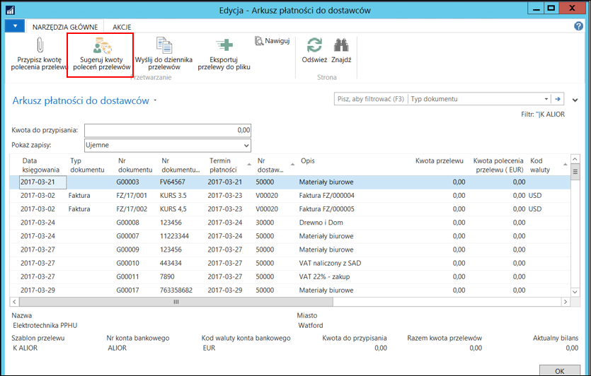{width="6.112237532808399in" height="3.8939391951006126in"}
  -----------------------------------------------------------------------------------------------
  Rysunek 4.8: Funkcja Sugeruj kwoty poleceń przelewów na stronie Arkusz płatności do dostawców

Należy wprowadzić **Kod waluty** oraz **Dostępną kwotę**. W wyniku
działania skryptu, zostaną uzupełnione kwoty przelewów, które będą
czekać na przekazanie do **Dziennika płatności**.

  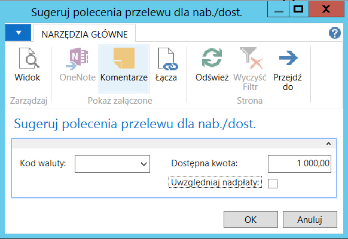{width="4.101222659667542in" height="2.8257567804024495in"}
  -------------------------------------------------------------------------------------
  Rysunek 4.9: Zadanie wsadowe Sugeruj polecenia przel. dla nab./dost.

> {width="0.19in" height="0.19in"}
> **Uwaga:** Opcji **Uwzględniaj nadpłaty** należy użyć w przypadku
> sugerowania poleceń przelewów dla nabywców/dostawców posiadających
> zaksięgowane otwarte (nierozliczone) płatności. System wówczas bierze
> pod uwagę kwotę pozostałą z faktury i kwotę pozostałą z otwartej
> płatności (nadpłaty) i uzupełnia pole **Kwota polecenia przelewu**
> zarówno w wierszu dotyczącym faktury, jak i płatności.
>
> {width="0.19in" height="0.19in"}
> **Uwaga:** W przypadku konta bankowego, gdy na szablonie nie ma
> zaznaczonej opcji **Dozwolona inna waluta przelewu**, pole **Kod
> waluty** przyjmuje wartość z **Konta bankowego** i jest nieedytowalne.

### Przekazanie przelewów do dziennika płatności

Po uzupełnieniu danych w wybranych zapisach księgi dostawcy/nabywcy
można przekazać je do **Dziennika płatności**.

  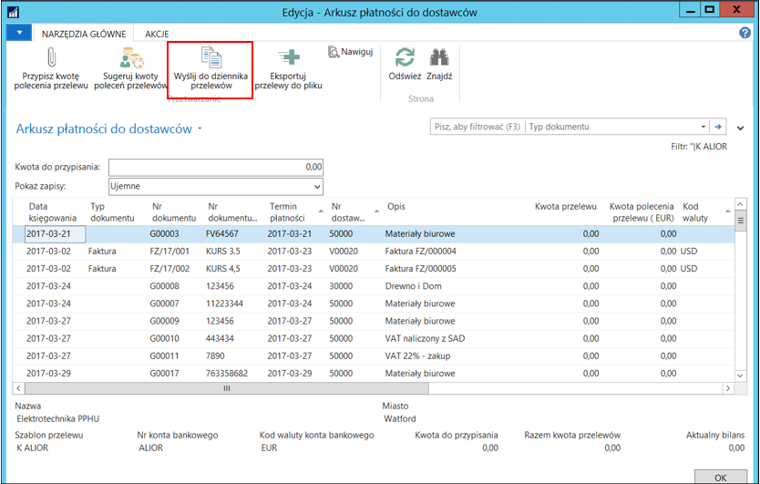{width="5.878350831146107in" height="3.7424245406824146in"}
  ----------------------------------------------------------------------------------------------
  Rysunek 4.10: Funkcja WYŚLIJ do dziennika przelewów na stronie Arkusz płatności do dostawców

System zapyta, z jaką datą utworzyć przelew oraz jakie grupowanie kwot
zastosować w przelewach.

  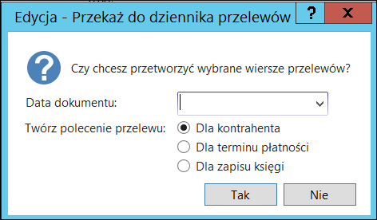{width="3.0227274715660544in" height="1.7675262467191601in"}
  --------------------------------------------------------------------------------------
  Rysunek 4.11: Strona zatwierdzania przelewu

System pogrupuje przelewy, a efekt można będzie zobaczyć w odpowiednim
**Dzienniku przelewów**. Najprostszym sposobem przejścia do **Dziennika
przelewów** jest kliknięcie akcji **Dziennik płatności**.

W oknie **Dziennik przelewów bankowych**, po sprawdzeniu wierszy
i ewentualnym uzupełnieniu wymaganych pól, należy na wstążce kliknąć
przycisk **Eksportuj płatności do pliku**.

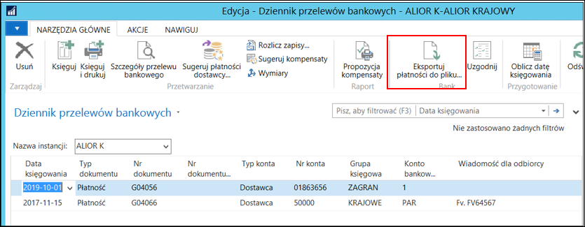{width="6.5in" height="2.529861111111111in"}

  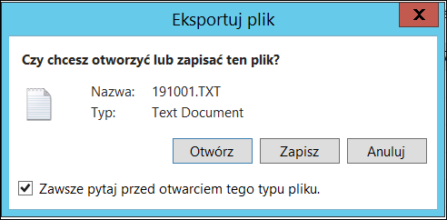{width="3.765150918635171in" height="1.8519641294838145in"}
  -------------------------------------------------------------------------------------
  Rysunek 4.12: Strona eksportuj plik

W wyświetlonym oknie **Eksportuj plik** należy kliknąć przycisk
**Zapisz** i wybrać katalog, w którym zostanie zapisany plik. Następnie
plik należy przekazać do banku.

### Wyeksportowanie pliku płatności

Z okna **Arkusz płatności do dostawców**/**nabywców** można bezpośrednio
wyeksportować plik płatności pomijając krok w **Dzienniku przelewów**.

  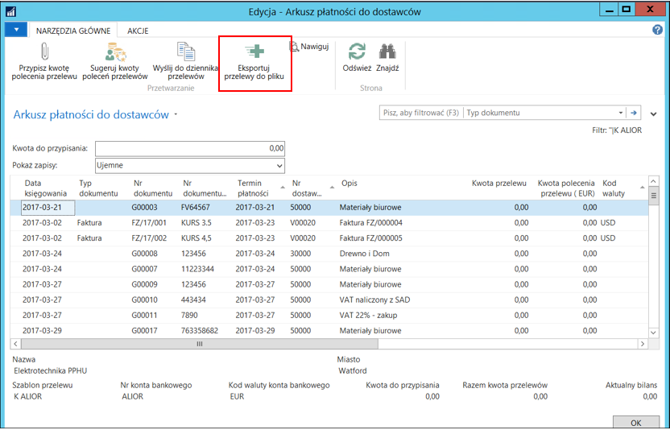{width="5.8540135608048995in" height="3.7575765529308836in"}
  -------------------------------------------------------------------------------------------
  Rysunek 4.13: Funkcja Wyeksportuj plik płatności na stronie Arkusz płatności do dostawców

System zapyta z jaką datą utworzyć przelew oraz jakie grupowanie kwot
zastosować w przelewach.

  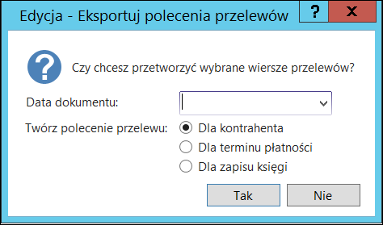{width="3.598484251968504in" height="2.1180949256342956in"}
  -------------------------------------------------------------------------------------
  Rysunek 4.14: Strona zatwierdzania przelewu

System pogrupuje przelewy, a następnie wyświetli stronę **Eksportuj
plik**.

  {width="3.450036089238845in" height="1.6969695975503063in"}
  -------------------------------------------------------------------------------------
  Rysunek 4.15: Strona eksportuj plik

W wyświetlonym oknie **Eksportuj plik** należy kliknąć przycisk
**Zapisz** i wybrać katalog, w którym zostanie zapisany plik. Następnie
plik należy przekazać do banku.

Rejestry przelewów {#rejestry-przelewów .Poziom-1}
------------------

Wyeksportowane przelewy są przechowywane w rejestrach. W oknie rejestrów
przelewy można wyświetlać na ekranie, ponownie wyeksportować plik
lub podejrzeć szczegóły przelewu.

Program nadaje automatycznie wszystkim zapisom kolejne numery. Oznacza
to, że każdy zapis zatwierdzonego przelewu w Microsoft Dynamics 365
Business Central on‑premises można zidentyfikować przy pomocy jego
numeru.

Zapisy są umieszczone w kolejności zależnej od ich numerów w rejestrach
przelewów. Rejestr przelewów jest tworzony automatycznie w czasie
każdego eksportu dziennika przelewów. Poszczególne rejestry przelewów
są także numerowane, począwszy od numeru 1.

Aby wyświetlić listę istniejących rejestrów polecenia przelewu, należy
wybrać **Zarządzanie Finansami \> Bankowość elektroniczna \> Archiwum \>
Rejestry polecenia przelewu**. Na ekranie pojawi się okno **Rejestry
polecenia przelewu**. Przedstawia ono zapisy przelewów znajdujących się
w rejestrze.

  {width="6.256686351706037in" height="3.8636373578302714in"}
  -------------------------------------------------------------------------------------
  Rysunek 4.16: Rejestry polecenia przelewu

W każdym rejestrze przelewów struktura pojedynczego rekordu wygląda
jak poniżej.

Kolumna **Uwagi** zawiera opis pola oraz krótkie wyjaśnienie,
jak wykorzystywane jest pole.

+---------------------------------+-----------------------------------+
| Nazwa                           | Uwagi                             |
+---------------------------------+-----------------------------------+
| **Nr**                          | Kolejny numer nadawany            |
|                                 | automatycznie, unikalny,          |
|                                 | pozwalający na identyfikację      |
|                                 | przelewu.                         |
+---------------------------------+-----------------------------------+
| **Identyfikator**               | Identyfikator ułatwiający         |
|                                 | rozpoznanie odpowiedniego         |
|                                 | przelewu -- nazwa schematu        |
|                                 | wykorzystywana do eksportu        |
|                                 | danych.                           |
+---------------------------------+-----------------------------------+
| **Utworzono dzień-godzina**     | Data i godzina eksportu pliku     |
|                                 | przelewów.                        |
+---------------------------------+-----------------------------------+
| **Utworzone przez użytkownika** | Identyfikator użytkownika,        |
|                                 | który wyeksportował pliki         |
|                                 | przelewów.                        |
+---------------------------------+-----------------------------------+
| **Stan**                        | Status wyeksportowanych plików:   |
|                                 |                                   |
|                                 | -   **Utworzono plik**            |
|                                 |                                   |
|                                 | -   **Plik ponownie wysłany**     |
|                                 |                                   |
|                                 | -   **Anulowane**                 |
+---------------------------------+-----------------------------------+
| **Liczba przelewów**            | Liczba przelewów znajdujących się |
|                                 | w wyeksportowanym pliku, zgodna   |
|                                 | z liczbą wierszy w dzienniku      |
|                                 | głównym podczas eksportu.         |
+---------------------------------+-----------------------------------+
| **Z konta bankowego nr**        | Numer konta bankowego, z          |
|                                 | którego mają zostać wykonane      |
|                                 | przelewy wygenerowane             |
|                                 | przez system.                     |
+---------------------------------+-----------------------------------+
| **Z nazwy konta bankowego**     | Nazwa konta bankowego, z          |
|                                 | którego mają zostać wykonane      |
|                                 | przelewy wygenerowane             |
|                                 | przez system.                     |
+---------------------------------+-----------------------------------+

### Funkcje dostępne w rejestrach przelewów

Z poziomu rejestru możesz wyświetlić szczegóły wyeksportowanych
przelewów, anulować rejestr lub ponownie wyeksportować plik.

Aby wyświetlić szczegóły wyeksportowanych przelewów zawartych
we wskazanym rejestrze, należy na wstążce kliknąć przycisk **Szczegóły
rejestrów polecenia przelewu**. Wyświetlona zostanie strona **Szczeg.
rejestru polecenia przelewu**, na której zaprezentowane są zapisy księgi
dostawcy/nabywcy, na podstawie których stworzone zostały przelewy
zawarte we wskazanym rejestrze.

  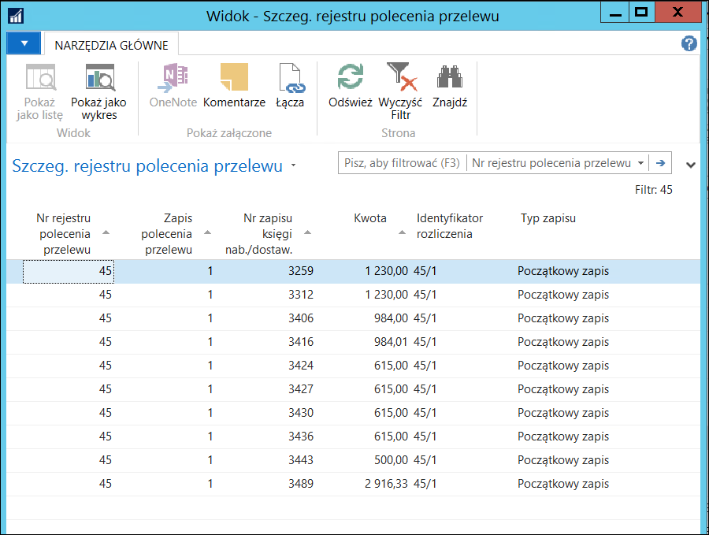{width="5.090754593175853in" height="3.8409087926509184in"}
  -------------------------------------------------------------------------------------
  Rysunek 4.17: Szczegóły rejestru polecenia przelewu

Poniższa tabela zawiera nazwę oraz opis pola oraz krótkie wyjaśnienie,
jak wykorzystywane jest pole.

  --------------------------------------- ---------------------------------------------------------------------------------------
  **Nazwa**                               Uwagi
  **Nr rejestru polecenia przelewu**      Numer rejestru, którego dotyczą szczegóły.
  **Numer zapisu polecenia przelewu**     Numer przelewu, którego dotyczy dany rekord.
  **Nr zapisu księgi Nabywcy/Dostawcy**   Numer konkretnego zapisu księgi nabywcy/dostawcy, z którego utworzony został przelew.
  **Kwota**                               Kwota przypisana do konkretnego zapisu księgi nabywcy/dostawcy.
  **Identyfikator rozliczenia**           Identyfikator wykorzystywany do rozliczenia zapisów.
  --------------------------------------- ---------------------------------------------------------------------------------------

Aby ponownie wyeksportować wygenerowany plik przelewów zawartych
we wskazanym rejestrze, należy na wstążce kliknąć przycisk **Ponownie
eksportuj płatności do plików**.

> Wyeksportowany zostanie ponownie ten sam plik przelewów.

  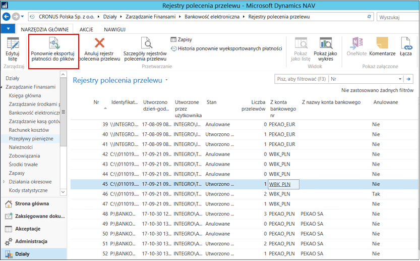{width="6.115587270341208in" height="3.79545384951881in"}
  -----------------------------------------------------------------------------------------------------
  Rysunek 4.18: Funkcja Ponownie eksportuj płatności do plików na stronie rejestry polecenia przelewu

Akcja Anuluj rejestr polecenia przelewu oznacza rejestr jako anulowany i
umożliwia ponowne wygenerowanie pliku z przelewami dla anulowanych
przelewów.

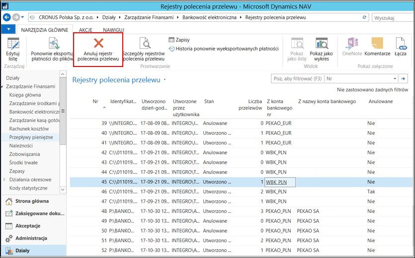{width="5.962121609798775in"
height="3.7129494750656167in"}

Import/przekazywanie wyciągów bankowych {#importprzekazywanie-wyciągów-bankowych .Poziom-1}
---------------------------------------

Moduł Bankowość elektroniczna umożliwia import pliku z wyciągami
bankowymi\
i ich automatyczne rozliczenie.

### Import wyciągów bankowych

Aby wykonać operację importu wyciągu bankowego, należy wybrać
**Bankowość elektroniczna \> Zadania \>Dzienniki wyciągów bankowych**.
W dzienniku odpowiedniego raportu bankowego należy na wstążce kliknąć
przycisk **Importuj wyciąg bankowy**. W nowym oknie należy wskazać plik
bankowy do zaimportowania i zatwierdzić klikając przycisk **OK**.

System zaimportuje wyciąg bankowy do dziennika wyciągów bankowych. Jeśli
kartoteka dostawcy/nabywcy posiada zdefiniowane konta bankowe, system
wprowadzi właściwego dostawcę/nabywcę w wierszu dziennika. Jeśli
natomiast nie zostanie znaleziona taka referencja, użytkownik powinien
ręcznie uzupełnić pole **Typ konta** oraz **Nr konta** w każdym wierszu
dziennika wyciągu bankowego. Pozostałe pola przy braku błędów w czasie
importu system uzupełnia automatycznie.

  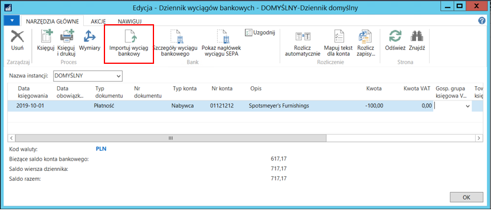{width="6.109198381452319in" height="2.6212117235345582in"}
  -------------------------------------------------------------------------------------
  Rysunek 4.19: Dziennik wyciągów bankowych

W dzienniku po zaimportowaniu wyciągu bankowego można również rozliczyć
poszczególne wiersze wyciągu z zapisami (dokumentami), na podstawie
których utworzony został odpowiedni przelew, klikając na wstążce
przycisk **Rozlicz automatycznie**. Wykorzystuje ona identyfikator
zdefiniowany w procesie eksportu przelewów do określenia konkretnych
zapisów księgi nabywcy/dostawcy. Określanie konkretnych zapisów odbywa
się na podstawie rejestru.

  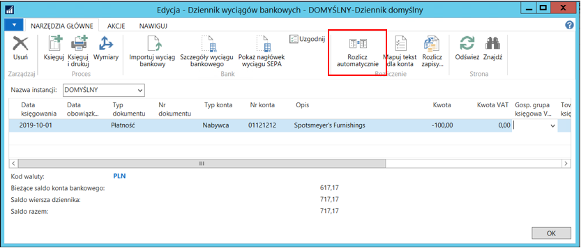{width="6.2222703412073495in" height="2.659090113735783in"}
  -------------------------------------------------------------------------------------
  Rysunek 4.20: Funkcja Rozlicz automatycznie na stronie Dziennik wyciągów bankowych

Zostanie wyświetlony komunikat o ilości automatycznie rozliczonych
zapisów, a rozliczone wiersze zostaną pokolorowane na zielono.

Nierozliczone zapisy należy rozliczyć w standardowy sposób klikając
na wstążce przycisk **Rozlicz zapisy**.

Pomocne w ręcznym rozliczaniu zapisów mogą być szczegóły konkretnego
przelewu. Dostępne są one pod przyciskiem **Szczegóły wyciągu
bankowego** na wstążce. Wyświetlona zostanie lista wszystkich możliwych
danych zaimportowanych w trakcie importu wyciągu.

Po poprawnym uzupełnieniu wierszy dziennika wyciągów bankowych
i rozliczeniu zapisów, należy zaksięgować dziennik klikając na wstążce
przycisk **Księguj**.

Mechanizm podzielonej płatności (Split Payment) {#mechanizm-podzielonej-płatności-split-payment .Poziom-1}
-----------------------------------------------

Szczegółowy opis generowania przelewów i importowania wyciągów bankowych
z wykorzystaniem mechanizmu podzielonej płatności znajduje się w
podrozdziale **10.2. Bankowość elektroniczna**, w **Rozdziale 10
Obowiązkowa podzielona płatność**.

Obsługa należności I zobowiązań {#obsługa-należności-i-zobowiązań .Rozdzial}
===============================

5.  

```{=html}
<!-- -->
```
4.  

Precyzja zaokrąglania cen sprzedaży {#precyzja-zaokrąglania-cen-sprzedaży .Poziom-1}
-----------------------------------

### Informacje ogólne

W standardowej wersji systemu Microsoft Dynamics 365 Business Central
on‑premises możliwe jest zdefiniowanie precyzji zaokrąglania kwot
jednostkowych, która ma odniesienie do wszystkich kwot jednostkowych
w systemie. Polska Lokalizacja wymaga odrębnego zdefiniowania precyzji
zaokrąglania dla cen sprzedaży. Dzięki temu, np. ceny zakupu mogą być
wprowadzane z dokładnością np. do pięciu miejsc po przecinku, a ceny
sprzedaży -- do dwóch.

### Ustawienia

W celu ustawienia precyzji zaokrąglania cen sprzedaży dla waluty
lokalnej, należy postępować według następujących kroków:

1.  Należy wybrać **Działy \> Zarządzanie Finansami \>
    Administracja \>** **Ustawienia księgi głównej**.

2.  W oknie **Ustawienia księgi głównej**, które się otworzy, na karcie
    > skróconej **Dokładność zaokr. sprzedaży** należy odpowiednio
    > uzupełnić pola: **Cena sprzed.‑dokładność zaokr.** i **Cena
    > sprzedaży-liczba miejsc dziesiętnych**.

  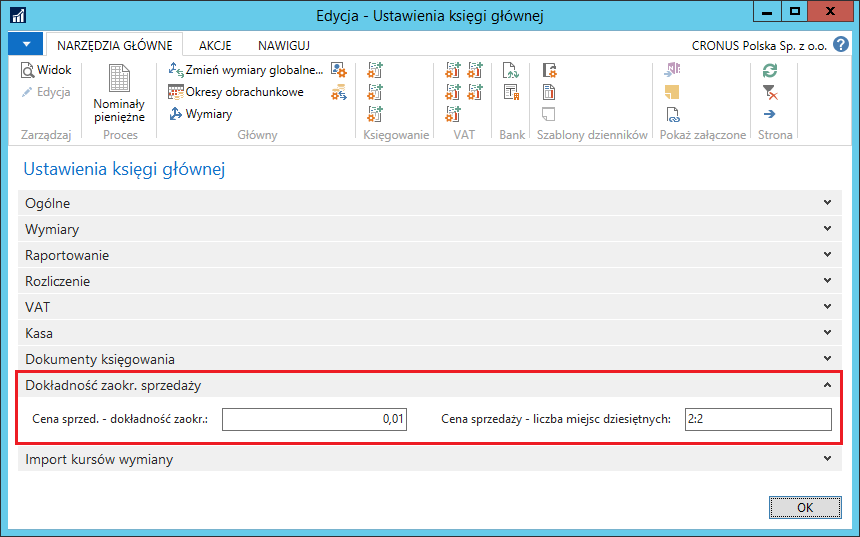{width="6.417390638670166in" height="4.006755249343832in"}
  ------------------------------------------------------------------------------------
  Rysunek 5.1: Ustawienia księgi głównej

W celu ustawienia precyzji zaokrąglania cen sprzedaży dla waluty obcej,
należy postępować według następujących kroków:

1.  Należy wybrać **Działy \> Zarządzanie Finansami \> Działania
    > okresowe \> Waluta \> Waluty**.

2.  W oknie **Waluty**, które się otworzy, należy zaznaczyć wiersz
    > z wybranym kodem waluty i wybrać **Edycja**.

3.  W oknie **Kartoteka waluty**, które się otworzy, na karcie skróconej
    > **Zaokrąglenie** należy odpowiednio uzupełnić pola: **Cena
    > sprzed.-dokładność zaokr.** i **Cena sprzedaży-liczba miejsc
    > dziesiętnych**.

  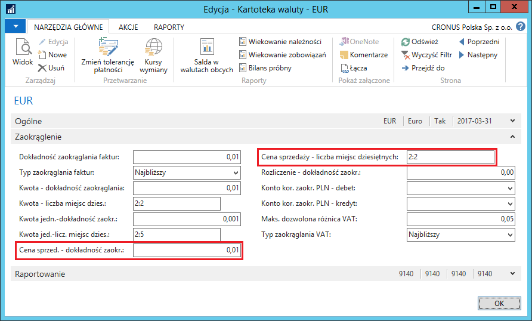{width="6.391303587051619in" height="3.854584426946632in"}
  ------------------------------------------------------------------------------------
  Rysunek 5.2: Kartoteka waluty

Zasady działania zaokrąglania cen sprzedaży są takie same
jak standardowe, dotyczące kwoty jednostkowej.

Paragony fiskalne {#paragony-fiskalne .Poziom-1}
-----------------

### Informacje ogólne

Paragon fiskalny jest dokumentem potwierdzającym sprzedaż, który
powinien być wydrukowany przez kasę rejestrującą (fiskalną) i wydany
nabywcy niezwłocznie po dokonaniu transakcji.

Polska Lokalizacja systemu Microsoft Dynamics 365 Business Central
on‑premises umożliwia połączenie z drukarką fiskalną i drukowanie
paragonów fiskalnych do sprzedaży zaewidencjonowanej w systemie.

#### Drukowanie paragonów fiskalnych {#drukowanie-paragonów-fiskalnych .Poziom-2}

### Informacje ogólne

W ramach Polskiej Lokalizacji systemu Microsoft Dynamics 365 Business
Central on‑premises zostało udostępnione narzędzie umożliwiające
komunikację pomiędzy systemem a drukarką fiskalną, w celu drukowania
paragonów fiskalnych potwierdzających sprzedaż zaewidencjonowaną
w systemie.

### Ustawienia

Przed przystąpieniem do definiowania ustawień w systemie Microsoft
Dynamics 365 Business Central on‑premises konieczne jest sprawdzenie
i ewentualne skorygowanie formatowania liczb w ustawieniach komputera,
do którego jest podłączona drukarka fiskalna. Ważne są 2 parametry:

-   **Symbol dziesiętny** -- przecinek

-   **Symbol grupowania cyfr** -- spacja

  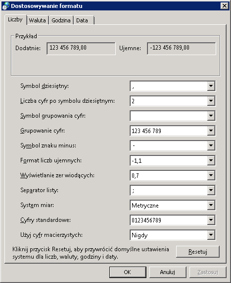{width="3.937007874015748in" height="4.807086614173229in"}
  ------------------------------------------------------------------------------------
  Rysunek 5.3: Ustawienia formatu liczb w systemie MS Windows

W celu zdefiniowania parametrów drukarki fiskalnej, należy postępować
według następujących kroków:

1.  Należy wybrać **Działy \> Administracja \> Administracja IT \>**
    **Ogólne \> Drukarki fiskalne**.

2.  W oknie **Drukarki fiskalne**, które się otworzy, należy wybrać
    **Nowe**.

3.  W oknie **Ustawienia drukarki fiskalnej**, które się otworzy, należy
    wprowadzić właściwe parametry, zgodnie z poniższym opisem:

-   Karta skrócona **Ogólne**:

```{=html}
<!-- -->
```
-   **Nr drukarki fiskalnej** -- w tym polu należy wprowadzić unikalny
    > numer, pod którym będzie identyfikowana drukarka fiskalna.

-   **Nr portu seryjnego** -- w tym polu należy wprowadzić numer portu,
    > po jakim odbywa się komunikacja.

-   **Nr unikatowy** -- pole nieedytowalne, system automatycznie wstawia
    > unikatowy numer zwracany przez drukarkę w wyniku testów.

-   **Protokół drukarki fiskalnej** -- w tym polu należy wprowadzić
    > protokół drukarki.

-   **Połączenie** -- z listy rozwijanej w tym polu należy wybrać jedną
    > z opcji:

```{=html}
<!-- -->
```
-   **Klient** -- wybór tej opcji oznacza połączenie drukarki fiskalnej
    > portem szeregowym lokalnie do komputera.

-   **Serwer** -- wybór tej opcji oznacza połączenie drukarki fiskalnej
    > przez MOXę.

```{=html}
<!-- -->
```
-   **Identyfikator kasjera** -- z listy rozwijanej w tym polu należy
    > wybrać jedną z opcji:

```{=html}
<!-- -->
```
-   **Kod kasjera** -- wybór tej opcji spowoduje wydrukowanie
    > na paragonie kodu sprzedawcy wybranego w polu **Kod sprzedawcy**
    > w fakturze sprzedaży.

-   **Nazwisko kasjera** -- wybór tej opcji spowoduje wydrukowanie
    > na paragonie nazwy sprzedawcy wybranego w polu **Kod sprzedawcy**
    > w fakturze sprzedaży.

```{=html}
<!-- -->
```
-   **Otwórz szufladę** -- zaznaczenie tego pola spowoduje otwarcie
    > szuflady drukarki w momencie drukowania paragonu.

-   **Limit czasu połączenia drukarki** -- w tym polu należy wpisać czas
    > w milisekundach.

-   **Potwierdzenie wymiany danych** -- pole używane wyłącznie do testów
    > -- każde prawidłowe połączenie z drukarką zwraca stosowną
    > informację.

-   **Min długość nazwy** -- w tym polu należy wprowadzić minimalną
    > ilość znaków dla długości nazwy (linii) wysyłanej do drukarki.

-   **Max długość nazwy** -- w tym polu należy wprowadzić maksymalną
    > ilość znaków dla długości nazwy (linii) wysyłanej do drukarki.

-   **Parametr komunikacji (ms)**

> {width="0.19in" height="0.19in"}
> **Uwaga:** W polach **Min długość nazwy** i **Max długość nazwy**
> domyślne wartości wstawiają się automatycznie po wybraniu protokołu
> drukarki, ale niektóre można modyfikować w zakresie dozwolonym
> dla wybranego protokołu drukarki.

-   Karta skrócona **Stawki VAT**

```{=html}
<!-- -->
```
-   **VAT A **-- w tym polu należy wpisać wartość procentową stawki VAT
    > o kodzie A.

-   **Bez VAT A **-- to pole należy zaznaczyć, jeżeli stawka VAT
    > o kodzie A jest zwolniona.

-   **VAT B** -- w tym polu należy wpisać wartość procentową stawki VAT
    > o kodzie B.

-   **Bez VAT B** -- to pole należy zaznaczyć, jeżeli stawka VAT
    > o kodzie B jest zwolniona.

-   **VAT C** -- w tym polu należy wpisać wartość procentową stawki VAT
    > o kodzie C.

-   **Bez VAT C** -- to pole należy zaznaczyć, jeżeli stawka VAT
    > o kodzie C jest zwolniona.

-   **VAT D** -- w tym polu należy wpisać wartość procentową stawki VAT
    > o kodzie D.

-   **Bez VAT D** -- to pole należy zaznaczyć, jeżeli stawka VAT
    > o kodzie D jest zwolniona.

-   **VAT E **-- w tym polu należy wpisać wartość procentową stawki VAT
    > o kodzie E.

-   **Bez VAT E **-- to pole należy zaznaczyć, jeżeli stawka VAT
    > o kodzie E jest zwolniona.

-   **VAT F** -- w tym polu należy wpisać wartość procentową stawki VAT
    > o kodzie F.

-   **Bez VAT F** -- to pole należy zaznaczyć, jeżeli stawka VAT
    > o kodzie F jest zwolniona.

-   **VAT G** -- w tym polu należy wpisać wartość procentową stawki VAT
    > o kodzie G.

-   **Bez VAT G** -- to pole należy zaznaczyć, jeżeli stawka VAT
    > o kodzie G jest zwolniona.

-   **VAT H** -- w tym polu należy wpisać wartość procentową stawki VAT
    > o kodzie H.

-   **Bez VAT H** -- to pole należy zaznaczyć, jeżeli stawka VAT
    > o kodzie H jest zwolniona.

> {width="0.19in" height="0.19in"}
> **Uwaga:** Wyżej wymienione stawki VAT nie muszą być wprowadzane
> ręcznie, mogą być pobrane z drukarki fiskalnej. W tym celu należy użyć
> akcji Aktualizuj **stawki VAT.**

-   **Tow. grupa księgowa bez VAT** -- w tym polu należy wybrać kod
    > **Towarowej grupy księgowej VAT** stosowany dla stawki VAT
    > zwolniona podczas ewidencji sprzedaży w systemie.

```{=html}
<!-- -->
```
-   Karta skrócona **Status drukarki**

```{=html}
<!-- -->
```
-   **Data ostatniego testu** -- pole uzupełniane automatycznie
    > przez system podczas przeprowadzania testów komunikacji
    > z drukarką.

-   **Wynik ostatniego testu** -- pole uzupełniane automatycznie
    > przez system podczas przeprowadzania testów komunikacji
    > z drukarką.

  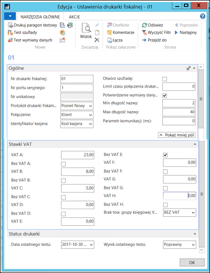{width="4.354166666666667in" height="5.65625in"}
  --------------------------------------------------------------------------
  Rysunek 5.4: Ustawienia drukarki fiskalnej

4.  Należy przeprowadzić test ustawień drukarki fiskalnej, używając
    > niektórych z akcji znajdujących się na wstążce w oknie
    > **Ustawienia drukarki fiskalnej**:

-   **Drukuj paragon testowy** -- uruchamiając tę akcję można wydrukować
    > paragon testowy. Paragon ten zawsze ma kwotę 25gr brutto.

-   **Test szuflady** -- uruchamiając tę akcję można przetestować
    > otwieranie szuflady.

-   **Test wymiany danych** -- uruchamiając tę akcję można sprawdzić,
    > czy dane są odbierane i wysyłane pomiędzy drukarką a systemem.

-   **Połączenie drukarki** -- uruchamiając tę akcję można sprawdzić,
    > czy drukarka jest połączona z systemem.

5.  Należy otworzyć okno **Ustawienia użytkownika** wybierając
    > **Działy \> Administracja \> Ustawienia aplikacji \>
    > Użytkownicy \> Ustawienia użytkownika**. W oknie tym można
    > przypisać poszczególne drukarki fiskalne do poszczególnych
    > użytkowników. W tym celu, w wierszu z ustawieniami wybranego
    > użytkownika, należy z listy rozwijanej w polu **Nr drukarki
    > fiskalnej** wybrać właściwą drukarkę fiskalną.

  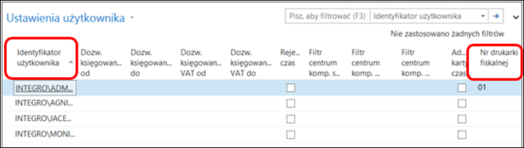{width="5.570833333333334in" height="1.5736417322834646in"}
  -------------------------------------------------------------------------------------
  Rysunek 5.5: Ustawienia użytkownika

> {width="0.19in" height="0.19in"}
> **Uwaga:** Brak przypisania konkretnej drukarki fiskalnej
> do użytkownika oznacza, że dany użytkownik będzie drukował paragony
> na domyślnej drukarce fiskalnej wybranej w oknie **Ustawienia
> sprzedaży i należn.**

6.  Należy otworzyć okno **Ustawienia sprzedaży i należn.** wybierając
    **Działy \> Sprzedaż i Marketing \> Administracja \> Ustawienia
    sprzedaży i należności**. **W **oknie, które się otworzy, na karcie
    skróconej **Ogólne**, należy wypełnić pola:

-   **Nr domyślnej drukarki fiskalnej** -- z listy rozwijanej w tym polu
    > należy wybrać domyślną drukarkę. Będą na niej drukowane paragony
    > fiskalne przez użytkowników, którzy nie mają przypisanej
    > konkretnej drukarki w oknie **Ustawienia użytkownika**.

-   **Ręczny wydruk paragonu fisk**. -- zaznaczenie tego pola spowoduje,
    > że paragon będzie musiał być ręcznie drukowany w każdym przypadku
    > sprzedaży fiskalnej. Brak znacznika oznacza, że uruchomienie
    > funkcji księgującej fakturę sprzedaży spowoduje jednoczesny wydruk
    > paragonu fiskalnego.

  {width="4.030886920384952in" height="3.6145833333333335in"}
  -------------------------------------------------------------------------------------
  Rysunek 5.6: Ustawienia sprzedaży i należności

7.  Na paragonie fiskalnym drukowana jest informacja o metodzie
    > płatności. Takie same metody płatności mogą mieć różne kody
    > w ustawieniach drukarki fiskalnej i ustawieniach systemu, więc
    > konieczne jest ich zmapowanie. Dokonuje się tego w oknie
    > **Mapowanie metod płatności** otwieranym poprzez wybranie
    > **Działy \> Administracja \> Administracja IT \>** **Ogólne \>
    > Mapowanie metod płatności**. W oknie, które się otworzy, należy
    > wybrać **Nowe i **uzupełnić pola zgodnie z opisem:

-   **Protokół drukarki fiskalnej** -- z listy rozwijanej w tym polu
    > należy wybrać protokół drukarki, dla którego zmapowane zostaną
    > metody płatności.

-   **Nr drukarki fiskalnej** - należy z listy rozwijanej w tym polu
    > wybrać właściwą drukarkę fiskalną.

-   **Gotówka** -- z listy rozwijanej w tym polu należy wybrać kod
    > metody płatności zdefiniowany w systemie, odpowiadający metodzie
    > płatności **Gotówka** ustawionej dla wybranego protokołu drukarki
    > fiskalnej.

-   **Karta** -- z listy rozwijanej w tym polu należy wybrać kod metody
    > płatności zdefiniowany w systemie, odpowiadający metodzie
    > płatności **Karta** ustawionej dla wybranego protokołu drukarki
    > fiskalnej.

-   **Czek** -- z listy rozwijanej w tym polu należy wybrać kod metody
    > płatności zdefiniowany w systemie, odpowiadający metodzie
    > płatności **Czek** ustawionej dla wybranego protokołu drukarki
    > fiskalnej.

-   **Bon towarowy** -- z listy rozwijanej w tym polu należy wybrać kod
    > metody płatności zdefiniowany w systemie, odpowiadający metodzie
    > płatności **Bon towarowy** ustawionej dla wybranego protokołu
    > drukarki fiskalnej.

-   **Inne** -- z listy rozwijanej w tym polu należy wybrać kod metody
    > płatności zdefiniowany w systemie, odpowiadający metodzie
    > płatności **Inne** ustawionej dla wybranego protokołu drukarki
    > fiskalnej.

-   **Kredyt** -- z listy rozwijanej w tym polu należy wybrać kod metody
    > płatności zdefiniowany w systemie, odpowiadający metodzie
    > płatności **Kredyt** ustawionej dla wybranego protokołu drukarki
    > fiskalnej.

-   **Konto nabywcy** -- z listy rozwijanej w tym polu należy wybrać kod
    > metody płatności zdefiniowany w systemie, odpowiadający metodzie
    > **Konto nabywcy** płatności ustawionej dla wybranego protokołu
    > drukarki fiskalnej.

-   **Kupon** -- z listy rozwijanej w tym polu należy wybrać kod metody
    > płatności zdefiniowany w systemie, odpowiadający metodzie
    > płatności **Kupon** ustawionej dla wybranego protokołu drukarki
    > fiskalnej.

  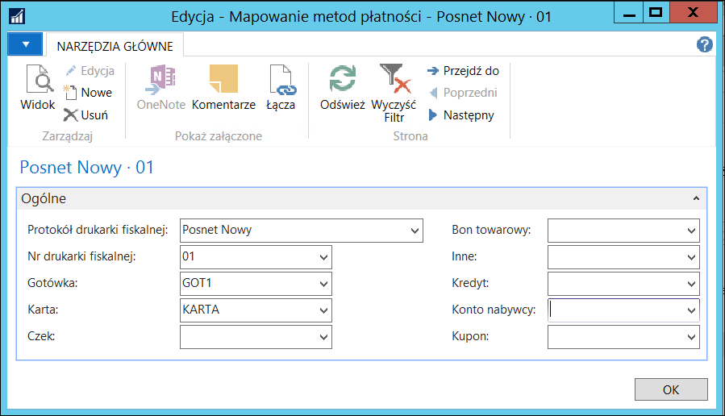{width="5.698996062992126in" height="3.2708333333333335in"}
  -------------------------------------------------------------------------------------
  Rysunek 5.7: Mapowanie metod płatności

### Obsługa

> {width="0.19in" height="0.19in"}
> **Uwaga:** Funkcja drukowania paragonów fiskalnych działa identycznie
> w **Fakturach sprzedaży i Zamówieniach sprzedaży. W **dokumentacji
> proces ten opisany jest na przykładzie **Faktury sprzedaży**.
>
> W celu wydrukowania paragonu fiskalnego, należy postępować
> według następujących kroków:

1.  Należy wybrać **Działy \> Sprzedaż i Marketing \> Przetwarzanie
    zamówień \>** **Faktura sprzedaży**, a następnie **Nowe**.

2.  W oknie nowej faktury sprzedaży konieczne jest zaznaczenie dwóch pól
    na karcie skróconej **Fakturowanie**:

-   **Paragon fiskalny**

-   **Ceny z VAT**

> Brak zaznaczenia któregokolwiek z ww. pól spowoduje uniemożliwienie
> wydruku paragonu fiskalnego.

  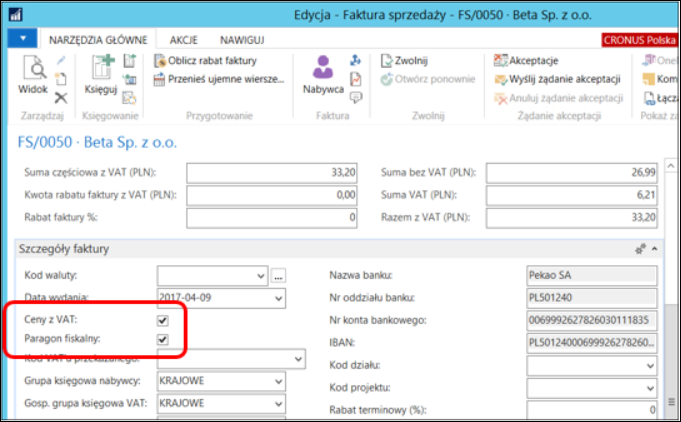{width="6.5in" height="4.027777777777778in"}
  ----------------------------------------------------------------------
  Rysunek 5.8: Kartoteka faktury sprzedaży

> {width="0.19in" height="0.19in"}
> **Uwaga:** Pola **Paragon fiskalny** i **Ceny z VAT** można zaznaczyć
> domyślnie na kartotece nabywcy. W dokumentach sprzedaży wystawianych
> temu nabywcy system będzie automatycznie zaznaczał analogiczne pola.

3.  Pozostałe dane o sprzedaży należy wprowadzić w standardowy sposób.

4.  Fakturę należy zaksięgować poprzez wybranie **Księguj**. Akcja ta
    > spowoduje jednoczesne wydrukowanie paragonu fiskalnego.

5.  Można sprawdzić, czy paragon fiskalny został wydrukowany. W tym celu
    > należy otworzyć zaksięgowaną fakturę sprzedaży, wybierając
    > **Działy \> Sprzedaż i Marketing \> Archiwum \>** **Zaksięgowane
    > faktury sprzedaży**.

6.  W oknie z listą zaksięgowanych faktur sprzedaży należy odnaleźć
    > właściwy dokument i otworzyć go w trybie widoku.

7.  Jeśli w polu **Paragon fiskalny istnieje** jest opcja **Tak**,
    > to oznacza, że proces został przeprowadzony prawidłowo.

  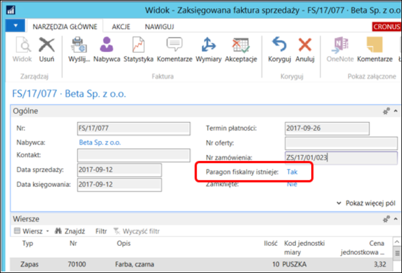{width="6.082259405074366in" height="4.135416666666667in"}
  ------------------------------------------------------------------------------------
  Rysunek 5.9: Kartoteka zaksięgowanej faktury sprzedaży

> {width="0.19in" height="0.19in"}
> **Uwaga:** Standardowo w dokumentach z istniejącym paragonem fiskalnym
> niedozwolone jest ponowne drukowanie paragonu.
>
> Proces drukowania paragonów fiskalnych czasami może się nie powieść,
> np. w wyniku awarii sprzętowej lub awarii połączenia. Wtedy uprawniony
> użytkownik może wykonać następujące czynności:

1.  Z przyczyn losowych, np. utraty zasilania, drukarka może przerwać
    > drukowanie paragonu. Wtedy w oknie **Ustawienia drukarki
    > fiskalnej** wybranej drukarki można uruchomić akcję **Anuluj
    > transakcję**. Akcja ta wysyła do drukarki sekwencję anulowania
    > rozpoczętego drukowania paragonu. Dzięki temu, drukarka nie
    > pozostanie w trakcie transakcji drukowania paragonu. W zależności
    > od typu drukarki, anulowanie może nastąpić automatycznie, ale np.
    > dopiero po 30 minutach.

2.  Istniejący paragon fiskalny, powiązany z zaksięgowaną fakturą
    > sprzedaży, może być ponownie wydrukowany tylko przez uprawnionego
    > użytkownika. W celu ponownego wydrukowania, należy otworzyć
    > kartotekę wybranej zaksięgowanej faktury sprzedaży, a następnie
    > w menu **Nawiguj** wybrać **Paragon fiskalny**. Otworzy się okno
    > z kartoteką utworzonego paragonu do faktury i w tym oknie należy
    > wybrać akcję **Drukuj paragon fiskalny**:

  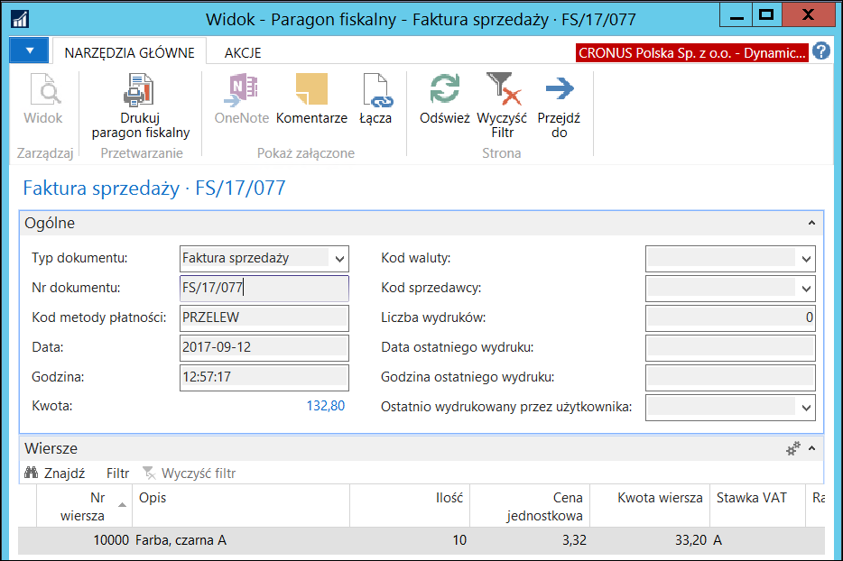{width="6.147520778652669in" height="4.09375in"}
  --------------------------------------------------------------------------
  Rysunek 5.10: Kartoteka paragonu do zaksięgowanej faktury sprzedaży

> System wyświetli komunikat z ostrzeżeniem, którego zaakceptowanie
> spowoduje ponowne wydrukowanie tego samego paragonu:

  {width="4.021394356955381in" height="1.1980839895013122in"}
  -------------------------------------------------------------------------------------
  Rysunek 5.11: Komunikat z ostrzeżeniem

W systemie zapamiętywana jest informacja o wydrukach paragonów:

  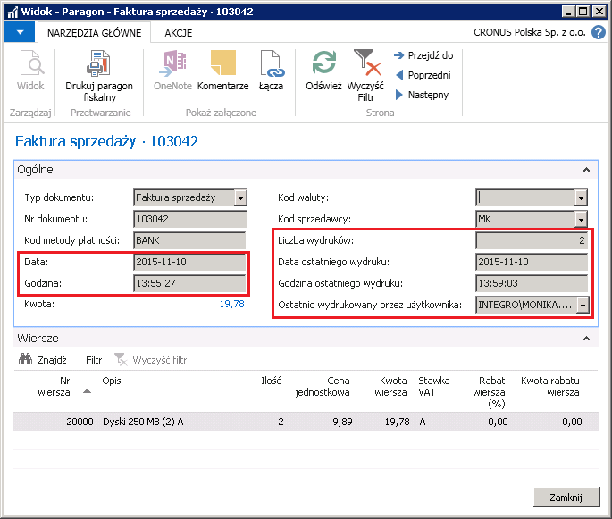{width="5.783464566929134in" height="4.905511811023622in"}
  ------------------------------------------------------------------------------------
  Rysunek 5.12: Kartoteka paragonu do zaksięgowanej faktury sprzedaży

#### NIP nabywcy na paragonie fiskalnym {#nip-nabywcy-na-paragonie-fiskalnym .Poziom-2}

### Podstawa prawna i dodatkowe informacje

### Podstawa prawna

Zgodnie z art. 106b ust. 5 znowelizowanej ustawy o VAT, kiedy dokonujemy
sprzedaży na rzecz podmiotu prowadzącego działalność (tzw. B2B),
istnieje możliwość wystawienia faktury do paragonu wyłącznie w sytuacji,
gdy na paragonie dokumentującym sprzedaż został zamieszczony NIP
nabywcy. Ustawa nowelizująca (art.28 pkt 5) z dnia 04.07.2019, termin
obowiązywania (Ustawa o VAT art.106b ust.5) od 01.01.2020. Przepis
dotyczy sprzedaży ewidencjonowanej na urządzeniach fiskalnych od
01.01.2020.

### Brak możliwości wystawienia faktury do paragonu dla osoby prywatnej?

Zmiana przepisów wprowadzająca NIP jako obowiązkowy element paragonu,
na podstawie którego może zostać wystawiona faktura, dotyczy wyłącznie
transakcji pomiędzy firmami. W przypadku transakcji tzw. B2C, czyli
pomiędzy firmą a osobą prywatną, obowiązują przepisy w brzmieniu
dotychczasowym. Oznacza to, że zgodnie z art. 106i ust. 6 ustawy o VAT
przedsiębiorca ma obowiązek wystawić fakturę do paragonu na żądanie
nabywcy w terminie:

-   do 15-tego dnia miesiąca następującego po miesiącu sprzedaży,
    > pod warunkiem, że żądanie ma miejsce przed upływem końca miesiąca,
    > w którym sprzedaż miała miejsce bądź otrzymano całość lub część
    > zapłaty;

-   nie później niż 15-tego dnia od dnia zgłoszenia żądania, pod
    > warunkiem, że żądanie ma miejsce po końcu miesiąca, w którym miała
    > miejsce sprzedaż bądź otrzymano całość lub część zapłaty.

### Konsekwencje wystawienia faktury do paragonu, który nie zawiera NIP-u nabywcy

Zgodnie z art. 106b ust. 6 wystawienie na rzecz innej firmy faktury do
paragonu, na którym nie znajdował się NIP nabywcy, będzie skutkowało
nałożeniem 100% sankcji na sprzedawcę. Oznacza to, że organ podatkowy
nałoży na przedsiębiorcę dodatkowe zobowiązanie podatkowe w wysokości
100% VAT wykazanego na wystawionej fakturze do paragonu.

### Czy nowe przepisy dotyczące faktur do paragonów dotyczą wszystkich przedsiębiorców?

Nowelizacja ustawy o VAT przewiduje wyłączenia z przepisów dotyczących
obowiązku zamieszczania NIP-u firmy na paragonie, do którego ma zostać
wystawiona faktura. Zgodnie z art. 106b ust. 7 ustawy o VAT obowiązku
tego nie stosuje się do podatników świadczących usługi taksówek
osobowych, z wyłączeniem wynajmu samochodów osobowych z kierowcą (PKWiU
49.32.11.0). Co więcej, ustawodawca jednocześnie wyłączył tę grupę
przedsiębiorców ze 100% sankcji VAT za wystawienie faktury do paragonu,
na którym nie został zamieszczony NIP nabywcy.

/Opracowano na podstawie www.ksiegowosc-infor.pl/

### Informacje ogólne

NIP nabywcy drukowany na paragonie fiskalnym, jak i pozostałe dane
zawarte na paragonie fiskalnym powinny znajdować się w kolejności
określonej w rozporządzeniu. NIP nie może być drukowany jako linia
paragonu, czy inny dodatkowy opis, musi się znajdować pod linią z
numerem kasy i kasjerem, a logo fiskalnym.

Wydruk uzależniony jest od samej drukarki fiskalnej i jej
oprogramowania. Jeżeli drukarka tego nie obsługuje, nie ma możliwości
wysłania NIP z systemu Microsoft Dynamics 365 Business Central
on‑premises do drukarki fiskalnej i konieczny jest zakup nowego
urządzenia spełniającego ten wymóg. Aktualnie przetestowane są wydruki
dla drukarek z protokołem Posnet DFxxx (w dwóch wariantach, dla drukarek
produkowanych przez Posnet i drukarek Novitus), z protokołem Posnet i
dla drukarki ELZAB (z protokołem Thermal).

{width="0.19in" height="0.19in"}
**Uwaga:** Wydruk NIP-u nabywcy może być uzyskany tylko na drukarkach
do tego przystosowanych (pierwsze homologacje mogły być już w 2015
roku), dlatego konieczne jest sprawdzenie przez Klienta u swojego
dostawcy/opiekuna serwisowego posiadanych urządzeń fiskalnych pod kątem
wydruku NIP-u nabywcy na paragonie fiskalnym.

### Ustawienia

**Ustawienia komunikacji**

W ramach Polskiej Lokalizacji systemu Microsoft Dynamics 365 Business
Central on‑premises przygotowane zostały nowe opcje dotyczące ustawień
komunikacji drukarki fiskalnej z systemem. Dotychczasowe połączenie
przez port szeregowy zostało rozbudowane o możliwość ustawienia dla
każdej kasy prędkości transmisji od 9600 do 115200 B/s, drugą opcją jest
bezpośrednie połączenie do sieci Ethernet z protokołem TCP/IP
(ustawienie adresu IP i Nr portu).

**Ustawienie protokołu zgodnego z ustawieniem drukarki fiskalnej**

W oknie **Ustawienia drukarki fiskalnej** pojawiły się nowe elementy:

1)  w polu **Protokół drukarki fiskalnej** dostępne są opcje:

-   **ELZAB FP600**,

-   **Posnet Thermal/Novitus**,

-   **Posnet**.

2)  w polu **Opcje wydruku NIP** dostępne są opcje:

-   **Bez nr VAT/NIP**,

-   **Nr VAT/NIP Posnet Thermal**,

-   **Nr VAT/NIP Novitus**,

-   **Nr VAT/NIP nowy Posnet**.

  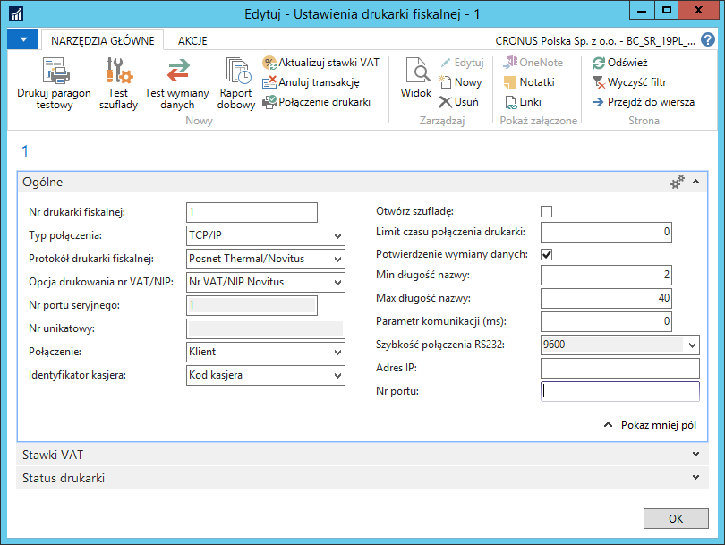{width="6.395833333333333in" height="4.808491907261592in"}
  ------------------------------------------------------------------------------------
  Rysunek 5.13: Ustawienia drukarki fiskalnej

### Obsługa

W systemie Microsoft Dynamics 365 Business Central on‑premises paragon
fiskalny drukowany jest z zaksięgowanej faktury sprzedaży. Wydruk
paragonu bazuje na danych pobieranych z nagłówka i wierszy zaksięgowanej
faktury sprzedaży, dodatkowo wstawiany jest NIP nabywcy.

  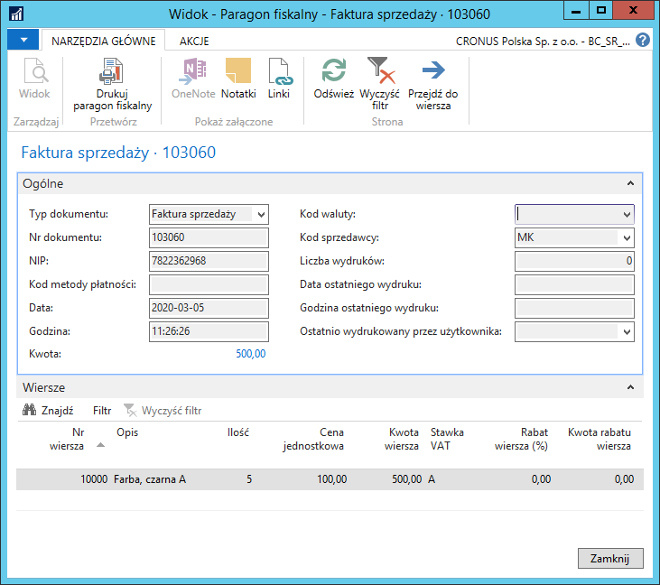{width="6.357417979002625in" height="5.635416666666667in"}
  ------------------------------------------------------------------------------------
  Rysunek 5.14: Paragon fiskalny

  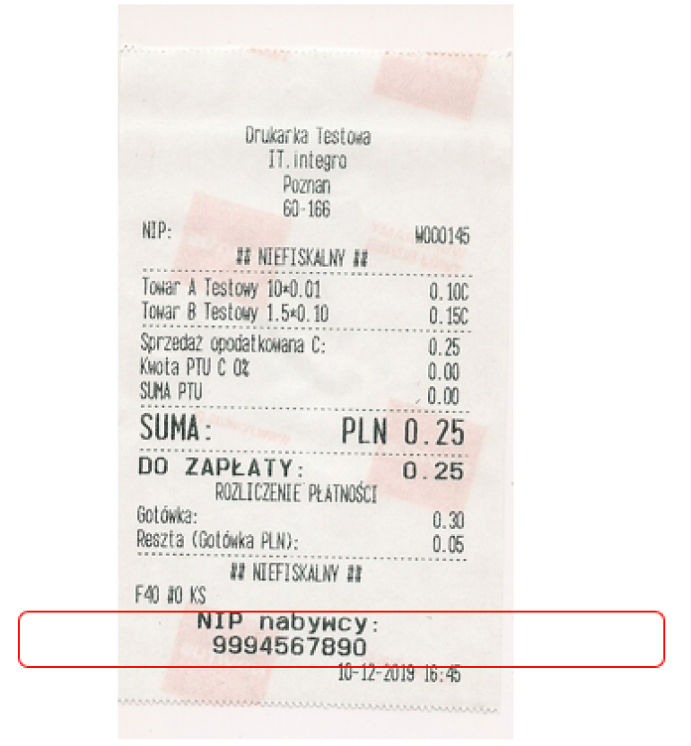{width="3.3590726159230098in" height="3.625in"}
  -------------------------------------------------------------------------
  Rysunek 5.15: Przykładowy wydruk paragonu fiskalnego

Wydruki dokumentów sprzedaży {#wydruki-dokumentów-sprzedaży .Poziom-1}
----------------------------

### Informacje ogólne

W ramach Polskiej Lokalizacji systemu Microsoft Dynamics 365 Business
Central on‑premises wydruki dokumentów sprzedaży zostały przygotowane
zgodnie z wymaganiami ustawowymi i zawierają wszystkie wymagane
elementy.

Nowe wydruki są dostępne dla:

-   zaksięgowanych faktur sprzedaży

-   zaksięgowanych faktur korygujących sprzedaży

-   zaksięgowanych faktur sprzedaży serwisu

-   zaksięgowanych faktur korygujących sprzedaży serwisu

### Ustawienia

> W celu przypisania raportów przygotowanych w ramach Polskiej
> Lokalizacji, jako domyślnych do drukowania wybranych rodzajów
> dokumentów sprzedaży, należy wykonać następujące kroki:

1.  Należy wybrać **Działy \> Administracja \> Administracja IT \>
    > Raporty \> Wybór raportów -- sprzedaż**.

2.  W oknie **Wybór raportów -- sprzedaż**, które się otworzy, z listy
    > rozwijanej w polu **Użycie** należy wybrać właściwy typ dokumentu
    > (zgodnie z poniższą tabelką), następnie w polu **Identyfikator
    > raportu** należy wprowadzić właściwy numer (zgodnie z poniższą
    > tabelką).

  **Użycie**               **Identyfikator raportu**
  ------------------------ ---------------------------
  **Faktura**              52063095
  **Faktura korygująca**   52063096

  ------------------------------------------
  Rysunek 5.16: Wybór raportów -- sprzedaż
  ------------------------------------------

3.  Należy wybrać **Działy \> Administracja \> Administracja IT \>
    Raporty \> Wybór raportów -- serwis**.

4.  W oknie **Wybór raportów -- serwis**, które się otworzy, z listy
    rozwijanej w polu **Użycie** wybierz właściwy typ dokumentu (zgodnie
    z poniższą tabelką), następnie w polu **Identyfikator raportu**
    wprowadź właściwy numer (zgodnie z poniższą tabelką).

  **Użycie**               **Identyfikator raportu**
  ------------------------ ---------------------------
  **Faktura**              52063097
  **Faktura korygująca**   52063098

  ----------------------------------------
  Rysunek 5.17: Wybór raportów -- serwis
  ----------------------------------------

#### Wydruk faktury sprzedaży {#wydruk-faktury-sprzedaży .Poziom-2}

### Informacje ogólne

W ramach Polskiej Lokalizacji systemu Microsoft Dynamics 365 Business
Central on‑premises wydruk faktury sprzedaży został dostosowany
do wymagań ustawowych i zawiera wszystkie wymagane elementy.

### Obsługa

> W celu wydrukowania faktury sprzedaży, należy wykonać następujące
> kroki:

1.  Należy wybrać **Działy \> Sprzedaż i Marketing \> Archiwum \>**
    **Zaksięgowane faktury sprzedaży**.

2.  W oknie z listą zaksięgowanych faktur sprzedaży należy zaznaczyć
    wybrany wiersz i wybrać **Drukuj, a **następnie **Drukuj**
    lub **Podgląd**.

  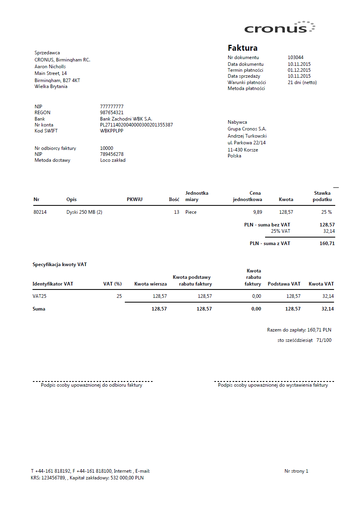{width="6.0821511373578305in" height="8.566037839020122in"}
  -------------------------------------------------------------------------------------
  Rysunek 5.18: Wydruk faktury sprzedaży

#### Wydruk faktury korygującej sprzedaży {#wydruk-faktury-korygującej-sprzedaży .Poziom-2}

### Informacje ogólne

W ramach Polskiej Lokalizacji systemu Microsoft Dynamics 365 Business
Central on‑premises wydruk faktury korygującej sprzedaży został
dostosowany do wymagań ustawowych i zawiera wszystkie wymagane elementy.

### Obsługa

> W celu wydrukowania faktury korygującej sprzedaży, należy wykonać
> następujące kroki:

1.  Należy wybrać **Działy \> Sprzedaż i Marketing \> Archiwum \>**
    > **Zaks. faktury koryg. sprzed**.

2.  W oknie z listą zaksięgowanych faktur korygujących sprzedaży należy
    > zaznaczyć wybrany wiersz i wybrać **Drukuj, a **następnie
    > **Drukuj** lub **Podgląd**.

  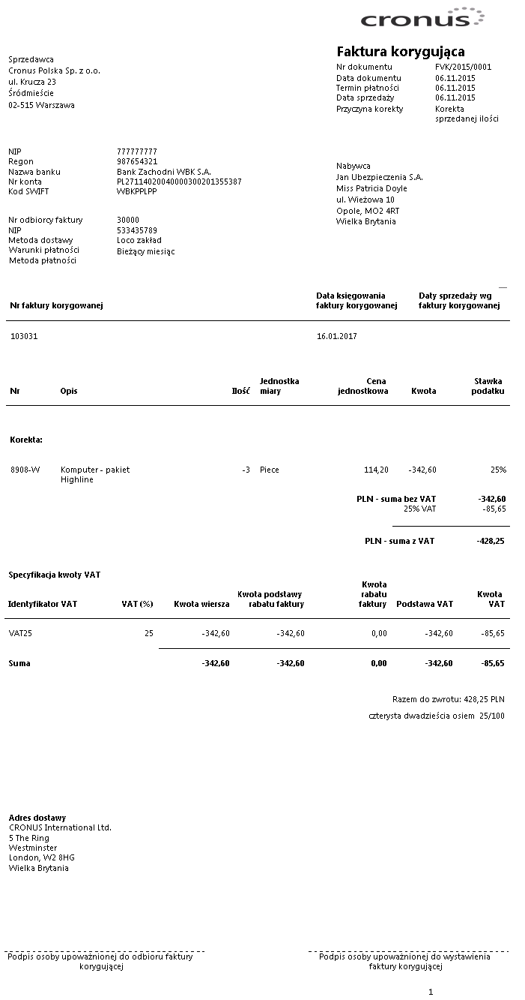{width="4.539165573053368in" height="8.632074584426947in"}
  ------------------------------------------------------------------------------------
  Rysunek 5.19: Wydruk faktury korygującej sprzedaży

#### Wydruk faktury sprzedaży serwisu {#wydruk-faktury-sprzedaży-serwisu .Poziom-2}

### Informacje ogólne

W ramach Polskiej Lokalizacji systemu Microsoft Dynamics 365 Business
Central on‑premises wydruk faktury sprzedaży serwisu został dostosowany
do wymagań ustawowych i zawiera wszystkie wymagane elementy.

### Obsługa

> W celu wydrukowania faktury sprzedaży serwisu, należy wykonać
> następujące kroki:

1.  Należy wybrać **Działy \> Serwis \> Archiwum \>** **Zaksięgowane
    > faktury serwisu**.

2.  W oknie z listą zaksięgowanych faktur sprzedaży serwisu należy
    > zaznaczyć wybrany wiersz i wybrać **Drukuj, a **następnie
    > **Drukuj** lub **Podgląd**.

  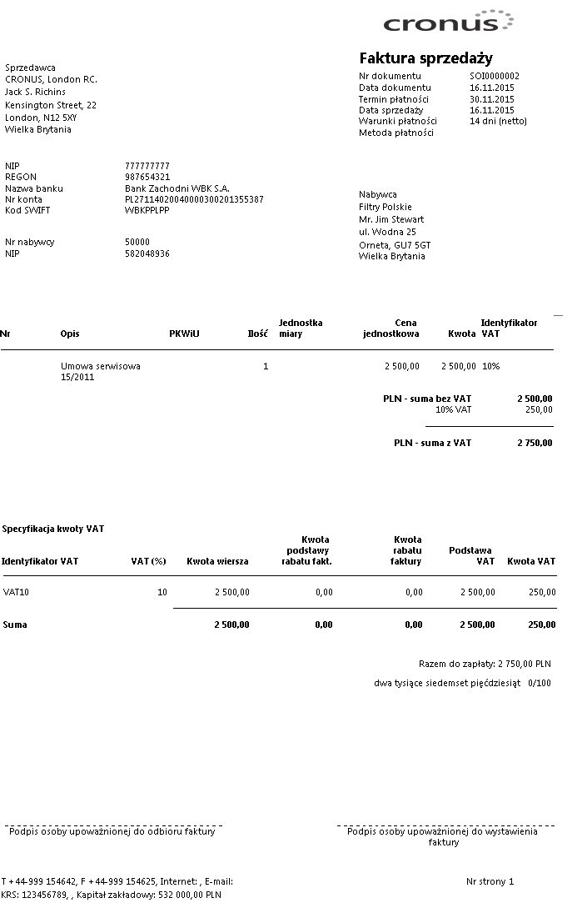{width="5.516026902887139in" height="8.594339457567804in"}
  ------------------------------------------------------------------------------------
  Rysunek 5.20: Wydruk faktury sprzedaży serwisu

#### Wydruk faktury korygującej sprzedaży serwisu {#wydruk-faktury-korygującej-sprzedaży-serwisu .Poziom-2}

### Informacje ogólne

W ramach Polskiej Lokalizacji systemu Microsoft Dynamics 365 Business
Central on‑premises wydruk faktury korygującej sprzedaży serwisu został
dostosowany do wymagań ustawowych i zawiera wszystkie wymagane elementy.

### Obsługa

> W celu wydrukowania faktury korygującej sprzedaży serwisu, należy
> wykonać następujące kroki:

1.  Należy wybrać **Działy \> Serwis \> Archiwum \>** **Zaksięgowane
    > faktury korygujące serwisu**.

2.  W oknie z listą zaksięgowanych faktur korygujących sprzedaży serwisu
    > należy zaznaczyć wybrany wiersz i wybrać **Drukuj, a **następnie
    > **Drukuj** lub **Podgląd**.

  {width="4.695718503937008in" height="8.594339457567804in"}
  ------------------------------------------------------------------------------------
  Rysunek 5.21: Wydruk faktury korygującej sprzedaży serwisu

#### Faktura Pro-forma sprzedaży {#faktura-pro-forma-sprzedaży .Poziom-2}

### Informacje ogólne

Faktury pro-forma sprzedaży są wystawiane przed ostatecznym
zafakturowaniem sprzedaży. Mają one zastosowanie w dwóch sytuacjach:

-   Na podstawie otrzymanej faktury pro-forma sprzedaży nabywcy dokonują
    > przedpłaty do zamówienia. Faktura pro-forma w tej sytuacji stanowi
    > dokument potwierdzający wysokość kwoty należności, która ma zostać
    > zapłacona z góry.

-   Faktura pro-forma wystawiana jest w transakcji sprzedaży produktów
    > do krajów za granicą, nie będących członkami Unii Europejskiej.
    > W tej sytuacji faktura pro-forma dostarczana jest do Urzędu
    > Celnego w celu przygotowania dokumentu SAD.

### Obsługa

> W celu wystawienia faktury pro-forma sprzedaży, należy wykonać
> następujące kroki:

1.  Należy wybrać **Działy \> Sprzedaż i Marketing \> Przetwarzanie
    > zamówień \>** **Zamówienia sprzedaży**.

2.  W oknie z listą zamówień sprzedaży należy zaznaczyć wiersz
    > z wybranym zamówieniem i wybrać **Edycja**.

3.  W oknie kartoteki wybranego zamówienia sprzedaży, które się otworzy,
    > należy wybrać akcję **Faktura pro-forma**.

4.  W oknie wstępnym raportu, na karcie skróconej **Opcje** należy
    > wprowadzić właściwe opcje, a następnie wybrać **Drukuj:**

  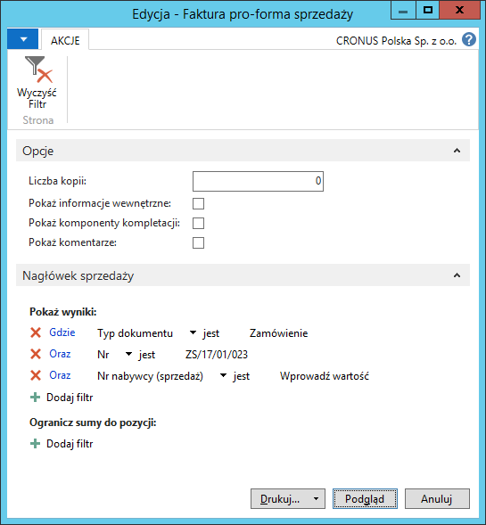{width="4.578740157480315in" height="4.948818897637795in"}
  ------------------------------------------------------------------------------------
  Rysunek 5.22: Drukowanie faktury pro-forma sprzedaży

5.  W wyniku czynność wykonanych w poprzednich krokach, faktura
    pro-forma sprzedaży została wydrukowana zgodnie z wybranymi opcjami:

  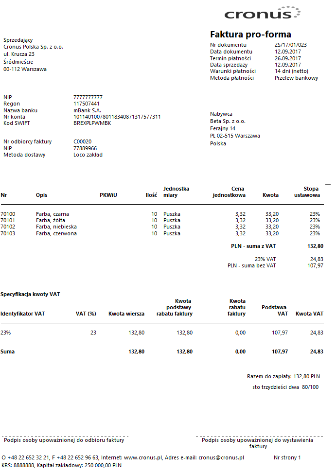{width="6.050856299212598in" height="8.537735126859143in"}
  ------------------------------------------------------------------------------------
  Rysunek 5.23: faktura pro-forma sprzedaży

#### Baza Danych Odpadowych (BDO) {#baza-danych-odpadowych-bdo .Poziom-2}

### Informacje ogólne

Baza Danych Odpadowych (BDO) jest rejestrem przedsiębiorców, którzy
wprowadzają do obrotu określone produkty, produkty w opakowaniach
lub gospodarują odpadami.

Obowiązek rejestracji w BDO dotyczy podmiotów, które m.in.:

-   wytwarzają odpady i prowadzą ich ewidencję,

-   wprowadzają do obrotu krajowego produkty w opakowaniach, pojazdy,
    oleje, smary, opony, baterie lub akumulatory, sprzęt elektryczny i
    elektroniczny,

-   są producentami, importerami lub wewnątrzwspólnotowymi nabywcami
    opakowań.

Przedsiębiorca otrzymuje numer rejestrowy (Nr BDO), który ma obowiązek
umieszczać na dokumentach wystawianych w ramach prowadzonej
działalności.

W ramach Polskiej Lokalizacji systemu Microsoft Dynamics 365 Business
Central on‑premises dodana została możliwość umieszczenia w systemie
informacji o numerze BDO przypisanym do przedsiębiorcy oraz drukowania
tego numeru na dokumentach sprzedaży.

### Ustawienia

W celu wprowadzenia numeru BDO do danych przedsiębiorcy w systemie,
należy wykonać następujące kroki:

1.  Należy wybrać **Działy \> Administracja \> Ustawienia aplikacji \>
    Ogólne \> Dane firmy**.

2.  W oknie **Dane firmy**, które się otworzy, na karcie skróconej
    **Ogólne** należy w polu **Nr BDO** wpisać numer rejestrowy w Bazie
    Danych Odpadowych przypisany do przedsiębiorcy.

  --------------------------
  Rysunek 5.24: Dane firmy
  --------------------------

Na wydrukach dokumentów sprzedaży numer BDO prezentowany jest w sekcji
nagłówka.

  ----------------------------------------
  Rysunek 5.25: Wydruk faktury sprzedaży
  ----------------------------------------

Faktura korygująca sprzedaży {#faktura-korygująca-sprzedaży .Poziom-1}
----------------------------

#### Kreator faktury korygującej {#kreator-faktury-korygującej .Poziom-2}

### Informacje ogólne

W sytuacji, gdy zachodzi potrzeba skorygowania sprzedaży udokumentowanej
fakturą sprzedaży, firmy zwykle wystawiają fakturę korygującą sprzedaży.
W ramach Polskiej Lokalizacji zostały dodane ułatwienia w tworzeniu
faktur korygujących sprzedaży, m.in.:

-   Kreator tworzenia wierszy korekty.

-   Typy korekty kontrolujące poprawność tworzonych korekt.

-   Możliwość wystawiania jednej faktury korygującej sprzedaży do wielu
    > faktur sprzedaży.

### Ustawienia

Przed rozpoczęciem korzystania z ułatwień w tworzeniu faktur
korygujących sprzedaży konieczne jest zdefiniowanie przynajmniej jednej
**Przyczyny korekty sprzedaży**. W tym celu, należy postępować
według następujących kroków:

1.  Należy wybrać **Działy \> Sprzedaż i Marketing \> Administracja \>**
    **Przyczyny korekty sprzedaży**.

2.  W oknie **Przyczyny korekty sprzedaży**, które się otworzy,
    w pierwszym wolnym wierszu należy zdefiniować nową przyczynę
    korekty, wypełniając odpowiednio pola:

-   **Kod** -- w tym polu należy wprowadzić unikalny kod identyfikujący
    > przyczynę korekty sprzedaży

-   **Opis** -- w tym polu należy wprowadzić opis przyczyny korekty
    > sprzedaży, zgodny z wprowadzonym wcześniej kodem

-   **Typ korekty** -- z listy rozwijanej w tym polu należy wybrać opcję
    > właściwą dla wprowadzonego wcześniej kodu. Dostępne opcje
    > są następujące:

```{=html}
<!-- -->
```
-   **Ilość** -- dopuszczalna jest zmiana wyłącznie ilości

-   **Cena jedn.** -- dopuszczalna jest zmiana wyłącznie ceny
    > jednostkowej

-   **Rabat** -- dopuszczalna jest zmiana wyłącznie wysokości rabatu
    > wiersza

-   **Stawka VAT** -- dopuszczalna jest zmiana wyłącznie stawki VAT
    > (kodu w polu **Tow. grupa księgowa VAT**)

-   **Ilość i wartość** -- dopuszczalna jest zmiana jednocześnie ilości
    > i ceny jednostkowej

-   **Anuluj** -- powoduje anulowanie faktury sprzedaży w taki sposób,
    > aby zachować czystość obrotów w księgach. Ta opcja przeznaczona
    > jest do korygowania faktur sprzedaży wystawionych pomyłkowo
    > lub tych, które nie zostały jeszcze dostarczone nabywcy. Opcja
    > **Anuluj** powoduje, że dane na fakturze korygującej są dokładnym
    > odwróceniem danych z korygowanej faktury sprzedaży. System
    > pilnuje, aby daty faktury korygującej sprzedaży były identyczne,
    > jak daty korygowanej faktury sprzedaży.

```{=html}
<!-- -->
```
-   **Kod kosztu dod.** -- z listy rozwijanej w tym polu należy wybrać
    > wcześniej zdefiniowany kod kosztu dodatkowego, który będzie
    > pomocniczo wykorzystany do zaksięgowania korekty. Pole jest
    > wymagane dla wybranych **Typów korekty**: **Ilość**, **Cena
    > jedn.**, **Ilość i wartość**, **Rabat**.

Definiując odpowiednie ustawienia można zdecydować, czy faktury
korygujące sprzedaży domyślnie będą oznaczane jako korekty, czyli tzw.
storno czerwone. W celu zdefiniowania takiego ustawienia, należy
postępować według następujących kroków

1.  Należy wybrać **Działy \> Zarządzanie Finansami \>
    Administracja \>** **Ustawienia księgi głównej**.

2.  W oknie **Ustawienia księgi głównej**, które się otworzy, na karcie
    > skróconej **Ogólne** należy zaznaczyć pole **Oznacz faktury kor.
    > jako korekty**:

  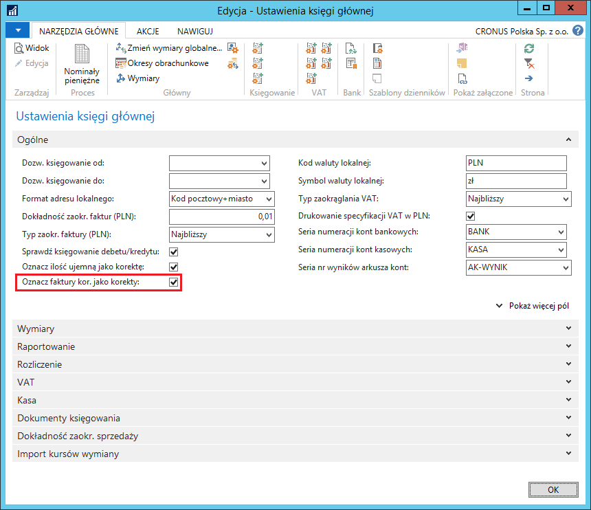{width="6.396227034120735in" height="5.518112423447069in"}
  ------------------------------------------------------------------------------------
  Rysunek 5.26: Ustawienia księgi głównej

> {width="0.19in" height="0.19in"}
> **Uwaga:** Ustawienie **Oznacz faktury kor. jako korekty** w oknie
> **Ustawienia księgi głównej** ma odniesienie również do serwisowych
> faktur korygujących wystawianych w module Serwis. Zasady działania
> i sposób obsługi tego ustawienia są takie same w obydwu modułach:
> Sprzedaż i należności oraz Serwis.

### Obsługa

W celu wystawienia faktury korygującej sprzedaży wykorzystując
ułatwienia Polskiej Lokalizacji, należy postępować według następujących
kroków:

1.  Należy wybrać **Działy \> Sprzedaż i Marketing \> Przetwarzanie
    > zamówień \>** **Faktury korygujące sprzedaży**.

2.  W oknie **Faktury korygujące sprzedaży**, które się otworzy, należy
    > wybrać **Nowe**.

3.  W kartotece nowej faktury korygującej sprzedaży należy nadać jej
    > numer kolejny i z listy rozwijanej w polu **Nr nabywcy
    > (sprzedaż)** wybrać nabywcę, dla którego zostały wystawione
    > faktury sprzedaży podlegające skorygowaniu. W karcie skróconej
    > **Szczegóły faktury korygującej**, z listy rozwijanej w polu
    > **Przyczyna korekty** należy wybrać jedną z wcześniej
    > zdefiniowanych przyczyn korekty. W polu **Filtr dat sprzedaży
    > faktury korygującej** należy ustawić filtr ograniczający okres,
    > z jakiego pochodzą faktury sprzedaży przeznaczone do skorygowania.
    > Pozostałe pola w nagłówku dokumentu należy wypełnić w sposób
    > standardowy.

  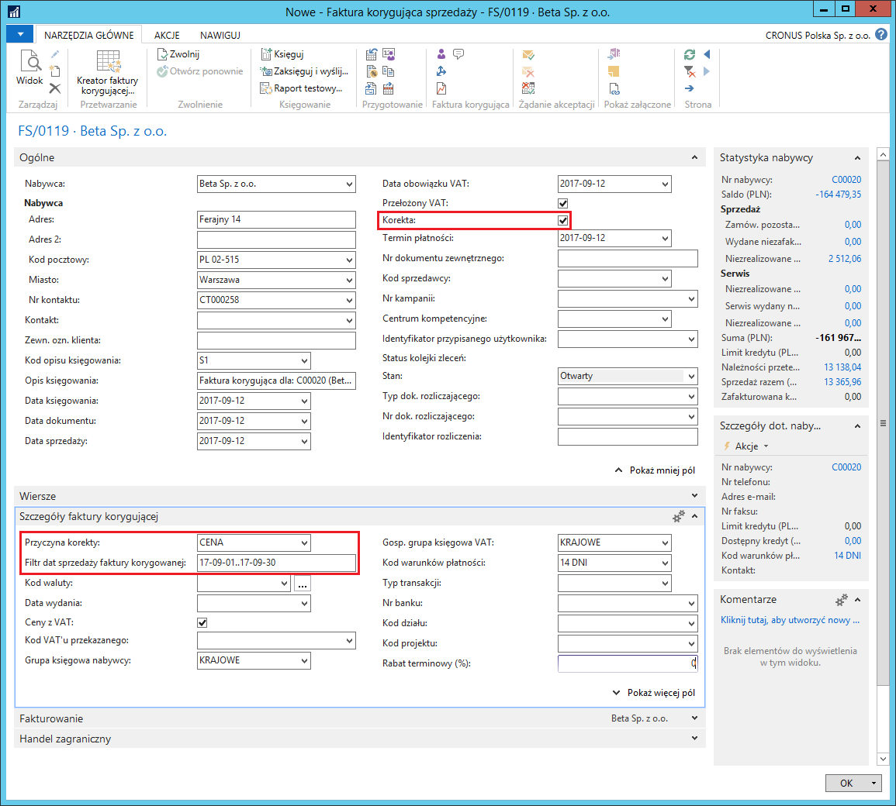{width="6.254746281714786in" height="5.631944444444445in"}
  ------------------------------------------------------------------------------------
  Rysunek 5.27: Nagłówek faktury korygującej sprzedaży

> {width="0.19in" height="0.19in"}
> **Uwaga:** Pole **Korekta** w nagłówku faktury sprzedaży zostało
> zaznaczone automatycznie na podstawie domyślnych ustawień. W sytuacji,
> gdy kwoty z faktury korygującej sprzedaży nie powinny być zaksięgowane
> jako tzw. storno czerwone (np. w przypadku faktur korygujących
> zwiększających), należy ręcznie zdjąć znacznik z pola **Korekta
> w **nagłówku konkretnej faktury korygującej sprzedaży.

4.  Należy wybrać **Kreator faktury korygującej**.

5.  W oknie **Kreator faktury kor. sprzedaży** należy wybrać **Pobierz
    > wiersze faktury korygowanej**.

6.  Otworzy się okno z wierszami sprzedaży pochodzącymi z faktur
    > sprzedaży wystawionych z datą sprzedaży przypadającą w okresie
    > ograniczonym datami w polu **Filtr dat sprzedaży faktury
    > korygującej dla **nabywcy wybranego w polu **Nr nabywcy
    > (sprzedaż)**. Należy w standardowy sposób zaznaczyć wszystkie
    > korygowane wiersze sprzedaży, a następnie wybrać **OK**.

7.  W oknie **Kreator faktury kor. sprzedaży** dla każdego wybranego
    > wcześniej wiersza sprzedaży do korekty, system utworzył 2 wiersze:
    > jeden typu **Przed i **drugi typu **Po**.

8.  W każdym wierszu typu Po należy wprowadzić właściwe zmiany, zgodne
    > z wybraną opcją w polu **Przyczyna korekty**.

  {width="6.377358923884515in" height="3.2609022309711286in"}
  -------------------------------------------------------------------------------------
  Rysunek 5.28: Wiersze Przed/Po faktury korygującej sprzedaży

9.  W okienku informacyjnym można sprawdzić podsumowanie wartości przed
    korektą, po korekcie i różnicę między nimi:

  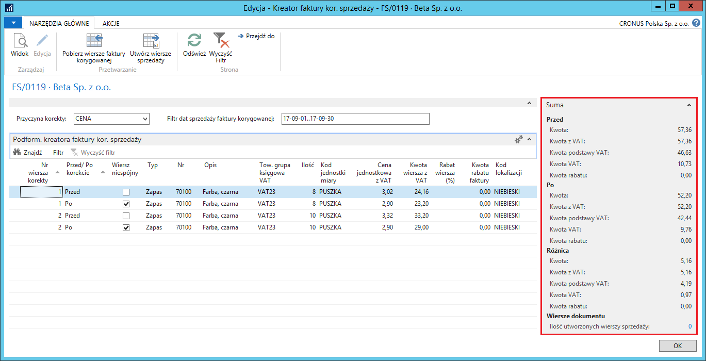{width="6.396227034120735in" height="3.2705489938757655in"}
  -------------------------------------------------------------------------------------
  Rysunek 5.29: Okienko informacyjne wierszy Przed/Po

10. Należy wybrać **Utwórz wiersze sprzedaży**.

11. System, na podstawie zmian wprowadzonych w wierszach typu **Po**,
    > tworzy wiersze w oknie kartoteki faktury korygującej sprzedaży.

  {width="6.358490813648294in" height="5.725358705161855in"}
  ------------------------------------------------------------------------------------
  Rysunek 5.30: Wiersze faktury korygującej sprzedaży

> {width="0.19in" height="0.19in"}
> **Uwaga:** Nie należy modyfikować wierszy sprzedaży utworzonych
> automatycznie przez system, aby nie dopuścić do braku spójności
> pomiędzy danymi w wierszu faktury korygującej sprzedaży a danymi
> w wierszach typu **Przed** i **Po**.

12. Należy w sposób standardowy zaksięgować fakturę korygującą
    > sprzedaży.

13. Należy w sposób standardowy wydrukować fakturę korygującą sprzedaży.
    > Można zauważyć, że jest więcej wierszy na wydruku, gdyż zostały
    > dodane wiersze typu **Przed i Po**:

  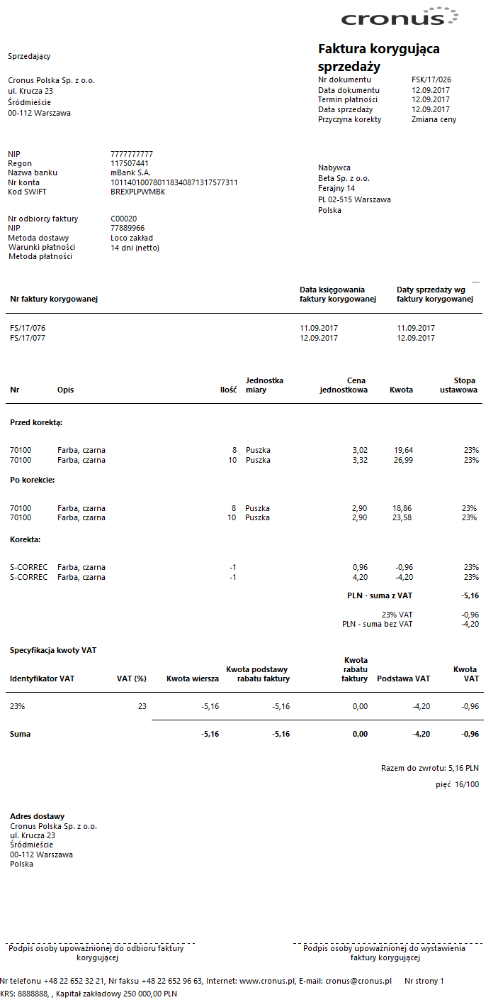{width="4.273765310586176in" height="8.566037839020122in"}
  ------------------------------------------------------------------------------------
  Rysunek 5.31: Wydruk faktury korygującej sprzedaży

#### Korygowanie danych nagłówkowych {#korygowanie-danych-nagłówkowych .Poziom-2}

### Informacje ogólne

Zmiana danych nagłówkowych w zaksięgowanej fakturze sprzedaży lub
fakturze korygującej sprzedaży wymaga wystawienia dokumentu korygującego
-- faktury korygującej. W przypadku zmiany NIP lub danych pozwalających
na identyfikację podmiotu (nazwy kontrahenta, adresu) oraz daty
dokumentu i daty sprzedaży, konieczne jest wykazanie takiej zmiany w
pliku JPK\_VAT włącznie z wystornowaniem kwot podstawy i VAT pod numerem
zaksięgowanego pierwotnie dokumentu i ponownego wykazania w pliku
JPK\_VAT z numerem faktury korygującej oraz prawidłowymi danymi. Zmiana
terminu płatności aktualizuje zapis księgi nabywcy, a zmiany pozostałych
pól są rejestrowane w zaksięgowanych danych przed/po korekcie i nie
wymagają wysyłania korekty pliku JPK\_VAT.

### Ustawienia

W celu zdefiniowania danych dotyczących faktur korygujących dane
nagłówkowe, należy postępować według następujących kroków:

1.  Należy wybrać **Działy \> Sprzedaż i Marketing \> Administracja \>
    Ustawienia sprzedaży i należności**

2.  W oknie **Ustawienia sprzedaży i należności**, które się otworzy,
    należy uzupełnić pola zgodnie z poniższym opisem:

-   **Seria nr faktury kor. dane nagłówka** -- w tym polu należy
    > wprowadzić kod wstępnej numeracji faktur korygujących nagłówek

{width="0.19in" height="0.19in"}
**Uwaga:** dokumenty księgowane są z serią numeracji zaksięgowanych
faktur korygujących sprzedaży lub zgodnie z ustawieniami w szablonach
serii numeracji dokumentów sprzedaży dla typu dokumentu **Faktura
korygująca dane nagłówka**.

  -------------------------------------------------
  Rysunek 5.32: USTAWIENIA SPRZEDAŻy I NALEŻNOŚCI
  -------------------------------------------------

  ------------------------------------------------
  Rysunek 5.33: Szablony serii Nr dok. SPRZEDAŻy
  ------------------------------------------------

W celu zdefiniowania przyczyn korekty danych nagłówkowych, należy
postępować według następujących kroków:

1.  Należy wybrać **Działy \> Sprzedaż i Marketing \> Administracja \>
    Przyczyny korekty sprzedaży -- nagłówek**.

2.  W oknie **Przyczyny korekty sprzedaży -- nagłówek**, które się
    otworzy, należy uzupełnić pola zgodnie z poniższym opisem:

-   **Kod** -- w tym polu należy wprowadzić unikalny kod identyfikujący
    > przyczynę korekty sprzedaży dla danych nagłówka,

```{=html}
<!-- -->
```
-   **Opis** -- w tym polu należy wprowadzić opis przyczyny korekty
    > sprzedaży dla danych nagłówka, zgodny z wprowadzonym wcześniej
    > kodem,

```{=html}
<!-- -->
```
-   **Typ korekty** -- wybrana w tym polu opcja decyduje, czy tworzone
    > są zapisy stornujące błędny dokument w rejestrze VAT (JPK\_VAT),
    > czy zapisywane są tylko zmiany historyczne przed i po korekcie.

> Z listy rozwijanej w tym polu należy wybrać opcję właściwą dla
> wprowadzonego wcześniej kodu. Dostępne są następujące opcje:

-   **NIP i dane ewidencyjne** -- korekta stornuje w zapisach błędne
    > dane i wprowadza zapis z prawidłowymi danymi pod numerem dokumentu
    > korekty,

-   **Dane nagłówka** -- przy zmianie daty w polu **Termin płatności**
    > zmiana zapisywana jest w zapisie księgi nabywcy, dla pozostałych
    > pól zapisane są historyczne dane przed/po dla faktury korygującej
    > dane nagłówka.

{width="0.19in" height="0.19in"}
**Uwaga:** W przypadku zastosowania **Typu korekty**: **NIP i dane
ewidencyjne** można również w tym samym dokumencie zmienić wartości
innych pól.

  ------------------------------------------------------
  Rysunek 5.34: Przyczyny korekty SPRZEDAŻy - nagłówek
  ------------------------------------------------------

### Obsługa

W celu utworzenia dokumentu faktury korygującej dane nagłówkowe, należy
postępować według następujących kroków:

1.  Należy wybrać **Działy \> Zarządzanie Finansami \> Należności \>
    Faktury korygujące sprzedaży -- dane nagłówka**.

2.  W oknie **Faktury korygujące sprzedaży**, które się otworzy, należy
    wybrać **Nowe**.

3.  Otworzy się okno ze zdefiniowanymi przyczynami faktury korygującej
    dane nagłówka, w którym należy zaznaczyć wiersz z wybraną przyczyną
    i potwierdzić klikając przycisk **OK**.

4.  W kartotece nowej faktury korygującej sprzedaży należy nadać jej
    numer kolejny i z listy rozwijanej w polu **Nabywca** wybrać
    nabywcę, dla którego zostały wystawione faktury sprzedaży lub
    faktury korygujące podlegające skorygowaniu. Dane w kartotece
    nabywcy powinny być jak najbardziej aktualne, dla tych danych
    wystawiony będzie dokument.

5.  W karcie skróconej **Ogólne** należy wprowadzić **Datę księgowania**
    faktury korygującej, **Data obowiązku VAT** zostanie uzupełniona na
    podstawie dokumentu korygowanego i musi być zgodna z **Datą
    obowiązku VAT** dla tego dokumentu.

6.  W karcie skróconej **Szczegóły faktury korygującej**, w polu
    **Przyczyna korekty** wyświetli się wybrany wcześniej kod przyczyny
    korekty.

7.  Należy wypełnić pole **Typ dokumentu korygowanego**. Dostępne opcje
    są następujące:

-   **Zaksięgowana faktura**

-   **Zaksięgowana faktura korygująca**

8.  Z rozwijanej listy w polu **Nr dokumentu korygowanego** należy
    wybrać dokument do skorygowania, dane z tego dokumentu wstawione
    zostaną w wierszach jako wiersz danych nagłówkowych **Przed
    korektą** i drugi, jako wiersz danych nagłówkowych **Po korekcie**.

9.  Pole **Filtr dat sprzedaży faktury korygującej** należy wypełnić dla
    faktury korygującej bonusowej wpisując okres, z jakiego pochodzą
    faktury sprzedaży przeznaczone do skorygowania.

10. Pozostałe pola w nagłówku dokumentu należy wypełnić w sposób
    standardowy.

  ----------------------------------------------------------
  Rysunek 5.35: NAgłówek faktury korygującej dane nagłówka
  ----------------------------------------------------------

  ------------------------------------------------------------------
  Rysunek 5.36: wiersze przed/po faktury korygującej dane nagłówka
  ------------------------------------------------------------------

11. W każdym wierszu typu **Po** należy wprowadzić właściwe zmiany,
    > zgodne z wybraną opcją w polu **Przyczyna korekty**. W zależności
    > od wybranego typu faktury korygującej, część pól może być
    > nieedytowalna. Dla typu korekty **Dane nagłówka** nie można
    > zmieniać danych związanych z ewidencją VAT: NIP, nazwy,
    > podstawowych danych adresowych, daty sprzedaży, daty dokumentu.

12. Należy w sposób standardowy zaksięgować fakturę korygującą
    sprzedaży.

13. Po zaksięgowaniu pojawi się komunikat z numerem zaksięgowanej
    > faktury korygującej.

  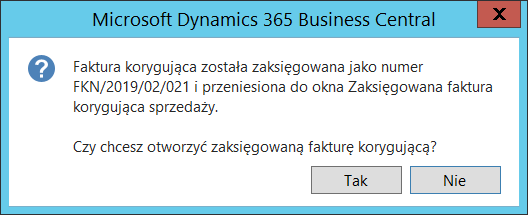{width="4.031629483814523in" height="1.6416666666666666in"}
  -------------------------------------------------------------------------------------
  Rysunek 5.37: Komunikat po zaksiegowaniu faktury korygującej

14. Należy w sposób standardowy wydrukować fakturę korygującą sprzedaży.
    > Można zauważyć, że wszystkie zmiany w polach zostały dodane jako
    > wiersze typu **Przed i Po**:

  ------------------------------------------------------------
  Rysunek 5.38: Zaksięgowane wiersze korekty danych nagłówka
  ------------------------------------------------------------

  ----------------------------------------------------------------------
  Rysunek 5.39: Wydruk zaksięgowanej faktury korygującej dane nagłówka
  ----------------------------------------------------------------------

Wybór konta bankowego na dokumentach sprzedaży {#wybór-konta-bankowego-na-dokumentach-sprzedaży .Poziom-1}
----------------------------------------------

### Informacje ogólne

Wiele firm dysponuje wieloma kontami bankowymi w wielu różnych
instytucjach bankowych, w celu obniżenia kosztów obsługi transakcji
finansowych. Z tego powodu, do standardowej obsługi sprzedaży
w programie Microsoft Dynamics 365 Business Central on‑premises, została
dodana możliwość wyboru konta bankowego spośród zdefiniowanych
w systemie, którego dane mają być drukowane na dokumencie sprzedaży.

### Ustawienia

W celu wybrania konta bankowego, którego dane będą domyślnie drukowane
na dokumentach sprzedaży, należy postępować według następujących kroków:

1.  Należy wybrać **Działy \> Administracja \> Ustawienia aplikacji \>**
    > **Ogólne \>** **Dane firmy**.

2.  W oknie **Dane firmy**, które się otworzy, na karcie skróconej
    > **Płatności**, w polu **Domyślny numer konta bankowego** należy
    > z listy rozwijanej wybrać numer jednego z wcześniej zdefiniowanych
    > kont bankowych, a pozostałe pola z danymi o domyślnym koncie
    > bankowym system uzupełni automatycznie, na podstawie danych
    > wybranego konta bankowego, umieszczonych w jego kartotece.

  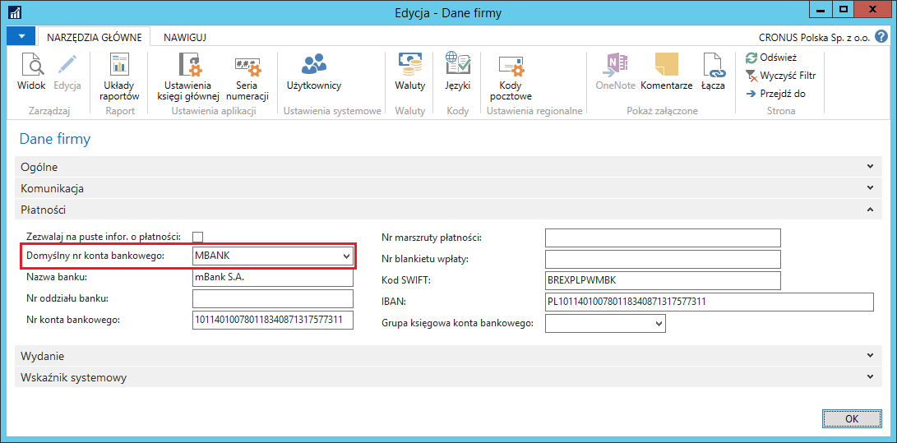{width="6.377358923884515in" height="3.1505238407699037in"}
  -------------------------------------------------------------------------------------
  Rysunek 5.40: Dane firmy

### Obsługa

Konto bankowe wybrane jako domyślne drukowane jest w następujących
dokumentach:

1)  Oferta sprzedaży

2)  Potwierdzenie zamówienie sprzedaży

3)  Wydanie sprzedaży

4)  Faktura sprzedaży

5)  Faktura korygująca sprzedaży

6)  Monit

7)  Nota odsetkowa

W każdym z wyżej wymienionych dokumentów, domyślne konto bankowe może
być zmienione na inne -- jednorazowo dla danego dokumentu, podczas jego
wprowadzania (przed zaksięgowaniem).

W przypadku: oferty sprzedaży, potwierdzenia zamówienia sprzedaży,
wydania sprzedaży, faktury sprzedaży i faktury korygującej sprzedaży
kroki postępowania są następujące:

1.  Należy wybrać **Działy \> Sprzedaż i Marketing \> Przetwarzanie
    > zamówień**

2.  W oknie wprowadzanego dokumentu sprzedaży, na karcie skróconej
    > **Fakturowanie**, pola związane z firmowym kontem bankowym
    > uzupełnione są danymi domyślnego konta bankowego, wybranego
    > w oknie **Dane firmy**. W polu **Nr banku** należy wybrać z listy
    > rozwijanej kod innego konta bankowego niż domyślne. System
    > automatycznie uzupełni w dokumencie sprzedaży dane o wybranym
    > koncie bankowym.

  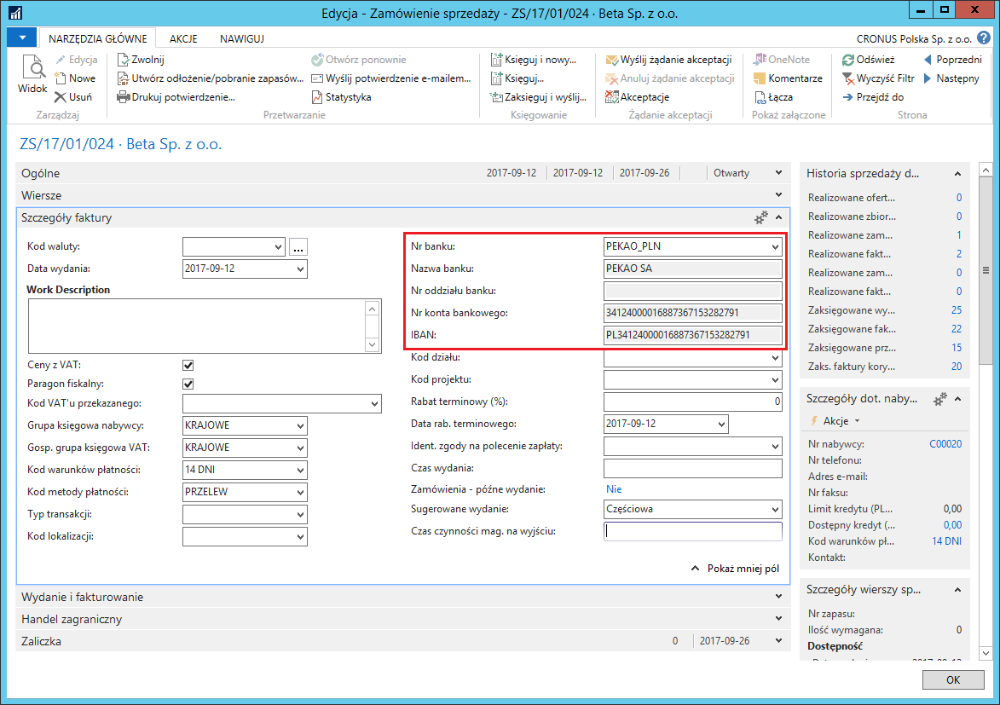{width="6.367925415573054in" height="4.489523184601925in"}
  ------------------------------------------------------------------------------------
  Rysunek 5.41: kartoteka dokumentu sprzedaży

3.  Wybór akcji **Księguj i drukuj** spowoduje przeniesienie informacji
    o wybranym koncie bankowym do zaksięgowanego dokumentu
    oraz umieszczenie ich na wydruku dokumentu.

W przypadku: monitu i noty odsetkowej kroki postępowania są następujące:

1.  Należy wybrać **Działy \> Zarządzanie Finansami \> Działania
    > okresowe \> Należności**

2.  W oknie wprowadzanego dokumentu: monitu lub noty odsetkowej,
    > na karcie skróconej **Księgowanie**, pola związane z firmowym
    > kontem bankowym uzupełnione są danymi domyślnego konta bankowego,
    > wybranego w oknie **Dane firmy**. W polu **Nr banku** należy
    > wybrać z listy rozwijanej kod innego konta bankowego niż domyślne.
    > System automatycznie uzupełni w dokumencie sprzedaży dane
    > o wybranym koncie bankowym.

  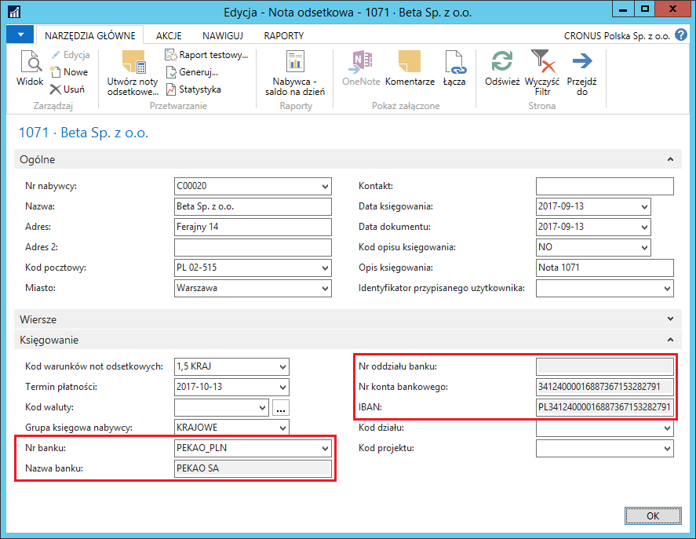{width="6.386792432195976in" height="4.947035214348206in"}
  ------------------------------------------------------------------------------------
  Rysunek 5.42: kartoteka noty odsetkowej

3.  Wybór akcji **Generuj i **zaznaczenie opcji **Drukuj** spowoduje
    przeniesienie informacji o wybranym koncie bankowym
    do wygenerowanego dokumentu oraz umieszczenie ich na wydruku
    dokumentu.

{width="0.19in" height="0.19in"}
**Uwaga:** Dane konta bankowego są przenoszone z Oferty Sprzedaży
do Zamówienia Sprzedaży podczas wykonywania skryptu **Utwórz
zamówienie**. Ponadto, podczas tworzenia nowego dokumentu sprzedaży przy
użyciu funkcji **Kopiuj dokument,** dane o koncie bankowym
są przenoszone z kopiowanego dokumentu.

Noty korygujące {#noty-korygujące .Poziom-1}
---------------

### Informacje ogólne

> Zgodnie z przepisami polskiego prawa, jeśli firma otrzyma fakturę VAT
> z drobnymi błędami, jak np. pomyłka w adresie nabywcy, może wystawić
> notę korygującą, która wskazuje błędne dane i poprawne dane, jakie
> powinny być umieszczone na otrzymanym dokumencie. W ramach Polskiej
> Lokalizacji systemu Microsoft Dynamics 365 Business Central
> on‑premises została zaimplementowana funkcjonalność **Noty
> korygujące** mająca na celu ułatwienie obsługi poprawiania drobnych
> błędów, o których mowa wyżej.

### Ustawienia

> Dla not korygujących, podobnie jak dla wszystkich innych dokumentów
> księgowanych w Microsoft Dynamics 365 Business Central on‑premises,
> konieczne jest zdefiniowanie w standardowy sposób 2 serii
> numeracyjnych: serii numeracji przed zaksięgowaniem i serii numeracji
> po zaksięgowaniu. Następnie serie należy przypisać jako domyślne
> dla wystawiania not korygujących. W tym celu należy postępować
> według następujących kroków:

1.  Należy wybrać **Działy \> Zarządzanie Finansami \> Administracja \>
    > Ustawienia zakupów i zobowiązań.**

2.  W oknie **Ustawienia zakupów i zobowiązań**, które się otworzy,
    > na karcie skróconej **Numeracja**, należy w polach **Seria nr not
    > koryg.** i **Seria nr wygen. not kor.** wybrać odpowiednie,
    > wcześniej zdefiniowane serie numeracji:

  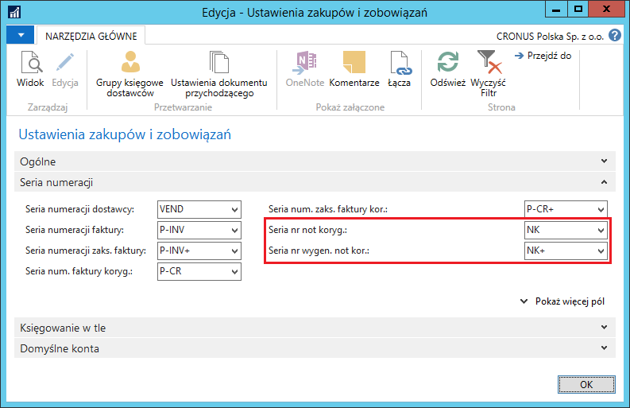{width="6.37290135608049in" height="4.122641076115485in"}
  -----------------------------------------------------------------------------------
  Rysunek 5.43: Ustawienia zakupów i zobowiązań

### Obsługa

> Do wystawiania not korygujących przeznaczone jest specjalne okno.
> Aby je otworzyć, należy postępować według następujących kroków:

1.  Należy wybrać **Działy \> Zarządzanie Finansami \> Zobowiązania \>
    Noty korygujące**.

2.  W oknie **Noty korygujące**, które się otworzy, należy wybrać
    **Nowe.**

3.  W oknie nowej noty korygującej niektóre pola wypełniane
    są automatycznie, inne należy wypełnić, a niektóre można pozostawić
    puste.

> Pola na karcie skróconej **Ogólne**:

-   **Nr** -- w tym polu automatycznie pojawi się numer kolejny
    > dokumenty, nadany przez system zgodnie z przypisaną serią
    > numeracji

-   **Nr dostawcy (zakup)** - z listy rozwijanej w tym polu należy
    > wybrać dostawcę, który dostarczył fakturę z drobnymi błędami.

-   Pozostałe pola dotyczące dostawcy są nieedytowalne, zawierają jego
    > dane podstawowe oraz dane adresowe pobrane z kartoteki dostawcy
    > wybranego w polu **Nr dostawcy (zakup).**

-   **Data dokumentu** i **Data księgowania** -- są to daty dotyczące
    > wystawianej noty korygującej. Pola uzupełniane są automatycznie
    > datą roboczą, ale można je zmienić na inne.

-   **Nr faktury korygowanej** -- z listy rozwijanej w tym polu należy
    > wybrać zaksięgowaną fakturę od dostawcy, podlegającą korekcie.
    > Lista ograniczona jest do faktur zakupu od dostawcy wybranego
    > w polu **Nr dostawcy (zakup)**.

-   Pola: **Nr faktury dostawcy, Data dokumentu fak. kor. i Data
    > przyjęcia dokumentu fak. kor.** są nieedytowalne, uzupełniane
    > automatycznie przez system danymi pobranymi z dokumentu wybranego
    > w polu **Nr faktury korygowanej**.

> Pola na karcie skróconej **Korekta** pogrupowane są w 2 kolumnach:
> **Przed korektą** i **Powinno być**. W polach **Tekst** w kolumnie
> **Przed korektą** należy wprowadzić błędne dane do skorygowania,
> przepisując je z faktury od dostawcy, a w odpowiadających im polach
> **Tekst** w kolumnie **Powinno być**, należy wprowadzić poprawne dane.

  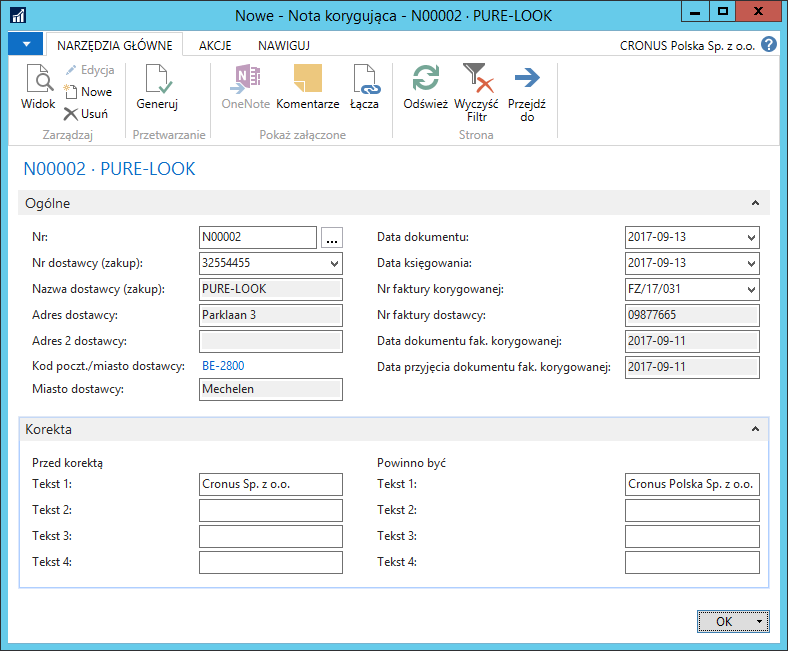{width="6.337455161854768in" height="5.23584864391951in"}
  -----------------------------------------------------------------------------------
  Rysunek 5.44: Nota korygująca

4.  Tak przygotowaną notę korygującą należy wygenerować i wydrukować,
    > w tym celu należy wybrać **Generuj**.

5.  W oknie wstępnym skryptu **Wygeneruj noty korygujące**, które się
    otworzy, należy wprowadzić właściwe parametry:

-   **Drukuj** -- pole należy zaznaczyć, jeśli noty korygujące powinny
    > być wydrukowane w trakcie generowania. Noty wygenerowane bez
    > drukowania można wydrukować później, w innym oknie, co będzie
    > opisane w dalszej części rozdziału.

-   **Zamień datę księgowania** -- pole należy zaznaczyć, jeśli
    > w trakcie generowania not korygujących, data księgowania
    > wprowadzona na nocie korygującej ma zostać zamieniona na inną,
    > podana ręcznie w następnym polu.

-   **Data księgowania** -- jest to pole współpracujące z polem powyżej.
    > Należy wprowadzić w nim datę księgowania, na jaką ma zostać
    > zamieniona data księgowania wprowadzona wcześniej w nocie
    > korygującej.

-   **Filtr nr not korygujących** -- z listy rozwijanej w tym polu można
    > wybrać noty korygujące, które zostały poprawnie wprowadzone
    > i powinny być wygenerowane w tym samym czasie. Pozostawienie pola
    > pustego spowoduje wygenerowanie tylko jednej noty odsetkowej,
    > z której uruchomiony został skrypt **Wygeneruj noty korygujące.**

> {width="0.19in" height="0.19in"}
> **Uwaga:** Skrypt **Wygeneruj noty korygujące** domyślnie dotyczy
> jednej noty korygującej, w oknie której jest uruchomiony. Zmiana daty
> księgowania odnosi się do wszystkich not korygujących podlegających
> generowaniu, czyli tych, które zostały wybrane w polu **Filtr nr not
> korygujących** lub do jednej, jeśli pole to pozostało puste. Oznacza
> to, że nawet jeśli noty korygujące były tworzone w różnych odstępach
> czasu, z różnymi datami, to zmiana daty księgowania podczas
> ich generowania spowoduje, że w księgach będą widniały z tą samą datą.
> W przeciwnym wypadku, każda z wygenerowanych not korygujących zostanie
> zapisana z datą księgowania, jaka była umieszczona w jej nagłówku
> podczas generowania.

6.  Po wybraniu **OK** noty zostaną wygenerowane i wydrukowane, jeśli
    > została zaznaczona opcja **Drukuj**.

  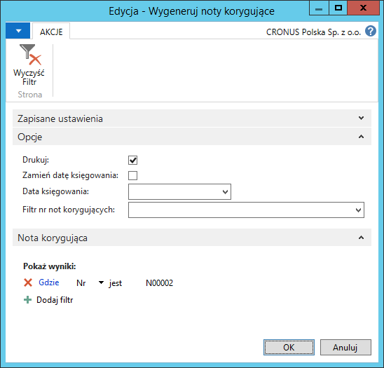{width="4.602362204724409in" height="4.409448818897638in"}
  ------------------------------------------------------------------------------------
  Rysunek 5.45: Generowanie noty korygującej

> Notę korygującą można wydrukować nie tylko podczas generowania, ale
> też po wygenerowaniu. W tym celu należy postępować
> według następujących kroków:

1.  Należy wybrać **Działy \> Zarządzanie Finansami \> Zobowiązania \>
    > Wygenerowane noty korygujące.**

2.  W oknie **Wygenerowane noty korygujące**, które się otworzy, należy
    > zaznaczyć wiersz z wybraną notą korygującą i wybrać **Drukuj**.

  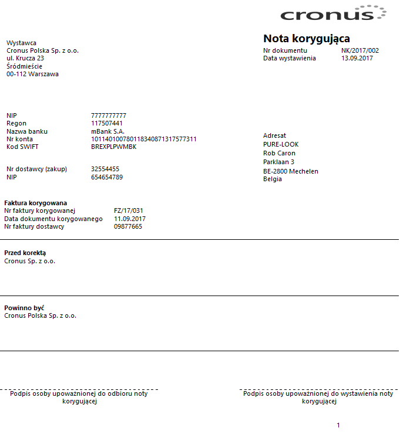{width="6.355761154855643in" height="6.801886482939633in"}
  ------------------------------------------------------------------------------------
  Rysunek 5.46: Wydruk noty korygującej

Faktura rozliczenia zaliczki pracowniczej {#faktura-rozliczenia-zaliczki-pracowniczej .Poziom-1}
-----------------------------------------

### Informacje ogólne

> Większość firm wypłaca swoim pracownikom zaliczki na zakupy dokonywane
> przez nich w imieniu firmy. Rozliczane są one później z fakturami
> potwierdzającymi zakup. Do obsługi procesu rozliczenia zaliczki
> pracowniczej w standardowej funkcjonalności Microsoft Dynamics 365
> Business Central on‑premises konieczne jest wykonanie 2 lub więcej
> księgowań. W ramach Polskiej Lokalizacji udostępnione zostało
> ułatwienie, dzięki któremu użytkownik dokonuje tylko jednego
> księgowania, osiągając ten sam efekt.

### Obsługa

Aby móc rozliczać faktury zakupu z zaliczkami pracowników, należy
przygotować dla nich kartoteki dostawców. W tym celu, należy postępować
według następujących kroków:

1.  W standardowy sposób założyć nową kartotekę dostawcy, uzupełniając
    > ją danymi pracownika (wystarczy imię i nazwisko, dane adresowe
    > oraz NIP nie są konieczne). Pola z grupami księgowymi należy
    > wypełnić w taki sam sposób, jak dla dostawców.

2.  W kartotece dostawcy założonej dla pracownika, na karcie skróconej
    > **Fakturowanie** należy zaznaczyć pole **Pracownik**:

  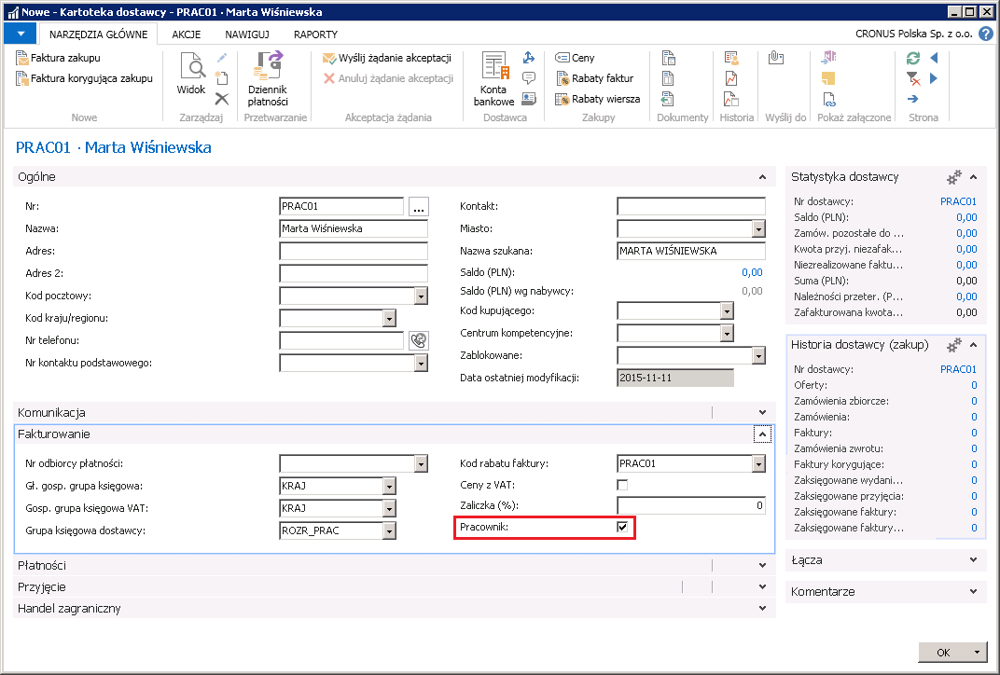{width="6.386792432195976in" height="4.313132108486439in"}
  ------------------------------------------------------------------------------------
  Rysunek 5.47: Kartoteka dostawcy -- pracownika

Aby rozliczyć zaliczkę pracownika, należy wprowadzić fakturę zakupu
dostarczona przez pracownik. W tym celu, należy postępować
według następujących kroków:

1.  W kartotece nowej faktury zakupu, z listy rozwijanej w polu **Nr
    > dostawcy (zakup)** na karcie skróconej **Ogólne** należy wybrać
    > wcześniej zdefiniowaną kartotekę pracownika -- dostawcy.

2.  Dane pracownika wprowadzone w jego kartotece zostaną skopiowane
    > do faktury, a pole **Zaliczka pracownika** na karcie skróconej
    > **Fakturowanie** zostanie automatycznie zaznaczone.

  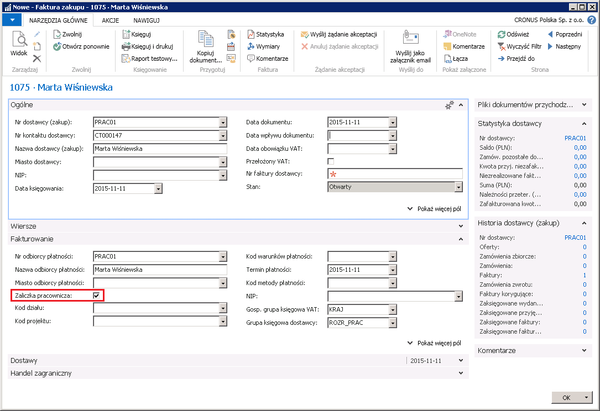{width="6.386792432195976in" height="4.379319772528434in"}
  ------------------------------------------------------------------------------------
  Rysunek 5.48: Kartoteka faktury zakupu -- zaliczka pracownicza

3.  Aby w rejestrze VAT pojawiły się dane rzeczywistego dostawcy,
    zamiast danych pracownika, należy w polu **NIP** rozwinąć listę
    **Kontrahentów VAT** *i *wybrać jednego z nich. W razie potrzeby,
    dane dostawcy mogą zostać dopisane do listy **Kontrahentów VAT**
    (sposób dodawania kontrahentów VAT opisany jest w rozdziale
    **Księgowanie dokumentów z VAT w dziennikach głównych***).* System
    automatycznie skopiuje dane kontrahenta VAT do nagłówka faktury
    zakupu.

  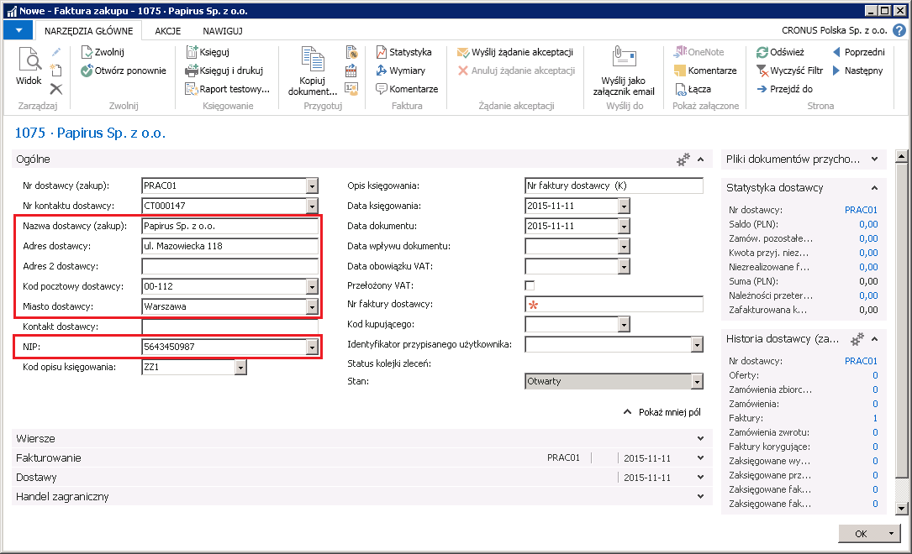{width="6.386792432195976in" height="3.455870516185477in"}
  ------------------------------------------------------------------------------------
  Rysunek 5.49: Kartoteka faktury zakupu -- dane dostawcy

4.  Pozostałe dane o fakturze należy uzupełnić w sposób standardowy,
    a następnie ją zaksięgować. W wyniku księgowania, dane dostawcy
    (kontrahenta VAT) z faktury zakupu zostają skopiowane do **Zapisów
    VAT**, a tym samym do **Rejestru VAT sprzedaży/zakupu:**

  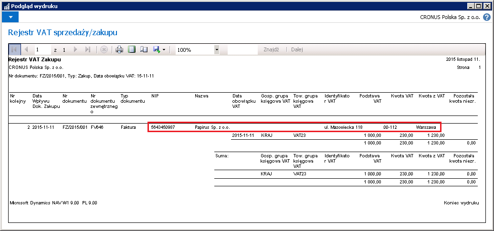{width="6.396227034120735in" height="2.76759842519685in"}
  -----------------------------------------------------------------------------------
  Rysunek 5.50: dane dostawcy w rejestrze VAT zakupu/sprzedaży

> {width="0.19in" height="0.19in"}
> **Uwaga:** Funkcjonalność do ewidencjonowania faktur rozliczenia
> zaliczki pracowniczej dostępna jest również w **Zamówieniach zakupu**.

Szablony nabywców i dostawców {#szablony-nabywców-i-dostawców .Poziom-1}
-----------------------------

### Informacje ogólne

Standardowa funkcjonalność Microsoft Dynamics 365 Business Central
on‑premises umożliwia wykorzystanie **szablonu nabywcy** podczas
tworzenia kartoteki nabywcy z kartoteki wcześniej wprowadzonego
kontaktu. Polska Lokalizacja zawiera dwie istotne modyfikacje w tym
obszarze:

-   Możliwość definiowania domyślnej serii numeracji w ramach **szablonu
    > nabywcy**.

-   Obsługę **szablonów dostawców**, na wzór szablonów nabywców,
    > włącznie z domyślną serią numeracji.

### Ustawienia

W celu przypisania domyślnej serii numeracji do **Szablonu nabywcy**,
należy postępować według następujących kroków:

1.  Należy wybrać **Działy \> Sprzedaż i Marketing \> Administracja \>
    > Szablony nabywcy.**

2.  W oknie **Lista szablonów nabywcy**, które się otworzy, należy
    > zaznaczyć wiersz z wybranym szablonem i wybrać **Edycja**.

3.  W kartotece wybranego szablonu nabywcy, z listy rozwijanej w polu
    > **Seria numeracji** należy wybrać jedną z wcześniej zdefiniowanych
    > serii numeracji, przeznaczoną do numerowania kartotek zakładanych
    > przy użyciu danego szablonu.

  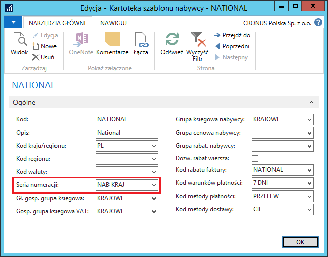{width="5.456692913385827in" height="4.283464566929134in"}
  ------------------------------------------------------------------------------------
  Rysunek 5.51: Kartoteka szablonu nabywcy

W celu zdefiniowania **Szablonu dostawcy**, należy postępować
według następujących kroków:

1.  Należy wybrać **Działy \> Zakup \> Administracja \> Szablony
    > dostawcy.**

2.  W oknie **Lista szablonów dostawcy**, które się otworzy, należy
    > wybrać **Nowe**.

3.  W nowej kartotece szablonu dostawcy należy uzupełnić pola domyślnymi
    > parametrami, które będą kopiowane do kartoteki dostawcy podczas
    > jej tworzenia z kartoteki kontaktu, z wykorzystaniem tego
    > szablonu.

  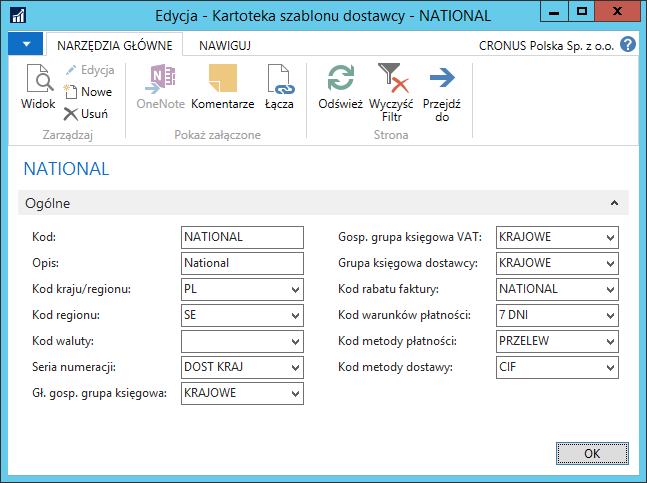{width="5.460629921259843in" height="4.074803149606299in"}
  ------------------------------------------------------------------------------------
  Rysunek 5.52: Kartoteka szablonu dostawcy

### Obsługa

W celu utworzenia kartoteki nabywcy z kartoteki kontaktu
z wykorzystaniem wybranego **Szablonu nabywcy**, należy postępować
według następujących kroków:

1.  Należy wybrać **Działy \> Sprzedaż i Marketing \> Marketing \>
    > Kontakty.**

2.  W oknie **Kontakty**, które się otworzy, należy zaznaczyć wiersz
    > z wybranym kontaktem i wybrać **Utwórz jako \> Nabywca**.

3.  Należy odpowiedzieć twierdząco na pytanie wyświetlone w komunikacie:

  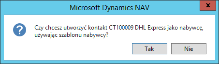{width="4.7194083552056in" height="1.375191382327209in"}
  ----------------------------------------------------------------------------------
  Rysunek 5.53: Komunikat z pytaniem o szablon nabywcy

4.  W oknie **Lista szablonów nabywcy** należy zaznaczyć wiersz
    z szablonem, którego domyślne parametry (m.in. **Seria numeracji**)
    mają być wykorzystane do utworzenia kartoteki nabywcy

  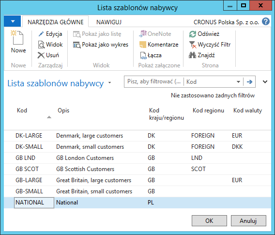{width="4.818897637795276in" height="4.1141732283464565in"}
  -------------------------------------------------------------------------------------
  Rysunek 5.54: Lista szablonów nabywcy

5.  Poprawne utworzenie kartoteki nabywcy system sygnalizuje
    komunikatem:

  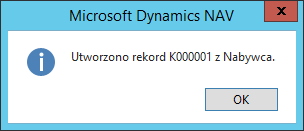{width="3.167108486439195in" height="1.3647736220472442in"}
  -------------------------------------------------------------------------------------
  Rysunek 5.55: Potwierdzenie utworzenia kartoteki nabywcy

6.  Numer kartoteki nowego nabywcy został nadany zgodnie z domyślną
    serią numeracji przypisaną do **Szablonu nabywcy**:

  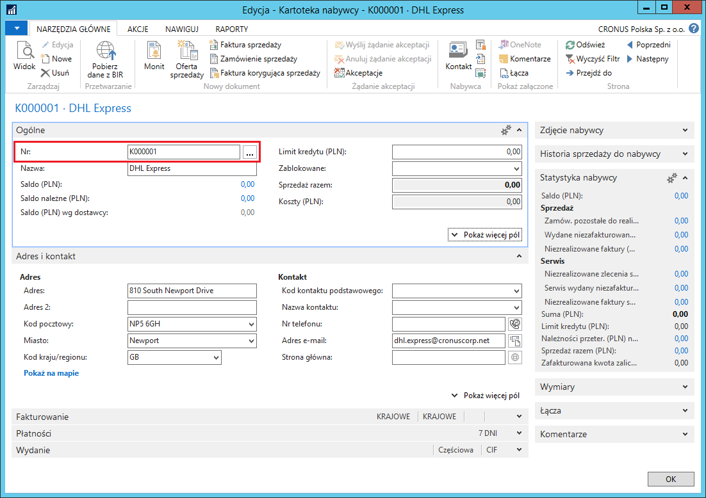{width="6.405660542432196in" height="4.5222867454068245in"}
  -------------------------------------------------------------------------------------
  Rysunek 5.56: Kartoteka nabywcy

W celu utworzenia kartoteki dostawcy z kartoteki kontaktu
z wykorzystaniem wybranego **Szablonu dostawcy**, należy postępować
według następujących kroków:

1.  Należy wybrać **Działy \> Sprzedaż i Marketing \> Marketing \>
    > Kontakty.**

2.  W oknie **Kontakty**, które się otworzy, należy zaznaczyć wiersz
    > z wybranym kontaktem i wybrać **Utwórz jako \> Dostawca**.

3.  Należy odpowiedzieć twierdząco na pytanie wyświetlone w komunikacie:

  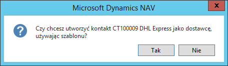{width="4.750662729658792in" height="1.375191382327209in"}
  ------------------------------------------------------------------------------------
  Rysunek 5.57: Komunikat z pytaniem o szablon dostawcy

4.  W oknie **Lista szablonów dostawcy** należy zaznaczyć wiersz
    z szablonem, którego domyślne parametry mają być wykorzystane
    do utworzenia kartoteki dostawcy

  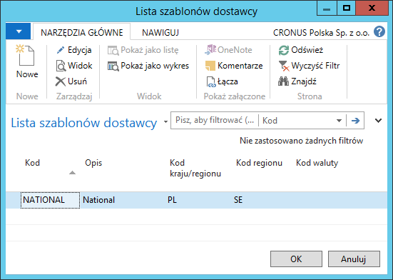{width="4.665354330708661in" height="3.3188976377952755in"}
  -------------------------------------------------------------------------------------
  Rysunek 5.58: Lista szablonów dostawcy

5.  Poprawne utworzenie kartoteki dostawcy system sygnalizuje
    komunikatem:

  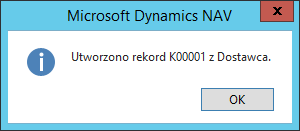{width="3.125436351706037in" height="1.3647736220472442in"}
  -------------------------------------------------------------------------------------
  Rysunek 5.59: Potwierdzenie utworzenia kartoteki dostawcy

6.  Niektóre pola w kartotece nowego dostawcy zostały wypełnione zgodnie
    z domyślnymi parametrami przypisanymi do **Szablonu dostawcy**:

  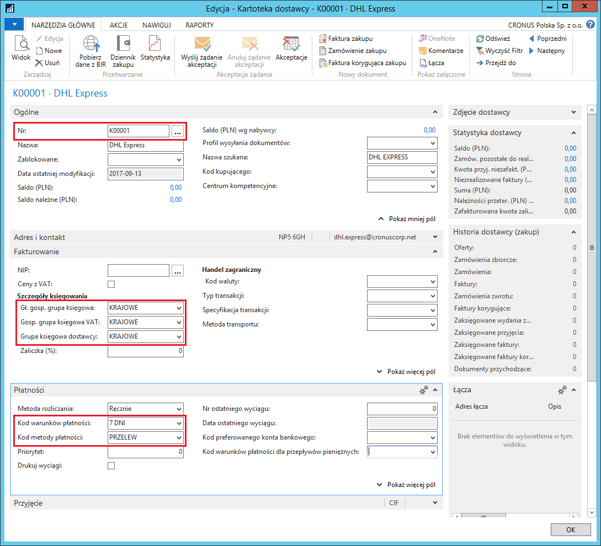{width="6.320754593175853in" height="5.7460793963254595in"}
  -------------------------------------------------------------------------------------
  Rysunek 5.60: Kartoteka dostawcy

 {#section-11 .list-paragraph}

Wiele kont należności/zobowiązań {#wiele-kont-należnościzobowiązań .Poziom-1}
--------------------------------

### Informacje ogólne

Każdy nabywca (dostawca) zwykle ma zdefiniowaną w systemie jedną
kartotekę. Może być ona powiązana z jedną grupą księgową nabywcy
(dostawcy), czyli z jednym kontem K/G należności (zobowiązań). Często
zdarza się jednak, że należności (zobowiązania) jednego nabywcy
(dostawcy) księgowane powinny być na różne konta K/G, w zależności
od typu operacji gospodarczej, np. zobowiązania (należności) wynikające
z bieżącej działalności i wpłacone kaucje. Polska Lokalizacja zawiera
ułatwienie obsługi różnych typów należności (zobowiązań) w postaci
**Zastępczych grup księgowych**. Ułatwienie polega na tym,
że w kartotece nabywcy (dostawcy) przypisana jest domyślna grupa
księgowa, która kopiowana jest do wszystkich dokumentów, ale użytkownik
może zmienić tą grupę na wprowadzanym dokumencie, bez konieczności
zmiany domyślnej grupy księgowej nabywcy (dostawcy) w jego kartotece.

Możliwość zmiany grupy księgowej nabywcy (dostawcy) zależy od właściwych
ustawień i dotyczy dokumentów wprowadzanych w oknach:

-   Zamówienie sprzedaży

-   Faktura sprzedaży

-   Zamówienie zwrotu sprzedaży

-   Faktura korygująca sprzedaży

-   Nota odsetkowa

-   Faktura serwisowa

-   Serwisowa faktura korygująca

-   Zamówienie zakupu

-   Faktura zakupu

-   Zamówienie zwrotu zakupu

-   Faktura korygująca zakupu

-   Dziennik główny

-   Dziennik sprzedaży

-   Dziennik wpłat

-   Dziennik zakupu

-   Dziennik płatności

-   Wpłata gotówkowa

-   Wypłata gotówkowa

-   Dziennik wyciągów bankowych

### Ustawienia

### W celu uniknięcia pomyłek przy zamianach grup księgowych nabywców (dostawców), należy zdefiniować właściwe kombinacje możliwych zamian. Dla jednej grupy księgowej można przypisać wiele grup substytutów, pamiętając o tym, aby relacje te były ustawione wzajemnie, tzn. np. dla grupy należności głównych ustawić substytut kaucji, a dla kaucji ustawić substytut należności głównych. Brak tego drugiego przykładowego ustawienia będzie skutkował tym, że w dokumencie możliwa będzie zamiana grupy księgowej z należności głównych na kaucje, ale nie będzie możliwe odwrócenie tej zamiany, gdyż kaucje nie będą miały zdefiniowanych substytutów, którymi mogą być zastąpione.

W celu zdefiniowania substytutów grup księgowych nabywców, należy
postępować według następujących kroków:

1.  Należy wybrać: **Działy \> Zarządzanie Finansami \> Administracja \>
    > Grupy księgowe nabywców**

2.  W oknie **Grupy księgowe nabywców**, które się otworzy, należy
    > zaznaczyć wybrany wiersz i wybrać **Substytuty**.

  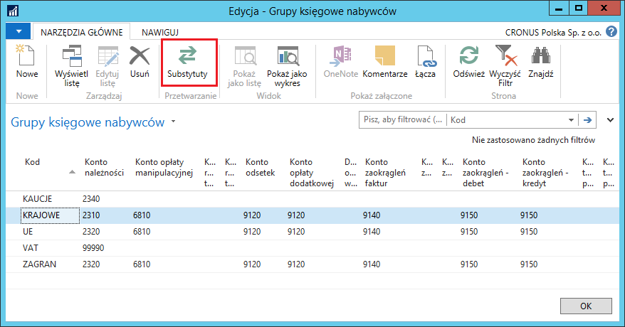{width="6.396227034120735in" height="3.351185476815398in"}
  ------------------------------------------------------------------------------------
  Rysunek 5.61: Grupy księgowe nabywców

3.  W oknie **Zastępcze grupy księgowe nabywcy**, które się otworzy,
    > w polu **Grupa księgowa nabywcy** należy w kolejnych wierszach
    > wybrać z listy rozwijanej te grupy księgowe nabywców, na jakie
    > może być zamieniana grupa, dla której definiowane są substytuty:

  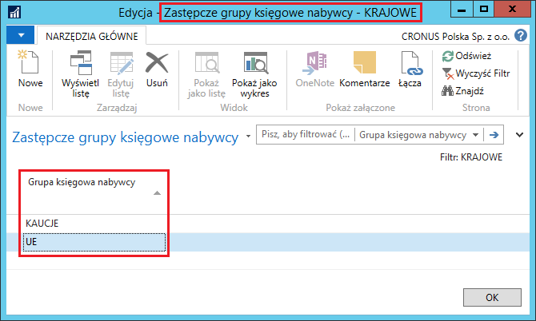{width="5.653543307086614in" height="3.3897637795275593in"}
  -------------------------------------------------------------------------------------
  Rysunek 5.62: Zastępcze grupy księgowe nabywcy

> Czynności opisane w punktach 2. i 3. należy powtórzyć dla wszystkich
> grup księgowych nabywców, które mogą być zamieniane.

W celu zdefiniowania substytutów grup księgowych dostawców, należy
postępować według następujących kroków:

1.  Należy wybrać: **Działy \> Zarządzanie Finansami \> Administracja \>
    > Grupy księgowe dostawców**

2.  W oknie **Grupy księgowe dostawców**, które się otworzy, należy
    > zaznaczyć wybrany wiersz i wybrać **Substytuty**.

  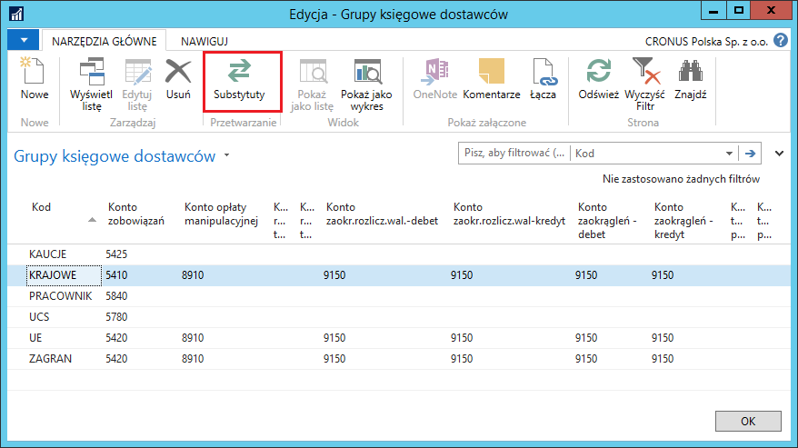{width="6.396227034120735in" height="3.5917279090113734in"}
  -------------------------------------------------------------------------------------
  Rysunek 5.63: Grupy księgowe dostawców

3.  W oknie **Zastępcze grupy księgowe dostawcy**, które się otworzy,
    > w polu **Grupa księgowa dostawcy** należy w kolejnych wierszach
    > wybrać z listy rozwijanej te grupy księgowe dostawców, na jakie
    > może być zamieniana grupa, dla której definiowane są substytuty:

  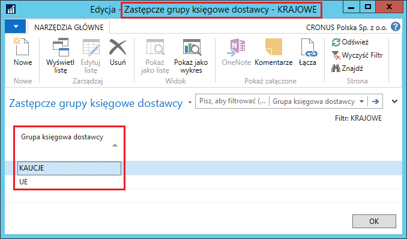{width="5.716535433070866in" height="3.354330708661417in"}
  ------------------------------------------------------------------------------------
  Rysunek 5.64: Zastępcze grupy księgowe dostawcy

> Czynności opisane w punktach 2. i 3. należy powtórzyć dla wszystkich
> grup księgowych dostawców, które mogą być zamieniane.
>
> Drugim ustawieniem związanym z funkcjonalnością zastępczych grup
> księgowych, jest pozwolenie na jej wykorzystanie w poszczególnych
> obszarach: Sprzedaży, Zakupów i Serwisu.
>
> W celu umożliwienia zamiany grup księgowych w dokumentach sprzedaży,
> należy postępować według następujących kroków:

1.  Należy wybrać **Działy \> Sprzedaż i Marketing \> Administracja \>
    > Ustawienia sprzedaży i należności.**

2.  W oknie **Ustawienia sprzedaży i należn.**, które się otworzy,
    > na karcie skróconej **Ogólne** należy zaznaczyć pole **Dozw.
    > zmienianie grup księgowych**.

  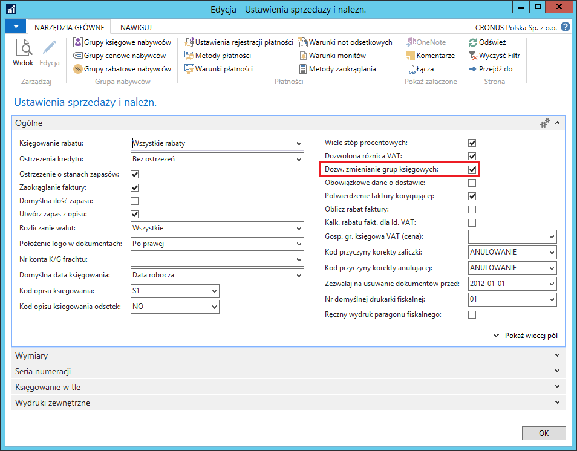{width="6.396227034120735in" height="5.001493875765529in"}
  ------------------------------------------------------------------------------------
  Rysunek 5.65: Ustawienia sprzedaży i należności

> W celu umożliwienia zamiany grup księgowych w dokumentach zakupu,
> należy postępować według następujących kroków:

1.  Należy wybrać **Działy \> Zakup \> Administracja \> Ustawienia
    > zakupów i zobowiązań.**

2.  W oknie **Ustawienia zakupów i zobowiązań**, które się otworzy,
    > na karcie skróconej **Ogólne** należy zaznaczyć pole **Dozw.
    > zmienianie grup księgowych**.

  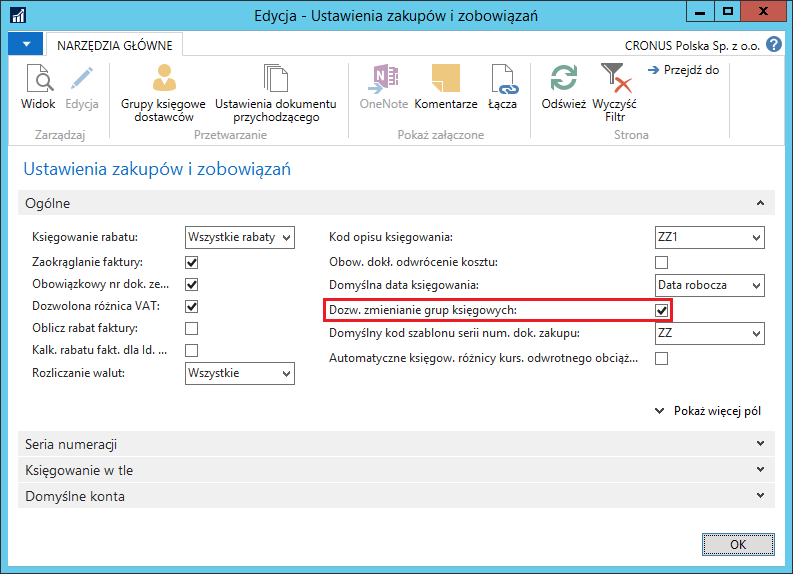{width="6.405660542432196in" height="4.6365758967629045in"}
  -------------------------------------------------------------------------------------
  Rysunek 5.66: Ustawienia zakupów i zobowiązań

> W celu umożliwienia zamiany grup księgowych w dokumentach serwisu,
> należy postępować według następujących kroków:

1.  Należy wybrać **Działy \> Serwis \> Administracja \> Ustawienia
    > serwisu**

2.  W oknie **Ustawienia zarz. serwisem**, które się otworzy, na karcie
    > skróconej **Ogólne** należy zaznaczyć pole **Dozw. zmienianie grup
    > księgowych nabywcy:**

  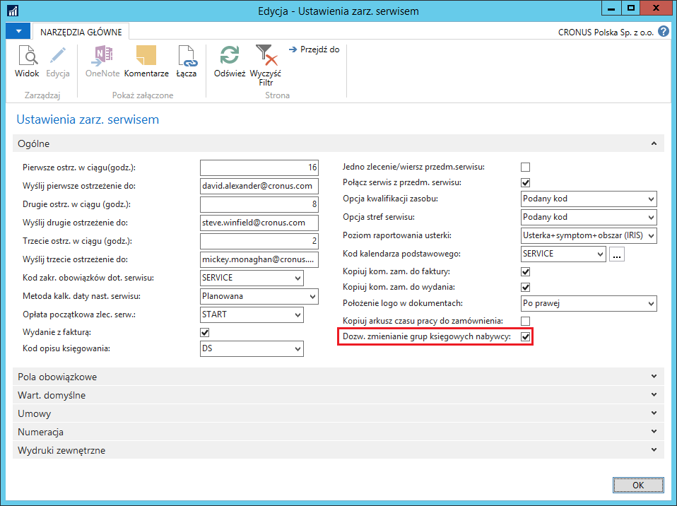{width="6.387527340332459in" height="4.773584864391951in"}
  ------------------------------------------------------------------------------------
  Rysunek 5.67: Ustawienia serwisu

### Obsługa

### [Księgowanie dokumentu ze zmienioną grupą księgową.]{.underline}

### Żeby zaksięgować dokument sprzedaży, zakupu lub serwisu ze zmienioną grupą księgową nabywcy, należy postępować według następujących kroków (przykład bazuje na zamówieniu sprzedaży):

1.  Należy wybrać **Działy \> Sprzedaż i Marketing \> Przetwarzanie
    > zamówień \> Zamówienia sprzedaży \> Nowe.**

2.  W oknie **Zamówienie sprzedaży**, które się otworzy, należy
    > standardowo uzupełnić dane nagłówkowe.

3.  Na karcie **skróconej Fakturowanie, w polu Grupa księgowa nabywcy
    > widnieje kod grupy księgowej przypisanej do kartoteki wybranego
    > nabywcy jako domyślna. Z listy rozwijanej w tym polu należy wybrać
    > jedną z grup księgowych nabywcy, zdefiniowanych jako substytuty
    > grupy domyślnej:**

  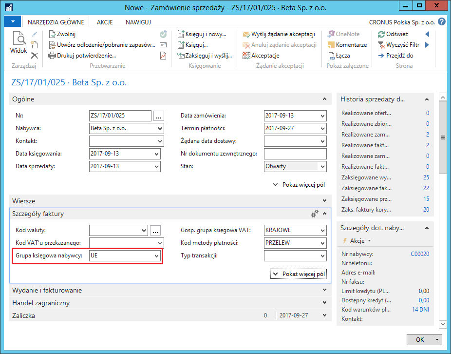{width="6.400953630796151in" height="5.018867016622922in"}
  ------------------------------------------------------------------------------------
  Rysunek 5.68: zastępcza grupa księgowa w zamówieniu sprzedaży

> Wybranie w tym polu grupy księgowej, która nie jest zdefiniowana jako
> substytut grupy księgowej podlegającej zamianie, spowoduje
> wyświetlenie komunikatu o błędzie.

{width="0.19in"
height="0.19in"}**Uwaga:** Pole **Grupa księgowa nabywcy** wyświetlone
jest w następujących dokumentach: **Zamówienie sprzedaży, Faktura
sprzedaży, Faktura korygująca sprzedaży, Zamówienie zwrotu sprzedaży,
Nota odsetkowa, Faktura serwisowa i Serwisowa faktura korygująca.** Pole
**Grupa księgowa dostawcy** wyświetlone jest w następujących
dokumentach: **Zamówienie zakupu, Faktura zakupu, Faktura korygująca
zakupu, Zamówienie zwrotu zakupu.**

4.  Należy standardowo wprowadzić wiersze dokumentu sprzedaży.

5.  Należy standardowo zaksięgować dokumenty sprzedaży (z zamówienia
    > sprzedaży powinny zostać zaksięgowane 2 dokumenty: wydanie
    > sprzedaży i faktura sprzedaży).

6.  Po zaksięgowaniu dokumentów sprzedaży należy je wyświetlić w formie
    > kartoteki, żeby sprawdzić grupę księgową, z jaką dokumenty zostały
    > zaksięgowane. W celu wyświetlenia zaksięgowanej faktury sprzedaży
    > należy wybrać **Działy \> Sprzedaż i Marketing \> Archiwum \>
    > Zaksięgowane faktury sprzedaży**

  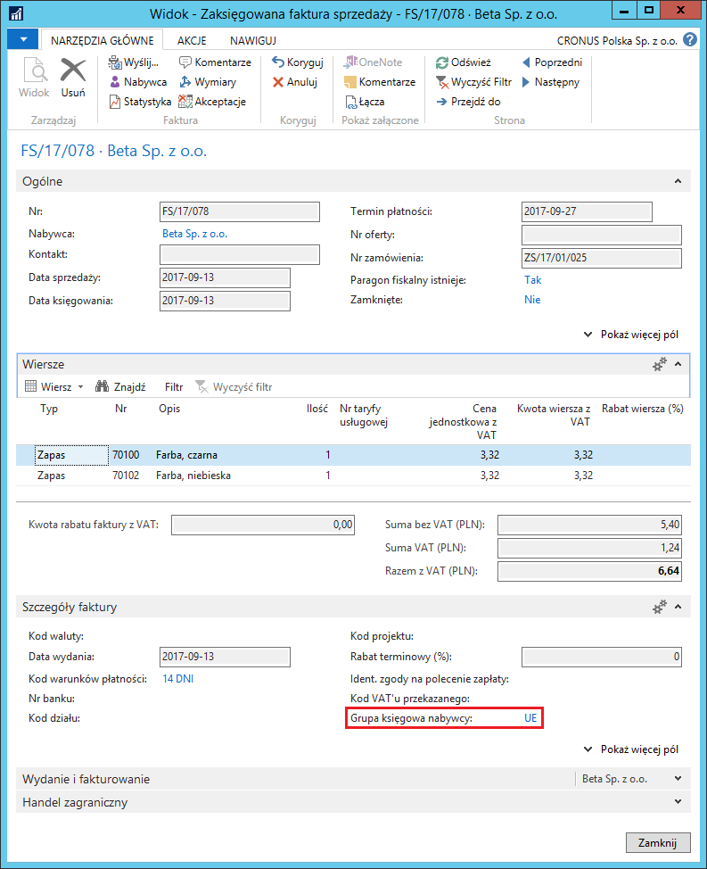{width="6.367925415573054in" height="7.821798993875766in"}
  ------------------------------------------------------------------------------------
  Rysunek 5.69: Zaksięgowana faktura sprzedaży

{width="0.19in"
height="0.19in"}**Uwaga:** Pole **Grupa księgowa nabywcy** wyświetlone
jest w następujących zaksięgowanych dokumentach: **Zaksięgowane wydanie
sprzedaży, Zaksięgowana faktura sprzedaży, Zaksięgowane przyjęcie
zwrotu, Zaksięgowana faktura korygująca sprzedaży, Wygenerowana nota
odsetkowa, Zaksięgowane wydanie serwisowe, Zaksięgowana faktura
serwisowa i Zaksięgowana serwisowa faktura korygująca.** Pole **Grupa
księgowa dostawcy** wyświetlone jest w następujących zaksięgowanych
dokumentach: **Zaksięgowane przyjęcie zakupu, Zaksięgowana faktura
zakupu, Zaksięgowane wydanie zwrotu, Zaksięgowana faktura korygująca
zakupu.**

7.  Żeby zobaczyć zapisy powstałe w wyniku zaksięgowania faktury
    sprzedaży, należy wybrać akcję **Nawiguj** w oknie **Zaksięgowana
    faktura sprzedaży**. W oknie **Nawigacja** należy kolejno zaznaczać
    właściwe tabele (np. **Zapis K/G, Zapis księgi nabywców**)
    **i **wybierać **Pokaż powiązane zapisy w **celu sprawdzenia efektu
    zaksięgowania faktury sprzedaży ze zmienioną grupą księgową nabywcy.

  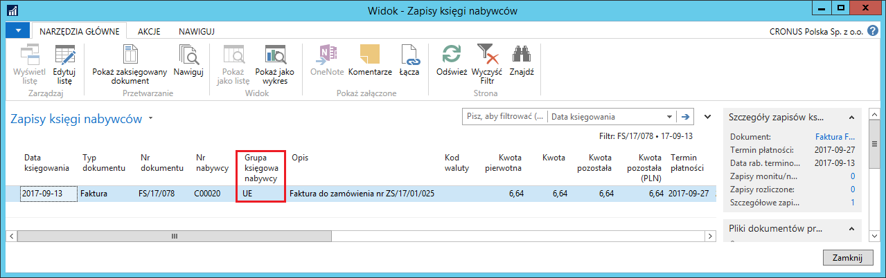{width="6.396227034120735in" height="2.0104385389326334in"}
  -------------------------------------------------------------------------------------
  Rysunek 5.70: Zapisy księgi nabywców

  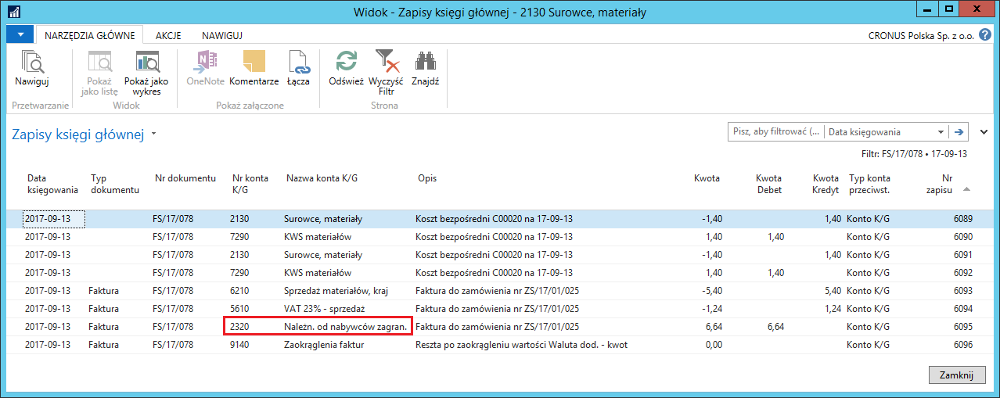{width="6.405660542432196in" height="2.551314523184602in"}
  ------------------------------------------------------------------------------------
  Rysunek 5.71: Zapisy księgi głównej

**[Księgowanie płatności ze zmienioną grupą księgową.]{.underline}**

Wpływ należności od nabywcy rejestrowany przez **Dzienniki** (dziennik
wyciągów bankowych, dziennik główny, dziennik wpłat, wpłata gotówkowa)
również może być zaksięgowany na konto KG powiązane z jedną
z zastępczych grup księgowych nabywców.

### Żeby zaksięgować wpłatę należności ze zmienioną grupą księgową nabywcy, należy postępować według następujących kroków (przykład bazuje na dzienniku wyciągów bankowych):

1.  Należy wybrać **Działy \> Zarządzanie Finansami \> Zarządzanie
    > środkami pieniężnymi \> Dziennik wyciągów bankowych.**

2.  W oknie **Dziennik wyciągów bankowych**, które się otworzy, należy
    > standardowo wprowadzić wiersz płatności od nabywcy. W polu **Grupa
    > księgowa** system automatycznie wstawi kod grupy księgowej nabywcy
    > wybranej jako domyślna na kartotece nabywcy. Rozwijając listę
    > w tym polu, można wybrać inną grupę księgową, jedną z tych,
    > które zostały zdefiniowane jako substytuty grupy domyślnej:

  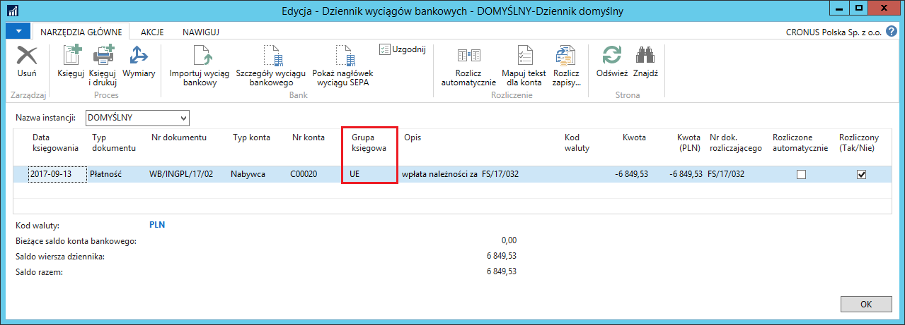{width="6.386792432195976in" height="2.3015649606299213in"}
  -------------------------------------------------------------------------------------
  Rysunek 5.72: Dziennik wyciągów bankowych

3.  Należy zaksięgować wiersze w oknie **Dziennik wyciągów bankowych.**

4.  Po zaksięgowaniu możliwe jest sprawdzenie konta KG należności
    > oraz grupy księgowej nabywcy w zapisach utworzonych na podstawie
    > zaksięgowanego wyciągu bankowego. W tym celu należy użyć
    > standardowej funkcji **Nawiguj** w zaksięgowanym dokumencie.

**[Rozliczanie zapisów z różnymi grupami księgowymi.]{.underline}**

Jest kilka sposobów rozliczania zapisów księgi nabywcy (dostawcy).
Jednym z nich jest zaprezentowany poniżej -- rozliczenie w oknie
otwieranym z kartoteki kontrahenta.

Żeby rozliczyć zapisy księgi nabywcy, należy postępować
według następujących kroków:

1.  Należy wybrać **Działy \> Zarządzanie Finansami \> Należności \>
    > Nabywcy.**

2.  Na liście nabywców należy zaznaczyć wiersz z nabywcą wybranym
    > do rozliczenia i wybrać **Zapisy księgi**.

3.  W oknie **Zapisy księgi nabywców**, które się otworzy, należy
    > ustawić kursor w wierszu z dokumentem rozliczającym (zwykle jest
    > to płatność) i wybrać **Rozlicza zapisy**.

4.  W oknie **Rozlicz zapisy nabywcy**, które się otworzy system
    > automatycznie umieścił w nagłówku zapis (dokument) rozliczający.
    > Z listy poniżej należy wybrać zapis do rozliczenia z inną grupą
    > księgową niż w zapisie rozliczającym:

  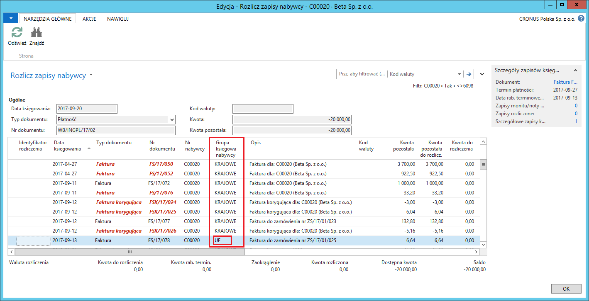{width="6.405660542432196in" height="3.277425634295713in"}
  ------------------------------------------------------------------------------------
  Rysunek 5.73: Grupa księgowa w rozliczanych zapisach nabywcy

5.  Należy zaznaczyć wybrany zapis do rozliczenia poprzez wybranie akcji
    > **Ustaw id. rozliczenia**.

6.  Należy wybrać **Księguj rozliczenie**.

7.  Zostanie wyświetlony standardowy komunikat przed zaksięgowaniem
    > rozliczenia, który należy zaakceptować lub zmienić zaproponowane
    > parametry na inne i zaakceptować, żeby wykonać księgowanie.

  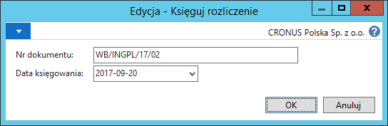{width="4.586614173228346in" height="1.4921259842519685in"}
  -------------------------------------------------------------------------------------
  Rysunek 5.74: Komunikat księgowania

8.  Zaksięgowane rozliczenie utworzyło, zgodnie z wcześniej wyświetlonym
    komunikatem, dodatkowe zapisy na kontach KG, w celu uzgodnienia sald
    należności na poziomie rozliczonych grup księgowych i powiązanych
    z nimi kont KG należności:

  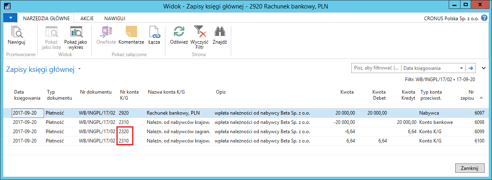{width="6.405660542432196in" height="2.347373140857393in"}
  ------------------------------------------------------------------------------------
  Rysunek 5.75: Zapisy K/G: przeksięgowanie należności z rozliczenia

{width="0.19in"
height="0.19in"}**Uwaga:** Funkcjonalność **Zastępczych grup
księgowych** w obszarze **Zakupy** działa dokładnie tak samo,
jak w obszarze **Sprzedaż**.

**[Sugerowanie płatności dostawcy z różnymi grupami
księgowymi]{.underline}**

Sugerując płatności dostawcy należy mieć świadomość, że zapisy księgowe
jednego dostawcy mogą mieć różne grupy księgowe. Z tego powodu zostały
wprowadzone udogodnienia.

Żeby użyć skryptu **Sugeruj płatności dostawcy** należy postępować
według następujących kroków:

1.  Należy wybrać **Działy \> Zarządzanie Finansami \> Zobowiązania \>
    > Dzienniki płatności**.

2.  W oknie **Dziennik płatności**, które się otworzy, należy wybrać
    > **Sugeruj płatności dostawcy**.

3.  Na karcie skróconej **Grupa księgowa dostawcy**, w polu **Kod**
    > można ustawić filtr na jedną lub więcej grup księgowych, dla
    > których system ma zaproponować płatności jednemu dostawcy.

  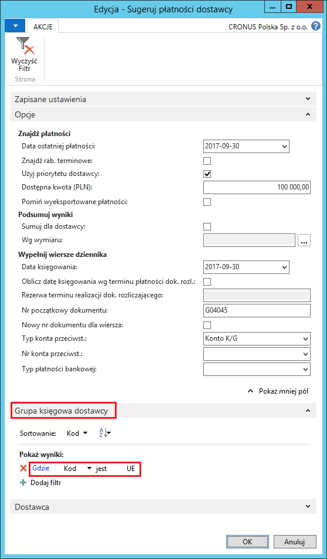{width="4.692913385826771in" height="8.011811023622048in"}
  ------------------------------------------------------------------------------------
  Rysunek 5.76: Grupa księgowa w sugerowaniu płatności dostawcy

4.  Pozostałe parametry należy uzupełnić standardowo. Zaznaczenie pola
    > **Sumuj dla dostawcy** na karcie skróconej **Opcje** spowoduje
    > standardowe zsumowanie zobowiązań, ale z dokładnością do grup
    > księgowych użytych w zapisach zobowiązań dostawcy.

5.  Należy wybrać **OK** w celu wykonania funkcji.

6.  W oknie **Dziennik płatności** można zweryfikować zasugerowane
    > przez system płatności, wprowadzone w wielu wierszach,
    > odzwierciedlających ilość uwzględnionych grup księgowych.

  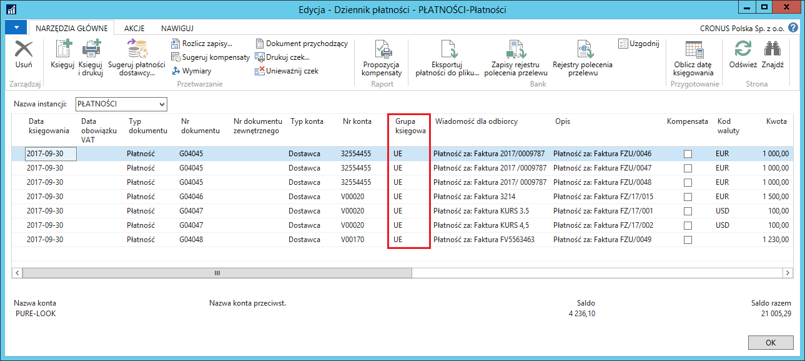{width="6.396227034120735in" height="2.8783027121609797in"}
  -------------------------------------------------------------------------------------
  Rysunek 5.77: zasugerowane płatności dostawcy według Grup księgowych

 {#section-12 .list-paragraph .Poziom-1}

Kompensaty nabywców i dostawców {#kompensaty-nabywców-i-dostawców .Poziom-1}
-------------------------------

####  Wyświetlanie salda jako dostawca/nabywca {#wyświetlanie-salda-jako-dostawcanabywca .Poziom-2}

### Informacje ogólne

W systemie Microsoft Dynamics 365 Business Central on‑premises
kontrahenci definiowani są jako nabywcy lub dostawcy, w zależności
od tego, jakiego rodzaju transakcje są z nimi dokonywane. Jednak czasami
zdarza się, że jeden kontrahent występuje w transakcjach zakupów
i sprzedaży. Wtedy konieczne jest zarejestrowanie jego danych dwa razy:
raz jako nabywcy i raz jako dostawcy.

Polska Lokalizacja umożliwia bieżącą kontrolę salda
należności/zobowiązań oraz ich kompensatę poprzez powiązanie kartoteki
nabywcy z kartoteką dostawcy jednego kontrahenta za pośrednictwem
kartoteki kontaktu.

### Ustawienia

Warunkiem koniecznym do powiązania kartoteki nabywcy z kartoteką
dostawcy jednego kontrahenta jest uruchomienie funkcjonalności
**Kontakty** w dziale **Marketing**. W celu ustanowienia takiego
powiązania, należy postępować według następujących kroków:

1.  Należy wybrać **Działy \> Sprzedaż i Marketing \> Marketing \>
    > Kontakty**.

2.  Należy zdefiniować kartotekę kontaktu w standardowy sposób.

3.  Z poziomu kartoteki nowego kontaktu należy wybrać akcję **Utwórz
    > jako** **\>** **Nabywca**, żeby system automatycznie utworzył
    > kartotekę nabywcy na podstawie danych kontrahenta umieszczonych
    > w kartotece kontaktu.

  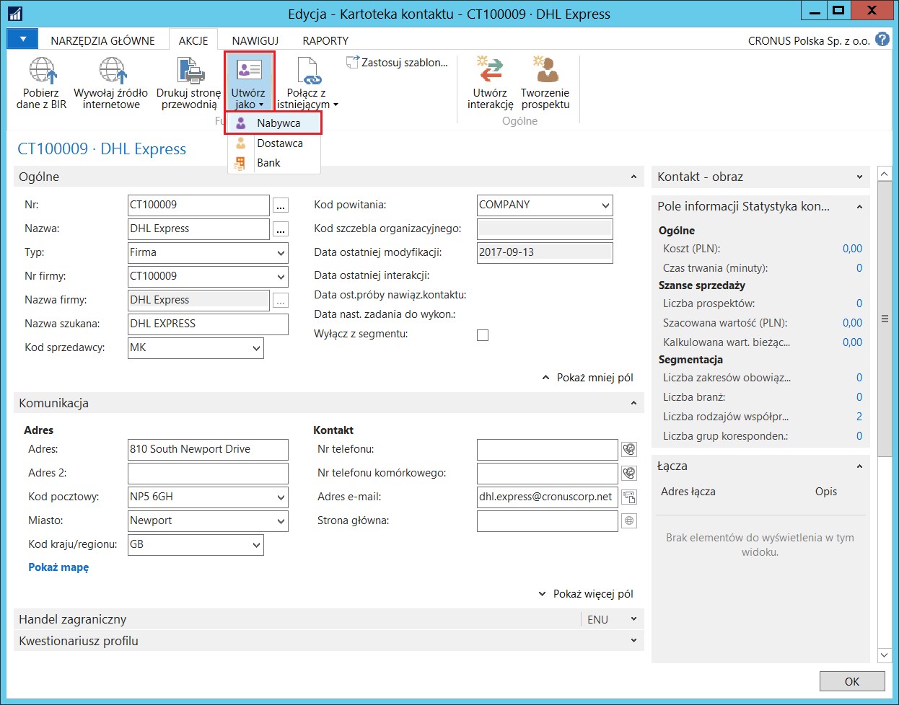{width="6.398899825021872in" height="5.022726377952756in"}
  ------------------------------------------------------------------------------------
  Rysunek 5.78: kartoteka kontaktu -- tworzenie nabywcy

4.  Z poziomu kartoteki nowego kontaktu należy wybrać akcję **Utwórz
    jako** **\>** **Dostawca**, żeby system automatycznie utworzył
    kartotekę dostawcy na podstawie danych kontrahenta umieszczonych
    w kartotece kontaktu.

  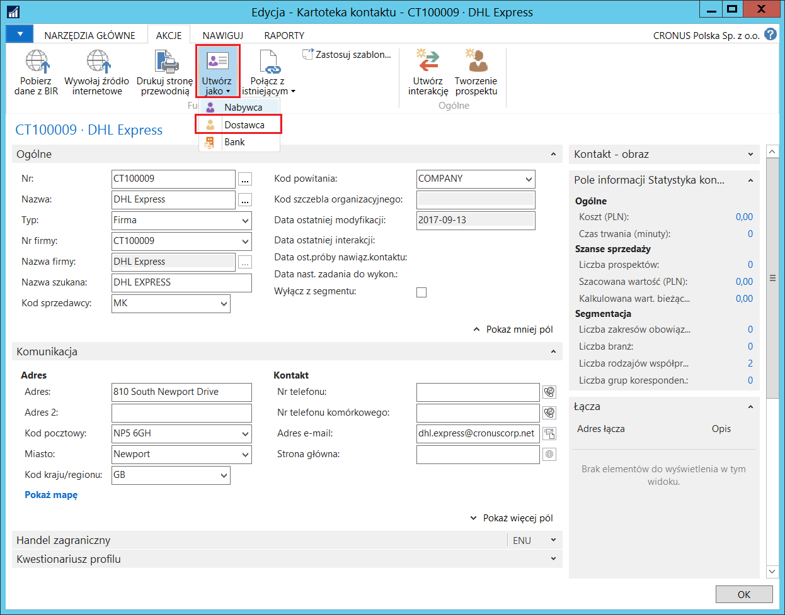{width="6.379597550306212in" height="5.007575459317585in"}
  ------------------------------------------------------------------------------------
  Rysunek 5.79: kartoteka kontaktu -- tworzenie dostawcy

Rezultatem tych czynności będą nowe kartoteki: dostawcy i nabywcy,
które można sprawdzić z poziomu kartoteki kontaktu wybierając
**Nabywca/dostawca/konto bank.**:

  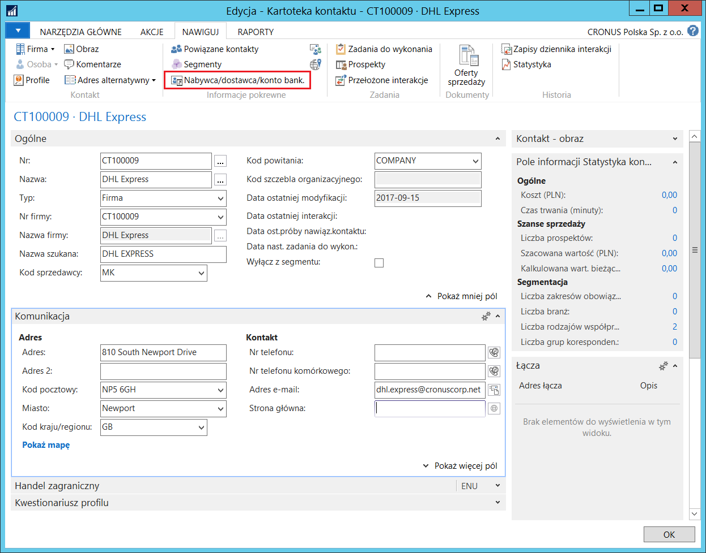{width="6.386363735783027in" height="5.012886045494313in"}
  ------------------------------------------------------------------------------------
  Rysunek 5.80: kartoteka kontaktu -- powiązanie z nabywcą i dostawcą

### Obsługa

W celu sprawdzenia salda należności/zobowiązania jednego kontrahenta,
należy postępować według następujących kroków:

1.  Należy wybrać **Działy \> Sprzedaż i Marketing \> Sprzedaż \>
    > Nabywcy**

2.  Dane wybranego nabywcy należy wyświetlić w formie kartoteki.

3.  Na karcie skróconej **Ogólne** w polu **Saldo (PLN)** wyświetlane
    > jest saldo należności, a w polu **Saldo (PLN) wg dostawcy**
    > wyświetlane jest saldo zobowiązań:

  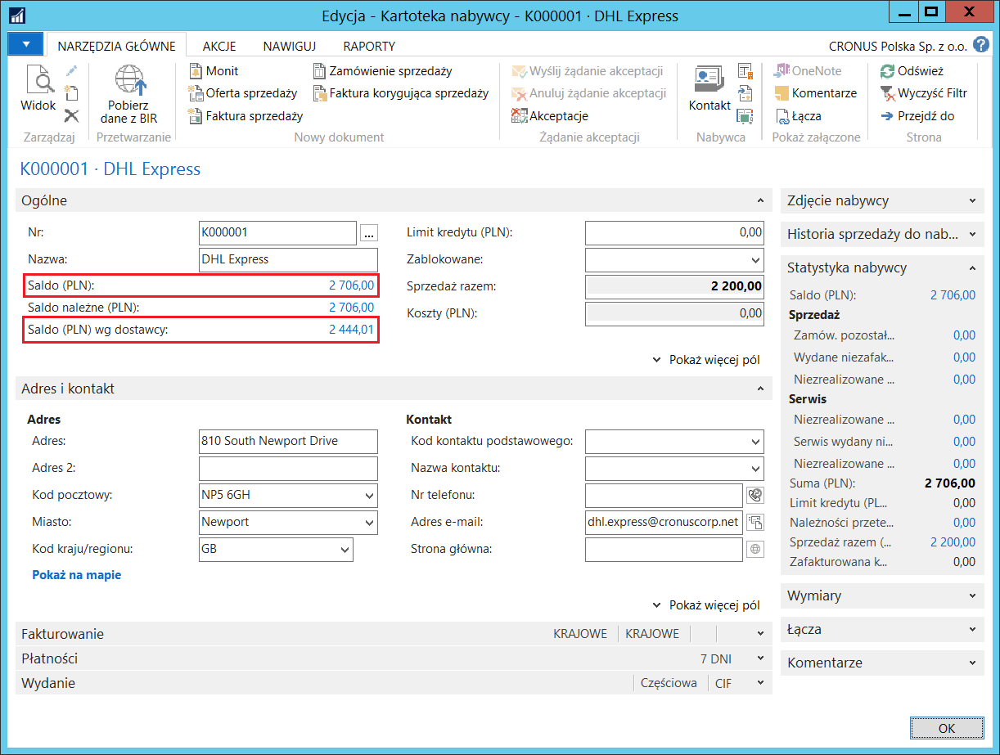{width="6.369680664916886in" height="4.810605861767279in"}
  ------------------------------------------------------------------------------------
  Rysunek 5.81: kartoteka nabywcy -- saldo należności i zobowiązań

4.  Należy wybrać **Działy \> Zakup \> Planowanie \> Dostawcy**

5.  Dane wybranego dostawcy należy wyświetlić w formie kartoteki.

6.  Na karcie skróconej **Ogólne** w polu **Saldo (PLN)** wyświetlane
    > jest saldo zobowiązań, a w polu **Saldo (PLN) wg nabywcy**
    > wyświetlane jest saldo należności:

  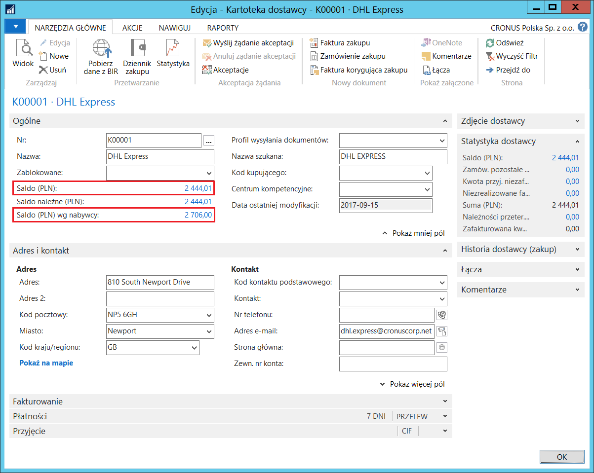{width="6.393939195100613in" height="5.0967071303587055in"}
  -------------------------------------------------------------------------------------
  Rysunek 5.82: kartoteka dostawcy -- saldo zobowiązań i należności

#### Sugerowanie i księgowanie kompensaty {#sugerowanie-i-księgowanie-kompensaty .Poziom-2}

### Informacje ogólne

Zobowiązania i należności, nawet jednego kontrahenta, rejestrowane
są bez wzajemnego powiązania, stąd wynika konieczność kompensowania
należności z zobowiązaniami. Dodane do Polskiej Lokalizacji funkcje
ułatwiają przygotowanie księgowań kompensujących należności
i zobowiązania jednego kontrahenta.

### Obsługa

W celu skompensowania należności z zobowiązaniami, należy postępować
według następujących kroków:

1.  Należy wybrać **Działy \> Zarządzanie Finansami \> Zobowiązania \>
    Dziennik płatności**

2.  W oknie **Dziennik płatności** należy wybrać proces **Sugeruj
    kompensaty**.

3.  W oknie wstępnym skryptu, które się otworzy, na karcie skróconej
    **Opcje** należy wprowadzić parametry do przygotowania kompensaty:

-   **Data księgowania** -- data, jaka zostanie wstawiona do wierszy
    > dziennika, z jaką zostanie zaksięgowana kompensata

-   **Numer dokumentu** -- numer dokumentu, jaki zostanie wstawiony
    > do wierszy dziennika, z jakim zostanie zaksięgowana kompensata

-   **Opis** -- opis, jaki zostanie wstawiony do wierszy dziennika,
    > z jakim zostanie zaksięgowana kompensata

-   **Wstrzymane** -- wprowadzenie danych w tym polu spowoduje,
    > że system pominie zapisy księgi nabywców i dostawców,
    > które zostały oznaczone jako wstrzymane

-   **Kolejność sugestii** -- w tym polu można wybrać kolejność
    > dla automatycznego sugerowania kompensaty. Dostępne są opcje:

```{=html}
<!-- -->
```
-   **Najpierw noty odsetkowe** -- zapisy pochodzące z not odsetkowych
    > będą uwzględniane w pierwszej kolejności

-   **Najpierw faktury** -- zapisy pochodzące z faktur będą uwzględniane
    > w pierwszej kolejności

-   **Według numeru zapisu** -- zapisy będą rozpatrywane
    > według kolejności księgowania.

  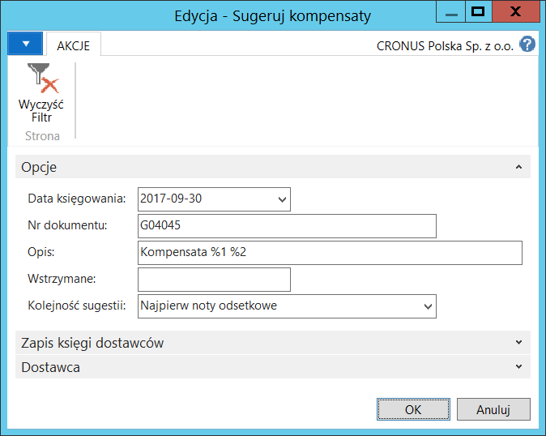{width="4.559055118110236in" height="3.6377952755905514in"}
  -------------------------------------------------------------------------------------
  Rysunek 5.83: sugeruj kompensaty

4.  Kliknięcie przycisku **OK** powoduje wykonanie skryptu, w wyniku
    czego system wypełnia wiersze dziennika płatności zgodnie
    z parametrami wprowadzonymi w oknie wstępnym skryptu.

  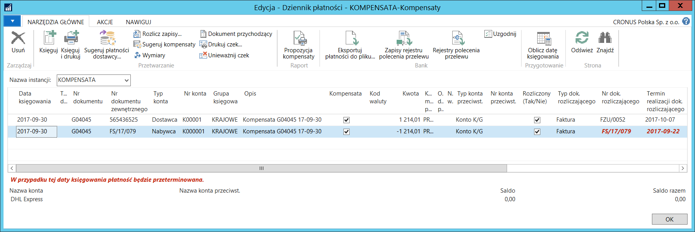{width="6.378787182852143in" height="2.1378477690288715in"}
  -------------------------------------------------------------------------------------
  Rysunek 5.84: Dziennik płatności

W oknie **Dziennik płatności** z wierszami kompensaty zasugerowanymi
przez system, należy wybrać **Propozycja kompensaty** w celu
wydrukowania dokumentu, który można wysłać do kontrahenta w celu
uzyskania potwierdzenia zaproponowanej kompensaty:

  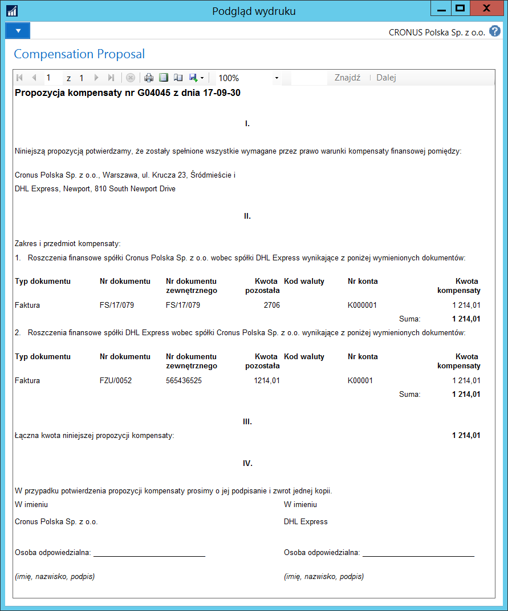{width="6.364849081364829in" height="7.643939195100613in"}
  ------------------------------------------------------------------------------------
  Rysunek 5.85: propozycja kompensaty

5.  Po otrzymaniu potwierdzenia propozycji kompensaty, należy ją
    > zaksięgować. W oknie **Dziennik płatności** należy wybrać
    > **Księguj** lub **Księguj i drukuj.**

6.  Po zaksięgowaniu kompensaty można ją wydrukować wybierając
    > **Działy** **\>** Zarządzanie **Finansami \> Zobowiązania \>
    > Dokumenty \> Deklaracja kompensaty.**

7.  W oknie **Deklaracja kompensaty**, które się otworzy, na karcie
    > skróconej **Zapis księgi nabywcy** należy wypełnić pola: **Nr
    > nabywcy** i **Nr dokumentu**, a następnie wybrać **Drukuj**
    > lub **Podgląd**:

  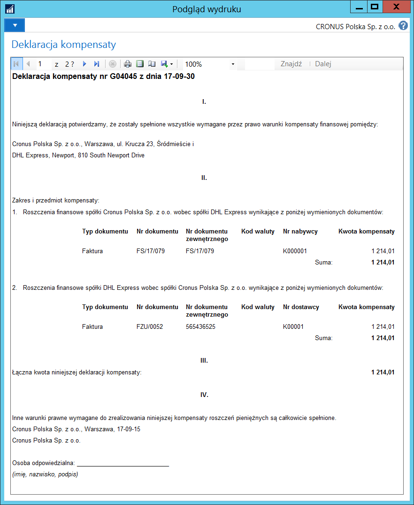{width="6.407859798775153in" height="7.810605861767279in"}
  ------------------------------------------------------------------------------------
  Rysunek 5.86: deklaracja kompensaty

Faktury zaliczkowe {#faktury-zaliczkowe .Poziom-1}
------------------

### Informacje ogólne

Przepisy prawa polskiego w zakresie VAT wymagają wystawiania faktury
zaliczkowej do wpłaconych przez nabywcę zaliczek z tytułu realizacji
zamówienia sprzedaży. W systemie Microsoft Dynamics 365 Business Central
on‑premises, faktury zaliczkowe są wystawiane i księgowane przy pomocy
funkcjonalności faktur zaliczkowych. Polska Lokalizacja rozszerza
standardową funkcjonalność faktur zaliczkowych w zakresie dostosowania
jej do wymagań przepisów polskiego prawa.

### Ustawienia

Rozszerzenie funkcjonalności do obsługi faktur korygujących sprzedaży
dodane w ramach Polskiej Lokalizacji zawiera m.in. obowiązek podawania
**Przyczyny korekty**. Wymaganie to obejmuje również faktury korygujące
zaliczki sprzedaży. Ponieważ faktury korygujące zaliczki mają tylko
jedną funkcję: wycofują wszystkie zaksięgowane faktury zaliczkowe
do zamówienia, dlatego przyczyna korekty zawsze będzie taka sama.
Aby nie było konieczne przypisywanie tej przyczyny dla każdej
pojedynczej faktury korygującej zaliczki sprzedaży, w ustawieniach
zostało dodane pole domyślnej przyczyny, która będzie wstawiana
automatycznie do wszystkich faktur korygujących zaliczki sprzedaży.
W celu zdefiniowania tego ustawienia, należy postępować
według następujących kroków:

1.  Należy wybrać **Działy \> Sprzedaż i Marketing \> Administracja \>
    > Ustawienia sprzedaży i należności**.

2.  W oknie **Ustawienia sprzedaży i należn.**, które się otworzy,
    > na karcie skróconej **Ogólne**, **z **listy rozwijanej w polu
    > **Kod przyczyny korekty zaliczki** należy wybrać jedną z wcześniej
    > zdefiniowanych przyczyn korekty.

  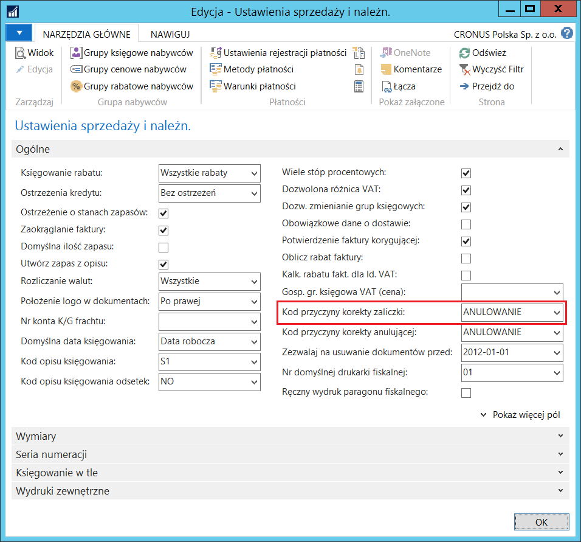{width="6.378787182852143in" height="5.945356517935258in"}
  ------------------------------------------------------------------------------------
  Rysunek 5.87: kod przyczyny korekty zaliczki

### Obsługa

Większość opisanych funkcji jest dostępna zarówno w module sprzedaży,
jak i w module zakupy, z wyjątkiem specyficznych modyfikacji procesu
wystawiania faktur zaliczkowych sprzedaży.

Aby wystawić fakturę zaliczkową do zamówienia sprzedaży, należy
postępować według następujących kroków:

1.  Należy wybrać **Działy \> Sprzedaż i Marketing \> Przetwarzanie
    zamówień \> Zamówienia sprzedaży.**

2.  W oknie, które się otworzy należy wybrać zamówienie sprzedaży
    i otworzyć je w trybie edycji, wybierając **Edytuj.** Należy zwrócić
    uwagę na pole **Stan** -- musi być w nim opcja **Otwarty**.

3.  Na karcie skróconej **Zaliczka** należy odpowiednio wypełnić pola:

-   **Zaliczka (%)** -- na podstawie wartości procentowej wpisanej w tym
    > polu, system skalkuluje proponowaną kwotę zaliczki, bazując
    > na wartości zamówienia sprzedaży. Kwota zaliczki kalkulowana jest
    > odrębnie dla każdego wiersza zamówienia.

> {width="0.19in"
> height="0.19in"}**Uwaga:** Pole **Zaliczka (%)** może być uzupełniane
> automatycznie właściwą wartością, jeśli zostanie ona wprowadzona
> w kartotece nabywcy (dostawcy) w polu **Zaliczka (%) na **karcie
> skróconej **Fakturowanie**.

-   **Kompresuj zaliczkę** -- to pole należy zaznaczyć, aby połączyć
    > zaliczki z wierszy zamówienia sprzedaży, które spełniają warunki:

```{=html}
<!-- -->
```
-   mają takie samo konto księgi głównej do obsługi zaliczek (wybrane
    > w polu **Konto zaliczek sprzedaży** w oknie **Główne ustawienia
    > księgowań**, dla kombinacji kodów głównych grup księgowych użytych
    > w wierszach zamówienia)

-   mają takie same wymiary.

> Pole należy pozostawić puste, jeśli wiersze faktury zaliczkowej mają
> odpowiadać wierszom zamówienia sprzedaży.

-   **Kod warunków płatności zaliczki** -- z listy rozwijanej w tym polu
    > należy wybrać warunki płatności, na podstawie których system
    > ustali termin płatności należnej zaliczki.

-   **Termin płatności zaliczki** -- data, do której nabywca powinien
    > wpłacić należną zaliczkę. Data ta kalkulowana jest na podstawie
    > warunków wybranych w polu **Kod warunków płatności zaliczki**.

-   **Rabat terminowy (%) zaliczki** -- w tym polu można wprowadzić
    > procentową wysokość rabatu udzielonego w przypadku, gdy należność
    > z tytułu zaliczki zostanie uiszczona do dnia wprowadzonego w polu
    > **Data rabatu terminowego zaliczki**. Pole jest uzupełniane
    > domyślnie na podstawie parametrów zdefiniowanych dla warunków
    > płatności wybranych w polu **Kod warunków płatności zaliczki**.

-   **Data rabatu terminowego zaliczki** -- w tym polu wprowadzana jest
    > data końcowa okresu, w którym nabywca powinien uiścić należną
    > zaliczkę w celu otrzymania rabatu terminowego. Pole jest
    > uzupełniane domyślnie na podstawie parametrów zdefiniowanych
    > dla warunków płatności wybranych w polu **Kod warunków płatności
    > zaliczki** oraz **Daty dokumentu.**

> {width="0.19in"
> height="0.19in"}**Uwaga:** W zamówieniu zakupu konieczne jest
> wprowadzenie właściwych numerów dokumentów jednym z dwóch pól,
> w zależności od tego, czy księgowana jest faktura zaliczkowa, czy
> faktura korygująca zaliczkę: **Nr faktury dostawcy na **karcie
> skróconej **Ogólne** (numer faktury zaliczkowej wystawionej
> przez dostawcę) oraz **Nr faktury kor. dostawcy na **karcie skróconej
> **Zaliczka** (numer faktury korygującej zaliczkę wystawionej
> przez dostawcę).

  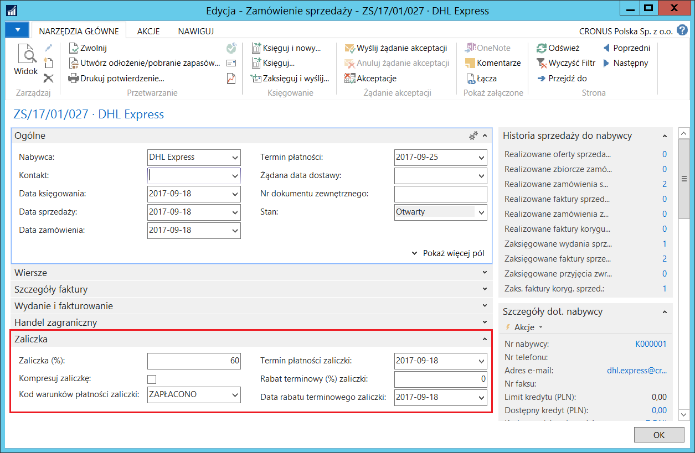{width="6.401514654418198in" height="4.177398293963255in"}
  ------------------------------------------------------------------------------------
  Rysunek 5.88: Zaliczka w Zamówieniu sprzedaży

4.  Po uzupełnieniu w kartotece zamówienia wymaganych informacji
    o zaliczce, należy przejść do okna **Statystyka sprzedaży
    Zamówienie** i na karcie skróconej **Zaliczka** sprawdzić kwoty
    skalkulowane przez system.

  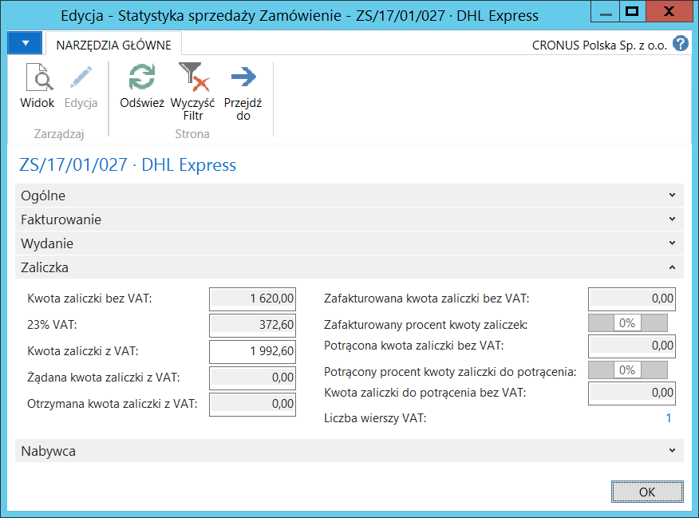{width="5.925196850393701in" height="4.389763779527559in"}
  ------------------------------------------------------------------------------------
  Rysunek 5.89: Statystyka zaliczki w Zamówieniu sprzedaży

5.  W razie potrzeby, można ręcznie zmienić zasugerowaną przez system
    kwotę w polu **Kwota zaliczki z VAT**. Na podstawie nowej kwoty,
    system skalkuluje i zmieni kwotę w polu **Kwota zaliczki bez VAT**.

> {width="0.19in"
> height="0.19in"}**Uwaga:** Zmiany w funkcjonalności **Zaliczek**
> wprowadzone w ramach **Polskiej Lokalizacji** pozwalają na zmianę
> w oknie **Statystyka sprzedaży** jedynie kwoty brutto sugerowanej
> zaliczki, niezależnie od tego, czy na zamówieniu sprzedaży zaznaczone
> jest pole **Ceny z VAT.** Możliwość zmiany kwoty netto została
> wyłączona. Ponadto algorytm używany do alokowania części kwoty
> zaliczki do wierszy zamówienia sprzedaży został zmieniony: teraz
> system oblicza proporcję na podstawie kwoty brutto w wierszu
> zamówienia sprzedaży.

6.  Fakturę zaliczkową można testowo wydrukować przed wystawieniem.
    > W tym celu, w oknie **Zamówienie sprzedaży** należy wybrać
    > **Zaliczka** **\> Raport testowy zaliczki**, a następnie
    > **Drukuj** lub **Podgląd wydruku**.

7.  Jeżeli wszystkie dane niezbędne do wystawienia faktury zaliczkowej
    > zostały poprawnie uzupełnione, należy, w oknie **Zamówienie
    > sprzedaży**, wybrać **Zaliczka \> Księguj fakturę zaliczkową
    > lub Zaliczka \> Księguj i drukuj fakturę zaliczkową**.

8.  Zaksięgowanie faktury zaliczkowej powoduje zmianę **Stanu**
    > zamówienia sprzedaży na **Oczekuje na zaliczkę**. Takie stan
    > powoduje uniemożliwienie edycji danych w zamówieniu.

> {width="0.19in"
> height="0.19in"}**Uwaga:** Jeśli zajdzie potrzeba zaksięgowania
> (wystawienia) większej ilości faktur zaliczkowych do jednego
> zamówienia sprzedaży, należy zmienić stan zamówienia z **Oczekuje
> na zaliczkę na Otwarty**, a następnie w oknie statystyk zamówienia,
> na karcie skróconej **Zaliczka** należy zmienić kwotę w polu **Kwota
> zaliczki z VAT**. Nowa kwota wprowadzona w tym polu powinna być sumą
> poprzedniej i bieżącej faktury zaliczkowej. Następnie należy
> zweryfikować pozostałe dane w zamówieniu i wybrać **Zaliczka \>
> Księguj fakturę zaliczkową lub Zaliczka \> Księguj i drukuj fakturę
> zaliczkową.**

  {width="6.5in" height="8.638194444444444in"}
  ----------------------------------------------------------------------
  Rysunek 5.90: Wydruk faktury zaliczkowej

W sytuacji, gdy faktura zaliczkowa została wystawiona pomyłkowo
lub nieprawidłowo, można ją skorygować, wystawiając fakturę korygującą
zaliczkę. Faktura korygująca zaliczkę dokładnie odwraca fakturę
zaliczkową, dlatego nie można wprowadzać żadnych zmian w wierszach
zamówienia sprzedaży przed zaksięgowaniem faktury korygującej zaliczkę.
W celu zaksięgowania faktury korygującej sprzedaży, należy postępować
według następujących kroków:

1.  W kartotece zamówienia sprzedaży, do którego została zaksięgowana
    > faktura zaliczkowa, należy wybrać **Zaliczka \> Księguj fakturę
    > korygującą zaliczkę lub Zaliczka \> Księguj i drukuj fakturę
    > korygującą zaliczkę**.

> {width="0.19in"
> height="0.19in"}**Uwaga:** Zaksięgowanie faktury korygującej zaliczkę
> powoduje wycofanie wszystkich faktur zaliczkowych wystawionych
> do danego zamówienia**.**

  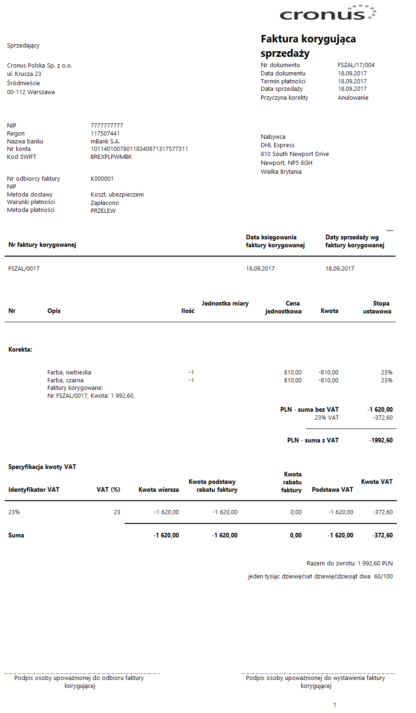{width="5.039683945756781in" height="8.621211723534557in"}
  ------------------------------------------------------------------------------------
  Rysunek 5.91: Wydruk faktury korygującej zaliczkę

2.  Po otrzymaniu komunikatu o poprawnym zaksięgowaniu faktury
    > korygującej zaliczkę, należy w oknie zamówienia sprzedaży wybrać
    > **Otwórz ponownie**, aby zmienić stan zamówienia na **Otwarty**
    > i dokonać niezbędnych zmian w jego danych.

3.  W celu zaksięgowania faktury zaliczkowej po naniesieniu poprawek,
    > należy postępować w sposób opisany powyżej.

Kiedy wszystkie faktury zaliczkowe do danego zamówienia sprzedaży
są wystawione, a towary dostarczone, można zaksięgować ostateczną
fakturę sprzedaży, w sposób standardowy dla wszystkich faktur sprzedaży.
Można też dokonać fakturowania częściowego.

  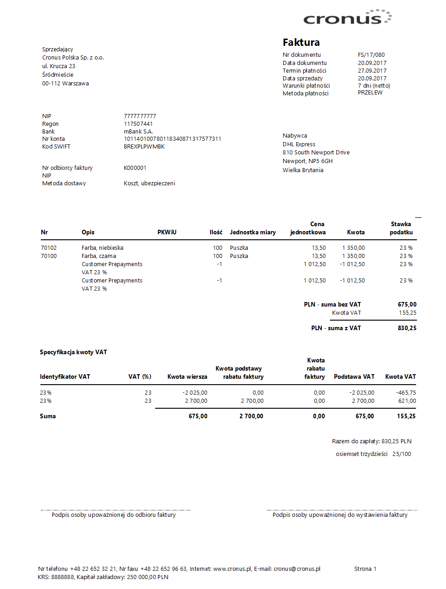{width="6.5in" height="8.57638888888889in"}
  ---------------------------------------------------------------------
  Rysunek 5.92: Wydruk faktury ostatecznej

Z punktu widzenia użytkownika, nie ma więcej różnic w obsłudze tego
procesu, w porównaniu z międzynarodowym standardem funkcjonalności
zaliczek. Występują natomiast dwie różnice w zakresie rozliczenia kwoty
zaliczek:

1)  Potrącenie zaliczki podczas ostatecznego częściowego fakturowania.

> Podczas ostatecznego częściowego fakturowania, standardowa
> funkcjonalność zmniejsza kwotę częściowej faktury ostatecznej o kwotę
> skalkulowaną jako proporcja łącznej kwoty zaliczek do kwoty
> zamówienia. Ten algorytm został zmodyfikowany i system potrąca tyle
> kwoty zaliczki, ile jest to możliwe i w przypadku, gdy łączna kwota
> zaliczek jest wyższa niż kwota częściowej faktury ostatecznej, kwota
> częściowej faktury ostatecznej będzie zerowa, natomiast, jeżeli łączna
> kwota zaliczek jest niższa niż kwota częściowej faktury ostatecznej,
> kwota częściowej faktury ostatecznej zostanie pomniejszona o łączną
> kwotę zaliczek.

2)  Podział potrąconych kwot do kwot faktur zaliczkowych.

> Standardowa funkcjonalność pomniejsza kwotę ostatecznej faktury
> o łączną kwotę zaliczek do zamówienia. Przepisy polskiego prawa
> wymagają pokazania na ostatecznej fakturze sprzedaży numerów i kwot
> potrąconych faktur zaliczkowych i w wyniku zmodyfikowania standardowej
> funkcjonalności, system wykazuje faktury zaliczkowe sprzedaży
> według numeru, daty sprzedaży, kwoty netto, kwoty VAT i kwoty brutto.

Polska Lokalizacja wprowadziła też zmiany w standardowej obsłudze
zaliczek w walucie obcej. Standardowa funkcjonalność nie dokonuje
żadnych automatycznych przeszacowań zaliczek, ale po modyfikacjach
wprowadzonych przez Polską Lokalizację, system kalkuluje kwoty
ostatecznych faktur w następujący sposób:

1)  Wiersze potrącenia zaliczek są kalkulowane według historycznego
    > kursu wymiany użytego na fakturze zaliczkowej (lub fakturach
    > zaliczkowych, jeśli było ich więcej zaksięgowanych dla danego
    > zamówienia sprzedaży).

2)  Wiersze zamówienia sprzedaży są kalkulowane według nowego kursu
    > wymiany użytego do wystawienia ostatecznej faktury.

3)  System kalkuluje kwotę wiersza w zamówieniu sprzedaży
    > według historycznego kursu wymiany użytego na fakturze
    > zaliczkowej, a następnie oblicza różnicę pomiędzy tą kwotą,
    > a wartością wierszy zamówienia sprzedaży skalkulowaną
    > według nowego kursu wymiany użytego do wystawienia ostatecznej
    > faktury. Kwota netto różnic jest zaksięgowana na konto K/G
    > dodatnich lub ujemnych różnic kursowych, a kwota VAT różnic jest
    > zaksięgowana na konto K/G VAT'u należnego. Utworzony też zostaje
    > odpowiedni zapis VAT.

4)  System księguje należność od nabywcy w kwocie różnicy pomiędzy kwotą
    > brutto zamówienia sprzedaży a wartością faktur zaliczkowych,
    > według nowego kursu wymiany użytego do zaksięgowania ostatecznej
    > faktury sprzedaży.

Potwierdzenie salda nabywcy/dostawcy {#potwierdzenie-salda-nabywcydostawcy .Poziom-1}
------------------------------------

### Informacje ogólne

> Na koniec każdego roku finansowego (lub innego okresu obrachunkowego,
> jeśli jest to konieczne) firmy tworzą zestawienia należności
> i zobowiązań w celu ich potwierdzenia z nabywcami i dostawcami.
> Nabywcy i dostawcy mają obowiązek dostarczyć informację zwrotną
> o zgodności lub niezgodności sald ustalonej na podstawie własnej
> ewidencji należności i zobowiązań.
>
> W ramach Polskiej Lokalizacji dostępne są raporty **Potwierdzenie
> salda nabywcy** i **Potwierdzenie salda dostawcy**,
> które przedstawiają stan należności lub zobowiązań na wybrany dzień.

### Obsługa

W celu wydrukowania potwierdzenia salda nabywcy, należy postępować
według następujących kroków:

1.  Należy wybrać **Działy \> Zarządzanie Finansami \> Należności \>
    Potwierdzenie salda nabywcy**.

2.  W oknie wstępnym raportu należy we właściwy sposób uzupełnić pola
    na karcie skróconej **Opcje**:

-   **Data uzgodnienia** -- w tym polu należy wprowadzić datę, na jaką
    > mają być wykazane należności.

-   **Data zwrotu** -- data, do której nabywca powinien zwrócić
    > potwierdzony odcinek dokumentu. To pole jest uzupełniane
    > automatycznie datą o 7 dni późniejszą od **Daty uzgodnienia**.
    > W razie potrzeby, **Datę zwrotu** można zmienić ręcznie.

-   **Uwzględnij zobowiązania u dostawcy** -- zaznaczenie tego pola
    > spowoduje wykazanie salda kontrahenta w jednej kwocie jako różnicy
    > pomiędzy jego należnościami a zobowiązaniami wobec niego. Jest
    > to możliwe w sytuacji, gdy jeden kontrahent jest jednocześnie
    > nabywcą i dostawcą. Kartoteka nabywcy i kartoteka dostawcy muszą
    > być powiązane ze sobą za pośrednictwem kartoteki kontaktu.

-   **Drukuj szczegóły** -- zaznaczenie tego pola spowoduje wydrukowanie
    > na odrębnej stronie zestawienia dokumentów, których niezapłacone
    > kwoty składają się na saldo należności (również zobowiązań
    > w sytuacji, gdy pole **Uwzględnij zobowiązania u dostawcy** jest
    > zaznaczone).

-   **Drukuj tylko niezerowe** -- zaznaczenie tego pola spowoduje,
    > że system pominie w drukowaniu **Potwierdzenia salda nabywcy**
    > tych nabywców, których saldo należności na **Datę uzgodnienia**
    > wynosi 0.

-   **Drukuj kwoty w walucie** -- zaznaczenie tego pola spowoduje
    > wydrukowanie kwot składających się na saldo należności jako
    > oddzielne sumy dla każdej waluty źródłowej oraz sumaryczną kwotę
    > w walucie lokalnej jako równowartość według historycznego kursu
    > wymiany (dotyczy to również kwot z dokumentów w zestawieniu
    > szczegółów salda).

> Na karcie skróconej **Nabywca** można w standardowy sposób ustawić
> filtry ograniczające zakres danych wybranych do wydrukowania.

  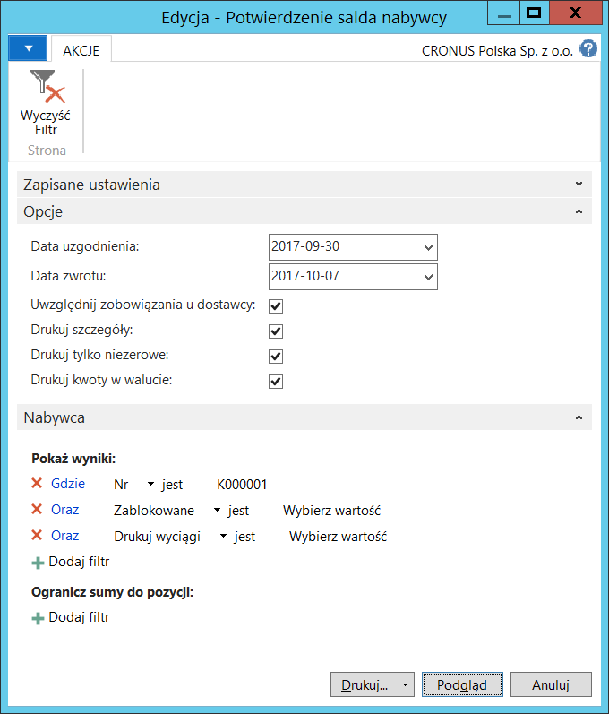{width="4.570866141732283in" height="5.358267716535433in"}
  ------------------------------------------------------------------------------------
  Rysunek 5.93: okno wstępne raportu Potwierdzenie salda nabywcy

3.  Należy wybrać **Drukuj** w celu wydrukowania dokumentów
    potwierdzenia salda nabywców lub **Podgląd w **celu wyświetlenia
    ich na ekranie:

  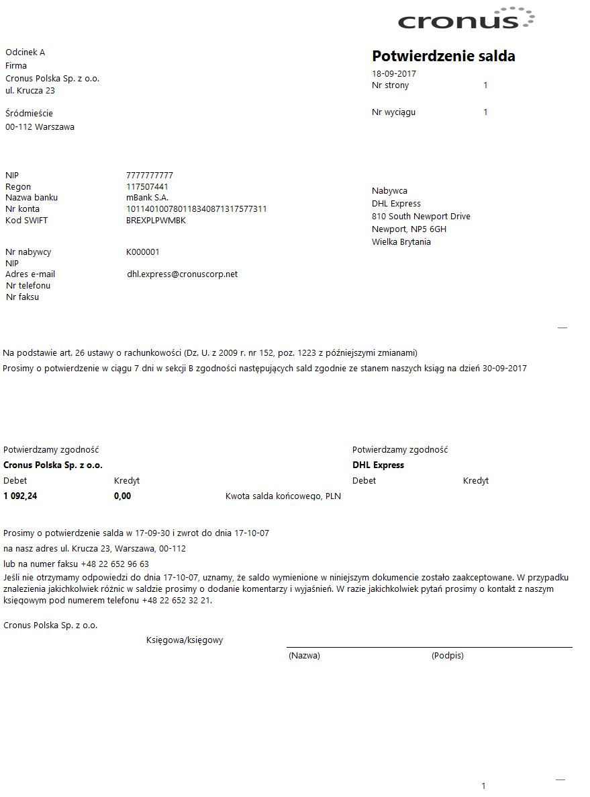{width="6.38344706911636in" height="8.60605971128609in"}
  ----------------------------------------------------------------------------------
  Rysunek 5.94: Wydruk Potwierdzenia salda nabywcy -- str. 1
  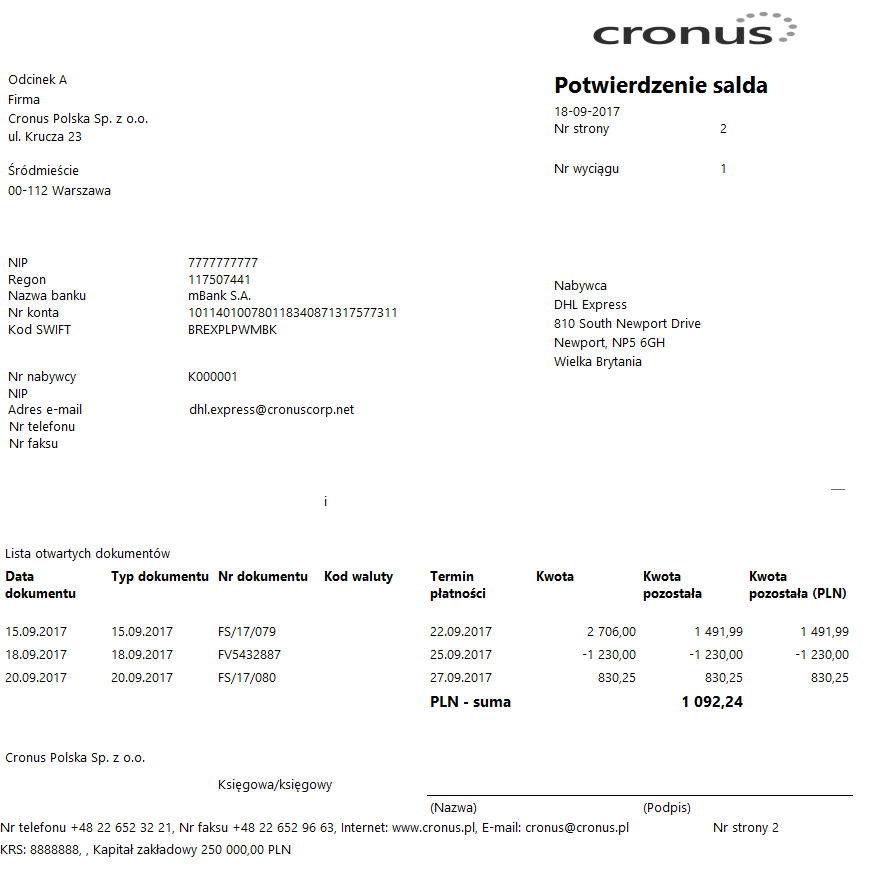{width="6.5in" height="6.663888888888889in"}
  Rysunek 5.95: Wydruk Potwierdzenia salda nabywcy -- str. 2

{width="0.19in" height="0.19in"} **Uwaga:
Po **stronie zobowiązań, w analogiczny sposób, można przygotować
i wydrukować dokument **Potwierdzenie salda dostawcy**.

Sprawozdanie kwartalne GUS DNU-K {#sprawozdanie-kwartalne-gus-dnu-k .Poziom-1}
--------------------------------

> **Informacje ogólne**

W sprawozdaniu kwartalnym DNU-K sporządzanym na potrzeby Głównego Urzędu
Statystycznego wykazywane są usługi dostarczone i nabyte
od nierezydentów. W ramach Polskiej Lokalizacji dostępne jest narzędzie
do przygotowania danych w celu sporządzenia sprawozdania DNU-K.

> **Ustawienia**

W Microsoft Dynamics 365 Business Central on‑premises konieczne jest
zdefiniowanie kodów statystycznych do oznaczania usług pozostałych
transakcji objętych sprawozdawczością. W tym celu należy postępować
według następujących kroków:

1.  Należy wybrać **Działy \> Zarządzanie Finansami \> Kody
    statystyczne \> Kody statystyczne**.

2.  W oknie **Kody statystyczne**, które się otworzy, należy wprowadzić
    kod i właściwy dla niego opis.

> Szczegółowy opis kodów usług i pozostałych transakcji objętych
> sprawozdawczością dostępny jest w wersji elektronicznej pod adresem
> <http://form.stat.gov.pl/formularze/2017/index.htm> przy wzorze
> formularza DNU-K.

+----------------------------------------------------------------------+
|   {width="4.700787401574803in" height="3.9606299212598426in"} |
|   -----------------                                                  |
| -------------------------------------------------------------------- |
|   Rysunek 5.96: Kody statystyczne                                    |
+----------------------------------------------------------------------+

Podawanie tych kodów w transakcjach sprzedaży usług jest konieczne
do poprawnego wygenerowania danych do sprawozdania DNU-K. Możliwe jest
zdefiniowanie reguł obowiązku podawania kodów statystycznych, w tym celu
należy postępować według następujących kroków:

1.  Należy wybrać **Działy \> Zarządzanie Finansami \> Kody
    statystyczne \> Ustawienia kodów statystycznych**.

2.  W oknie **Ustawienia kodów statystycznych**, które się otworzy,
    należy zdefiniować reguły obowiązywania kodów statystycznych zgodnie
    z poniższym opisem:

-   **Gł. gosp. grupa księgowa** -- w tym polu należy wybrać kod Głównej
    > gospodarczej grupy księgowej przypisanej do nabywcy lub dostawcy,
    > dla którego będzie wymagane podawanie kodu statystycznego

-   **Nr konta K/G** -- w tym polu należy wybrać numer konta z planu
    > kont, dla którego będzie wymagane podawanie kodu statystycznego

-   **Księgowanie wartości** -- w tym polu należy wybrać jedną z opcji:

```{=html}
<!-- -->
```
-   **Kod obowiązkowy** -- dla każdej transakcji z kombinacją wartości
    > z pól **Gł. gosp. grupa księgowa** i **Nr konta K/G** wymagane
    > jest podanie kodu statystycznego. W przypadku, gdy dla danego
    > ustawienia pole **Kod statystyczny** jest wypełnione, system
    > domyślnie wstawi tę wartość w transakcji, ale użytkownik będzie
    > mógł zmienić ją na inną. W przypadku, gdy dla danego ustawienia
    > pole **Kod statystyczny** jest puste, użytkownik będzie miał
    > obowiązek podać kod statystyczny ręcznie w każdej transakcji.

-   **Ten sam kod** -- dla każdej transakcji z kombinacją wartości z pól
    > **Gł. gosp. grupa księgowa** i **Nr konta K/G** wymagane jest
    > podanie kodu statystycznego, który dla danego ustawienia wybrany
    > jest w polu **Kod statystyczny**. Wybranie tej opcji powoduje,
    > że użytkownik nie będzie miał możliwości zmiany w transakcji
    > domyślnego kodu statystycznego na inny.

> Przy tej opcji wymagane jest wypełnienie pola **Kod statystyczny**.

-   **Bez kodu** -- wybranie tej opcji spowoduje, że w transakcji
    > z kombinacją wartości z pól **Gł. gosp. grupa księgowa** i **Nr
    > konta K/G** nie będzie możliwości podania kodu statystycznego.

```{=html}
<!-- -->
```
-   **Kod statystyczny** -- w tym polu można wybrać domyślny kod
    > statystyczny dla kombinacji wartości z pól **Gł. gosp. grupa
    > księgowa** i **Nr konta K/G**. Wypełnienie pola jest wymagane
    > tylko wtedy, jeśli w polu **Księgowanie wartości** wybrana jest
    > opcja **Ten sam kod**. W pozostałych przypadkach wypełnienie pola
    > jest dobrowolne.

  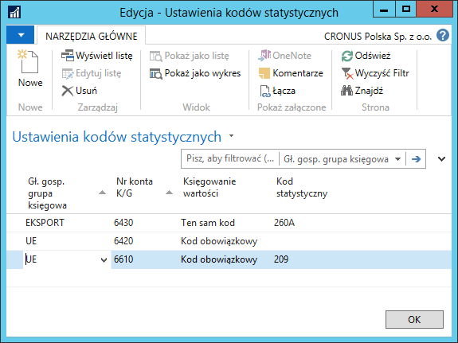{width="4.846456692913386in" height="3.6338582677165356in"}
  -------------------------------------------------------------------------------------
  Rysunek 5.97: Ustawienia kodów statystycznych

### Obsługa

Wprowadzając nowy dokument zakupu lub sprzedaży z usługami dotyczącymi
nierezydentów, w wierszach należy podać kod statystyczny. W tym celu
należy postępować według następujących kroków:

1.  Należy wybrać **Działy \> Zarządzanie Finansami \> Należności \>
    Faktury sprzedaży**.

2.  W oknie **Faktury sprzedaży**, które się otworzy, należy wybrać
    **Nowe.**

3.  Pola faktury sprzedaży należy wypełnić tak jak zwykle.

4.  W wierszach sprzedaży należy zwrócić uwagę na pole **Kod
    > statystyczny** i odpowiednio je wypełnić w wierszach, które tego
    > wymagają:

  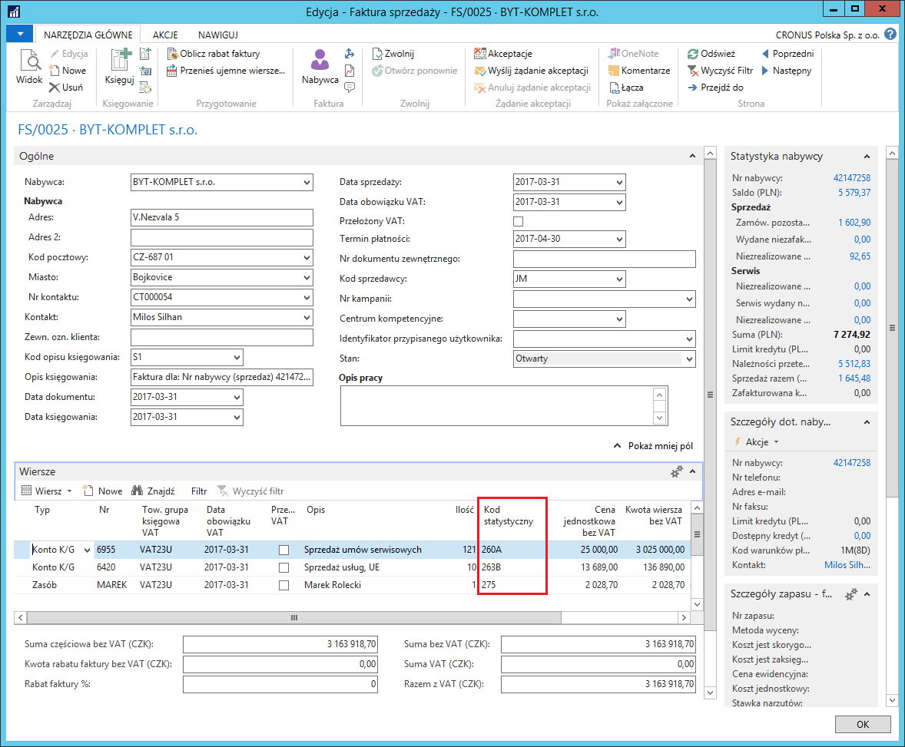{width="6.295692257217848in" height="5.2in"}
  ----------------------------------------------------------------------
  Rysunek 5.98: Faktura sprzedaży usług do nierezydenta

5.  Wybierz **Księguj**, a następnie potwierdź komunikat wybierając
    > **Tak**, aby zaksięgować fakturę sprzedaży.

> Próba zaksięgowania faktury sprzedaży bez uzupełnionego kodu
> statystycznego w wierszu, w którym jest to wymagane zgodnie
> z ustawieniami kodów statystycznych, zakończy się niepowodzeniem,
> a system wyświetli stosowny komunikat o błędzie:

  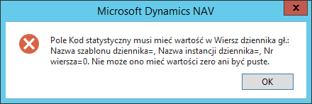{width="4.143999343832021in" height="1.3844728783902012in"}
  -------------------------------------------------------------------------------------
  Rysunek 5.99: Komunikat o braku wymaganego kodu statystycznego

 **Uwaga:** Pole **Kod statystyczny** jest
dostępne w wierszach **Faktury sprzedaży**, **Faktury korygującej
sprzedaży**, **Zamówienia sprzedaży**, **Zamówienia zwrotu sprzedaży**,
**Faktury zakupu**, **Faktury korygującej zakupu**, **Zamówienia
zakupu**, **Zamówienia zwrotu zakupu**, **Faktury serwisu**, **Faktury
korygującej serwisu** oraz w **Dzienniku głównym i Dzienniku wyciągów
bankowych**.

Aby wygenerować dane do sporządzenia sprawozdania DNU-K, należy
postępować według następujących kroków:

1.  Należy wybrać **Działy \> Zarządzanie Finansami \> Księga główna \>
    Raporty \> Kody statystyczne \> Zestawienie usług dla/od
    nierezydentów**.

2.  W oknie z opcjami wstępnymi raportu należy wprowadzić odpowiednie
    > filtry (mogą być używane w różnych kombinacjach), aby wygenerować
    > wymagane dane z wybranego konta K/G, za wybrany okres,
    > dla wybranego typu transakcji, dla wybranego typu źródła, np.:

  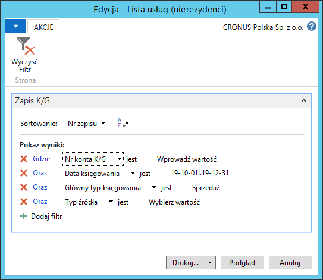{width="4.602362204724409in" height="3.9921259842519685in"}
  -------------------------------------------------------------------------------------
  Rysunek 5.100: Opcje wstępne raportu „Lista usług (nierezydenci)"

3.  Należy wybrać **Podgląd**, aby wyświetlić raport na ekranie
    > lub **Drukuj**, aby wydrukować raport na drukarce lub zapisać jako
    > plik w wybranym formacie.

  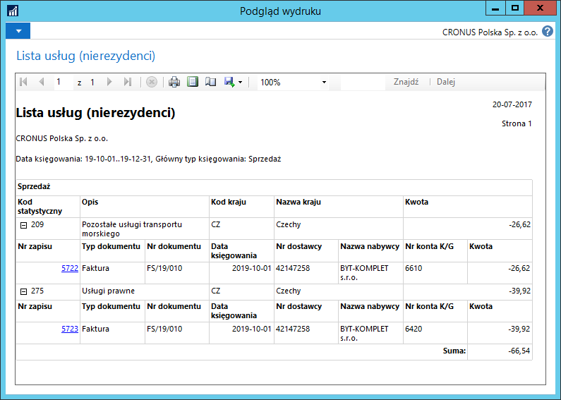{width="6.35200021872266in" height="4.530550087489064in"}
  -----------------------------------------------------------------------------------
  Rysunek 5.101: Podgląd raportu „Lista usług (nierezydenci)"

Obsługa środków trwałych {#obsługa-środków-trwałych .Rozdzial}
========================

6.  

```{=html}
<!-- -->
```
5.  

Klasyfikacja środków trwałych {#klasyfikacja-środków-trwałych .Poziom-1}
-----------------------------

### Informacje ogólne

> Przepisy polskiego prawa wymagają podziału środków trwałych
> według aktualnie obowiązującej ustawowej klasyfikacji środków
> trwałych. Oficjalna klasyfikacja środków trwałych ma 3 poziomy
> grupowania: grupa (np. Środki transportu), podgrupa (np. Pojazdy
> mechaniczne) i rodzaj (np. Samochody osobowe).

Od 1 stycznia 2018 r. dla celów m.in. bilansowych i podatkowych
obowiązuje nowa **Klasyfikacja Środków Trwałych (KŚT 2016).** Oznacza
to, że przy klasyfikowaniu dla celów bilansowych środków trwałych do
właściwej grupy, podgrupy i rodzaju, jednostki muszą korzystać z KŚT
2016. Zobowiązane są także stosować nowe roczne stawki amortyzacyjne
określone w załączniku nr 1 do ustawy o podatku dochodowym, dostosowane
do Klasyfikacji Środków Trwałych 2016.

Istotne jest, że KŚT 2016 wprowadza zmiany w numeracji oraz nazewnictwie
grup, podgrup oraz rodzajów środków trwałych. W sytuacji, gdy zmiany te
mają wpływ na środki trwałe ujęte w ewidencji księgowej przed 2018 r.
(zmieni się ich klasyfikacja lub nazwa), to z dniem 1 stycznia 2018 r.
konieczne stało się dostosowanie do KŚT 2016 zapisów w ewidencji
analitycznej prowadzonej do konta 01 „Środki trwałe". Jeśli jednostka
nie zrobi tego, może to doprowadzić do rozbieżności polegającej na tym,
że te same składniki majątku podlegałyby innej klasyfikacji,
w zależności od momentu ich wprowadzenia do ewidencji i obowiązujących
na ten moment regulacji. W związku z tym, jednostki powinny mieć
możliwość wygenerowania zestawień środków trwałych zarówno według KŚT
2010, jak i KŚT 2016.

Standardowa funkcjonalność systemu Microsoft Dynamics 365 Business
Central on‑premises została rozszerzona o możliwość przypisywania
do każdego środka trwałego określonego rodzaju zgodnego z Klasyfikacją
Środków Trwałych. W raportach modułu Środki trwałe została dodana
możliwość grupowania danych według numerów KŚT przypisanych do kartotek
środków trwałych

W systemie Microsoft Dynamics 365 Business Central on‑premises zostały
przygotowane narzędzia do wygenerowania tabel z Klasyfikacją Środków
Trwałych 2010 i Klasyfikacją Środków trwałych 2016, dzięki czemu do
każdego środka trwałego można przypisać dwa numery KŚT: jeden zgodny z
KŚT 2010, a drugi zgodny z KŚT 2016. Raporty dotyczące środków trwałych
mają możliwość generowania zestawień według obydwu klasyfikacji.

Podstawa prawna: ROZPORZĄDZENIE RADY MINISTRÓW z dnia 3 października
2016 r. w sprawie Klasyfikacji Środków Trwałych (KŚT) (Dz.U.2016
poz.1864).

### Ustawienia

Przed rozpoczęciem klasyfikowania środków trwałych według KŚT 2010 i/lub
KŚT 2016, konieczne jest wprowadzenie słowników dla każdej z
klasyfikacji. W tym celu należy postępować według następujących kroków:

1.  Należy wybrać **Działy \> Zarządzanie Finansami \>Środki trwałe \>
    Ustawienia ŚT**.

2.  W oknie **Ustawienia ŚT**, które się otworzy, należy wybrać
    > **Generuj klasyfikację KŚT 2010**.

  ----------------------------
  Rysunek 6.1: Ustawienia ŚT
  ----------------------------

3.  Potwierdzenie komunikatu, który się wyświetli, spowoduje, że słownik
    > KŚT 2010 zostanie wypełniony danymi o grupach, podgrupach i
    > rodzajach zgodnymi z Klasyfikacją Środków Trwałych 2010. Jeśli
    > taki słownik już istniał, jego dane zostaną usunięte i wprowadzone
    > ponownie.

  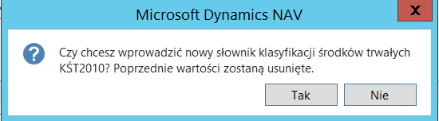{width="4.213781714785652in" height="1.1645363079615048in"}
  -------------------------------------------------------------------------------------
  Rysunek 6.2: Komunikat przy tworzeniu słownika KŚT 2010

4.  Po zakończeniu procesu tworzenia słownika KŚT 2010 pojawi się
    > stosowny komunikat.

  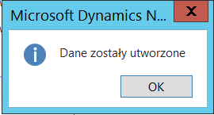{width="2.0757567804024495in" height="1.1147583114610673in"}
  --------------------------------------------------------------------------------------
  Rysunek 6.3: Komunikat potwierdzający utworzenie słownika KŚT 2010

5.  Utworzony słownik Klasyfikacji Środków Trwałych 2010 można przejrzeć
    > klikając przycisk **Klasyfikacja KŚT 2010** w oknie **Ustawienia
    > ŚT**.

  ----------------------------
  Rysunek 6.4: Ustawienia ŚT
  ----------------------------

  ------------------------------------
  Rysunek 6.5: Klasyfikacja KŚT 2010
  ------------------------------------

6.  W oknie **Ustawienia ŚT** należy wybrać **Generuj klasyfikację KŚT
    2016**.

  ----------------------------
  Rysunek 6.6: Ustawienia ŚT
  ----------------------------

7.  Potwierdzenie komunikatu, który się wyświetli, spowoduje, że słownik
    KŚT 2016 zostanie wypełniony danymi o grupach, podgrupach i
    rodzajach zgodnymi z  Klasyfikacją Środków Trwałych 2016. Jeśli taki
    słownik już istniał, jego dane zostaną usunięte i wprowadzone
    ponownie.

  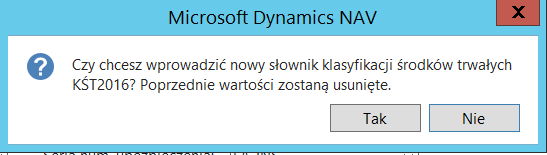{width="4.438461286089239in" height="1.2576990376202974in"}
  -------------------------------------------------------------------------------------
  Rysunek 6.7: Komunikat przy tworzeniu słownika KŚT 2016

8.  Po zakończeniu procesu tworzenia słownika KŚT 2016 pojawi się
    stosowny komunikat.

  {width="2.1969695975503063in" height="1.1798534558180227in"}
  --------------------------------------------------------------------------------------
  Rysunek 6.8: Komunikat potwierdzający utworzenie słownika KŚT 2016

9.  Utworzony słownik Klasyfikacji Środków Trwałych 2016 można przejrzeć
    klikając przycisk **Klasyfikacja KŚT 2016** w oknie **Ustawienia
    ŚT**.

```{=html}
<!-- -->
```
1.  

  ----------------------------
  Rysunek 6.9: Ustawienia ŚT
  ----------------------------

  -------------------------------------
  Rysunek 6.10: Klasyfikacja KŚT 2016
  -------------------------------------

### Obsługa

Przypisanie określonego rodzaju do wybranego środka trwałego dokonywane
jest w jego kartotece. W tym celu należy postępować według następujących
kroków:

1.  Należy otworzyć kartotekę wybranego środka trwałego w trybie edycji.

2.  W oknie **Kartoteka środka trwałego**, na karcie skróconej
    > **Ogólne** należy uzupełnić pole **Numer KŚT 2010**, wybierając
    > właściwy rodzaj z listy rozwijanej w tym polu, co spowoduje
    > jednoczesne wypełnienie pola **Numer KŚT 2016**, jeśli istnieje
    > jednoznaczne powiązanie z numerem wybranym w polu **Numer KŚT
    > 2010**.

{width="0.19722222222222222in"
height="0.19722222222222222in"} **Uwaga:** W przypadku, gdy nie ma
jednoznacznego powiązania symbolu KŚT 2010\
z symbolem KŚT 2016, pole **Nr KŚT 2016** w kartotece środka trwałego
należy wypełnić ręcznie, wybierając z listy właściwy kod.

  ------------------------------------------------------
  Rysunek 6.11: Numery KŚT w kartotece Środka trwałego
  ------------------------------------------------------

3.  Numery KŚT wprowadzone w kartotece środka trwałego widoczne są
    również na liście środków trwałych.

  -----------------------------------------------------
  Rysunek 6.12: Numery KŚT na liście Środków trwałych
  -----------------------------------------------------

W podstawowych raportach dotyczących środków trwałych dodana została
możliwość grupowania po numerze Klasyfikacji Środków Trwałych 2010 lub
2016 -- do wyboru. W oknie wstępnym każdego z niżej wymienionych
raportów, na karcie skróconej **Opcje** do pola **Sumy grup** zostały
dodane dwie opcje: **Numer KŚT 2010** i **Numer KŚT 2016**.

Opcja ta dostępna jest w raportach:

-   **Roczny plan amortyzacji**

-   **Środek trwały -- analiza,**

-   **Środek trwały -- analiza K/G,**

-   **Środek trwały -- wart. przewid.,**

-   **Środek trwały -- wart. ks. 01,**

-   **Środek trwały -- wart. ks. 02.**

  -----------------------------------------------------------
  Rysunek 6.13: Opcje Sumy grup w raporcie środków trwałych
  -----------------------------------------------------------

Zwiększenie wartości środka trwałego w fakturze zakupu {#zwiększenie-wartości-środka-trwałego-w-fakturze-zakupu .Poziom-1}
------------------------------------------------------

### Informacje ogólne

> Standardowa funkcjonalność systemu Microsoft Dynamics 365 Business
> Central on‑premises pozwala na księgowanie poprzez fakturę zakupu
> wyłącznie kosztu nabycia oraz eksploatacji środków trwałych. W ramach
> Polskiej Lokalizacji, obsługa środków trwałych została rozszerzona
> o możliwość ewidencji poprzez fakturę zakupu operacji zwiększenia
> wartości środka trwałego.

### Obsługa

W celu zaksięgowania operacji zwiększenia wartości środka trwałego
poprzez fakturę zakupu, należy postępować według następujących kroków:

1.  Należy w standardowy sposób wprowadzić fakturę zakupu.

2.  W oknie **Faktura zakupu**, na karcie skróconej **Wiersze** należy
    > w polu **Typ księgowania ŚT** wybrać opcje **Zwiększenie wart.**
    > (domyślnie wstawiana jest opcja **Koszt nabycia**):

  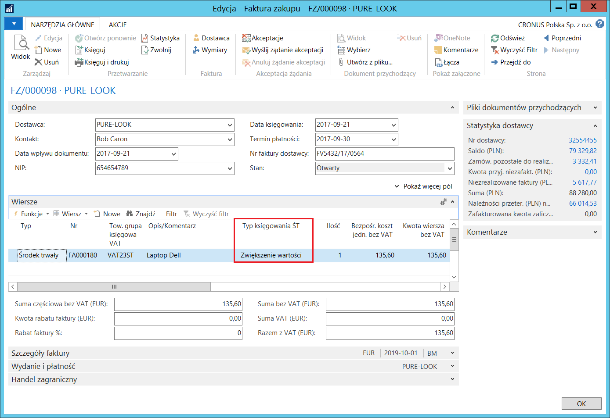{width="6.401514654418198in" height="4.3921500437445316in"}
  -------------------------------------------------------------------------------------
  Rysunek 6.14: Zwiększenie wartości środka trwałego w fakturze zakupu

3.  Należy zaksięgować fakturę.

4.  Efekt księgowania można zobaczyć m.in. w oknie **Zapisy księgi ŚT**:

  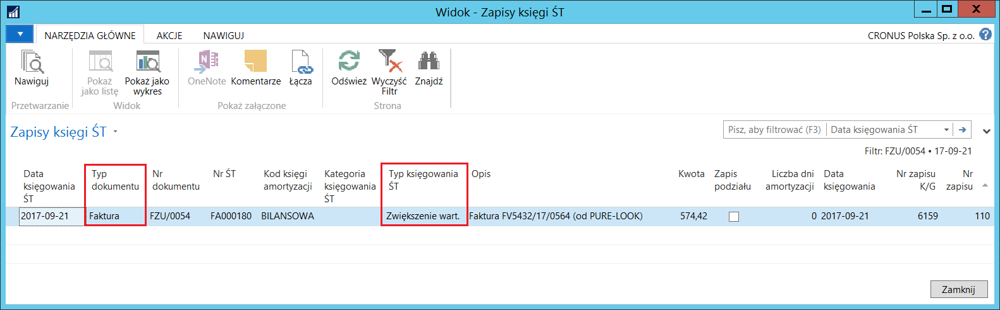{width="6.386363735783027in" height="1.9861865704286965in"}
  -------------------------------------------------------------------------------------
  Rysunek 6.15: Zwiększenie wartości środka trwałego w Zapisach księgi ŚT

 {#section-13 .list-paragraph .Poziom-1}

Roczny plan amortyzacji {#roczny-plan-amortyzacji .Poziom-1}
-----------------------

### Informacje ogólne

Wiele firm, chcąc oszacować przewidywaną wartość majątku trwałego
oraz wartości niematerialnych i prawnych przygotowuje symulację rocznej
amortyzacji. Przygotowanie takiego zestawienia wynika też z obowiązków
ustawowych narzuconych Ustawą o rachunkowości. Polska Lokalizacja
zawiera raport **Roczny plan amortyzacji** przedstawiający przewidywane
koszty amortyzacji elementów majątku trwałego w okresie roku.

### Obsługa

### W celu wydrukowania raportu Roczny plan amortyzacji, należy postępować według następujących kroków:

1.  Należy wybrać **Działy \> Zarządzanie Finansami \> Środki trwałe \>
    Roczny plan amortyzacji**.

2.  W oknie wstępnym raportu, które się otworzy, należy we właściwy
    sposób uzupełnić pola na karcie skróconej **Opcje**:

-   **Księga amortyzacji** -- z listy rozwijanej w tym polu należy
    > wybrać kod księgi amortyzacji, której parametry zostaną
    > wykorzystane do obliczenia kosztów przewidywanej amortyzacji

-   **Data początkowa** -- z listy rozwijanej w tym polu należy wybrać
    > datę początkową okresu obrachunkowego, który ma być pierwszym
    > okresem (zwykle: miesiącem) do kalkulacji przewidywanej
    > amortyzacji

-   **Data końcowa** -- z listy rozwijanej w tym polu należy wybrać datę
    > początkową okresu obrachunkowego, który ma być ostatnim okresem
    > (zwykle: miesiącem) do kalkulacji przewidywanej amortyzacji

> {width="0.19in" height="0.19in"}
> **Uwaga:** Okres wyświetlany w raporcie ograniczony jest do 12 kolumn
> (zwykle: miesięcy) liczonych od **Daty początkowej**. jeśli **Data
> końcowa** zostanie wyznaczona poza okresem 12 miesięcy, system
> zignoruje wszystkie miesiące powyżej 12.

-   **Sumy grup** -- w tym polu można wybrać poziom grupowania kwot
    > przewidywanej amortyzacji. Pozostawienie pola pustego spowoduje
    > niegrupowanie danych.

-   **Drukuj dla środka trwałego** -- zaznaczenie tego pola spowoduje
    > wyświetlenie szczegółów przewidywanej kwoty amortyzacji
    > z dokładnością do kartoteki środka trwałego.

> Na karcie skróconej **Środek trwały** można w standardowy sposób
> ustawić filtry ograniczające zakres danych wybranych do wydrukowania.

  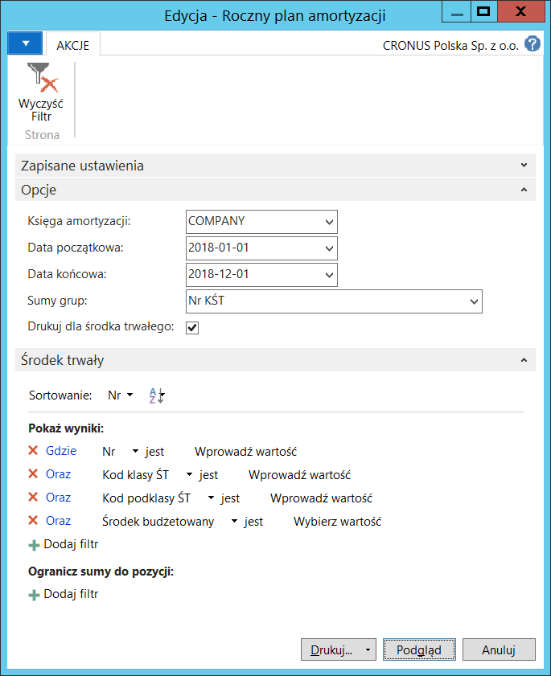{width="4.622047244094488in" height="5.673228346456693in"}
  ------------------------------------------------------------------------------------
  Rysunek 6.16: okno wstępne raportu Roczny plan amortyzacji

4.  Należy wybrać **Drukuj** w celu wydrukowania rocznego planu
    amortyzacji lub **Podgląd w **celu wyświetlenia go na ekranie:

  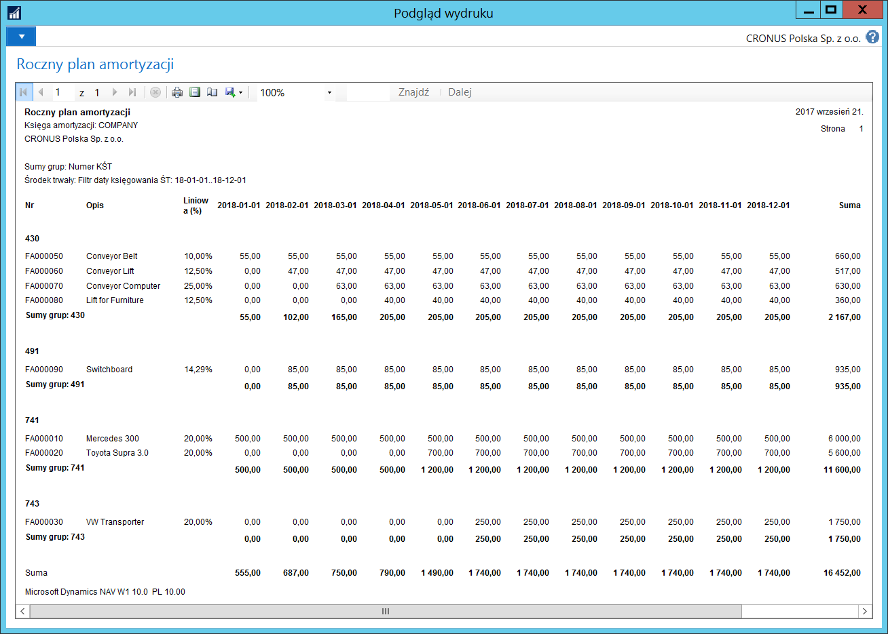{width="6.401514654418198in" height="4.575441819772529in"}
  ------------------------------------------------------------------------------------
  Rysunek 6.17: Wydruk rocznego planu amortyzacji

Obsługa zapasów {#obsługa-zapasów .Rozdzial}
===============

7.  

```{=html}
<!-- -->
```
6.  

Polska Klasyfikacja Wyrobów i Usług (PKWiU) {#polska-klasyfikacja-wyrobów-i-usług-pkwiu .Poziom-1}
-------------------------------------------

### Informacje ogólne

Polska Klasyfikacja Wyrobów i Usług przeznaczona jest do stosowania
w statystyce, ewidencji i dokumentacji oraz rachunkowości, a także
w sprawach podatkowych (w tym w sprawach podatku od towarów i usług
VAT), w urzędowych rejestrach czy w systemach informacyjnych
administracji publicznej. Od 1 stycznia 2016 obowiązuje klasyfikacja
PKWiU 2015.

Funkcjonalność PKWiU, będąca elementem Polskiej Lokalizacji, umożliwia
ewidencję transakcji zakupu i sprzedaży z właściwym dla danego towaru
kodem PKWiU. Kod ten, w razie potrzeby, jest drukowany na fakturach
sprzedaży.

### Ustawienia

W celu uniknięcia pomyłek przy wprowadzaniu kodów PKWiU w transakcjach,
należy najpierw zdefiniować słownik dopuszczalnych kodów PKWiU,
który będzie wykorzystywany w powiązanych z nim polach. W tym celu
należy postępować według następujących kroków:

1.  Należy wybrać **Działy \> Magazyn \> Administracja \> Kody PKWiU**.

2.  W oknie **Kody PKWiU** należy w kolejnych wierszach wprowadzić kody
    > i stosowne opisy, zgodne z Polską Klasyfikacją Wyrobów i Usług:

  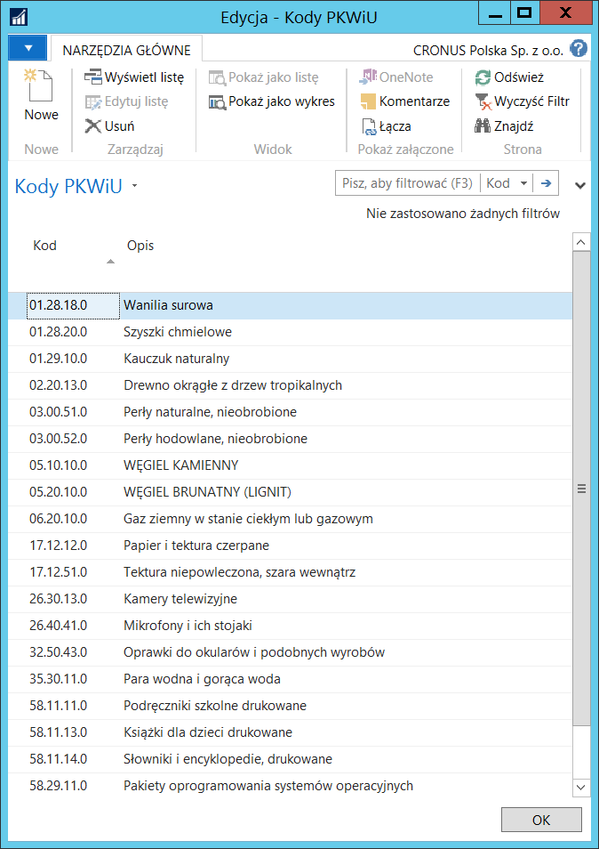{width="4.52755905511811in" height="6.409448818897638in"}
  -----------------------------------------------------------------------------------
  RYSUNEK 7.1: Kody PKWiU

W sytuacji, gdy w firmie występuje obrót towarami, dla których istnieje
obowiązek umieszczania informacji o PKWiU, do kartoteki zapasu można
przypisać domyślny kod PKWiU, który będzie kopiowany do dokumentów
zakupu i sprzedaży z tym zapasem. W tym celu należy postępować
według następujących kroków:

1.  Należy otworzyć kartotekę wybranego zapasu.

2.  Na karcie skróconej **Fakturowanie**, z listy rozwijanej w polu
    > **PKWiU** należy wybrać właściwy kod PKWiU z wcześniej
    > zdefiniowanego słownika:

  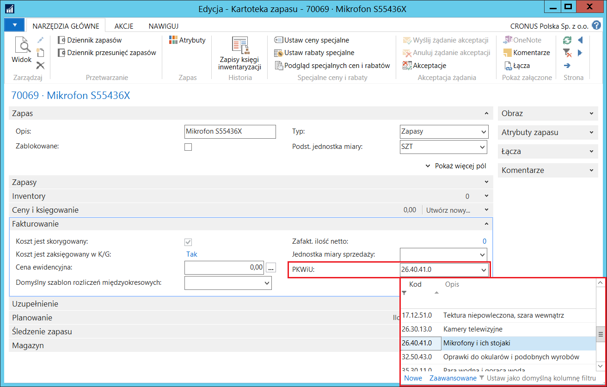{width="6.401514654418198in" height="4.080282152230971in"}
  ------------------------------------------------------------------------------------
  RYSUNEK 7.2: Kod PKWiU w kartotece zapasu

Jako że dla wybranych stawek podatku VAT podawanie kodu PKWiU jest
obowiązkowe, konieczna jest kontrola jego wypełnienia, aby zapobiec
ewentualnemu zapomnieniu. W celu ustawienia reguł kontroli, należy
postępować według następujących kroków:

1.  Należy wybrać **Działy \> Zarządzanie Finansami \> Administracja \>
    > Ustawienia księgowe VAT.**

2.  W oknie **Ustawienia księgowe VAT**, które się otworzy, należy
    > zaznaczyć wiersz z wybraną kombinacją kodów w polach: **Gosp.
    > grupa księgowa** **VAT** i **Tow. grupa księgowa VAT**,
    > a następnie wybrać **Edycja**.

3.  W oknie **Kartoteka ustaw. księg. VAT**, które się otworzy,
    > na karcie skróconej **Ogólne** należy zaznaczyć pole **PKWiU
    > obowiązkowe**.

  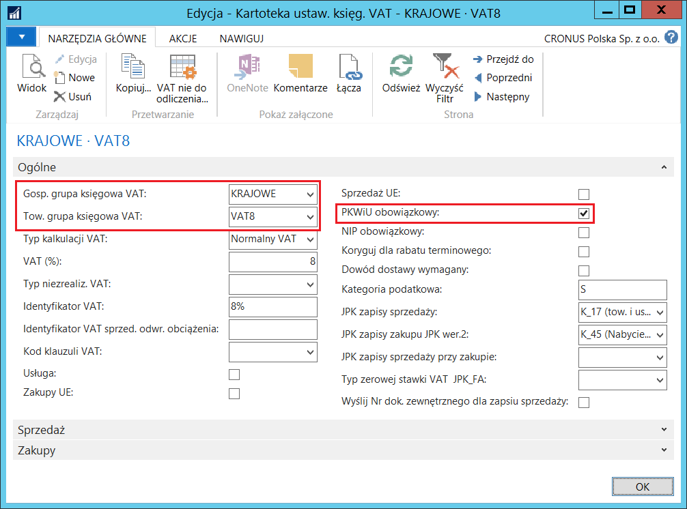{width="6.393939195100613in" height="4.740804899387577in"}
  ------------------------------------------------------------------------------------
  RYSUNEK 7.3: Ustawienia księgowe VAT

Próba zaksięgowania dokumentu sprzedaży bez uzupełnionego pola PKWiU
w wierszu, w którym występuje kombinacja kodów w polach: **Gosp. grupa
księgowa** **VAT** i **Tow. grupa księgowa VAT**, dla której zostało
zaznaczone pole **PKWiU obowiązkowe** skutkuje wyświetleniem komunikatu
o błędzie:

  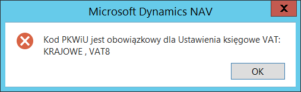{width="4.225366360454943in" height="1.2917782152230972in"}
  -------------------------------------------------------------------------------------
  RYSUNEK 7.4: Błąd księgowania dokumentu SPRZEDAŻY BEZ podania kodu PKWiU

### Obsługa

**Zasada umieszczania kodów na fakturze sprzedaży jest identyczna
w oknach: Zamówienie sprzedaży i Faktura sprzedaży, dlatego poniżej jako
przykład zostanie opisane Zamówienie sprzedaży.**

**W celu umieszczenia kodu PKWiU na fakturze sprzedaży, należy
postępować według następujących kroków:**

1.  Należy wybrać **Działy \> Sprzedaż i Marketing \> Przetwarzanie
    zamówień \> Zamówienia sprzedaży.**

2.  W oknie, które się otworzy, należy wybrać **Nowe** i wprowadzić
    wszystkie dane standardowo.

3.  Na karcie skróconej **Wiersze** należy zwrócić uwagę na pole
    **PKWiU**.

-   W wierszu, w którym w polu **Typ** wybrany jest **Zapas**, a w polu
    > **Nr** wybrany jest zapas, do którego został przypisany domyślny
    > kod PKWiU, pole **PKWiU** wypełnia się automatycznie. Możliwa jest
    > zmiana wstawionego kodu PKWiU na inny, wybrany z listy wcześniej
    > zdefiniowanych kodów, rozwijanej w polu **PKWiU**.

-   W wierszu, w którym w polu **Typ** wybrane jest **Konto K/G**, a
    > w polu **Nr** wybrane jest konto przychodów ze sprzedaży usług,
    > to pole **PKWiU** pozostaje puste. Jeśli jest to wymagane, należy
    > wstawić właściwy kod PKWiU z listy wcześniej zdefiniowanych kodów,
    > rozwijanej w polu **PKWiU**.

  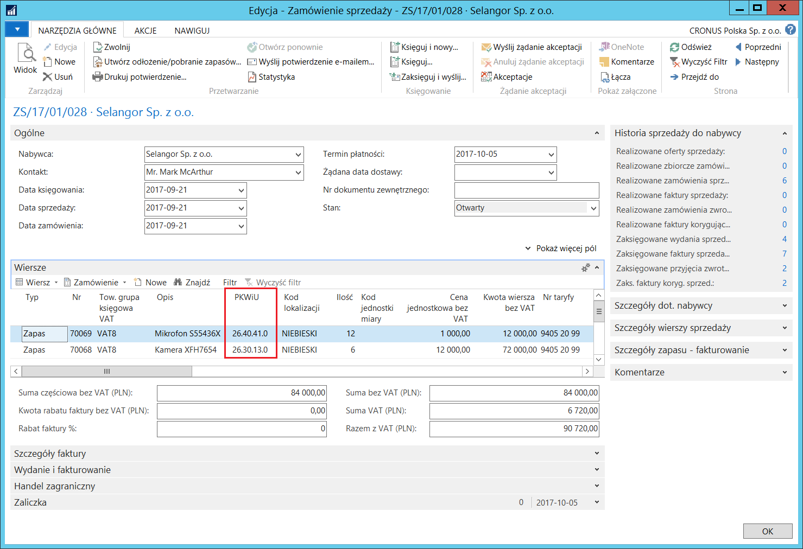{width="6.401514654418198in" height="4.380523840769904in"}
  ------------------------------------------------------------------------------------
  RYSUNEK 7.5: Kod PKWiU w zamówieniu sprzedaży

4.  Z tak przygotowanego zamówienia można wystawić i wydrukować fakturę
    sprzedaży. W tym celu należy wybrać **Księguj i drukuj**. Na wydruku
    faktury sprzedaży umieszczona jest stosowna informacja o kodach
    PKWiU dla sprzedawanych wyrobów i usług.

  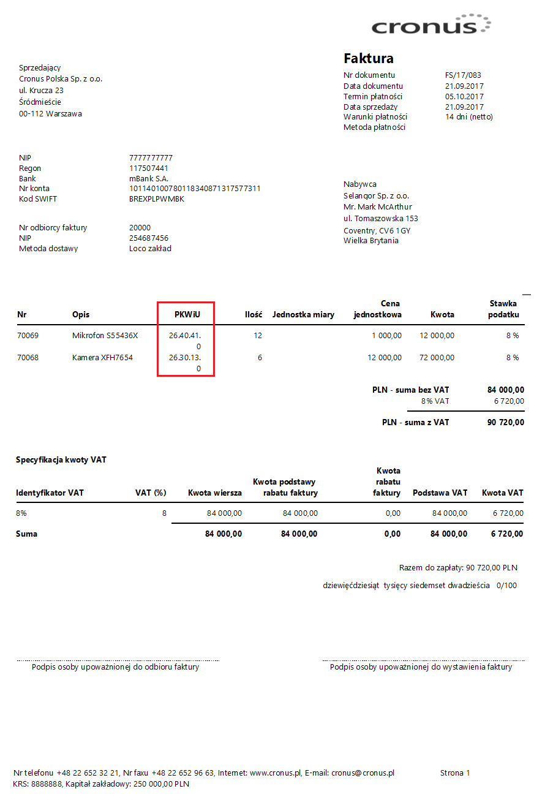{width="5.25in" height="7.7511964129483815in"}
  ------------------------------------------------------------------------
  RYSUNEK 7.6: Kod PKWiU na wydruku faktury sprzedaży

{width="0.19in" height="0.19in"}
**Uwaga:** Pole **PKWiU** jest dostępne w wierszach dokumentów:
**Zamówienie sprzedaży**, **Faktura sprzedaży**, **Zamówienie zwrotu
sprzedaży**, **Faktura korygująca sprzedaży** oraz na wydrukach:
**Faktury sprzedaży i Faktury korygującej sprzedaży**.

Obsługa gł. gospodarczej grupy księgowej w operacjach magazynowych {#obsługa-gł.-gospodarczej-grupy-księgowej-w-operacjach-magazynowych .Poziom-1}
------------------------------------------------------------------

### Informacje ogólne

W standardowej wersji systemu Microsoft Dynamics 365 Business Central
on‑premises **Zlecenia przesunięcia, Zlecenia produkcyjne i Zlecenia
kompletacji** księgowane są domyślnie według ustawień zdefiniowanych
w oknie **Główne ustawienia księgowania**, w wierszach z pustym polem
**Gł. gosp. grupa księgowa**. Polska Lokalizacja umożliwia wybór kodu
**Gł. gosp. grupy księgowej** w kartotece **Zlecenia przesunięcia,
Zlecenia produkcyjnego i Zlecenia kompletacji**. Możliwe jest również
zdefiniowanie domyślnego kodu **Gł. gosp. grupy księgowej**. Poniżej
opisane jest zastosowanie kodu **Gł. gosp. grupy księgowej**
w zleceniach przesunięcia. Kody **Gł. gosp. grup księgowych** mają
analogiczne zastosowanie w zleceniach produkcyjnych i zleceniach
kompletacji.

W dziennikach inwentaryzacji standardowo jest możliwość ręcznego wyboru
kodu **Gł. gosp. grupy księgowej w **celu pośredniego określenia kont
do zaksięgowania wartości niedoborów i nadwyżek. Polska Lokalizacja
umożliwia zdefiniowanie domyślnych kodów **Gł. gosp. grupy księgowej**
dla nadwyżek i niedoborów wynikających z inwentaryzacji.

### Ustawienia

### Aby zdefiniować domyślne kody Gł. gosp. grupy księgowej dla zleceń przesunięcia oraz niedoborów i nadwyżek inwentaryzacyjnych, należy postępować według następujących kroków:

1.  Należy wybrać **Działy \> Magazyn \> Administracja \> Ustawienia
    > zapasów**.

2.  W oknie **Ustawienia zapasów**, które się otworzy, na karcie
    > skróconej **Księgowanie** należy z listy rozwijanej w polu
    > **Przeciwst. gł.gosp.gr.księgowa** wybrać kod **Gł. gosp. grupy
    > księgowej**, której ustawienia zdefiniowane w oknie **Główne
    > ustawienia księgowania** będą obowiązywały podczas księgowania
    > transakcji wydań/przyjęć zapasów w ramach **Zleceń przesunięcia**.

3.  Na karcie skróconej **Inwentaryzacja** należy z listy rozwijanej
    > w polu **Dom. gł. gosp. grupa księgowa -- inwentaryzacja --
    > nadwyżka** wybrać kod **Gł. gosp. grupy księgowej**, której
    > ustawienia zdefiniowane w oknie **Główne ustawienia księgowania**
    > będą obowiązywały podczas księgowania zapisów typu **Korekta
    > in-plus** w dzienniku inwentaryzacji, a w polu **Dom. gł. gosp.
    > grupa księgowa -- inwentaryzacja -- niedobór** należy wybrać kod
    > **Gł. gosp. grupy księgowej**, której ustawienia zdefiniowane
    > w oknie **Główne ustawienia księgowania** będą obowiązywały
    > podczas księgowania zapisów typu **Korekta in-minus** w dzienniku
    > inwentaryzacji.

  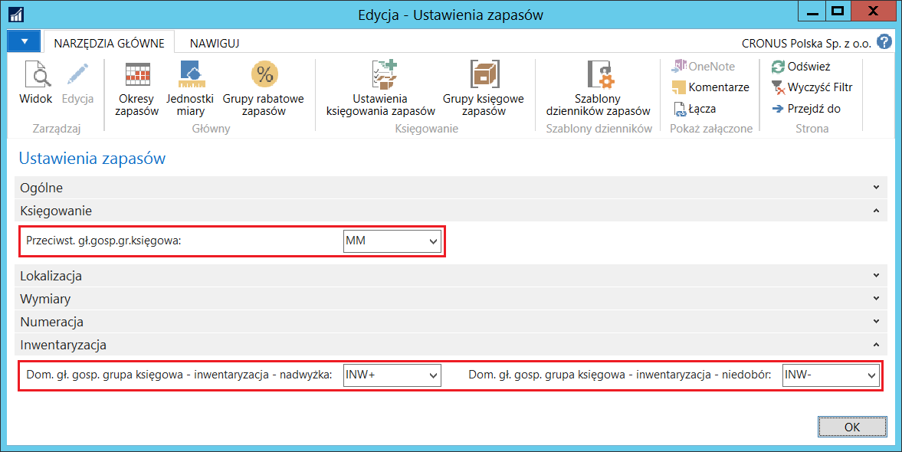{width="6.393939195100613in" height="3.2051673228346456in"}
  -------------------------------------------------------------------------------------
  RYSUNEK 7.7: Ustawienia zapasów

  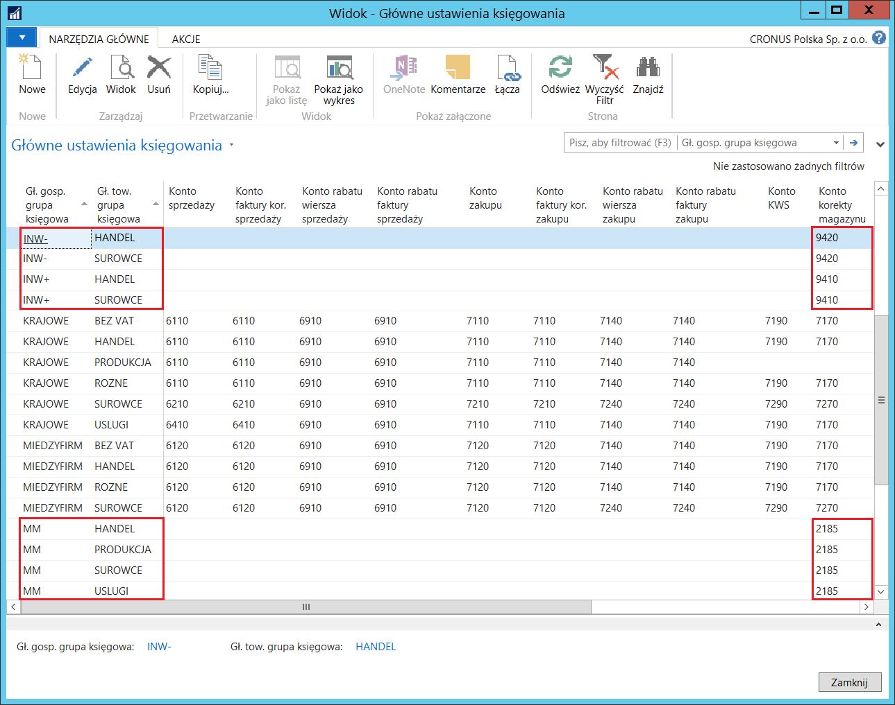{width="6.409090113735783in" height="5.0567443132108485in"}
  -------------------------------------------------------------------------------------
  RYSUNEK 7.8: Główne ustawienia księgowania

### Obsługa

### W celu utworzenia zlecenia przesunięcia z wykorzystaniem Gł. gosp. grupy księgowej, należy postępować według następujących kroków:

1.  Należy wybrać **Działy \> Magazyn \> Planowanie i wykonywanie \>
    > Zlecenia przesunięcia**.

2.  W oknie **Zlecenia przesunięcia**, które się otworzy, należy wybrać
    > **Nowe**.

3.  W kartotece nowego zlecenia przesunięcia, po nadaniu numeru, system
    > automatycznie uzupełni pole **Gł. gosp. grupa księgowa** kodem
    > wybranym w polu **Przeciwst. gł.gosp.gr.księgowa** w oknie
    > **Ustawienia zapasów**. W razie potrzeby, kod wstawiony domyślnie
    > może zostać ręcznie zmieniony:

  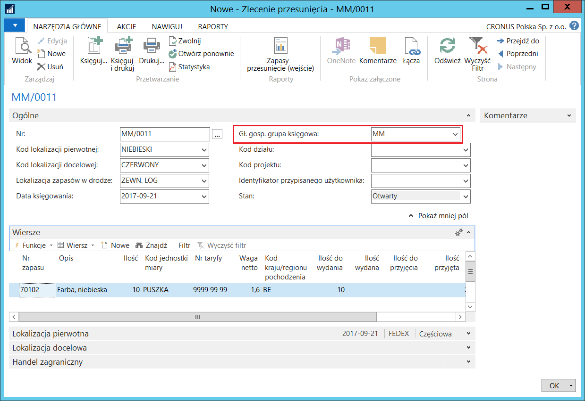{width="6.376080489938758in" height="4.378787182852143in"}
  ------------------------------------------------------------------------------------
  RYSUNEK 7.9: Kartoteka zlecenia przesunięcia

4.  Należy zaksięgować wydanie i przyjęcie.

Efekt księgowania można obejrzeć nawigując zaksięgowane dokumenty. W tym
celu, należy postępować według następujących kroków:

1.  Należy wybrać **Działy \> Magazyn \> Archiwum \> Zaksięgowane
    > dokumenty \> Zaks. wydania przesunięcia.**

2.  W oknie **Zaks. wydania przesunięcia**, które się otworzy, należy
    > zaznaczyć wybrany wiersz i wybrać **Nawiguj**.

3.  W oknie **Nawigacja** należy zaznaczyć tabelę **Zapis K/G** i wybrać
    > **Pokaż powiązane zapisy**.

  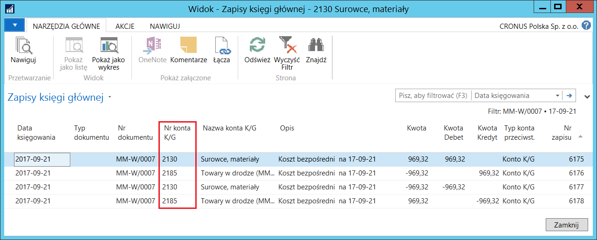{width="6.409090113735783in" height="2.586232502187227in"}
  ------------------------------------------------------------------------------------
  RYSUNEK 7.10: Zapisy K/G - Zaks. wydanie przesunięcia

4.  Należy wybrać **Działy \> Magazyn \> Archiwum \> Zaksięgowane
    > dokumenty \> Zaks. przyjęcia przesunięcia.**

5.  W oknie **Zaks. przyjęcia przesunięcia**, które się otworzy, należy
    > zaznaczyć wybrany wiersz i wybrać **Nawiguj**.

6.  W oknie **Nawigacja** należy zaznaczyć tabelę **Zapis K/G** i wybrać
    > **Pokaż powiązane zapisy**.

  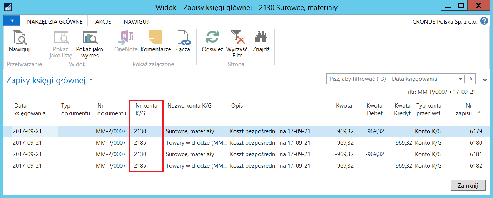{width="6.378787182852143in" height="2.5740037182852142in"}
  -------------------------------------------------------------------------------------
  RYSUNEK 7.11: Zapisy K/G - Zaks. przyjęcie przesunięcia

### W celu użycia Gł. gosp. grupy księgowej w dzienniku inwentaryzacji, należy postępować według następujących kroków:

1.  Należy wybrać **Działy \> Magazyn \> Zapasy \> Dzienniki
    inwentaryzacji**.

2.  W oknie **Dziennik inwentaryzacji**, które się otworzy, należy
    > wybrać akcję **Oblicz ilość zapasów**.

3.  W wierszach dziennika system automatycznie uzupełni pole **Gł. gosp.
    > grupa księgowa** kodem wybranym w polu **Dom. gł. gosp. grupa
    > księgowa -- inwentaryzacja -- nadwyżka** w oknie **Ustawienia
    > zapasów**. Po wypełnieniu pola **Ilość (inwentaryzacja)** system
    > automatycznie rozpoznaje czy jest to nadwyżka, czy niedobór
    > i automatycznie zmienia kod w polu **Gł. gosp. grupa księgowa**
    > zgodnie z kodem wybranym w polach **Dom. gł. gosp. grupa księgowa
    > -- inwentaryzacja -- nadwyżka** i **Dom. gł. gosp. grupa księgowa
    > -- inwentaryzacja -- niedobór** w oknie **Ustawienia zapasów**:

  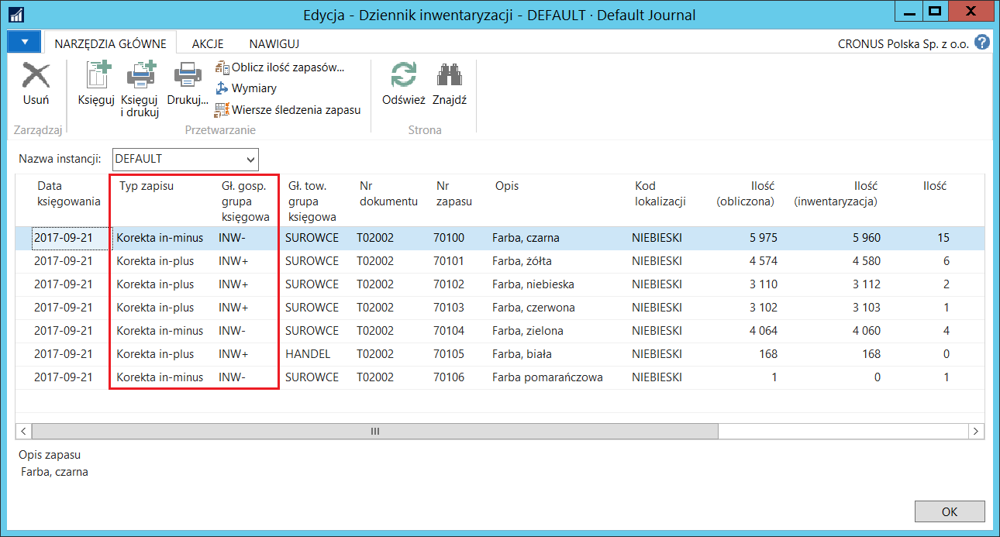{width="6.388585958005249in" height="3.4318175853018373in"}
  -------------------------------------------------------------------------------------
  RYSUNEK 7.12: Wiersze dziennika inwentaryzacji

4.  Należy zaksięgować dziennik inwentaryzacji.

Efekt księgowania można obejrzeć w zapisach księgowych. W tym celu,
należy postępować według następujących kroków:

1.  Należy wybrać **Działy \> Zarządzanie Finansami \> Archiwum \>
    Rejestry K/G.**

2.  W oknie **Rejestry K/G**, które się otworzy, należy zaznaczyć wiersz
    > z ostatnim rejestrem i na wstążce należy kliknąć przycisk **Księga
    > główna**.

  {width="6.409090113735783in" height="3.7769805336832896in"}
  -------------------------------------------------------------------------------------
  RYSUNEK 7.13: Zapisy K/G -- Zaksięgowana inwentaryzacja

Kalkulacja podatku od opakowań {#kalkulacja-podatku-od-opakowań .Poziom-1}
------------------------------

### Informacje ogólne

> Firmy sprzedające lub zużywające towary na rynku lokalnym
> są zobowiązane do przygotowania deklaracji podatku od opakowań
> na potrzeby kalkulacji opłaty produktowej. Polska Lokalizacja zawiera
> narzędzia ułatwiające przygotowanie takiej deklaracji poprzez:

-   Zdefiniowanie listy **Opakowań**

-   Zbieranie danych o sprzedaży i zużyciu zapasów w powiązaniu
    > ze zdefiniowaną listą opakowań

-   Kalkulacja i raportowanie podatku od opakowań dla wymienionych wyżej
    > transakcji i zapasów

### Ustawienia

W celu zdefiniowania opakowań i przypisania im właściwych parametrów,
należy postępować według następujących kroków:

1.  Należy wybrać **Działy \> Zarządzanie Finansami \> Zapasy \>
    Opakowania.**

2.  W oknie **Opakowania**, które się otworzy, należy każdy rodzaj
    opakowania wprowadzić w nowym wierszu, wypełniając we właściwy
    sposób pola:

-   **Kod --** w tym polu należy wprowadzić unikalny kod, jednoznacznie
    > identyfikujący dany rodzaj opakowania.

-   **Opis** -- w tym polu należ wprowadzić opis opakowania zgodny
    > z **Kodem**.

-   **Stawka podatku (PLN)** -- w tym polu należy wprowadzić stawkę
    > podatku od opakowań wyrażoną w kwocie waluty lokalnej.

-   **Rabat (%)** -- w tym polu należy wprowadzić wysokość rabatu
    > w podatku od opakowań, wyrażonego w procentach, przyznanego
    > dla opakowań przyjaznych środowisku.

-   **Zwolnienie (%)** -- w tym polu należy wprowadzić wysokość
    > zwolnienia od podatku, wyrażonego w procentach, które może być
    > przyznane firmom mającym umowy recyklingu z firmami zajmującymi
    > się gospodarowaniem odpadami.

  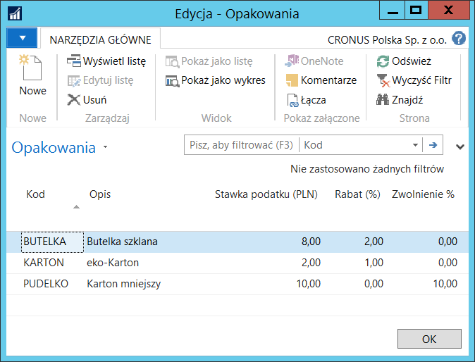{width="4.543307086614173in" height="3.4645669291338583in"}
  -------------------------------------------------------------------------------------
  RYSUNEK 7.14: Opakowania

W celu przypisania domyślnych opakowań do kartotek zapasów, należy
postępować według następujących kroków:

1.  W oknie kartoteki wybranego zapasu należy wybrać **Opakowania**.

2.  W oknie **Opakowania zapasu**, które się otworzy, należy wybrać
    **Nowe**. W nowym wierszu należy wprowadzić informację o opakowaniu
    stosowanym dla wybranej jednostki miary wybranego zapasu,
    wypełniając pola:

-   **Kod jednostki miary zapasu** -- z listy rozwijanej w tym polu
    > należy wybrać jednostkę miary zdefiniowaną wcześniej dla zapasu,
    > która będzie podstawą do kalkulacji podatku od opakowań.

-   **Kod opakowania -- z **listy rozwijanej w tym polu należy wybrać
    > wcześniej zdefiniowany rodzaj opakowania używany do obrotu
    > zapasami w jednostkach miary wybranej w poprzednim polu.
    > Wypełnienie tego pola jest wyznacznikiem do skalkulowania podatku
    > od opakowań.

-   **Waga** -- w tym polu należy wprowadzić wagę opakowania
    > przypadającą na jedną jednostkę zapasu zgodną z wybraną w polu
    > **Kod jednostki miary zapasu**.

  {width="4.708661417322834in" height="3.295275590551181in"}
  ------------------------------------------------------------------------------------
  RYSUNEK 7.15: Opakowania zapasu

### Obsługa

W celu wygenerowania raportu przedstawiającego kalkulację podatku
od opakowań, należy postępować według następujących kroków:

1.  Należy wybrać **Działy \> Zarządzanie Finansami \> Zapasy \>
    > Kalkulacja podatku od opakowań**.

2.  W oknie wstępnym raportu, na karcie skróconej **Opcje**, w polu
    > **Typ zapisu** należy wybrać jedną z dostępnych opcji: **Zakup**
    > lub **Sprzedaż**, decydując w ten sposób czy podatek ma zostać
    > skalkulowany dla opakowań w transakcjach zakupu,
    > czy w transakcjach sprzedaży. Można też zaznaczyć pole **Drukuj
    > szczegóły**, żeby w raporcie zostały wydrukowane szczegóły obrotu
    > zapasów składające się na skalkulowaną kwotę podatku od opakowań.
    > Niezaznaczenie tego pola spowoduje wyświetlenie kwoty podatku
    > od opakowań sumarycznie dla każdego rodzaju opakowania. Na karcie
    > skróconej **Zapas** można w standardowy sposób ustawić filtry,
    > w celu ograniczenia danych wyświetlanych w raporcie:

  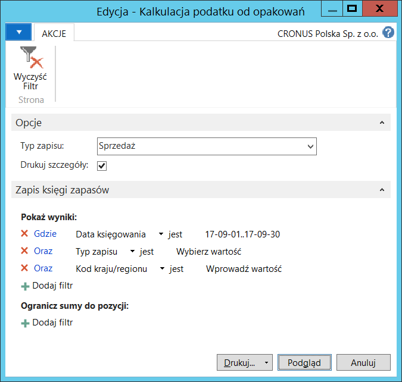{width="4.566929133858268in" height="4.34251968503937in"}
  -----------------------------------------------------------------------------------
  RYSUNEK 7.16: Okno wstępne raportu Kalkulacja podatku od opakowań

3.  Należy wybrać **Drukuj** w celu wydrukowania zestawienia
    lub **Podgląd w **celu wyświetlenia zestawienia na ekranie:

  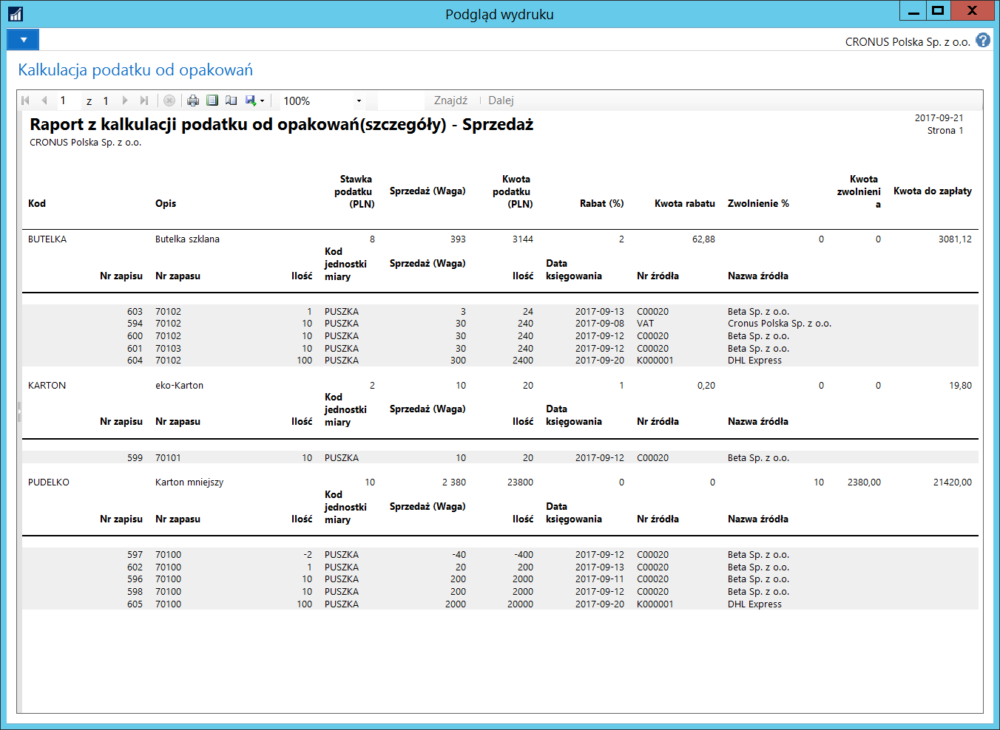{width="6.386363735783027in" height="4.666958661417323in"}
  ------------------------------------------------------------------------------------
  RYSUNEK 7.17: Raport z kalkulacji podatku od opakowań

 {#section-14 .list-paragraph .Poziom-1}

Intrastat {#intrastat .Poziom-1}
---------

### Informacje ogólne

### Przystąpienie Polski do Unii Europejskiej spowodowało nałożenie nowego obowiązku sprawozdawczego na podmioty prowadzące wymianę towarową z państwami członkowskimi Unii Europejskiej. Obowiązek ten polega na dokonywaniu przez podmiot zgłoszeń Intrastat, czyli na przekazywaniu organom celnym, w wymaganej formie i w określony sposób, informacji na temat obrotu towarowego z państwami członkowskimi Wspólnoty. Standardowa funkcjonalność systemu Microsoft Dynamics 365 Business Central on‑premises zawiera narzędzia ułatwiające przygotowanie deklaracji Intrastat, a w ramach Polskiej Lokalizacji zostały dodane ulepszenia, w tym również możliwość eksportu deklaracji Intrastat do pliku w formacie XML.

### Ustawienia

W celu zdefiniowania podstawowych parametrów Intrastat, należy
postępować według następujących kroków:

1.  Należy wybrać **Działy \> Zarządzanie Finansami \> Administracja \>
    Ustawienia raportowania stat.**

2.  W oknie **Ustawienia raportowania stat.**, które się otworzy, należy
    odpowiednio wypełnić pola na karcie skróconej **Intrastat**:

-   **Obowiązkowy typ transakcji** -- zaznaczenie tego pola powoduje,
    > że podczas księgowania system sprawdza, czy pole **Typ
    > transakcji** jest wypełnione w dokumentach sprzedaży, zakupu
    > i przesunięć, po zaksięgowaniu których powstaną zapisy w tabelach:
    > **Zapisy księgi zapasu** lub **Zapisy księgi zleceń**.

-   **Obowiązkowa specyfikacja transakcji** -- zaznaczenie tego pola
    > powoduje, że podczas księgowania system sprawdza, czy pole
    > **Specyfikacja transakcji** jest wypełnione w dokumentach
    > sprzedaży, zakupu i przesunięć, po zaksięgowaniu których powstaną
    > zapisy w tabelach: **Zapisy księgi zapasu** lub **Zapisy księgi
    > zleceń**.

-   **Obowiązkowa metoda transportu** -- zaznaczenie tego pola powoduje,
    > że podczas księgowania system sprawdza, czy pole **Metoda
    > transportu** jest wypełnione w dokumentach sprzedaży, zakupu
    > i przesunięć, po zaksięgowaniu których powstaną zapisy w tabelach:
    > **Zapisy księgi zapasu** lub **Zapisy księgi zleceń**.

-   **Obowiązkowa metoda dostawy** -- zaznaczenie tego pola powoduje,
    > że podczas księgowania system sprawdza, czy pole **Kod metody
    > dostawy** jest wypełnione w dokumentach sprzedaży, zakupu
    > i przesunięć, po zaksięgowaniu których powstaną zapisy w tabelach:
    > **Zapisy księgi zapasu** lub **Zapisy księgi zleceń**.

-   **Obowiązkowy nr taryfy** -- zaznaczenie tego pola powoduje,
    > że podczas księgowania system sprawdza, czy pole **Nr taryfy**
    > jest wypełnione w dokumentach sprzedaży, zakupu i przesunięć,
    > po zaksięgowaniu których powstaną zapisy w tabelach: **Zapisy
    > księgi zapasu** lub **Zapisy księgi zleceń**.

-   **Pobierz nr taryfy z **-- z listy rozwijanej w tym polu należy
    > wybrać, skąd podczas tworzenia wierszy dziennika Intrastat, system
    > ma pobrać numer taryfy. Dostępne opcje to:

```{=html}
<!-- -->
```
-   **Zaksięgowane zapisy** -- przy tej opcji system pobierze numer
    > taryfy z zapisów w tabelach: **Zapis księgi zapasu** lub **Zapis
    > księgi zleceń**.

-   **Kartoteka zapasu** -- przy tej opcji system pobierze numer taryfy
    > z kartoteki zapasu.

```{=html}
<!-- -->
```
-   **Obowiązkowa waga netto** -- zaznaczenie tego pola powoduje,
    > że podczas księgowania system sprawdza, czy pole **Waga netto**
    > jest wypełnione w dokumentach sprzedaży, zakupu i przesunięć,
    > po zaksięgowaniu których powstaną zapisy w tabelach: **Zapisy
    > księgi zapasu** lub **Zapisy księgi zleceń**.

-   **Pobierz wagę netto z **-- z listy rozwijanej w tym polu należy
    > wybrać, skąd podczas tworzenia wierszy dziennika Intrastat, system
    > ma pobrać wagę netto. Dostępne opcje to:

```{=html}
<!-- -->
```
-   **Zaksięgowane zapisy** -- przy tej opcji system pobierze wagę netto
    > z zapisów w tabelach: **Zapis księgi zapasu** lub **Zapis księgi
    > zleceń**.

-   **Kartoteka zapasu** -- przy tej opcji system pobierze wagę netto
    > z kartoteki zapasu.

```{=html}
<!-- -->
```
-   **Obowiązkowy kraj/region pochodzenia** -- zaznaczenie tego pola
    > powoduje, że podczas księgowania system sprawdza, czy pole **Kod
    > kraju/regionu pochodzenia** jest wypełnione w dokumentach
    > sprzedaży, zakupu i przesunięć, po zaksięgowaniu których powstaną
    > zapisy w tabelach: **Zapisy księgi zapasu** lub **Zapisy księgi
    > zleceń**.

-   **Pobierz kraj/region pochodzenia** -- z listy rozwijanej w tym polu
    > należy wybrać, skąd podczas tworzenia wierszy dziennika Intrastat,
    > system ma pobrać kraj/region pochodzenia. Dostępne opcje to:

```{=html}
<!-- -->
```
-   **Zaksięgowane zapisy** -- przy tej opcji system pobierze
    > kraj/region pochodzenia z zapisów w tabelach: **Zapis księgi
    > zapasu** lub **Zapis księgi zleceń**.

-   **Kartoteka zapasu** -- przy tej opcji system pobierze kraj/region
    > pochodzenia z kartoteki zapasu.

```{=html}
<!-- -->
```
-   **Brak kosztów dodatkowych w deklaracji Intrastat** -- zaznaczenie
    > tego pola powoduje, że wartość kosztów dodatkowych powiązanych
    > z transakcjami sprzedaży, zakupu i przesunięć zostanie pominięta
    > w kalkulacji kwot Intrastat i wartości statystycznych.

-   **Typ zaokrąglania Intrastat** -- z listy rozwijanej w tym polu
    > należy wybrać sposób zaokrąglania kwot Intrastat i wartości
    > statystycznych. Dostępne są trzy opcje: **Najbliższy**,
    > W **górę**, W **dół**.

  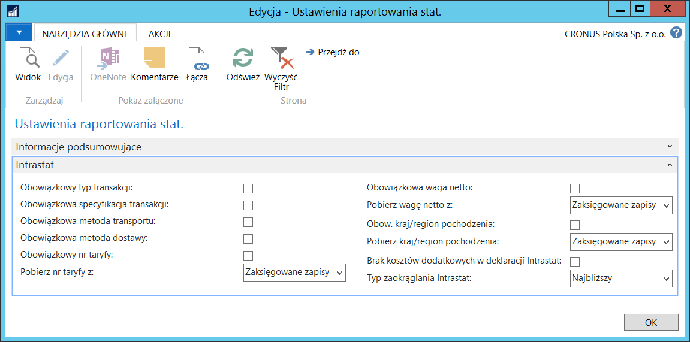{width="6.409090113735783in" height="3.1792104111986004in"}
  -------------------------------------------------------------------------------------
  RYSUNEK 7.18: Ustawienia raportowania statystycznego

W ramach funkcjonalności Intrastat można też zdefiniować punkty
wejścia/wyjścia. Ma to znaczenie dla poprawnego pobierania przez system
zapisów do dziennika Intrastat. Punkty wejścia/wyjścia są przypisane
do konkretnych krajów/regionów. W sytuacji, gdy w dokumencie zakupu,
sprzedaży lub przesunięcia zostanie wybrany punkt wejścia/wyjścia
powiązany z kodem kraju/regionu mającym zaznaczone pole **Intrastat**,
to system pobierze taką transakcje do dziennika Intrastat, nawet, jeśli
kraj dostawcy lub nabywcy jest poza Unią Europejską. W celu
zdefiniowania punktów wejścia/wyjścia, należy postępować
według następujących kroków:

1.  Należy wybrać **Działy \> Zarządzanie Finansami \> Administracja \>
    Punkty wejścia/wyjścia**.

2.  W oknie **Punkty wejścia/wyjścia**, które się otworzy, w kolejnych
    wierszach należy zdefiniować niezbędne punkty wejścia/wyjścia,
    wypełniając pola:

-   **Kod** -- w tym polu należy wprowadzić unikalny kod dla punktu
    > wejścia/wyjścia.

-   **Opis** -- w tym polu należy wprowadzić opis punktu
    > wejścia/wyjścia.

-   **Kod kraju/regionu** -- z listy rozwijanej w tym polu należy wybrać
    > kod kraju/regionu powiązanych z punktem wejścia/wyjścia.

  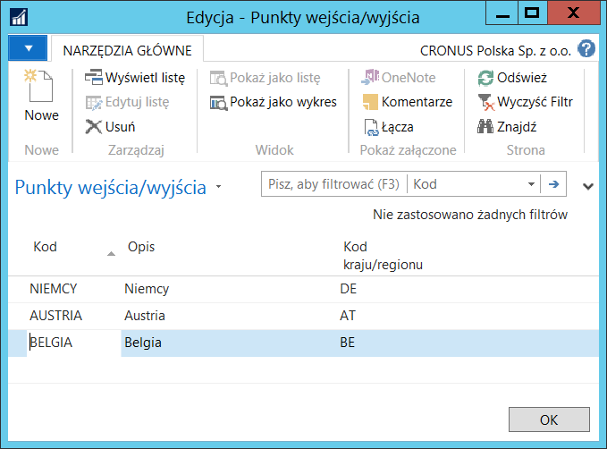{width="4.602362204724409in" height="3.4015748031496065in"}
  -------------------------------------------------------------------------------------
  RYSUNEK 7.19: punkty wejścia/wyjścia

Może zdarzyć się wymaganie, żeby w deklaracji Intrastat niektóre numery
taryf były zgłaszane w dodatkowej jednostce miary. W celu przypisania
dodatkowych jednostek miary do wybranych numerów taryf, należy
postępować według następujących kroków:

1.  Należy wybrać **Działy \> Zarządzanie Finansami \> Administracja \>
    > Numery taryf**.

2.  W oknie **Numery taryf**, które się otworzy, należy w wierszu
    > z wybranym numerem taryfy uzupełnić pole **Kod dodatkowej
    > jednostki miary**, wybierając z listy jeden z wcześniej
    > zdefiniowanych kodów jednostki miary. System automatycznie zmieni
    > opcję na **Tak** w polu **Wymag. Dodatkowe informacje**.

  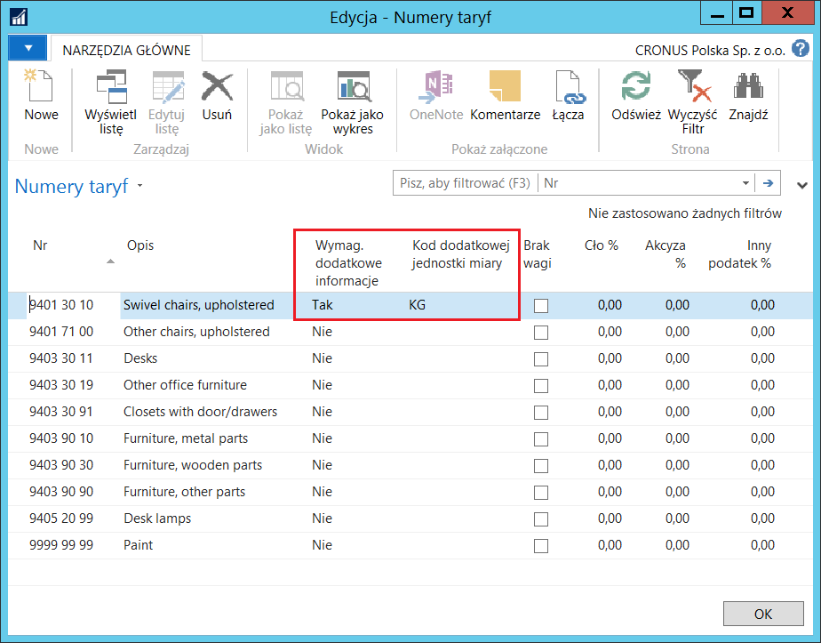{width="6.208661417322834in" height="4.858267716535433in"}
  ------------------------------------------------------------------------------------
  RYSUNEK 7.20: Dodatkowe informacje dla numerów taryf

W sytuacji, gdy wymagane jest uwzględnianie wartości kosztów dodatkowych
powiązanych z transakcjami sprzedaży, zakupu i przesunięć w kalkulacji
kwot Intrastat i/lub wartości statystycznych, konieczne jest specjalne
oznaczenie tych kosztów. W tym celu, należy postępować
według następujących kroków:

1.  Należy wybrać **Działy \> Zarządzanie Finansami \> Administracja \>
    > Koszty dodatkowe**.

2.  W oknie **Koszty dodatkowe**, które się otworzy, należy w wierszu
    > z wybranym kosztem dodatkowym zaznaczyć jedno lub obydwa pola:
    > **Uwzględnij w kwocie Intrastat**, **Uwzględnij w wartości stat.
    > Intrastat**, w zależności, do której kwoty ma zostać dodana kwota
    > wybranych kosztów dodatkowych powiązanych z transakcjami zakupu,
    > sprzedaży i przesunięć wykazywanymi w deklaracji Intrastat.

>  **Uwaga:** Zaznaczenie pól **Uwzględnij
> w kwocie Intrastat i Uwzględnij w wartości stat. Intrastat w **oknie
> **Koszty dodatkowe** jest wymagane wtedy, gdy pole **Brak kosztów
> dodatkowych w deklaracji Intrastat** w oknie **Ustawienia raportowania
> stat.** nie jest zaznaczone. W przeciwnym wypadku, parametry w oknie
> **Koszty dodatkowe** nie mają wpływu na wartości w deklaracji
> Intrastat.

  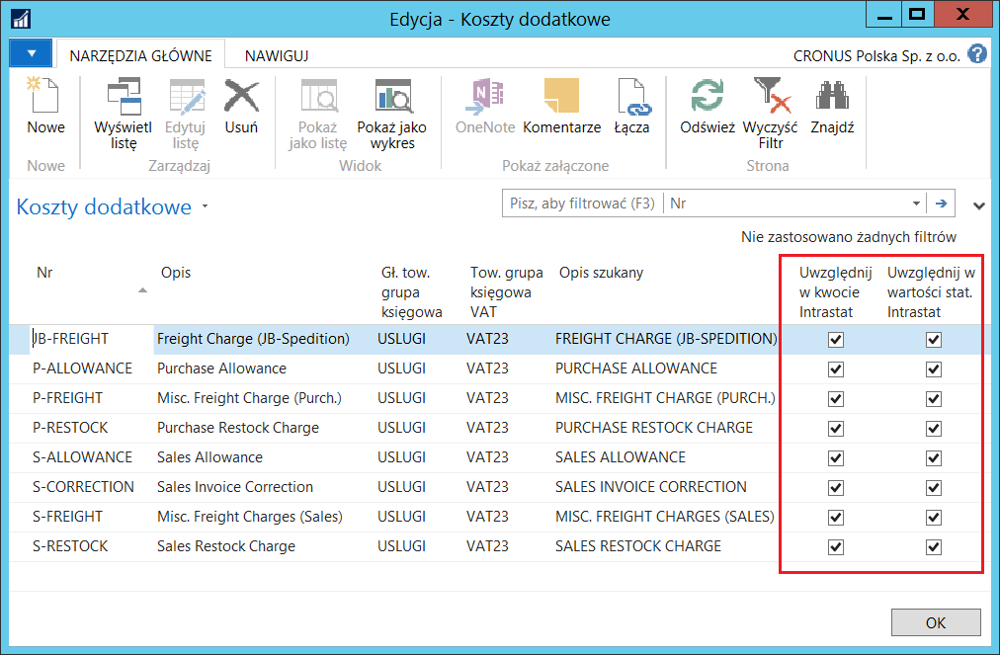{width="6.395833333333333in" height="4.190090769903762in"}
  ------------------------------------------------------------------------------------
  RYSUNEK 7.21: Parametry kosztów dodatkowych

W sytuacji, gdy w kalkulacji kwot Intrastat i/lub wartości
statystycznych wymagane jest uwzględnianie wartości kosztów dodatkowych
powiązanych z transakcjami sprzedaży, zakupu i przesunięć dla wybranych
metod dostaw, należy odpowiednio sparametryzować metody dostaw. W tym
celu, należy postępować według następujących kroków:

1.  Należy wybrać **Działy \> Zakupy \> Administracja \> Metody
    > dostaw**.

2.  W oknie **Metody dostaw**, które się otworzy, należy w wierszu
    > z wybraną metodą zaznaczyć pole **Uwzględnij koszty dodatkowe.**

> {width="0.19in" height="0.19in"}
> **Uwaga:** Zaznaczenie pola **Uwzględnij koszty dodatkowe w **oknie
> **Metody dostaw** jest możliwe wtedy, gdy w polu **Korekta (%)**
> w oknie **Metody dostaw** jest 0, a pole **Brak kosztów dodatkowych
> w deklaracji Intrastat** w oknie **Ustawienia raportowania stat**. nie
> jest zaznaczone.

3.  W tym samym oknie, w polu **Korekta (%)** można wprowadzić wartość
    > procentową, o jaką zostanie zwiększona (dodatnia wartość
    > procentowa) lub zmniejszona (ujemna wartość procentowa) wartość
    > statystyczna zakupów/sprzedaży dla wybranej metody dostaw
    > w dzienniku Intrastat.

  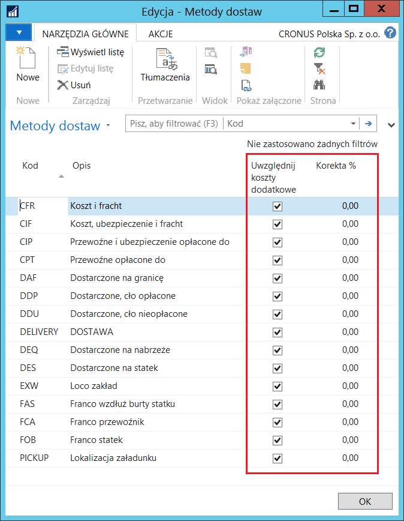{width="4.551181102362205in" height="5.862204724409449in"}
  ------------------------------------------------------------------------------------
  RYSUNEK 7.22: Parametry metod dostaw

Można ustawić domyślny dla danej lokalizacji Obszar, który będzie
automatycznie podpowiadany w transakcjach sprzedaży, zakupu
i przesunięć. W tym celu należy w oknie kartoteki wybranej lokalizacji
uzupełnić pole **Obszar** na karcie skróconej **Ogólne**, wybierając
właściwy, wcześniej zdefiniowany kod z listy rozwijanej w tym polu:

  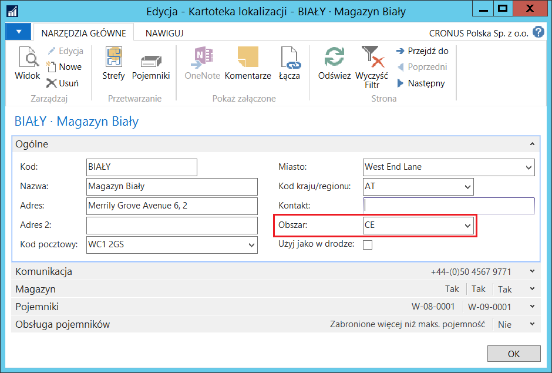{width="6.378787182852143in" height="4.309087926509187in"}
  ------------------------------------------------------------------------------------
  RYSUNEK 7.23: Obszar w kartotece lokalizacji

Domyślne dane niezbędne w przygotowaniu deklaracji Intrastat mogą być
przypisane do kartotek nabywców i dostawców, w tym celu należy uzupełnić
pola: **Typ transakcji**, **Specyfikacja transakcji**, **Metoda
transportu** i **Kod metody dostawy**:

  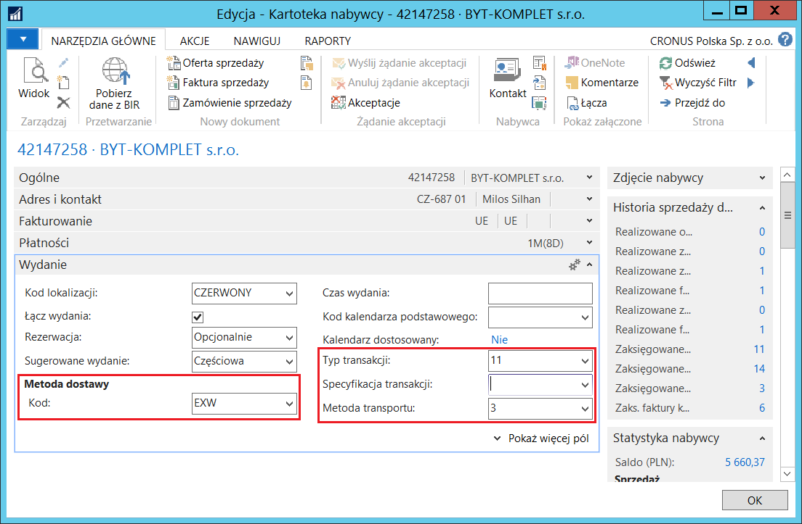{width="6.402777777777778in" height="4.192588582677165in"}
  ------------------------------------------------------------------------------------
  RYSUNEK 7.24: Domyślne dane w kartotece nabywcy

  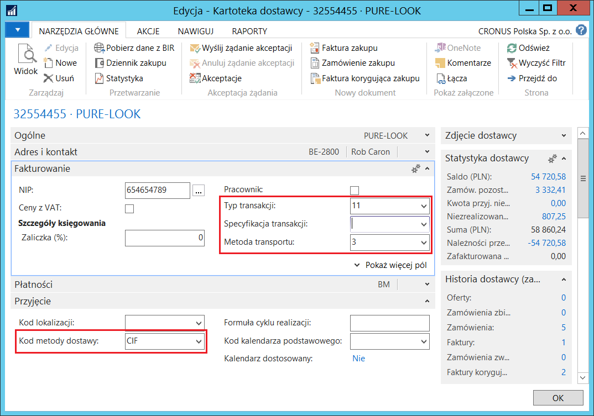{width="6.408869203849519in" height="4.493055555555555in"}
  ------------------------------------------------------------------------------------
  RYSUNEK 7.25: Domyślne dane w kartotece dostawcy

Domyślne dane niezbędne w przygotowaniu deklaracji Intrastat mogą (lub
muszą -- gdy w **Ustawieniach raportowania stat.** kartoteka zapasu jest
wybrana jako źródło danych) być też przypisane do kartotek zapasów,
w tym celu należy uzupełnić pola: **Nr taryfy**, **Kod kraju/regionu
pochodzenia**, **Waga netto** i **Waga brutto**:

  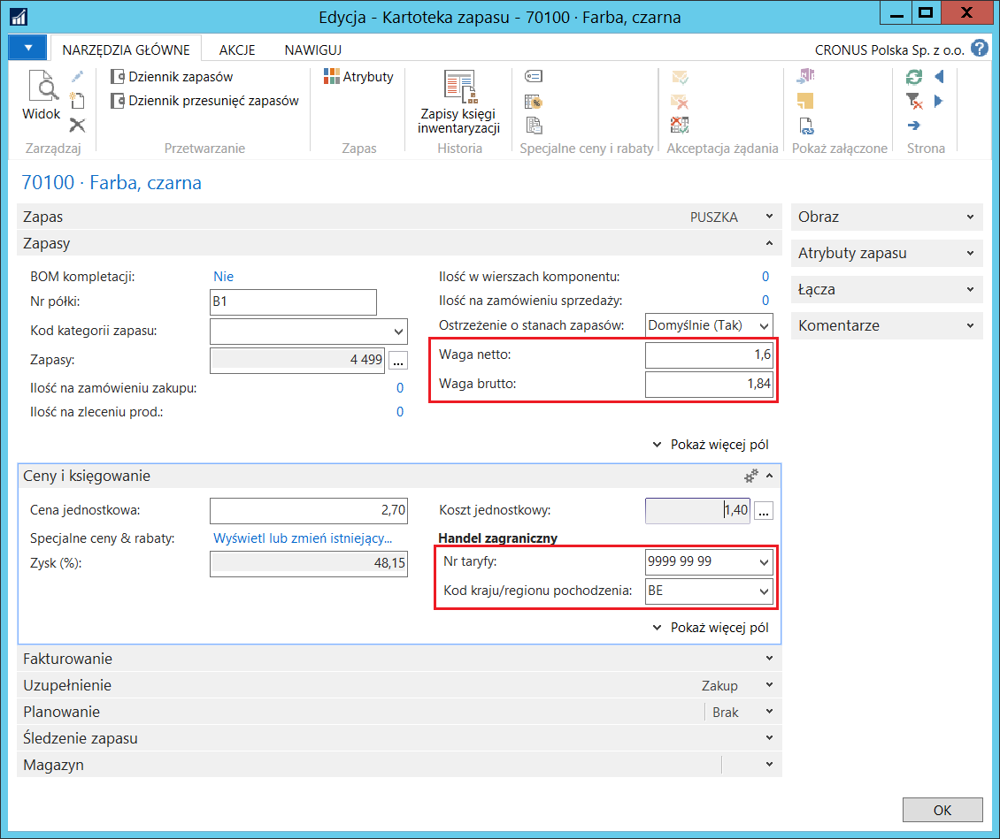{width="6.388888888888889in" height="5.365028433945756in"}
  ------------------------------------------------------------------------------------
  RYSUNEK 7.26: Domyślne dane w kartotece zapasu

### Obsługa

W celu zaksięgowania transakcji zakupu, sprzedaży i przesunięcia,
które mają być wykazane w deklaracji Intrastat, należy postępować
według następujących kroków:

1.  Należy w sposób standardowy wprowadzić fakturę zakupu towaru
    > od dostawcy z kraju przynależącego do Unii Europejskiej.

2.  W wierszach oraz w nagłówku faktury zakupu niektóre z pól ważnych
    > dla deklaracji Intrastat zostały uzupełnione automatycznie
    > domyślnymi danymi, w razie potrzeby można je ręcznie zmienić.
    > Należy też zwrócić uwagę, że system identyfikuje transakcje
    > Intrastat (sprawdza, czy **Kod kraju/regionu** przypisany
    > do kartoteki dostawcy ma wypełnione pole **Kod Intrastat**)
    > i wstawia znacznik w polu **Transakcja Intrastat**.

  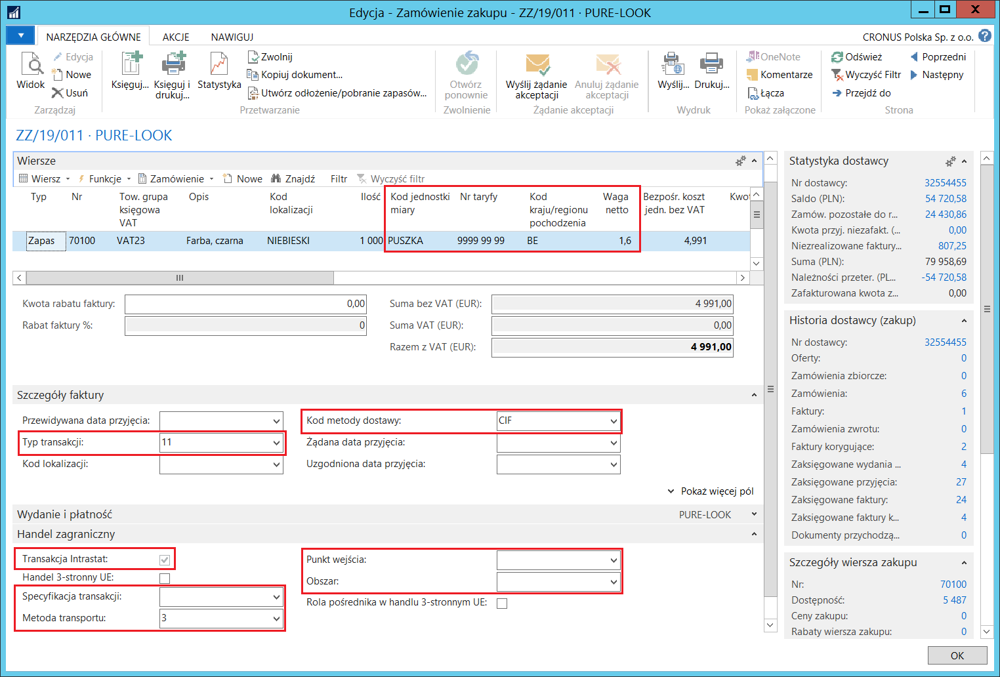{width="6.395833333333333in" height="4.330854111986001in"}
  ------------------------------------------------------------------------------------
  RYSUNEK 7.27: Zamówienie zakupu -- transakcja Intrastat

3.  Przyjęcie i fakturę zakupu należy zaksięgować w standardowy sposób.

> {width="0.1875in" height="0.1875in"}
> **Uwaga:** Podczas księgowania system sprawdza, czy zostały wypełnione
> wszystkie pola oznaczone jako obowiązkowe w **Ustawieniach
> raportowania statystycznego**.
>
> W oknie **Przypisanie kosztu dodatkowego** dla wiersza zakupu typu
> **koszt dodatkowy** system, na podstawie domyślnych ustawień, zaznacza
> (lub nie) pola **Uwzględnij w kwocie Intrastat** i **Uwzględnij
> w wartości stat. Intrastat**. W razie potrzeby, zaznaczenie może być
> zmienione ręcznie, przy zachowaniu reguł ujmowania kosztów dodatkowych
> w transakcjach Intrastat.
>
> Pola związane z Intrastatem są dostępne w dokumentach zakupu:
> **Zamówienie**, **Faktura**, **Zamówienie zwrotu i Faktura
> korygująca**.

4.  Należy w sposób standardowy wprowadzić zamówienie sprzedaży towaru
    > nabywcy z kraju przynależącego do Unii Europejskiej.

5.  W wierszach oraz w nagłówku faktury sprzedaży niektóre z pól ważnych
    > dla deklaracji Intrastat zostały uzupełnione automatycznie
    > domyślnymi danymi, w razie potrzeby można je ręcznie zmienić.
    > Należy też zwrócić uwagę, że system identyfikuje transakcje
    > Intrastat (sprawdza, czy **Kod kraju/regionu** przypisany
    > do kartoteki nabywcy ma wypełnione pole **Kod Intrastat**)
    > i wstawia znacznik w polu **Transakcja Intrastat**.

  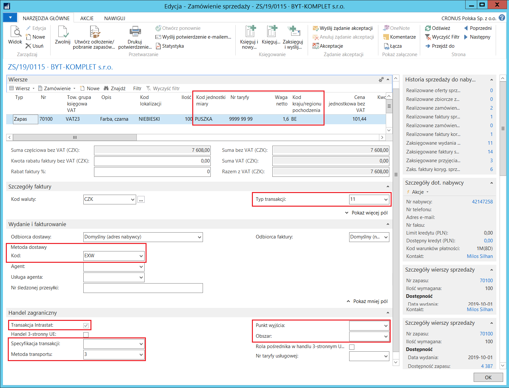{width="6.402777777777778in" height="4.877329396325459in"}
  ------------------------------------------------------------------------------------
  RYSUNEK 7.28: Zamówienie Sprzedaży -- transakcja Intrastat

6.  Wydanie i fakturę sprzedaży należy zaksięgować w standardowy sposób.

> {width="0.1875in" height="0.1875in"}
> **Uwaga:** Podczas księgowania system sprawdza, czy zostały wypełnione
> wszystkie pola oznaczone jako obowiązkowe w **Ustawieniach
> raportowania statystycznego**.
>
> W oknie **Przypisanie kosztu dodatkowego** dla wiersza sprzedaży typu
> **koszt dodatkowy** system, na podstawie domyślnych ustawień, zaznacza
> (lub nie) pola **Uwzględnij w kwocie Intrastat** i **Uwzględnij
> w wartości stat. Intrastat**. W razie potrzeby, zaznaczenie może być
> zmienione ręcznie, przy zachowaniu reguł ujmowania kosztów dodatkowych
> w transakcjach Intrastat.
>
> Pola związane z Intrastatem są dostępne w dokumentach sprzedaży:
> **Zamówienie**, **Faktura**, **Zamówienie zwrotu i Faktura
> korygująca**.

7.  Należy w sposób standardowy wprowadzić zlecenie przesunięcia.

8.  W wierszach oraz w nagłówku zlecenia przesunięcia, w kartach
    > skróconych: **Lokalizacja pierwotna i Handel zagraniczny**
    > niektóre z pól ważnych dla deklaracji Intrastat zostały
    > uzupełnione automatycznie domyślnymi danymi, w razie potrzeby
    > można je ręcznie zmienić. Należy też zwrócić uwagę, że system
    > identyfikuje transakcje Intrastat (sprawdza, czy **Kod
    > kraju/regionu** przypisany do kartoteki lokalizacji pierwotnej
    > lub docelowej ma wypełnione pole **Kod Intrastat**) i wstawia
    > znacznik w polu **Transakcja Intrastat**.

  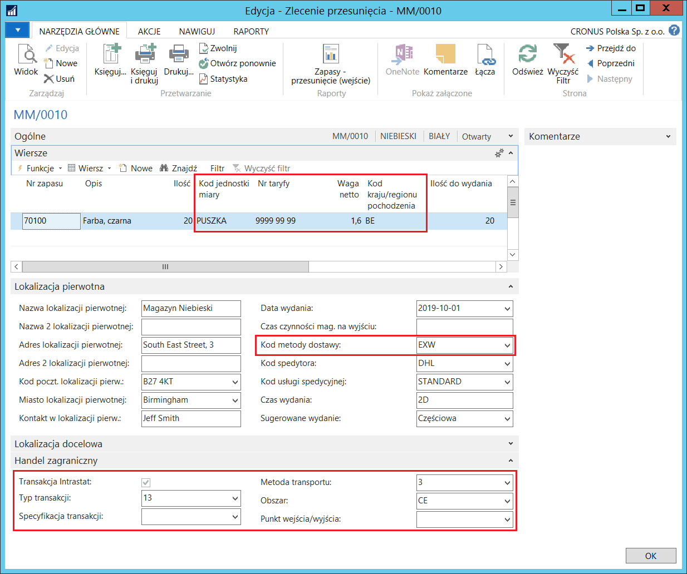{width="6.410321522309712in" height="5.361111111111111in"}
  ------------------------------------------------------------------------------------
  RYSUNEK 7.29: Zlecenie przesunięcia -- transakcja Intrastat

9.  Wydanie przesunięcia i przyjęcie przesunięcia należy zaksięgować
    > w standardowy sposób.

W celu przygotowania deklaracji Intrastat, należy postępować
według następujących kroków:

1.  Należy wybrać **Działy \> Zarządzanie Finansami \> Działania
    okresowe \> Księga główna \> Dzienniki Intrastat**.

2.  W oknie **Dziennik Intrastat**, które się otworzy, należy kliknąć
    przycisk asysty w polu **Nazwa instancji**.

3.  W oknie **Instancje dziennika Intrastat**, które się otworzy, należy
    wybrać **Nowe**, aby zdefiniować nową instancję dziennika. W nowym
    wierszu należy uzupełnić pola:

-   **Kod** -- w tym polu należy wpisać dowolny kod identyfikujący
    > instancję dziennika

-   **Opis** -- w tym polu należy wpisać dowolny opis instancji
    > dziennika

-   **Okres statystyk** -- w tym polu należy wpisać cztery cyfry
    > identyfikujące okres deklaracji Intrastat, np. 1708 to sierpień
    > 2017 roku.

4.  Należy wybrać **OK**, aby otworzyć wiersze dziennika w nowej
    instancji.

5.  W oknie **Dziennik Intrastat** należy wybrać **Pobierz zapisy**
    w celu automatycznego wstawienia transakcji Intrastat do wierszy
    dziennika.

6.  W oknie wstępnym skryptu **Pobierz zap. księgi zapasów**, które się
    otworzy należy uzupełnić pola:

-   **Data początkowa** -- w tym polu należy wprowadzić datę początkową
    > okresu, w jakim zostały zaksięgowane transakcje Intrastat,
    > na podstawie których ma zostać przygotowana deklaracja Intrastat.

-   **Data końcowa** -- w tym polu należy wprowadzić datę końcową
    > okresu, w jakim zostały zaksięgowane transakcje Intrastat,
    > na podstawie których ma zostać przygotowana deklaracja Intrastat.

-   **Korekta kosztu (%)** -- w tym polu należy wprowadzić wartość
    > procentową na pokrycie kosztów frachtu i ubezpieczenia, o jaką
    > zostanie zwiększona wartość statystyczna we wszystkich wierszach
    > dziennika Intrastat.

7.  W celu wykonania skryptu, należy wybrać **OK**.

  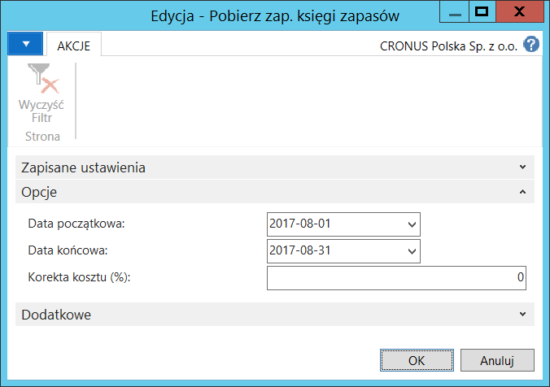{width="4.55511811023622in" height="3.204724409448819in"}
  -----------------------------------------------------------------------------------
  RYSUNEK 7.30: Pobierz zapisy księgi zapasów

8.  W czasie wykonywania skryptu system wykonuje czynności wymienione
    > poniżej:

-   System pobiera **Zapisy księgi zapasów** i **Zapisy księgi zleceń**
    > pochodzące z transakcji zidentyfikowanych jako **Transakcje
    > Intrastat**.

-   System ignoruje **Transakcje Intrastat** zakupu i sprzedaży,
    > które zostały jednocześnie oznaczone jako **Handel 3-stronny UE**.

-   System pilnuje, aby zostały uwzględnione **Transakcje Intrastat**
    > mające punkty wejścia/wyjścia w krajach Unii Europejskiej.

-   System pilnuje, aby korygujące dokumenty sprzedaży i zakupu
    > oznaczone jako **Korekta** zostały wstawione w dzienniku Intrastat
    > jako ten sam typ dokumentu, co korygowany, ale z przeciwnym
    > znakiem.

-   System pilnuje, aby wycofane **Transakcje Intrastat** (np. powstałe
    > w wyniku użycia funkcji **Cofnij przyjęcie** lub **Cofnij
    > wydanie**) zostały wykluczone: zarówno transakcja wycofana,
    > jak i wycofująca.

-   System pilnuje, żeby **Koszty dodatkowe** zostały uwzględnione (lub
    > nie) w skorygowaniu i kalkulacji **Kwoty Intrastat oraz Wartości
    > statystycznej**, zgodnie z ustawieniami w **Ustawieniach
    > raportowania stat.**, **Kosztach dodatkowych**, **Metodach
    > dostawy** i **Przypisaniu kosztu dodatkowego**.

-   System pilnuje, aby były użyte **Dodatkowe jednostki miary** podczas
    > tworzenia wierszy dziennika Intrastat.

-   System pilnuje, aby użyte dane źródłowe dla **Numeru taryfy**,
    > **Wagi netto** i **Kraju/regionu pochodzenia** były poprawne
    > i zgodne z **Ustawieniami raportowania statystycznego**.

-   Na podstawie informacji o nabywcy przypisanym do zaksięgowanego
    > wydania lub zlecenia, pobierany jest z kartoteki nabywcy NIP.
    > W **Dzienniku Intrastat** tylko dla wierszy z **Typem** =
    > **Wydanie**, pole **NIP kontrahenta** musi być wypełnione,
    > dla wierszy z **Typem** = **Przyjęcie** pole to musi pozostać
    > puste.

> Zwrot zakupionych zapasów do dostawcy, jeśli dokument zwrotu nie jest
> oznaczony jako **Korekta**, ujmowany jest w deklaracji Intrastat
> z **Typem** = **Wydanie**, dlatego w wierszach dziennika Intrastat
> z takimi zapisami system uzupełnia pole **NIP kontrahenta**
> na podstawie NIP-u pobranego z kartoteki właściwego dostawcy.

9.  Efektem poprawnego wykonania skryptu są wiersze w oknie **Dziennika
    > Intrastat**:

  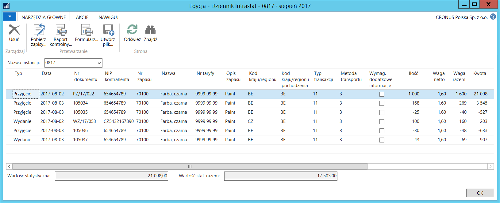{width="6.409722222222222in" height="2.6111395450568677in"}
  -------------------------------------------------------------------------------------
  RYSUNEK 7.31: Dziennik Intrastat

10. W razie potrzeby, należy ręcznie zmienić lub uzupełnić dane
    > wstawione automatycznie do wierszy **Dziennika Intrastat**.
    > Możliwe też jest ręczne dodawanie i usuwanie wierszy.

11. Wiersze **Dziennika Intrastat** mogą być wydrukowane. W tym celu
    > należy wydrukować **Formularz** lub **Raport kontrolny**,
    > wybierając odpowiednią opcję w oknie **Dziennik Intrastat**.
    > Obydwa raporty pokazują te same dane, ale w innym układzie.

  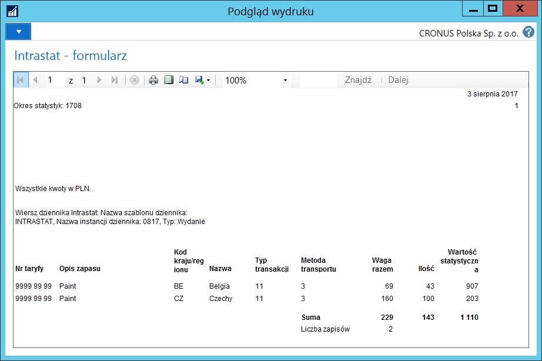{width="6.402777777777778in" height="4.26373031496063in"}
  -----------------------------------------------------------------------------------
  RYSUNEK 7.32: Wydruk formularza

  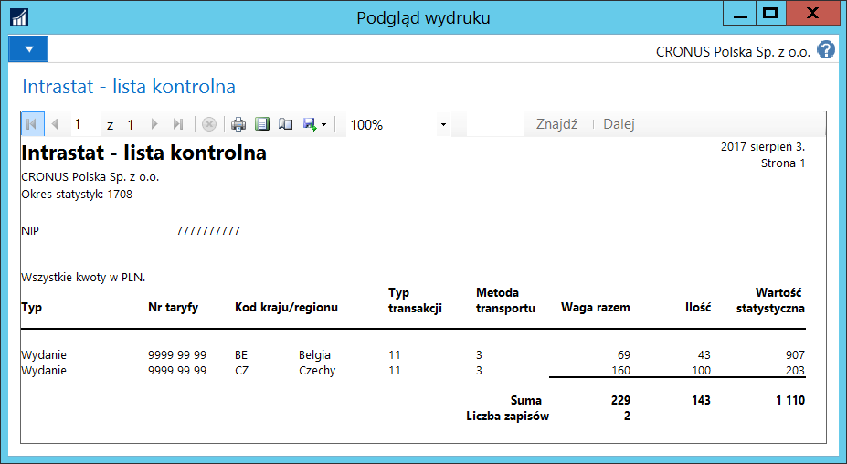{width="6.388888888888889in" height="3.5009197287839022in"}
  -------------------------------------------------------------------------------------
  RYSUNEK 7.33: Wydruk raportu kontrolnego

12. Eksport danych do deklaracji w formacie xml należy uruchomić
    > wybierając **Eksportuj deklarację Intrastat do pliku XML -- AIS
    > (PUESC)** w oknie **Dziennik Intrastat**. Format ten obowiązuje
    > od 01.06.2017.

13. W oknie z opcjami wstępnymi eksportu znajdują się m.in. pola:

-   **Pokaż ID Kontrahenta** -- pole domyślnie zaznaczone przy
    > uruchamianiu eksportu. Jeżeli wiersz dziennika dotyczy wywozu
    > towarów do różnych kontrahentów w tym samym kraju, należy wykazać
    > to w różnych pozycjach zgłoszenia. Tym samym, w przypadku,
    > gdy taki sam towar dostarczany do tego samego kraju UE, odbierany
    > jest przez kilku kontrahentów w tym kraju, konieczne jest
    > zadeklarowanie dostawy (wykazywanej w jednej pozycji przed
    > wejściem w życie obowiązku podawania ID kontrahenta) w rozbiciu
    > na kilka pozycji zgłoszenia.

-   **Nazwa pliku** -- w tym polu należy podać ścieżkę i nazwę pliku
    > zgłoszenia (z rozszerzeniem .xml)

-   **Próg szczegółowy** -- to pole należy zaznaczyć w przypadku,
    > gdy podmiot zobowiązany przekroczy próg szczegółowy.

-   Na 2017 r. ustalono następujące wartości progów statystycznych
    > dla podmiotów realizujących obroty z krajami Unii Europejskiej:

```{=html}
<!-- -->
```
-   dla przywozu 50.000.000 zł

-   dla wywozu 93.000.000 zł

> W takim przypadku w pliku wypełniane są dodatkowe pola:
>
> 7 -- Łączna wartość statystyczna w PLN
>
> 12 -- Kod warunków dostawy
>
> 15 -- Kod rodzaju transportu
>
> 20 -- Wartość statystyczna w PLN
>
> Wartość statystyczna uwzględnia dodatkowe koszty dotyczące tej części
> przewozu, która odbywa się na polskim obszarze statystycznym (koszty
> opakowania, opłaty transportowe, opłaty za załadunek i magazynowanie).

-   Ponadto należy uzupełnić pole **E-mail dla przesyłania informacji
    > zwrotnych**, a także pola, które dotyczą osoby składającej
    > deklarację: **Nazwisko** i **imię oraz E‑mail**.

  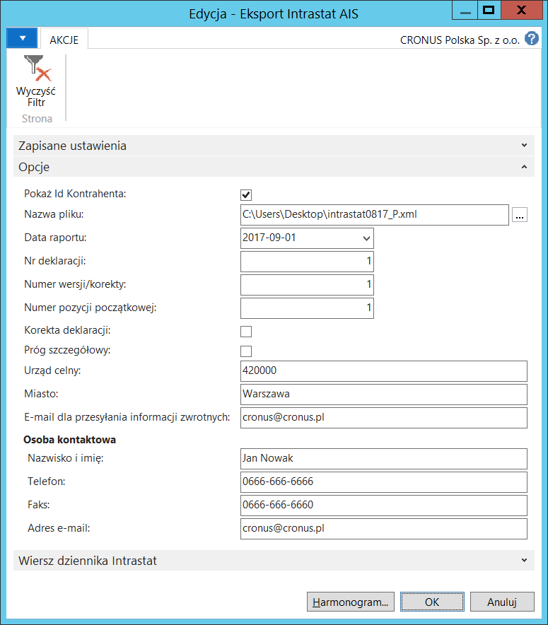{width="5.228346456692913in" height="5.964566929133858in"}
  ------------------------------------------------------------------------------------
  RYSUNEK 7.34: Opcje wstępne eksportu Intrastat AIS - ogólne

14. Należy również wybrać opcję w filtrze dla pola **Typ**.

  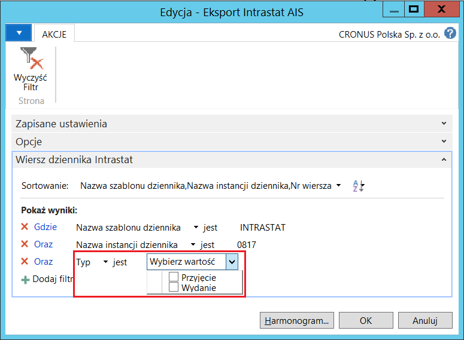{width="5.232283464566929in" height="3.838582677165354in"}
  ------------------------------------------------------------------------------------
  RYSUNEK 7.35: Opcje wstępne eksportu Intrastat AIS -- wiersze dziennika Intrastat

15. Eksport należy uruchomić wybierając **OK**.

16. Wygenerowany plik zgłoszenia w formacie xml należy przesłać
    przez platformę (**PUESC**)

**Generowanie zgłoszenia zerowego**

Jeżeli w miesiącu sprawozdawczym przedsiębiorstwo zobowiązane
do złożenia zgłoszenia nie zrealizowało żadnych przywozów lub wywozów
towarów, należy za ten miesiąc dokonać zgłoszenia zerowego

W celu przygotowania zerowego zgłoszenia Intrastat, należy postępować
według następujących kroków:

1.  Należy wybrać **Działy \> Zarządzanie Finansami \> Działania
    okresowe \> Księga główna \> Dzienniki Intrastat**.

2.  W otwartym oknie dziennika, w którym nie ma wierszy typu **Wydanie
    lub Przyjęcie**, lub w ogóle nie ma żadnych wierszy, należy wybrać
    **Eksportuj deklarację Intrastat do pliku XML -- AIS (PUESC)**
    i wypełnić opcje wstępne eksportu odpowiednio dla wywozu
    lub przywozu.

> Wygenerowany zostanie plik spełniający wymagania zgłoszenia zerowego,
> który należy przesłać przez platformę (**PUESC**).

Dokument inwentaryzacji {#dokument-inwentaryzacji .Poziom-1}
-----------------------

### Informacje ogólne

### Na koniec roku obrachunkowego użytkownicy dokonują fizycznego zliczenia zapasów w celu ich uzgodnienia ze stanem ilościowym i wartościowym zarejestrowanym w systemie. W ramach Polskiej Lokalizacji systemu Microsoft Dynamics 365 Business Central on‑premises został dodany raport Dokumentu inwentaryzacji, który może zostać zarchiwizowany przez dział księgowości jako potwierdzenie zakończenia procesu inwentaryzacji. Dokument inwentaryzacji zawiera zaksięgowane wartości i ilości zapasów magazynowych oraz nazwiska przedstawicieli firmy, którzy własnoręcznym podpisem potwierdzają, że ilości i kwoty wykazane w dokumencie są zgodne z rzeczywistym stanem magazynowym.

### Obsługa

W celu przygotowania i wydrukowania raportu **Dokument inwentaryzacji**,
należy postępować według następujących kroków:

1.  Należy wybrać **Działy \> Zarządzanie Finansami \> Zapasy \> Dok.
    zaks. inwentaryzacji**.

2.  W oknie wstępnym raportu, które się otworzy, należy na karcie
    skróconej **Zapis księgi inwentaryzacji** wypełnić pola filtrów:
    **Nr dokumentu** i **Data księgowania** w celu wskazania konkretnego
    dokumentu księgowania inwentaryzacji. W razie potrzeby można
    wypełnić inne pola w celu ograniczenia danych ujętych w raporcie.

> Na karcie skróconej **Opcje** należy uzupełnić pola:

-   **Opis przyczyny** -- w tym polu należy opisać powód przeprowadzenia
    > inwentaryzacji

-   **Członek komisji 1** -- w tym polu należy wprowadzić imię
    > i nazwisko pierwszego przedstawiciela firmy będącego członkiem
    > komisji odpowiedzialnej za poprawne przeprowadzenie inwentaryzacji

-   **Członek komisji 2** -- w tym polu należy wprowadzić imię
    > i nazwisko drugiego przedstawiciela firmy będącego członkiem
    > komisji odpowiedzialnej za poprawne przeprowadzenie inwentaryzacji

-   **Członek komisji 3** -- w tym polu należy wprowadzić imię
    > i nazwisko trzeciego przedstawiciela firmy będącego członkiem
    > komisji odpowiedzialnej za poprawne przeprowadzenie inwentaryzacji

-   **Członek komisji 4** -- w tym polu należy wprowadzić imię
    > i nazwisko czwartego przedstawiciela firmy będącego członkiem
    > komisji odpowiedzialnej za poprawne przeprowadzenie
    > inwentaryzacji.

  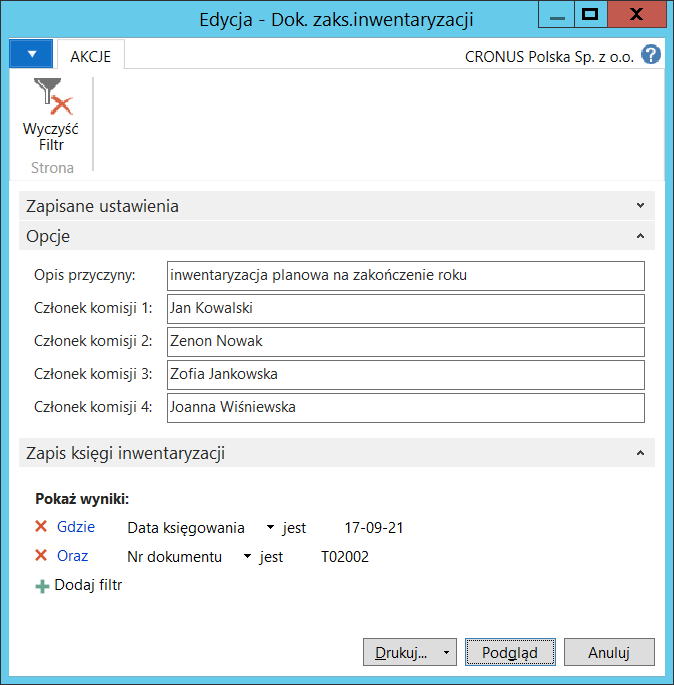{width="4.55511811023622in" height="4.625984251968504in"}
  -----------------------------------------------------------------------------------
  RYSUNEK 7.36: Opcje raportu Dokument inwentaryzacji

3.  Po wprowadzeniu właściwych opcji i filtrów, należy wybrać **Drukuj**
    w celu wydrukowania raportu lub **Podgląd** w celu wyświetlenia
    raportu na ekranie:

  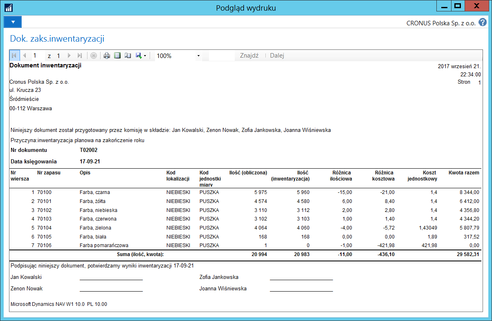{width="6.393939195100613in" height="4.1772364391951005in"}
  -------------------------------------------------------------------------------------
  RYSUNEK 7.37: Podgląd raportu Dokument inwentaryzacji

 {#section-15 .list-paragraph .Poziom-1}

Dokumenty operacji magazynowych {#dokumenty-operacji-magazynowych .Poziom-1}
-------------------------------

### Informacje ogólne

**Do typowych operacji magazynowych realizowanych w systemie Microsoft
Dynamics 365 Business Central on‑premises należą: spisanie ze stanu
magazynu, przeszacowanie wartości i przesunięcie międzymagazynowe.
W standardowej wersji systemu Microsoft Dynamics 365 Business Central
on‑premises możliwe jest wydrukowanie dokumentu Przesunięcie zapasu
dostępnego w oknie Dzienniki przesunięć zapasów. W ramach Polskiej
Lokalizacji dodane zostały raporty dokumentujące operacje magazynowe:**

-   **Dokument spisania ze stanu magazynu** -- dostępny w oknie
    > **Dzienniki zapasów** przed zaksięgowaniem operacji

-   **Zaksięgowany dokument spisania ze stanu magazynu** -- dostępny
    > w raportach modułu **Zarządzanie Finansami** po zaksięgowaniu
    > operacji

-   **Dokument przeszacowania zapasów** -- dostępny w oknie **Dzienniki
    > przeszacowań** przed zaksięgowaniem operacji.

### Obsługa

W celu przygotowania i wydrukowania raportu **Dokument spisania ze stanu
magazynu**, należy postępować według następujących kroków:

1.  Należy wybrać **Działy \> Magazyn \> Zapasy \> Dzienniki zapasów**.

2.  W sposób standardowy należy wprowadzić wiersze wybranego dziennika
    przeznaczone do zaksięgowania operacji spisania zapasu ze stanu
    magazynowego.

3.  Należy wybrać **Dokument spisania ze stanu**.

4.  W oknie wstępnym raportu, które się otworzy, na kartach skróconych
    **Instancja dziennika zapasów i Wiersz dziennika zapasów** system
    automatycznie uzupełnia niektóre pola filtrów. W razie potrzeby
    można wypełnić inne pola w celu ograniczenia danych ujętych
    w raporcie.

> Na karcie skróconej **Opcje** należy uzupełnić pola:

-   **Opis przyczyny** -- w tym polu należy opisać powód spisania zapasu
    > ze stanu magazynowego

-   **Członek komisji 1** -- w tym polu należy wprowadzić imię
    > i nazwisko pierwszego przedstawiciela firmy będącego członkiem
    > komisji odpowiedzialnej za spisanie zapasu ze stanu magazynowego

-   **Członek komisji 2** -- w tym polu należy wprowadzić imię
    > i nazwisko drugiego przedstawiciela firmy będącego członkiem
    > komisji odpowiedzialnej za spisanie zapasu ze stanu magazynowego

-   **Członek komisji 3** -- w tym polu należy wprowadzić imię
    > i nazwisko trzeciego przedstawiciela firmy będącego członkiem
    > komisji odpowiedzialnej za spisanie zapasu ze stanu magazynowego

-   **Członek komisji 4** -- w tym polu należy wprowadzić imię
    > i nazwisko czwartego przedstawiciela firmy będącego członkiem
    > komisji odpowiedzialnej za spisanie zapasu ze stanu magazynowego.

  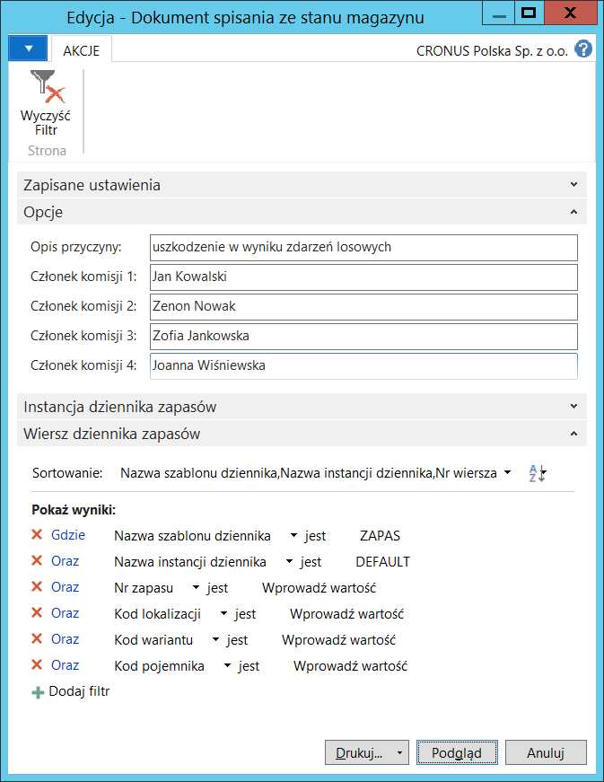{width="4.55511811023622in" height="5.893700787401575in"}
  -----------------------------------------------------------------------------------
  RYSUNEK 7.38: Opcje raportu Dokument spisania ze stanu magazynu

5.  Po wprowadzeniu właściwych opcji i filtrów, należy wybrać **Drukuj**
    w celu wydrukowania raportu lub **Podgląd** w celu wyświetlenia
    raportu na ekranie:

  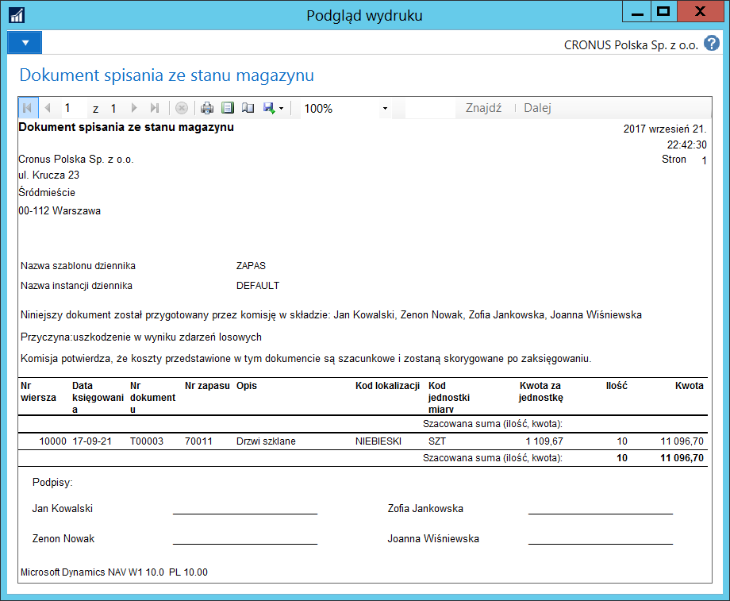{width="6.386363735783027in" height="5.2551038932633425in"}
  -------------------------------------------------------------------------------------
  RYSUNEK 7.39: Podgląd raportu Dokument spisania ze stanu magazynu

W celu przygotowania i wydrukowania raportu **Zaksięgowany dokument
spisania ze stanu magazynu**, należy postępować według następujących
kroków:

1.  Należy wybrać **Działy \> Zarządzanie Finansami \> Zapasy \>
    Zaksięg. dokument spisania ze stanu magazynu**.

2.  W oknie wstępnym raportu, które się otworzy, na karcie skróconej
    **Zapis księgi zapasów** należy wypełnić pola filtrów: **Nr
    dokumentu** i (ewentualnie) **Data księgowania** w celu wskazania
    konkretnego dokumentu księgowania spisania zapasu ze stanu magazynu.
    W razie potrzeby można wypełnić inne pola w celu ograniczenia danych
    ujętych w raporcie.

> Na karcie skróconej **Opcje** należy uzupełnić pola:

-   **Opis przyczyny** -- w tym polu należy opisać powód spisania zapasu
    > ze stanu magazynowego

-   **Członek komisji 1** -- w tym polu należy wprowadzić imię
    > i nazwisko pierwszego przedstawiciela firmy będącego członkiem
    > komisji odpowiedzialnej za spisanie zapasu ze stanu magazynowego

-   **Członek komisji 2** -- w tym polu należy wprowadzić imię
    > i nazwisko drugiego przedstawiciela firmy będącego członkiem
    > komisji odpowiedzialnej za spisanie zapasu ze stanu magazynowego

-   **Członek komisji 3** -- w tym polu należy wprowadzić imię
    > i nazwisko trzeciego przedstawiciela firmy będącego członkiem
    > komisji odpowiedzialnej za spisanie zapasu ze stanu magazynowego

-   **Członek komisji 4** -- w tym polu należy wprowadzić imię
    > i nazwisko czwartego przedstawiciela firmy będącego członkiem
    > komisji odpowiedzialnej za spisanie zapasu ze stanu magazynowego.

  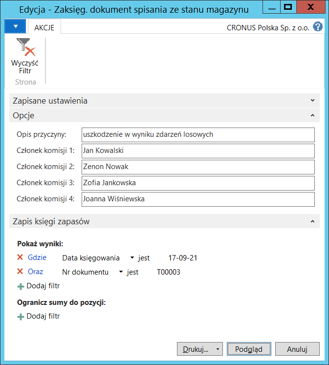{width="4.562992125984252in" height="5.062992125984252in"}
  ------------------------------------------------------------------------------------
  RYSUNEK 7.40: Opcje raportu Zaksięgowany dokument spisania ze stanu magazynu

3.  Po wprowadzeniu właściwych opcji i filtrów, należy wybrać **Drukuj**
    w celu wydrukowania raportu lub **Podgląd** w celu wyświetlenia
    raportu na ekranie:

  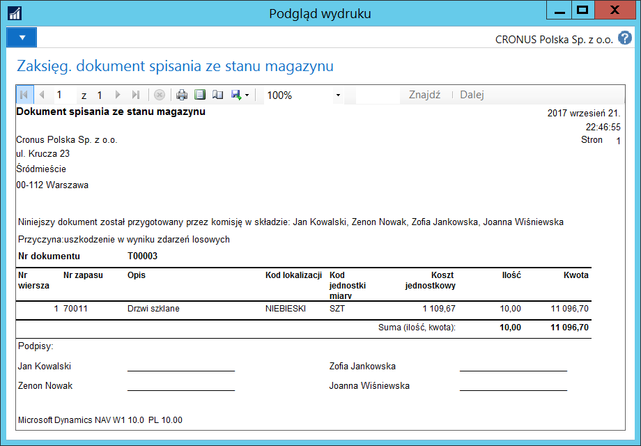{width="6.378787182852143in" height="4.43721019247594in"}
  -----------------------------------------------------------------------------------
  RYSUNEK 7.41: Podgląd raportu Zaksięgowany dokument spisania ze stanu Magazynu

> {width="0.19in" height="0.19in"}
> **Uwaga:** Wartości zapasów spisanych ze stanu magazynu mogą się
> różnić na raportach: **Dokument spisania ze stanu magazynu**
> i **Zaksięgowany dokument spisania ze stanu magazynu,** jeżeli
> w czasie pomiędzy drukowaniem raportów został uruchomiony skrypt:
> **Koryguj koszt -- zapisy zapasów**.

W celu przygotowania i wydrukowania raportu **Dokument przeszacowania
zapasów**, należy postępować według następujących kroków:

1.  Należy wybrać **Działy \> Magazyn \> Zapasy \> Dzienniki
    przeszacowań**.

2.  W sposób standardowy należy wprowadzić wiersze wybranego dziennika
    przeznaczone do zaksięgowania operacji przeszacowania wartości
    wybranego zapasu.

3.  Należy wybrać **Dokument przeszacowania**.

4.  W oknie wstępnym raportu, które się otworzy, na kartach skróconych
    **Instancja dziennika zapasów i Wiersz dziennika zapasów** system
    automatycznie uzupełnia niektóre pola filtrów. W razie potrzeby
    można wypełnić inne pola w celu ograniczenia danych ujętych
    w raporcie.

> Na karcie skróconej **Opcje** należy uzupełnić pola:

-   **Opis przyczyny** -- w tym polu należy opisać powód przeszacowania
    > wartości zapasów

-   **Członek komisji 1** -- w tym polu należy wprowadzić imię
    > i nazwisko pierwszego przedstawiciela firmy będącego członkiem
    > komisji odpowiedzialnej za przeszacowanie wartości zapasów

-   **Członek komisji 2** -- w tym polu należy wprowadzić imię
    > i nazwisko drugiego przedstawiciela firmy będącego członkiem
    > komisji odpowiedzialnej za przeszacowanie wartości zapasów

-   **Członek komisji 3** -- w tym polu należy wprowadzić imię
    > i nazwisko trzeciego przedstawiciela firmy będącego członkiem
    > komisji odpowiedzialnej za przeszacowanie wartości zapasów

-   **Członek komisji 4** -- w tym polu należy wprowadzić imię
    > i nazwisko czwartego przedstawiciela firmy będącego członkiem
    > komisji odpowiedzialnej za przeszacowanie wartości zapasów.

  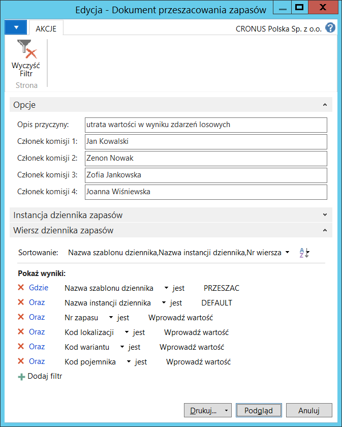{width="4.519685039370079in" height="5.637795275590551in"}
  ------------------------------------------------------------------------------------
  RYSUNEK 7.42: Opcje raportu Dokument przeszacowania zapasów

5.  Po wprowadzeniu właściwych opcji i filtrów, należy wybrać **Drukuj**
    w celu wydrukowania raportu lub **Podgląd** w celu wyświetlenia
    raportu na ekranie:

  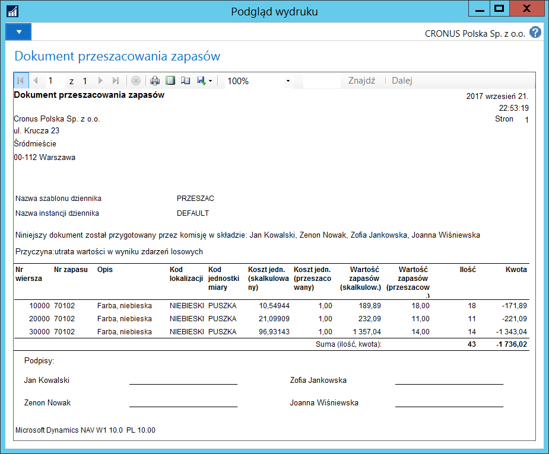{width="6.371211723534558in" height="5.275989720034995in"}
  ------------------------------------------------------------------------------------
  RYSUNEK 7.43: Podgląd raportu Dokument przeszacowania zapasów

Analizy i raporty {#analizy-i-raporty .Rozdzial}
=================

8.  

```{=html}
<!-- -->
```
7.  

Zestawienie obrotów i sald kont K/G {#zestawienie-obrotów-i-sald-kont-kg .Poziom-1}
-----------------------------------

### Informacje ogólne

### Raport Zestawienie obrotów i sald kont K/G jest jednym z raportów ustawowych, których przygotowanie jest obowiązkowe raz w miesiącu. W razie potrzeby, raport może być przygotowywany częściej, za dowolne okresy. W ramach Polskiej Lokalizacji systemu Microsoft Dynamics 365 Business Central on‑premises dostępny jest raport Zestawienie obrotów i sald kont K/G prezentujący następujące wartości dla wszystkich kont księgi głównej:

-   Saldo początkowe

-   Obroty okresu

-   Obroty narastająco

-   Saldo na dzień

> {width="0.1875in" height="0.1875in"}
> **Uwaga:** Przed przygotowaniem raportu **Zestawienie obrotów i sald
> kont K/G** konieczne jest zdefiniowanie okresów obrachunkowych.

### Obsługa

W celu przygotowania i wydrukowania raportu **Zestawienie obrotów i sald
kont K/G**, należy postępować według następujących kroków:

1.  Należy wybrać **Działy \> Zarządzanie Finansami \> Księga główna \>
    Zest. obrotów i sald kont K/G**.

2.  W oknie wstępnym raportu, które się otworzy, należy wypełnić
    na karcie skróconej **Konto K/G** co najmniej pole **Filtr daty**
    wprowadzając w nim okres objęty raportem. W razie potrzeby można
    wypełnić inne pola w celu ograniczenia danych ujętych w raporcie.

> Na karcie skróconej **Opcje** należy zaznaczyć właściwe pola:

-   **Uwzględnij saldo początkowe** -- zaznaczenie tego pola spowoduje,
    > że kwota salda początkowego zostanie dodana do kwoty w polu
    > **Obroty narastająco do dnia.**

-   **Tylko konta z obrotami** -- zaznaczenie tego pola spowoduje,
    > że w raporcie zostaną wyświetlone tylko te konta, na
    > których są zapisy księgowe.

-   **Pokaż konta sumaryczne** -- pole jest edytowalne tylko wtedy,
    > gdy zaznaczone jest pole **Tylko konta z obrotami**. Zaznaczenie
    > tego pola spowoduje, że w raporcie przedstawiającym wyłącznie
    > konta księgowe mające zapisy, zostaną wyświetlone dodatkowo
    > wiersze z kontami typu: **Nagłówek**, **Suma**, **Suma od**,
    > **Suma do**.

-   **Pokaż salda nabywców i dostawców** -- zaznaczenie tego pola
    > spowoduje, że dla niektórych kont K/G zostaną wyświetlone
    > dodatkowe wiersze z saldami wykazanymi po stronach debet i kredyt
    > powiązanymi z zapisami księgi dostawców i nabywców.

-   **Pokaż tylko konta z sumami** -- zaznaczenie tego pola spowoduje,
    > że w raporcie zostaną wyświetlone tylko wiersze z kontami typu:
    > **Suma**, **Suma od**, **Suma do**.

  {width="4.531496062992126in" height="4.673228346456693in"}
  ------------------------------------------------------------------------------------
  Rysunek 8.1: Opcje raportu Zestawienie obrotów i sald kont K/G

3.  Po zaznaczeniu właściwych opcji i wprowadzeniu właściwych filtrów,
    należy wybrać **Drukuj** w celu wydrukowania raportu lub **Podgląd**
    w celu wyświetlenia raportu na ekranie:

  {width="6.375in" height="4.149198381452319in"}
  ------------------------------------------------------------------------
  Rysunek 8.2: Podgląd raportu Zestawienie obrotów i sald kont K/G

 {#section-16 .list-paragraph .Poziom-1}

Dziennik K/G {#dziennik-kg .Poziom-1}
------------

### Informacje ogólne

### Raport Dziennik K/G jest jednym z raportów ustawowych, których przygotowanie jest obowiązkowe raz w miesiącu. W razie potrzeby, raport może być przygotowywany częściej, za dowolne okresy. W ramach Polskiej Lokalizacji systemu Microsoft Dynamics 365 Business Central on‑premises dostępny jest raport Dziennik K/G przedstawiający wszystkie zapisy księgi głównej w porządku chronologicznym. 

### Obsługa

W celu przygotowania i wydrukowania raportu **Dziennik K/G**, należy
postępować według następujących kroków:

1.  Należy wybrać **Działy \> Zarządzanie Finansami \> Księga główna \>
    > Dziennik K/G**.

2.  W oknie wstępnym raportu, które się otworzy, należy wypełnić
    > na karcie skróconej **Zapis K/G** pole **Data księgowania**
    > wprowadzając w nim okres objęty raportem.

> Na karcie skróconej **Opcje** należy zaznaczyć pole **Uwzględnij saldo
> początkowe**, jeśli kwota salda początkowego ma zostać dodana do sum
> zapisów księgowych wykazanych narastająco. W przeciwnym wypadku pola
> nie należy zaznaczać.

  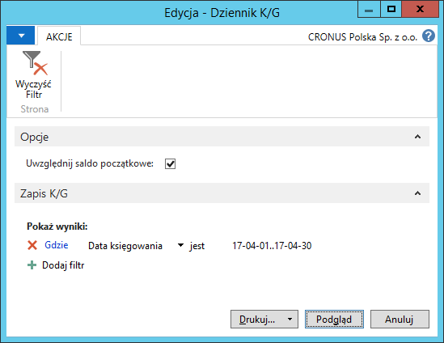{width="4.618110236220472in" height="3.5669291338582676in"}
  -------------------------------------------------------------------------------------
  Rysunek 8.3: Opcje raportu Dziennik K/G

3.  Po zaznaczeniu właściwych opcji i wprowadzeniu właściwego filtru
    okresu, należy wybrać **Drukuj** w celu wydrukowania raportu
    lub **Podgląd** w celu wyświetlenia raportu na ekranie:

  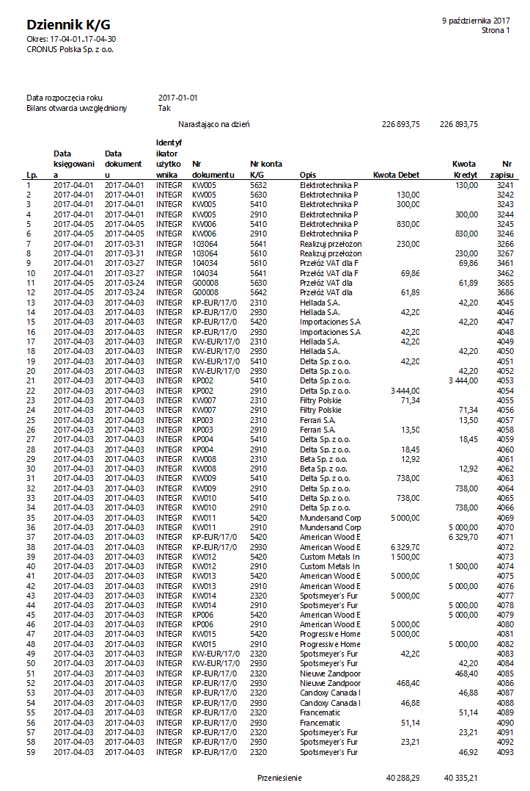{width="5.773148512685914in" height="8.6in"}
  ----------------------------------------------------------------------
  Rysunek 8.4: Podgląd pierwszej strony raportu Dziennik K/G

  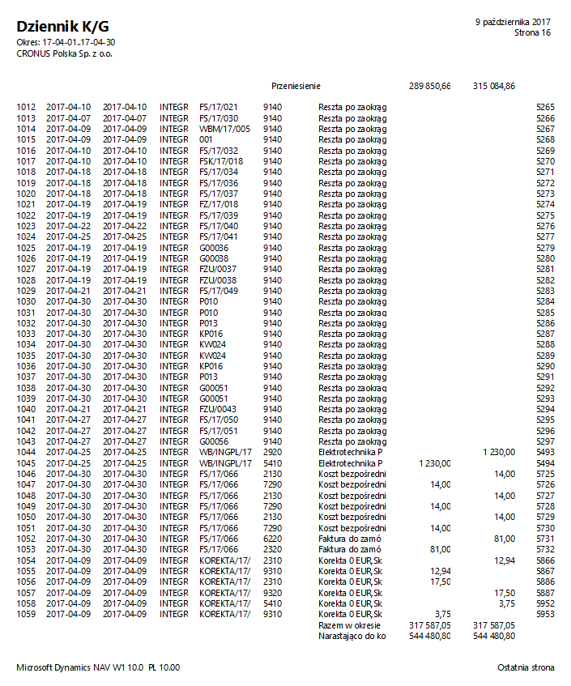{width="5.775924103237095in" height="6.939130577427822in"}
  ------------------------------------------------------------------------------------
  Rysunek 8.5: Podgląd ostatniej strony raportu Dziennik K/G

 {#section-17 .list-paragraph .Poziom-1}

Dokument księgowy -- rejestr K/G {#dokument-księgowy-rejestr-kg .Poziom-1}
--------------------------------

### Informacje ogólne

### W ramach Polskiej Lokalizacji systemu Microsoft Dynamics 365 Business Central on‑premises dostępny jest raport Dokument księgowy -- rejestr K/G potwierdzający zaksięgowanie transakcji, prezentujący dekret księgowy obejmujący księgę główną i inne niezbędne informacje. 

### Obsługa

W celu przygotowania i wydrukowania raportu **Dokument księgowy --
rejestr K/G**, należy postępować według następujących kroków:

1.  Należy wybrać **Działy \> Zarządzanie Finansami \> Księga główna \>
    > Dokument księgow. -- rejestr K/G**.

2.  W oknie wstępnym raportu, które się otworzy, należy wypełnić
    > na karcie skróconej **Rejestr K/G** pole **Nr** wybierając z listy
    > rozwijanej w tym polu numer rejestru księgowego, którego zapisy
    > mają zostać wydrukowane. W razie potrzeby można wprowadzić inne
    > filtry w celu ograniczenia zakresu drukowanych danych.

  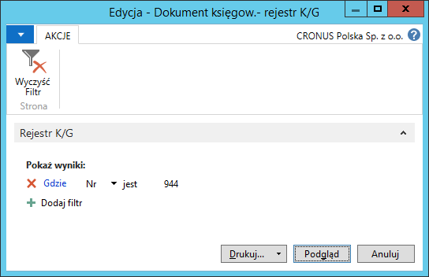{width="4.566929133858268in" height="2.956692913385827in"}
  ------------------------------------------------------------------------------------
  Rysunek 8.6: Opcje raportu Dokument księgowy -- rejestr K/G

3.  Po wprowadzeniu właściwych filtrów należy wybrać **Drukuj** w celu
    wydrukowania raportu lub **Podgląd** w celu wyświetlenia raportu
    na ekranie:

  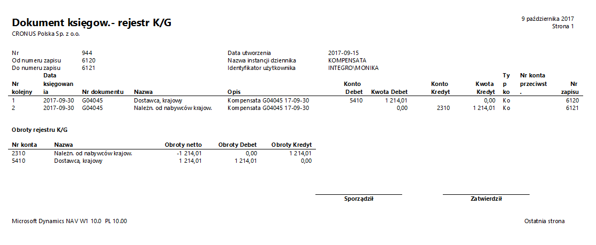{width="6.365217629046369in" height="2.6249726596675416in"}
  -------------------------------------------------------------------------------------
  Rysunek 8.7: Podgląd raportu Dokument księgowy -- rejestr K/G

 {#section-18 .list-paragraph .Poziom-1}

Analityczny rejestr K/G {#analityczny-rejestr-kg .Poziom-1}
-----------------------

### Informacje ogólne

### W ramach Polskiej Lokalizacji systemu Microsoft Dynamics 365 Business Central on‑premises dostępny jest raport Analityczny rejestr K/G, który, podobnie jak raport Dokument księgow. -- rejestr K/G, stanowi potwierdzenie zaksięgowania transakcji i przedstawia dekret księgowy, ale zawiera więcej szczegółów -- m.in. informacje o wymiarach zapisów, księgach pomocniczych i walucie. 

### Obsługa

W celu przygotowania i wydrukowania raportu **Analityczny rejestr K/G**,
należy postępować według następujących kroków:

1.  Należy wybrać **Działy \> Zarządzanie Finansami \> Księga główna \>
    > Analityczny rejestr K/G**.

2.  W oknie wstępnym raportu, które się otworzy, należy wypełnić
    > na karcie skróconej **Rejestr K/G** pole **Nr** wybierając z listy
    > rozwijanej w tym polu numer rejestru księgowego, którego zapisy
    > mają zostać wydrukowane. W razie potrzeby można wprowadzić inne
    > filtry w celu ograniczenia zakresu drukowanych danych.

  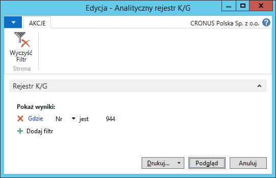{width="4.547244094488189in" height="2.937007874015748in"}
  ------------------------------------------------------------------------------------
  Rysunek 8.8: Opcje raportu Analityczny rejestr K/G

3.  Po wprowadzeniu właściwych filtrów należy wybrać **Drukuj** w celu
    wydrukowania raportu lub **Podgląd** w celu wyświetlenia raportu
    na ekranie:

  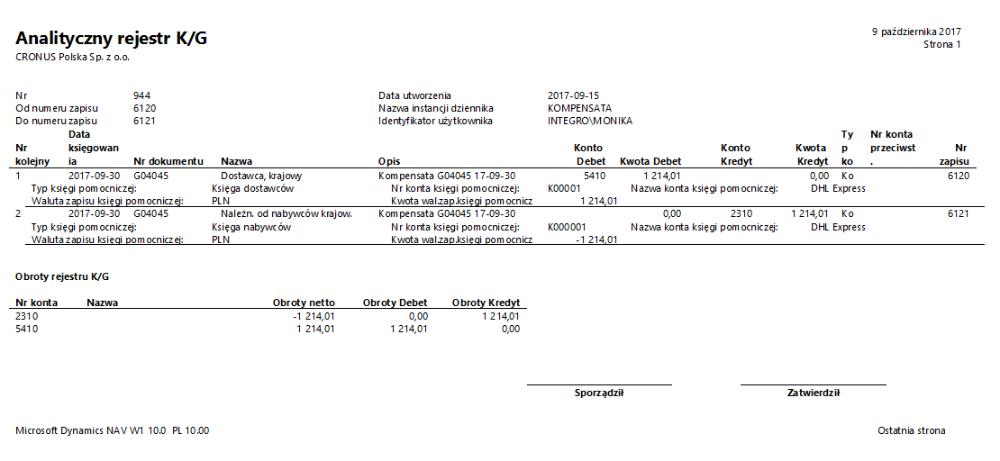{width="6.365217629046369in" height="2.9364326334208224in"}
  -------------------------------------------------------------------------------------
  Rysunek 8.9: Podgląd raportu Analityczny rejestr K/G

 {#section-19 .list-paragraph .Poziom-1}

Analityczny dokument K/G {#analityczny-dokument-kg .Poziom-1}
------------------------

### Informacje ogólne

### W ramach Polskiej Lokalizacji systemu Microsoft Dynamics 365 Business Central on‑premises dostępny jest raport Analityczny dokument K/G, który jest niemal identyczny jak raport Analityczny rejestr K/G. Są dwie różnice pomiędzy tymi dwoma raportami:

-   ### Dane do raportu wybierane są poprzez definiowanie filtrów na różnych poziomach, przy czym raport Analityczny dokument K/G daje większe możliwości filtrowania. 

-   ### W nagłówku raportu Analityczny rejestr K/G drukowane są informacje źródłowe o zaksięgowanej transakcji, co w drugim raporcie jest niedostępne.

### Obsługa

W celu przygotowania i wydrukowania raportu **Analityczny dokument
K/G**, należy postępować według następujących kroków:

1.  Należy wybrać **Działy \> Zarządzanie Finansami \> Księga główna \>
    > Analityczny dokument K/G**.

2.  W oknie wstępnym raportu, które się otworzy, należy w polach
    > na karcie skróconej **Zapis K/G** filtry w celu ograniczenia
    > zakresu drukowanych danych, np. wpisać numer jednego wybranego
    > dokumentu w polu **Nr dokumentu**:

  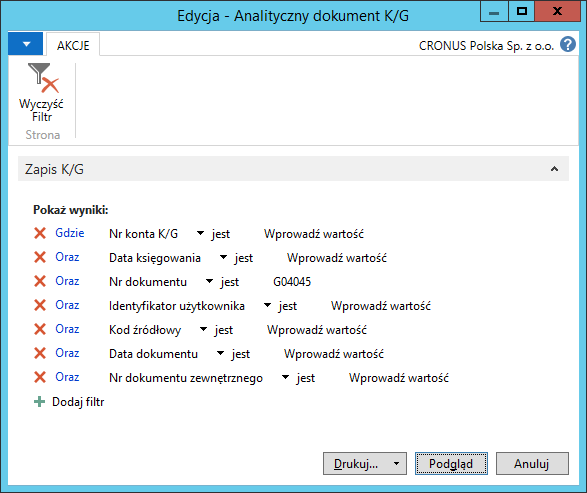{width="4.933070866141732in" height="4.141732283464567in"}
  ------------------------------------------------------------------------------------
  Rysunek 8.10: Opcje raportu Analityczny dokument K/G

3.  Po wprowadzeniu właściwych filtrów należy wybrać **Drukuj** w celu
    wydrukowania raportu lub **Podgląd** w celu wyświetlenia raportu
    na ekranie:

  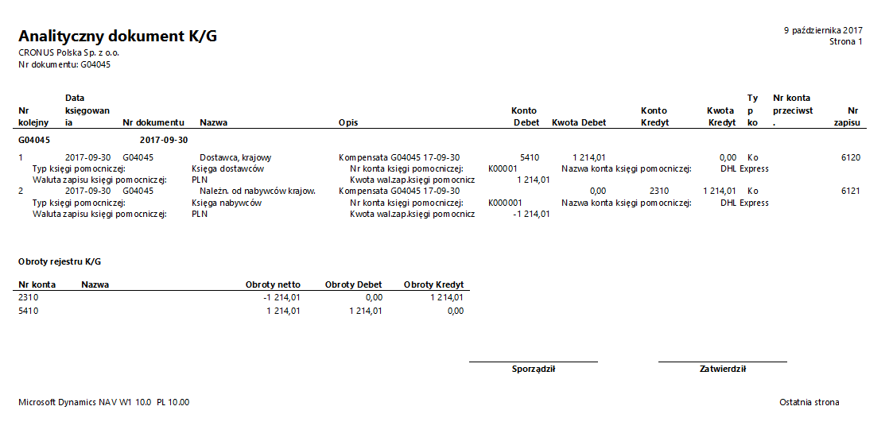{width="6.356521216097987in" height="3.1558497375328085in"}
  -------------------------------------------------------------------------------------
  Rysunek 8.11: Podgląd raportu Analityczny dokument K/G

K/G - faktura zakupu {#kg---faktura-zakupu .Poziom-1}
--------------------

### Informacje ogólne

### W ramach Polskiej Lokalizacji systemu Microsoft Dynamics 365 Business Central on‑premises dostępny jest raport K/G -- faktura zakupu, który może być wydrukowany wyłącznie na podstawie zaksięgowanej faktury zakupu. Może stanowić potwierdzenie zaksięgowania transakcji zakupu, prezentujące dekret księgowy z wszystkimi wymaganymi przez prawo informacjami dotyczącymi m.in. kont księgi głównej i ksiąg pomocniczych, waluty transakcji, kursu wymiany waluty itp.

> {width="0.1875in" height="0.1875in"}
> **Uwaga:** Raport **K/G -- faktura zakupu** można ustawić w oknie
> Wybór **raportów -- zakupy** jako raport księgowania, który drukowany
> jest automatycznie po wybraniu **Księguj i drukuj** w oknie **Faktura
> zakupu**.

### Obsługa

W celu przygotowania i wydrukowania raportu **K/G -- faktura zakupu**,
należy postępować według następujących kroków:

1.  Należy wybrać **Działy \> Zarządzanie Finansami \> Zobowiązania \>
    > K/G -- faktura zakupu**.

2.  W oknie wstępnym raportu, które się otworzy, należy wypełnić
    > na karcie skróconej **Nagłówek faktury zakupu** pole **Nr**
    > wybierając z listy rozwijanej w tym polu numer zaksięgowanej
    > faktury zakupu, której dane mają zostać wydrukowane. W razie
    > potrzeby można wprowadzić inne filtry w celu ograniczenia zakresu
    > drukowanych danych.

  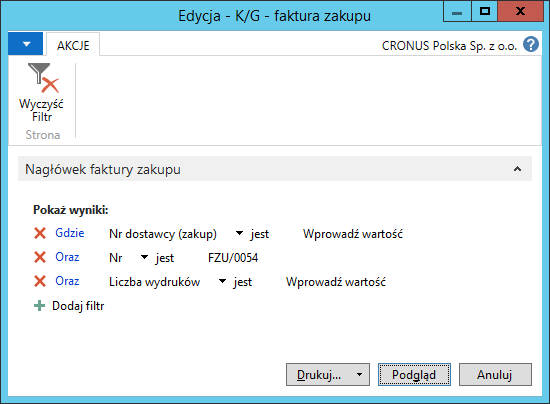{width="4.618110236220472in" height="3.393700787401575in"}
  ------------------------------------------------------------------------------------
  Rysunek 8.12: Opcje raportu K/G -- faktura zakupu

3.  Po wprowadzeniu właściwych filtrów należy wybrać **Drukuj** w celu
    wydrukowania raportu lub **Podgląd** w celu wyświetlenia raportu
    na ekranie:

  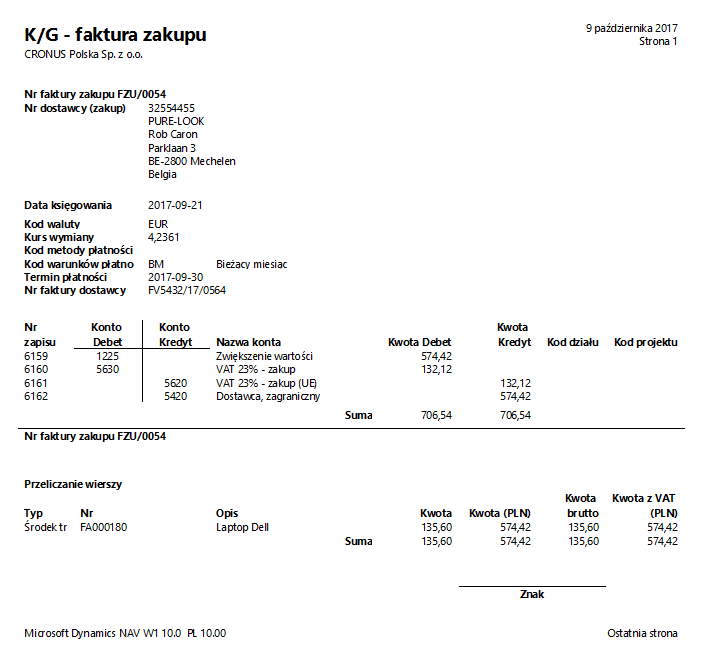{width="6.304347112860892in" height="5.922449693788277in"}
  ------------------------------------------------------------------------------------
  Rysunek 8.13: Podgląd raportu K/G -- faktura zakupu

 {#section-20 .list-paragraph .Poziom-1}

K/G - faktura korygująca zakupu {#kg---faktura-korygująca-zakupu .Poziom-1}
-------------------------------

### Informacje ogólne

### W ramach Polskiej Lokalizacji systemu Microsoft Dynamics 365 Business Central on‑premises dostępny jest raport K/G -- faktura kor. zakupu, który może być wydrukowany wyłącznie na podstawie zaksięgowanej faktury korygującej zakupu. Może stanowić potwierdzenie zaksięgowania transakcji zakupu, prezentujące dekret księgowy z wszystkimi wymaganymi przez prawo informacjami dotyczącymi m.in. kont księgi głównej i ksiąg pomocniczych, waluty transakcji, kursu wymiany waluty itp.

> {width="0.1875in" height="0.1875in"}
> **Uwaga:** Raport **K/G -- faktura kor. zakupu** można ustawić w oknie
> Wybór **raportów -- zakupy** jako raport księgowania, który drukowany
> jest automatycznie po wybraniu **Księguj i drukuj** w oknie **Faktura
> korygująca zakupu**.

### Obsługa

W celu przygotowania i wydrukowania raportu **K/G -- faktura kor.
zakupu**, należy postępować według następujących kroków:

1.  Należy wybrać **Działy \> Zarządzanie Finansami \> Zobowiązania \>
    > K/G -- faktura kor. zakupu**.

2.  W oknie wstępnym raportu, które się otworzy, należy wypełnić
    > na karcie skróconej **Nagłówek faktury kor. zakupu** pole **Nr**
    > wybierając z listy rozwijanej w tym polu numer zaksięgowanej
    > faktury korygującej zakupu, której dane mają zostać wydrukowane.
    > W razie potrzeby można wprowadzić inne filtry w celu ograniczenia
    > zakresu drukowanych danych.

  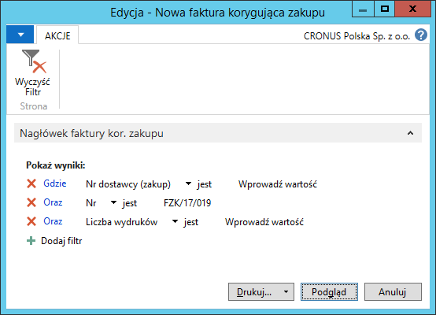{width="4.696850393700787in" height="3.3897637795275593in"}
  -------------------------------------------------------------------------------------
  Rysunek 8.14: Opcje raportu K/G -- faktura kor. zakupu

3.  Po wprowadzeniu właściwych filtrów należy wybrać **Drukuj** w celu
    wydrukowania raportu lub **Podgląd** w celu wyświetlenia raportu
    na ekranie:

  {width="6.313043525809274in" height="5.865194663167104in"}
  ------------------------------------------------------------------------------------
  Rysunek 8.15: Podgląd raportu K/G -- faktura kor. zakupu

K/G - faktura sprzedaży {#kg---faktura-sprzedaży .Poziom-1}
-----------------------

### Informacje ogólne

### W ramach Polskiej Lokalizacji systemu Microsoft Dynamics 365 Business Central on‑premises dostępny jest raport K/G -- faktura sprzedaży, który może być wydrukowany wyłącznie na podstawie zaksięgowanej faktury sprzedaży. Może stanowić potwierdzenie zaksięgowania transakcji sprzedaży, prezentujące dekret księgowy z wszystkimi wymaganymi przez prawo informacjami dotyczącymi m.in. kont księgi głównej i ksiąg pomocniczych, waluty transakcji, kursu wymiany waluty itp.

> {width="0.1875in" height="0.1875in"}
> **Uwaga:** Raport **K/G -- faktura sprzedaży** można ustawić w oknie
> Wybór **raportów -- sprzedaż** jako raport księgowania,
> który drukowany jest automatycznie (oprócz dokumentu faktura
> sprzedaży) po wybraniu **Księguj i drukuj** w oknie **Faktura
> sprzedaży**.

### Obsługa

W celu przygotowania i wydrukowania raportu **K/G -- faktura
sprzedaży**, należy postępować według następujących kroków:

1.  Należy wybrać **Działy \> Zarządzanie Finansami \> Należności \> K/G
    > -- faktura sprzedaży**.

2.  W oknie wstępnym raportu, które się otworzy, należy wypełnić
    > na karcie skróconej **Nagłówek faktury sprzedaży** pole **Nr**
    > wybierając z listy rozwijanej w tym polu numer zaksięgowanej
    > faktury sprzedaży, której dane mają zostać wydrukowane. W razie
    > potrzeby można wprowadzić inne filtry w celu ograniczenia zakresu
    > drukowanych danych.

  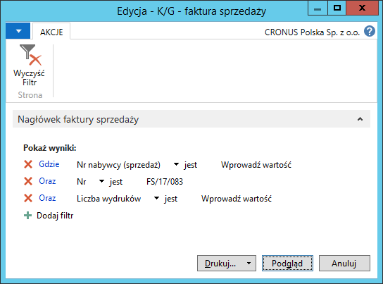{width="4.602362204724409in" height="3.409448818897638in"}
  ------------------------------------------------------------------------------------
  Rysunek 8.16: Opcje raportu K/G -- faktura sprzedaży

3.  Po wprowadzeniu właściwych filtrów należy wybrać **Drukuj** w celu
    wydrukowania raportu lub **Podgląd** w celu wyświetlenia raportu
    na ekranie:

  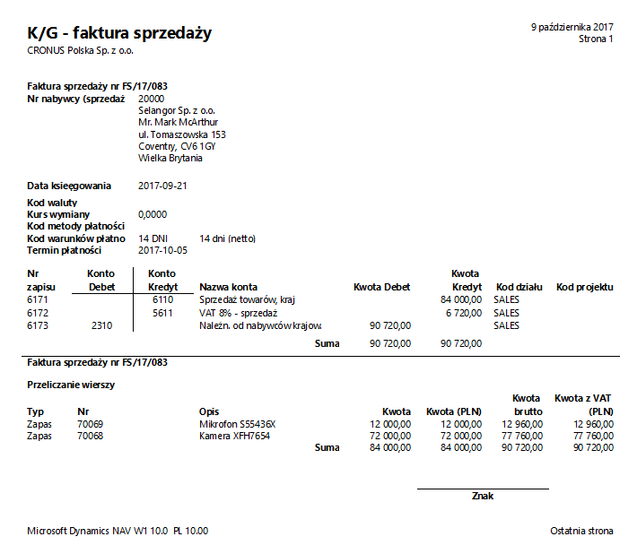{width="6.313043525809274in" height="5.4949103237095365in"}
  -------------------------------------------------------------------------------------
  Rysunek 8.17: Podgląd raportu K/G -- faktura sprzedaży

K/G - faktura korygująca sprzedaży {#kg---faktura-korygująca-sprzedaży .Poziom-1}
----------------------------------

### Informacje ogólne

### W ramach Polskiej Lokalizacji systemu Microsoft Dynamics 365 Business Central on‑premises dostępny jest raport K/G -- faktura kor. sprzedaży, który może być wydrukowany wyłącznie na podstawie zaksięgowanej faktury korygującej sprzedaży. Może stanowić potwierdzenie zaksięgowania transakcji sprzedaży, prezentujące dekret księgowy z wszystkimi wymaganymi przez prawo informacjami dotyczącymi m.in. kont księgi głównej i ksiąg pomocniczych, waluty transakcji, kursu wymiany waluty itp.

> {width="0.1875in" height="0.1875in"}
> **Uwaga:** Raport **K/G -- faktura kor. sprzedaży** można ustawić
> w oknie Wybór **raportów -- sprzedaż** jako raport księgowania,
> który drukowany jest automatycznie (oprócz dokumentu faktura
> korygująca sprzedaży) po wybraniu **Księguj i drukuj** w oknie
> **Faktura korygująca sprzedaży**.

### Obsługa

W celu przygotowania i wydrukowania raportu **K/G -- faktura kor.
sprzedaży**, należy postępować według następujących kroków:

1.  Należy wybrać **Działy \> Zarządzanie Finansami \> Należności \> K/G
    > -- faktura kor. sprzedaży**.

2.  W oknie wstępnym raportu, które się otworzy, należy wypełnić
    > na karcie skróconej **Nagłówek faktury kor. sprzedaży** pole
    > **Nr** wybierając z listy rozwijanej w tym polu numer
    > zaksięgowanej faktury korygującej sprzedaży, której dane mają
    > zostać wydrukowane. W razie potrzeby można wprowadzić inne filtry
    > w celu ograniczenia zakresu drukowanych danych.

  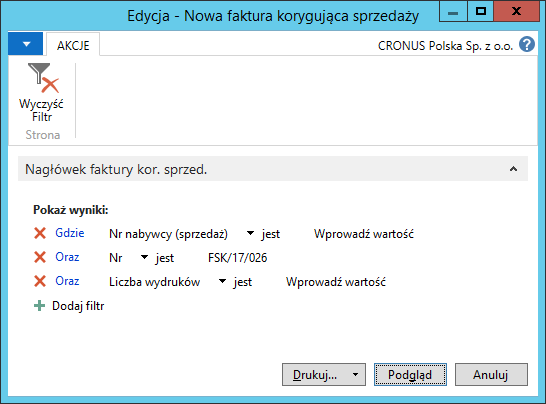{width="4.5984251968503935in" height="3.405511811023622in"}
  -------------------------------------------------------------------------------------
  Rysunek 8.18: Opcje raportu K/G -- faktura kor. sprzedaży

3.  Po wprowadzeniu właściwych filtrów należy wybrać **Drukuj** w celu
    wydrukowania raportu lub **Podgląd** w celu wyświetlenia raportu
    na ekranie:

  {width="6.295651793525809in" height="5.403767497812773in"}
  ------------------------------------------------------------------------------------
  Rysunek 8.19: Podgląd raportu K/G -- faktura kor. sprzedaży

Konto bankowe - szczegółowy bilans próbny {#konto-bankowe---szczegółowy-bilans-próbny .Poziom-1}
-----------------------------------------

### Informacje ogólne

### Raport Konto bankowe -- szczegółowy bilans próbny prezentuje szczegóły transakcji zaksięgowanych na wybranych kontach bankowych. Raport ten może być wykorzystany przy zamknięciu okresu obrachunkowego lub roku finansowego. W ramach Polskiej Lokalizacji systemu Microsoft Dynamics 365 Business Central on‑premises wydruk raportu został rozszerzony o kolumny kwot debet i kredyt.

### Obsługa

W celu przygotowania i wydrukowania raportu **Konto bankowe --
szczegółowy bilans próbny**, należy postępować według następujących
kroków:

1.  Należy wybrać **Działy \> Zarządzanie Finansami \> Zarządzanie
    środkami pieniężnymi \> Konto bank. -- szczegół. bilans próbny**.

2.  W oknie wstępnym raportu, które się otworzy, należy wypełnić
    na karcie skróconej **Konto bankowe** pole **Filtr daty**
    wprowadzając w nim okres objęty raportem. W razie potrzeby można
    wypełnić inne pola w celu ograniczenia danych ujętych w raporcie.

> Na karcie skróconej **Opcje** należy zaznaczyć właściwe pola:

-   **Nowa strona dla konta bankowego** -- zaznaczenie tego pola
    > spowoduje, że każde konto bankowe zostanie wydrukowane na odrębnej
    > stronie.

-   **Wyklucz konta bankowe z samym saldem** -- zaznaczenie tego pola
    > spowoduje, że w raporcie zostaną pominięte konta bankowe,
    > które mają saldo, ale nie mają zapisów w okresie wybranym w polu
    > **Filtr daty**.

-   **Uwzględnij zapisy wycofane** -- zaznaczenie tego pola spowoduje,
    > że w raporcie zostaną wydrukowane również zapisy, które zostały
    > wycofane.

  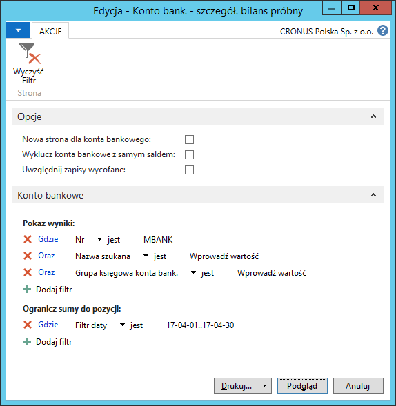{width="4.850393700787402in" height="4.9763779527559056in"}
  -------------------------------------------------------------------------------------
  Rysunek 8.20: Opcje raportu Konto bank. -- szczegół. bilans próbny

3.  Po wprowadzeniu właściwych filtrów należy wybrać **Drukuj** w celu
    wydrukowania raportu lub **Podgląd** w celu wyświetlenia raportu
    na ekranie:

  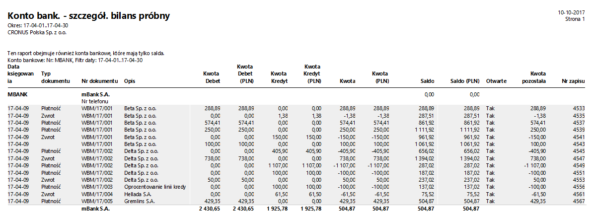{width="6.434782370953631in" height="2.361482939632546in"}
  ------------------------------------------------------------------------------------
  Rysunek 8.21: Podgląd raportu Konto bank. -- szczegół. bilans próbny

Zestawienie obrotów i sald nabywcy/dostawcy {#zestawienie-obrotów-i-sald-nabywcydostawcy .Poziom-1}
-------------------------------------------

### Informacje ogólne

### W ramach Polskiej Lokalizacji systemu Microsoft Dynamics 365 Business Central on‑premises dostępne są raporty Zestawienie obrotów i sald nabywców oraz Zestawienie obrotów i sald dostawców będące uzupełnieniem dla raportu Zestawienie obrotów i sald kont K/G. Bazują one na zapisach ksiąg pomocniczych: należności i zobowiązań. Przygotowanie raportów jest obowiązkowe raz w miesiącu, ale, w razie potrzeby, mogą być przygotowywane częściej, za dowolne okresy. Raporty Zestawienie obrotów i sald nabywców oraz Zestawienie obrotów i sald dostawców przedstawiają następujące wartości dla wszystkich nabywców/dostawców, w podziale na grupy księgowe (konta należności):

-   Saldo początkowe

-   Obroty okresu

-   Obroty narastająco

-   Saldo na dzień

> {width="0.1875in" height="0.1875in"}
> **Uwaga:** Przed przygotowaniem raportów **Zestawienie obrotów i sald
> nabywców** i **Zestawienie obrotów i sald dostawców** konieczne jest
> zdefiniowanie okresów obrachunkowych.

### Obsługa

W celu przygotowania i wydrukowania raportu **Zestawienie obrotów i sald
nabywców**, należy postępować według następujących kroków:

1.  Należy wybrać **Działy \> Zarządzanie Finansami \> Należności \>
    Zest. obrotów i sald nabywców**.

2.  W oknie wstępnym raportu, które się otworzy, należy wypełnić
    na karcie skróconej **Nabywca** co najmniej pole **Filtr daty**
    wprowadzając w nim okres objęty raportem. W razie potrzeby można
    wypełnić inne pola w celu ograniczenia danych ujętych w raporcie.

> Na karcie skróconej **Opcje** należy zaznaczyć właściwe pola:

-   **Uwzględnij saldo początkowe** -- zaznaczenie tego pola spowoduje,
    > że kwota salda początkowego zostanie dodana do kwoty w polu
    > **Obroty narastająco do dnia.**

-   **Tylko konta z obrotami** -- zaznaczenie tego pola spowoduje,
    > że w raporcie zostaną wyświetlone wartości tylko tych nabywców,
    > dla których istnieją zapisy księgowe w okresie wprowadzonym w polu
    > **Filtr daty**.

-   **Pokaż salda jako Wn/Ma** -- zaznaczenie tego pola spowoduje,
    > że kwoty dla każdego nabywcy zostaną zsumowane i wyświetlone
    > odrębnie dla zapisów po stronie Wn i po stronie Ma.

  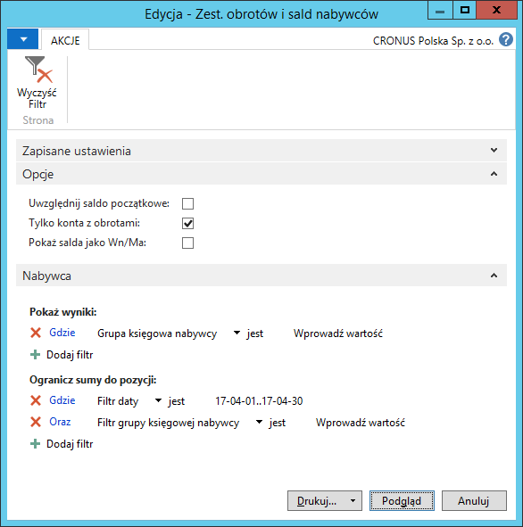{width="4.925196850393701in" height="4.968503937007874in"}
  ------------------------------------------------------------------------------------
  Rysunek 8.22: Opcje raportu Zestawienie obrotów i sald nabywców

3.  Po zaznaczeniu właściwych opcji i wprowadzeniu właściwych filtrów,
    należy wybrać **Drukuj** w celu wydrukowania raportu lub **Podgląd**
    w celu wyświetlenia raportu na ekranie:

  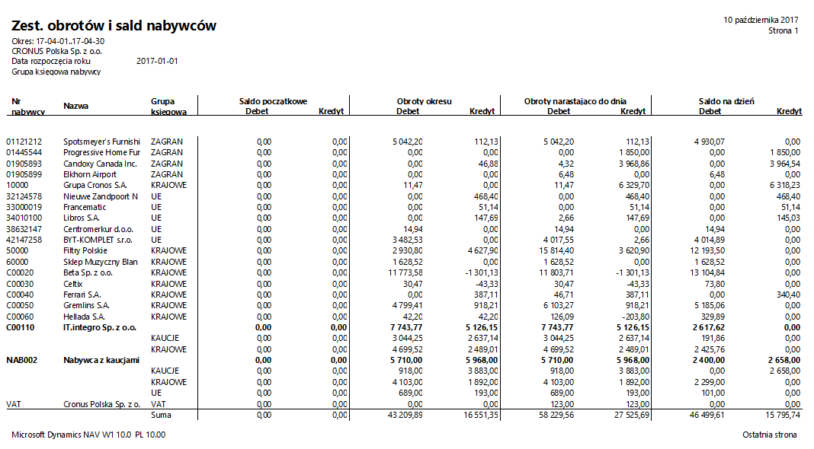{width="6.29597987751531in" height="3.4782600612423447in"}
  ------------------------------------------------------------------------------------
  Rysunek 8.23: Podgląd raportu Zestawienie obrotów i sald nabywcóW

> {width="0.1875in" height="0.1875in"}
> **Uwaga: W **sytuacji, gdy należności jednego nabywcy zostały
> zaksięgowane na więcej niż jedno konto należności (z więcej niż jedną
> grupą księgową), wyświetlone są w raporcie w następujący sposób:
> pierwszy wiersz dla nabywcy, z jego numerem i nazwą wydrukowany jest
> czcionką pogrubioną, a kwoty w tym wierszu są sumą wszystkich jego
> należności. W kolejnych wierszach, bez numeru i nazwy nabywcy,
> wydrukowane są normalną czcionką sumy należności danego nabywcy
> w podziale na grupy księgowe, których kody wykazane są w kolumnie
> **Grupa księgowa**. W sytuacji, gdy dany nabywca ma należności
> powiązane tylko z jednym kontem należności (grupą księgową), kwoty
> wydrukowane są normalną czcionką, w jednym wierszu.

W celu przygotowania i wydrukowania raportu **Zestawienie obrotów i sald
dostawców**, należy postępować według następujących kroków:

1.  Należy wybrać **Działy \> Zarządzanie Finansami \> Zobowiązania \>
    Zest. obrotów i sald dostawców**.

2.  W oknie wstępnym raportu, które się otworzy, należy wypełnić
    na karcie skróconej **Dostawca** co najmniej pole **Filtr daty**
    wprowadzając w nim okres objęty raportem. W razie potrzeby można
    wypełnić inne pola w celu ograniczenia danych ujętych w raporcie.

> Na karcie skróconej **Opcje** należy zaznaczyć właściwe pola:

-   **Uwzględnij bilans otwarcia** -- zaznaczenie tego pola spowoduje,
    > że kwota salda początkowego zostanie dodana do kwoty w polu
    > **Obroty narastająco do dnia.**

-   **Tylko konta z obrotami** -- zaznaczenie tego pola spowoduje,
    > że w raporcie zostaną wyświetlone wartości tylko tych dostawców,
    > dla których istnieją zapisy księgowe w okresie wprowadzonym w polu
    > **Filtr daty**.

-   **Pokaż salda jako Wn/Ma** -- zaznaczenie tego pola spowoduje,
    > że kwoty dla każdego dostawcy zostaną zsumowane i wyświetlone
    > odrębnie dla zapisów po stronie Wn i po stronie Ma.

  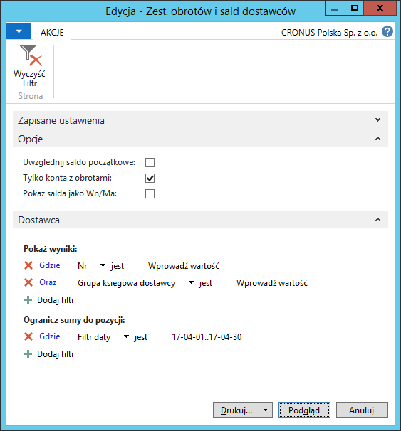{width="4.728346456692913in" height="5.090551181102362in"}
  ------------------------------------------------------------------------------------
  Rysunek 8.24: Opcje raportu Zestawienie obrotów i sald dostawców

3.  Po zaznaczeniu właściwych opcji i wprowadzeniu właściwych filtrów,
    należy wybrać **Drukuj** w celu wydrukowania raportu lub **Podgląd**
    w celu wyświetlenia raportu na ekranie:

  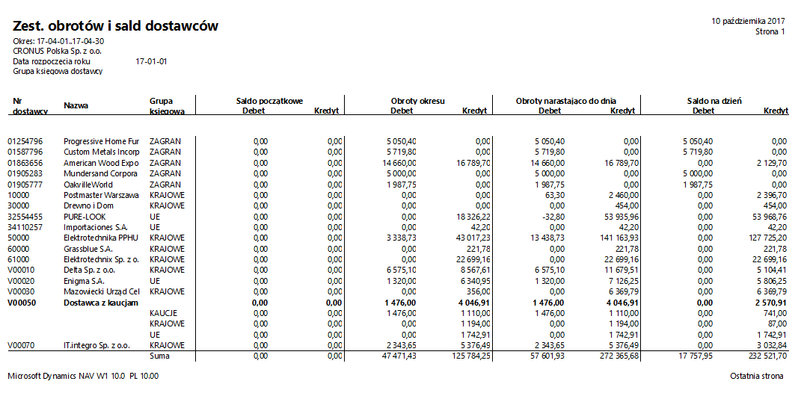{width="6.339130577427822in" height="3.1133530183727034in"}
  -------------------------------------------------------------------------------------
  Rysunek 8.25: Podgląd raportu Zestawienie obrotów i sald dostawców

> {width="0.1875in" height="0.1875in"}
> **Uwaga: W **sytuacji, gdy zobowiązania jednego dostawcy zostały
> zaksięgowane na więcej niż jedno konto zobowiązań (z więcej niż jedną
> grupą księgową), wyświetlone są w raporcie w następujący sposób:
> pierwszy wiersz dla dostawcy, z jego numerem i nazwą wydrukowany jest
> czcionką pogrubioną, a kwoty w tym wierszu są sumą wszystkich jego
> zobowiązań. W kolejnych wierszach, bez numeru i nazwy dostawcy,
> wydrukowane są normalną czcionką sumy zobowiązań danego dostawcy
> w podziale na grupy księgowe, których kody wykazane są w kolumnie
> **Grupa księgowa**. W sytuacji, gdy dany dostawca ma zobowiązania
> powiązane tylko z jednym kontem zobowiązań (grupą księgową), kwoty
> wydrukowane są normalną czcionką, w jednym wierszu.

Dziennik zapisów księgi nabywców/ dostawców {#dziennik-zapisów-księgi-nabywców-dostawców .Poziom-1}
-------------------------------------------

### Informacje ogólne

### W ramach Polskiej Lokalizacji systemu Microsoft Dynamics 365 Business Central on‑premises dostępne są raporty Dziennik zapisów księgi nabywców oraz Dziennik zapisów księgi dostawców będące uzupełnieniem dla raportu Dziennik K/G. Bazują na zapisach ksiąg pomocniczych: należności i zobowiązań. Przygotowanie raportów jest obowiązkowe raz w miesiącu, ale, w razie potrzeby, mogą być przygotowywane częściej, za dowolne okresy. Raporty Dziennik zapisów księgi nabywców oraz Dziennik zapisów księgi dostawców przedstawiają wszystkie zapisy księgi nabywców lub dostawców w porządku chronologicznym. 

### Obsługa

W celu przygotowania i wydrukowania raportu **Dziennik zapisów księgi
nabywców**, należy postępować według następujących kroków:

1.  Należy wybrać **Działy \> Zarządzanie Finansami \> Należności \>
    > Dziennik zapisów księgi nabywców**.

2.  W oknie wstępnym raportu, które się otworzy, należy wypełnić
    > na karcie skróconej **Zapis księgi nabywców** pole **Filtr daty**
    > wprowadzając w nim okres objęty raportem.

> Na karcie skróconej **Opcje** należy zaznaczyć pole **Uwzględnij
> bilans otwarcia**, jeśli kwota salda początkowego ma zostać dodana
> do sum zapisów księgowych wykazanych narastająco. W przeciwnym wypadku
> pola nie należy zaznaczać.

  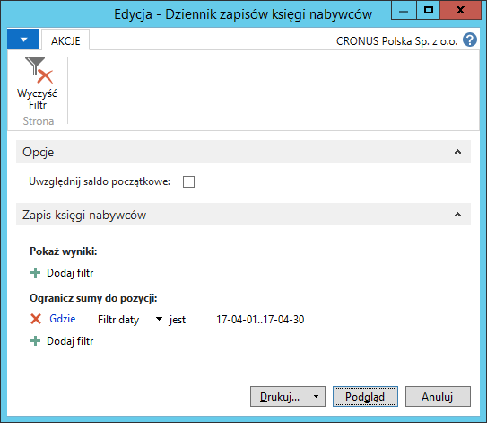{width="4.610236220472441in" height="3.9960629921259843in"}
  -------------------------------------------------------------------------------------
  Rysunek 8.26: Opcje raportu Dziennik zapisów księgi nabywców

3.  Po zaznaczeniu właściwych opcji i wprowadzeniu właściwego filtru
    okresu, należy wybrać **Drukuj** w celu wydrukowania raportu
    lub **Podgląd** w celu wyświetlenia raportu na ekranie:

  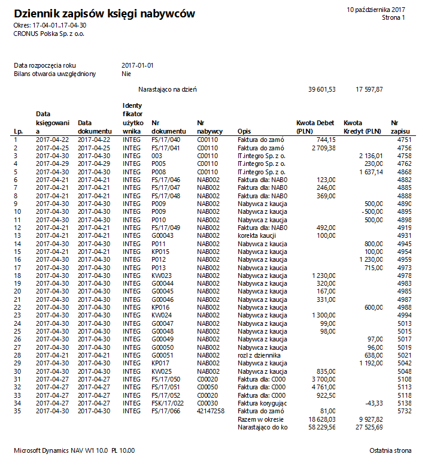{width="6.226087051618547in" height="6.822088801399825in"}
  ------------------------------------------------------------------------------------
  Rysunek 8.27: Podgląd raportu Dziennik zapisów księgi nabywców

W celu przygotowania i wydrukowania raportu **Dziennik zapisów księgi
dostawców**, należy postępować według następujących kroków:

1.  Należy wybrać **Działy \> Zarządzanie Finansami \> Zobowiązania \>
    > Dziennik zapisów księgi dostawców**.

2.  W oknie wstępnym raportu, które się otworzy, należy wypełnić
    > na karcie skróconej **Zapis księgi dostawców** pole **Filtr daty**
    > wprowadzając w nim okres objęty raportem.

> Na karcie skróconej **Opcje** należy zaznaczyć pole **Uwzględnij
> bilans otwarcia**, jeśli kwota salda początkowego ma zostać dodana
> do sum zapisów księgowych wykazanych narastająco. W przeciwnym wypadku
> pola nie należy zaznaczać.

  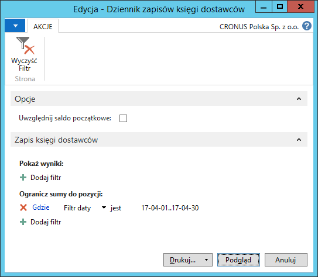{width="4.590551181102362in" height="4.0078740157480315in"}
  -------------------------------------------------------------------------------------
  Rysunek 8.28: Opcje raportu Dziennik zapisów księgi dostawców

3.  Po zaznaczeniu właściwych opcji i wprowadzeniu właściwego filtru
    okresu, należy wybrać **Drukuj** w celu wydrukowania raportu
    lub **Podgląd** w celu wyświetlenia raportu na ekranie:

  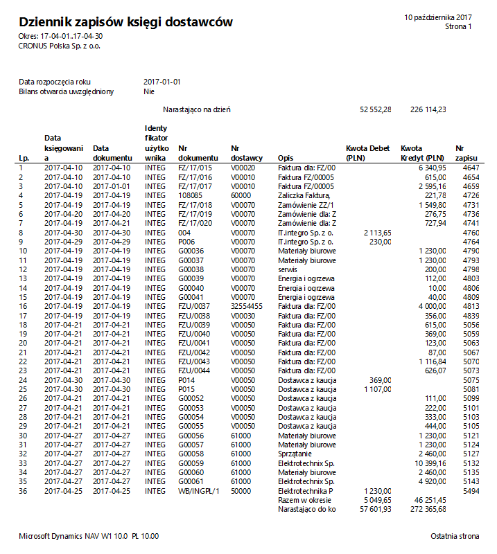{width="6.257871828521435in" height="6.982608267716535in"}
  ------------------------------------------------------------------------------------
  Rysunek 8.29: Podgląd raportu Dziennik zapisów księgi dostawców

 {#section-21 .list-paragraph .Poziom-1}

Wiekowanie należności/zobowiązań w zadanych okresach {#wiekowanie-należnościzobowiązań-w-zadanych-okresach .Poziom-1}
----------------------------------------------------

### Informacje ogólne

### W ramach Polskiej Lokalizacji systemu Microsoft Dynamics 365 Business Central on‑premises dostępne są raporty Wiekowanie należności i Wiekowanie zobowiązań. Prezentują one należności i zobowiązania w sześciu dowolnie wybranych okresach, do wyboru, według daty płatności lub daty księgowania. 

### Obsługa

W celu przygotowania i wydrukowania raportu **Wiekowanie należności**,
należy postępować według następujących kroków:

1.  Należy wybrać **Działy \> Zarządzanie Finansami \> Należności \>
    Wiekowanie należności PL**.

2.  W oknie wstępnym raportu, które się otworzy, na karcie skróconej
    **Nabywca** można ustawić filtry w celu ograniczenia danych
    prezentowanych w raporcie, ale nie jest to obowiązkowe.

> Na karcie skróconej **Opcje** należy odpowiednio wypełnić
> lub zaznaczyć wymagane pola:

-   **Data kalkulacji** -- w tym polu należy wprowadzić datę, w stosunku
    > do której będą liczone dni przeterminowania należności.

-   **Pokaż szczegóły** -- zaznaczenie tego pola spowoduje,
    > że w raporcie dla każdego nabywcy zostaną wyświetlone poszczególne
    > zapisy składające się na saldo jego należności.

-   **Kwoty w walucie** -- zaznaczenie tego pola spowoduje,
    > że w raporcie zostaną wyświetlone kwoty w walutach źródłowych,
    > w przeciwnym wypadku w raporcie wykazana jest ich równowartość
    > w złotych polskich.

-   **Przeterm. do **-- w polu tym należy wpisać maksymalną ilość dni
    > przeterminowania należności; istnieje 6 pól o nazwie **Przeterm.
    > do**, w których należy wpisać 6 kolejnych okresów
    > przeterminowania, wszystkie pola muszą być uzupełnione.

-   **Tylko kwoty różne od 0** -- zaznaczenie tego pola powoduje,
    > że w raporcie zostaną wyświetlone tylko te zapisy, które w co
    > najmniej jednej kolumnie będą mieć wyświetloną kwotę różną od 0.
    > Pole **Tylko kwoty różne od 0** jest edytowalne tylko wtedy,
    > gdy zaznaczone jest pole **Pokaż szczegóły**.

-   **Według** -- z lity rozwijanej w tym polu należy wybrać jedną
    > z dostępnych opcji:

```{=html}
<!-- -->
```
-   **Data płatności** -- wybór tej opcji spowoduje, że ilość dni
    > przeterminowania należności będzie liczona jako ilość dni,
    > która upłynęła od daty płatności należności do daty wprowadzonej
    > w polu **Data kalkulacji**. Ilość dni obliczona w ten sposób
    > wskaże, do którego z 6 okresów ustawionych w polach **Przeterm.
    > do **powinna być przyporządkowana należność.

-   **Data księgowania** -- wybór tej opcji spowoduje, że ilość dni
    > przeterminowania należności będzie liczona jako ilość dni,
    > która upłynęła od daty księgowania należności do daty wprowadzonej
    > w polu **Data kalkulacji**. Ilość dni obliczona w ten sposób
    > wskaże, do którego z 6 okresów ustawionych w polach **Przeterm.
    > do **powinna być przyporządkowana należność.

  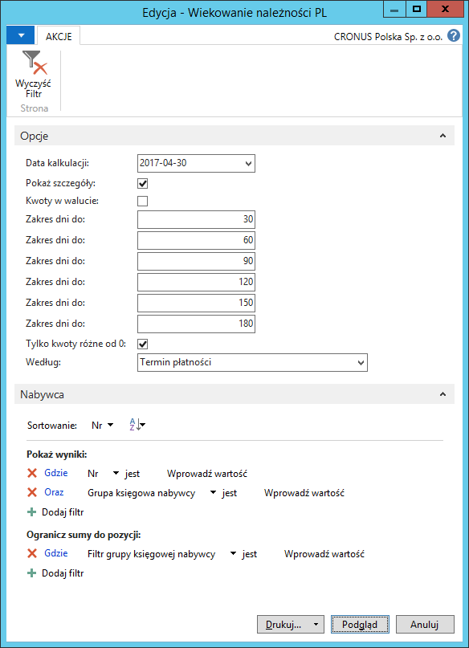{width="4.913385826771654in" height="6.791338582677166in"}
  ------------------------------------------------------------------------------------
  Rysunek 8.30: Opcje raportu Wiekowanie należności

3.  Po wprowadzeniu właściwych parametrów, należy wybrać **Drukuj**
    w celu wydrukowania raportu lub **Podgląd** w celu wyświetlenia
    raportu na ekranie:

  {width="6.33043416447944in" height="4.601061898512686in"}
  -----------------------------------------------------------------------------------
  Rysunek 8.31: Podgląd raportu Wiekowanie należności

> {width="0.1875in" height="0.1875in"}
> **Uwaga: W **raporcie **Wiekowanie należności** zapisy każdego nabywcy
> są grupowane i sumowane według grup księgowych, niezależnie, czy
> zostało zaznaczone pole **Pokaż szczegóły**, czy nie.

W celu przygotowania i wydrukowania raportu **Wiekowanie zobowiązań**,
należy postępować według następujących kroków:

1.  Należy wybrać **Działy \> Zarządzanie Finansami \> Zobowiązania \>
    Wiekowanie zobowiązań PL**.

2.  W oknie wstępnym raportu, które się otworzy, na karcie skróconej
    **Dostawca** można ustawić filtry w celu ograniczenia danych
    prezentowanych w raporcie, ale nie jest to obowiązkowe.

> Na karcie skróconej **Opcje** należy odpowiednio wypełnić
> lub zaznaczyć wymagane pola:

-   **Data kalkulacji** -- w tym polu należy wprowadzić datę, w stosunku
    > do której będą liczone dni przeterminowania zobowiązań.

-   **Pokaż szczegóły** -- zaznaczenie tego pola spowoduje,
    > że w raporcie dla każdego dostawcy zostaną wyświetlone
    > poszczególne zapisy składające się na saldo jego zobowiązań.

-   **Kwoty w walucie** -- zaznaczenie tego pola spowoduje,
    > że w raporcie zostaną wyświetlone kwoty w walutach źródłowych,
    > w przeciwnym wypadku w raporcie wykazana jest ich równowartość
    > w złotych polskich.

-   **Przeterm. do **-- w polu tym należy wpisać maksymalną ilość dni
    > przeterminowania zobowiązań; istnieje 6 pól o nazwie **Przeterm.
    > do**, w których należy wpisać 6 kolejnych okresów
    > przeterminowania, wszystkie pola muszą być uzupełnione.

-   **Tylko kwoty różne od 0** -- zaznaczenie tego pola powoduje,
    > że w raporcie zostaną wyświetlone tylko te zapisy, które w co
    > najmniej jednej kolumnie będą mieć wyświetloną kwotę różną od 0.
    > Pole **Tylko kwoty różne od 0** jest edytowalne tylko wtedy,
    > gdy zaznaczone jest pole **Pokaż szczegóły**.

-   **Według** -- z lity rozwijanej w tym polu należy wybrać jedną
    > z dostępnych opcji:

```{=html}
<!-- -->
```
-   **Data płatności** -- wybór tej opcji spowoduje, że ilość dni
    > przeterminowania zobowiązania będzie liczona jako ilość dni,
    > która upłynęła od daty płatności zobowiązania do daty wprowadzonej
    > w polu **Data kalkulacji**. Ilość dni obliczona w ten sposób
    > wskaże, do którego z 6 okresów ustawionych w polach **Przeterm.
    > do **powinno być przyporządkowane zobowiązanie.

-   **Data księgowania** -- wybór tej opcji spowoduje, że ilość dni
    > przeterminowania zobowiązania będzie liczona jako ilość dni,
    > która upłynęła od daty księgowania zobowiązania do daty
    > wprowadzonej w polu **Data kalkulacji**. Ilość dni obliczona w ten
    > sposób wskaże, do którego z 6 okresów ustawionych w polach
    > **Przeterm. do **powinno być przyporządkowane zobowiązanie.

  {width="4.980314960629921in" height="6.826771653543307in"}
  ------------------------------------------------------------------------------------
  Rysunek 8.32: Opcje raportu Wiekowanie zobowiązań

3.  Po wprowadzeniu właściwych parametrów, należy wybrać **Drukuj**
    w celu wydrukowania raportu lub **Podgląd** w celu wyświetlenia
    raportu na ekranie:

  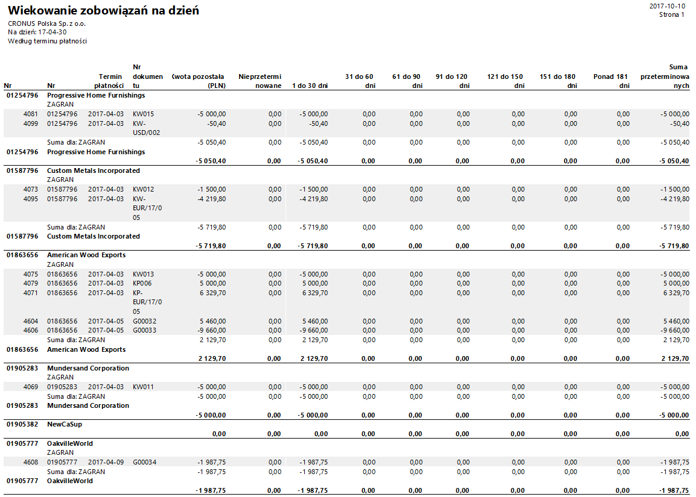{width="6.278260061242345in" height="4.492041776027997in"}
  ------------------------------------------------------------------------------------
  Rysunek 8.33: Podgląd raportu Wiekowanie zobowiązań

> {width="0.1875in" height="0.1875in"}
> **Uwaga: W **raporcie **Wiekowanie zobowiązań** zapisy każdego
> dostawcy są grupowane i sumowane według grup księgowych, niezależnie,
> czy zostało zaznaczone pole **Pokaż szczegóły**, czy nie.

Analiza wiekowania należności/zobowiązań {#analiza-wiekowania-należnościzobowiązań .Poziom-1}
----------------------------------------

### Informacje ogólne

**Polska Lokalizacja w systemie Microsoft Dynamics 365 Business Central
on‑premises udostępnia narzędzia Analiza wiekowania należności i Analiza
wiekowania zobowiązań, które prezentują wiekowanie należności
i wiekowanie zobowiązań w formie tabelarycznej, ułatwiając analizowanie
danych z możliwością ich sortowania, filtrowania i kopiowania.**

### Obsługa

W celu przygotowania **Analizy wiekowania należności**, należy
postępować według następujących kroków:

1.  Należy wybrać **Działy \> Zarządzanie Finansami \> Księga główna \>
    Analizy i raporty \> Analiza wiekowania należności**.

2.  W oknie z parametrami wstępnymi zestawienia **Analiza wiekowania
    należności**, które się otworzy, należy wypełnić pola:

> Na karcie skróconej **Ogólne**:

-   **Data kalkulacji** -- w tym polu należy wprowadzić datę, w stosunku
    > do której będą liczone dni przeterminowania należności.

-   **Pokaż szczegóły** -- zaznaczenie tego pola spowoduje,
    > że w zestawieniu dla każdego nabywcy zostaną wyświetlone
    > poszczególne zapisy składające się na saldo jego należności.

-   **Kwoty w walucie** -- zaznaczenie tego pola spowoduje,
    > że w zestawieniu zostaną wyświetlone kwoty w walutach źródłowych,
    > w przeciwnym wypadku w zestawieniu wykazana jest ich równowartość
    > w złotych polskich.

-   **Przeterm. do **-- w polu tym należy wpisać maksymalną ilość dni
    > przeterminowania należności; istnieje 6 pól o nazwie **Przeterm.
    > do**, w których należy wpisać 6 kolejnych okresów
    > przeterminowania, wszystkie pola muszą być uzupełnione.

-   **Według** -- z lity rozwijanej w tym polu należy wybrać jedną
    > z dostępnych opcji:

```{=html}
<!-- -->
```
-   **Termin płatności** -- wybór tej opcji spowoduje, że ilość dni
    > przeterminowania należności będzie liczona jako ilość dni,
    > która upłynęła od terminu płatności zobowiązania do daty
    > wprowadzonej w polu **Data kalkulacji**. Ilość dni obliczona w ten
    > sposób wskaże, do którego z 6 okresów ustawionych w polach
    > **Przeterm. do **powinna być przyporządkowana należność.

-   **Data księgowania** -- wybór tej opcji spowoduje, że ilość dni
    > przeterminowania należności będzie liczona jako ilość dni,
    > która upłynęła od daty księgowania należności do daty wprowadzonej
    > w polu **Data kalkulacji**. Ilość dni obliczona w ten sposób
    > wskaże, do którego z 6 okresów ustawionych w polach **Przeterm.
    > do **powinna być przyporządkowana należność.

> Na karcie skróconej **Filtry**:

-   **Nabywca** -- w tym polu można wybrać jednego lub więcej nabywców,
    > do należności których ma być ograniczone zestawienie. Brak
    > wypełnienia pola spowoduje wyświetlenie należności wszystkich
    > nabywców.

-   **Grupa księgowa nabywcy** -- w tym polu można wybrać jedną
    > lub więcej grup księgowych nabywców, z którymi powiązane
    > są należności, do których mają być ograniczone dane w zestawieniu.
    > Brak wypełnienia pola spowoduje wyświetlenie wszystkich
    > należności.

  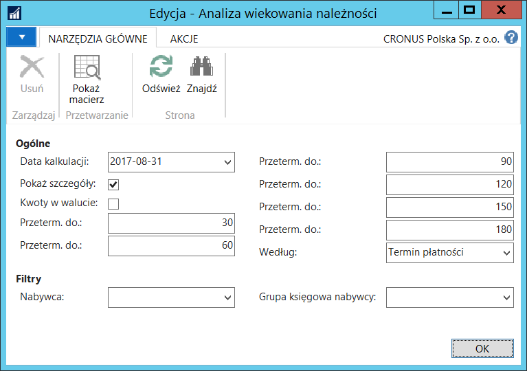{width="5.18503937007874in" height="3.6496062992125986in"}
  ------------------------------------------------------------------------------------
  Rysunek 8.34: Opcje wstępne Analizy wiekowania należności

3.  Aby wyświetlić zestawienie, wybierz **Pokaż macierz**:

  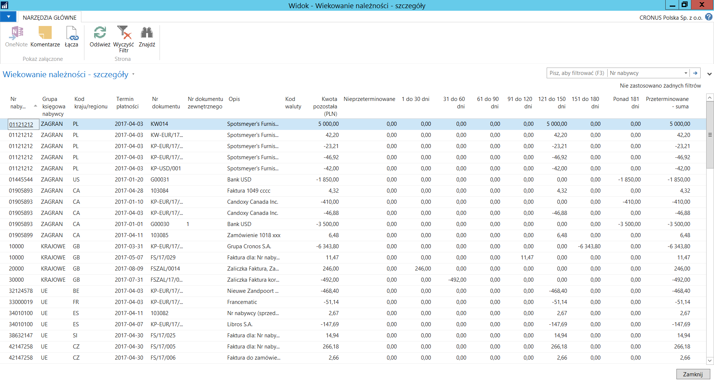{width="6.354166666666667in" height="3.4153641732283466in"}
  -------------------------------------------------------------------------------------
  Rysunek 8.35: Zestawienie Analiza wiekowania należności

W celu przygotowania **Analizy wiekowania zobowiązań**, należy
postępować według następujących kroków:

1.  Należy wybrać **Działy \> Zarządzanie Finansami \> Księga główna \>
    Analizy i raporty \> Analiza wiekowania zobowiązań**.

2.  W oknie z parametrami wstępnymi zestawienia **Analiza wiekowania
    zobowiązań**, które się otworzy, należy wypełnić pola:

> Na karcie skróconej **Ogólne**:

-   **Data kalkulacji** -- w tym polu należy wprowadzić datę, w stosunku
    > do której będą liczone dni przeterminowania zobowiązań.

-   **Pokaż szczegóły** -- zaznaczenie tego pola spowoduje,
    > że w zestawieniu dla każdego dostawcy zostaną wyświetlone
    > poszczególne zapisy składające się na saldo jego zobowiązań.

-   **Kwoty w walucie** -- zaznaczenie tego pola spowoduje,
    > że w zestawieniu zostaną wyświetlone kwoty w walutach źródłowych,
    > w przeciwnym wypadku w zestawieniu wykazana jest ich równowartość
    > w złotych polskich.

-   **Przeterm. do **-- w polu tym należy wpisać maksymalną ilość dni
    > przeterminowania zobowiązań; istnieje 6 pól o nazwie **Przeterm.
    > do**, w których należy wpisać 6 kolejnych okresów
    > przeterminowania, wszystkie pola muszą być uzupełnione.

-   **Według** -- z lity rozwijanej w tym polu należy wybrać jedną
    > z dostępnych opcji:

```{=html}
<!-- -->
```
-   **Termin płatności** -- wybór tej opcji spowoduje, że ilość dni
    > przeterminowania zobowiązania będzie liczona jako ilość dni,
    > która upłynęła od terminu płatności zobowiązania do daty
    > wprowadzonej w polu **Data kalkulacji**. Ilość dni obliczona w ten
    > sposób wskaże, do którego z 6 okresów ustawionych w polach
    > **Przeterm. do **powinno być przyporządkowane zobowiązanie.

-   **Data księgowania** -- wybór tej opcji spowoduje, że ilość dni
    > przeterminowania zobowiązania będzie liczona jako ilość dni,
    > która upłynęła od daty księgowania zobowiązania do daty
    > wprowadzonej w polu **Data kalkulacji**. Ilość dni obliczona w ten
    > sposób wskaże, do którego z 6 okresów ustawionych w polach
    > **Przeterm. do **powinno być przyporządkowane zobowiązanie.

> Na karcie skróconej **Filtry**:

-   **Dostawca** -- w tym polu można wybrać jednego lub więcej
    > dostawców, do zobowiązania których ma być ograniczone zestawienie.
    > Brak wypełnienia pola spowoduje wyświetlenie zobowiązań wszystkich
    > dostawców.

-   **Grupa księgowa dostawcy** -- w tym polu można wybrać jedną
    > lub więcej grup księgowych dostawców, z którymi powiązane
    > są zobowiązania, do których mają być ograniczone dane
    > w zestawieniu. Brak wypełnienia pola spowoduje wyświetlenie
    > wszystkich zobowiązań.

  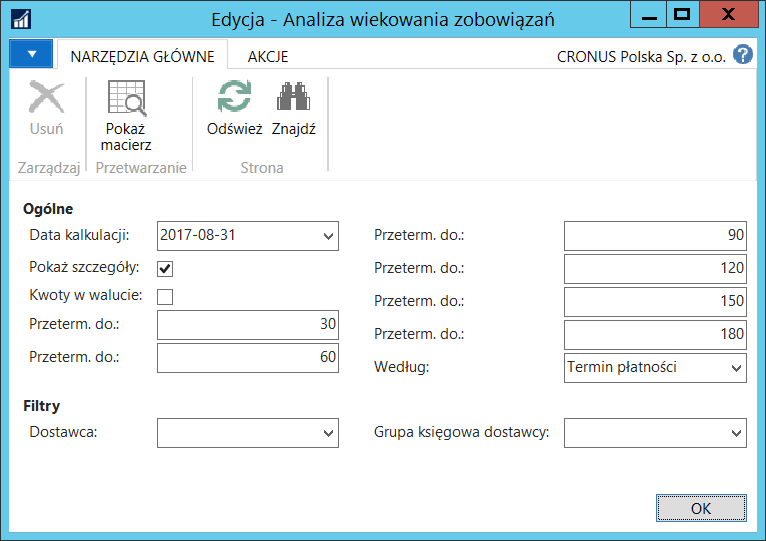{width="5.141732283464567in" height="3.62992125984252in"}
  -----------------------------------------------------------------------------------
  Rysunek 8.36: Opcje wstępne Analizy wiekowania zobowiązań

3.  Aby wyświetlić zestawienie, wybierz **Pokaż macierz**:

  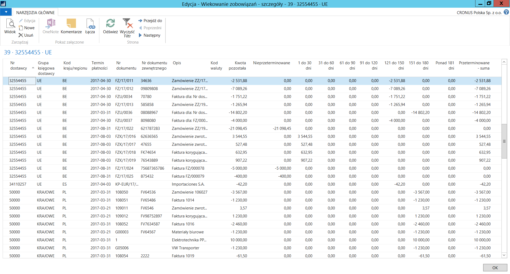{width="6.423611111111111in" height="3.452691382327209in"}
  ------------------------------------------------------------------------------------
  Rysunek 8.37: Zestawienie Analiza wiekowania zobowiązań

Nabywca/dostawca - saldo na dzień {#nabywcadostawca---saldo-na-dzień .Poziom-1}
---------------------------------

### Informacje ogólne

### Raporty Nabywca -- saldo na dzień oraz Dostawca -- saldo na dzień zapewniają uzyskanie dokładnych i pełnych informacji o saldach należności i zobowiązań. Raporty mogą być wykorzystane przy zamknięciu okresu obrachunkowego lub roku finansowego. W ramach Polskiej Lokalizacji systemu Microsoft Dynamics 365 Business Central on‑premises raporty zostały rozszerzone o obsługę zaliczek oraz zastępczych grup księgowych (wielu kont należności lub zobowiązań).

### Obsługa

W celu przygotowania i wydrukowania raportu **Nabywca -- saldo
na dzień**, należy postępować według następujących kroków:

1.  Należy wybrać **Działy \> Zarządzanie Finansami \> Należności \>
    Nabywca -- saldo na dzień**.

2.  W oknie wstępnym raportu, które się otworzy, na karcie skróconej
    **Opcje** należy odpowiednio wypełnić wymagane pola:

-   **Data końcowa** -- w tym polu należy wprowadzić datę, na jaką mają
    > zostać skalkulowane salda nabywców.

-   **Pokaż kwoty w PLN** -- to pole należy zaznaczyć, jeśli w raporcie
    > mają być wyświetlone kwoty w złotych polskich jako równowartość
    > należności zaksięgowanych pierwotnie w walucie obcej.

-   **Nowa strona dla nabywcy** -- zaznaczenie tego pola spowoduje,
    > że należności każdego nabywcy zostaną wydrukowane na oddzielnych
    > stronach raportu.

-   **Uwzgl. zapisy z cofn. rozl.** -- zaznaczenie tego pola spowoduje,
    > że na raporcie zostaną wykazane również te należności, które były
    > już rozliczone, ale ich rozliczenie zostało cofnięte.

-   **Drukuj zapisy księgi nabywców** -- zaznaczenie tego pola
    > spowoduje, że na raporcie zostaną wykazane zapisy, z
    > których składa się saldo należności. Niezaznaczenie tego pola
    > spowoduje, że dla każdego nabywcy zostanie wyświetlone saldo
    > należności w podziale na grupy księgowe (konta należności).

3.  Na karcie skróconej **Nabywca** można ustawić filtry w celu
    ograniczenia danych prezentowanych w raporcie, ale nie jest
    to obowiązkowe.

  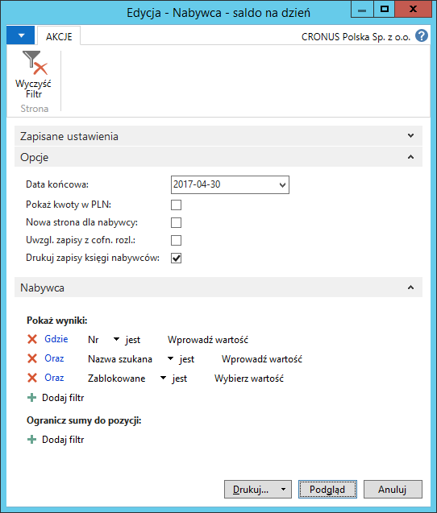{width="4.602362204724409in" height="5.409448818897638in"}
  ------------------------------------------------------------------------------------
  Rysunek 8.38: Opcje raportu nabywca -- saldo na dzień

4.  Po zaznaczeniu właściwych opcji i wprowadzeniu właściwego filtru
    okresu, należy wybrać **Drukuj** w celu wydrukowania raportu
    lub **Podgląd** w celu wyświetlenia raportu na ekranie:

  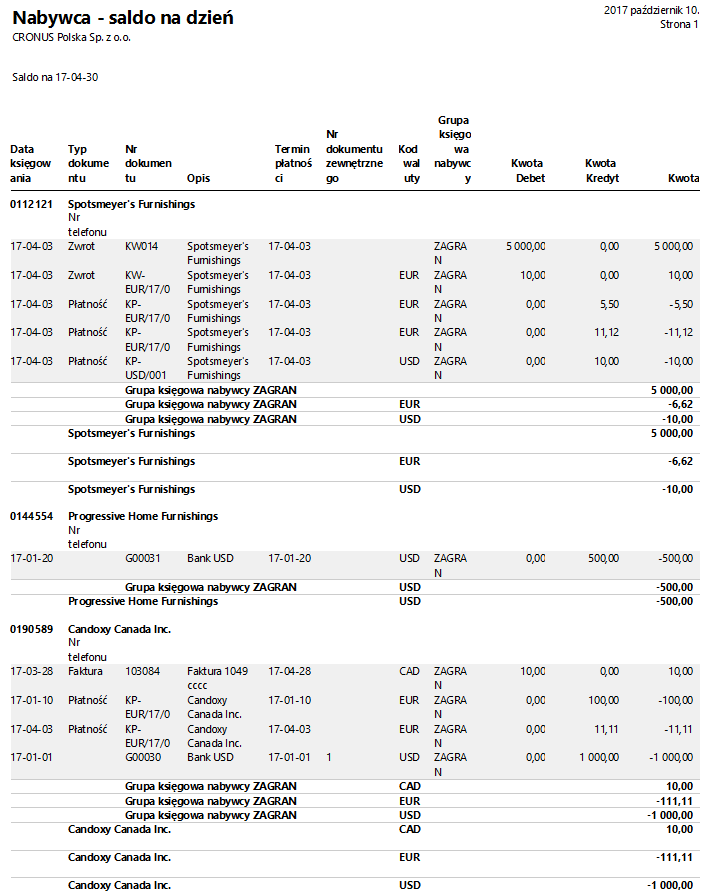{width="6.260869422572179in" height="7.80200678040245in"}
  -----------------------------------------------------------------------------------
  Rysunek 8.39: Podgląd raportu Nabywca -- saldo na dzień

> {width="0.1875in" height="0.1875in"}
> **Uwaga: W **raporcie **Nabywca -- saldo na dzień** zapisy każdego
> nabywcy są grupowane według (w następującej kolejności): kodu waluty,
> grupy księgowej oraz typu dokumentu.

W celu przygotowania i wydrukowania raportu **Dostawca -- saldo
na dzień**, należy postępować według następujących kroków:

1.  Należy wybrać **Działy \> Zarządzanie Finansami \> Zobowiązania \>
    Dostawca -- saldo na dzień**.

2.  W oknie wstępnym raportu, które się otworzy, na karcie skróconej
    **Opcje** należy odpowiednio wypełnić wymagane pola:

-   **Data końcowa** -- w tym polu należy wprowadzić datę, na jaką mają
    > zostać skalkulowane salda dostawców.

-   **Pokaż kwoty w PLN** -- to pole należy zaznaczyć, jeśli w raporcie
    > mają być wyświetlone kwoty w złotych polskich jako równowartość
    > zobowiązań zaksięgowanych pierwotnie w walucie obcej.

-   **Nowa strona dla dostawcy** -- zaznaczenie tego pola spowoduje,
    > że zobowiązania każdego dostawcy zostaną wydrukowane
    > na oddzielnych stronach raportu.

-   **Uwzgl. zapisy z cofn. rozl.** -- zaznaczenie tego pola spowoduje,
    > że na raporcie zostaną wykazane również te zobowiązania,
    > które były już rozliczone ale ich rozliczenie zostało cofnięte.

-   **Drukuj zapisy księgi dostawców** -- zaznaczenie tego pola
    > spowoduje, że na raporcie zostaną wykazane zapisy, z
    > których składa się saldo zobowiązań. Niezaznaczenie tego pola
    > spowoduje, że dla każdego dostawcy zostanie wyświetlone saldo
    > zobowiązań w podziale na grupy księgowe (konta zobowiązań).

3.  Na karcie skróconej **Dostawca** można ustawić filtry w celu
    > ograniczenia danych prezentowanych w raporcie, ale nie jest
    > to obowiązkowe.

  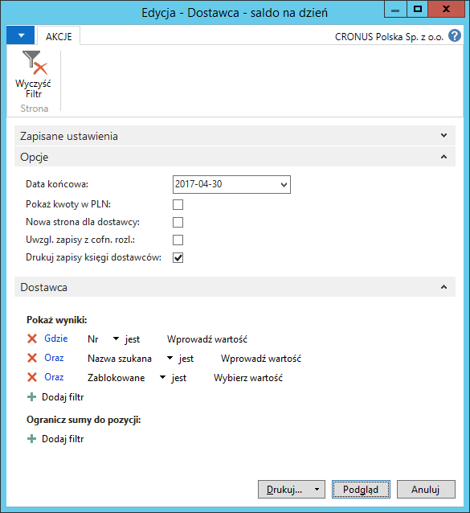{width="4.929133858267717in" height="5.374015748031496in"}
  ------------------------------------------------------------------------------------
  Rysunek 8.40: Opcje raportu Dostawca -- saldo na dzień

4.  Po zaznaczeniu właściwych opcji i wprowadzeniu właściwego filtru
    okresu, należy wybrać **Drukuj** w celu wydrukowania raportu
    lub **Podgląd** w celu wyświetlenia raportu na ekranie:

  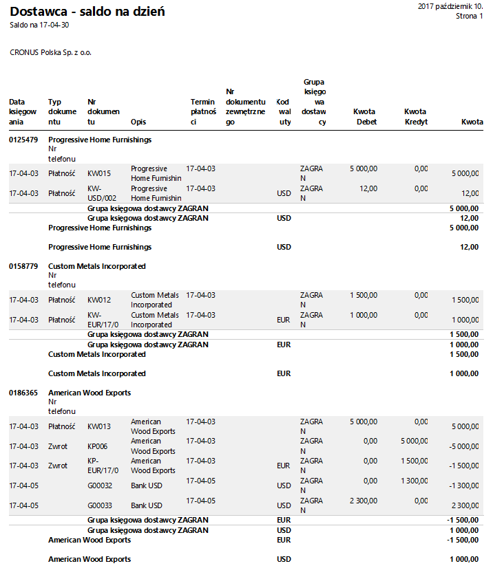{width="6.260869422572179in" height="7.222742782152231in"}
  ------------------------------------------------------------------------------------
  Rysunek 8.41: Podgląd raportu Dostawca -- saldo na dzień

> {width="0.1875in" height="0.1875in"}
> **Uwaga: W **raporcie **Dostawca -- saldo na dzień** zapisy każdego
> dostawcy są grupowane według (w następującej kolejności): kodu waluty,
> grupy księgowej oraz typu dokumentu.

Nabywca/dostawca - szczegółowy bilans próbny {#nabywcadostawca---szczegółowy-bilans-próbny .Poziom-1}
--------------------------------------------

### Informacje ogólne

### Raporty Nabywca -- szczegółowy bilans próbny i Dostawca -- szczegółowy bilans próbny prezentują szczegóły bilansu próbnego dla wybranych nabywców lub dostawców. Raport ten może być wykorzystany przy zamknięciu okresu obrachunkowego lub roku finansowego. W ramach Polskiej Lokalizacji systemu Microsoft Dynamics 365 Business Central on‑premises do raportów została dodana możliwość filtrowania zapisów księgi nabywców i dostawców według grup księgowych użytych w poszczególnych zapisach ksiąg należności i zobowiązań.

### Obsługa

W celu przygotowania i wydrukowania raportu **Nabywca -- szczegółowy
bilans próbny**, należy postępować według następujących kroków:

1.  Należy wybrać **Działy \> Zarządzanie Finansami \> Należności \>
    Nabywca -- szczegółowy bilans próbny**.

2.  W oknie wstępnym raportu, które się otworzy, należy wypełnić
    na karcie skróconej **Nabywca** pole **Filtr daty** wprowadzając
    w nim okres objęty raportem. W razie potrzeby można wypełnić inne
    pola w celu ograniczenia danych ujętych w raporcie.

> Na karcie skróconej **Opcje** należy zaznaczyć właściwe pola:

-   **Pokaż kwoty w PLN** -- to pole należy zaznaczyć, jeśli w raporcie
    > mają być wyświetlone kwoty w złotych polskich jako równowartość
    > należności zaksięgowanych pierwotnie w walucie obcej.

```{=html}
<!-- -->
```
-   **Nowa strona dla nabywcy** -- zaznaczenie tego pola spowoduje,
    > że należności każdego nabywcy zostaną wydrukowane na oddzielnych
    > stronach raportu.

```{=html}
<!-- -->
```
-   **Wyklucz nabywców z samym saldem** -- zaznaczenie tego pola
    > spowoduje, że w raporcie zostaną pominięci nabywcy, którzy mają
    > saldo, ale nie mają zapisów w okresie wybranym w polu **Filtr
    > daty**.

  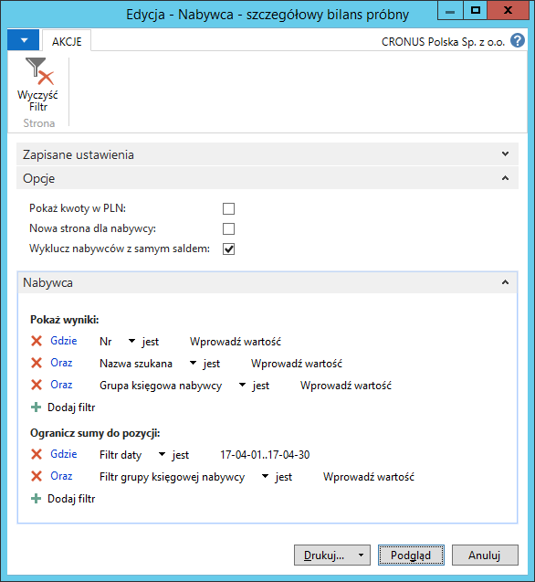{width="4.929133858267717in" height="5.358267716535433in"}
  ------------------------------------------------------------------------------------
  Rysunek 8.42: Opcje raportu Nabywca -- szczegółowy bilans próbny

3.  Po wprowadzeniu właściwych filtrów należy wybrać **Drukuj** w celu
    wydrukowania raportu lub **Podgląd** w celu wyświetlenia raportu
    na ekranie:

  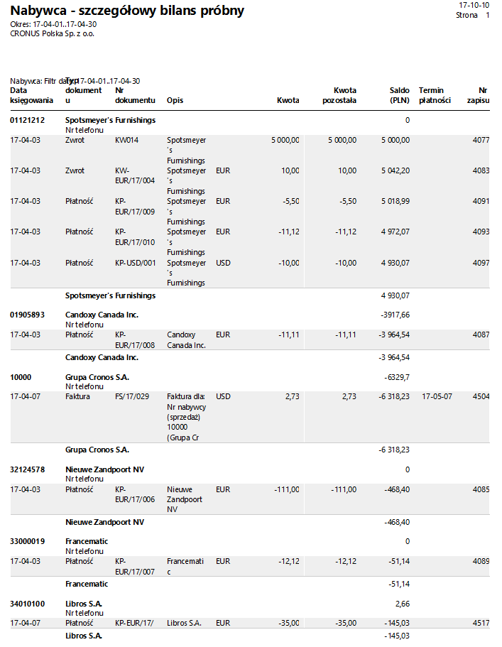{width="6.260869422572179in" height="8.067557961504813in"}
  ------------------------------------------------------------------------------------
  Rysunek 8.43: Podgląd raportu Nabywca -- szczegółowy bilans próbny

W celu przygotowania i wydrukowania raportu **Dostawca -- szczegółowy
bilans próbny**, należy postępować według następujących kroków:

1.  Należy wybrać **Działy \> Zarządzanie Finansami \> Zobowiązania \>
    Dost. -- szczeg. bilans próbny**.

2.  W oknie wstępnym raportu, które się otworzy, należy wypełnić
    na karcie skróconej **Dostawca** pole **Filtr daty** wprowadzając
    w nim okres objęty raportem. W razie potrzeby można wypełnić inne
    pola w celu ograniczenia danych ujętych w raporcie.

> Na karcie skróconej **Opcje** należy zaznaczyć właściwe pola:

-   **Pokaż kwoty w PLN** -- to pole należy zaznaczyć, jeśli w raporcie
    > mają być wyświetlone kwoty w złotych polskich jako równowartość
    > zobowiązań zaksięgowanych pierwotnie w walucie obcej.

```{=html}
<!-- -->
```
-   **Nowa strona dla dostawcy** -- zaznaczenie tego pola spowoduje,
    > że zobowiązania każdego dostawcy zostaną wydrukowane
    > na oddzielnych stronach raportu.

```{=html}
<!-- -->
```
-   **Wyklucz dostawców z samym saldem** -- zaznaczenie tego pola
    > spowoduje, że w raporcie zostaną pominięci dostawcy, którzy mają
    > saldo, ale nie mają zapisów w okresie wybranym w polu **Filtr
    > daty**.

  {width="4.9921259842519685in" height="5.2952755905511815in"}
  --------------------------------------------------------------------------------------
  Rysunek 8.44: Opcje raportu Dostawca -- szczegółowy bilans próbny

3.  Po wprowadzeniu właściwych filtrów należy wybrać **Drukuj** w celu
    wydrukowania raportu lub **Podgląd** w celu wyświetlenia raportu
    na ekranie:

  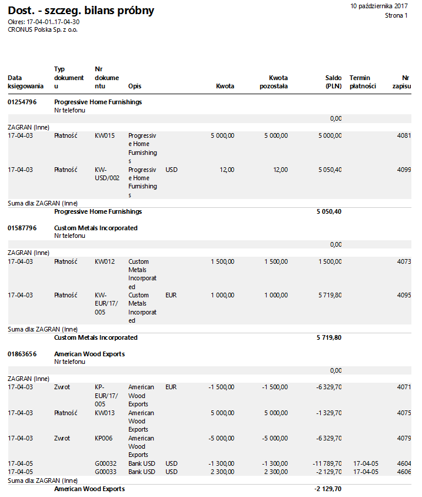{width="6.295651793525809in" height="7.410843175853018in"}
  ------------------------------------------------------------------------------------
  Rysunek 8.45: Podgląd raportu Dostawca -- szczegółowy bilans próbny

Raporty środków trwałych {#raporty-środków-trwałych .Poziom-1}
------------------------

### Informacje ogólne

### W ramach Polskiej Lokalizacji systemu Microsoft Dynamics 365 Business Central on‑premises zostały dodane 4 nowe raporty środków trwałych:

-   ### Kartoteka ŚT -- raport ten łączy dane standardowych raportów Lista ŚT i Szczegóły ŚT, grupując szczegóły według księgi amortyzacji środka trwałego. 

-   ### Przyjęcie ŚT -- raport ten jest drukowany, gdy dany środek trwały został przyjęty w celu przekazania do używania.

-   ### Sprzedaż/likwidacja ŚT -- raport ten jest drukowany, gdy dany środek trwały został wykreślony z ewidencji w wyniku sprzedaży lub likwidacji.

-   ### Lista inwentaryzacji ŚT -- raport ten jest drukowany, gdy dokonywane jest uzgodnienie rzeczywistego stanu środków trwałych z ich ewidencją i wartością w systemie w celu przygotowania sprawozdań finansowych.

### Obsługa

W celu przygotowania i wydrukowania raportu **Kartoteka ŚT**, należy
postępować według następujących kroków:

1.  Należy wybrać **Działy \> Zarządzanie Finansami \> Środki trwałe \>
    Kartoteka ŚT**.

2.  W oknie wstępnym raportu, które się otworzy, na karcie skróconej
    **Środek trwały** można wypełnić pola, filtrując w ten sposób dane
    do wydruku na raporcie.

> Na karcie skróconej **Księga amortyzacji ŚT** należy wypełnić pola
> filtrów:

-   **Kod księgi amortyzacji** -- w tym polu należy wybrać księgę
    > amortyzacji, której zapisy zostaną wydrukowane.

```{=html}
<!-- -->
```
-   **Filtr daty księgowania ŚT** -- w tym polu należy wprowadzić okres
    > objęty raportem.

> W razie potrzeby, na obydwu skróconych kartach można wypełnić inne
> pola filtrów w celu ograniczenia danych objętych raportem.

  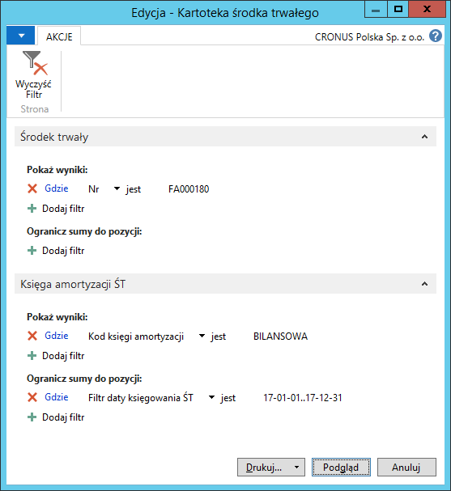{width="4.677165354330708in" height="5.094488188976378in"}
  ------------------------------------------------------------------------------------
  Rysunek 8.46: Opcje raportu Kartoteka środka trwałego

3.  Po wprowadzeniu właściwych filtrów należy wybrać **Drukuj** w celu
    wydrukowania raportu lub **Podgląd** w celu wyświetlenia raportu
    na ekranie:

  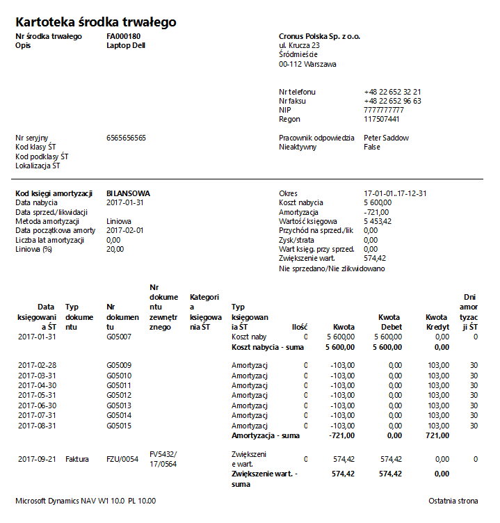{width="6.295651793525809in" height="6.58487532808399in"}
  -----------------------------------------------------------------------------------
  Rysunek 8.47: Podgląd raportu Kartoteka środka trwałego

W celu przygotowania i wydrukowania raportu **Przyjęcie ŚT**, należy
postępować według następujących kroków:

1.  Należy wybrać **Działy \> Zarządzanie Finansami \> Środki trwałe \>
    Przyjęcie ŚT**.

2.  W oknie wstępnym raportu, które się otworzy, na karcie skróconej
    **Środek trwały** można wypełnić pola, filtrując w ten sposób dane
    do wydruku na raporcie.

> Na karcie skróconej **Opcje** należy wypełnić pola:

-   **Księga amortyzacji** -- w tym polu należy wybrać księgę
    > amortyzacji, której zapisy zostaną wydrukowane.

```{=html}
<!-- -->
```
-   **Nr przyjęcia ŚT** -- pole jest edytowalne, gdy pole **Drukuj daty
    > zapisów księgi ŚT** jest zaznaczone. W polu należy wprowadzić
    > numer kolejny dokumentu przyjęcia środka trwałego.

-   **Data przyjęcia ŚT** -- pole jest edytowalne, gdy pole **Drukuj
    > daty zapisów księgi ŚT** jest zaznaczone. W polu należy wprowadzić
    > datę przyjęcia środka trwałego.

-   **Data rozpoczęcia użytkowania ŚT** -- pole jest edytowalne,
    > gdy pole **Drukuj daty zapisów księgi ŚT** jest zaznaczone. W polu
    > należy wprowadzić datę rozpoczęcia użytkowania środka trwałego.

-   **Drukuj daty zapisów księgi ŚT** -- zaznaczenie tego pola powoduje,
    > że wcześniej wymienione pola są nieedytowalne, a informacje
    > o numerze przyjęcia, dacie przyjęcia i dacie rozpoczęcia
    > użytkowania środka trwałego pobrane są z zapisów księgi środka
    > trwałego.

-   **1 Osoba** -- w tym polu należy wprowadzić imię i nazwisko
    > pierwszego przedstawiciela firmy odpowiedzialnego za przyjęcie
    > środka trwałego, który swoim podpisem potwierdzi prawdziwość
    > danych na wydrukowanym dokumencie.

-   **2 Osoba** -- w tym polu należy wprowadzić imię i nazwisko drugiego
    > przedstawiciela firmy odpowiedzialnego za przyjęcie środka
    > trwałego, który swoim podpisem potwierdzi prawdziwość danych
    > na wydrukowanym dokumencie.

  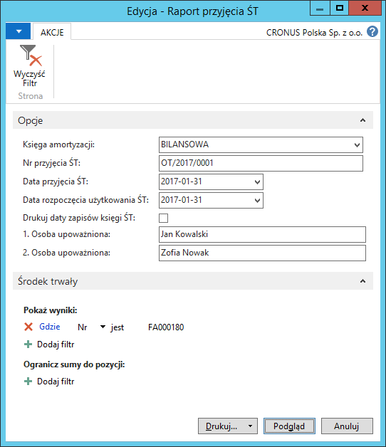{width="4.5984251968503935in" height="5.330708661417323in"}
  -------------------------------------------------------------------------------------
  Rysunek 8.48: Opcje raportu Przyjęcie ŚT

3.  Po wprowadzeniu właściwych filtrów należy wybrać **Drukuj** w celu
    wydrukowania raportu lub **Podgląd** w celu wyświetlenia raportu
    na ekranie:

  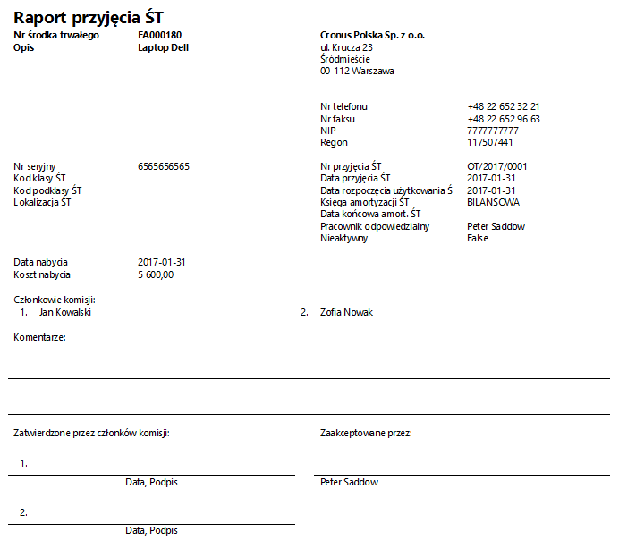{width="6.2347823709536305in" height="5.61330271216098in"}
  ------------------------------------------------------------------------------------
  Rysunek 8.49: Podgląd raportu Przyjęcie ŚT

W celu przygotowania i wydrukowania raportu **Sprzedaż/likwidacja ŚT**,
należy postępować według następujących kroków:

1.  Należy wybrać **Działy \> Zarządzanie Finansami \> Środki trwałe \>
    Sprzedaż/likwidacja ŚT**.

2.  W oknie wstępnym raportu, które się otworzy, na karcie skróconej
    **Środek trwały** można wypełnić pola, filtrując w ten sposób dane
    do wydruku na raporcie.

> Na karcie skróconej **Opcje** należy wypełnić pola:

-   **Księga amortyzacji** -- w tym polu należy wybrać księgę
    > amortyzacji, której zapisy zostaną wydrukowane.

```{=html}
<!-- -->
```
-   **Nr raportu sprz./lik. ŚT** -- w tym polu należy wprowadzić numer
    > kolejny dokumentu sprzedaży lub likwidacji środka trwałego.

-   **Drukuj datę raportu sprzed./likw. ŚT** -- zaznaczenie tego pola
    > powoduje, że na raporcie zostanie wydrukowana data wprowadzona
    > w polu **Data raportu sprz./lik. ŚT.**

-   **Data raportu sprz./lik. ŚT** -- pole jest edytowalne,
    > gdy zaznaczone jest pole **Drukuj datę raportu sprzed./likw. ŚT**.
    > W polu należy wprowadzić datę sprzedaży lub likwidacji środka
    > trwałego.

-   **1 Osoba** -- w tym polu należy wprowadzić imię i nazwisko
    > pierwszego przedstawiciela firmy odpowiedzialnego za sprzedaż
    > lub likwidację środka trwałego, który swoim podpisem potwierdzi
    > prawdziwość danych na wydrukowanym dokumencie.

-   **2 Osoba** -- w tym polu należy wprowadzić imię i nazwisko drugiego
    > przedstawiciela firmy odpowiedzialnego za sprzedaż lub likwidację
    > środka trwałego, który swoim podpisem potwierdzi prawdziwość
    > danych na wydrukowanym dokumencie.

  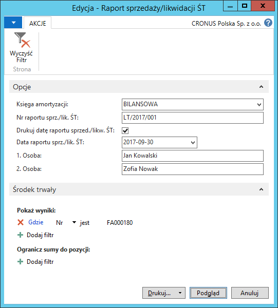{width="4.566929133858268in" height="5.066929133858268in"}
  ------------------------------------------------------------------------------------
  Rysunek 8.50: Opcje raportu Sprzedaż/likwidacja ŚT

3.  Po wprowadzeniu właściwych filtrów należy wybrać **Drukuj** w celu
    wydrukowania raportu lub **Podgląd** w celu wyświetlenia raportu
    na ekranie:

  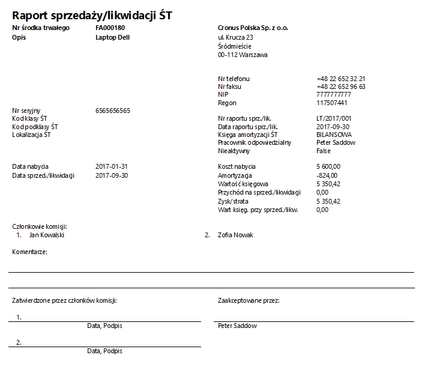{width="6.313043525809274in" height="5.4868175853018375in"}
  -------------------------------------------------------------------------------------
  Rysunek 8.51: Podgląd raportu Sprzedaż/likwidacja ŚT

W celu przygotowania i wydrukowania raportu **Lista inwentaryzacji ŚT**,
należy postępować według następujących kroków:

1.  Należy wybrać **Działy \> Zarządzanie Finansami \> Środki trwałe \>
    Lista inwentaryzacji ŚT**.

2.  W oknie wstępnym raportu, które się otworzy, na karcie skróconej
    **Środek trwały** można wypełnić pola, filtrując w ten sposób dane
    do wydruku na raporcie.

> Na karcie skróconej **Opcje** należy wypełnić pola:

-   **Księga amortyzacji** -- w tym polu należy wybrać księgę
    > amortyzacji, której zapisy zostaną wydrukowane.

```{=html}
<!-- -->
```
-   **Nr dokumentu** -- w polu należy wprowadzić numer kolejny dokumentu
    > inwentaryzacji środków trwałych.

-   **Data dokumentu** -- w polu należy wprowadzić datę inwentaryzacji
    > środków trwałych.

-   **Drukuj wartości ŚT** -- pole należy zaznaczyć, jeśli na wydruku
    > mają zostać wykazane zaksięgowane kwoty dla środków trwałych:
    > koszt nabycia, amortyzacja i wartość księgowa.

-   **Drukuj ŚT z zerową wartością księgową** -- pole należy zaznaczyć,
    > jeśli na wydruku mają zostać wykazane również te środki trwałe,
    > których wartość księgowa jest równa 0.

-   **Pokaż zlikwidowane ŚT** -- pole należy zaznaczyć, jeśli na wydruku
    > mają zostać wykazane również te środki trwałe, które zostały
    > sprzedane lub zlikwidowane.

-   **Grupuj według **-- w tym polu można wybrać jedną z dostępnych
    > opcji, określając w jaki sposób środki trwałe zostaną pogrupowane
    > na wydruku:

```{=html}
<!-- -->
```
-   **Brak**

-   **Tylko kod lokalizacji ŚT**

-   **Tylko pracownik odpowiedzialny**

-   **Kod lokalizacji ŚT i Pracownik odpowiedzialny**

-   **Pracownik odpowiedzialny i Kod lokalizacji ŚT**

```{=html}
<!-- -->
```
-   **Nowa strona dla grupy** -- pole można zaznaczyć, aby każda grupa
    > środków trwałych, utworzona na podstawie wybranej opcji w polu
    > **Grupuj według**, została wydrukowana na odrębnej stronie.

-   **1 Osoba** -- w tym polu należy wprowadzić imię i nazwisko
    > pierwszego przedstawiciela firmy odpowiedzialnego
    > za przeprowadzenie inwentaryzacji środków trwałych, który swoim
    > podpisem potwierdzi prawdziwość danych na wydrukowanym dokumencie.

-   **2 Osoba** -- w tym polu należy wprowadzić imię i nazwisko drugiego
    > przedstawiciela firmy odpowiedzialnego za przeprowadzenie
    > inwentaryzacji środków trwałych, który swoim podpisem potwierdzi
    > prawdziwość danych na wydrukowanym dokumencie.

-   **3 Osoba** -- w tym polu należy wprowadzić imię i nazwisko
    > trzeciego przedstawiciela firmy odpowiedzialnego
    > za przeprowadzenie inwentaryzacji środków trwałych, który swoim
    > podpisem potwierdzi prawdziwość danych na wydrukowanym dokumencie.

  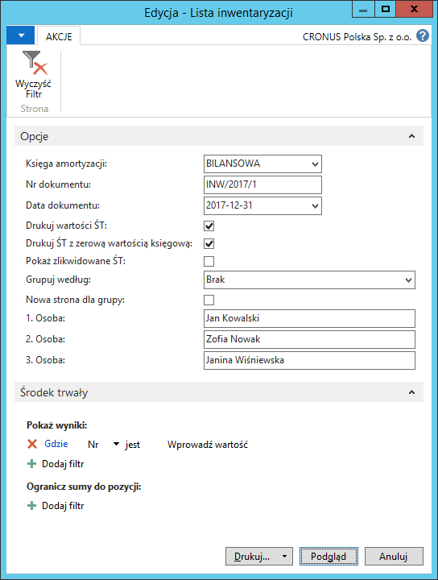{width="4.570866141732283in" height="6.047244094488189in"}
  ------------------------------------------------------------------------------------
  Rysunek 8.52: Opcje raportu Lista inwentaryzacji ŚT

3.  Po wprowadzeniu właściwych filtrów należy wybrać **Drukuj** w celu
    wydrukowania raportu lub **Podgląd** w celu wyświetlenia raportu
    na ekranie:

  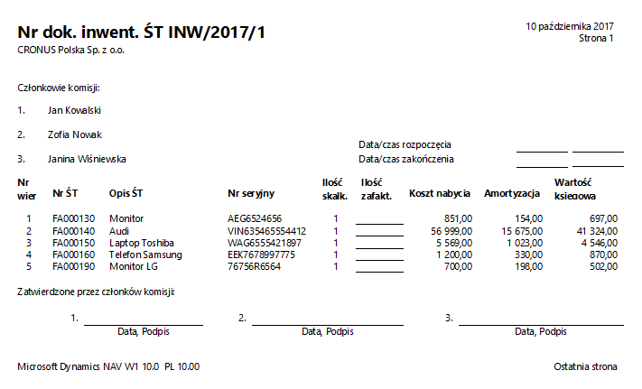{width="6.295651793525809in" height="3.8157294400699913in"}
  -------------------------------------------------------------------------------------
  Rysunek 8.53: Podgląd raportu Lista inwentaryzacji ŚT

Wiekowanie zapasów {#wiekowanie-zapasów .Poziom-1}
------------------

### Informacje ogólne

### W ramach Polskiej Lokalizacji systemu Microsoft Dynamics 365 Business Central on‑premises dostępny jest raport Wiekowanie zapasów. Prezentuje on stan ilościowy i wartościowy zapasów w czterech dowolnie wybranych okresach, do wyboru. 

### Obsługa

W celu przygotowania i wydrukowania raportu **Wiekowanie zapasów**,
należy postępować według następujących kroków:

1.  Należy wybrać **Działy \> Zarządzanie Finansami \> Zapasy \>
    Wiekowanie zapasów PL**.

2.  W oknie wstępnym raportu, które się otworzy, na karcie skróconej
    **Zapas** można ustawić filtry w celu ograniczenia danych
    prezentowanych w raporcie, ale nie jest to obowiązkowe.

> Na karcie skróconej **Opcje** należy odpowiednio wypełnić
> lub zaznaczyć wymagane pola:

-   **Data końcowa** -- w tym polu należy wprowadzić datę, w stosunku
    > do której będą liczone okresy magazynowania zapasów.

-   **Pokaż szczegóły** -- zaznaczenie tego pola spowoduje,
    > że w raporcie dla każdego zapasu zostaną wyświetlone poszczególne
    > zapisy składające się na jego stan.

-   **Przeterm. do **-- w polu tym należy wpisać maksymalną ilość dni
    > magazynowania zapasów; istnieją 4 pola o nazwie **Przeterm. do**,
    > w których należy wpisać 4 kolejne okresy magazynowania, wszystkie
    > pola muszą być uzupełnione.

  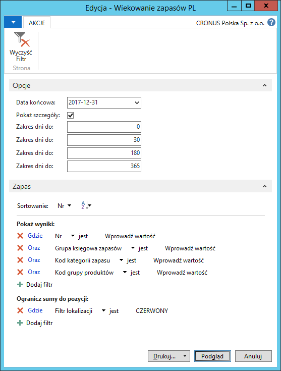{width="4.68503937007874in" height="6.181102362204724in"}
  -----------------------------------------------------------------------------------
  Rysunek 8.54: Opcje raportu Wiekowanie zapasów

3.  Po wprowadzeniu właściwych parametrów, należy wybrać **Drukuj**
    w celu wydrukowania raportu lub **Podgląd** w celu wyświetlenia
    raportu na ekranie:

  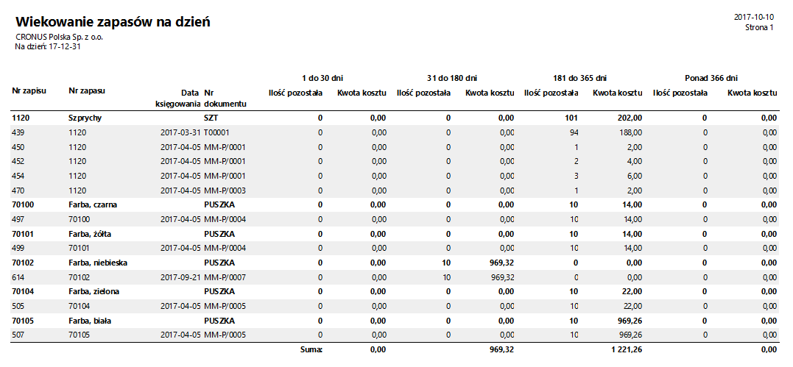{width="6.313043525809274in" height="2.925178258967629in"}
  ------------------------------------------------------------------------------------
  Rysunek 8.55: Podgląd raportu Wiekowanie należności

Jednolity Plik Kontrolny {#jednolity-plik-kontrolny .Rozdzial}
========================

1.  

```{=html}
<!-- -->
```
9.  

```{=html}
<!-- -->
```
8.  

9.  

10. 

11. 

12. 

13. 

14. 

15. 

JPK Ustawienia {#jpk-ustawienia .Poziom-1}
--------------

### Informacje ogólne

Polska Lokalizacja umożliwia generowanie plików JPK (Jednolity Plik
Kontrolny) dla obszarów JPK\_VAT, JPK\_FA, JPK\_WB, JPK\_KR, JPK\_MAG z
systemu Microsoft Dynamics 365 Business Central on‑premises.

Od 1 lipca 2018 r. wszyscy podatnicy, którzy prowadzą księgi podatkowe
i wytwarzają dowody księgowe w formie elektronicznej, zobowiązani są
przekazać struktury JPK na żądanie organów podatkowych w trakcie
postępowania podatkowego, czynności sprawdzających, kontroli podatkowej
i kontroli celno-skarbowej. Plik JPK\_VAT podatnicy zobowiązani są
przekazywać do organów podatkowych za każdy miesiąc rozliczeniowy.

Struktury plików zostały przygotowane na podstawie opublikowanych przez
Ministerstwo Finansów broszur informacyjnych oraz odpowiedzi helpdesku
Ministerstwa Finansów dla JPK na zadane pytania.

Struktura pliku JPK\_VAT(3) obowiązuje od 1 stycznia 2018 roku i jest
dostosowana do deklaracji VAT-7 (17), VAT-7(18) i VAT-7(19).

Struktury plików: JPK\_KR (Księgi rachunkowe), JPK\_MAG (magazyn) i
JPK\_WB (wyciąg bankowy) obowiązują od 1 lipca 2018r.

Struktura pliku JPK\_ FA(3) obowiązuje od 1 listopada 2019 r.

Do prawidłowego wygenerowania plików w strukturze JPK wymagane jest
zdefiniowanie odpowiednich ustawień.

#### Ustawienia raportowania ustawowego {#ustawienia-raportowania-ustawowego .Poziom-2}

### Obsługa

W celu zdefiniowania danych dotyczących firmy, niezbędnych do
generowania plików JPK należy wykonać następujące kroki:

1.  Należy wybrać **Działy \> Zarządzanie Finansami \> Administracja \>
    Ustawienia raportowania ustawowego**.

2.  W oknie **Ustawienia raportowania ustawowego**, które się otworzy,
    na karcie skróconej **Ogólne** należy uzupełnić pola zgodnie
    z poniższym opisem:

> {width="0.16666666666666666in"
> height="0.16666666666666666in"} **Uwaga:** Dane adresowe na karcie
> skróconej **Ogólne** muszą być wypełnione dla podmiotu składającego
> pliki JPK, który ma siedzibę w kraju.

-   **Nazwa firmy** -- w tym polu należy wpisać nazwę firmy będącej
    > podatnikiem,

-   **Miasto firmy** - w tym polu należy wprowadzić nazwę miasta, w
    > którym znajduje się siedziba firmy,

-   **Gmina firmy** -- w tym polu należy wprowadzić nazwę gminy, w
    > której znajduje się siedziba firmy,

-   **Województwo firmy** -- w tym polu należy wprowadzić nazwę
    > województwa, w którym znajduje się siedziba firmy,

-   **Kod pocztowy firmy** -- w tym polu należy wprowadzić kod pocztowy
    > właściwy dla siedziby firmy,

-   **Urząd pocztowy firmy** -- w tym polu należy wprowadzić nazwę
    > urzędu pocztowego właściwego dla siedziby firmy,

-   **Powiat firmy** -- w tym polu należy wprowadzić nazwę powiatu, w
    > którym znajduje się siedziba firmy,

-   **Adres e-mail firmy** -- w tym polu należy wprowadzić adres e-mail
    > firmy,

-   **Kod kraju/regionu firmy** -- w tym polu należy wybrać kod
    > kraju/regionu właściwego dla siedziby firmy,

-   **Ulica firmy** -- w** **tym polu należy wprowadzić nazwę ulicy
    > właściwej dla siedziby firmy,

-   **Nr domu firmy** -- w tym polu należy wprowadzić numer domu
    > właściwy dla siedziby firmy,

-   **Nr lokalu firmy** -- w tym polu należy wprowadzić numer lokalu
    > właściwy dla siedziby firmy,

-   **Nr urzędu miasta** -- w tym polu należy wprowadzić unikalny kod
    > urzędu miasta właściwego dla siedziby firmy,

-   **NIP** -- to pole jest wypełniane automatycznie na podstawie danych
    > z pola NIP na stronie **Dane firmy**,

-   **REGON** -- to pole jest wypełniane automatycznie na podstawie
    > danych z pola REGON na stronie **Dane firmy**,

> {width="0.16666666666666666in"
> height="0.16666666666666666in"} **Uwaga:** Dla pliku JPK\_FA(3) nie
> jest eksportowany REGON

-   **Nr urzędu skarbowego** -- w tym polu należy wprowadzić unikalny
    > czterocyfrowy kod urzędu skarbowego podatnika.

Zagraniczny adres podmiotu składającego pliki JPK ma inną strukturę, niż
polski, dlatego konieczna jest właściwa jego prezentacja w pliku JPK. Do
wprowadzenia adresu zagranicznego służą pola karty skróconej **Adres
zagraniczny**:

-   **Kod kraju -- w tym polu należy wybrać kod kraju/regionu właściwego
    > dla siedziby firmy,**

-   **Kod pocztowy -- w tym polu należy wprowadzić kod pocztowy właściwy
    > dla siedziby firmy,**

-   **Miasto -- w tym polu należy wprowadzić nazwę miasta, w którym
    > znajduje się siedziba firmy,**

-   **Ulica -- w tym polu należy wprowadzić nazwę ulicy właściwej dla
    > siedziby firmy,**

-   **Nr domu -- w tym polu należy wprowadzić numer domu właściwy
    > dla siedziby firmy,**

-   **Nr lokalu -- w tym polu należy wprowadzić numer lokalu właściwy
    > dla siedziby firmy.**

>  **Uwaga:** W oknie **Ustawienia JPK** należy
> zaznaczyć pole **Użyj zagranicznego adresu dla JPK**, aby adres
> zagraniczny był przekazywany do pliku JPK\_FA.

  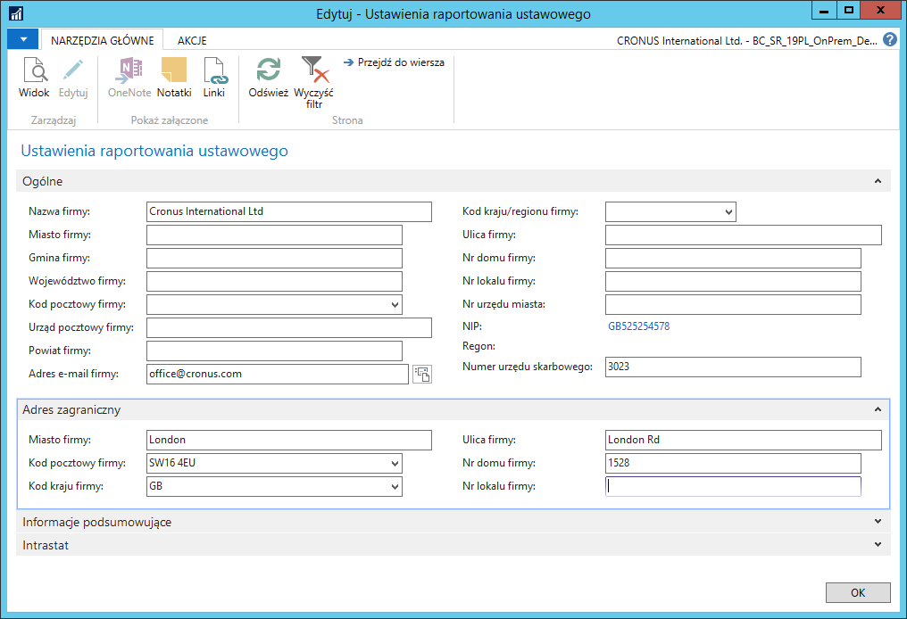{width="6.396227034120735in" height="4.369388670166229in"}
  ------------------------------------------------------------------------------------
  Rysunek 9.1: USTAWIENIA USTAWOWEGO RAPORTOWANIA

#### Ustawienia ogólne JPK {#ustawienia-ogólne-jpk .Poziom-2}

### Obsługa

W celu zdefiniowania ogólnych ustawień JPK, należy wykonać następujące
kroki:

1.  Należy wybrać **Działy \> Zarządzanie Finansami \> Administracja \>
    Ustawienia JPK \> Ustawienia JPK.**

2.  W oknie **Ustawienia JPK**, które się otworzy, należy uzupełnić pola
    zgodnie z poniższym opisem:

-   **Format nazwy pliku** -- w tym polu należy wybrać opcję generowania
    > nazwy pliku podpowiadanej podczas zapisywania pliku, opcje
    > dostępne w tym polu:

```{=html}
<!-- -->
```
-   **Obszar** -- w nazwie pliku zawarta jest tylko informacja o typie
    > pliku, np. JPK\_KR\_V10.xml,

-   **Obszar + NIP + Data-godzina eksportu** -- w nazwie pliku zawarta
    > jest informacja o typie pliku, NIP podatnika oraz czasie
    > utworzenia pliku, np. JPK\_KR\_V10\_\_7777777777\_070616 1706.xml,

-   **Obszar + NIP + Data od + Data do **-- w nazwie pliku zawarta jest
    > informacja o typie pliku, NIP podatnika oraz okresie, z którego
    > pochodzą dane w pliku,
    > np. JPK\_KR\_V10\_\_7777777777\_010116\_310116.xml,

-   **Obszar + NIP + Data od + Data do + Data-godzina eksportu** -
    > w nazwie pliku zawarta jest informacja o typie pliku, NIP
    > podatnika, okresie, z którego pochodzą dane w pliku oraz czasie
    > utworzenia pliku, np.
    > JPK\_KR\_V10\_\_7777777777\_010116\_310116\_070616 1706.xml.

> {width="0.16666666666666666in"
> height="0.16666666666666666in"} **Uwaga:** W nazwie pliku typu JPK\_FA
> zostanie dodatkowo dodany **Kod waluty**, jeśli dane w pliku
> są w innej walucie niż PLN. W nazwie pliku typu JPK\_MAG zostanie
> dodatkowo dodany **Kod lokalizacji** (oznaczenie magazynu, z którym
> powiązane są dane w pliku).

  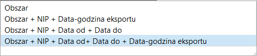{width="4.217031933508311in" height="0.9250798337707786in"}
  -------------------------------------------------------------------------------------
  Rysunek 9.2: Formaty nazwy plików JPK

-   **Zapisz w bazie danych** -- pole należy zaznaczyć, jeśli w systemie
    > mają być przechowywane informacje o każdorazowym generowaniu
    > plików JPK,

-   **Użyj zagranicznego adresu dla JPK** -- zaznaczenie tego pola
    > spowoduje przesłanie do pliku JPK\_FA danych adresu zagranicznego,
    > wprowadzonych w oknie **Ustawienia raportowania ustawowego**,

-   **Filtr kont pozabilansowych K/G** -- w tym polu należy wprowadzić
    > zakres numeracji kont, które traktowane są jako pozabilansowe
    > (techniczne), w postaci filtra np. 90000\|90005..90008 lub 9\*,

-   **Kod wymiaru centrum kosztów** -- w** **tym polu należy wybrać kod
    > wymiaru, według którego klasyfikowane są koszty z dokumentu RW,

-   **Filtr kodu serii num. dla faktur „samofakturowania"** -- w tym
    > polu należy wprowadzić jeden lub więcej kodów serii numeracji
    > faktur sprzedaży księgowanych w ramach samofakturowania,

-   **Filtr kodu serii num. dla fak. koryg. „samofakturowania"** -- w
    > tym polu należy wprowadzić jeden lub więcej kodów serii numeracji
    > faktur korygujących sprzedaży księgowanych w ramach
    > samofakturowania,

-   **Grupa księgowa nabywcy -- detal** -- w tym polu należy wprowadzić
    > kod grupy księgowej nabywców identyfikującej sprzedaż paragonową
    > pomijaną w pliku JPK\_FA,

-   **Filtr kodu serii num. dla faktur -- detal** -- w tym polu należy
    > wprowadzić jeden lub więcej kodów serii numeracji dokumentów
    > używanych do księgowania sprzedaży paragonowej pomijanej w pliku
    > JPK\_FA,

-   **Filtr kodu serii num. dla fak. koryg. -- detal** -- w tym polu
    > należy wprowadzić jeden lub więcej kodów serii numeracji
    > dokumentów używanych do księgowania korekt sprzedaży paragonowej
    > pomijanej w pliku JPK\_FA.

  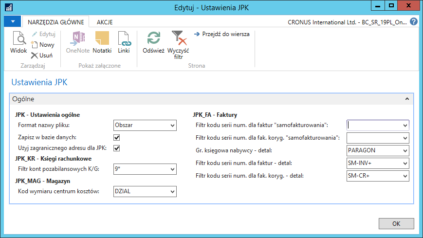{width="6.396227034120735in" height="3.5992443132108485in"}
  -------------------------------------------------------------------------------------
  Rysunek 9.3: Ustawienia JPK

#### Obszary JPK {#obszary-jpk .Poziom-2}

#### Wersje obszarów JPK {#wersje-obszarów-jpk .Poziom-2}

### Informacje ogólne

> Z uwagi na to, że struktura plików JPK wymagana przez Ministerstwo
> Finansów może ulegać zmianie, dostępna jest funkcjonalność pozwalająca
> na wybór wersji pliku, jaka ma zostać wygenerowana.

### Obsługa

> W celu wyboru bieżącej wersji pliku, która ma być eksportowana
> dla danego obszaru, należy wykonać następujące kroki:

1.  Należy wybrać **Działy \> Zarządzanie Finansami \> Administracja \>
    > Ustawienia JPK \> Obszary JPK**.

2.  W oknie **Obszary JPK**, które się otworzy, wyświetlona jest lista
    > obszarów, dla których można wygenerować plik JPK. Należy zaznaczyć
    > wiersz z wybranym obszarem, a następnie na wstążce należy kliknąć
    > **Wersje**.

3.  W oknie **Wersje obszaru JPK**, które się otworzy, wyświetlona
    > zostanie lista dostępnych wersji wybranego obszaru JPK. W celu
    > określenia wersji, która ma być używana podczas eksportu pliku,
    > należy kliknąć **Edytuj listę** na wstążce, a następnie w
    > odpowiednim wierszu zaznaczyć pole **Bieżąca wersja**.

  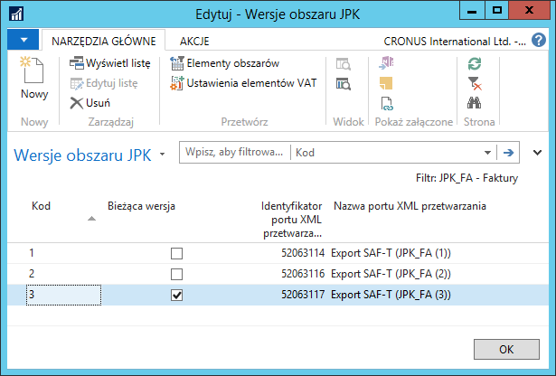{width="5.660377296587926in" height="3.82880905511811in"}
  -----------------------------------------------------------------------------------
  Rysunek 9.4: WERSJE OBSZARu JPK

#### Elementy obszarów JPK {#elementy-obszarów-jpk .Poziom-2}

### Informacje ogólne

> Każdy z obszarów JPK zawiera dodatkowe, dedykowane opcje, które będą
> musiały być wypełniane podczas eksportu pliku dla danego obszaru.

### Obsługa

> W celu zmiany elementów obszaru JPK, definiowanych przy eksporcie
> pliku, należy wykonać następujące kroki:

1.  Należy wybrać **Działy \> Zarządzanie Finansami \> Administracja \>
    Ustawienia JPK \> Obszary JPK**.

2.  W oknie **Obszary JPK**, które się otworzy, wyświetlona jest lista
    dostępnych obszarów, dla których można wygenerować plik JPK. W celu
    określenia elementów, których wypełnienie będzie wymagane podczas
    eksportu pliku, należy zaznaczyć wiersz z wybranym obszarem, a
    następnie na wstążce kliknąć **Elementy obszarów**.

3.  W oknie **Elementy obszaru JPK**, które się otworzy, wyświetlona
    > jest lista elementów zdefiniowanych dla bieżącej wersji wybranego
    > obszaru. Jeśli to konieczne, należy wprowadzić wymagane zmiany.

  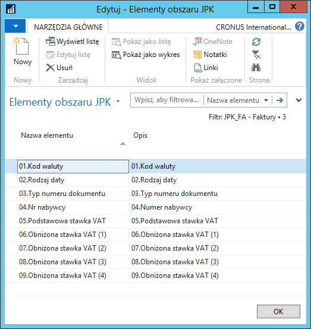{width="4.319443350831146in" height="4.575471347331583in"}
  ------------------------------------------------------------------------------------
  Rysunek 9.5: ELEMENTY OBSZARu JPK

#### Ustawienia elementów obszaru JPK\_VAT {#ustawienia-elementów-obszaru-jpk_vat .Poziom-2}

### Informacje ogólne

Przygotowana struktura pliku dokładnie odwzorowuje aktualną deklarację
podatku VAT‑7 (19). Według interpretacji Ministerstwa Finansów, dane
w pliku JPK\_VAT muszą być w pełni zgodne ze składaną przez podatnika
deklaracją VAT-7. Ze względu na strukturę pliku JPK\_VAT niezbędne jest
zdefiniowanie dodatkowych ustawień.

Przesyłane dane w pliku JPK\_VAT dotyczą:

-   Sprzedaży oraz nabyć towarów i usług, dla których podmiot
    ma obowiązek naliczyć VAT należny - tj. wewnątrzwspólnotowe nabycia
    towarów, import towarów podlegających rozliczeniu zgodnie z art.
    33 a ustawy, import usług z wyłączeniem usług nabywanych
    od podatników podatku od wartości dodanej, do których stosuje się
    art. 28 b ustawy, import usług nabywanych od podatników podatku
    od wartości dodanej, do których stosuje się art. 28 b ustawy,
    dostawy towarów, dla których podatnikiem jest nabywca zgodnie z art.
    17 ust. 1 pkt 5 ustawy (wypełnia nabywca), dostawy towarów,
    dla których podatnikiem jest nabywca zgodnie z art. 17 ust. 1 pkt 7
    lub 8 ustawy (wypełnia nabywca).

-   Zakupów VAT.

### Obsługa

W celu zdefiniowania dodatkowych ustawień wymaganych dla obszaru
JPK\_VAT, należy wykonać następujące kroki:

1.  Należy wybrać **Działy \> Zarządzanie Finansami \> Administracja \>
    Ustawienia JPK \> Obszary JPK**.

2.  W oknie **Obszary JPK**, które się otworzy, wyświetlona jest lista
    dostępnych obszarów, dla których można wygenerować plik JPK. W celu
    określenia dodatkowych ustawień, należy zaznaczyć wiersz z obszarem
    JPK\_VAT, a następnie na wstążce kliknąć **Ustawienia elementów wg
    grup księgowych VAT**.

3.  W oknie **Ustawienia elementów JPK VAT**, które się otworzy, dla
    określonych kombinacji gospodarczych grup księgowych VAT oraz
    towarowych grup księgowych VAT należy wypełnić odpowiednie pola:

-   **Element dla typu Zapis sprzedaży** -- w tym polu należy wybrać
    > pole deklaracji VAT-7, w którym wykazywana jest podstawa podatku
    > należnego wynikającego z dostawy towarów i usług. Dostępne opcje:

```{=html}
<!-- -->
```
-   **K\_10** (Dostawa towarów oraz świadczenie usług na terytorium
    > kraju, zwolnione od podatku),

-   **K\_11** (Dostawa towarów oraz świadczenie usług poza terytorium
    > kraju),

-   **K\_11 i K\_12** (w tym świadczenie usług, o których mowa w art.
    > 100 ust. 1 pkt 4 ustawy),

-   **K\_13** (Dostawa towarów oraz świadczenie usług na terytorium
    > kraju, opodatkowane stawką 0%),

-   **K\_13 i K\_14** (w tym dostawa towarów, o której mowa w art. 129
    > ustawy),

-   **K\_15** (Dostawa towarów oraz świadczenie usług na terytorium
    > kraju, opodatkowane stawką 5%),

-   **K\_17** (Dostawa towarów oraz świadczenie usług na terytorium
    > kraju, opodatkowane stawką 7% albo 8%),

-   **K\_19** (Dostawa towarów oraz świadczenie usług na terytorium
    > kraju, opodatkowane stawką 22% albo 23%),

-   **K\_21** (Wewnątrzwspólnotowa dostawa towarów),

-   **K\_22** (Eksport towarów),

-   **K\_23** (Wewnątrzwspólnotowe nabycie towarów),

-   **K\_25** (Import towarów podlegający rozliczeniu zgodnie z art. 33a
    > ustawy),

-   **K\_27** (Import usług z wyłączeniem usług nabywanych od podatników
    > podatku od wartości dodanej, do których stosuje się art. 28b
    > ustawy),

-   **K\_29** (Import usług nabywanych od podatników podatku od wartości
    > dodanej, do których stosuje się art. 28b ustawy),

-   **K\_31** (Dostawa towarów oraz świadczenie usług, dla których
    > podatnikiem jest nabywca zgodnie z art. 17 ust. 1 pkt 7 lub 8
    > ustawy),

-   **K\_32** (Dostawa towarów, dla których podatnikiem jest nabywca
    > zgodnie z art. 17 ust. 1 pkt 5 ustawy (wypełnia nabywca)),

-   **K\_34** (Dostawa towarów oraz świadczenie usług, dla których
    > podatnikiem jest nabywca zgodnie z art. 17 ust. 1 pkt 7 lub 8
    > ustawy (wypełnia nabywca)),

-   **NP** (Niepodlegający opodatkowaniu VAT -- opcja wybierana
    > dla transakcji, które nie są ujmowane w deklaracji VAT.

```{=html}
<!-- -->
```
-   **Element dla typu Zapis zakupów** -- w tym polu należy wybrać pole
    > deklaracji VAT‑7, w którym wykazywana jest podstawa podatku
    > naliczonego wynikającego z nabycia towarów i usług, dostępne
    > opcje:

```{=html}
<!-- -->
```
-   **K\_43** (Nabycie towarów i usług zaliczanych u podatnika do
    > środków trwałych),

-   **K\_45** (Nabycie towarów i usług pozostałych),

-   **NP** (Niepodlegający opodatkowaniu VAT) -- opcja wybierana
    > dla transakcji, które nie są ujmowane w deklaracji VAT.

> **Dla kombinacji grup księgowych VAT dedykowanych ewidencji korekt
> podatku naliczonego na podstawie art. 89b ust. 1 i 4, należy wybrać
> opcje:**

-   **K\_49 (Korekta podatku naliczonego, o której mowa w art. 89b ust.
    > 1 ustawy),**

-   **K\_50 (Korekta podatku naliczonego, o której mowa w art. 89b ust.
    > 4 ustawy).**

```{=html}
<!-- -->
```
-   **Element dla odwrotnego obciążenia sprzedaży** -- w tym polu należy
    > wybrać pole deklaracji VAT-7, w którym wykazywana jest podstawa
    > podatku należnego wynikającego z nabycia towarów i usług, dostępne
    > opcje:

```{=html}
<!-- -->
```
-   **K\_23** (Wewnątrzwspólnotowe nabycie towarów),

-   **K\_25** (Import towarów podlegający rozliczeniu zgodnie z art. 33a
    > ustawy),

-   **K\_27** (Import usług z wyłączeniem usług nabywanych od podatników
    > podatku od wartości dodanej, do których stosuje się art. 28b
    > ustawy),

-   **K\_29** (Import usług nabywanych od podatników podatku od wartości
    > dodanej, do których stosuje się art. 28b ustawy),

-   **K\_32** (Dostawa towarów, dla których podatnikiem jest nabywca
    > zgodnie z art. 17 ust. 1 pkt 5 ustawy (wypełnia nabywca)),

-   **K\_34** (Dostawa towarów oraz świadczenie usług, dla których
    > podatnikiem jest nabywca zgodnie z art. 17 ust. 1 pkt 7 lub 8
    > ustawy (wypełnia nabywca)),

-   **NP** (Niepodlegający opodatkowaniu VAT) -- opcja wybierana
    > dla transakcji, które nie są ujmowane w deklaracji VAT.

> {width="0.1909722222222222in"
> height="0.1909722222222222in"} **Uwaga:** W** **przypadku transakcji
> z typem „odwrotne obciążenie" i zaznaczonym polem **Odwrotne
> obciążenie przy zakupie**, przy wyborze opcji dla pola **Element dla
> odwrotnego obciążenia sprzedaży**, wartości będą prezentowane zgodnie
> z wybraną dla tego pola opcją, natomiast pola wybrane dla ustawienia
> **Element dla typu Zapis sprzedaży** będą zerowe. Np. dla ustawienia
> grup UE i VAT23 prawidłowe ustawienia to: **Element dla typu Zapis
> sprzedaży** -- K\_21, **Element dla typu Zapis zakupów** -- K\_45
> i **Element dla odwrotnego obciążenia sprzedaży** -- K\_23.
> W przypadku WDT kwota netto będzie w polu 21, w przypadku WNT -- kwota
> netto w polu 45 i kwota VAT naliczonego w polu 46 oraz kwota netto
> w polu 23 i kwota VAT należnego w polu 24.
>
> {width="0.1909722222222222in"
> height="0.1909722222222222in"} **Uwaga:** W celu odpowiedniego
> przydziału zapisów VAT do właściwych pól deklaracji, wymagane jest
> stosowanie osobnych grup towarowych VAT dla towarów, usług i środków
> trwałych.

  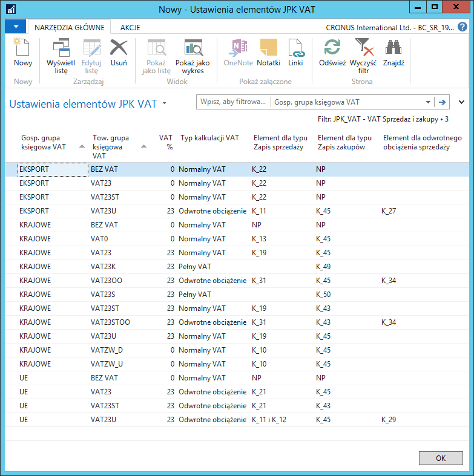{width="6.28301946631671in" height="6.315240594925634in"}
  -----------------------------------------------------------------------------------
  Rysunek 9.6: USTAWIENIA ELEMENTÓW JPK VAT

#### Ustawienia elementów obszaru JPK\_FA {#ustawienia-elementów-obszaru-jpk_fa .Poziom-2}

### Informacje ogólne

> W przypadku dostawy towarów lub świadczenia usług zwolnionych
> od podatku na podstawie art. 43 ust. 1, art. 113 ust. 1 i 9
> lub przepisów wydanych na podstawie art. 82 ust. 3, należy wskazać
> przepis ustawy lub aktu wydanego na podstawie ustawy, na podstawie
> którego podatnik stosuje zwolnienie od podatku, albo należy wskazać
> przepis dyrektywy 2006/112/WE, który zwalnia od podatku taką dostawę
> towarów lub takie świadczenie usług, albo inną podstawę prawną
> wskazującą na to, że dostawa towarów lub  świadczenie usług korzysta
> ze zwolnienia.
>
> Ponadto, gdy faktura sprzedaży nie zawiera kwoty VAT, konieczne jest
> wskazanie przyczyny braku tej kwoty.
>
> Dla VAT należnego pochodzącego z zakupu, jako numer dokumentu w pliku
> JPK\_FA przekazywany jest numer dokumentu zewnętrznego, na podstawie
> którego została obliczona kwota VAT należnego.

### Obsługa

W celu zdefiniowania dodatkowych ustawień na potrzeby generowania pliku
JPK\_FA, należy wykonać następujące kroki:

1.  Należy wybrać **Działy \> Zarządzanie Finansami \> Administracja \>
    > Ustawienia JPK \> Obszary JPK**.

2.  W oknie **Obszary JPK**, które się otworzy, wyświetlona jest lista
    dostępnych obszarów, dla których można wygenerować plik JPK. W celu
    określenia dodatkowych ustawień, należy zaznaczyć wiersz z obszarem
    JPK\_FA, a następnie na wstążce kliknąć **Ustawienia elementów
    wg grup księgowych VAT**.

3.  W oknie **Ustawienia elementów JPK VAT**, które się otworzy, dla
    określonych kombinacji gospodarczych grup księgowych VAT oraz
    towarowych grup księgowych VAT, które dotyczą sprzedaży zwolnionej,
    sprzedaży ze stawką 0%, sprzedaży niepodlegającej VAT i sprzedaży
    z odwrotnym obciążeniem (czyli w przypadku, gdy przy sprzedaży
    nie jest kalkulowany VAT należny), należy uzupełnić pole **Typ
    Zerowa stawka VAT,** wybierając jedną spośród dostępnych opcji:

-   **VAT 0%** -- dla transakcji, które dotyczą sprzedaży ze stawką 0%,

-   **Zwolnione z VAT (ustawa)** -- dla transakcji, które dotyczą
    > sprzedaży zwolnionej (na podstawie przepisów ustawy albo aktu
    > wydanego na podstawie ustawy),

-   **Zwolnione z VAT (dyrektywa UE)** -- dla transakcji, które dotyczą
    > sprzedaży zwolnionej (przepis dyrektywy 2006/112/WE, który zwalnia
    > od podatku taką dostawę towarów lub takie świadczenie),

-   **Zwolnione z VAT (inne)** -- dla transakcji, które dotyczą
    > sprzedaży zwolnionej (inna podstawa prawna wskazująca na to,
    > że dostawa towarów lub świadczenie usług korzysta ze zwolnienia),

-   **Nie podlega opodatkowaniu** -- dla transakcji, które dotyczą
    > sprzedaży niepodlegającej VAT,

-   **Odwrotne obciążenie** -- dla transakcji, które dotyczą sprzedaży
    > z odwrotnym obciążeniem.

{width="0.1909722222222222in"
height="0.1909722222222222in"} **Uwaga:** Transakcje objęte obowiązkową
podzieloną płatnością MPP oznaczane są na podstawie danych z systemu i
modułu Split payment.

  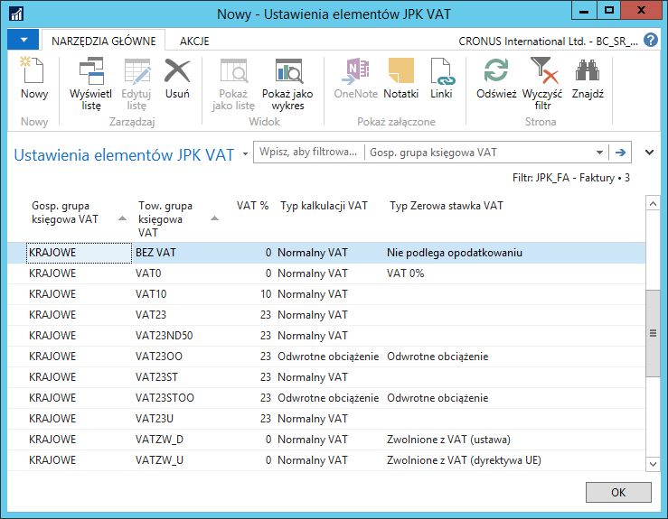{width="6.3018875765529305in" height="4.903487532808399in"}
  -------------------------------------------------------------------------------------
  Rysunek 9.7: USTAWIENIA ELEMENTÓW JPK FA

#### Dodatkowe ustawienia dla pliku JPK\_VAT {#dodatkowe-ustawienia-dla-pliku-jpk_vat .Poziom-2}

> W przypadku niektórych transakcji związanych z zakupem, w których
> naliczany jest VAT należny, ale niedotyczących odwrotnego obciążenia
> (np. uproszczonej procedury celnej) wymagane jest, aby dla pozycji z
> należnym VAT w pliku JPK\_VAT prezentowany był numer dokumentu
> zewnętrznego jako numer dokumentu. Do tego celu służy pole **Wyślij Nr
> dok. zewnętrznego dla zapisu sprzedaży** w **Ustawieniach księgowych
> VAT**. Aby zdefiniować to ustawienie, należy wykonać następujące
> kroki:

1.  Należy wybrać **Działy \> Zarządzanie Finansami \> Administracja \>
    Grupy księgowe VAT \> Ustawienia księgowe VAT**.

2.  W oknie **Ustawienia księgowe VAT**, które się otworzy, należy
    zaznaczyć wiersz z wybraną kombinacją grup księgowych VAT,
    a następnie na wstążce kliknąć **Edytuj**.

3.  Na karcie skróconej **Ogólne** należy zaznaczyć pole **Wyślij Nr
    dok. zewnętrznego dla zapisu sprzedaży**.

  --------------------------------------
  Rysunek 9.8: USTAWIENIA księgowe VAT
  --------------------------------------

#### Przygotowanie danych pliku JPK\_FA {#przygotowanie-danych-pliku-jpk_fa .Poziom-2}

### Obsługa 

> W celu przygotowania danych do wygenerowania pliku JPK\_FA za wybrany
> okres, można zarządzać uwzględnieniem poszczególnych dokumentów
> sprzedaży w plikach JPK\_FA. W nagłówkach zaksięgowanych dokumentów
> dodane zostało pole **Pomiń w JPK\_FA**, które może mieć zastosowanie
> do dokumentów wewnętrznych, anulowanych, które nie pojawiły się w
> obiegu gospodarczym. Takie dokumenty nie muszą być prezentowane w
> pliku JPK\_FA(3).
>
> Pole **Pomiń w JPK\_FA** znajduje się w nagłówkach zaksięgowanych
> dokumentów, na karcie skróconej **Ogólne** i jest obsługiwane przez
> akcję **Zmiana - pomiń w JPK/JPK\_ŚT**:

-   **Zaksięgowana faktura sprzedaży,**

-   **Zaksięgowana faktura korygująca sprzedaży,**

-   **Zaksięgowana faktura serwisu,**

-   **Zaksięgowana faktura korygująca serwisu**.

  --------------------------------------------------------------------------
  Rysunek 9.9: Nagłówek zaksięgowanej faktury sprzedaży -- Pomiń w JPK\_FA
  --------------------------------------------------------------------------

JPK Uruchamianie eksportu plików {#jpk-uruchamianie-eksportu-plików .Poziom-1}
--------------------------------

### Informacje ogólne

Moduł JPK w Polskiej Lokalizacji umożliwia przygotowanie plików
JPK\_VAT, JPK\_KR, JPK\_FA, JPK\_MAG i JPK\_WB w formacie xml. Pliki
do przesłania do Urzędu Skarbowego muszą być dodatkowo przygotowane
(spakowane, zaszyfrowane, podpisane elektronicznie) przez program
zewnętrzny.

#### Generowanie pliku JPK\_VAT {#generowanie-pliku-jpk_vat .Poziom-2}

### Obsługa

W celu wygenerowania pliku JPK\_VAT za wybrany okres, należy wykonać
następujące kroki:

1.  Należy wybrać **Działy \> Zarządzanie Finansami \> Działania
    okresowe \> Księga główna \> Eksport SAFT JPK**

2.  W oknie **Eksport JPK**, które się otworzy, należy zaznaczyć wiersz
    z obszarem JPK\_VAT. Następnie na wstążce należy kliknąć **Eksportuj
    JPK**.

3.  W oknie **Parametry eksportu JPK**, które się otworzy, należy
    wypełnić pola odpowiednimi wartościami:

-   **Data początkowa** -- w tym polu należy wybrać datę początkową
    okresu, za który generowany jest plik (według daty obowiązku VAT),

-   **Data końcowa** -- w tym polu należy wybrać datę końcową okresu,
    za który generowany jest plik (według daty obowiązku VAT),

-   **Przyczyna zgłoszenia** -- w tym polu należy wpisać **0**
    dla złożenia pliku JPK\_VAT po raz pierwszy za dany okres,

-   **Nazwa pliku** -- w tym polu należy wskazać lokalizację, w której
    zostanie zapisany wygenerowany plik.

4.  Następnie, w razie potrzeby, należy wypełnić wartości niektórych
    elementów zdefiniowanych dla danego obszaru. Dla obszaru JPK\_VAT
    domyślnie są to:

-   **K\_36** -- w tym polu należy podać kwotę z pola 36 deklaracji
    VAT-7,

-   **K\_37** -- w tym polu należy podać kwotę z pola 37 deklaracji
    VAT-7,

-   **K\_38** -- w tym polu należy podać kwotę z pola 38 deklaracji
    VAT-7,

-   **K\_39** -- w tym polu należy podać kwotę z pola 39 deklaracji
    VAT-7,

-   **K\_47** -- w tym polu należy podać kwotę z pola 47 deklaracji
    VAT-7,

-   **K\_48** -- w tym polu należy podać kwotę z pola 48 deklaracji
    VAT-7.

5.  Po zatwierdzeniu przyciskiem **OK** plik zostanie zapisany w
    > wybranej lokalizacji.

  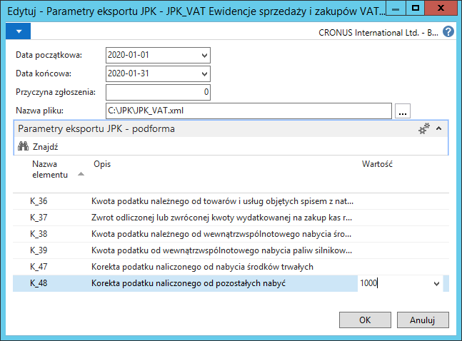{width="5.4909339457567805in" height="4.056603237095363in"}
  -------------------------------------------------------------------------------------
  Rysunek 9.10: Parametry eksportu JPK\_VAT

#### Generowanie pliku JPK\_FA {#generowanie-pliku-jpk_fa .Poziom-2}

### Obsługa

W celu wygenerowania pliku JPK\_FA za wybrany okres, należy wykonać
następujące kroki:

1.  Należy wybrać **Działy \> Zarządzanie Finansami \> Działania
    okresowe \> Księga główna \> Eksport SAFT JPK**.

2.  W oknie **Eksport JPK**, które się otworzy, należy zaznaczyć wiersz
    z obszarem JPK\_FA. Następnie na wstążce należy kliknąć **Eksportuj
    JPK**.

3.  W oknie **Parametry eksportu JPK**, które się otworzy należy
    wypełnić pola odpowiednimi wartościami:

-   **Data początkowa** -- w tym polu należy wybrać datę początkową
    okresu, za który  generowany jest plik (według daty wybranej w polu
    **Rodzaj daty**),

-   **Data końcowa** -- w tym polu należy wybrać datę końcową okresu,
    za który  generowany jest plik (według daty wybranej w polu **Rodzaj
    daty**),

-   **Przyczyna zgłoszenia** -- w tym polu należy wpisać **1**
    dla złożenia pliku JPK\_FA po raz pierwszy za dany okres,

-   **Nazwa pliku** -- w tym polu należy wskazać lokalizację, w której
    zostanie zapisany wygenerowany plik.

4.  Następnie należy wypełnić wartości elementów zdefiniowanych dla
    danego obszaru. Dla obszaru JPK\_FA domyślnie są to:

-   **Kod waluty** -- domyślnie jest ustawiona opcja **WSZYSTKIE** (od
    wersji JPK\_FA(3) generowany jest jeden plik dla wszystkich walut),
    opcjonalnie można w tym polu wybrać walutę dokumentów sprzedaży,
    których dane mają zostać przekazane do generowanego pliku JPK\_FA.
    Pole należy pozostawić puste, jeśli generowany plik JPK\_FA dotyczy
    faktur w walucie lokalnej,

```{=html}
<!-- -->
```
-   **Rodzaj daty** -- w tym polu należy wybrać typ daty, według której
    wybrane zostaną dane do przygotowania pliku (dotyczy okresu
    wyznaczonego datami wprowadzonymi w polach **Data początkowa** i
    **Data końcowa**), dostępne opcje:

```{=html}
<!-- -->
```
-   **Data obowiązku VAT**,

-   **Data księgowania**,

-   **Data wpływu dokumentu/sprzedaży**

-   **Data dokumentu**.

```{=html}
<!-- -->
```
-   **Typ numeru dokumentu** -- w tym polu należy wybrać typ numeracji,
    która ma być zapisana w danych pliku JPK\_FA. Pole to ma zawierać
    kolejny numer faktury, nadany w ramach jednej lub więcej serii,
    który w sposób jednoznaczny identyfikuje fakturę. W przypadku
    prowadzenia ksiąg przez biuro rachunkowe często numer faktury
    sprzedaży wystawionej przez podmiot, zapisywany jest w księgach jako
    numer dokumentu zewnętrznego. Opcje dostępne w tym polu:

```{=html}
<!-- -->
```
-   **Nr dokumentu**,

-   **Nr dokumentu zewnętrznego**.

```{=html}
<!-- -->
```
-   **Nr nabywcy** -- domyślnie ustawiona jest opcja **WSZYSCY**,
    opcjonalnie można w tym polu wybrać jednego nabywcę, aby wygenerować
    plik z dokumentami sprzedaży wystawionymi w danym okresie tylko
    dla wybranego nabywcy,

-   **Podstawowa stawka VAT** -- w tym polu należy wpisać aktualny %
    podstawowej stawki VAT lub wpisać jako filtr więcej niż jedną
    stawkę, np. 22\|23,

-   **Obniżona stawka VAT (1)** -- w tym polu należy wpisać aktualny %
    pierwszej obniżonej stawki VAT lub wpisać jako filtr więcej
    niż jedną stawkę, np. 7\|8,

-   **Obniżona stawka VAT (2)** -- w tym polu należy wpisać aktualny %
    drugiej obniżonej stawki VAT lub wpisać jako filtr więcej niż jedną
    stawkę,

-   **Obniżona stawka VAT (3)** -- pole rezerwowe -- w tym polu należy
    wpisać % trzeciej obniżonej stawki VAT lub wpisać jako filtr więcej
    niż jedną stawkę,

-   **Obniżona stawka VAT (4)** -- pole rezerwowe -- w tym polu należy
    > wpisać % czwartej obniżonej stawki VAT lub wpisać jako filtr
    > więcej niż jedną stawkę.

5.  Po zatwierdzeniu przyciskiem **OK** plik zostanie zapisany w
    > wybranej lokalizacji.

  {width="4.915095144356956in" height="4.820075459317585in"}
  ------------------------------------------------------------------------------------
  Rysunek 9.11: Parametry eksportu JPK\_FA

#### Generowanie pliku JPK\_KR {#generowanie-pliku-jpk_kr .Poziom-2}

### Obsługa

W celu wygenerowania pliku JPK\_KR za wybrany okres, należy wykonać
następujące kroki:

1.  Należy wybrać **Działy \> Zarządzanie Finansami \> Działania
    okresowe \> Księga główna \> Eksport SAFT JPK**.

2.  W oknie **Eksport JPK**, które się otworzy, należy zaznaczyć wiersz
    z obszarem JPK\_KR. Następnie na wstążce należy kliknąć **Eksportuj
    JPK**.

3.  W oknie **Parametry eksportu JPK**, które się otworzy należy
    wypełnić pola odpowiednimi wartościami:

-   **Data początkowa** -- w tym polu należy wybrać datę początkową
    okresu, za który generowany jest plik (według daty księgowania),

-   **Data końcowa **-- w tym polu należy wybrać datę końcową okresu,
    za który generowany jest plik (według daty księgowania),

-   **Przyczyna zgłoszenia** -- w tym polu należy wpisać **1**
    dla złożenia pliku JPK\_KR po raz pierwszy za dany okres,

-   **Nazwa pliku** -- w tym polu należy wskazać lokalizację, w której
    zostanie zapisany wygenerowany plik.

4.  Następnie należy wypełnić wartości elementów zdefiniowanych dla
    danego obszaru. Dla obszaru JPK\_KR domyślnie są to:

-   **Pokaż zapisy nabywcy/dostawcy** -- w tym polu należy wybrać, czy
    zapisy z ksiąg pomocniczych nabywców i dostawców mają być zawarte w
    pliku. Dostępne opcje to **Tak** oraz **Nie**.

5.  Po zatwierdzeniu przyciskiem **OK** plik zostanie zapisany w
    > wybranej lokalizacji.

  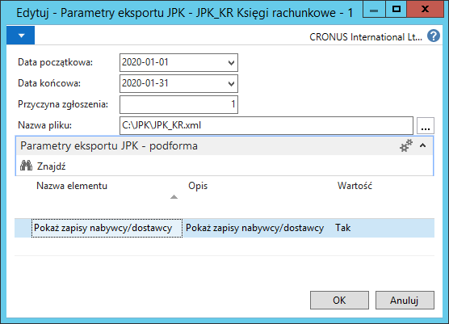{width="4.679245406824147in" height="3.374779090113736in"}
  ------------------------------------------------------------------------------------
  Rysunek 9.12: Parametry eksportu jpk\_KR

#### Generowanie pliku JPK\_WB {#generowanie-pliku-jpk_wb .Poziom-2}

### Obsługa

W celu wygenerowania pliku JPK\_WB za wybrany okres, należy wykonać
następujące kroki:

1.  Należy wybrać **Działy \> Zarządzanie Finansami \> Działania
    okresowe \> Księga główna \> Eksport SAFT JPK**.

2.  W oknie **Eksport JPK**, które się otworzy, należy zaznaczyć wiersz
    z obszarem JPK\_WB. Następnie na wstążce należy kliknąć **Eksportuj
    JPK**.

3.  W oknie **Parametry eksportu JPK**, które się otworzy, należy
    wypełnić pola odpowiednimi wartościami:

-   **Data początkowa** -- w tym polu należy wybrać datę początkową
    okresu, za który generowany jest plik (według daty księgowania),

-   **Data końcowa** -- w tym polu należy wybrać datę końcową okresu,
    za który generowany jest plik (według daty księgowania),

-   **Przyczyna zgłoszenia** -- w tym polu należy wpisać **1**
    dla złożenia pliku JPK\_WB po raz pierwszy za dany okres,

-   **Nazwa pliku** -- w tym polu należy wskazać lokalizację, w której
    zostanie zapisany wygenerowany plik.

4.  Następnie należy wypełnić wartości elementów zdefiniowanych dla
    danego obszaru. Dla obszaru JPK\_WB domyślnie są to:

-   **Kod konta bankowego** -- w tym polu należy wybrać z listy konto
    bankowe, którego dane i zapisy mają zostać wygenerowane w pliku
    JPK\_WB.

5.  Po zatwierdzeniu przyciskiem **OK** plik zostanie zapisany w
    > wybranej lokalizacji.

  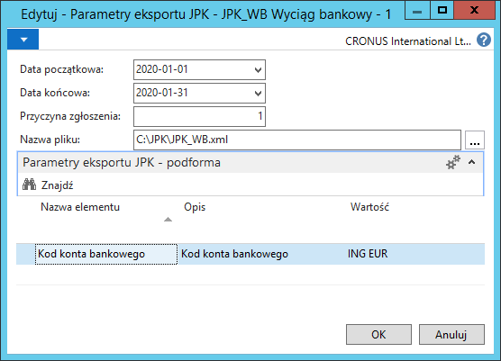{width="4.547169728783902in" height="3.2795231846019246in"}
  -------------------------------------------------------------------------------------
  Rysunek 9.13: parametry eksportu JPK\_WB

#### Generowanie pliku JPK\_MAG {#generowanie-pliku-jpk_mag .Poziom-2}

### Obsługa

W celu wygenerowania pliku JPK\_MAG za wybrany okres, należy wykonać
następujące kroki:

1.  Należy wybrać **Działy \> Zarządzanie Finansami \> Działania
    okresowe \> Księga główna \> Eksport SAFT JPK**.

2.  W oknie **Eksport JPK**, które się otworzy, należy zaznaczyć wiersz
    z obszarem JPK\_MAG. Następnie na wstążce należy kliknąć **Eksportuj
    JPK**.

3.  W oknie **Parametry eksportu JPK**, które się otworzy, należy
    wypełnić pola odpowiednimi wartościami:

-   **Data początkowa** -- w tym polu należy wybrać datę początkową
    okresu, za który generowany jest plik (według daty księgowania),

-   **Data końcowa** -- w tym polu należy wybrać datę końcową okresu,
    za który generowany jest plik (według daty księgowania),

-   **Przyczyna zgłoszenia** -- w tym polu należy wpisać **1**
    dla złożenia pliku JPK\_MAG po raz pierwszy za dany okres,

-   **Nazwa pliku** -- w tym polu należy wskazać lokalizację, w której
    zostanie zapisany wygenerowany plik.

4.  Następnie należy wypełnić wartości elementów zdefiniowanych dla
    danego obszaru. Dla obszaru JPK\_MAG domyślnie są to:

-   **Kod lokalizacji** -- w tym polu należy wybrać lokalizację, której
    zapisy magazynowe z dokumentów typu wybranego poniżej będą
    przekazane do generowanego pliku JPK\_MAG,

-   **Typ dokumentu** -- w tym polu należy wskazać rodzaj dokumentów
    magazynowych, których dane i zapisy zostaną przekazane
    do generowanego pliku JPK\_MAG. Opcje dostępne w tym polu:

```{=html}
<!-- -->
```
-   **Wszystkie**,

-   **PZ**,

-   **WZ**,

-   **RW**,

-   **MM**.

5.  Po zatwierdzeniu przyciskiem **OK** plik zostanie zapisany w
    > wybranej lokalizacji.

  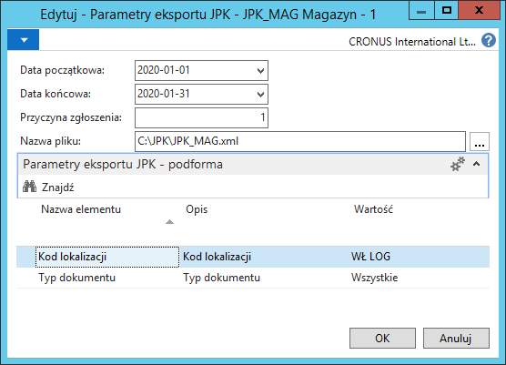{width="4.594339457567804in" height="3.313543307086614in"}
  ------------------------------------------------------------------------------------
  Rysunek 9.14: parametry eksportu JPK\_MAG

JPK Rejestr eksportu plików {#jpk-rejestr-eksportu-plików .Poziom-1}
---------------------------

### Informacje ogólne

Moduł JPK w Polskiej Lokalizacji umożliwia zapisanie wygenerowanych
plików JPK\_VAT, JPK\_KR, JPK\_FA, JPK\_MAG i JPK\_WB w bazie danych
oraz ponowne ich wyeksportowanie. W rejestrze zapisywany jest również
plik z ustawieniami wykorzystanymi przy generowaniu danych.

### Obsługa

W celu wyświetlenia rejestru wygenerowanych plików JPK, należy wykonać
następujące kroki:

1.  Należy wybrać **Działy \> Zarządzanie Finansami \> Archiwum \>
    Księga główna \> Historia \> Rejestr JPK**.

2.  W oknie **Rejestr JPK**, które się otworzy, prezentowane są poniższe
    dane wygenerowanych plików JPK:

    -   **Nr zapisu** -- numer kolejny rejestru -- każde generowanie
        każdego pliku JPK powoduje utworzenie rejestru z kolejnym
        numerem,

    -   **Obszar** -- informacja o obszarze, dla którego wygenerowany
        był pliku JPK zapisany pod danym numerem rejestru (zapisu),

    -   **Kod wersji** -- numer będący kodem wersji wygenerowanego pliku
        JPK,

    -   **Data początkowa** -- data początkowa okresu, za który został
        wygenerowany plik JPK,

    -   **Data końcowa** -- data końcowa okresu, za który został
        wygenerowany plik JPK,

    -   **Przyczyna zgłoszenia** -- kod przyczyny zgłoszenia
        wygenerowanego pliku JPK,

    -   **Wyeksportowano dzień-godzina** -- rzeczywista data i czas
        generowania pliku JPK,

    -   **Identyfikator użytkownika** -- identyfikator użytkownika,
        który wygenerował plik JPK,

    -   **Ostatni nr zapisu K/G** -- numer ostatniego zapisu K/G -- stan
        w momencie generowania pliku JPK,

    -   **Ostatni nr zapisu VAT** -- numer ostatniego zapisu VAT -- stan
        > w momencie generowania pliku JPK.

  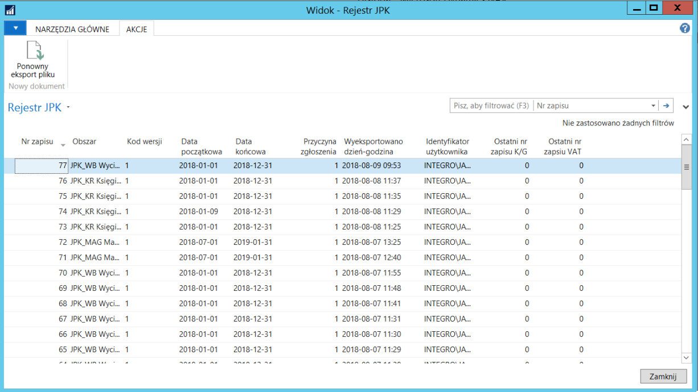{width="6.173076334208224in" height="3.474245406824147in"}
  ------------------------------------------------------------------------------------
  Rysunek 9.15: Rejestr JPK

#### Funkcje rejestru plików JPK {#funkcje-rejestru-plików-jpk .Poziom-2}

### Informacje ogólne

W oknie **Rejestr JPK** dostępna jest funkcja pozwalająca na ponowne
wyeksportowanie utworzonego pliku JPK, jeżeli w **Ustawieniach JPK**
zaznaczono pole **Zapisz w bazie danych**.

### Obsługa

W celu ponownego wyeksportowania wybranego pliku JPK, należy postępować
według następujących kroków:

1.  Należy wybrać **Działy \> Zarządzanie Finansami \> Archiwum \>
    Księga główna \> Historia \> Rejestr JPK**.

2.  W oknie **Rejestr JPK**, które  się otworzy, należy ustawić kursor
    w wierszu z wybranym plikiem JPK, a następnie na wstążce kliknąć
    **Ponowny eksport pliku**.

3.  Plik zostanie zapisany w lokalizacji wskazanej w polu **Nazwa
    > pliku** na stronie **Rejestr JPK**, które domyślnie jest
    > niewidoczne.

> {width="0.1909722222222222in"
> height="0.1909722222222222in"} **Uwaga:** Dostęp do okna **Rejestr
> JPK** można również uzyskać wybierając akcję **Rejestr** w oknie
> **Eksport SAFT JPK**, które można otworzyć wybierając **Działy \>
> Zarządzanie Finansami \> Działania okresowe \> Księga główna \>
> Eksport SAFT JPK**.

** ***Obowiązkowa podzielona płatność* {#obowiązkowa-podzielona-płatność .Rozdzial}
======================================

### Informacje ogólne

Przygotowanie obsługi i wsparcia funkcjonalności mechanizmu podzielonej
płatności w ramach Polskiej Lokalizacji systemu Microsoft Dynamics 365
Business Central on‑premises wynika z nowelizacji ustawy o podatku od
towarów i usług, która wprowadza dla towarów i usług z załącznika nr 15
obowiązkowy mechanizm podzielonej płatności od dnia 01.11.2019 roku.
Przygotowane zostało rozwiązanie wspierające obowiązkowy mechanizm
podzielonej płatności (MPP) w modułach sprzedaży i zakupu oraz
aktualizacja rozwiązania generowania przelewów z uwzględnieniem
obowiązkowego MPP.

Mechanizm podzielonej płatności (ang. split payment) jako dobrowolny
zaczął obowiązywać polskich przedsiębiorców 1 lipca 2018 roku. Zmiana
ustawy o podatku od towarów i usług, która implementowała mechanizm
podzielonej płatności, wiązała się z wprowadzeniem modyfikacji w
systemie Microsoft Dynamics 365 Business Central on‑premises w module
bankowości elektronicznej.

Nowe rozwiązanie zostało zaktualizowane do wymogów obowiązkowej
podzielonej płatności, a obowiązuje nadal dobrowolny mechanizm
podzielonej płatności z lipca 2018.

W dalszej części rozdziału opisany zostanie moduł wsparcia procesu
sprzedaży i zakupu z uwzględnieniem wymogów dla obowiązkowej podzielonej
płatności oraz wsparcie w module bankowości elektronicznej.

Mechanizm podzielonej płatności (MPP):

-   dotyczy tylko podmiotów prowadzących działalność gospodarczą dla
    rozliczeń transakcji pomiędzy sobą (B2B),

-   w przypadku adnotacji na fakturze „mechanizm podzielonej płatności",
    zapłata z wykorzystaniem MPP jest obligatoryjna, w pozostałych
    przypadkach o podziale płatności decyduje nabywca płacący, który
    może, ale nie musi, zastosować mechanizm podziału płatności,

-   warunkiem dla zastosowania obowiązkowego MPP jest przekroczenie
    kwoty brutto faktury powyżej 15 000,00 zł i wystąpienie w niej
    przynajmniej jednego z towarów lub usług znajdujących się na liście
    z załącznika nr 15,

-   MPP umożliwia zapłatę zobowiązania ze wskazaniem kwoty podatku VAT
    przekazywanej na osobne konto VAT dostawcy, a pozostałej kwoty
    na rachunek bieżący rozliczeniowy dostawcy,

-   bank realizujący przelew wyśle kwotę brutto z rachunku
    rozliczeniowego, z jednoczesnym przeksięgowaniem na rachunek
    rozliczeniowy kwoty VAT z rachunku VAT,

-   bank odbierający przelew w mechanizmie podzielonej płatności
    zaksięguje kwotę brutto na wskazanym w przelewie rachunku odbiorcy i
    następnie kwotę VAT przekaże na dedykowany rachunek VAT odbiorcy,

-   obowiązkowa podzielona płatność zastępuje dotychczasowy mechanizm
    odwrotnego obciążenia w obrocie krajowym, gdy płatnikiem podatku
    był nabywca.

Ważne:

-   zmiana ustawy od 1.07.2018 wprowadza:

```{=html}
<!-- -->
```
-   konieczność prowadzenia dla klientów przez banki dedykowanego
    > rachunku VAT powiązanego z rachunkami rozliczeniowymi w walucie
    > PLN -- mechanizm podzielonej płatności dotyczy tylko płatności VAT
    > w polskich złotych,

-   przygotowanie nowego typu rozliczeń dla przelewów wychodzących
    > i płatności przychodzących w mechanizmie podzielonej płatności,

```{=html}
<!-- -->
```
-   właścicielem środków znajdujących się na rachunku VAT jest
    właściciel konta bankowego. Pomimo tego, nie będzie on mógł
    swobodnie dokonywać płatności na poczet innych zobowiązań, niż z
    tytułu VAT,

-   środki zgromadzone na rachunku VAT posiadacza mogą pochodzić jedynie
    z tytułu:

```{=html}
<!-- -->
```
-   otrzymanego zlecenia płatniczego rozliczonego w formule podzielonej
    > płatności,

-   zlecenia płatniczego rozliczonego w formule podzielonej płatności
    > z tytułu wystawienia faktury korygującej,

-   rozliczeń VAT z urzędem skarbowym (należność z tytułu zwrotu przez
    > urząd nadpłaty VAT, indywidualne decyzje naczelnika urzędu
    > skarbowego w zakresie środków VAT podatnika),

-   przekazania środków z innego rachunku VAT posiadacza rachunku VAT
    > prowadzonego w tym samym banku.

```{=html}
<!-- -->
```
-   opis przelewu i opis na wyciągu bankowym jest ściśle zdefiniowany\
    i zawiera odpowiednie oznaczenia elementów:

> **/VAT/10n,2n / IDC/14x / INV/35x / TXT/33x**
>
> n- liczba naturalna, x -- dowolny znak,
>
> VAT -- kwota VAT, IDC - NIP dostawcy, INV -numer jednej faktury, TXT
> --dowolny tekst o długości 33 znaków
>
> przykład:
>
> /VAT/kwota VAT/IDC/NIP DOSTAWCY/INV/NUMER FAKTURY/TXT/ DOWOLNY TEKST

**Opracowano na podstawie:**

1)  Ustawa z dnia 9.08.2019 r. o zmianie ustawy o podatku od towarów
    i usług oraz niektórych innych ustaw opublikowana w Dz. U. z 2019 r.
    poz. 1751

2)  Ustawa o podatku od towarów i usług z dnia 11.03.2004 --
    ujednolicony tekst ustawy
    [http://prawo.sejm.gov.pl/isap.nsf/download.xsp/WDU20040540535/U/D2004
    0535Lj.pdf](http://prawo.sejm.gov.pl/isap.nsf/download.xsp/WDU20040540535/U/D2004%200535Lj.pdf)

> Rozdział 1 a. Mechanizm podzielonej płatności Art. 108a. -- 108d.
> obowiązujący od dnia 01.07.2018 roku

3)  informacje uzyskane z banków.

```{=html}
<!-- -->
```
16. 

Dokumenty sprzedaży i zakupu {#dokumenty-sprzedaży-i-zakupu .Poziom-1}
----------------------------

### Informacje ogólne

W dokumentach sprzedaży i zakupu mechanizm podzielonej płatności działa
w oparciu m.in. o kody PKWiU i klauzule VAT. Podczas instalacji modułu
wgrywane są jego podstawowe ustawienia.

Ustawienia są wspólne dla dokumentów sprzedaży i zakupu.

### Ustawienia

Aby zweryfikować i ewentualnie zmienić/uzupełnić wgrane ustawienia,
należy wykonać następujące kroki:

1.  Należy wybrać **Działy \> Zarządzanie Finansami \> Administracja \>
    Ustawienia księgi głównej**

2.  W oknie **Ustawienia księgi głównej**, które się otworzy, należy
    sprawdzić wypełnienie pól na karcie skróconej **Obowiązkowa
    podzielona płatność**:

-   **Obowiązkowy limit podziału płatności** -- w tym polu wprowadzona
    jest wartość brutto limitu transakcji sprzedaży lub zakupu dla
    zastosowania podzielonej płatności,

-   **Klauzula VAT dla obowiązkowej podzielonej płatności** -- w tym
    polu wprowadzony jest kod klauzuli VAT, której treść: *mechanizm
    podzielonej płatności* będzie drukowana na dokumentach sprzedaży
    podlegających obowiązkowi podzielonej płatności.

  {width="6.376844925634296in" height="3.7395833333333335in"}
  -------------------------------------------------------------------------------------
  Rysunek 10.1: Ustawienia księgi głównej

3.  W oknie **Ustawienia księgi głównej** na wstążce należy kliknąć
    **Kody PKWiU**.

4.  W oknie **Kody PKWiU**, które się otworzy, należy sprawdzić
    wypełnienie pola **Obowiązkowa podzielona płatność**.

  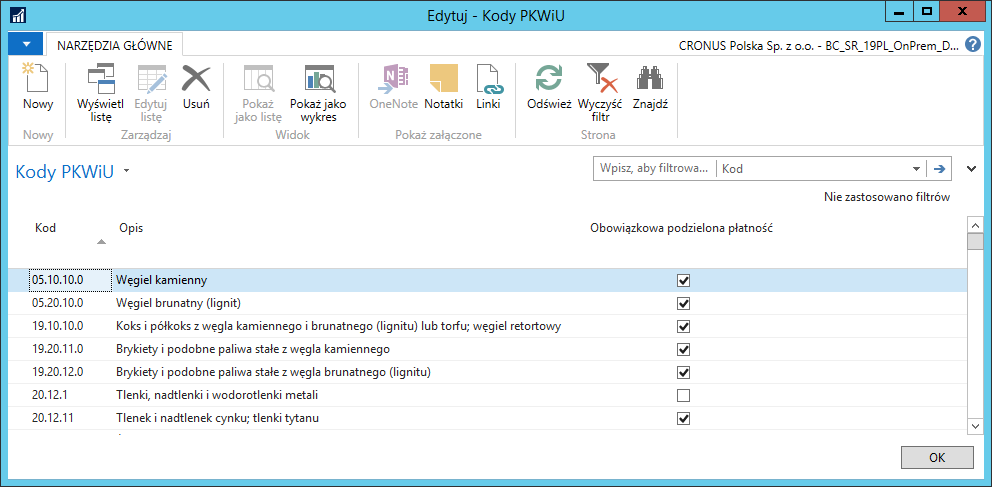{width="6.344396325459318in" height="3.1145833333333335in"}
  -------------------------------------------------------------------------------------
  Rysunek 10.2: Kody PKWiU

#### Wsparcie procesu sprzedaży z obowiązkową podzieloną płatnością {#wsparcie-procesu-sprzedaży-z-obowiązkową-podzieloną-płatnością .Poziom-2}

### Obsługa

Wsparcie procesu sprzedaży polega na dodaniu kalkulowanego oznaczenia
dla dokumentów zamówienia sprzedaży, faktury sprzedaży i faktury
korygującej sprzedaży. Pole to jest automatycznie zaznaczane w przypadku
spełnienia warunków dla zastosowania obowiązkowej podzielonej płatności:
gdy przynajmniej w jednym wierszu dokumentu wpisany będzie kod PKWiU z
listy z załącznika i faktura przekroczy 15 000,00 zł brutto.

Znacznik w polu **Obowiązkowa podzielona płatność** w dokumentach
sprzedaży może być również ręcznie zmieniony w szczególnych przypadkach.

{width="0.19in" height="0.19in"}
**Uwaga:** Opis obsługi mechanizmu podzielonej płatności zamieszczony w
tym rozdziale **bazuje na przykładzie faktury sprzedaży. W zamówieniach
sprzedaży i w fakturach korygujących sprzedaży obsługa mechanizmu
jest identyczna, więc należy wzorować się na opisie dotyczącym faktury
sprzedaży**.

Aby wprowadzić fakturę sprzedaży z zastosowaniem mechanizmu podzielonej
płatności, należy wykonać następujące kroki:

1.  Należy wybrać **Działy \> Sprzedaż i Marketing \> Przetwarzanie
    zamówień \> Faktury sprzedaży**

2.  W oknie **Faktury sprzedaży**, które się otworzy, na wstążce należy
    kliknąć **Nowy**.

3.  Fakturę sprzedaży należy wypełnić w standardowy sposób.

Warunkiem zakwalifikowania przez system faktury sprzedaży do obowiązku
zastosowania mechanizmu podzielonej płatności jest podanie, w co
najmniej jednym wierszu faktury, kodu PKWiU, dla którego zaznaczone jest
pole **Obowiązkowa podzielona płatność**, przy łącznej wartości brutto
faktury wynoszącej co najmniej 15 000,00 zł.

W karcie skróconej **Szczegóły faktury** widoczne jest nowe pole
**Obowiązkowa podzielona płatność** -- pole to jest nieedytowalne, jego
wartość ustawiana jest automatycznie po zweryfikowaniu przez system
spełnienia kryteriów.

Weryfikacja odbywa się w wyniku:

1)  otworzenia okna **Statystyki**

lub

2)  zmiany stanu na **Zwolniony**

lub

3)  księgowania dokumentu.

  --------------------------------------------------------------------
  Rysunek 10.3: Faktura sprzedaży -- obowiązkowa podzielona płatność
  --------------------------------------------------------------------

Pole **Obowiązkowa podzielona płatność** w karcie skróconej **Szczegóły
faktury** związane jest również z funkcjonalnością **Atrybutów VAT**,
przygotowaną do obsługi nowego formatu i nowej klasyfikacji dokumentów i
transakcji pod kątem **JPK\_VAT z deklaracją**. Na tym etapie można
przejrzeć atrybut VAT tylko dla MPP.

Aby przejrzeć atrybuty VAT przypisane do faktury sprzedaży, należy na
wstążce kliknąć **Atrybuty VAT**.

  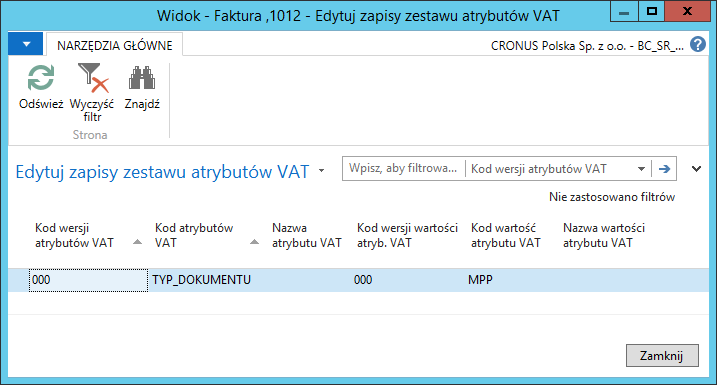{width="6.354166666666667in" height="3.4119706911636047in"}
  -------------------------------------------------------------------------------------
  Rysunek 10.4: Faktura sprzedaży -- Atrybuty VAT

Aby zweryfikować wartości faktury sprzedaży i zastosowanie mechanizmu
podzielonej płatności, w oknie **Faktura sprzedaży** należy na wstążce
kliknąć **Statystyka** (można też nacisnąć **F7**).

W wyniku tego działania system weryfikuje kody PKWiU w wierszach faktury
sprzedaży oraz łączną wartość brutto do fakturowania. Na tej podstawie
zaznacza lub nie pole **Obowiązkowa podzielona płatność**.

  -----------------------------------------------
  Rysunek 10.5: Faktura sprzedaży -- Statystyka
  -----------------------------------------------

> W oknie **Statystyka sprzedaży**, na wstążce dostępna jest akcja
> **Zmień obowiązkową podzieloną płatność**, której można użyć do
> ręcznego oznaczenia MPP w fakturze sprzedaży, gdy na podstawie danych
> nie kwalifikuje się ona do obowiązkowej podzielonej płatności (jej
> wartość brutto jest niższa niż 15 000,00 zł lub w wierszach nie ma
> właściwego kodu PKWiU). W wyniku działania tej funkcji, system
> zaznaczy dwa pola: **Obowiązkowa podzielona płatność** i **Obowiązkowa
> podzielona płatność zaznaczona ręcznie** w oknie **Statystyka
> sprzedaży**.

{width="0.19in" height="0.19in"}
**Uwaga:** W sytuacji, gdy zmienią się dane faktury np. jej wartość
brutto lub przypisanie kodu PKWiU, ponowne otwarcie okna **Statystyka
sprzedaży** zweryfikuje obowiązek zastosowania MPP. Weryfikacja
przeprowadzana jest również w wyniku zmiany stanu dokumentu na
**Zwolniony** i podczas jego księgowania.

  -----------------------------------------------
  Rysunek 10.6: Faktura sprzedaży -- Statystyka
  -----------------------------------------------

{width="0.19in" height="0.19in"}
**Uwaga:** W sytuacji, gdy parametry faktury sprzedaży kwalifikują ją
do MPP i system zaznaczył automatycznie pole Obowiązkowa podzielona
płatność, nie ma możliwości ręcznej zmiany zaznaczenia tego pola.

> W wyniku użycia akcji **Zmień obowiązkową podzieloną płatność** w
> oknie **Statystyka sprzedaży** faktury spełniającej kryteria
> obowiązkowej podzielonej płatności, system usunie zaznaczenie pola
> **Obowiązkowa podzielona płatność**, ale podczas kolejnej weryfikacji
> tego dokumentu (przy ponownym otwarciu okna **Statystyka sprzedaży**,
> lub przy zmianie stanu na **Zwolniony**, lub przy księgowaniu
> dokumentu) pole zostanie ponownie zaznaczone.
>
> Kliknięcie akcji **Zmień obowiązkową podzieloną płatność** w oknie
> **Statystyka sprzedaży** faktury spełniającej kryteria obowiązkowej
> podzielonej płatności spowoduje wyświetlenie komunikatu
> z ostrzeżeniem:

  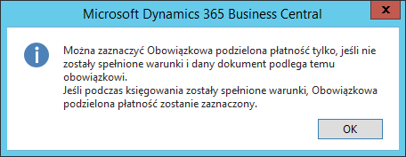{width="4.75in" height="1.84375in"}
  -------------------------------------------------------------
  Rysunek 10.7: Komunikat - informacja

> W celu sprawdzenia przewidywanego efektu księgowania danej faktury
> sprzedaży, w oknie **Faktura sprzedaży** należy na wstążce kliknąć
> **Podgląd księgowania**. Dla faktury podlegającej MPP pole
> **Obowiązkowa podzielona płatność** zostanie zaznaczone w księgach
> pomocniczych: **Zapisy VAT** i **Zapisy księgi nabywcy**:

  -----------------------------------
  Rysunek 10.8: Podgląd zapisów VAT
  -----------------------------------

  ----------------------------------------------
  Rysunek 10.9: Podgląd zapisów księgi nabywcy
  ----------------------------------------------

> W celu zaksięgowania faktury sprzedaży, w oknie **Faktura sprzedaży**
> należy na wstążce kliknąć **Księguj** (można też nacisnąć **F9**). W
> efekcie zaksięgowania faktury podlegającej MPP pole **Obowiązkowa
> podzielona płatność** zostanie zaznaczone w nagłówku zaksięgowanej
> faktury sprzedaży oraz w księgach pomocniczych: **Zapisy VAT** i
> **Zapisy księgi nabywcy**.

  -----------------------------------------------
  Rysunek 10.10: Zaksięgowana faktura sprzedaży
  -----------------------------------------------

  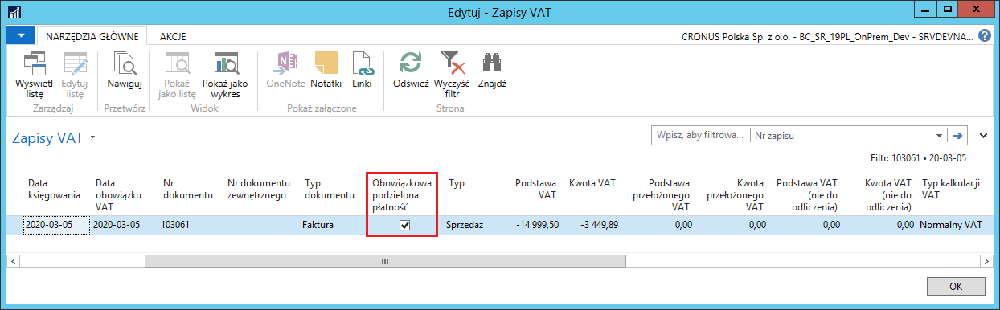{width="6.375in" height="1.9778849518810149in"}
  ---------------------------------------------------------------------------------------------------------------------------------------
  Rysunek 10.11: Zapisy VAT

  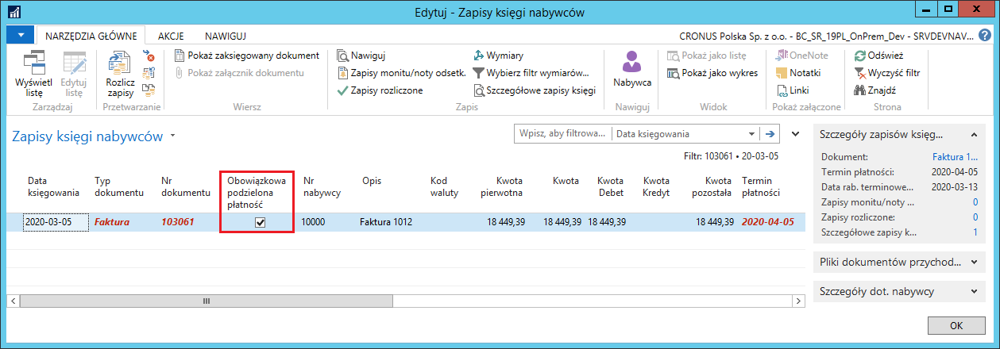{width="6.427083333333333in" height="2.246045494313211in"}
  --------------------------------------------------------------------------------------------------------------------------------------------------
  Rysunek 10.12: Zapisy księgi nabywców

Na wydruku zaksięgowanej faktury sprzedaży z zaznaczonym polem
**Obowiązkowa podzielona płatność** wyświetlona jest treść klauzuli VAT
wybrana w oknie **Ustawienia księgi głównej**.

  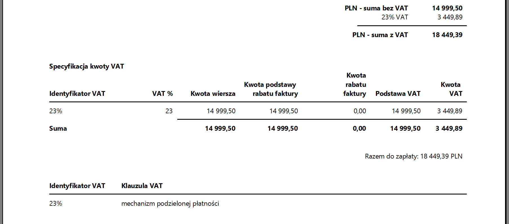{width="6.40625in" height="2.8225831146106737in"}
  -----------------------------------------------------------------------------------------------------------------------------------------
  Rysunek 10.13: Wydruk zaksięgowanej faktury sprzedaży

#### Wsparcie procesu zakupu z obowiązkową podzieloną płatnością {#wsparcie-procesu-zakupu-z-obowiązkową-podzieloną-płatnością .Poziom-2}

### Obsługa

Wsparcie procesu zakupu polega na dodaniu kalkulowanego oznaczenia
dla dokumentów zamówienia zakupu, faktury zakupu i faktury korygującej
zakupu. Pole to jest automatycznie zaznaczane w przypadku spełnienia
warunków dla zastosowania obowiązkowej podzielonej płatności:
gdy przynajmniej w jednym wierszu dokumentu wpisany będzie kod PKWiU z
listy z załącznika i faktura przekroczy 15 000,00 zł brutto.

Znacznik w polu **Obowiązkowa podzielona płatność** w dokumentach zakupu
może być również ręcznie zmieniony w szczególnych przypadkach, m.in. gdy
w ewidencjonowanych dokumentach zakupu nie będzie wprowadzany kod PKWiU.

{width="0.19in" height="0.19in"}
**Uwaga:** Opis obsługi mechanizmu podzielonej płatności zamieszczony w
tym rozdziale **bazuje na przykładzie faktury zakupu. W zamówieniach
zakupu i w fakturach korygujących zakupu obsługa mechanizmu
jest identyczna, więc należy wzorować się na opisie dotyczącym faktury
zakupu**.

Aby wprowadzić fakturę zakupu z zastosowaniem mechanizmu podzielonej
płatności, należy wykonać następujące kroki:

1.  Należy wybrać **Działy \> Zakup \> Przetwarzanie zamówień \> Faktury
    zakupu**

2.  W oknie **Faktury zakupu**, które się otworzy, na wstążce należy
    kliknąć **Nowy**.

3.  Fakturę zakupu należy wypełnić w standardowy sposób.

Warunkiem zakwalifikowania przez system faktury zakupu do obowiązku
zastosowania mechanizmu podzielonej płatności jest podanie, w co
najmniej jednym wierszu faktury, kodu PKWiU, dla którego zaznaczone jest
pole **Obowiązkowa podzielona płatność**, przy łącznej wartości brutto
faktury wynoszącej co najmniej 15 000,00 zł.

W skróconej karcie **Szczegóły faktury** widoczne jest nowe pole
**Obowiązkowa podzielona płatność** -- pole to jest nieedytowalne, jego
wartość ustawiana jest automatycznie po zweryfikowaniu przez system
spełnienia kryteriów.

Weryfikacja odbywa się w wyniku:

1)  otworzenia okna **Statystyki**

lub

2)  zmiany stanu na **Zwolniony**

lub

3)  księgowania dokumentu.

  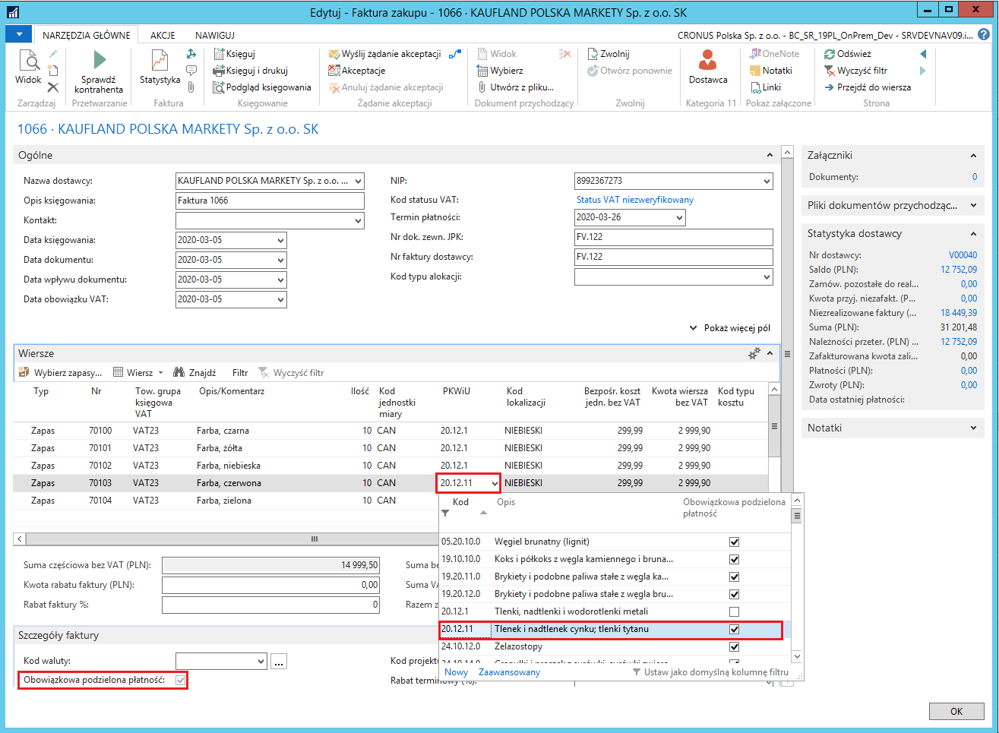{width="6.364583333333333in" height="4.670761154855643in"}
  --------------------------------------------------------------------------------------------------------------------------------------------------------------------
  Rysunek 10.14: Faktura zakupu -- obowiązkowa podzielona płatność

Aby zweryfikować wartości faktury zakupu i zastosowanie mechanizmu
podzielonej płatności, w oknie **Faktura zakupu** należy na wstążce
kliknąć **Statystyka** (można też nacisnąć **F7**).

W wyniku tego działania system weryfikuje kody PKWiU w wierszach faktury
zakupu oraz łączną wartość brutto do zaksięgowania. Na tej podstawie
zaznacza lub nie pole **Obowiązkowa podzielona płatność**.

  ---------------------------------------------
  Rysunek 10.15: Faktura zakupu -- Statystyka
  ---------------------------------------------

> W oknie **Statystyka zakupów**, na wstążce dostępna jest akcja **Zmień
> obowiązkową podzieloną płatność**, której można użyć do ręcznego
> oznaczenia MPP w fakturze zakupu, gdy na podstawie danych nie
> kwalifikuje się ona do obowiązkowej podzielonej płatności (jej wartość
> brutto jest niższa niż 15 000,00 zł lub w wierszach nie ma właściwego
> kodu PKWiU). W wyniku działania tej funkcji, system zaznaczy dwa pola:
> **Obowiązkowa podzielona płatność** i **Obowiązkowa podzielona
> płatność zaznaczona ręcznie** w oknie **Statystyka zakupów**.

{width="0.19in" height="0.19in"}
**Uwaga:** W sytuacji, gdy zmienią się dane faktury np. jej wartość
brutto lub przypisanie kodu PKWiU, ponowne otwarcie okna **Statystyka
zakupów** zweryfikuje obowiązek zastosowania MPP. Weryfikacja
przeprowadzana jest również w wyniku zmiany stanu dokumentu na
**Zwolniony** i podczas jego księgowania.

  ---------------------------------------------
  Rysunek 10.16: Faktura zakupu -- Statystyka
  ---------------------------------------------

{width="0.19in" height="0.19in"}
**Uwaga:** W sytuacji, gdy parametry faktury zakupu kwalifikują ją
do MPP i system zaznaczył automatycznie pole Obowiązkowa podzielona
płatność, nie ma możliwości ręcznej zmiany zaznaczenia tego pola.

> W wyniku użycia akcji **Zmień obowiązkową podzieloną płatność** w
> oknie **Statystyka zakupów** faktury spełniającej kryteria
> obowiązkowej podzielonej płatności, system usunie zaznaczenie pola
> **Obowiązkowa podzielona płatność**, ale podczas kolejnej weryfikacji
> tego dokumentu (przy ponownym otwarciu okna **Statystyka zakupów**,
> lub przy zmianie stanu na **Zwolniony**, lub przy księgowaniu
> dokumentu) pole zostanie ponownie zaznaczone.
>
> Kliknięcie akcji **Zmień obowiązkową podzieloną płatność** w oknie
> **Statystyka zakupów** faktury spełniającej kryteria obowiązkowej
> podzielonej płatności spowoduje wyświetlenie komunikatu
> z ostrzeżeniem:

  {width="4.75in" height="1.84375in"}
  -------------------------------------------------------------
  Rysunek 10.17: Komunikat - informacja

> W celu sprawdzenia przewidywanego efektu księgowania danej faktury
> zakupu, w oknie **Faktura zakupu** należy na wstążce kliknąć **Podgląd
> księgowania**. Dla faktury podlegającej MPP pole **Obowiązkowa
> podzielona płatność** zostanie zaznaczone w księgach pomocniczych:
> **Zapisy VAT** i **Zapisy księgi dostawców**:

  ------------------------------------
  Rysunek 10.18: Podgląd zapisów VAT
  ------------------------------------

  ------------------------------------------------
  Rysunek 10.19: Podgląd zapisów księgi dostawcy
  ------------------------------------------------

> W celu zaksięgowania faktury zakupu, w oknie **Faktura zakupu** należy
> na wstążce kliknąć **Księguj** (można też nacisnąć **F9**). W efekcie
> zaksięgowania faktury podlegającej MPP pole **Obowiązkowa podzielona
> płatność** zostanie zaznaczone w nagłówku zaksięgowanej faktury zakupu
> oraz w księgach pomocniczych: **Zapisy VAT** i **Zapisy księgi
> dostawców**.

  --------------------------------------------
  Rysunek 10.20: Zaksięgowana faktura zakupu
  --------------------------------------------

  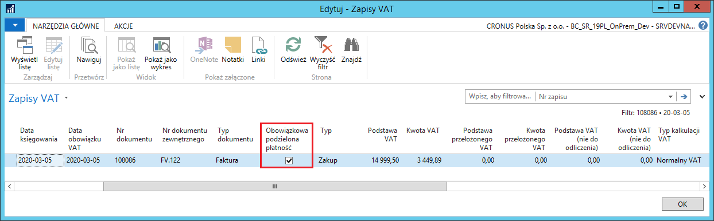{width="6.375in" height="1.9778849518810149in"}
  ---------------------------------------------------------------------------------------------------------------------------------------
  Rysunek 10.21: Zapisy VAT

  ----------------------------------------
  Rysunek 10.22: Zapisy księgi dostawców
  ----------------------------------------

### Ewidencja dokumentów zakupu przez dzienniki

W przypadku wprowadzania dokumentów zakupu przez dzienniki, transakcję
podlegającą mechanizmowi podzielonej płatności należy oznaczyć ręcznie,
wybierając 1 w polu **Ident. zestawu atrybutów VAT**. Dotyczy to również
transakcji objętych obowiązkiem zastosowania tego mechanizmu.

  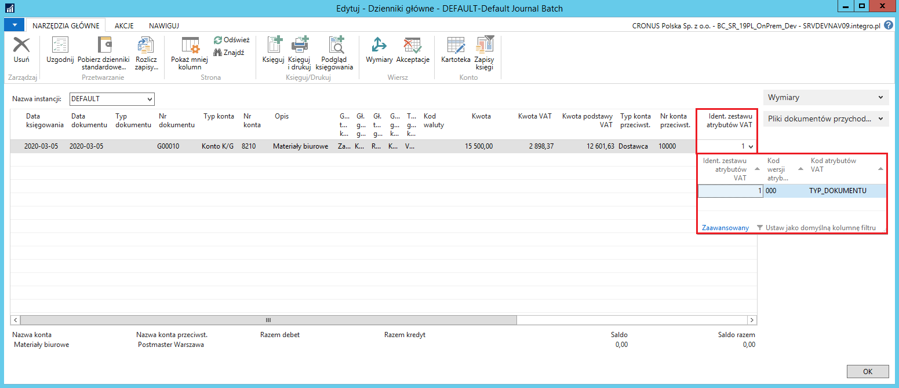{width="6.385416666666667in" height="2.762238626421697in"}
  -------------------------------------------------------------------------------------------------------------------------------------------------------------------------------
  Rysunek 10.23: Dziennik główny

### Zmiana oznaczenia MPP dla zobowiązań

W oknie **Zapisy księgi dostawcy** została dodana możliwość ręcznej
zmiany oznaczenia zobowiązania do zastosowania mechanizmu podzielonej
płatności, co będzie miało wpływ na generowanie przelewu. Aby zmienić
oznaczenie, w oknie **Zapisy księgi dostawcy** należy zaznaczyć wybrany
wiersz, następnie na wstążce należy kliknąć **Zmień obowiązkową
podzieloną płatność**. W wyniku działania tej funkcji zostanie zmienione
zaznaczenie pola **Obowiązkowa podzielona płatność** w wybranym zapisie
księgi dostawcy oraz w powiązanych wierszach w oknie **Zapisy VAT**.

{width="0.19in" height="0.19in"}
**Uwaga:** Zmiana zaznaczenia pola Obowiązkowa podzielona płatność
w oknie **Zapisy księgi dostawcy** możliwa jest tylko dla zapisów, które
mają zaznaczone pole **Otwarte**.

  ----------------------------------------
  Rysunek 10.24: Zapisy księgi dostawców
  ----------------------------------------

Bankowość elektroniczna {#bankowość-elektroniczna-1 .Poziom-1}
-----------------------

### Informacje ogólne

Ulepszenia w ramach Polskiej Lokalizacji systemu Microsoft Dynamics 365
Business Central on‑premises obejmują generowanie przelewów
elektronicznych z  zastosowaniem mechanizmu podzielonej płatności oraz
importowanie wyciągów bankowych z uwzględnieniem odrębnego rachunku
bankowego VAT podatnika.

Oprogramowanie oferowane przez każdy z banków jest inne. Brak standardu
powoduje konieczność zdefiniowania w module Bankowości Elektronicznej
podstawowych cech programu bankowego. W związku z utworzeniem nowych
rachunków bankowych dla podatku VAT i wprowadzenia podzielonej
płatności, wymagane jest utworzenie odrębnych ustawień, a struktura
przelewów w nowym formacie bazuje na dotychczasowym schemacie dla danego
banku.

#### Generowanie przelewów {#generowanie-przelewów .Poziom-2}

### Ustawienia

### Szablony przelewów

Każde konto bankowe, z którego będą wykonywane przelewy w mechanizmie
podzielonej płatności, w związku ze zmianą struktury pliku, musi mieć
utworzony nowy szablon przelewów. Nowy szablon wymaga oznaczenia w polu
**Obowiązkowa podzielona płatność**, przypisania nowej **Metody
płatności** (SPLIT, lub SEPA SPLIT), utworzenia i przypisania nowej
**Instancji dziennika głównego** dla tego rodzaju przelewów.

W celu zdefiniowania nowego szablonu poleceń przelewów, należy wykonać
następujące kroki:

1.  Należy wybrać **Działy \> Zarządzanie Finansami \> Bankowość
    elektroniczna \> Szablony poleceń przelewu**.

2.  W oknie **Szablony poleceń przelewu**, które się otworzy, na wstążce
    > należy wybrać **Nowe**.

3.  W oknie **Kartoteka szablonu poleceń przelewów**, które się otworzy,
    > należy wprowadzić parametry identyczne, jak w dotychczasowym
    > szablonie i uzupełnić ustawienia charakterystyczne dla mechanizmu
    > podzielonej płatności w polach:

-   **Kod metody płatności** -- należy wybrać kod **SPLIT** lub **SEPA
    > SPLIT**,

-   **Obowiązkowa podzielona płatność** -- należy zaznaczyć pole,

-   **Nazwa instancji dziennika głównego** -- należy wybrać dedykowaną
    > instancję dziennika głównego.

  -----------------------------------------------------
  Rysunek 10.25: Kartoteka szablonu poleceń przelewów
  -----------------------------------------------------

Przygotowane zostały funkcje, które na bazie istniejącego szablonu
polecenia przelewu tworzą jego kopię z właściwymi ustawieniami dla
mechanizmu podzielonej płatności.

Aby utworzyć kopię szablonu z ustawieniami dla mechanizmu podzielonej
płatności, należy wykonać następujące kroki:

1.  W oknie **Szablony poleceń przelewu** należy zaznaczyć wiersz z
    wybranym podstawowym szablonem, następnie na wstążce należy kliknąć:

> **Utwórz nowy szablon przelewu bankowego dla podziału płatności**
>
> *(dla szablonu zwykłego)*
>
> *lub*
>
> **Utwórz nowy szablon przelewu bankowego SEPA dla podziału płatności**
>
> (dla struktury SEPA krajowej PLN)

Funkcja tworzy nowy szablon, w którym:

-   w nazwie i opisie dodawane są litery SP (skrót od ang. Split
    Payment),

-   tworzona i przypisywana jest nowa metoda płatności,

-   tworzona i przypisana jest nowa instancja dziennika głównego.

{width="0.19in" height="0.19in"}
**Uwaga:** Funkcje: **Utwórz nowy szablon przelewu bankowego dla
podziału płatności** i **Utwórz nowy szablon przelewu bankowego SEPA dla
podziału płatności** mogą być użyte tylko dla istniejącego, prawidłowo
ustawionego szablonu dla konta bankowego w walucie PLN.

  ------------------------------------------------------------------------
  Rysunek 10.26: Akcje na wstążce w Kartotece szablonu poleceń przelewów
  ------------------------------------------------------------------------

Bazując na takim szablonie można rozpocząć przygotowywanie przelewów
w nowym formacie.

### Definicje schematów wymiany danych

Ustawienia definicji schematów wymiany danych są ustawieniami
zaawansowanymi i przygotowywane są jako predefiniowane i zaimportowane
do systemu lub przygotowywane i korygowane podczas implementacji zmian
w module bankowości elektronicznej.

Informacyjnie, dla każdej **Definicji schematu wymiany danych**
konieczne jest zdefiniowanie nowych ustawień dla metody płatności
**SPLIT** (lub **SEPA SPLIT**), które wykorzystywane są przy generowaniu
właściwej struktury pliku przelewu

  --------------------------------------------------
  Rysunek 10.27: Definicja schematu wymiany danych
  --------------------------------------------------

### Zmiany w Arkuszu płatności do dostawców/nabywców

### Wprowadzanie przelewów odbywa się w oknach Arkusz płatności do dostawców i Arkusz płatności do nabywców, które następnie przenoszone są do dziennika przelewów bankowych, skąd mogą być wyeksportowane do systemu bankowego. Informacje o nich przenoszone są również do zapisów w rejestrach przelewów. 

**Arkusz płatności do dostawców/nabywców dla wybranego Szablonu przelewu
oznaczonego jako Obowiązkowa podzielona płatność został rozszerzony\
o dodatkowe pola i ma poniższą strukturę:**

  ----------------------------------------------
  Rysunek 10.28: Arkusz płatności do dostawców
  ----------------------------------------------

W poniższym zestawieniu wymienione są nowe pola, widoczne tylko dla
szablonu\
z obowiązkową podzieloną płatnością:

  **Nazwa**                                     **Wypełnienie**      **Uwagi**
  --------------------------------------------- -------------------- --------------------------------------------------------------------------------------------------------------------------------------------------------------------------------
  **Opis przelewu bankowego**                    • opcjonalne        pole do wprowadzenia dodatkowego, opcjonalnego opisu przelewu (max. 33 znaki)
  **Kwota VAT polecenia przelewu (PLN)**         \^ obowiązkowe      kwota VAT stanowiąca część kwoty przelewu, która będzie zapłacona w mechanizmie podzielonej płatności; kwota musi być większa od zera i nie może być większa od kwoty przelewu
  **Kwota VAT polecenia przelewu (dziennik)**   **○ automatyczne**   zsumowana kwota VAT wszystkich przelewów dotyczących danego zapisu, znajdujących się w różnych dziennikach
  **Kwota VAT polecenia przelewu (zapisy)**     **○ automatyczne**   zsumowana kwota VAT wszystkich przelewów dotyczących danego zapisu, które zostały już wyeksportowane

W sytuacji, gdy w ewidencji dokumentów zakupu i sprzedaży wykorzystywany
jest moduł *Split Payment Dokumenty*, zapisy księgi dostawcy wyświetlone
w **Arkuszu płatności do dostawców** będą miały zaznaczone pole
**Obowiązkowa podzielona płatność** lub można takie zapisy oznaczyć
ręcznie.

W oknie **Arkusz płatności do dostawców** dodane zostało pole
informacji, w którym dla każdego zapisu podawane są kwoty pozostałe dla
płatności i dla podatku VAT (obliczonego z dokumentu źródłowego). Kwoty
te są sugerowane podczas użycia akcji **Przypisz kwotę polecenia
przelewu**. Jeżeli dokument nie zostanie odnaleziony (np. księgowany z
dziennika), wówczas **Kwotę przelewu VAT** należy wpisać ręcznie.

  -----------------------------------------------------------------
  Rysunek 10.29: Pole informacji w Arkuszu płatności do dostawców
  -----------------------------------------------------------------

{width="0.19in" height="0.19in"}
**Uwaga:** Analogiczne informacje znajdują się w oknie **Arkusz
płatności do nabywców**.

### Obsługa

**Przygotowanie płatności do przelewu**

Moduł **Bankowość elektroniczna** umożliwia automatyczne tworzenie
przelewów dla dostawców lub nabywców. Do automatycznego tworzenia
przelewów służą funkcje znajdujące się w oknach **Arkusz płatności
do dostawców** i **Arkusz płatności do nabywców**.

{width="0.19in" height="0.19in"}
**Uwaga:** Opis generowania przelewów w dalszej części tego rozdziału
bazuje na  **Arkuszu płatności do dostawców.** *Mechanizm generowania
przelewów z Arkusza płatności do nabywców jest identyczny, jak opisany
na przykładzie Arkusza płatności do dostawców, więc należy się na nim
wzorować.*

Wybranie z menu **Arkusza płatności do dostawców** lub **Arkusza
płatności do nabywców**, gdy zdefiniowanych jest klika szablonów poleceń
przelewu, spowoduje wyświetlenie pełnej listy dostępnych szablonów.
Gdy jest tylko jeden szablon, automatycznie otworzy się odpowiednia
strona. Brak szablonów sygnalizowany jest odpowiednim komunikatem.

W przypadku przelewów z mechanizmem podzielonej płatności, z listy
szablonów należy wybierać tylko te, które mają zaznaczone pole
**Obowiązkowa podzielona płatność**.

  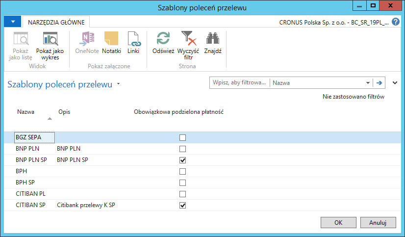{width="6.385416666666667in" height="3.7336953193350833in"}
  -------------------------------------------------------------------------------------
  Rysunek 10.30: Szablony poleceń przelewu

Po wybraniu szablonu wyświetlona zostanie lista zapisów księgi
dostawców/nabywców, wyfiltrowana według waluty konta bankowego
zdefiniowanego w szablonie polecenia przelewu. W przypadku zaznaczenia
opcji **Dozwolona inna waluta przelewu** w szablonie polecenia przelewu,
filtr ten nie jest stosowany.

W przypadku wypełnienia pola **Kod konta bank. dostawcy** są trzy
możliwości:

-   gdy konto bankowe dostawcy zostało wcześniej wybrane z listy,
    > wpisanie wartości w polu **Kwota polecenia przelewu** niczego nie
    > zmienia,

-   gdy pole **Kod konta bank. dostawcy** nie jest wypełnione, wpisanie
    > wartości w polu **Kwota polecenia przelewu** powoduje wybranie
    > domyślnego konta bankowego dostawcy,

-   gdy żadne konto bankowe dostawcy nie zostało oznaczone jako
    > domyślne, pojawi się błąd i wymagane będzie ręczne uzupełnienie
    > pola **Kod konta bank. dostawcy**.

W **Arkuszu płatności do dostawców** wystarczy uzupełnić pola **Kwota
polecenia przelewu i Kwota VAT polecenia przelewu (PLN)**. Istnieją trzy
sposoby uzupełnienia pola **Kwota polecenia przelewu**:

1)  Ręczne wprowadzanie kwoty

Użytkownik może ręcznie wpisać kwotę w polach **Kwota polecenia
przelewu**\
i **Kwota VAT polecenia przelewu (PLN)**. Zostaną one zweryfikowane pod
kątem poprawności:

-   wpisanie kwoty większej od **Kwoty pozostałej** spowoduje błąd,

-   wpisanie kwoty większej od **Kwoty pozostałej** pomniejszonej o już
    > zdefiniowane lub wyeksportowane przelewy wywoła komunikat
    > z informacją o błędzie. Od decyzji użytkownika zależeć będzie, czy
    > dana kwota zostanie przypisana, czy też nie,

-   wpisanie **Kwoty VAT polecenia przelewu (PLN)** większej niż **Kwota
    > polecenia przelewu** spowoduje błąd,

-   niewpisanie **Kwoty VAT polecenia przelewu (PLN)** spowoduje, że
    > dany przelew nie zostanie utworzony w tym szablonie, należy go
    > utworzyć w szablonie dla normalnego przelewu.

2)  Automatyczne wprowadzanie kwoty

Przypisana zostanie kwota równa **Kwocie pozostałej** pomniejszonej
o już zdefiniowane lub wyeksportowane przelewy, także **Kwota VAT
polecenia przelewu (PLN)** zostanie odpowiednio uzupełniona. Można
to uczynić zarówno dla jednego, jak i wielu wierszy, przy użyciu funkcji
**Przypisz kwotę polecenia przelewu (można też nacisnąć F9)**. Pola
**Szablon przelewu i Metoda płatności** zostaną wypełnione
automatycznie, zgodnie z parametrami przypisanymi do wybranego szablonu.

  ------------------------------------------------------------
  Rysunek 10.31: Akcje w oknie Arkusz płatności do dostawców
  ------------------------------------------------------------

Do 30.10.2019 nie było możliwości grupowania przelewów dla mechanizmu
podzielonej płatności, jeden przelew odpowiadał jednej fakturze. Od
1.11.2019 możliwa jest zapłata zbiorcza z wykorzystaniem mechanizmu
podzielonej płatności, gdy spełnione są odpowiednie warunki, czyli
przelew dotyczy zobowiązań z tytułu wszystkich faktur od danego dostawcy
za wybrany okres (nie dłuższy niż miesiąc), wówczas w opisie zamiast
numeru faktury podawany jest okres*.* W przypadku zapłaty zaliczki, w
polu numer faktury podawany jest tekst „zaliczka".

Podczas przypisywania kwoty przelewu, w przypadku wybrania pierwszego
zapisu dostawcy, który ma więcej otwartych zobowiązań, zostanie
wyświetlony komunikat.

  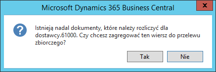{width="4.552083333333333in" height="1.53125in"}
  --------------------------------------------------------------------------
  Rysunek 10.32. Okno komunikatu

Po kliknięciu **Tak** -- zapis zostanie oznaczony jako **Zapisy do
agregacji** i zostanie wyświetlony komunikat informacyjny.

  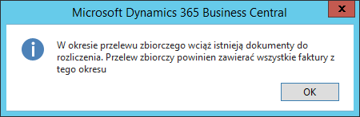{width="4.6875in" height="1.53125in"}
  ---------------------------------------------------------------
  Rysunek 10.33. Okno komunikatu

Po kliknięciu **Nie** -- dla danej faktury utworzony zostanie pojedynczy
przelew.

W przypadku wybrania kolejnego zapisu do przelewu dla tego samego
dostawcy, otrzymamy komunikat z pytaniem.

  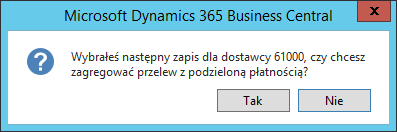{width="4.135416666666667in" height="1.375in"}
  ------------------------------------------------------------------------
  Rysunek 10.34. Okno komunikatu

Po kliknięciu **Tak** system sprawdzi, czy okres pomiędzy najstarszą i
najnowszą fakturą nie jest dłuższy niż miesiąc, czy w tym okresie nie
było już innych rozliczonych faktur oraz poda informację, jeżeli są
jeszcze inne faktury w tym okresie do rozliczenia. Jeżeli warunki będą
spełnione, zapisy zostaną oznaczone jako **Zapisy do agregacji**.

Po kliknięciu **Nie** -- dla danej faktury utworzony zostanie pojedynczy
przelew.

  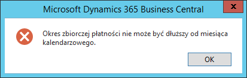{width="4.302083333333333in" height="1.375in"}
  ------------------------------------------------------------------------
  Rysunek 10.35. Okno komunikatu
  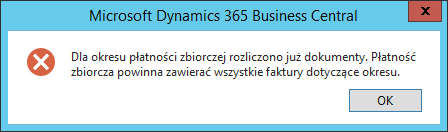{width="4.666666666666667in" height="1.375in"}
  Rysunek 10.36. Okno komunikatu

Nie są też dozwolone częściowe zapłaty.

  -------------------------------------
  Rysunek 10.37. Informacja o błędzie
  -------------------------------------

W przygotowanym przelewie dla kilku faktur w opisie przelewu zamiast
numeru faktury pojawi się okres jako np. 01.11.2019 do 15.11.2019 lub
pojedyncza data w przypadku zapłaty kilku faktur z tą samą datą
wystawienia.

**Przelew dotyczący zaliczki**

W przypadku płatności z tytułu zaliczki, należy w oknie **Arkusz
płatności do dostawców** zaznaczyć pole **Zaliczka** w wierszu z
wybranym zapisem księgi dostawcy. W opisie przelewu, zamiast numeru
faktury, pojawi się wyraz „zaliczka".

  ----------------------------------------------
  Rysunek 10.38: Arkusz płatności do dostawców
  ----------------------------------------------

**Przekazanie przelewów do dziennika przelewów**

Po uzupełnieniu danych w wybranych wierszach **Arkusza płatności
do dostawców** można przekazać je do **Dziennika przelewów**. W tym
celu, w oknie **Arkusz płatności do dostawców**, należy na wstążce
kliknąć **Wyślij do dziennika przelewów**.

  ------------------------------------------------------------
  Rysunek 10.39: Akcje w oknie Arkusz płatności do dostawców
  ------------------------------------------------------------

Pojawi się komunikat z pytaniem, z jaką datą utworzyć przelewy.

  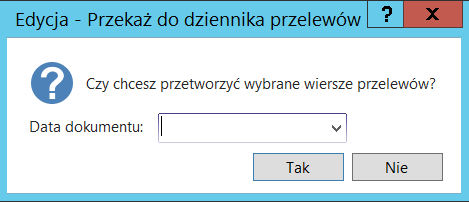{width="3.908333333333333in" height="1.6833333333333333in"}
  -------------------------------------------------------------------------------------
  Rysunek 10.40. Okno komunikatu

System utworzy przelewy, a efekt można będzie zobaczyć w odpowiednim
**Dzienniku przelewów**. Najprostszym sposobem przejścia do **Dziennika
przelewów** jest kliknięcie akcji **Dziennik płatności** na wstążce w
oknie **Arkusz płatności do dostawców**.

Podczas tworzenia przelewów sprawdzane są wymagane pola, m.in. NIP
dostawcy (nabywcy). Wartość jest pobierana z kartoteki dostawcy
(nabywcy) i w przypadku poniższego komunikatu wystarczy uzupełnić NIP w
kartotece dostawcy (nabywcy):

  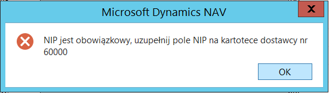{width="4.24071084864392in" height="1.2083333333333333in"}
  ------------------------------------------------------------------------------------
  Rysunek 10.41: Okno komunikatu

W oknie **Dziennik przelewów bankowych**, najważniejszą informacją\
dla mechanizmu podzielonej płatności jest zawartość pola **Wiadomość
dla odbiorcy** wysyłana jako tytuł przelewu. Musi ona zawierać kwotę
VAT, NIP i numer faktury w odpowiedniej strukturze:

**/VAT/10n,2n / IDC/14x / INV/35x / TXT/33x**

gdzie: **n**- liczba naturalna, **x** -- dowolny znak, **VAT** -- kwota
VAT, **IDC** - NIP dostawcy, **INV** -numer jednej faktury, **TXT** --
dowolny tekst o długości 33 znaków

Pole to nie jest edytowalne, w przypadku błędnych danych należy wiersz
usunąć\
i wygenerować ponownie przelew.

  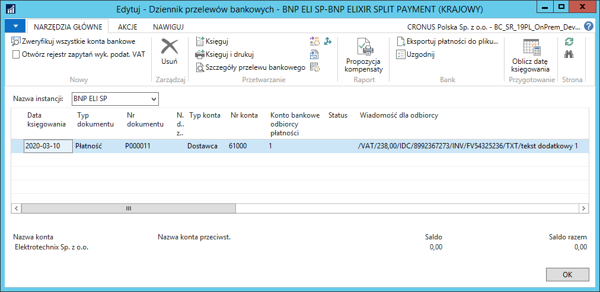{width="6.295141076115486in" height="3.0729166666666665in"}
  -------------------------------------------------------------------------------------
  Rysunek 10.42: Dziennik przelewów bankowych

**Wyeksportowanie płatności do pliku**

**Wariant 1**

W oknie **Dziennik przelewów bankowych**, po sprawdzeniu wierszy, należy
na wstążce kliknąć **Eksportuj płatności do pliku**.

  ---------------------------------------------
  Rysunek 10.43: Dziennik przelewów bankowych
  ---------------------------------------------

W wyświetlonym oknie **Eksportuj plik** należy kliknąć przycisk
**Zapisz** i wybrać katalog, w którym zostanie zapisany plik. Następnie
plik należy przekazać do banku.

  --------------------------------
  Rysunek 10.44: Okno komunikatu
  --------------------------------

**Wariant 2**

W oknie **Arkusz płatności do dostawców** można bezpośrednio
wyeksportować plik płatności pomijając krok sprawdzania w **Dzienniku
przelewów bankowych**. W tym celu, w oknie **Arkusz płatności do
dostawców**, należy na wstążce kliknąć **Eksportuj przelewy do pliku.**

  ----------------------------------------------
  Rysunek 10.45: Arkusz płatności do dostawców
  ----------------------------------------------

Zostanie wyświetlony komunikat z pytaniem, z jaką datą utworzyć przelew:

  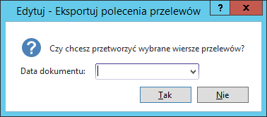{width="3.9375in" height="1.7291666666666667in"}
  --------------------------------------------------------------------------
  Rysunek 10.46: Okno komunikatu

System przygotuje przelewy, a następnie wyświetli okno **Eksportuj
plik**. W wyświetlonym oknie **Eksportuj plik** należy kliknąć przycisk
**Zapisz** i wybrać katalog, w którym zostanie zapisany plik. Następnie
plik należy przekazać do banku.

  -------------------------------
  Rysunek 4.47: Okno komunikatu
  -------------------------------

**Rejestry przelewów**

Wyeksportowane przelewy są przechowywane w rejestrach. W oknie rejestrów
przelewy można wyświetlać na ekranie, ponownie wyeksportować plik
lub podejrzeć szczegóły przelewu.

Rejestry zostały rozszerzone o **Kwotę VAT przelewu**, również ta kwota
jest zapisywana aktualnie w rejestrach.

#### Import wyciągów bankowych {#import-wyciągów-bankowych-1 .Poziom-2}

### Ustawienia

Wyciągi bankowe są dostępne w banku zarówno dla konta podstawowego,
jak i konta pomocniczego VAT. Z rachunku VAT nie ma możliwości
wykonywania żadnych własnych przelewów, zapisy na tym koncie związane są
tylko z automatycznym przeksięgowywaniem kwot podatku VAT na konto
podstawowe i z konta podstawowego. W związku z powyższym, przyjęte
zostały dwa warianty wprowadzania wyciągów dla konta pomocniczego VAT do
systemu Microsoft Dynamics 365 Business Central on‑premises:

1.  Dla konta VAT utworzone może być tylko odrębne konto K/G, a
    księgowanie będzie dokonywane tylko bezpośrednio na to konto. W
    takim przypadku importowany do systemu jest tylko wyciąg z konta
    podstawowego, a transakcje pomiędzy kontem VAT i kontem podstawowym
    księgowane są na konto K/G pobierane z ustawień.

2.  Dla konta VAT utworzone może być odrębne konto K/G i nowe konto
    bankowe (powiązane z tym kontem K/G). W takim przypadku importowane
    do systemu są oba wyciągi: z konta podstawowego i z konta VAT, a
    transakcje pomiędzy kontem VAT i kontem podstawowym księgowane są
    przez konto środków pieniężnych w drodze (konto K/G), pobierane z
    ustawień.

Aby zdefiniować ustawienia w wybranym wariancie dla konta VAT, należy
wykonać następujące kroki:

1.  Należy wybrać **Działy \> Zarządzanie finansami \> Zarządzanie
    środkami pieniężnymi \> Konta bankowe**.

2.  W oknie **Konta bankowe**, które się otworzy, należy zaznaczyć
    wiersz z kontem podstawowym, następnie na wstążce kliknąć
    **Edytuj**.

3.  W oknie **Kartoteka konta bankowego**, które się otworzy, na wstążce
    należy kliknąć **Ustawienia kont VAT dla podziału płatności**.

  ------------------------------------------
  Rysunek 10.48: Kartoteka konta bankowego
  ------------------------------------------

**Wariant 1**

W przypadku wyboru pierwszej metody księgowania wyciągów bankowych
z mechanizmem podzielonej płatności, należy uzupełnić pola:

-   **IBAN Konta bankowego VAT**

-   **Konto K/G dla konta bankowego VAT**

  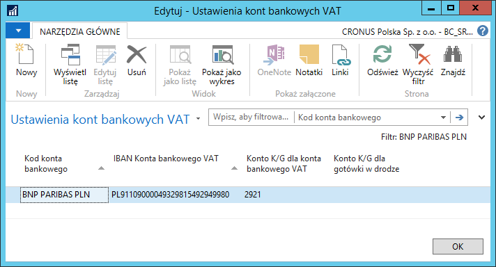{width="6.302083333333333in" height="3.3988156167979002in"}
  -------------------------------------------------------------------------------------
  Rysunek 10.49: Ustawienia kont bankowych VAT

**Wariant 2**

W drugim przypadku, gdy importowane będą oba wyciągi, należy uzupełnić
pola:

-   **IBAN Konta bankowego VAT**

-   **Konto K/G dla gotówki w drodze**

Ustawienie takie należy zdefiniować zarówno dla kartoteki konta
bankowego podstawowego, jak i dla kartoteki konta bankowego VAT.

  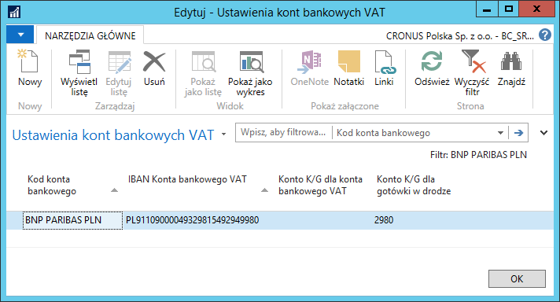{width="6.375in" height="3.438140857392826in"}
  ------------------------------------------------------------------------
  Rysunek 10.50: Ustawienia kont bankowych VAT -- dla konta podstawowego

  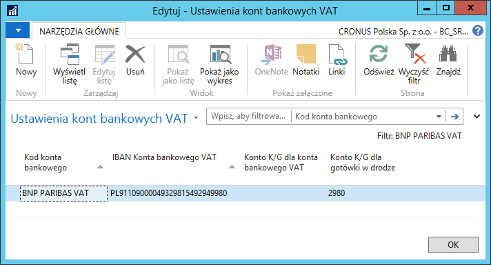{width="6.364583333333333in" height="3.432522965879265in"}
  ------------------------------------------------------------------------------------
  Rysunek 10.51: Ustawienia kont bankowych VAT -- dla konta VAT

### Obsługa

Moduł **Bankowość elektroniczna** umożliwia import pliku z wyciągami
bankowymi, zarówno do konta podstawowego, jak i konta VAT
oraz ich automatyczne rozliczenie z otwartymi zapisami księgi
dostawców/nabywców.

Aby zaimportować wybrany wyciąg bankowy, należy wykonać następujące
kroki:

1.  Należy wybrać **Działy \> Zarządzanie finansami \> Bankowość
    elektroniczna \> Dziennik wyciągów bankowych**.

2.  Należy wybrać właściwy szablon i/lub instancję dziennika głównego.

3.  W oknie **Dziennik wyciągów bankowych**, które się otworzy, należy
    na wstążce kliknąć **Importuj wyciąg bankowy.**

4.  W  oknie, które się otworzy, należy wskazać plik bankowy
    do zaimportowania i zatwierdzić klikając przycisk **OK**.

System zaimportuje pozycje wyciągu bankowego do wierszy dziennika
wyciągów bankowych. Jeśli kartoteka dostawcy/nabywcy posiada
zdefiniowane konta bankowe, system wprowadzi właściwego dostawcę/nabywcę
w wierszu dziennika. Jeśli natomiast nie zostanie znaleziona taka
referencja, użytkownik powinien ręcznie uzupełnić pola **Typ konta**
oraz **Nr konta** w każdym wierszu dziennika wyciągu bankowego.
Pozostałe pola, przy braku błędów w czasie importu, system uzupełnia
automatycznie.

W przypadku mechanizmu podzielonej płatności przeksięgowania wewnętrzne
pomiędzy kontem podstawowym, a kontem VAT zostaną przypisane do konta
K/G wynikającego z ustawień (albo bezpośrednio konto K/G dla VAT, albo
konto K/G dla środków pieniężnych w drodze).

  {width="6.356393263342082in" height="2.7272725284339456in"}
  -------------------------------------------------------------------------------------
  Rysunek 10.52: Dziennik wyciągów bankowych

  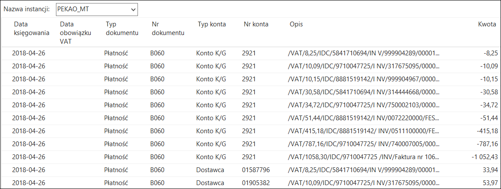{width="6.255859580052493in" height="2.3666666666666667in"}
  -------------------------------------------------------------------------------------
  Rysunek 10.53: Dziennik wyciągów bankowych

W dzienniku, po zaimportowaniu wyciągu bankowego, można również
rozliczyć poszczególne wiersze wyciągu z zapisami (dokumentami), na
podstawie których utworzony został odpowiedni przelew, wybierając
na wstążce akcję **Rozlicz automatycznie**. Wykorzystuje ona
identyfikator zdefiniowany w procesie eksportu przelewów do określenia
konkretnych zapisów księgi nabywcy/dostawcy. Określanie konkretnych
zapisów odbywa się na podstawie rejestru.

Po poprawnym uzupełnieniu wierszy **Dziennika wyciągów bankowych**
i rozliczeniu zapisów, należy zaksięgować dziennik klikając na wstążce
akcję **Księguj (można też nacisnąć F9)**.
