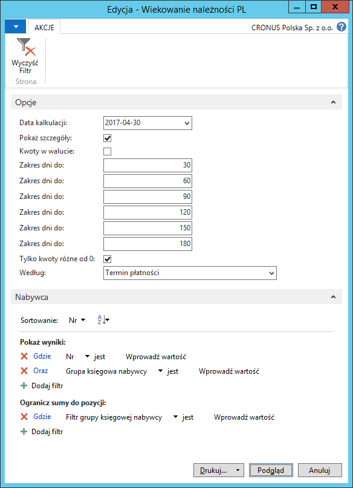
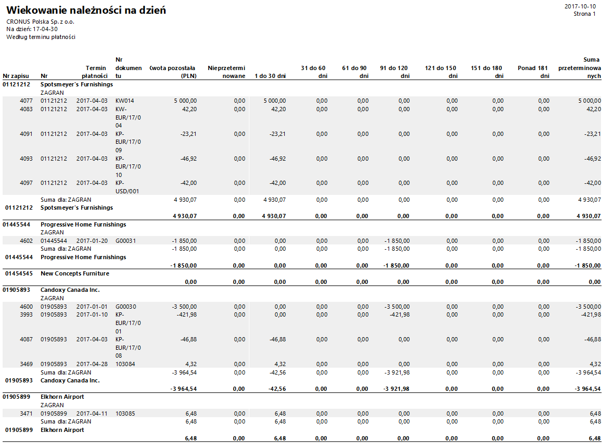
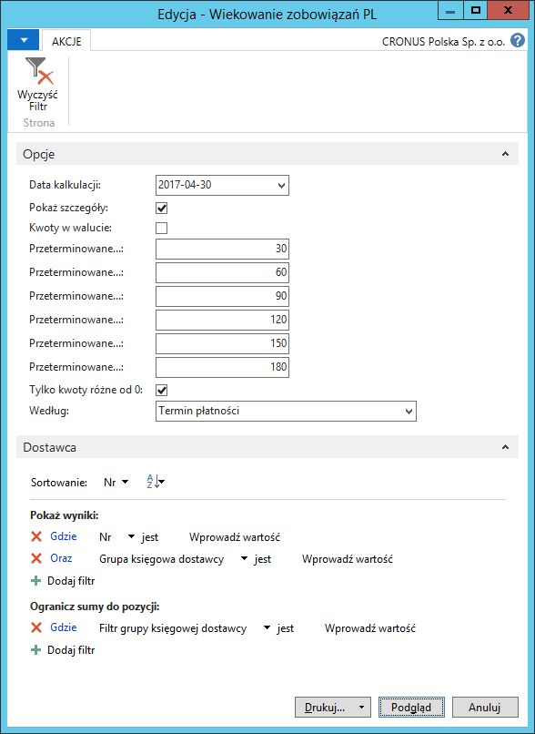
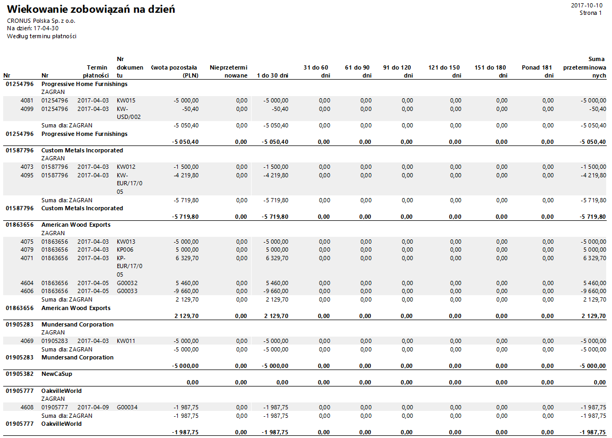

# Wiekowanie należności/zobowiązań w zadanych okresach

## Informacje ogólne

W ramach Polskiej Lokalizacji systemu Microsoft Dynamics 365 Business Central on‑premises dostępne są raporty Wiekowanie należności i Wiekowanie zobowiązań. Prezentują one należności i zobowiązania w sześciu dowolnie wybranych okresach, do wyboru, według daty płatności lub daty księgowania. 

## Obsługa

W celu przygotowania i wydrukowania raportu **Wiekowanie należności**,
należy postępować według następujących kroków:

1.  Należy wybrać **Działy \> Zarządzanie Finansami \> Należności \>
    Wiekowanie należności PL**.

2.  W oknie wstępnym raportu, które się otworzy, na karcie skróconej
    **Nabywca** można ustawić filtry w celu ograniczenia danych
    prezentowanych w raporcie, ale nie jest to obowiązkowe.

    Na karcie skróconej **Opcje** należy odpowiednio wypełnić
    lub zaznaczyć wymagane pola:
    
    -   **Data kalkulacji** – w tym polu należy wprowadzić datę, w stosunku
        do której będą liczone dni przeterminowania należności.
    
    -   **Pokaż szczegóły** – zaznaczenie tego pola spowoduje,
        że w raporcie dla każdego nabywcy zostaną wyświetlone poszczególne
        zapisy składające się na saldo jego należności.
    
    -   **Kwoty w walucie** – zaznaczenie tego pola spowoduje,
        że w raporcie zostaną wyświetlone kwoty w walutach źródłowych,
        w przeciwnym wypadku w raporcie wykazana jest ich równowartość
        w złotych polskich.
    
    -   **Przeterm. do** – w polu tym należy wpisać maksymalną ilość dni
        przeterminowania należności; istnieje 6 pól o nazwie **Przeterm.
        do**, w których należy wpisać 6 kolejnych okresów
        przeterminowania, wszystkie pola muszą być uzupełnione.
    
    -   **Tylko kwoty różne od 0** – zaznaczenie tego pola powoduje,
        że w raporcie zostaną wyświetlone tylko te zapisy, które w co
        najmniej jednej kolumnie będą mieć wyświetloną kwotę różną od 0.
        Pole **Tylko kwoty różne od 0** jest edytowalne tylko wtedy,
        gdy zaznaczone jest pole **Pokaż szczegóły**.
    
    -   **Według** – z lity rozwijanej w tym polu należy wybrać jedną
        z dostępnych opcji:
    
        -   **Data płatności** – wybór tej opcji spowoduje, że ilość dni
            przeterminowania należności będzie liczona jako ilość dni,
            która upłynęła od daty płatności należności do daty wprowadzonej
            w polu **Data kalkulacji**. Ilość dni obliczona w ten sposób
            wskaże, do którego z 6 okresów ustawionych w polach **Przeterm.
            do **powinna być przyporządkowana należność.
        
        -   **Data księgowania** – wybór tej opcji spowoduje, że ilość dni
            przeterminowania należności będzie liczona jako ilość dni,
            która upłynęła od daty księgowania należności do daty wprowadzonej
            w polu **Data kalkulacji**. Ilość dni obliczona w ten sposób
            wskaże, do którego z 6 okresów ustawionych w polach **Przeterm.
            do **powinna być przyporządkowana należność.

  

3.  Po wprowadzeniu właściwych parametrów, należy wybrać **Drukuj**
    w celu wydrukowania raportu lub **Podgląd** w celu wyświetlenia
    raportu na ekranie:

  

>[!NOTE]
>W raporcie **Wiekowanie należności** zapisy każdego nabywcy
są grupowane i sumowane według grup księgowych, niezależnie, czy
zostało zaznaczone pole **Pokaż szczegóły**, czy nie.

W celu przygotowania i wydrukowania raportu **Wiekowanie zobowiązań**,
należy postępować według następujących kroków:

1.  Należy wybrać **Działy \> Zarządzanie Finansami \> Zobowiązania \>
    Wiekowanie zobowiązań PL**.

2.  W oknie wstępnym raportu, które się otworzy, na karcie skróconej
    **Dostawca** można ustawić filtry w celu ograniczenia danych
    prezentowanych w raporcie, ale nie jest to obowiązkowe.

    Na karcie skróconej **Opcje** należy odpowiednio wypełnić
    lub zaznaczyć wymagane pola:
    
    -   **Data kalkulacji** – w tym polu należy wprowadzić datę, w stosunku
        do której będą liczone dni przeterminowania zobowiązań.
    
    -   **Pokaż szczegóły** – zaznaczenie tego pola spowoduje,
        że w raporcie dla każdego dostawcy zostaną wyświetlone
        poszczególne zapisy składające się na saldo jego zobowiązań.
    
    -   **Kwoty w walucie** – zaznaczenie tego pola spowoduje,
        że w raporcie zostaną wyświetlone kwoty w walutach źródłowych,
        w przeciwnym wypadku w raporcie wykazana jest ich równowartość
        w złotych polskich.
    
    -   **Przeterm. do** – w polu tym należy wpisać maksymalną ilość dni
        przeterminowania zobowiązań; istnieje 6 pól o nazwie **Przeterm.
        do**, w których należy wpisać 6 kolejnych okresów
        przeterminowania, wszystkie pola muszą być uzupełnione.
    
    -   **Tylko kwoty różne od 0** – zaznaczenie tego pola powoduje,
        że w raporcie zostaną wyświetlone tylko te zapisy, które w co
        najmniej jednej kolumnie będą mieć wyświetloną kwotę różną od 0.
        Pole **Tylko kwoty różne od 0** jest edytowalne tylko wtedy,
        gdy zaznaczone jest pole **Pokaż szczegóły**.
    
    -   **Według** – z lity rozwijanej w tym polu należy wybrać jedną
        z dostępnych opcji:
    
        -   **Data płatności** – wybór tej opcji spowoduje, że ilość dni
            przeterminowania zobowiązania będzie liczona jako ilość dni,
            która upłynęła od daty płatności zobowiązania do daty wprowadzonej
            w polu **Data kalkulacji**. Ilość dni obliczona w ten sposób
            wskaże, do którego z 6 okresów ustawionych w polach **Przeterm.
            do **powinno być przyporządkowane zobowiązanie.
        
        -   **Data księgowania** – wybór tej opcji spowoduje, że ilość dni
            przeterminowania zobowiązania będzie liczona jako ilość dni,
            która upłynęła od daty księgowania zobowiązania do daty
            wprowadzonej w polu **Data kalkulacji**. Ilość dni obliczona w ten
            sposób wskaże, do którego z 6 okresów ustawionych w polach
            **Przeterm. do **powinno być przyporządkowane zobowiązanie.

  

3.  Po wprowadzeniu właściwych parametrów, należy wybrać **Drukuj**
    w celu wydrukowania raportu lub **Podgląd** w celu wyświetlenia
    raportu na ekranie:

  

>[!NOTE]
>W raporcie **Wiekowanie zobowiązań** zapisy każdego
dostawcy są grupowane i sumowane według grup księgowych, niezależnie,
czy zostało zaznaczone pole **Pokaż szczegóły**, czy nie.