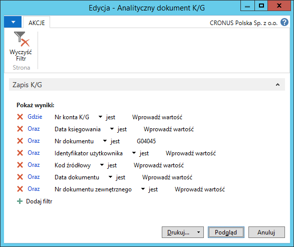
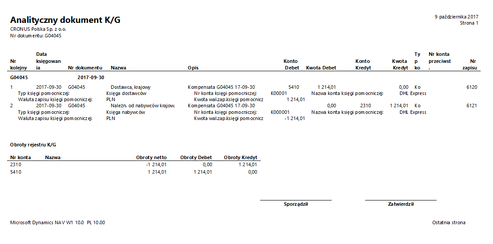

# Analityczny dokument K/G

## Informacje ogólne

W ramach Polskiej Lokalizacji systemu Microsoft Dynamics 365 Business Central on‑premises dostępny jest raport Analityczny dokument K/G, który jest niemal identyczny jak raport Analityczny rejestr K/G. Są dwie różnice pomiędzy tymi dwoma raportami:

-   Dane do raportu wybierane są poprzez definiowanie filtrów na różnych poziomach, przy czym raport **Analityczny dokument K/G** daje większe możliwości filtrowania. 

-   W nagłówku raportu **Analityczny rejestr K/G** drukowane są informacje źródłowe o zaksięgowanej transakcji, co w drugim raporcie jest niedostępne.

## Obsługa

W celu przygotowania i wydrukowania raportu **Analityczny dokument
K/G**, należy postępować według następujących kroków:

1.  Należy wybrać **Działy \> Zarządzanie Finansami \> Księga główna \>
    Analityczny dokument K/G**.

2.  W oknie wstępnym raportu, które się otworzy, należy w polach
    na karcie skróconej **Zapis K/G** filtry w celu ograniczenia
    zakresu drukowanych danych, np. wpisać numer jednego wybranego
    dokumentu w polu **Nr dokumentu**:

  

3.  Po wprowadzeniu właściwych filtrów należy wybrać **Drukuj** w celu
    wydrukowania raportu lub **Podgląd** w celu wyświetlenia raportu
    na ekranie:

  