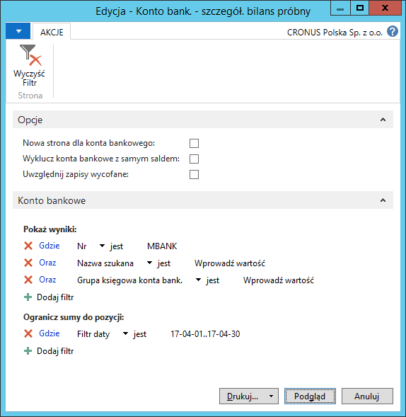

# Konto bankowe - szczegółowy bilans próbny 

## Informacje ogólne

Raport **Konto bankowe – szczegółowy bilans próbny** prezentuje szczegóły transakcji zaksięgowanych na wybranych kontach bankowych. Raport ten może być wykorzystany przy zamknięciu okresu obrachunkowego lub roku finansowego. W ramach Polskiej Lokalizacji systemu Microsoft Dynamics 365 Business Central on‑premises wydruk raportu został rozszerzony o kolumny kwot debet i kredyt.

## Obsługa

W celu przygotowania i wydrukowania raportu **Konto bankowe –
szczegółowy bilans próbny**, należy postępować według następujących
kroków:

1.  Należy wybrać **Działy \> Zarządzanie Finansami \> Zarządzanie
    środkami pieniężnymi \> Konto bank. – szczegół. bilans próbny**.

2.  W oknie wstępnym raportu, które się otworzy, należy wypełnić
    na karcie skróconej **Konto bankowe** pole **Filtr daty**
    wprowadzając w nim okres objęty raportem. W razie potrzeby można
    wypełnić inne pola w celu ograniczenia danych ujętych w raporcie.

    Na karcie skróconej **Opcje** należy zaznaczyć właściwe pola:

    -   **Nowa strona dla konta bankowego** – zaznaczenie tego pola
        spowoduje, że każde konto bankowe zostanie wydrukowane na odrębnej
        stronie.
    
    -   **Wyklucz konta bankowe z samym saldem** – zaznaczenie tego pola
        spowoduje, że w raporcie zostaną pominięte konta bankowe,
        które mają saldo, ale nie mają zapisów w okresie wybranym w polu
        **Filtr daty**.
    
    -   **Uwzględnij zapisy wycofane** – zaznaczenie tego pola spowoduje,
        że w raporcie zostaną wydrukowane również zapisy, które zostały
        wycofane.

  

3.  Po wprowadzeniu właściwych filtrów należy wybrać **Drukuj** w celu
    wydrukowania raportu lub **Podgląd** w celu wyświetlenia raportu
    na ekranie:

  