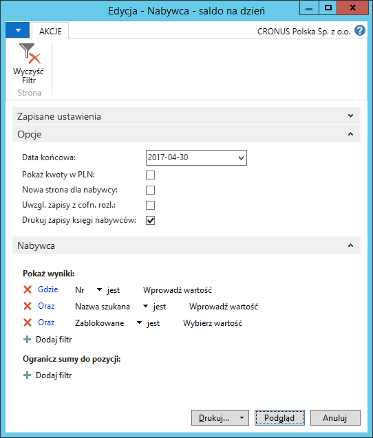
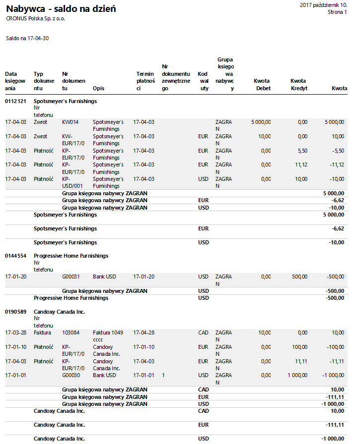
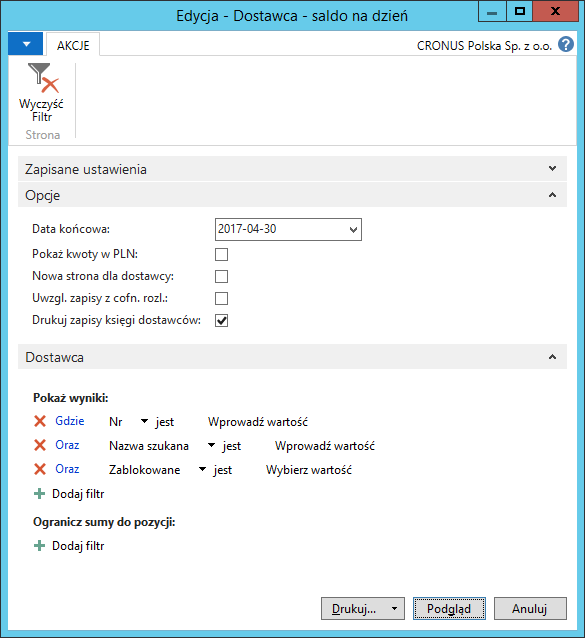
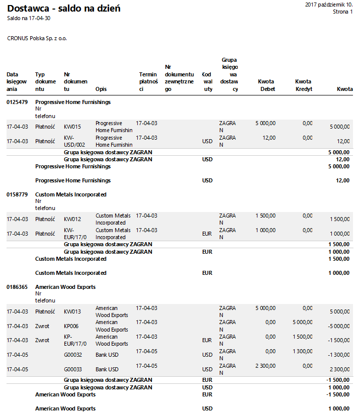

# Nabywca/dostawca - saldo na dzień

## Informacje ogólne

Raporty **Nabywca – saldo na dzień** oraz **Dostawca – saldo na dzień** zapewniają uzyskanie dokładnych i pełnych informacji o saldach należności i zobowiązań. Raporty mogą być wykorzystane przy zamknięciu okresu obrachunkowego lub roku finansowego. W ramach Polskiej Lokalizacji systemu Microsoft Dynamics 365 Business Central on‑premises raporty zostały rozszerzone o obsługę zaliczek oraz zastępczych grup księgowych (wielu kont należności lub zobowiązań).

## Obsługa

W celu przygotowania i wydrukowania raportu **Nabywca – saldo
na dzień**, należy postępować według następujących kroków:

1.  Należy wybrać **Działy \> Zarządzanie Finansami \> Należności \>
    Nabywca – saldo na dzień**.

2.  W oknie wstępnym raportu, które się otworzy, na karcie skróconej
    **Opcje** należy odpowiednio wypełnić wymagane pola:

    -   **Data końcowa** – w tym polu należy wprowadzić datę, na jaką mają
        zostać skalkulowane salda nabywców.
    
    -   **Pokaż kwoty w PLN** – to pole należy zaznaczyć, jeśli w raporcie
        mają być wyświetlone kwoty w złotych polskich jako równowartość
        należności zaksięgowanych pierwotnie w walucie obcej.
    
    -   **Nowa strona dla nabywcy** – zaznaczenie tego pola spowoduje,
        że należności każdego nabywcy zostaną wydrukowane na oddzielnych
        stronach raportu.
    
    -   **Uwzgl. zapisy z cofn. rozl.** – zaznaczenie tego pola spowoduje,
        że na raporcie zostaną wykazane również te należności, które były
        już rozliczone, ale ich rozliczenie zostało cofnięte.
    
    -   **Drukuj zapisy księgi nabywców** – zaznaczenie tego pola
        spowoduje, że na raporcie zostaną wykazane zapisy, z
        których składa się saldo należności. Niezaznaczenie tego pola
        spowoduje, że dla każdego nabywcy zostanie wyświetlone saldo
        należności w podziale na grupy księgowe (konta należności).

3.  Na karcie skróconej **Nabywca** można ustawić filtry w celu
    ograniczenia danych prezentowanych w raporcie, ale nie jest
    to obowiązkowe.

  

4.  Po zaznaczeniu właściwych opcji i wprowadzeniu właściwego filtru
    okresu, należy wybrać **Drukuj** w celu wydrukowania raportu
    lub **Podgląd** w celu wyświetlenia raportu na ekranie:

  

>[!NOTE]
>W raporcie **Nabywca – saldo na dzień** zapisy każdego
 nabywcy są grupowane według (w następującej kolejności): kodu waluty,
 grupy księgowej oraz typu dokumentu.

W celu przygotowania i wydrukowania raportu **Dostawca – saldo
na dzień**, należy postępować według następujących kroków:

1.  Należy wybrać **Działy \> Zarządzanie Finansami \> Zobowiązania \>
    Dostawca – saldo na dzień**.

2.  W oknie wstępnym raportu, które się otworzy, na karcie skróconej
    **Opcje** należy odpowiednio wypełnić wymagane pola:

    -   **Data końcowa** – w tym polu należy wprowadzić datę, na jaką mają
        zostać skalkulowane salda dostawców.
    
    -   **Pokaż kwoty w PLN** – to pole należy zaznaczyć, jeśli w raporcie
        mają być wyświetlone kwoty w złotych polskich jako równowartość
        zobowiązań zaksięgowanych pierwotnie w walucie obcej.
    
    -   **Nowa strona dla dostawcy** – zaznaczenie tego pola spowoduje,
        że zobowiązania każdego dostawcy zostaną wydrukowane
        na oddzielnych stronach raportu.
    
    -   **Uwzgl. zapisy z cofn. rozl.** – zaznaczenie tego pola spowoduje,
        że na raporcie zostaną wykazane również te zobowiązania,
        które były już rozliczone ale ich rozliczenie zostało cofnięte.
    
    -   **Drukuj zapisy księgi dostawców** – zaznaczenie tego pola
        spowoduje, że na raporcie zostaną wykazane zapisy, z
        których składa się saldo zobowiązań. Niezaznaczenie tego pola
        spowoduje, że dla każdego dostawcy zostanie wyświetlone saldo
        zobowiązań w podziale na grupy księgowe (konta zobowiązań).

3.  Na karcie skróconej **Dostawca** można ustawić filtry w celu
     ograniczenia danych prezentowanych w raporcie, ale nie jest
     to obowiązkowe.

  

4.  Po zaznaczeniu właściwych opcji i wprowadzeniu właściwego filtru
    okresu, należy wybrać **Drukuj** w celu wydrukowania raportu
    lub **Podgląd** w celu wyświetlenia raportu na ekranie:

  

>[!NOTE]
>W raporcie **Dostawca – saldo na dzień** zapisy każdego
dostawcy są grupowane według (w następującej kolejności): kodu waluty,
grupy księgowej oraz typu dokumentu.