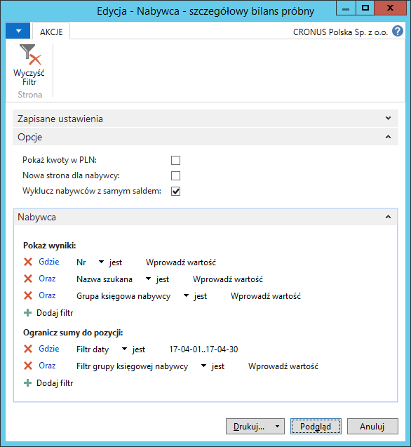
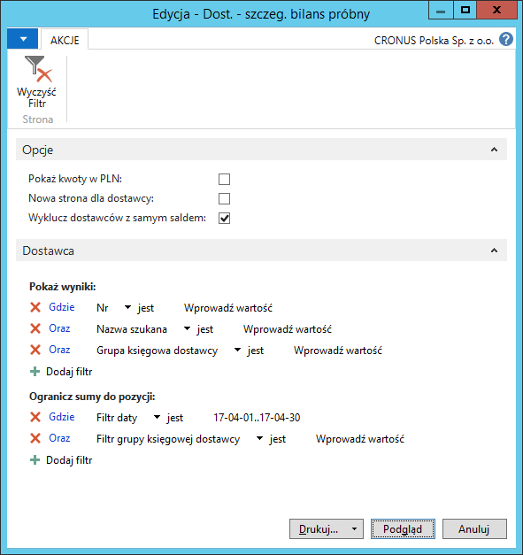
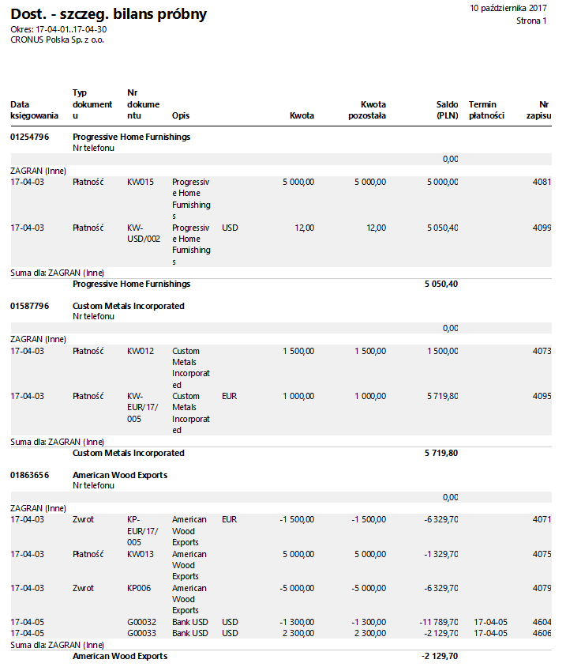

# Nabywca/dostawca - szczegółowy bilans próbny

## Informacje ogólne

**Raporty Nabywca – szczegółowy bilans próbny** i **Dostawca – szczegółowy bilans próbny** prezentują szczegóły bilansu próbnego dla wybranych nabywców lub dostawców. Raport ten może być wykorzystany przy zamknięciu okresu obrachunkowego lub roku finansowego. W ramach Polskiej Lokalizacji systemu Microsoft Dynamics 365 Business Central on‑premises do raportów została dodana możliwość filtrowania zapisów księgi nabywców i dostawców według grup księgowych użytych w poszczególnych zapisach ksiąg należności i zobowiązań.

## Obsługa

W celu przygotowania i wydrukowania raportu **Nabywca – szczegółowy
bilans próbny**, należy postępować według następujących kroków:

1.  Należy wybrać **Działy \> Zarządzanie Finansami \> Należności \>
    Nabywca – szczegółowy bilans próbny**.

2.  W oknie wstępnym raportu, które się otworzy, należy wypełnić
    na karcie skróconej **Nabywca** pole **Filtr daty** wprowadzając
    w nim okres objęty raportem. W razie potrzeby można wypełnić inne
    pola w celu ograniczenia danych ujętych w raporcie.

    Na karcie skróconej **Opcje** należy zaznaczyć właściwe pola:
    
    -   **Pokaż kwoty w PLN** – to pole należy zaznaczyć, jeśli w raporcie
        mają być wyświetlone kwoty w złotych polskich jako równowartość
        należności zaksięgowanych pierwotnie w walucie obcej.
    
    -   **Nowa strona dla nabywcy** – zaznaczenie tego pola spowoduje,
        że należności każdego nabywcy zostaną wydrukowane na oddzielnych
        stronach raportu.
    
    -   **Wyklucz nabywców z samym saldem** – zaznaczenie tego pola
        spowoduje, że w raporcie zostaną pominięci nabywcy, którzy mają
        saldo, ale nie mają zapisów w okresie wybranym w polu **Filtr
        daty**.

  

3.  Po wprowadzeniu właściwych filtrów należy wybrać **Drukuj** w celu
    wydrukowania raportu lub **Podgląd** w celu wyświetlenia raportu
    na ekranie:

  

W celu przygotowania i wydrukowania raportu **Dostawca – szczegółowy
bilans próbny**, należy postępować według następujących kroków:

1.  Należy wybrać **Działy \> Zarządzanie Finansami \> Zobowiązania \>
    Dost. – szczeg. bilans próbny**.

2.  W oknie wstępnym raportu, które się otworzy, należy wypełnić
    na karcie skróconej **Dostawca** pole **Filtr daty** wprowadzając
    w nim okres objęty raportem. W razie potrzeby można wypełnić inne
    pola w celu ograniczenia danych ujętych w raporcie.

    Na karcie skróconej **Opcje** należy zaznaczyć właściwe pola:
    
    -   **Pokaż kwoty w PLN** – to pole należy zaznaczyć, jeśli w raporcie
        mają być wyświetlone kwoty w złotych polskich jako równowartość
        zobowiązań zaksięgowanych pierwotnie w walucie obcej.
    
    -   **Nowa strona dla dostawcy** – zaznaczenie tego pola spowoduje,
        że zobowiązania każdego dostawcy zostaną wydrukowane
        na oddzielnych stronach raportu.
    
    -   **Wyklucz dostawców z samym saldem** – zaznaczenie tego pola
        spowoduje, że w raporcie zostaną pominięci dostawcy, którzy mają
        saldo, ale nie mają zapisów w okresie wybranym w polu **Filtr
        daty**.

  

3.  Po wprowadzeniu właściwych filtrów należy wybrać **Drukuj** w celu
    wydrukowania raportu lub **Podgląd** w celu wyświetlenia raportu
    na ekranie:

  