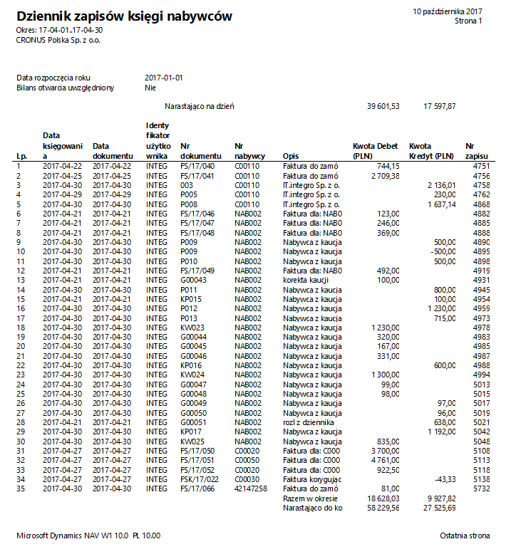
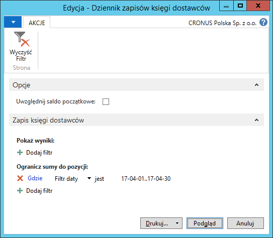

# Dziennik zapisów księgi nabywców/ dostawców

## Informacje ogólne

W ramach Polskiej Lokalizacji systemu Microsoft Dynamics 365 Business Central on‑premises dostępne są raporty **Dziennik zapisów księgi nabywców** oraz **Dziennik zapisów księgi dostawców** będące uzupełnieniem dla raportu **Dziennik K/G**. Bazują na zapisach ksiąg pomocniczych: należności i zobowiązań. Przygotowanie raportów jest obowiązkowe raz w miesiącu, ale, w razie potrzeby, mogą być przygotowywane częściej, za dowolne okresy. Raporty **Dziennik zapisów księgi nabywców** oraz **Dziennik zapisów księgi dostawców** przedstawiają wszystkie zapisy księgi nabywców lub dostawców w porządku chronologicznym. 

## Obsługa

W celu przygotowania i wydrukowania raportu **Dziennik zapisów księgi
nabywców**, należy postępować według następujących kroków:

1.  Należy wybrać **Działy \> Zarządzanie Finansami \> Należności \>
    Dziennik zapisów księgi nabywców**.

2.  W oknie wstępnym raportu, które się otworzy, należy wypełnić
    na karcie skróconej **Zapis księgi nabywców** pole **Filtr daty**
    wprowadzając w nim okres objęty raportem.

    Na karcie skróconej **Opcje** należy zaznaczyć pole **Uwzględnij
    bilans otwarcia**, jeśli kwota salda początkowego ma zostać dodana
    do sum zapisów księgowych wykazanych narastająco. W przeciwnym wypadku
    pola nie należy zaznaczać.

  

3.  Po zaznaczeniu właściwych opcji i wprowadzeniu właściwego filtru
    okresu, należy wybrać **Drukuj** w celu wydrukowania raportu
    lub **Podgląd** w celu wyświetlenia raportu na ekranie:

  

W celu przygotowania i wydrukowania raportu **Dziennik zapisów księgi
dostawców**, należy postępować według następujących kroków:

1.  Należy wybrać **Działy \> Zarządzanie Finansami \> Zobowiązania \>
    Dziennik zapisów księgi dostawców**.

2.  W oknie wstępnym raportu, które się otworzy, należy wypełnić
    na karcie skróconej **Zapis księgi dostawców** pole **Filtr daty**
    wprowadzając w nim okres objęty raportem.

    Na karcie skróconej **Opcje** należy zaznaczyć pole **Uwzględnij
    bilans otwarcia**, jeśli kwota salda początkowego ma zostać dodana
    do sum zapisów księgowych wykazanych narastająco. W przeciwnym wypadku
    pola nie należy zaznaczać.

  

3.  Po zaznaczeniu właściwych opcji i wprowadzeniu właściwego filtru
    okresu, należy wybrać **Drukuj** w celu wydrukowania raportu
    lub **Podgląd** w celu wyświetlenia raportu na ekranie:

  