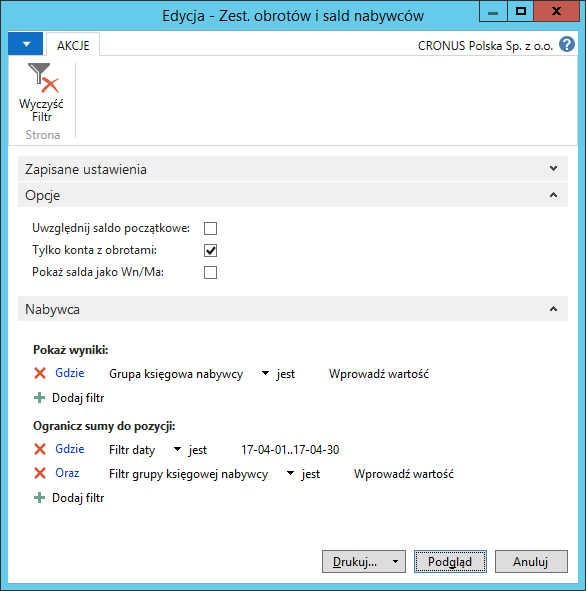

# Zestawienie obrotów i sald nabywcy/dostawcy

## Informacje ogólne

W ramach Polskiej Lokalizacji systemu Microsoft Dynamics 365 Business Central on‑premises dostępne są raporty **Zestawienie obrotów i sald nabywców** oraz **Zestawienie obrotów i sald dostawców** będące uzupełnieniem dla raportu **Zestawienie obrotów i sald kont K/G**. Bazują one na zapisach ksiąg pomocniczych: należności i zobowiązań. Przygotowanie raportów jest obowiązkowe raz w miesiącu, ale, w razie potrzeby, mogą być przygotowywane częściej, za dowolne okresy. Raporty **Zestawienie obrotów i sald nabywców** oraz **Zestawienie obrotów i sald dostawców** przedstawiają następujące wartości dla wszystkich nabywców/dostawców, w podziale na grupy księgowe (konta należności):

-   Saldo początkowe

-   Obroty okresu

-   Obroty narastająco

-   Saldo na dzień

>[!NOTE]
>Przed przygotowaniem raportów **Zestawienie obrotów i sald
nabywców** i **Zestawienie obrotów i sald dostawców** konieczne jest
zdefiniowanie okresów obrachunkowych.

## Obsługa

W celu przygotowania i wydrukowania raportu **Zestawienie obrotów i sald
nabywców**, należy postępować według następujących kroków:

1.  Należy wybrać **Działy \> Zarządzanie Finansami \> Należności \>
    Zest. obrotów i sald nabywców**.

2.  W oknie wstępnym raportu, które się otworzy, należy wypełnić
    na karcie skróconej **Nabywca** co najmniej pole **Filtr daty**
    wprowadzając w nim okres objęty raportem. W razie potrzeby można
    wypełnić inne pola w celu ograniczenia danych ujętych w raporcie.

    Na karcie skróconej **Opcje** należy zaznaczyć właściwe pola:

    -   **Uwzględnij saldo początkowe** – zaznaczenie tego pola spowoduje,
        że kwota salda początkowego zostanie dodana do kwoty w polu
        **Obroty narastająco do dnia.**
    
    -   **Tylko konta z obrotami** – zaznaczenie tego pola spowoduje,
        że w raporcie zostaną wyświetlone wartości tylko tych nabywców,
        dla których istnieją zapisy księgowe w okresie wprowadzonym w polu
        **Filtr daty**.
    
    -   **Pokaż salda jako Wn/Ma** – zaznaczenie tego pola spowoduje,
        że kwoty dla każdego nabywcy zostaną zsumowane i wyświetlone
        odrębnie dla zapisów po stronie Wn i po stronie Ma.
    
  

3.  Po zaznaczeniu właściwych opcji i wprowadzeniu właściwych filtrów,
    należy wybrać **Drukuj** w celu wydrukowania raportu lub **Podgląd**
    w celu wyświetlenia raportu na ekranie:

  

>[!NOTE]
>W sytuacji, gdy należności jednego nabywcy zostały
zaksięgowane na więcej niż jedno konto należności (z więcej niż jedną
grupą księgową), wyświetlone są w raporcie w następujący sposób:
pierwszy wiersz dla nabywcy, z jego numerem i nazwą wydrukowany jest
czcionką pogrubioną, a kwoty w tym wierszu są sumą wszystkich jego
należności. W kolejnych wierszach, bez numeru i nazwy nabywcy,
wydrukowane są normalną czcionką sumy należności danego nabywcy
w podziale na grupy księgowe, których kody wykazane są w kolumnie
**Grupa księgowa**. W sytuacji, gdy dany nabywca ma należności
powiązane tylko z jednym kontem należności (grupą księgową), kwoty
wydrukowane są normalną czcionką, w jednym wierszu.

W celu przygotowania i wydrukowania raportu **Zestawienie obrotów i sald
dostawców**, należy postępować według następujących kroków:

1.  Należy wybrać **Działy \> Zarządzanie Finansami \> Zobowiązania \>
    Zest. obrotów i sald dostawców**.

2.  W oknie wstępnym raportu, które się otworzy, należy wypełnić
    na karcie skróconej **Dostawca** co najmniej pole **Filtr daty**
    wprowadzając w nim okres objęty raportem. W razie potrzeby można
    wypełnić inne pola w celu ograniczenia danych ujętych w raporcie.

    Na karcie skróconej **Opcje** należy zaznaczyć właściwe pola:
    
    -   **Uwzględnij bilans otwarcia** – zaznaczenie tego pola spowoduje,
        że kwota salda początkowego zostanie dodana do kwoty w polu
        **Obroty narastająco do dnia.**
    
    -   **Tylko konta z obrotami** – zaznaczenie tego pola spowoduje,
        że w raporcie zostaną wyświetlone wartości tylko tych dostawców,
        dla których istnieją zapisy księgowe w okresie wprowadzonym w polu
        **Filtr daty**.
    
    -   **Pokaż salda jako Wn/Ma** – zaznaczenie tego pola spowoduje,
        że kwoty dla każdego dostawcy zostaną zsumowane i wyświetlone
        odrębnie dla zapisów po stronie Wn i po stronie Ma.
    
  

3.  Po zaznaczeniu właściwych opcji i wprowadzeniu właściwych filtrów,
    należy wybrać **Drukuj** w celu wydrukowania raportu lub **Podgląd**
    w celu wyświetlenia raportu na ekranie:

  

>[!NOTE]
>W sytuacji, gdy zobowiązania jednego dostawcy zostały
 zaksięgowane na więcej niż jedno konto zobowiązań (z więcej niż jedną
 grupą księgową), wyświetlone są w raporcie w następujący sposób:
 pierwszy wiersz dla dostawcy, z jego numerem i nazwą wydrukowany jest
 czcionką pogrubioną, a kwoty w tym wierszu są sumą wszystkich jego
 zobowiązań. W kolejnych wierszach, bez numeru i nazwy dostawcy,
 wydrukowane są normalną czcionką sumy zobowiązań danego dostawcy
 w podziale na grupy księgowe, których kody wykazane są w kolumnie
 **Grupa księgowa**. W sytuacji, gdy dany dostawca ma zobowiązania
 powiązane tylko z jednym kontem zobowiązań (grupą księgową), kwoty
 wydrukowane są normalną czcionką, w jednym wierszu.