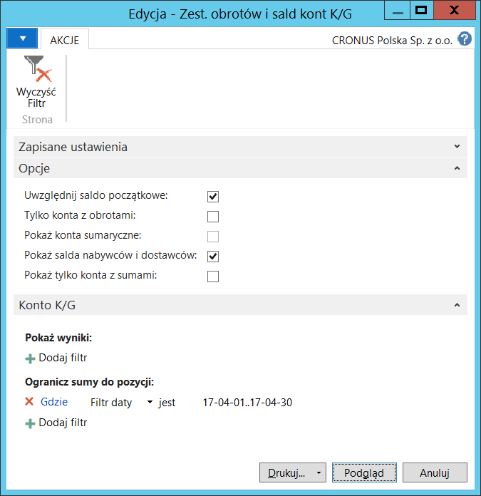
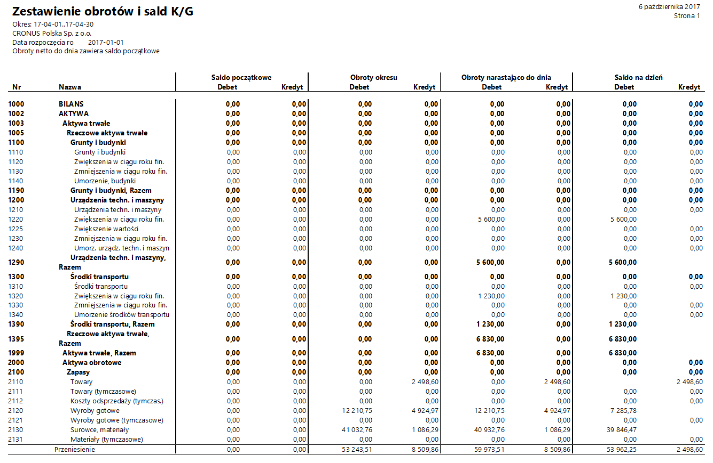

# Zestawienie obrotów i sald kont K/G 

## Informacje ogólne

Raport Zestawienie obrotów i sald kont K/G jest jednym z raportów ustawowych, których przygotowanie jest obowiązkowe raz w miesiącu. W razie potrzeby, raport może być przygotowywany częściej, za dowolne okresy. W ramach Polskiej Lokalizacji systemu Microsoft Dynamics 365 Business Central on‑premises dostępny jest raport Zestawienie obrotów i sald kont K/G prezentujący następujące wartości dla wszystkich kont księgi głównej:

-   Saldo początkowe

-   Obroty okresu

-   Obroty narastająco

-   Saldo na dzień

>[!NOTE]
>Przed przygotowaniem raportu **Zestawienie obrotów i sald
kont K/G** konieczne jest zdefiniowanie okresów obrachunkowych.

## Obsługa

W celu przygotowania i wydrukowania raportu **Zestawienie obrotów i sald
kont K/G**, należy postępować według następujących kroków:

1.  Należy wybrać **Działy \> Zarządzanie Finansami \> Księga główna \>
    Zest. obrotów i sald kont K/G**.

2.  W oknie wstępnym raportu, które się otworzy, należy wypełnić
    na karcie skróconej **Konto K/G** co najmniej pole **Filtr daty**
    wprowadzając w nim okres objęty raportem. W razie potrzeby można
    wypełnić inne pola w celu ograniczenia danych ujętych w raporcie.

    Na karcie skróconej **Opcje** należy zaznaczyć właściwe pola:

    -   **Uwzględnij saldo początkowe** – zaznaczenie tego pola spowoduje,
        że kwota salda początkowego zostanie dodana do kwoty w polu
        **Obroty narastająco do dnia.**
    
    -   **Tylko konta z obrotami** – zaznaczenie tego pola spowoduje,
        że w raporcie zostaną wyświetlone tylko te konta, na
        których są zapisy księgowe.
    
    -   **Pokaż konta sumaryczne** – pole jest edytowalne tylko wtedy,
        gdy zaznaczone jest pole **Tylko konta z obrotami**. Zaznaczenie
        tego pola spowoduje, że w raporcie przedstawiającym wyłącznie
        konta księgowe mające zapisy, zostaną wyświetlone dodatkowo
        wiersze z kontami typu: **Nagłówek**, **Suma**, **Suma od**,
        **Suma do**.
    
    -   **Pokaż salda nabywców i dostawców** – zaznaczenie tego pola
        spowoduje, że dla niektórych kont K/G zostaną wyświetlone
        dodatkowe wiersze z saldami wykazanymi po stronach debet i kredyt
        powiązanymi z zapisami księgi dostawców i nabywców.
    
    -   **Pokaż tylko konta z sumami** – zaznaczenie tego pola spowoduje,
        że w raporcie zostaną wyświetlone tylko wiersze z kontami typu:
        **Suma**, **Suma od**, **Suma do**.

  

3.  Po zaznaczeniu właściwych opcji i wprowadzeniu właściwych filtrów,
    należy wybrać **Drukuj** w celu wydrukowania raportu lub **Podgląd**
    w celu wyświetlenia raportu na ekranie:

  