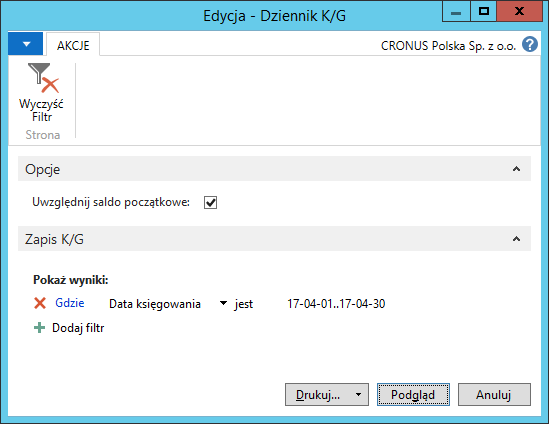
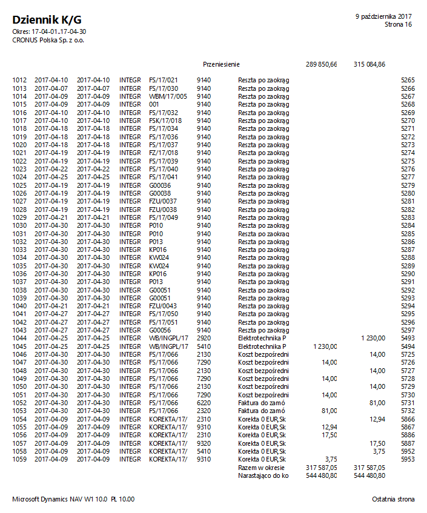

# Dziennik K/G

## Informacje ogólne

Raport Dziennik K/G jest jednym z raportów ustawowych, których przygotowanie jest obowiązkowe raz w miesiącu. W razie potrzeby, raport może być przygotowywany częściej, za dowolne okresy. W ramach Polskiej Lokalizacji systemu Microsoft Dynamics 365 Business Central on‑premises dostępny jest raport Dziennik K/G przedstawiający wszystkie zapisy księgi głównej w porządku chronologicznym. 

## Obsługa

W celu przygotowania i wydrukowania raportu **Dziennik K/G**, należy
postępować według następujących kroków:

1.  Należy wybrać **Działy \> Zarządzanie Finansami \> Księga główna \>
    Dziennik K/G**.

2.  W oknie wstępnym raportu, które się otworzy, należy wypełnić
    na karcie skróconej **Zapis K/G** pole **Data księgowania**
    wprowadzając w nim okres objęty raportem.

Na karcie skróconej **Opcje** należy zaznaczyć pole **Uwzględnij saldo
początkowe**, jeśli kwota salda początkowego ma zostać dodana do sum
zapisów księgowych wykazanych narastająco. W przeciwnym wypadku pola
nie należy zaznaczać.

  

3.  Po zaznaczeniu właściwych opcji i wprowadzeniu właściwego filtru
    okresu, należy wybrać **Drukuj** w celu wydrukowania raportu
    lub **Podgląd** w celu wyświetlenia raportu na ekranie:

  

  