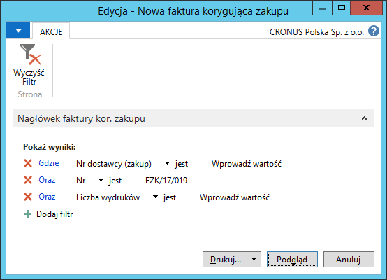
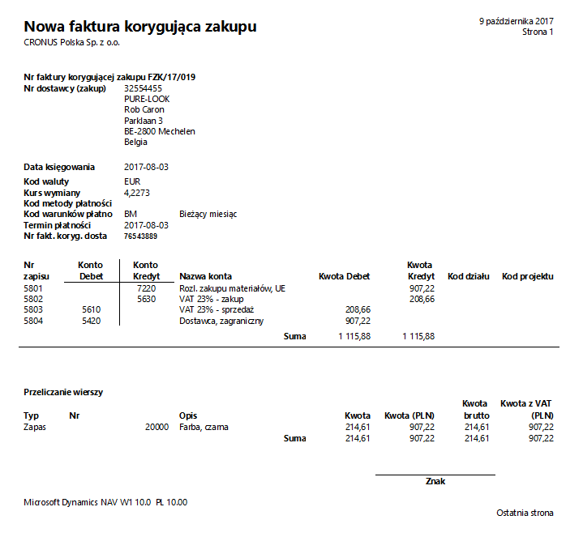

# K/G - faktura korygująca zakupu

## Informacje ogólne

W ramach Polskiej Lokalizacji systemu Microsoft Dynamics 365 Business Central on‑premises dostępny jest raport **K/G – faktura kor. zakupu**, który może być wydrukowany wyłącznie na podstawie zaksięgowanej faktury korygującej zakupu. Może stanowić potwierdzenie zaksięgowania transakcji zakupu, prezentujące dekret księgowy z wszystkimi wymaganymi przez prawo informacjami dotyczącymi m.in. kont księgi głównej i ksiąg pomocniczych, waluty transakcji, kursu wymiany waluty itp.

>[!NOTE]
>Raport **K/G – faktura kor. zakupu** można ustawić w oknie
Wybór **raportów – zakupy** jako raport księgowania, który drukowany
jest automatycznie po wybraniu **Księguj i drukuj** w oknie **Faktura
korygująca zakupu**.

## Obsługa

W celu przygotowania i wydrukowania raportu **K/G – faktura kor.
zakupu**, należy postępować według następujących kroków:

1.  Należy wybrać **Działy \> Zarządzanie Finansami \> Zobowiązania \>
    K/G – faktura kor. zakupu**.

2.  W oknie wstępnym raportu, które się otworzy, należy wypełnić
    na karcie skróconej **Nagłówek faktury kor. zakupu** pole **Nr**
    wybierając z listy rozwijanej w tym polu numer zaksięgowanej
    faktury korygującej zakupu, której dane mają zostać wydrukowane.
    W razie potrzeby można wprowadzić inne filtry w celu ograniczenia
    zakresu drukowanych danych.

  

3.  Po wprowadzeniu właściwych filtrów należy wybrać **Drukuj** w celu
    wydrukowania raportu lub **Podgląd** w celu wyświetlenia raportu
    na ekranie:

  