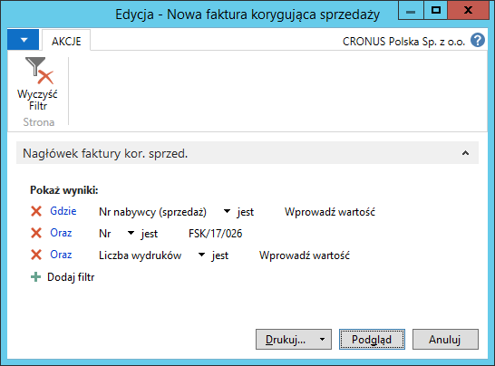
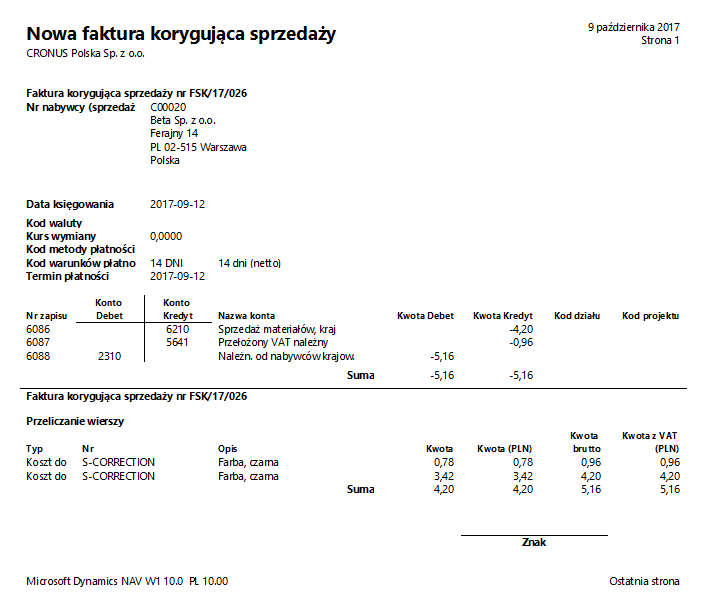

# K/G - faktura korygująca sprzedaży

## Informacje ogólne

W ramach Polskiej Lokalizacji systemu Microsoft Dynamics 365 Business Central on‑premises dostępny jest raport **K/G – faktura kor. sprzedaży**, który może być wydrukowany wyłącznie na podstawie zaksięgowanej faktury korygującej sprzedaży. Może stanowić potwierdzenie zaksięgowania transakcji sprzedaży, prezentujące dekret księgowy z wszystkimi wymaganymi przez prawo informacjami dotyczącymi m.in. kont księgi głównej i ksiąg pomocniczych, waluty transakcji, kursu wymiany waluty itp.

>[!NOTE]
>Raport **K/G – faktura kor. sprzedaży** można ustawić
w oknie Wybór **raportów – sprzedaż** jako raport księgowania,
który drukowany jest automatycznie (oprócz dokumentu faktura
korygująca sprzedaży) po wybraniu **Księguj i drukuj** w oknie
**Faktura korygująca sprzedaży**.

## Obsługa

W celu przygotowania i wydrukowania raportu **K/G – faktura kor.
sprzedaży**, należy postępować według następujących kroków:

1.  Należy wybrać **Działy \> Zarządzanie Finansami \> Należności \> K/G
    – faktura kor. sprzedaży**.

2.  W oknie wstępnym raportu, które się otworzy, należy wypełnić
    na karcie skróconej **Nagłówek faktury kor. sprzedaży** pole
    **Nr** wybierając z listy rozwijanej w tym polu numer
    zaksięgowanej faktury korygującej sprzedaży, której dane mają
    zostać wydrukowane. W razie potrzeby można wprowadzić inne filtry
    w celu ograniczenia zakresu drukowanych danych.

  

3.  Po wprowadzeniu właściwych filtrów należy wybrać **Drukuj** w celu
    wydrukowania raportu lub **Podgląd** w celu wyświetlenia raportu
    na ekranie:

  