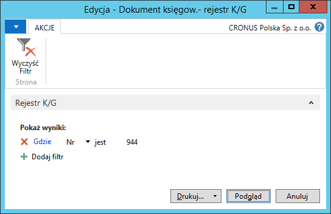

Dokument księgowy – rejestr K/G 

## Informacje ogólne

W ramach Polskiej Lokalizacji systemu Microsoft Dynamics 365 Business Central on‑premises dostępny jest raport **Dokument księgowy – rejestr K/G** potwierdzający zaksięgowanie transakcji, prezentujący dekret księgowy obejmujący księgę główną i inne niezbędne informacje. 

## Obsługa

W celu przygotowania i wydrukowania raportu **Dokument księgowy –
rejestr K/G**, należy postępować według następujących kroków:

1.  Należy wybrać **Działy \> Zarządzanie Finansami \> Księga główna \>
    Dokument księgow. – rejestr K/G**.

2.  W oknie wstępnym raportu, które się otworzy, należy wypełnić
    na karcie skróconej **Rejestr K/G** pole **Nr** wybierając z listy
    rozwijanej w tym polu numer rejestru księgowego, którego zapisy
    mają zostać wydrukowane. W razie potrzeby można wprowadzić inne
    filtry w celu ograniczenia zakresu drukowanych danych.

  

3.  Po wprowadzeniu właściwych filtrów należy wybrać **Drukuj** w celu
    wydrukowania raportu lub **Podgląd** w celu wyświetlenia raportu
    na ekranie:

  