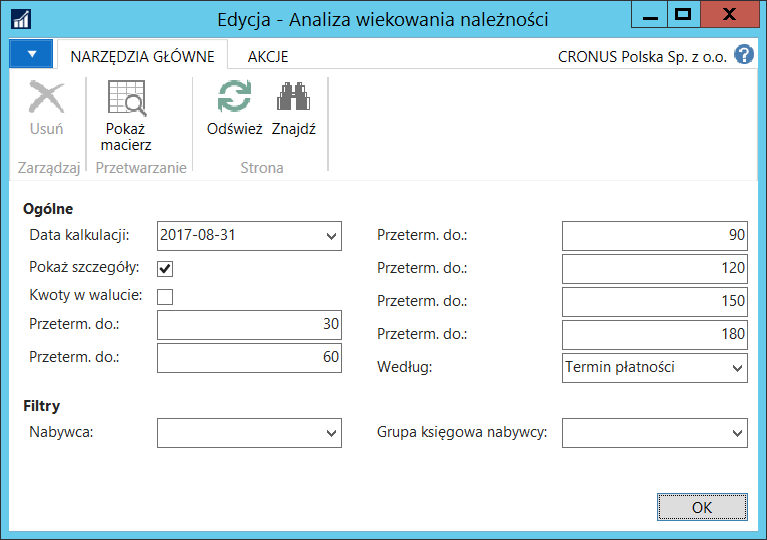
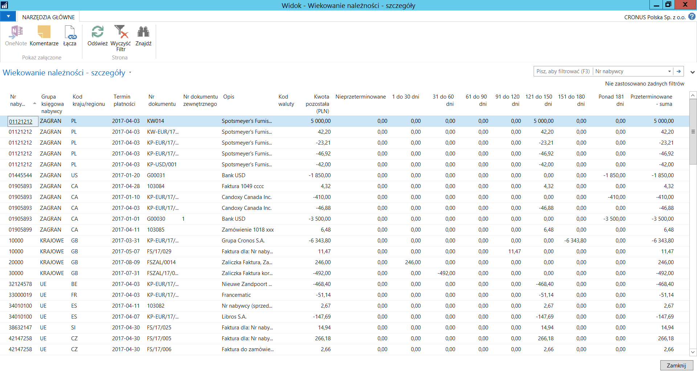
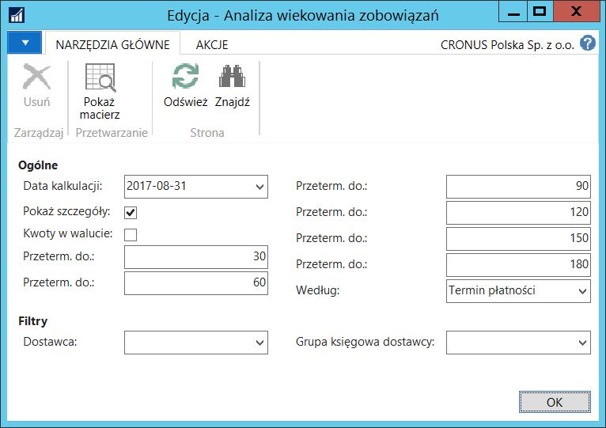
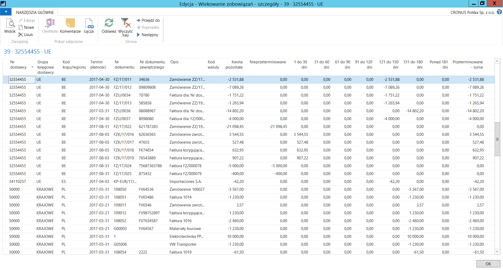

# Analiza wiekowania należności/zobowiązań

## Informacje ogólne

Polska Lokalizacja w systemie Microsoft Dynamics 365 Business Central
on‑premises udostępnia narzędzia **Analiza wiekowania należności** i **Analiza
wiekowania zobowiązań**, które prezentują wiekowanie należności
i wiekowanie zobowiązań w formie tabelarycznej, ułatwiając analizowanie
danych z możliwością ich sortowania, filtrowania i kopiowania.

## Obsługa

W celu przygotowania **Analizy wiekowania należności**, należy
postępować według następujących kroków:

1.  Należy wybrać **Działy \> Zarządzanie Finansami \> Księga główna \>
    Analizy i raporty \> Analiza wiekowania należności**.

2.  W oknie z parametrami wstępnymi zestawienia **Analiza wiekowania
    należności**, które się otworzy, należy wypełnić pola:

    Na karcie skróconej **Ogólne**:
    
    -   **Data kalkulacji** – w tym polu należy wprowadzić datę, w stosunku
        do której będą liczone dni przeterminowania należności.
    
    -   **Pokaż szczegóły** – zaznaczenie tego pola spowoduje,
        że w zestawieniu dla każdego nabywcy zostaną wyświetlone
        poszczególne zapisy składające się na saldo jego należności.
    
    -   **Kwoty w walucie** – zaznaczenie tego pola spowoduje,
        że w zestawieniu zostaną wyświetlone kwoty w walutach źródłowych,
        w przeciwnym wypadku w zestawieniu wykazana jest ich równowartość
        w złotych polskich.
    
    -   **Przeterm. do **– w polu tym należy wpisać maksymalną ilość dni
        przeterminowania należności; istnieje 6 pól o nazwie **Przeterm.
        do**, w których należy wpisać 6 kolejnych okresów
        przeterminowania, wszystkie pola muszą być uzupełnione.
    
    -   **Według** – z lity rozwijanej w tym polu należy wybrać jedną
        z dostępnych opcji:
    
    -   **Termin płatności** – wybór tej opcji spowoduje, że ilość dni
        przeterminowania należności będzie liczona jako ilość dni,
        która upłynęła od terminu płatności zobowiązania do daty
        wprowadzonej w polu **Data kalkulacji**. Ilość dni obliczona w ten
        sposób wskaże, do którego z 6 okresów ustawionych w polach
        **Przeterm. do **powinna być przyporządkowana należność.
    
    -   **Data księgowania** – wybór tej opcji spowoduje, że ilość dni
        przeterminowania należności będzie liczona jako ilość dni,
        która upłynęła od daty księgowania należności do daty wprowadzonej
        w polu **Data kalkulacji**. Ilość dni obliczona w ten sposób
        wskaże, do którego z 6 okresów ustawionych w polach **Przeterm.
        do **powinna być przyporządkowana należność.
    
    Na karcie skróconej **Filtry**:
    
    -   **Nabywca** – w tym polu można wybrać jednego lub więcej nabywców,
        do należności których ma być ograniczone zestawienie. Brak
        wypełnienia pola spowoduje wyświetlenie należności wszystkich
        nabywców.
    
    -   **Grupa księgowa nabywcy** – w tym polu można wybrać jedną
        lub więcej grup księgowych nabywców, z którymi powiązane
        są należności, do których mają być ograniczone dane w zestawieniu.
        Brak wypełnienia pola spowoduje wyświetlenie wszystkich
        należności.

  

3.  Aby wyświetlić zestawienie, wybierz **Pokaż macierz**:

  

W celu przygotowania **Analizy wiekowania zobowiązań**, należy
postępować według następujących kroków:

1.  Należy wybrać **Działy \> Zarządzanie Finansami \> Księga główna \>
    Analizy i raporty \> Analiza wiekowania zobowiązań**.

2.  W oknie z parametrami wstępnymi zestawienia **Analiza wiekowania
    zobowiązań**, które się otworzy, należy wypełnić pola:

    Na karcie skróconej **Ogólne**:
    
    -   **Data kalkulacji** – w tym polu należy wprowadzić datę, w stosunku
        do której będą liczone dni przeterminowania zobowiązań.
    
    -   **Pokaż szczegóły** – zaznaczenie tego pola spowoduje,
        że w zestawieniu dla każdego dostawcy zostaną wyświetlone
        poszczególne zapisy składające się na saldo jego zobowiązań.
    
    -   **Kwoty w walucie** – zaznaczenie tego pola spowoduje,
        że w zestawieniu zostaną wyświetlone kwoty w walutach źródłowych,
        w przeciwnym wypadku w zestawieniu wykazana jest ich równowartość
        w złotych polskich.
    
    -   **Przeterm. do** – w polu tym należy wpisać maksymalną ilość dni
        przeterminowania zobowiązań; istnieje 6 pól o nazwie **Przeterm.
        do**, w których należy wpisać 6 kolejnych okresów
        przeterminowania, wszystkie pola muszą być uzupełnione.
    
    -   **Według** – z lity rozwijanej w tym polu należy wybrać jedną
        z dostępnych opcji:
    
    -   **Termin płatności** – wybór tej opcji spowoduje, że ilość dni
        przeterminowania zobowiązania będzie liczona jako ilość dni,
        która upłynęła od terminu płatności zobowiązania do daty
        wprowadzonej w polu **Data kalkulacji**. Ilość dni obliczona w ten
        sposób wskaże, do którego z 6 okresów ustawionych w polach
        **Przeterm. do **powinno być przyporządkowane zobowiązanie.
    
    -   **Data księgowania** – wybór tej opcji spowoduje, że ilość dni
        przeterminowania zobowiązania będzie liczona jako ilość dni,
        która upłynęła od daty księgowania zobowiązania do daty
        wprowadzonej w polu **Data kalkulacji**. Ilość dni obliczona w ten
        sposób wskaże, do którego z 6 okresów ustawionych w polach
        **Przeterm. do **powinno być przyporządkowane zobowiązanie.
    
    Na karcie skróconej **Filtry**:
    
    -   **Dostawca** – w tym polu można wybrać jednego lub więcej
        dostawców, do zobowiązania których ma być ograniczone zestawienie.
        Brak wypełnienia pola spowoduje wyświetlenie zobowiązań wszystkich
        dostawców.
    
    -   **Grupa księgowa dostawcy** – w tym polu można wybrać jedną
        lub więcej grup księgowych dostawców, z którymi powiązane
        są zobowiązania, do których mają być ograniczone dane
        w zestawieniu. Brak wypełnienia pola spowoduje wyświetlenie
        wszystkich zobowiązań.

  

3.  Aby wyświetlić zestawienie, wybierz **Pokaż macierz**:

  