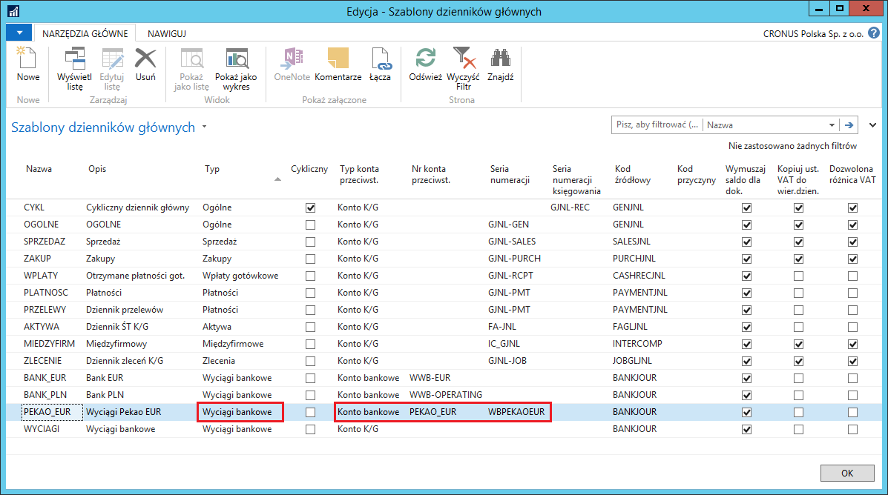
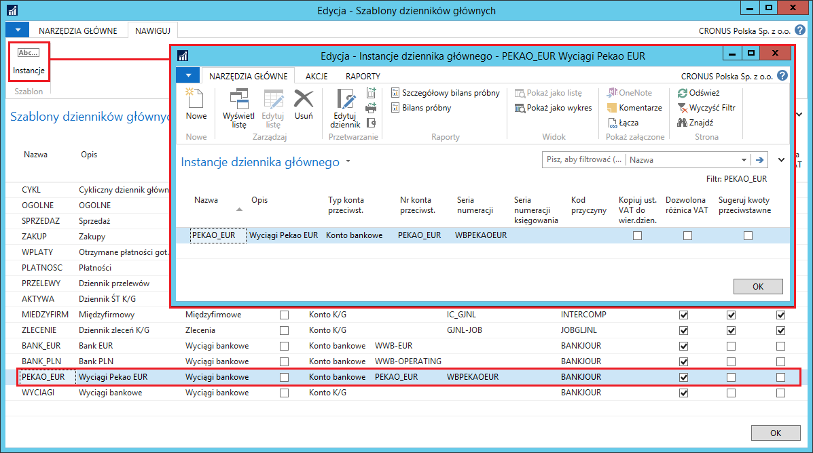
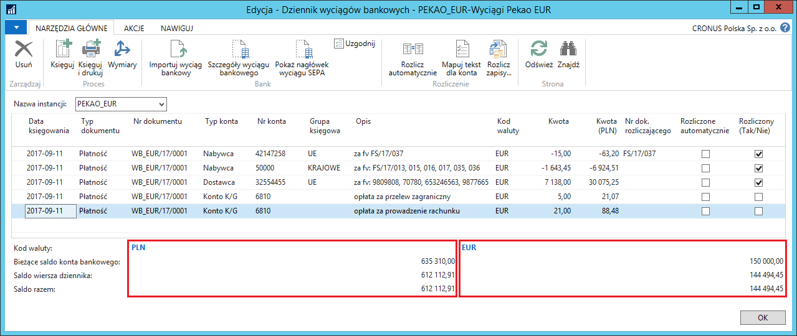

# Dziennik wyciągów bankowych 

## Informacje ogólne

W obsłudze przepływu środków pieniężnych firmy ważna jest elastyczność
i bieżąca kontrola salda. W celu zapewnienia sprawnej obsługi
rejestracji operacji bankowych, Polska Lokalizacja została wyposażona
w **Dziennik wyciągów bankowych**. Właściwe zdefiniowanie wszystkich
ustawień w ramach tej funkcjonalności zapewnia najbardziej optymalną
i dostosowaną do potrzeb użytkownika ewidencję transakcji na kontach
bankowych.

## Ustawienia

Żeby możliwe było korzystanie z funkcjonalności **Dziennik wyciągów
bankowych**, konieczne jest zdefiniowanie szablonów i (opcjonalnie)
instancji dziennika głównego dla każdego konta bankowego oddzielnie.
W tym celu należy postępować według następujących kroków:

1.  Należy wybrać **Działy \> Zarządzanie Finansami \> Administracja \>
    Szablony dzienników głównych**

2.  W oknie, które się otworzy, należy wybrać **Nowe**.

3.  W nowym wierszu należy wprowadzić parametry szablonu dziennika
    przeznaczonego do księgowania wyciągów bankowych konkretnego konta
    bankowego. Większość pól należy uzupełnić w sposób standardowy,
    a charakterystyczne dla tego typu dokumentów są pola:

    -   **Typ** – z listy rozwijanej należy wybrać **Wpłaty gotówkowe**
    
    -   **Typ konta przeciwst.** – z listy rozwijanej należy wybrać **Konto
         bankowe**
    
    -   **Nr konta przeciwst.** – z listy rozwijanej należy wybrać
         wcześniej zdefiniowane konto bankowe, z którego wyciągi bankowe
         będą księgowane przy użyciu tego szablonu dziennika głównego
    
    -   **Seria numeracji** – z listy rozwijanej należy wybrać wcześniej
         zdefiniowaną serię numeracji, która będzie miała zastosowanie
         dla nadawania kolejnych numerów księgowanym wyciągom bankowym
         z wybranego konta bankowego
    
    -   **Seria numeracji księgowania** – pole należy pozostawić puste.
    
    -   **Identyfikator strony** – w tym polu należy wprowadzić numer
         52063175

  

Definiowanie instancji dziennika głównego do szablonu typu **Wyciąg
bankowy** odbywa się w sposób standardowy, tzn. część pól skopiowana
jest z szablonu dziennika (m.in. typ i numer konta przeciwstawnego
oraz serie numeracji) oraz część pól jest wypełniona domyślnie (m.in.
nazwa i opis instancji). Możliwe jest ręczne dokonanie niezbędnych zmian
w domyślnych instancjach i ręczne definiowanie kolejnych instancji.
W tym celu należy otworzyć okno **Instancje dziennika głównego** poprzez
wybranie **Instancje** dla zaznaczonego wiersza z wybranym szablonem
dziennika:

  

## Obsługa

W celu wprowadzenia i zaksięgowania wyciągu bankowego, należy postępować według następujących kroków:

1.  Należy wybrać **Działy \> Zarządzanie Finansami \> Zarządzanie
    środkami pieniężnymi \> Dziennik wyciągów bankowych.**

2.  W oknie **Lista szablonów dziennika gł.**, które się otworzy, należy
    wybrać jeden z wcześniej zdefiniowanych szablonów dziennika.

3.  W oknie **Dziennik wyciągów bankowych**, które się otworzy,
    w kolejnych wierszach należy wprowadzić kolejne pozycje wyciągu
    bankowego, wypełniając pola odpowiednimi danymi:

    -   **Data księgowania** – data, z jaką zostanie zaksięgowany wyciąg
         bankowy – system wstawia domyślnie datę bieżącą, którą można
         ręcznie zmienić na inną.
    
    -   **Typ dokumentu** – z listy rozwijanej można wybierać spośród 2
         opcji:
    
        -   **Płatność** (od nabywcy lub dla dostawcy)
        
        -   **Zwrot** (do nabywcy lub od dostawcy)

        Pole może pozostać puste.

    -   **Nr dokumentu** – pole wypełnione automatycznie przez system
         numerem kolejnym zgodnym z przypisaną do dziennika serią
         numeracji.
    
    -   **Typ konta** – z listy rozwijanej należy wybrać typ konta
         przeciwstawnego wobec konta bankowego w danej transakcji bankowej
    
    -   **Nr konta** – z listy rozwijanej należy wybrać numer konta
         przeciwstawnego wobec konta bankowego w danej transakcji bankowej.
         Konta wyświetlone na liście są zgodne z typem wybranym w polu
         **Typ konta**.
    
    -   **Grupa księgowa** – pole uzupełnia się automatycznie domyślną
        grupą księgową przypisaną do wybranego w tym wierszu nabywcy
        lub dostawcy. W razie potrzeby, kod grupy księgowej może zostać
        zmieniony na inny zgodnie z regułami ustawionymi dla zastępczych
        grup księgowych.
    
        Więcej o definiowaniu i obsłudze zastępczych grup księgowych można
        przeczytać w rozdziale **Wiele kont należności/zobowiązań.**
    
    -   **Opis** – pole uzupełnia się automatycznie nazwą wybranego konta.
         Treść opisu należy ręcznie zmienić na odpowiednią dla wprowadzanej
         transakcji.
    
    -   **Kod waluty –** pole uzupełnia się automatycznie kodem waluty
        przypisanym do kartoteki konta bankowego i domyślnie przypisywane
        jest do transakcji wprowadzanych w dzienniku wyciągów bankowych
        danego konta bankowego. Kodu waluty w tym polu nie można zmieniać.
    
        Wyjątek stanowi dziennik wyciągów bankowych dla konta bankowego
        z domyślnym pustym kodem waluty – w wierszach takiego dziennika
        dozwolone jest przypisywanie wszystkich kodów walut.
    
    -   **Kwota** – w tym polu należy wprowadzić kwotę transakcji w walucie
         wybranej w polu **Kod waluty.**
    
    -   **Kwota (PLN)** – w tym polu system wstawi kwotę w walucie
         lokalnej, stanowiącą równowartość kwoty w walucie, obliczoną
         na podstawie właściwego kursu wymiany waluty pobranego z wcześniej
         uzupełnionej tabeli.

    >[!NOTE]
    >W sytuacji, gdy kwota wyliczona w polu **Kwota (PLN)** jest
     niewłaściwa, można ją poprawić dwoma sposobami: 1) zmienić ręcznie
     kwotę w polu **Kwota (PLN)** na właściwą, wtedy system dokona
     rekalkulacji kursu wymiany waluty; 2) zmienić kurs wymiany waluty
     w tym konkretnym wierszu dziennika wyciągów bankowych, wtedy system
     dokona rekalkulacji kwoty w polu **Kwota (PLN)**.

    -   **Nr dok. rozliczającego** – pole jest aktywne wtedy, gdy w polach
         **Typ konta** i **Numer konta** wybrany jest nabywca lub dostawca.
         Lista rozwijana w tym polu wyświetla nierozliczone dokumenty
         kontrahenta, spośród których należy wybrać jeden, który będzie
         rozliczony z transakcją w wierszu dziennika wyciągów bankowych.
    
    -   **Rozliczone automatycznie** – pole wypełniane po wybraniu
         **Rozlicz automatycznie**, jeżeli w wyniku użycia tej funkcji
         system znalazł i zasugerował otwarty zapis księgi nabywcy/dostawcy
         do rozliczenia z daną pozycją wyciągu bankowego.
    
    -   **Rozliczony (Tak/Nie)** – pole wypełniane automatycznie
         po połączeniu danej pozycji wyciągu bankowego z otwartym zapisem
         księgi nabywcy/dostawcy.

4.  W sytuacji, gdy w jednym wierszu dziennika wyciągów bankowych
    rozliczanych jest więcej niż jeden dokumentów nabywcy lub dostawcy,
    należy wybrać **Rozlicz zapisy**.

5.  W oknie **Rozlicz zapisy nabywcy**, które się otworzy, należy
    zaznaczyć wszystkie wiersze z dokumentami, które mają być
    rozliczone, a następnie należy wybrać **Ustaw id. rozliczenia**,
    a następnie **OK.**

Podczas wprowadzania wierszy w dzienniku wyciągów bankowych, jak również
po zakończeniu tego procesu, możliwa jest bieżąca kontrola salda konta
bankowego. Umożliwiają to pola w dzienniku wyświetlone bezpośrednio pod
wierszami. Pola są zgrupowane w 2 kolumny dla konta bankowego w walucie
obcej i w 1 kolumnę dla konta bankowego w walucie lokalnej:

-   **Kod waluty** – jest to kod waluty, w jakiej są wyświetlone kwoty
     w polach poniżej.

-   **Bieżące saldo konta bankowego** – jest to saldo konta bankowego
     pochodzące z zaksięgowanych dotychczas zapisów (saldo początkowe
     wyciągu bankowego).

-   **Saldo wiersza dziennika** – jest to kwota skalkulowana poprzez
     zsumowanie salda początkowego z pola **Bieżące saldo konta
     bankowego** z sumą kwot wprowadzonych w polu **Kwota** (lub
     **Kwota (PLN)**) do bieżącego wiersza włącznie (wiersza, w którym
     ustawiony jest kursor).

-   **Saldo razem** – jest to kwota skalkulowana poprzez zsumowanie
     salda początkowego z pola **Bieżące saldo konta bankowego** z sumą
     kwot wprowadzonych w polu **Kwota** (lub **Kwota (PLN)**)
     we wszystkich wierszach dziennika (przewidywane saldo końcowe
     wyciągu bankowego).

  

Tak wprowadzony i sprawdzony wyciąg bankowy można zaksięgować wybierając
**Księguj** lub **Księguj i drukuj**.