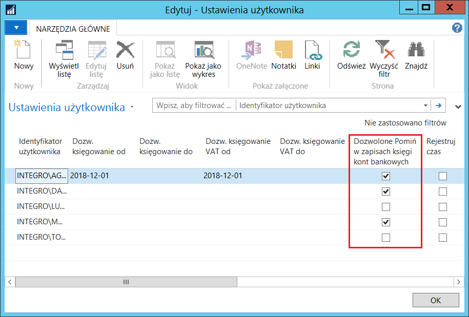
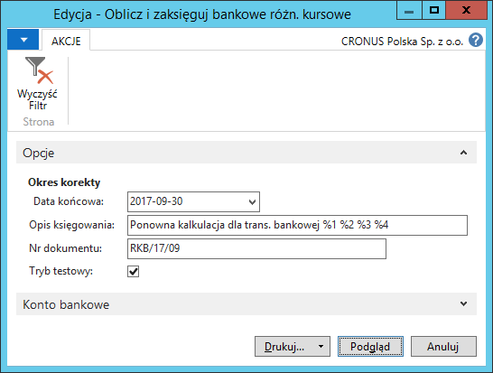
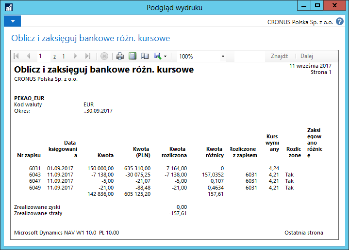
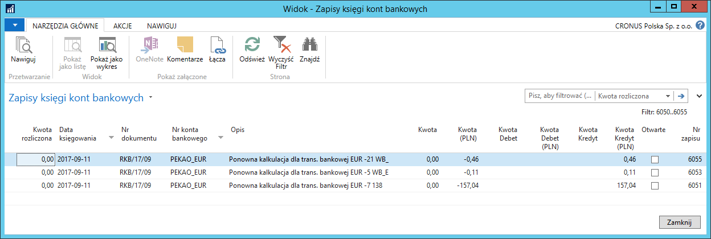
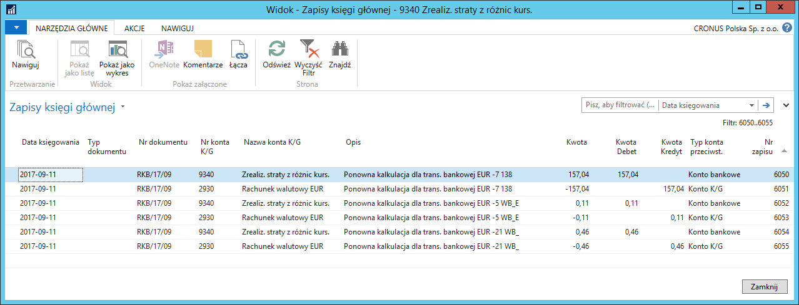
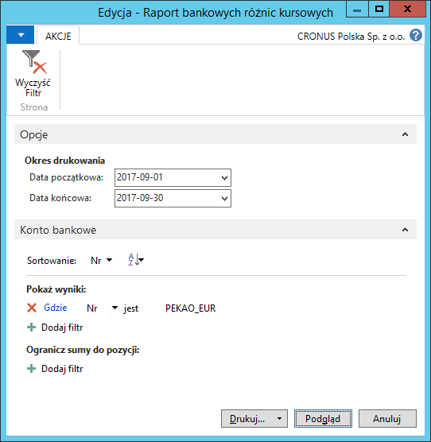
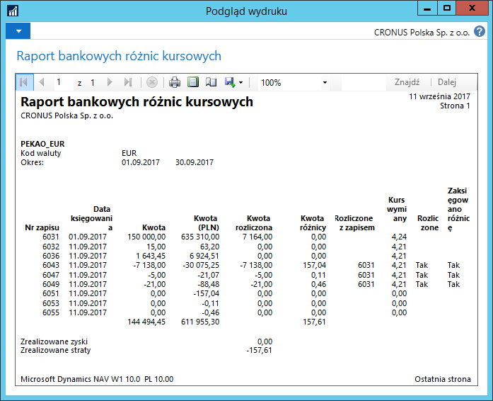
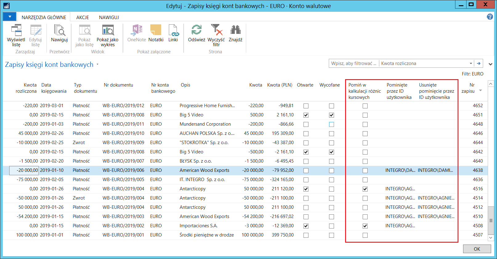

# Kalkulacja i księgowanie różnic kursowych w transakcjach bankowych 

## Informacje ogólne

Zgodnie z przepisami polskiego prawa, wypłaty środków pieniężnych
w walucie obcej z kasy i kont bankowych powinny być przeliczone
według kursu wymiany wpływu środków pieniężnych w walucie obcej do kasy
lub na konto bankowe. Oznacza to, że równowartość wypłaty w walucie
lokalnej powinna być oparta na równowartości w walucie lokalnej
powiązanego wpływu. Proces ten jest bardzo podobny do sposobu wyceny
zapasów i dopuszczalne metody rozliczania wypłat środków pieniężnych
z wpływami są zasadniczo takie same: FIFO, LIFO, średnia ważona.
Najczęściej stosowaną metodą jest FIFO, dlatego na niej oparta jest
rekalkulacja wypłat środków pieniężnych w walucie obcej dodana w ramach
Polskiej Lokalizacji.

>[!NOTE]
>Skrypt do kalkulacji i księgowania różnic kursowych
 w transakcjach bankowych nie obsługuje rachunków kredytowych.

Wśród zapisów księgi kont bankowych, odzwierciedlających wpływy i
wypływy środków pieniężnych na rachunku bankowym lub w kasie, mogą
znaleźć się zapisy błędne i korygujące. Obydwa rodzaje zapisów nie
powinny być brane pod uwagę podczas rozliczania wypłat środków
pieniężnych w walucie obcej z wpływami.

Źródłem pochodzenia zapisów korygujących mogą być dwa procesy:

1.  wycofywanie rejestrów/zapisów

    w wyniku tego procesu, stornowane, jak i stornujące zapisy księgi kont
    bankowych, oznaczane są przez system jako **Wycofane**, oraz pomijane
    są automatycznie przez mechanizm skryptu do kalkulacji i księgowania
    różnic kursowych w transakcjach bankowych

2.  księgowanie zapisów korygujących

    proces ten jest realizowany poprzez zwykłe wyksięgowanie błędnych
    wartości, na podstawie kolejnego dokumentu księgowego. Taki zapis nie
    jest jednoznacznie identyfikowany przez system jako zapis stornujący,
    dlatego uprawniony użytkownik ma możliwość ręcznego pominięcia zapisu,
    zarówno korygującego, jak i pierwotnego, w kalkulacji i księgowaniu
    różnic kursowych w transakcjach bankowych.

## Ustawienia

W celu nadania użytkownikowi uprawnień do oznaczania zapisów księgi kont
bankowych w walucie obcej jako pomijane podczas działania skryptu
**Oblicz i zaksięguj różnice kursowe**, należy postępować
według następujących kroków:

1.  Należy wybrać **Działy \> Administracja \> Ustawienia aplikacji \>
    Użytkownicy \> Ustawienia użytkownika**.

2.  W oknie **Ustawienia użytkownika**, które się otworzy, należy wybrać
    **Edytuj listę**.

3.  W wierszu z identyfikatorem wybranego użytkownika należy zaznaczyć
     pole **Dozwolone Pomiń w zapisach księgi kont bankowych**.

## Obsługa

W celu przeszacowania wypłat środków pieniężnych w walucie, czyli
obliczenia i zaksięgowania zrealizowanych różnic kursowych, należy
postępować według następujących kroków:

1.  Należy wybrać **Działy \> Zarządzanie Finansami \> Zarządzanie
    środkami pieniężnymi \>** **Konta bankowe**.

2.  W oknie **Konta bankowe**, które się otworzy, należy zaznaczyć
    wiersz z wybranym kontem bankowym i wybrać **Edycja**.

3.  W oknie **Kartoteka konta bankowego**, które się otworzy, należy
    wybrać akcję **Oblicz i zaksięguj różnice kursowe**.

4.  W oknie wstępnym skryptu, które się otworzy, należy wprowadzić
    parametry, zgodnie z oczekiwaniami:

    -   **Data końcowa** – w tym polu należy wprowadzić datę końcową
         okresu, w jakim zostały zaksięgowane transakcje podlegające
         przeszacowaniu (włącznie z rozliczanym wpływem środków
         pieniężnych). Pozostawienie pola pustego oznacza,
         że przeszacowaniem zostaną objęte wszystkie zapisy konta
         bankowego.
    
    >[!NOTE]
    >Data księgowania różnicy kursowej jest taka sama, jak data
     księgowania zapisu księgi kont bankowych, dla którego ta różnica
     została skalkulowana, z tym, że w przypadku, gdy data księgowania
     zapisu księgi kont bankowych zawiera się w okresie zamkniętym dla
     księgowań (tj. jest wcześniejsza niż pierwsza dozwolona data
     księgowania), przesuwana jest na pierwszą dozwoloną datę księgowania.
     Pierwsza dozwolona data księgowania jest definiowana jako data w polu
     **Dozw. księgowanie od** w oknie **Ustawienia księgi głównej**.
    
    -   **Opis księgowania** – w tym polu należy wprowadzić opis
         dla transakcji, który zostanie skopiowany do zapisów księgi
         głównej i ksiąg pomocniczych podczas księgowania różnic kursowych
         konta bankowego lub kasy.
    
    -   **Nr dokumentu** – w tym polu należy wprowadzić numer dokumentu,
         z jakim zostaną zaksięgowane różnice kursowe w zapisach księgi
         głównej i ksiąg pomocniczych.
    
    -   **Tryb testowy** – zaznaczenie tego pola oznacza uruchomienie
         skryptu w trybie testowym, tzn., że różnice kursowe zostaną
         obliczone i wyświetlone w raporcie, ale nie zostaną zaksięgowane.
         Brak znacznika w tym polu oznacza, że różnice kursowe zostaną
         jednocześnie obliczone i zaksięgowane.

  

5.  W celu wykonania skryptu należy wybrać **Drukuj** lub **Podgląd**.
     Efekt będzie uzależniony od pola **Tryb testowy:**

    -  Zaznaczone pole **Tryb testowy** i wybrana opcja **Drukuj**:
    
         różnice kursowe zostaną obliczone i wydrukowany zostanie raport
         testowy przed zaksięgowaniem
        
    -  Zaznaczone pole **Tryb testowy** i wybrana opcja **Podgląd**:
    
         różnice kursowe zostaną obliczone i wyświetlony zostanie na ekranie
         raport testowy przed zaksięgowaniem
    
    -  Niezaznaczone pole **Tryb testowy** i wybrana opcja **Drukuj**:
    
         różnice kursowe zostaną obliczone i zaksięgowane oraz wydrukowany
         zostanie raport księgowania
    
    -  Niezaznaczone pole **Tryb testowy** i wybrana opcja **Podgląd**:
    
        różnice kursowe zostaną obliczone i zaksięgowane oraz wyświetlony
        zostanie na ekranie raport księgowania
    
  

  

  

 Po zaksięgowaniu różnic kursowych od transakcji kont bankowych
 lub kasowych możliwe jest wydrukowanie raportu zestawiającego
 szczegóły zapisów źródłowych i zapisów różnic kursowych, m.in. kurs
 wymiany, kwota obliczonej różnicy kursowej, informacje, które zapisy
 zostały rozliczone i do których zapisów zostały zaksięgowane różnice
 kursowe. W tym celu należy postępować według następujących kroków:

1.  W kartotece konta bankowego należy wybrać akcję **Raportuj różnice
     kursowe**.

2.  W oknie wstępnym raportu, w polach **Data początkowa** i **Data
     końcowa** można podać daty ograniczające okres księgowania
     zapisów, które mają być wyświetlone w raporcie:

  

3.  Należy wybrać **Drukuj** w celu wydrukowania raportu lub **Podgląd**
    w celu wyświetlenia raportu na ekranie.

  

>[!NOTE]
>Skrypt do kalkulacji różnic kursowych od środków
 pieniężnych, jak również raport zaksięgowanych różnic kursowych
 dostępne są też w oknie **Kartoteka kasy.**

 Aby niektóre z zapisów księgi kont bankowych wykluczyć z kalkulacji
 różnic kursowych od środków pieniężnych w walucie obcej, należy
 postępować według następujących kroków:

1.  Należy wybrać **Działy \> Zarządzanie Finansami \> Zarządzanie
    środkami pieniężnymi \> Konta bankowe**.

2.  W oknie **Konta bankowe**, które się otworzy, należy zaznaczyć
     wiersz z wybranym kontem bankowym i wybrać **Zapisy księgi**.

3.  W oknie **Zapisy księgi kont bankowych**, które się otworzy, w
     wierszu z zapisem wybranym do pominięcia należy zaznaczyć pole
     **Pomiń w kalkulacji różnic kursowych**. Czynność ta jest
     odwracalna – np. w sytuacji, gdy pole zostało zaznaczone przez
     pomyłkę, należy usunąć zaznaczenie. Działanie tego pola jest
     następujące:

    -   pole zaznaczone – dany zapis zostanie pominięty podczas działania
        skryptu **Oblicz i zaksięguj różnice kursowe**.
    
         Po zaznaczeniu pola, system automatycznie wypełnia pole **Pominięte
         przez ID użytkownika** identyfikatorem użytkownika, który dokonał
         zaznaczenia.
    
    -   pole niezaznaczone – dany zapis będzie uwzględniony podczas
        działania skryptu **Oblicz i zaksięguj różnice kursowe**.

         Po usunięciu zaznaczenia pola, system automatycznie wypełnia pole
         **Usunięte pominięcie przez ID użytkownika** identyfikatorem
         użytkownika, który usunął zaznaczenie.

 Zaznaczenie pola **Pomiń w kalkulacji różnic kursowych** dla danego
 zapisu może być wielokrotnie wstawiane i usuwane. System każdorazowo
 aktualizuje zawartość pól: **Pominięte przez ID użytkownika** i
 **Usunięte pominięcie przez ID użytkownika** identyfikatorem
 użytkownika, który dokonał danej czynności jako ostatni.

>[!NOTE]
>Pole **Pomiń w kalkulacji różnic kursowych** może być
 zaznaczone tylko w tych zapisach, które nie były wcześniej rozliczone,
 częściowo rozliczone, wycofane i nie są wcześniejsze od ostatniego
 rozliczonego zapisu.

  