# Zarządzanie kasą gotówkową 

## Informacje ogólne

W obsłudze przepływu środków pieniężnych firmy ważna jest elastyczność
i bieżąca kontrola salda. Dlatego Polska Lokalizacja zawiera funkcję
**Zarządzanie kasą gotówkową**. Właściwe zdefiniowanie wszystkich
ustawień w ramach tej funkcjonalności zapewnia najbardziej optymalną
i dostosowaną do potrzeb użytkownika obsługę transakcji gotówkowych.

## Ustawienia

W pierwszej kolejności należy zdefiniować serię numeracji dla kartotek
kas. W tym celu należy postępować według następujących kroków:

1.  Należy wybrać **Działy \> Zarządzanie Finansami \> Administracja \>
    Ustawienia księgi głównej.**

2.  W oknie **Ustawienia księgi głównej**, które się otworzy, na karcie
    skróconej **Ogólne**, w polu **Seria numeracji kont kasowych**
    z listy rozwijanej należy wybrać kod wcześniej zdefiniowanej
    właściwej serii numeracji:

  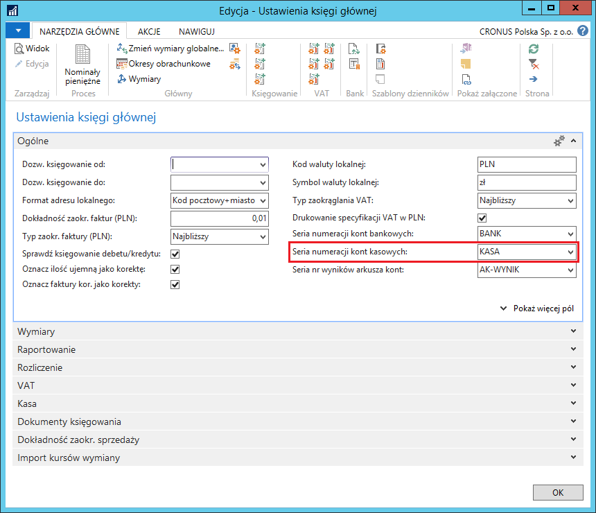

3.  W tym samym oknie, na karcie skróconej **Kasa** należy wprowadzić
    właściwe parametry. Są to parametry domyślne, obowiązujące
    dla wszystkich kont kasowych.

    -   **Obowiązkowy raport kasowy** – zaznaczenie tego pola powoduje
         wymuszenie otworzenia raportu kasowego (dla każdego konta kasowego
         oddzielnie) przed zaksięgowaniem jakiegokolwiek dokumentu
         kasowego.
    
    -   **Domyślny limit wypłaty gotówkowej (PLN)** – w tym polu należy
         wprowadzić domyślną maksymalną kwotę jednorazowej wypłaty gotówki
         w walucie lokalnej. Kwota z tego pola domyślnie kopiowana jest
         do właściwego pola w kartotekach kont kasowych w walucie lokalnej.
    
    -   **Domyślny limit wpłaty gotówkowej (PLN)** – w tym polu należy
         wprowadzić domyślną maksymalną kwotę jednorazowej wpłaty gotówki
         w walucie lokalnej. Kwota z tego pola domyślnie kopiowana jest
         do właściwego pola w kartotekach kont kasowych w walucie lokalnej.
    
    -   **Wyłącz z korekty kursu wymiany** – zaznaczenie tego pola oznacza,
         że zapisy w walucie obcej kont kasowych będą wykluczone z funkcji
         **Koryguj kursy wymiany**. Informacja ta będzie kopiowana
         do właściwego pola w kartotekach kont kasowych w walucie obcej.

  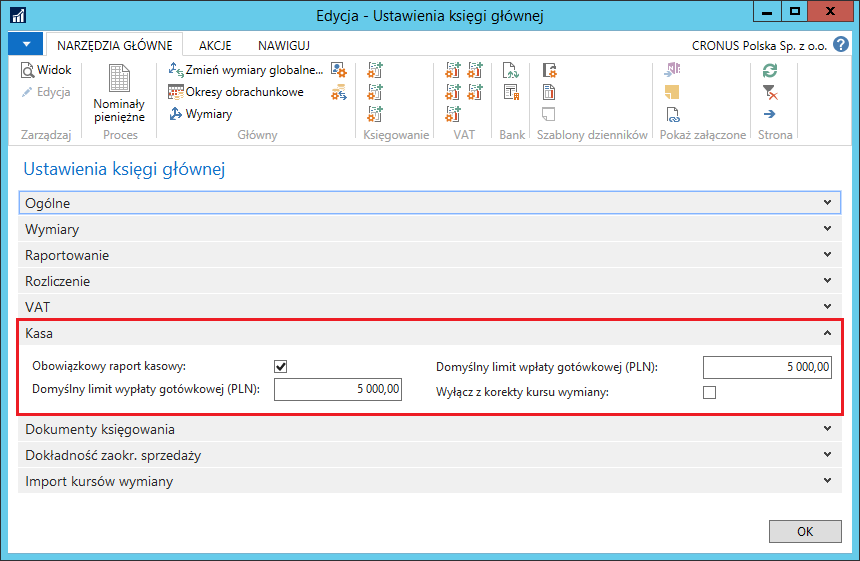

Kolejnym ustawieniem, jakie należy zdefiniować, jest grupa księgowa
do obsługi transakcji kasowych. W tym celu należy postępować
według następujących kroków:

1.  Należy wybrać **Działy \> Zarządzanie Finansami \> Administracja \>
    Grupy księgowe kont bankowych**.

2.  W oknie **Grupy księgowe kont bankowych**, które się otworzy,
    w pierwszym wolnym wierszu należy uzupełnić pole **Kod**, a w polu
    **Nr konta bankowego K/G** należy z listy rozwijanej wybrać konto
    K/G przeznaczone do księgowania transakcji gotówkowych.

3.  Opcjonalnie, dla wybranych grup księgowych, w polu **Nr konta
    tymczasowego K/G** można wybrać konto, które będzie używane jako
    środki pieniężne w drodze dla transakcji przeniesienia gotówki:

    -   z jednego konta kasowego na inne konto kasowe,
    
    -   z konta kasowego na konto bankowe,
    
    -   z konta bankowego na konto kasowe.

    Pozostawienie tego pola pustego oznacza konieczność ręcznego wskazania
    konta środków pieniężnych w drodze podczas ewidencji transferu gotówki
    w ww. transakcjach.
    
  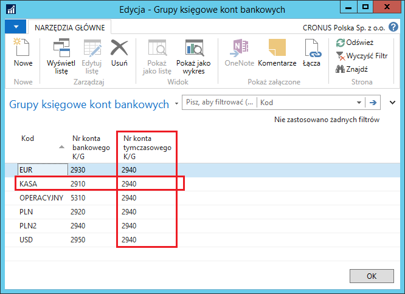
W ramach funkcjonalności **Zarządzanie kasą gotówkową** można też
zdefiniować nominały pieniężne dla każdej waluty oddzielnie.

W celu zdefiniowania nominałów pieniężnych dla waluty lokalnej, należy
postępować według następujących kroków:

1.  Należy wybrać **Działy \> Zarządzanie Finansami \> Administracja \>
     Ustawienia księgi głównej.**

2.  W oknie **Ustawienia księgi głównej**, które się otworzy, należy
     wybrać **Nominały pieniężne.**

3.  W oknie **Nominały pieniężne**, które się otworzy, należy wprowadzić
     tyle wierszy, ile jest nominałów monet i banknotów waluty
     lokalnej:

  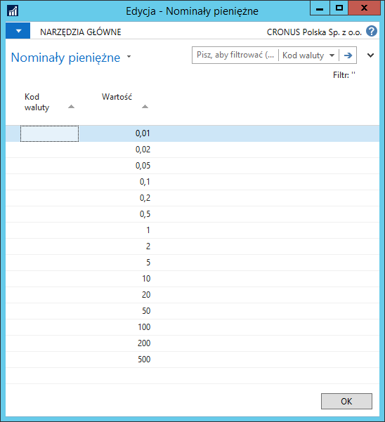

W celu zdefiniowania nominałów pieniężnych dla waluty obcej, należy
postępować według następujących kroków:

1.  Należy wybrać **Działy \> Zarządzanie Finansami \> Działania
     okresowe \> Waluta \> Waluty.**

2.  W oknie **Waluty**, które się otworzy, należy ustawić kursor
     w wierszu z wybraną walutą i wybrać **Nominały pieniężne.**

3.  W oknie **Nominały pieniężne**, które się otworzy, należy wprowadzić
     tyle wierszy, ile jest nominałów monet i banknotów waluty
     lokalnej:

  

Ostatnią niezbędną czynnością jest zdefiniowanie trzech nowych serii
numeracyjnych, które będą używane do numerowania dokumentów:

-   Wpłat gotówkowych

-   Wypłat gotówkowych

-   Raportów kasowych

>[!NOTE]
>Serie numeracyjne dokumentów powinny być zdefiniowane
dla każdego konta kasowego oddzielnie. Ułatwi to kontrolę i nawigację
transakcji.

## Obsługa

### Zakładanie kartoteki kasy

W celu utworzenia kartoteki kasy, należy postępować według następujących
kroków:

1.  Należy wybrać **Działy \> Zarządzanie Finansami \> Zarządzanie kasą
    gotówkową \> Kasy.**

2.  W oknie **Kasy**, które się otworzy, należy wybrać **Nowe**.
    W wyniku tego działania utworzona zostanie kartoteka kasy
    z częściowo uzupełnionymi danymi na podstawie domyślnych ustawień
    opisanych wcześniej.

3.  W kartotece nowej kasy konieczne jest uzupełnienie niektórych pól,
    a niektóre z nich mogą zostać uzupełnione w celach informacyjnych.

    -  Na karcie skróconej **Ogólne:**
    
        -   Pole **Nr** wypełniane jest automatycznie zgodnie z wybraną serią
             numeracji
        
        -   W polu **Nr kasjera** z listy rozwijanej można wybrać wcześniej
             zdefiniowanego pracownika, który obsługuje daną kasę. Jest to pole
             wyłącznie informacyjne, nie ma obowiązku jego uzupełniania.
        
        -   Podobnie nazwa, dane adresowe oraz komunikacyjne (na karcie
             skróconej **Komunikacja**) – te pola również pełnią rolę
             wyłącznie informacyjną, mogą pozostać puste.
        
    -  Na karcie skróconej **Księgowanie** są bardzo ważne pola,
        które muszą być odpowiednio wypełnione.
    
        -   W polu **Grupa księgowa kasy** należy wybrać kod grupy powiązanej
             z właściwym kontem K/G
        
        -   W polu **Kod waluty** należy wybrać walutę, w jakiej będą
             realizowane transakcje w tej kasie
        
        -   W polach: **Seria numeracji dokumentów kasowych wpłaty**, **Seria
             numeracji dokumentów kasowych wypłaty** i **Seria numeracji
             raportów kasowych** należy z list rozwijanych wybrać wcześniej
             zdefiniowane serie numeracji dla dokumentów księgowanych w danej
             kasie
        
        -   Pole **Wyłącz z korekty kursu wymiany** wypełniane jest
             automatycznie przez system domyślną, wcześniej ustawioną
             wartością, ale może zostać ręcznie zmienione dla tej jednej
             konkretnej kasy. Znaczenie tego pola zostało opisane wcześniej –
             przy definiowaniu domyślnych ustawień.
    
    -  Na karcie skróconej Limity:
    
        -   W polu **Kontrola limitu salda** należy wybrać jedną z opcji:
        
            -   **Brak** – Saldo nie będzie kontrolowane
            
            -   **Minimum** – System będzie kontrolował tylko saldo minimalne,
                 czyli nie dopuści do osiągnięcia salda poniżej poziomu określonego
                 w polu **Saldo minimalne.**
            
            -   **Maksimum** – System będzie kontrolował tylko saldo maksymalne,
                 czyli nie dopuści do osiągnięcia salda powyżej poziomu określonego
                 w polu **Saldo maksymalne.**
            
            -   **Obie** – System będzie kontrolował saldo minimalne i maksymalne,
                 czyli nie dopuści do osiągnięcia salda poniżej poziomu określonego
                 w polu **Saldo minimalne** i powyżej poziomu określonego w polu
                 **Saldo maksymalne**.
        
        -   Pola: **Limit wpłaty gotówkowej** i **Limit wypłaty gotówkowej**
             wypełniane są automatycznie przez system na podstawie domyślnych
             ustawień. Możliwa jest ręczna zmiana tych wartości bezpośrednio
             w kartotece nowej kasy. W polach tych ustalane są limity
             dla jednorazowej transakcji wpłaty lub wypłaty gotówkowej
             rejestrowanej w danej kasie.
        
        -   Pola: **Saldo dokumentu kasowego** i Saldo **dokumentu kasowego
             (PLN)** są nieedytowalne, wypełniane automatycznie przez system
             i przedstawia sumę kwot z niezaksięgowanych dokumentów kasowych.

  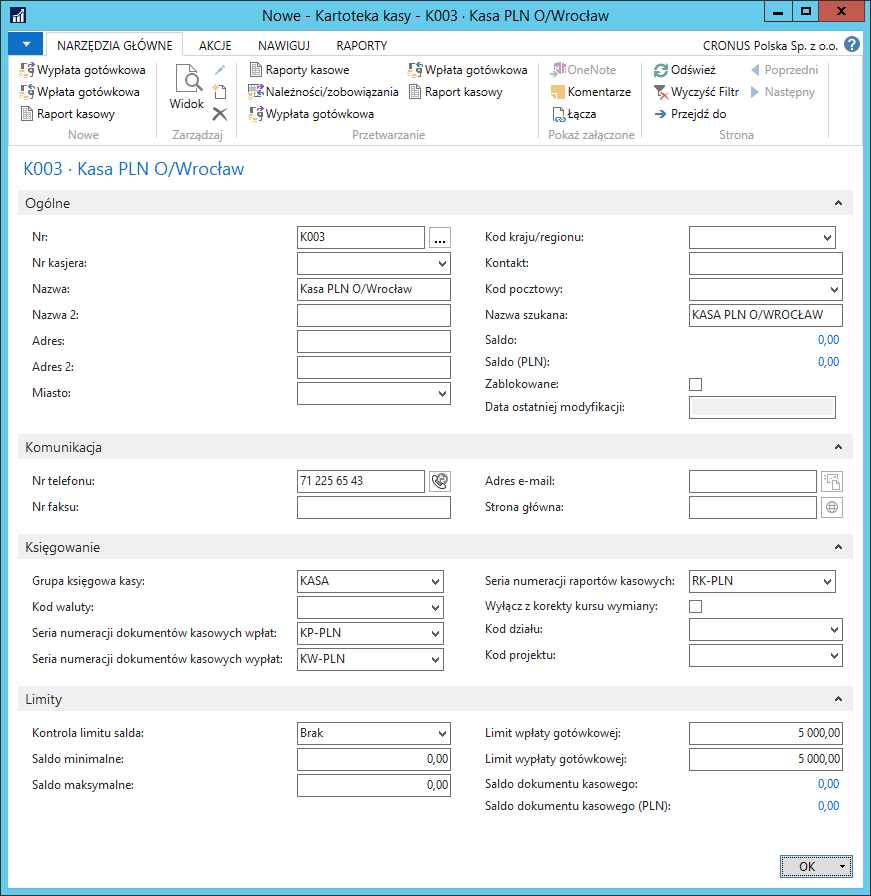

### Ewidencja dokumentów kasowych

W kasie ewidencjonowane są dwa rodzaje transakcji: wpłaty i wypłaty
gotówki. Obydwa rodzaje transakcji mogą być wprowadzane dwoma sposobami:
z poziomu menu głównego i z poziomu kartoteki kasy.

>[!NOTE]
>W sytuacji, gdy podczas konfiguracji modułu Zarządzanie
kasą gotówkową zdefiniowano obowiązek tworzenia raportów kasowych,
przed zarejestrowaniem pierwszej operacji w kasie konieczne jest
otworzenie raportu kasowego. Procedura tworzenia raportu kasowego
opisana jest w dalszej części tego rozdziału.

W celu wprowadzenia dokumentu wpłaty (wypłaty) gotówkowej z poziomu
kartoteki kasy, należy postępować według następujących kroków:

1.  Należy wybrać **Działy \> Zarządzanie Finansami \> Zarządzanie kasą
     gotówkową \> Kasy**. Wybraną kasę należy otworzyć w formie
     kartoteki.

2.  W kartotece wybranej kasy należy wybrać **Wpłata gotówkowa**
     (**Wypłata gotówkowa**)**.** Z listy kas, która się otworzy,
     należy wybrać właściwą.

W celu wprowadzenia dokumentu wpłaty (wypłaty) gotówkowej z poziomu menu
głównego, należy postępować według następujących kroków:

1.  Należy wybrać **Działy \> Zarządzanie Finansami \> Zarządzanie kasą
     gotówkową \> Wpłaty gotówkowe** (**Wypłaty gotówkowe**).

2.  W oknie **Wpłaty gotówkowe** (**Wypłaty gotówkowe**), które się
     otworzy, należy wybrać **Nowe.** Z listy kas, która się otworzy,
     należy wybrać właściwą.

Dalsza obsługa jest taka sama dla dokumentów kasowych, niezależnie
od sposobu ich wprowadzenia:

3.  W oknie **Wpłata gotówkowa** (**Wypłata gotówkowa**) część pól
    wypełniona jest automatycznie.

    -  Na karcie skróconej **Ogólne**:
    
        -   Pole **Nr** uzupełniane jest automatycznie, zgodnie z przypisaną
                wcześniej serią numeracji
        
        -   W polu **Nazwa odbiorcy płatności/płatnika** można wpisać imię
                i nazwisko osoby wpłacającej lub odbierającej gotówkę.
        
        -   Pole **Kod waluty** wypełniane jest automatycznie przez system kodem
                waluty przypisanym do kartoteki konta kasy. Pod przyciskiem asysty
                edycji obok tego pola otwiera się okno **Zmiana kursu wymiany**,
                w którym w polu **Relacyjny kurs wymiany** wstawiony jest domyślny
                kurs pobrany z okna **Kursy wymiany walut** dla danej waluty.
                W razie potrzeby, kurs ten może być ręcznie zmieniony w danym
                dokumencie kasowym.
        
        -   Pola **Kwota i Kwota (PLN)** są nieedytowalne. W polach tych
                prezentowana jest suma wartości danego dokumentu kasowego, zarówno
                w walucie źródłowej, jak i w przeliczeniu na walutę lokalną.
        
        -   W polach **Data księgowania, Data dokumentu** i **Data obowiązku
                VAT** system automatycznie wstawia datę roboczą, można ręcznie
                zmienić te daty na inne.
        
        -   Zaznaczenie pola **Korekta** spowoduje zaksięgowanie transakcji
                na kontach KG po przeciwnej stronie z minusem (jako tzw. storno
                czerwone).
        
        -   Pole **Nr raportu kasowego** pozostaje puste w sytuacji, gdy pole
                **Obowiązkowy raport kasowy** w oknie **Ustawienia księgi
                głównej** jest niezaznaczone. W przeciwnym wypadku raport kasowy
                musi być otwarty przed rozpoczęciem wprowadzania dokumentów
                kasowych. W takiej sytuacji, pole **Nr raportu kasowego** będzie
                uzupełniane automatycznie przez system, zgodnie z wybraną seria
                numeracyjną.
        
        -   Pole **Liczba wydruków** jest nieedytowalne, wypełniane
                automatycznie przez system.
    
    -  Na karcie skróconej **Wymiary** można wprowadzić wartości wymiarów
        globalnych, zgodnie z ustalonymi regułami księgowania wymiarów.
        Wartości wymiarów dodatkowych można wprowadzić w oknie **Edytuj
        zapisy zestawu wymiarów** otwieranym poprzez wybranie **Nawiguj \>
        Wymiary**.
    
    -  Na karcie skróconej **Podformularz wpłaty gotówkowej**
        (**Podformularz wypłaty gotówkowej**) należy wprowadzić szczegółowe
        dane transakcji:
    
        -   W polu **Typ konta** należy wybrać typ konta jako konto
                przeciwstawne do konta kasy w księgowanej transakcji.
        
        -   W polu **Nr konta** należy wybrać z listy rozwijanej konto
                przeciwstawne do konta kasy w księgowanej transakcji. Lista kont
                jest zgodna z typem wybranym w polu **Typ konta**.
        
        -   Pole **Typ dokumentu** jest uzupełniane automatycznie przez system
                na podstawie wprowadzonych parametrów.
        
        -   Pole **Grupa księgowa** wypełniane jest automatycznie przez system
                kodem domyślnie wybranym w kartotekach kont ksiąg pomocniczych.
                Kod grupy księgowej może być ręcznie zmieniony zgodnie z zasadami
                funkcjonalności **Zastępcze grupy księgowe.**
        
        -   W polach **Typ dokumentu rozliczającego** i **Nr dokumentu
                rozliczającego** można wybrać typ i numer dokumentu, z jakim
                zostanie rozliczona księgowana transakcja gotówkowa.
        
            Użycie tych pól jest możliwe wyłącznie dla wybranych typów kont:
            **Nabywca** lub **Dostawca** i ma odniesienie wyłącznie do jednego
            dokumentu rozliczającego.
        
            W celu rozliczenia większej ilości dokumentów, należy wybrać **Funkcje
            \> Rozlicz zapisy**. Dalsza procedura rozliczania dokumentów jest
            standardowa.
        
        -   Do pola **Opis** kopiowana jest nazwa konta, ale treść opisu może
                zostać ręcznie zmieniona.
        
        -   W polu **Kwota** należy wprowadzić kwotę transakcji, a na tej
                podstawie system uzupełni pole **Kwota (PLN)**: dla transakcji
                w walucie lokalnej będzie to ta sama kwota, a dla transakcji
                w walucie obcej będzie to kwota przeliczona zgodnie z kursem
                wymiany walut obowiązującym dla daty księgowania transakcji.
        
        -   Pole **Wstrzymany** ma standardową obsługę. Wypełnienie tego pola ma
                znaczenie tylko przy zapisach księgi nabywców i dostawców –
                zapisy wstrzymane są pomijane przy sugerowaniu płatności.
    
  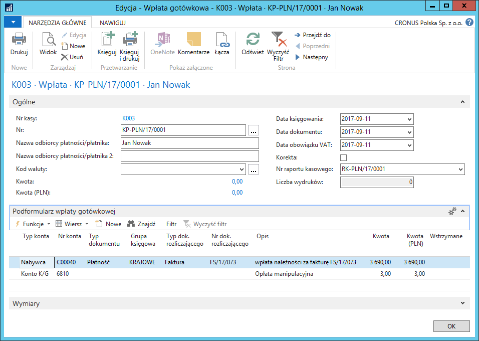
W następnym kroku należy wybrać **Księguj lub Księguj i drukuj**

Podczas księgowania dokumentów kasowych system dokonuje kontroli:

1.  Czy saldo kasy po zaksięgowaniu mieści się w ustawionych limitach

2.  Czy kwota wpłaty (wypłaty) mieści się w ustawionych limitach

Po zaksięgowaniu dokumentów kasowych można wydrukować zaksięgowane
dokumenty. W tym celu należy postępować według następujących kroków:

1.  Należy wybrać **Działy \> Zarządzanie Finansami \> Zarządzanie kasą
     gotówkową \> Zaksięgowane wpłaty gotówkowe** (**Zaksięgowane
     wypłaty gotówkowe**).

2.  W oknie z listą zaksięgowanych dokumentów kasowych należy
     podświetlić wiersz z wybraną zaksięgowaną wpłatą gotówkową
     (zaksięgowaną wypłatą gotówkową) i wybrać **Drukuj zaksięgowane
     wpłaty gotówkowe** (**Drukuj zaksięgowane wypłaty gotówkowe**).

 Opcjonalnie można wybraną zaksięgowaną wpłatę gotówkową (zaksięgowaną
 wypłatę gotówkową) otworzyć w formie kartoteki i tam wybrać
 **Drukuj**.

3.  W oknie wstępnym raportu, które się otworzy, można zmienić filtry
     wstawione domyślnie przez system a następnie wybrać **Drukuj**
     lub **Podgląd**.

  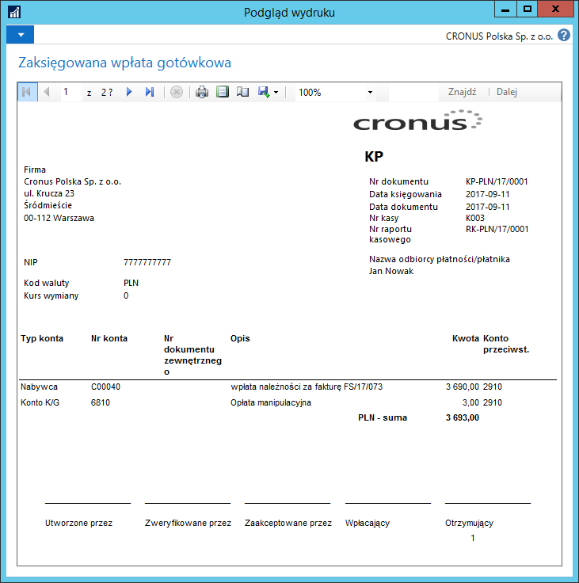

### Tworzenie raportów kasowych

Raporty kasowe są zestawieniem dokumentów kasowych z wybranego okresu.
W celu utworzenia raportu kasowego należy postępować
według następujących kroków:

1.  Należy wybrać **Działy \> Zarządzanie Finansami \> Zarządzanie kasą
    gotówkową \> Raporty kasowe**.

2.  W oknie **Raporty kasowe**, które się otworzy, widać wszystkie
    dotychczas utworzone raporty kasowe, zarówno te ze stanem
    **Otwarty**, jak i **Zamknięty**.

W sytuacji, gdy, zgodnie z wcześniej zdefiniowanymi ustawieniami, raport
kasowy jest obowiązkowy, dalsza procedura jest następująca:

1.  Należy wybrać **Nowe**, a z listy kas, która się otworzy, należy
    wybrać właściwą.

2.  W oknie **Raport kasowy**, które się otworzy, na karcie skróconej
     **Ogólne**, część pól jest automatycznie uzupełniona, niektóre
     z nich można zmienić.

    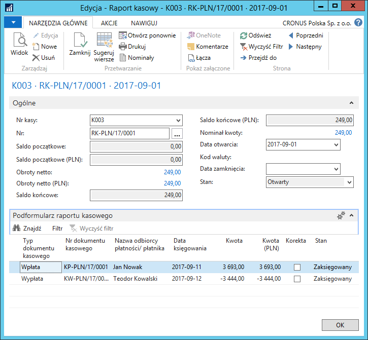

    -   W polu **Nr** jest wstawiany automatycznie numer kolejny raportu
         kasowego, zgodny z wcześniej zdefiniowana serią numeracji.
    
    -   W polu **Data otwarcia** wstawiana jest automatycznie data robocza,
         ale można ją ręcznie zmienić na inną.
    
    -   W polu **Data zamknięcia** wstawiana jest automatycznie data robocza
         w momencie zmiany stanu na **Zamknięty**.
    
    -   Pola: **Saldo początkowe** i **Saldo początkowe (PLN)**
         są nieedytowalne i prezentują saldo (w walucie przypisanej
         do wybranego konta kasowego oraz walucie lokalnej) wybranego konta
         kasy w chwili otwierania raportu kasowego.
    
    -   Pola: **Obroty netto** i **Obroty netto (PLN)** są nieedytowalne
         i prezentują sumę obrotów (w walucie przypisanej do wybranego
         konta kasowego oraz walucie lokalnej) wybranego konta kasy
         w bieżącym raporcie kasowym.
    
    -   Pola: **Saldo końcowe** i **Saldo końcowe (PLN)** są nieedytowalne
         i prezentują saldo końcowe (w walucie przypisanej do wybranego
         konta kasowego oraz walucie lokalnej) wybranego konta kasy
         w bieżącym raporcie kasowym obliczone jako suma salda początkowego
         i obrotów netto.
    
    -   Pole **Kod waluty** jest nieedytowalne i prezentuje kod waluty
         przypisany do konta kasy, dla którego utworzony jest bieżący
         raport kasowy.
    
    -   Pole **Stan** może mieć opcję:
    
        -   **Otwarty** – edycja raportu kasowego jest dozwolona
        
        -   **Zamknięty** – edycja raportu kasowego nie jest dozwolona.
    
         Opcja w polu **Stan** zmieniana jest poprzez wybranie **Zamknij**
         lub **Otwórz ponownie**.
    
    -   Pole **Nominał kwoty** wyświetla kwotę – sumę wartości nominałów
         pieniężnych, które są ręcznie przypisywane do danego raportu
         kasowego. Celem tej czynności jest określenie ilości monet
         i banknotów o określonych nominałach w momencie zamykania raportu
         kasowego.

         W celu wprowadzenia nominałów, należy kliknąć w polu **Nominał
         kwoty**. Otworzy się okno **Specyfikacja nominału**, w którym należy
         wybrać **Edytuj listę**, a następnie, w polu **Ilość** należy
         wprowadzić odpowiednią ilość monet lub banknotów w wierszach
         z odpowiednimi nominałami (nominały odpowiadają nominałom
         zdefiniowanym dla waluty przypisanej do konta kasy, dla
         którego tworzony jest raport kasowy):

    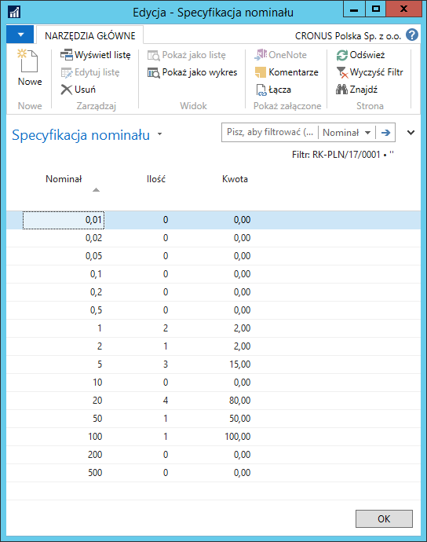

    -   Na karcie skróconej **Podformularz raportu kasowego**, w oknie
        **Raport kasowy** wszystkie pola są nieedytowalne. Wiersze raportu
        kasowego wypełniane są zaksięgowanymi dokumentami kasowymi

3.  Ostatnim krokiem w tworzeniu raportu kasowego jest zmiana jego stanu
    na **Zamknięty**. W tym celu należy wybrać **Zamknij**. System
    zmieni stan raportu kasowego na **Zamknięty** i zablokuje edycję.

4.  W sytuacji, gdy konieczne jest naniesienie zmian w raporcie (dodanie
    do niego kolejnych dokumentów kasowych), należy zmienić stan raportu
    poprzez wybranie w jego kartotece **Otwórz ponownie**.

>[!NOTE]
>Dla jednego konta kasy w tym samym czasie może być otwarty
tylko jeden raport kasowy. Przed ponownym otworzeniem zamkniętego
raportu kasowego, należy tymczasowo zamknąć otwarty raport kasowy
(jeżeli jest taki).

5.  Jeżeli w ustawieniach nie został zdefiniowany obowiązek tworzenia
     raportów kasowych, wiersze raportu kasowego mogą zostać wstawione
     poprzez wybranie **Sugeruj wiersze** w kartotece raportu kasowego.
     W oknie, które się otworzy należy podać parametry precyzujące
     zakres dokumentów kasowych, które mają zostać pobrane do raportu
     kasowego.

6.  W celu wydrukowania raportu kasowego, należy wybrać **Drukuj**
     w kartotece wybranego raportu kasowego lub na liście raportów
     kasowych po zaznaczeniu wiersza z wybranym raportem. Następnie
     należy wybrać **Drukuj** lub **Podgląd**:

  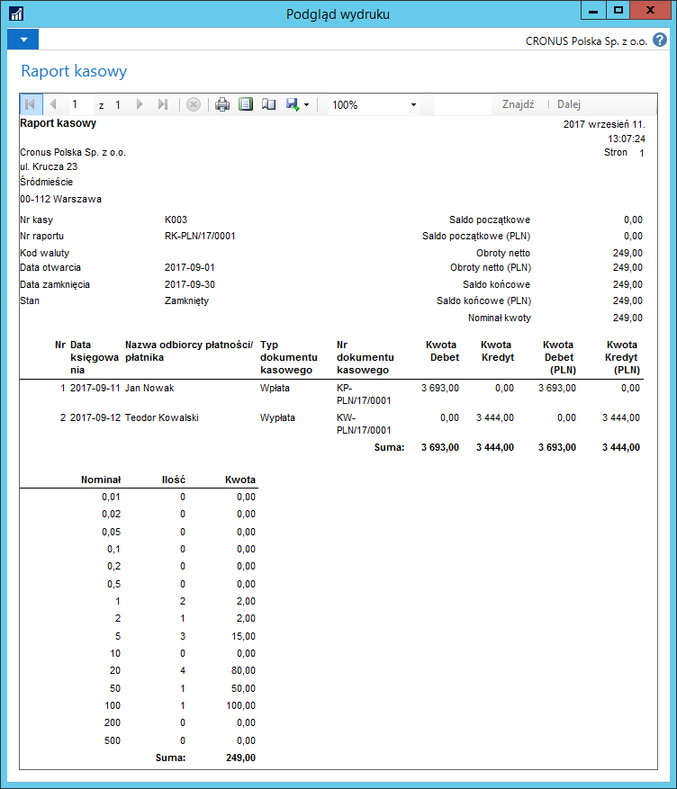

### Księgowanie transakcji kasowych

Większość operacji księgowanych przez dokumenty (raporty) kasowe ma ten
sam skutek, jak transakcje księgowane przez dzienniki główne.
Specyficznymi transakcjami gotówkowymi, które mogą być zaksięgowane
w inny sposób, niż standardowy, są przekazania gotówki na inne konta
kasowe lub bankowe.

Standardowo, w przypadku wpłaty gotówki do kasy z innego konta kasowego
lub bankowego, należy zaksięgować dokument **Wpłata gotówkowa**, w
którego wierszach wskazane jest konto K/G „Środki pieniężne w drodze".
W przypadku wypłaty gotówki z kasy na inne konto kasowe lub bankowe,
należy zaksięgować dokument **Wypłata gotówkowa**, w którego wierszach
wskazane jest konto K/G „Środki pieniężne w drodze".

W celu zarejestrowania operacji transferu gotówki pomiędzy kontami
kasowymi i/lub kontami bankowymi z wykorzystaniem funkcjonalności
związanej z kontem tymczasowym wybranym w polu **Nr konta tymczasowego
K/G** w oknie **Grupy księgowe kont bankowych**, należy postępować
według następujących kroków:

1.  Należy wybrać **Działy \> Zarządzanie Finansami \> Zarządzanie kasą
     gotówkową \> Wpłaty gotówkowe** (**Wypłaty gotówkowe**).

2.  W oknie **Wpłaty gotówkowe** (**Wypłaty gotówkowe**), które się
     otworzy, należy wybrać **Nowe.** Z listy kas, która się otworzy,
     należy wybrać właściwą.

3.  Pola w kartach skróconych **Ogólne** i **Wymiary** należy wypełnić
    standardowo, zgodnie z opisem zamieszczonym we wcześniejszej części
    tego rozdziału.

4.  Na karcie skróconej **Podformularz wpłaty gotówkowej**
    (**Podformularz wypłaty gotówkowej**) należy uzupełnić pola:

    -   **Typ konta** – z listy rozwijanej należy wybrać opcję **Konto
         bankowe**
    
    -   **Nr konta** – z listy rozwijanej należy wybrać konto bankowe, z
         którego gotówka jest transferowana (w przypadku wpłaty gotówkowej)
         lub na które gotówka jest transferowana (w przypadku wypłaty
         gotówkowej).
    
    -   **Kwota** – należy wprowadzić kwotę transferowanej gotówki
         w walucie przypisanej do konta kasy.
    
    -   **Opis** – pole domyślnie uzupełniane jest nazwa wybranego konta,
         w razie potrzeby można ręcznie zmienić treść opisu.

5.  Dokument kasowy należy zaksięgować wybierając **Księguj**.

  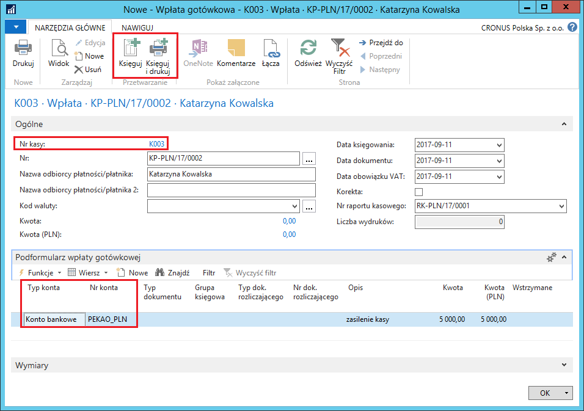
Zapisy na kontach K/G utworzone na podstawie zaksięgowanego dokumentu
kasowego obejmują m.in. konto ustawione jako **Nr konta tymczasowego
K/G** dla grup księgowych kont bankowych (definiowanie grup księgowych
kont bankowych zostało opisane we wcześniejszej części tego rozdziału).
W celu sprawdzenia zapisów księgowych, należy postępować
według następujących kroków:

1.  Należy wybrać **Działy \> Zarządzanie Finansami \> Zarządzanie kasą
    gotówkową \> Zaksięgowane Wpłaty gotówkowe** (**Zaksięgowane Wypłaty
    gotówkowe**).

2.  W oknie z listą zaksięgowanych wpłat gotówkowych (zaksięgowanych
     wypłat gotówkowych), które się otworzy, należy zaznaczyć wiersz
     z wybranym zaksięgowanym dokumentem kasowym i wybrać **Nawiguj.**

3.  W oknie **Nawiguj**, które się otworzy, należy zaznaczyć wiersz
     **Zapis K/G** i wybrać **Pokaż powiązane zapisy**.

4.  W oknie **Zapisy K/G** należy zwrócić uwagę na numery kont
     księgowych użytych w transakcji – jest między innymi konto
     ustawione jako tymczasowe dla grup księgowych kont bankowych.

  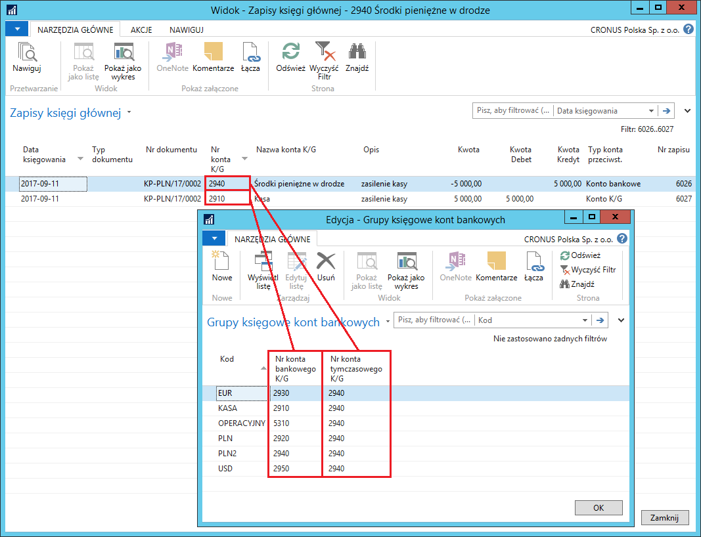