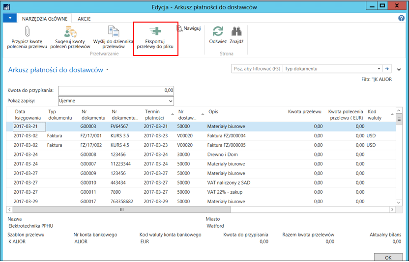
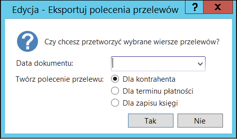

# Wprowadzanie przelewów

Wprowadzanie przelewów odbywa się za pośrednictwem specjalnie
utworzonego **Arkusza płatności do dostawców**/**nabywców**,
które następnie przenoszone są do dziennika przelewów bankowych, skąd
mogą być wyeksportowane.

W czasie przenoszenia przelewów do dziennika przelewów informacje o nich
przenoszone są do zapisów w rejestrach przelewów.

Tylko niektóre informacje można modyfikować w przelewach przeniesionych
do **Dziennika przelewów bankowych**.

**Arkusz płatności do dostawców**/**nabywców** ma następującą strukturę:

  

W poniższym zestawieniu podano wszystkie pola. Znaczek umieszczony
w kolumnie **Wypełnienie** informuje o tym, czy pole musi być
wypełnione:

\^ pole należy zawsze wypełnić,

• pole należy wypełnić w zależności od potrzeb,

○ pole jest automatycznie wypełniane przez system.

Kolumna **Uwagi** zawiera opis pola oraz krótkie wyjaśnienie,
jak wykorzystywane jest pole.

|**Nazwa**|                               **Wypełnienie**|   **Uwagi**|
|-----|-----|-----|
|**Data księgowania**|                    ○|             Pole przepisane z zapisów księgi dostawcy/nabywcy.|
|**Typ dokumentu**|                       ○|             Pole przepisane z zapisów księgi dostawcy/nabywcy.|
|**Nr dokumentu**|                        ○|             Pole przepisane z zapisów księgi dostawcy/nabywcy.|
|**Termin płatności**|                    ○|             Pole przepisane z zapisów księgi dostawcy/nabywcy.|
|**Nr dostawcy/ nabywcy**|                ○|             Pole przepisane z zapisów księgi dostawcy/nabywcy.|
|**Opis**|                                ○|             Pole przepisane z zapisów księgi dostawcy/nabywcy.|
|**Kwota polecenia przelewu**|            \^|            Kwota, jaką chcemy zapłacić za określoną fakturę.|
|**Kwota polecenia przelewu (Waluta)**|   ○|            Kwota, jaką chcemy zapłacić za określoną fakturę w walucie konta banku, z którego dokonujemy przelewu.|
|**Kod waluty**|                          ○|             Pole przepisane z zapisów księgi dostawcy/nabywcy.|
|**Kwota pozostała**|                     ○|             Pole przepisane z zapisów księgi dostawcy/nabywcy.|
|**Kwota pozostała (PLN)**|               ○|             Pole przepisane z zapisów księgi dostawcy/nabywcy.|
|**Kwota poleceń przelewu (dziennik)**|   ○|             Zsumowana kwota wszystkich przelewów dotyczących danego zapisu, znajdujących się w różnych dziennikach.|
|**Kwota poleceń przelewu (zapisy)**|     ○|             Zsumowana kwota wszystkich przelewów dotyczących danego zapisu, które zostały już wyeksportowane.|
|**Wstrzymane**|                          ○|             Pole przepisane z zapisów księgi dostawcy/nabywcy.|
|**Kod konta bank. dostawcy/nabywcy**|    ○/\^|          Kod konta bankowego dostawcy/nabywcy, na które chcemy wysłać przelew.|
|**Szablon polecenia przelewu**|          ○|             Pole uzupełniane automatycznie zgodnie z wybranym szablonem.|
|**Kwota pierwotna (PLN)**|               ○|             Pole przepisane z zapisów księgi dostawcy/nabywcy.|

## Tworzenie przelewów

Moduł Bankowość elektroniczna umożliwia automatyczne tworzenie przelewów
dla dostawców lub nabywców.

Do automatycznego tworzenia przelewów służą funkcje znajdujące się
w oknach **Arkusz płatności do dostawców** i **Arkusz płatności
do nabywców**.

Po otworzeniu okna **Arkusz płatności do dostawców** lub **Arkusz
płatności do nabywców** na ekranie wyświetlana jest lista dostępnych
szablonów w przypadku, gdy zdefiniowanych jest klika szablonów poleceń
przelewu. Gdy jest tylko jeden szablon, automatycznie otworzy się
odpowiednia strona. Brak szablonów sygnalizowany jest odpowiednim
komunikatem.

Wyświetlona zostanie lista zaksięgowanych zapisów księgi
dostawców/nabywców, wyfiltrowana według waluty konta bankowego
zdefiniowanego w szablonie polecenia przelewu. W przypadku zaznaczenia
opcji **Dozwolona inna waluta przelewu** na szablonie polecenia
przelewu, filtr ten nie jest stosowany.

**Szablon polecenia przelewu** zostanie wypełniony automatycznie zgodnie
z wcześniejszym wyborem.

W przypadku wypełnienia pola **Kod konta bankowego beneficjenta**
są trzy możliwości:

-   Gdy konto bankowe zostało wcześniej wybrane z listy, wpisanie
    wartości w polu **Kwota polecenia przelewu** niczego nie zmienia,

-   Gdy pole **Kod konta bankowego** nie jest wypełnione, wpisanie
    wartości w polu **Kwota polecenia przelewu** powoduje wybranie
    domyślnego kodu konta bankowego,

-   Gdy żadne konto beneficjenta nie zostało oznaczone jako domyślne
    na kartotece konta dostawcy/nabywcy, pojawi się błąd i wymagane
    będzie ręczne uzupełnienie pola **Kod konta bankowego**.

W zapisach księgi dostawcy/nabywcy wystarczy uzupełnić pole **Kwota
polecenia przelewu**. Istnieją trzy sposoby uzupełnienia pola **Kwoty
polecenia przelewu**:

1.  Ręczne wprowadzanie kwoty

    Użytkownik może ręcznie wpisać kwotę w polu **Kwota polecenia
    przelewu**. Zostanie ona poddana walidacji pod kątem poprawności:
    
    -   Wpisanie kwoty większej od **Kwoty pozostałej** spowoduje błąd.
    
    -   Wpisanie kwoty większej od **Kwoty pozostałej** pomniejszonej o już
        zdefiniowane lub wyeksportowane przelewy wywoła komunikat
        z informacją o błędzie. Od decyzji użytkownika zależeć będzie, czy
        dana kwota zostanie przypisana, czy też nie.

2.  Automatyczne wprowadzanie kwoty

    Przypisana zostanie kwota równa **Kwocie pozostałej** pomniejszonej
    o już zdefiniowane lub wyeksportowane przelewy. Można to uczynić zarówno
    dla jednego, jak i wielu wierszy za pomocą funkcji **Przypisz kwotę
    polecenia przelewu (F9)**.

  

3.  Sugerowanie kwoty

    Jeżeli znana jest kwota, dla której mają być utworzone przelewy, system
    może zasugerować przelewy. W tym celu należy na wstążce kliknąć przycisk
    **Sugeruj kwoty poleceń przelewów**.

    

    Należy wprowadzić **Kod waluty** oraz **Dostępną kwotę**. W wyniku
    działania skryptu, zostaną uzupełnione kwoty przelewów, które będą
    czekać na przekazanie do **Dziennika płatności**.

    

>[!NOTE]
>Opcji **Uwzględniaj nadpłaty** należy użyć w przypadku
sugerowania poleceń przelewów dla nabywców/dostawców posiadających
zaksięgowane otwarte (nierozliczone) płatności. System wówczas bierze
pod uwagę kwotę pozostałą z faktury i kwotę pozostałą z otwartej
płatności (nadpłaty) i uzupełnia pole **Kwota polecenia przelewu**
zarówno w wierszu dotyczącym faktury, jak i płatności.

>[!NOTE]
>W przypadku konta bankowego, gdy na szablonie nie ma
zaznaczonej opcji **Dozwolona inna waluta przelewu**, pole **Kod
waluty** przyjmuje wartość z **Konta bankowego** i jest nieedytowalne.

## Przekazanie przelewów do dziennika płatności

Po uzupełnieniu danych w wybranych zapisach księgi dostawcy/nabywcy
można przekazać je do **Dziennika płatności**.

  

System zapyta, z jaką datą utworzyć przelew oraz jakie grupowanie kwot
zastosować w przelewach.

  

System pogrupuje przelewy, a efekt można będzie zobaczyć w odpowiednim
**Dzienniku przelewów**. Najprostszym sposobem przejścia do **Dziennika
przelewów** jest kliknięcie akcji **Dziennik płatności**.

W oknie **Dziennik przelewów bankowych**, po sprawdzeniu wierszy
i ewentualnym uzupełnieniu wymaganych pól, należy na wstążce kliknąć
przycisk **Eksportuj płatności do pliku**.

  

  

W wyświetlonym oknie **Eksportuj plik** należy kliknąć przycisk
**Zapisz** i wybrać katalog, w którym zostanie zapisany plik. Następnie
plik należy przekazać do banku.

## Wyeksportowanie pliku płatności

Z okna **Arkusz płatności do dostawców**/**nabywców** można bezpośrednio
wyeksportować plik płatności pomijając krok w **Dzienniku przelewów**.

  

System zapyta z jaką datą utworzyć przelew oraz jakie grupowanie kwot
zastosować w przelewach.

  

System pogrupuje przelewy, a następnie wyświetli stronę **Eksportuj
plik**.

  

W wyświetlonym oknie **Eksportuj plik** należy kliknąć przycisk
**Zapisz** i wybrać katalog, w którym zostanie zapisany plik. Następnie
plik należy przekazać do banku.