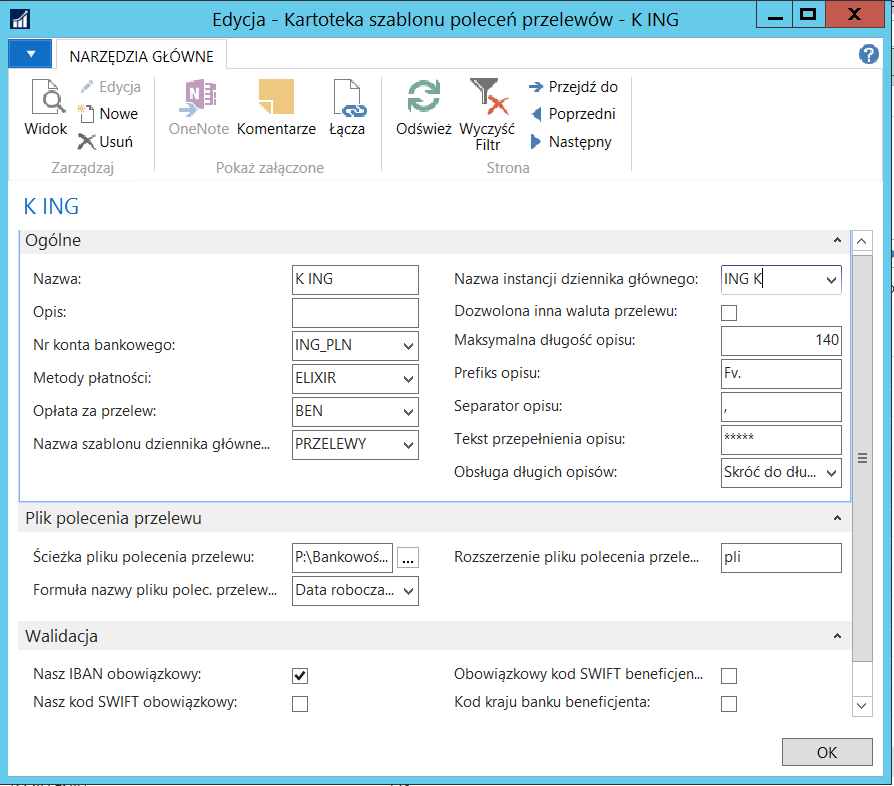
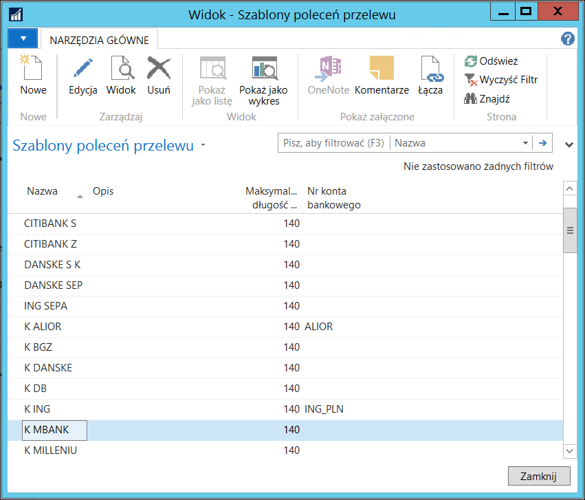
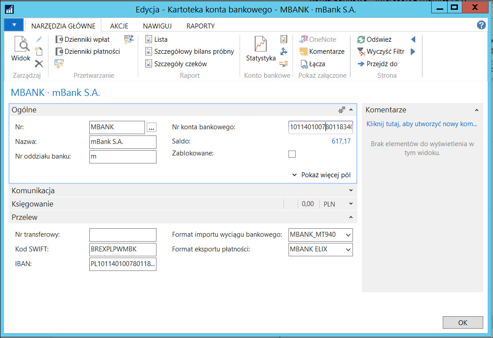

# Ustawienia 

Oprogramowanie oferowane przez każdy z banków jest inne. Brak standardu
powoduje konieczność zdefiniowania w module Bankowości Elektronicznej
podstawowych cech programu bankowego. Operację tę można wykonać w oknie
**Kartoteka szablonu poleceń przelewów**. Aby je otworzyć, należy wybrać
**Działy \> Zarządzanie Finansami \> Bankowość elektroniczna \> Szablony
poleceń przelewu**. Na liście należy odszukać i zaznaczyć wiersz
z wybranym szablonem, a następnie, na wstążce należy kliknąć przycisk
**Edycja**.

  

Dzięki wprowadzeniu szablonów poleceń przelewów użytkownik może między
innymi definiować następujące informacje o przelewach:

-   nr konta bankowego,

-   opłata,

-   metoda płatności,

-   nazwa szablonu i instancji dziennika,

-   prefiks opisu,

-   walidacja danych w systemie.

Przed rozpoczęciem pracy z modułem konieczne jest zdefiniowanie
następujących elementów:

 
|**Nazwa**|**Uwagi**|
|----|-----|
|**Szablon poleceń przelewów**|Szablony poleceń przelewów umożliwiają definiowanie różnych typów przelewów. Wymagane jest, aby dla przelewów krajowych i zagranicznych   danego banku zdefiniowane były odrębne szablony.|
|**Domyślny szablon dziennika głównego**|Szablon, na podstawie którego będą tworzone instancje dziennika głównego, do których będą przenoszone wygenerowane przelewy. Do szablonu przypisana jest domyślna seria numeracji przelewów.|
|**Domyślne instancje dziennika głównego**| Instancje, do których przenoszone będą wygenerowane przelewy, które następnie będzie można wyeksportować.|
|**Metoda płatności**|Metoda płatności jest powiązana z wierszem schematu wymiany danych, na tej podstawie przelewy generowane są wg właściwego schematu.|

## Definiowanie szablonów poleceń przelewów

Szablony poleceń przelewów umożliwiają elastyczne definiowanie
przelewów. Ich wprowadzanie wymaga wiedzy związanej z oprogramowaniem
bankowym na poziomie użytkownika.

>[!NOTE]
>Zalecane jest, aby definiowanie szablonów przelewów
przeprowadzała osoba, która jest odpowiedzialna za generowanie
przelewów w danej firmie, po ukończeniu (z wynikiem pozytywnym)
szkolenia obejmującego obsługę tego modułu. Nie zalecane jest,
aby definiowaniem szablonów przelewów zajmował się użytkownik końcowy.

Definiowanie szablonów poleceń przelewów możliwe jest w oknie **Szablony
poleceń przelewów**. Aby je otworzyć, należy wybrać **Zarządzanie
Finansami \> Bankowość elektroniczna \> Administracja \> Szablony
poleceń przelewów**.

  

Wprowadzając definicję nowego szablonu polecenia przelewów część pól
należy wypełnić obligatoryjnie, a pozostałe mogą być wypełniane
w zależności od potrzeb.

W poniższym zestawieniu podano wszystkie pola. Znak umieszczony
w kolumnie **Wypełnienie** informuje o tym, czy pole musi być
wypełnione:

\^ pole należy zawsze wypełnić,

• pole należy wypełnić w zależności od potrzeb,

○ pole jest automatycznie wypełniane przez system.

Kolumna **Uwagi** zawiera opis pola oraz krótkie wyjaśnienie,
jak wykorzystywane jest pole.

| **Nazwa**                    | **Wypełnienie** | **Uwagi**                    |
|--------------------------|-------------|--------------------------|
| **Nazwa**                | \^          | W tym polu należy wprowadzić nazwę szablonu poleceń przelewów.|
| **Opis**                 | •           | W tym polu należy wprowadzić tekst opisujący szablon poleceń przelewów.|
| **Nr konta bankowego**   | •           | Zawiera numer konta źródłowego,które system będzie sugerował w przypadku tworzenia przelewu na podstawie wybranego szablonu.|
| **Metoda płatności**|\^| W tym polu należy wybrać metodę płatności. Należy sprawdzić, czy           w zdefiniowanej metodzie płatności ustawiona jest wartość **Definicja wiersza eksportu płatności**.|
| **Opłata za przelew**    | •           | Pole zawiera informację  o tym, kto ponosi koszty wykonania przelewu. Wprowadzoną opcję system będzie sugerował w przypadku tworzenia przelewu na podstawie wybranego szablonu. Dostępne opcje to: <ul><li>**BEN** – jeżeli opłatę za przelew  ponosi beneficjent,</li><li>**OUR** – jeżeli opłatę za przelew ponosi wystawiający,</li><li>**SHA** – 50/50.</li><ul>|
| **Nazwa szablonu dziennika głównego**        | \^          | Domyślny szablon dziennika głównego, w którym zdefiniowana jest instancja, do której będą przekazywane wygenerowane przelewy. |
| **Nazwa instancji dziennika głównego**| \^          | Domyślna instancja dziennika głównego, do której będą przekazywane wygenerowane przelewy.|
| **Dozwolona inna waluta przelewu**   | •           | Po zaznaczeniu tego pola możliwe jest wykonanie przelewu w innej walucie niż przypisana do konta bankowego.|
| **Maksymalna długość opisu**    | \^          | Maksymalna ilość znaków do przyjęcia w opisie przelewu.|
| **Prefiks opisu**        | •           | Pole to wykorzystywane jest przez skrypty tworzące przelewy. Opis w wierszu utworzonym przez skrypty rozpoczyna się od tekstu podanego w tym polu. Następnie do opisu dodawane są numery dokumentów(faktur lub list płac), w zależności czy przelewy\ są tworzone dla nabywców, czy dla pracowników.         |
| **Separator opisu**      | \^          | Znacznik używany do dzielenia opisów w przelewach.|
| **Tekst przepełnienia opisu**    | \^          | Tekst, który pojawia się po przekroczeniu ilości znaków opisu wprowadzonej w polu **Maksymalna długość opisu**.|
| **Obsługa długich opisów**       | ○           | Możliwe są dwie opcje do wyboru: <ul><li>**Skróć do długości maksymalnej** – system skraca opis przelewu do ilości znaków zdefiniowanej w polu **Maksymalna długość opisu**,</li><li>**Użyj tekst przepełnienia opisu** – system w miejsce dłuższego opisu wstawia tekst zdefiniowany w polu **Tekst przepełnienia opisu**.</li><ul>|
| **Ścieżka pliku polecenia przelewu**| •           | Domyślna ścieżka zapisu plików poleceń przelewów.|
| **Formuła nazwy pliku polec. przelewu** | •           | Do wyboru domyślnej nazwy dla pliku polecenia przelewu możliwe są następujące opcje: <ul><li>**Data robocza** – system zapisuje jako nazwę pliku datę roboczą z NAV,</li><li>**Data robocza + Nr rejestru** – system zapisuje plik jako kombinację daty roboczej i numeru rejestru,</li><li>**Nazwa szablonu + Nr rejestru** – system zapisuje plik jako kombinację nazwy szablonu i numeru rejestru,</li><li>**Data robocza Nazwa szablonu + Nr rejestru** – systemzapisuje plik jako kombinacje daty roboczej, nazwy szablonu i numeru rejestru.</li><ul>|
| **Rozszerzenie pliku polecenia przelewu**      | \^          | Rozszerzenie pliku stosowane przez system bankowy (znane standardy: pli, pla,txt).|

Pola na karcie skróconej **Walidacja** należy zaznaczyć opcjonalnie.
System wówczas, w zależności od zaznaczonych opcji walidacji, będzie
sprawdzał wypełnienie wymaganych pól w momencie generowania/importowania
przelewów. Domyślnie zaznaczone pola, to:

-   **Nasz IBAN obowiązkowy**

-   **Obowiązkowy IBAN beneficjenta**

### Definiowanie domyślnego szablonu dziennika głównego

Przed rozpoczęciem korzystania z modułu Bankowość elektroniczna
niezbędne jest zdefiniowanie nowego szablonu dziennika głównego.

>[!NOTE]
>Zalecane jest, aby definiowanie nowego szablonu dziennika
głównego przeprowadzała osoba, która jest odpowiedzialna za tworzenie
szablonów poleceń przelewów. Nie zalecane jest, aby definiowaniem
nowego szablonu dziennika głównego zajmował się użytkownik końcowy.

Definiowanie nowego szablonu dziennika głównego możliwe jest w oknie
**Szablony dzienników głównych**. Aby otworzyć to okno, należy wybrać
**Działy \>** **Zarządzanie Finansami \> Administracja \> Ogólne \>
Szablony dzienników głównych**.

  

Wprowadzając definicję nowego szablonu dziennika głównego część pól
należy wypełnić obligatoryjnie, a pozostałe mogą być wypełniane
w zależności od potrzeb.

W poniższym zestawieniu podano wybrane pola. Znaczek umieszczony
w kolumnie **Wypełnienie** informuje o tym, czy pole musi być
wypełnione:

\^ pole należy zawsze wypełnić,

• pole należy wypełnić w zależności od potrzeb,

○ pole jest automatycznie wypełniane przez system.

Kolumna **Uwagi** zawiera opis pola oraz krótkie wyjaśnienie,
jak wykorzystywane jest pole.

|**Nazwa**|**Wypełnienie**|**Uwagi**|
|-------|---------|---------|
|**Nazwa**|\^|W tym polu należy wprowadzić nazwę szablonu dziennika głównego. W bieżącym przykładzie jest to: PRZELEWY.|
|**Opis**|•|W tym polu należy wprowadzić tekst opisujący szablon dziennika głównego. W bieżącym przykładzie jest to: Dziennik przelewów.|
|**Typ**|\^|W tym polu należy wybrać typ szablonu dziennika głównego. W bieżącym przykładzie jest to: Płatności.|
|**Identyfikator strony**|\^|W tym polu należy wprowadzić identyfikator strony, na której ten szablon będzie wykorzystywany. W bieżącym przykładzie jest to: 52063209|
|**Seria numeracji**|\^|W tym polu należy wybrać serię numeracji, według której system będzie numerował tworzone przelewy. W bieżącym przykładzie należy ją ustawić samodzielnie.|

### Definiowanie instancji dziennika głównego

Jeżeli potrzebnych jest wiele instancji dzienników głównych tego samego
typu, to na podstawie danego szablonu dziennika głównego (PRZELEWY –
utworzonego w przykładzie powyżej) można utworzyć dowolną ich liczbę.

>[!NOTE]
>Zalecane jest, aby definiowanie instancji dziennika
głównego przeprowadzała osoba, która jest odpowiedzialna za tworzenie
szablonów poleceń przelewów. Nie zalecane jest, aby definiowaniem
instancji szablonu dziennika głównego zajmował się użytkownik końcowy.

Definiowanie instancji dziennika głównego dostępne jest w oknie
**Instancje dziennika głównego**. Aby otworzyć to okno, należy wybrać
**Zarządzanie Finansami \> Administracja \> Ogólne \> Szablony
dzienników głównych**. Następnie należy zaznaczyć wiersz szablonu
dziennika głównego o nazwie PRZELEWY i kliknąć przycisk **Instancje**
na zakładce **Nawiguj**.

  

Wprowadzając definicję nowej instancji dziennika głównego część pól
należy wypełnić obligatoryjnie, a pozostałe mogą być wypełniane
w zależności od potrzeb.

W poniższym zestawieniu podano wszystkie pola. Znaczek umieszczony
w kolumnie **Wypełnienie** informuje o tym, czy pole musi być
wypełnione:

\^ pole należy zawsze wypełnić,

• pole należy wypełnić w zależności od potrzeb,

○ pole jest automatycznie wypełniane przez system.

Kolumna **Uwagi** zawiera opis pola oraz krótkie wyjaśnienie,
jak wykorzystywane jest pole.

|**Nazwa**|**Wypełnienie**|**Uwagi**|
|------|------|-----|
|**Nazwa**|\^|W tym polu należy wprowadzić nazwę instancji dziennika głównego.|
|**Opis**|•|W tym polu należy wprowadzić tekst opisujący instancję dziennika głównego.|
|**Typ konta przeciwst.**|\^|W tym polu należy wybrać **Konto bankowe**.
|**Nr konta przeciwst.**|\^|W tym polu należy wybrać odpowiednie konto bankowe, z którego będą wykonywane przelewy.|
|**Seria numeracji**|•|W tym polu należy wybrać serię numeracji, według której system będzie numerował przelewy tworzone w danej instancji dziennika głównego. Jeśli to pole nie jest wypełnione, będzie użyta seria numeracji przypisana do szablonu dziennika głównego.|

### Ustawienia konta bankowego

Do prawidłowego działania eksportu przelewów niezbędne jest wypełnienie
pola **Format eksportu płatności** w kartotece konta bankowego.
Odpowiednie wartości będą zaimportowane.

  