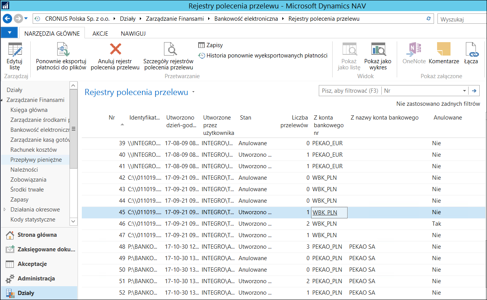
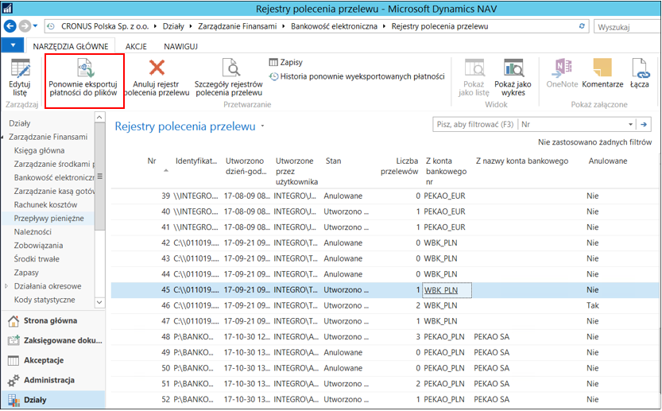
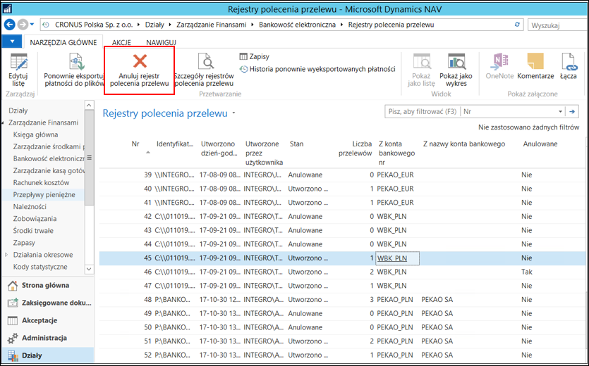

# Rejestry przelewów 

Wyeksportowane przelewy są przechowywane w rejestrach. W oknie rejestrów
przelewy można wyświetlać na ekranie, ponownie wyeksportować plik
lub podejrzeć szczegóły przelewu.

Program nadaje automatycznie wszystkim zapisom kolejne numery. Oznacza
to, że każdy zapis zatwierdzonego przelewu w Microsoft Dynamics 365
Business Central on‑premises można zidentyfikować przy pomocy jego
numeru.

Zapisy są umieszczone w kolejności zależnej od ich numerów w rejestrach
przelewów. Rejestr przelewów jest tworzony automatycznie w czasie
każdego eksportu dziennika przelewów. Poszczególne rejestry przelewów
są także numerowane, począwszy od numeru 1.

Aby wyświetlić listę istniejących rejestrów polecenia przelewu, należy
wybrać **Zarządzanie Finansami \> Bankowość elektroniczna \> Archiwum \>
Rejestry polecenia przelewu**. Na ekranie pojawi się okno **Rejestry
polecenia przelewu**. Przedstawia ono zapisy przelewów znajdujących się
w rejestrze.

  

W każdym rejestrze przelewów struktura pojedynczego rekordu wygląda
jak poniżej.

Kolumna **Uwagi** zawiera opis pola oraz krótkie wyjaśnienie,
jak wykorzystywane jest pole.

| **Nazwa**                           | **Uwagi**                             |
|---------------------------------|-----------------------------------|
| **Nr**                          | Kolejny numer nadawany automatycznie, unikalny, pozwalający na identyfikację przelewu.|
| **Identyfikator**               | Identyfikator ułatwiający rozpoznanie odpowiedniego przelewu -- nazwa schematu wykorzystywana do eksportu danych.|
| **Utworzono dzień-godzina**     | Data i godzina eksportu pliku przelewów.|
| **Utworzone przez użytkownika** | Identyfikator użytkownika, który wyeksportował pliki przelewów.|
| **Stan**                        | Status wyeksportowanych plików:<ul><li>**Utworzono plik**</li><li>**Plik ponownie wysłany**</li><li>**Anulowane**</li><ul>|
| **Liczba przelewów**            | Liczba przelewów znajdujących się w wyeksportowanym pliku, zgodna z liczbą wierszy w dzienniku głównym podczas eksportu.|
| **Z konta bankowego nr**        | Numer konta bankowego, z którego mają zostać wykonane przelewy wygenerowane przez system.|
| **Z nazwy konta bankowego**     | Nazwa konta bankowego, z którego mają zostać wykonane przelewy wygenerowane przez system.|

### Funkcje dostępne w rejestrach przelewów

Z poziomu rejestru możesz wyświetlić szczegóły wyeksportowanych
przelewów, anulować rejestr lub ponownie wyeksportować plik.

Aby wyświetlić szczegóły wyeksportowanych przelewów zawartych
we wskazanym rejestrze, należy na wstążce kliknąć przycisk **Szczegóły
rejestrów polecenia przelewu**. Wyświetlona zostanie strona **Szczeg.
rejestru polecenia przelewu**, na której zaprezentowane są zapisy księgi
dostawcy/nabywcy, na podstawie których stworzone zostały przelewy
zawarte we wskazanym rejestrze.

  

Poniższa tabela zawiera nazwę oraz opis pola oraz krótkie wyjaśnienie,
jak wykorzystywane jest pole.

|**Nazwa**|Uwagi|
|-----|-----|
|**Nr rejestru polecenia przelewu**|Numer rejestru, którego dotyczą szczegóły.|
|**Numer zapisu polecenia przelewu**|Numer przelewu, którego dotyczy dany rekord.|
|**Nr zapisu księgi Nabywcy/Dostawcy**|Numer konkretnego zapisu księgi nabywcy/dostawcy, z którego utworzony został przelew.|
|**Kwota**|Kwota przypisana do konkretnego zapisu księgi nabywcy/dostawcy.|
|**Identyfikator rozliczenia**|Identyfikator wykorzystywany do rozliczenia zapisów.|

Aby ponownie wyeksportować wygenerowany plik przelewów zawartych
we wskazanym rejestrze, należy na wstążce kliknąć przycisk **Ponownie
eksportuj płatności do plików**.

Wyeksportowany zostanie ponownie ten sam plik przelewów.

  

Akcja Anuluj rejestr polecenia przelewu oznacza rejestr jako anulowany i
umożliwia ponowne wygenerowanie pliku z przelewami dla anulowanych
przelewów.

  