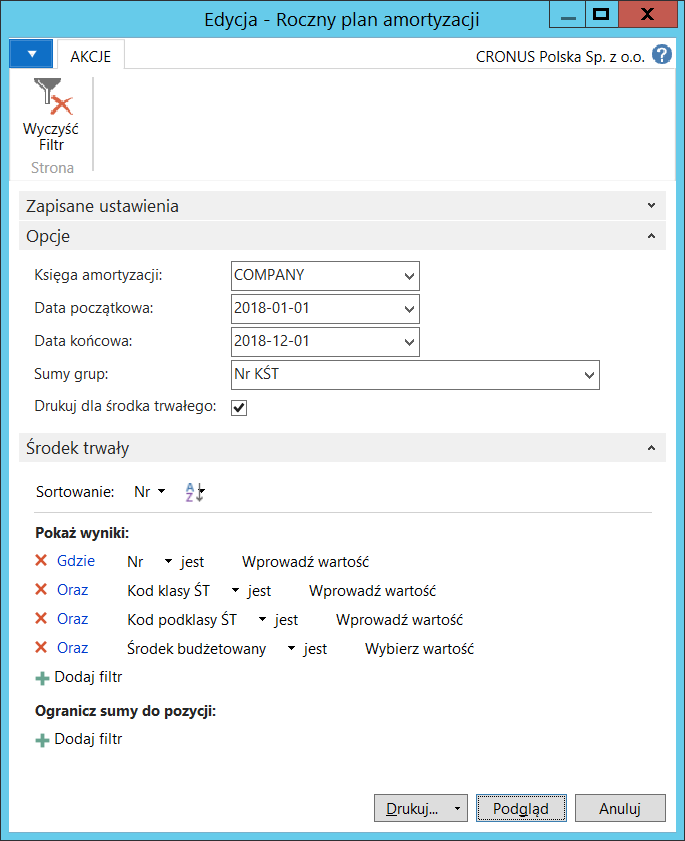

# Roczny plan amortyzacji

## Informacje ogólne

Wiele firm, chcąc oszacować przewidywaną wartość majątku trwałego
oraz wartości niematerialnych i prawnych przygotowuje symulację rocznej
amortyzacji. Przygotowanie takiego zestawienia wynika też z obowiązków
ustawowych narzuconych Ustawą o rachunkowości. Polska Lokalizacja
zawiera raport **Roczny plan amortyzacji** przedstawiający przewidywane
koszty amortyzacji elementów majątku trwałego w okresie roku.

## Obsługa

W celu wydrukowania raportu **Roczny plan amortyzacji**, należy postępować według następujących kroków:

1.  Należy wybrać **Działy \> Zarządzanie Finansami \> Środki trwałe \>
    Roczny plan amortyzacji**.

2.  W oknie wstępnym raportu, które się otworzy, należy we właściwy
    sposób uzupełnić pola na karcie skróconej **Opcje**:

    -   **Księga amortyzacji** – z listy rozwijanej w tym polu należy
        wybrać kod księgi amortyzacji, której parametry zostaną
        wykorzystane do obliczenia kosztów przewidywanej amortyzacji
    
    -   **Data początkowa** – z listy rozwijanej w tym polu należy wybrać
        datę początkową okresu obrachunkowego, który ma być pierwszym
        okresem (zwykle: miesiącem) do kalkulacji przewidywanej
        amortyzacji
    
    -   **Data końcowa** – z listy rozwijanej w tym polu należy wybrać datę
        początkową okresu obrachunkowego, który ma być ostatnim okresem
        (zwykle: miesiącem) do kalkulacji przewidywanej amortyzacji
    
    >[!NOTE]
    >Okres wyświetlany w raporcie ograniczony jest do 12 kolumn
    (zwykle: miesięcy) liczonych od **Daty początkowej**. jeśli **Data
    końcowa** zostanie wyznaczona poza okresem 12 miesięcy, system
    zignoruje wszystkie miesiące powyżej 12.
    
    -   **Sumy grup** – w tym polu można wybrać poziom grupowania kwot
        przewidywanej amortyzacji. Pozostawienie pola pustego spowoduje
        niegrupowanie danych.
    
    -   **Drukuj dla środka trwałego** – zaznaczenie tego pola spowoduje
        wyświetlenie szczegółów przewidywanej kwoty amortyzacji
        z dokładnością do kartoteki środka trwałego.

    Na karcie skróconej **Środek trwały** można w standardowy sposób
    ustawić filtry ograniczające zakres danych wybranych do wydrukowania.

  

4.  Należy wybrać **Drukuj** w celu wydrukowania rocznego planu
    amortyzacji lub **Podgląd w **celu wyświetlenia go na ekranie:

  