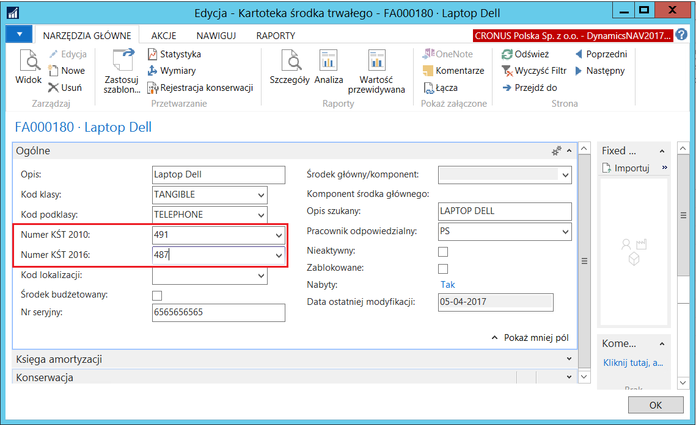

# Klasyfikacja środków trwałych

## Informacje ogólne

 Przepisy polskiego prawa wymagają podziału środków trwałych
 według aktualnie obowiązującej ustawowej klasyfikacji środków
 trwałych. Oficjalna klasyfikacja środków trwałych ma 3 poziomy
 grupowania: grupa (np. Środki transportu), podgrupa (np. Pojazdy
 mechaniczne) i rodzaj (np. Samochody osobowe).

Od 1 stycznia 2018 r. dla celów m.in. bilansowych i podatkowych
obowiązuje nowa **Klasyfikacja Środków Trwałych (KŚT 2016).** Oznacza
to, że przy klasyfikowaniu dla celów bilansowych środków trwałych do
właściwej grupy, podgrupy i rodzaju, jednostki muszą korzystać z KŚT
2016. Zobowiązane są także stosować nowe roczne stawki amortyzacyjne
określone w załączniku nr 1 do ustawy o podatku dochodowym, dostosowane
do Klasyfikacji Środków Trwałych 2016.

Istotne jest, że KŚT 2016 wprowadza zmiany w numeracji oraz nazewnictwie
grup, podgrup oraz rodzajów środków trwałych. W sytuacji, gdy zmiany te
mają wpływ na środki trwałe ujęte w ewidencji księgowej przed 2018 r.
(zmieni się ich klasyfikacja lub nazwa), to z dniem 1 stycznia 2018 r.
konieczne stało się dostosowanie do KŚT 2016 zapisów w ewidencji
analitycznej prowadzonej do konta 01 „Środki trwałe". Jeśli jednostka
nie zrobi tego, może to doprowadzić do rozbieżności polegającej na tym,
że te same składniki majątku podlegałyby innej klasyfikacji,
w zależności od momentu ich wprowadzenia do ewidencji i obowiązujących
na ten moment regulacji. W związku z tym, jednostki powinny mieć
możliwość wygenerowania zestawień środków trwałych zarówno według KŚT
2010, jak i KŚT 2016.

Standardowa funkcjonalność systemu Microsoft Dynamics 365 Business
Central on‑premises została rozszerzona o możliwość przypisywania
do każdego środka trwałego określonego rodzaju zgodnego z Klasyfikacją
Środków Trwałych. W raportach modułu Środki trwałe została dodana
możliwość grupowania danych według numerów KŚT przypisanych do kartotek
środków trwałych

W systemie Microsoft Dynamics 365 Business Central on‑premises zostały
przygotowane narzędzia do wygenerowania tabel z Klasyfikacją Środków
Trwałych 2010 i Klasyfikacją Środków trwałych 2016, dzięki czemu do
każdego środka trwałego można przypisać dwa numery KŚT: jeden zgodny z
KŚT 2010, a drugi zgodny z KŚT 2016. Raporty dotyczące środków trwałych
mają możliwość generowania zestawień według obydwu klasyfikacji.

Podstawa prawna: ROZPORZĄDZENIE RADY MINISTRÓW z dnia 3 października
2016 r. w sprawie Klasyfikacji Środków Trwałych (KŚT) (Dz.U.2016
poz.1864).

## Ustawienia

Przed rozpoczęciem klasyfikowania środków trwałych według KŚT 2010 i/lub
KŚT 2016, konieczne jest wprowadzenie słowników dla każdej z
klasyfikacji. W tym celu należy postępować według następujących kroków:

1.  Należy wybrać **Działy \> Zarządzanie Finansami \>Środki trwałe \>
    Ustawienia ŚT**.

2.  W oknie **Ustawienia ŚT**, które się otworzy, należy wybrać
     **Generuj klasyfikację KŚT 2010**.

  

3.  Potwierdzenie komunikatu, który się wyświetli, spowoduje, że słownik
     KŚT 2010 zostanie wypełniony danymi o grupach, podgrupach i
     rodzajach zgodnymi z Klasyfikacją Środków Trwałych 2010. Jeśli
     taki słownik już istniał, jego dane zostaną usunięte i wprowadzone
     ponownie.

  

4.  Po zakończeniu procesu tworzenia słownika KŚT 2010 pojawi się
     stosowny komunikat.

  

5.  Utworzony słownik Klasyfikacji Środków Trwałych 2010 można przejrzeć
     klikając przycisk **Klasyfikacja KŚT 2010** w oknie **Ustawienia
     ŚT**.

  

  

6.  W oknie **Ustawienia ŚT** należy wybrać **Generuj klasyfikację KŚT
    2016**.

  

7.  Potwierdzenie komunikatu, który się wyświetli, spowoduje, że słownik
    KŚT 2016 zostanie wypełniony danymi o grupach, podgrupach i
    rodzajach zgodnymi z  Klasyfikacją Środków Trwałych 2016. Jeśli taki
    słownik już istniał, jego dane zostaną usunięte i wprowadzone
    ponownie.

  

8.  Po zakończeniu procesu tworzenia słownika KŚT 2016 pojawi się
    stosowny komunikat.

  

9.  Utworzony słownik Klasyfikacji Środków Trwałych 2016 można przejrzeć
    klikając przycisk **Klasyfikacja KŚT 2016** w oknie **Ustawienia
    ŚT**.

  

  

## Obsługa

Przypisanie określonego rodzaju do wybranego środka trwałego dokonywane
jest w jego kartotece. W tym celu należy postępować według następujących
kroków:

1.  Należy otworzyć kartotekę wybranego środka trwałego w trybie edycji.

2.  W oknie **Kartoteka środka trwałego**, na karcie skróconej
     **Ogólne** należy uzupełnić pole **Numer KŚT 2010**, wybierając
     właściwy rodzaj z listy rozwijanej w tym polu, co spowoduje
     jednoczesne wypełnienie pola **Numer KŚT 2016**, jeśli istnieje
     jednoznaczne powiązanie z numerem wybranym w polu **Numer KŚT
     2010**.

>[!NOTE]
>W przypadku, gdy nie ma jednoznacznego powiązania symbolu KŚT 2010\
z symbolem KŚT 2016, pole **Nr KŚT 2016** w kartotece środka trwałego
należy wypełnić ręcznie, wybierając z listy właściwy kod.

  

3.  Numery KŚT wprowadzone w kartotece środka trwałego widoczne są
    również na liście środków trwałych.

  

W podstawowych raportach dotyczących środków trwałych dodana została
możliwość grupowania po numerze Klasyfikacji Środków Trwałych 2010 lub
2016 – do wyboru. W oknie wstępnym każdego z niżej wymienionych
raportów, na karcie skróconej **Opcje** do pola **Sumy grup** zostały
dodane dwie opcje: **Numer KŚT 2010** i **Numer KŚT 2016**.

Opcja ta dostępna jest w raportach:

-   **Roczny plan amortyzacji**

-   **Środek trwały – analiza,**

-   **Środek trwały – analiza K/G,**

-   **Środek trwały – wart. przewid.,**

-   **Środek trwały – wart. ks. 01,**

-   **Środek trwały – wart. ks. 02.**

  
