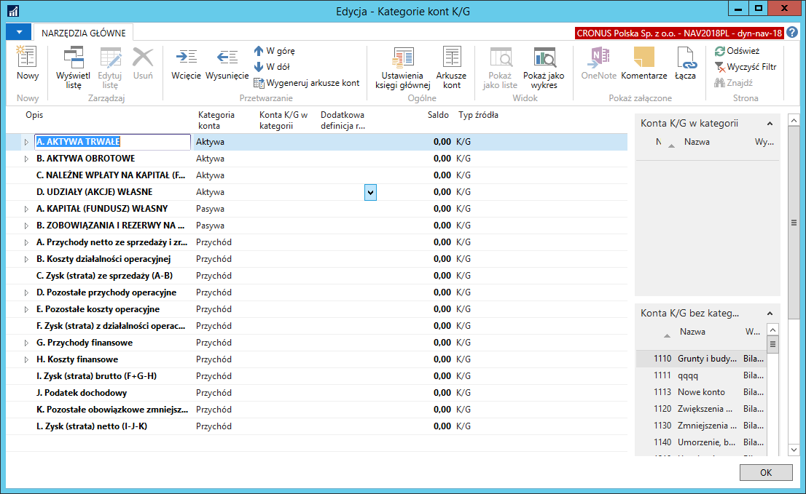
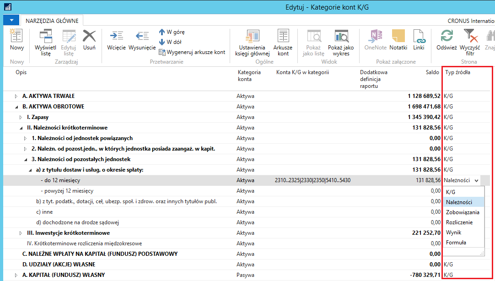

# Kategorie kont 

Nowe Kategorie kont stanowiące odwzorowanie pozycji bilansu oraz rachunku zysków i strat (w wersji porównawczej) generowane są automatycznie podczas tworzenia nowej firmy w Microsoft Dynamics 365 Business Central. Można również wymusić ich utworzenie uruchamiając *Codeunit 52063168* (spowoduje to usunięcie wszystkich powiązań kont księgi głównej z kategoriami). Zastępuje on całkowicie dotychczasowe, standardowe kategorie kont.

Pozycje bilansu w oknie **Kategorie kont K/G** odzwierciedlone są z
opcją **Aktywa** lub **Pasywa** w polu **Kategorii konta**, natomiast
pozycje rachunku zysków i strat -- z opcją **Przychód**

W oknie **Kategorie kont K/G** zostało dodane pole **Typ źródła, za
pomocą którego można zmienić standardowy sposób liczenia salda dla danej
kategorii lub podkategorii. W polu dostępne są opcje:**

-   **K/G** -- kalkulacja salda zgodna ze standardem **Microsoft
    Dynamics 365 Business Central**;

-   **Należności** lub **Zobowiązania** -- umożliwia pobranie salda
    należności lub salda zobowiązań (z ksiąg pomocniczych nabywców i
    dostawców) powiązanego z kontami księgi głównej przyporządkowanymi
    do danej kategorii lub podkategorii. Konto przypisane do takiej
    podkategorii musi mieć przypisaną przeciwstawną podkategorię konta
    (szczegóły w podrozdziale *Bilans*);

-   **Rozliczenie** -- umożliwia umieszczenie salda konta księgi głównej
    w pozycji aktywów lub pasywów bilansu, w zależności od tego, czy
    saldo konta K/G jest dodatnie, czy ujemne. Konto przypisane do
    takiej podkategorii musi mieć przypisaną przeciwstawną podkategorię
    konta (szczegóły w podrozdziale *1.11.2 Bilans*).

    >[!NOTE]
    >W sytuacji, gdy do danej podkategorii będzie przypisane
    więcej niż jedno konto K/G, saldo każdego z nich będzie rozpatrywane
    oddzielnie.

-   **Wynik** -- umożliwia umieszczenie salda konta K/G w pozycji
    przychodów lub kosztów rachunku zysków i strat, w zależności od
    tego, czy saldo konta K/G jest dodatnie, czy ujemne. Konto
    przypisane do takiej podkategorii musi mieć przypisaną przeciwstawną
    podkategorię konta (szczegóły w podrozdziale *1.11.3 Rachunek zysków
    i strat*).

    >[!NOTE]
    >W sytuacji, gdy do danej podkategorii będzie przypisane
    więcej niż jedno konto K/G, rozpatrywana będzie suma sald wszystkich
    przypisanych kont K/G.

-   **Formuła** -- umożliwia ręczne przypisanie wybranych kont K/G do
    danej podkategorii, pomimo że dane konto zostało już przypisane do
    innej podkategorii. Przydatne do ustawienia pozycji rachunku zysków
    i strat „w tym" (szczegóły w podrozdziale *1.11.3 Rachunek zysków i
    strat*).

>[!NOTE]
>Dla podkategorii z **Typem źródła** innym niż **K/G** lub
**Formuła** zablokowana jest możliwość edycji pola **Konta K/G w
kategorii**. Konfigurację dla takich podkategorii należy przeprowadzić
z poziomu kartoteki konta K/G.

Zmianą w stosunku do standardowej funkcjonalności **Kategorii kont K/G**
jest możliwość dowolnej manipulacji kolejnością pozycji. Do tej pory
zmiana kolejności mogła się odbywać wyłącznie w ramach tego samego typu
kategorii (**Aktywa**, **Pasywa**, **Przychód** itp.). Rozszerzenie
umożliwia pełne zarządzanie kolejnością -- np. dzieckiem kategorii o
typie **Przychód** może być kategoria o typie **Aktywa** lub **Pasywa.**