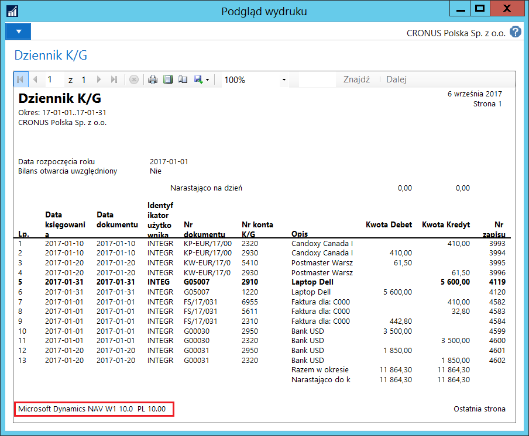

# Informacja o nazwie i wersji programu księgowego 

## Informacje ogólne

Przepisy ustawy o rachunkowości narzucają obowiązek drukowania
informacji o nazwie i wersji programu księgowego na oficjalnych
raportach księgowych:

...„Księgi rachunkowe, z uwzględnieniem techniki ich prowadzenia,
powinny być [...] trwale oznaczone nazwą (pełną lub skróconą)
jednostki, której dotyczą (każda księga wiązana, każda luźna karta
kontowa, także jeżeli mają one postać wydruku komputerowego
lub zestawienia wyświetlanego na ekranie monitora komputera), nazwą
danego rodzaju księgi rachunkowej oraz nazwą programu
przetwarzania;"...

**Obsługa**

Przykładowy raport z informacją o nazwie i wersji programu księgowego:

Lista raportów z informacją o nazwie i wersji programu księgowego:

1.  Dziennik K/G (G/L Journal)
2.  Dokument księgow.- rejestr K/G (G/L Register Posting Document)
3.  Analityczny rejestr K/G (Analytical G/L Register)
4.  Analityczny dokument K/G (Analytical G/L Document)
5.  Zest. obrotów i sald kont K/G (G/L Acc. Net Change & Balance)
6.  Rejestr VAT sprzedaży/zakupu (Sale/Purchase VAT Reg.)
7.  K/G - faktura sprzedaży (G/L Sales Invoice)
8.  K/G - faktura kor. sprzedaży (G/L Sales Credit Memo)
9.  Zest. obrotów i sald nabywcy (Customer Net Change & Balance)
10. Dziennik zapisów księgi nabywców (Customer Ledger Entry Journal)
11. K/G - faktura zakupu (G/L Purchase Invoice)
12. K/G - faktura kor. zakupu (G/L Purchase Credit Memo)
13. Zest. obrotów i sald dostawcy (Vendor Net Change & Balance)
14. Dziennik zapisów księgi dostawców (Vendor Ledger Entry Journal)
15. Lista inwentaryzacji (Phys. Inventory List)