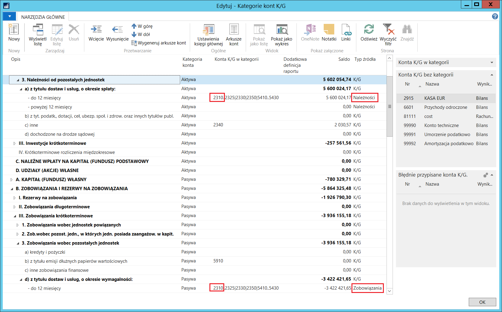
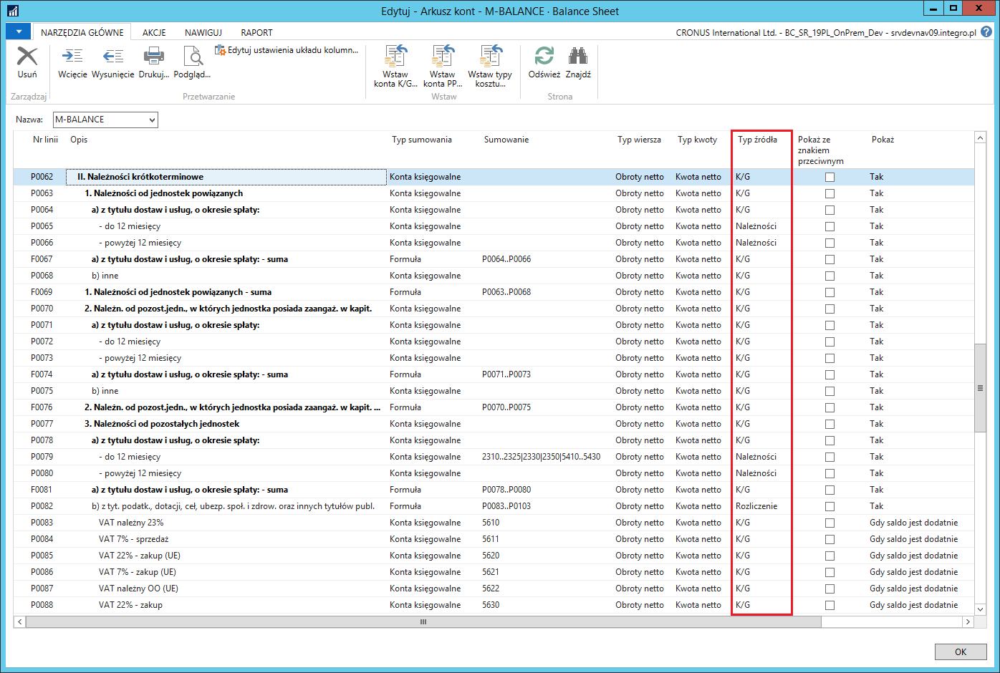

# Bilans

## Informacje ogólne

Rozszerzenia dodane w ramach Polskiej Lokalizacji dają możliwość takiego skonfigurowania wybranych pozycji bilansu, aby opierały się one wyłącznie o zapisy debetowe lub wyłącznie o zapisy kredytowe związane z księgami pomocniczymi nabywców i dostawców. Przepisy prawa wymagają takiej prezentacji należności i zobowiązań w bilansie. Ponadto salda niektórych kont księgi głównej mogą być prezentowane w aktywach lub pasywach, w zależności od tego, czy wykazują saldo debetowe, czy kredytowe – w taki sposób należy prezentować np. rozrachunki publiczno-prawne.

## Ustawienia

W standardowej funkcjonalności systemu Microsoft Dynamics 365 Business
Central on‑premises konto księgi głównej może należeć tylko do jednej
kategorii/podkategorii kont. Niektóre pozycje bilansu sporządzanego
zgodnie z polskimi przepisami wymagają, aby jedno konto księgi głównej
przynależało do dwóch kategorii: należności i zobowiązań.

Jeżeli podkategoria konta, widoczna w kartotece konta księgi głównej,
jest oparta o źródło typu **Należności** lub **Zobowiązania**, należy
określić również przeciwstawną podkategorię dla tego konta, która ma
przeciwny typ źródła. W tym celu, należy wykonać następujące kroki:

1.  Należy wybrać **Działy \> Zarządzanie Finansami \> Księga główna \>
    Plan kont**.

2.  W oknie **Plan kont**, które się otworzy, należy ustawić kursor w
    wierszu z wybranym kontem rozrachunkowym używanym w konfiguracji
    **Grup księgowych nabywcy** lub **Grup księgowych dostawcy**, a
    następnie wybrać **Edytuj**.

3.  W oknie **Kartoteka konta K/G**, na karcie skróconej **Ogólne**,
    należy wypełnić pola zgodnie z poniższym opisem:

    -   **Kategoria konta** – należy wybrać jedną z opcji:
    
        -   **Aktywa** – jeśli jest to konto rozrachunków z odbiorcami,
        
        -   **Pasywa** – jeśli jest to konto rozrachunków z dostawcami.
    
    -   **Podkategoria konta** – z listy rozwijanej w tym polu należy
         wybrać:
    
        -   podkategorię, dla której ustawione jest źródło typu **Należności**,
             jeśli w polu **Kategoria konta** została wybrana opcja **Aktywa**,
        
        -   podkategorię, dla której ustawione jest źródło typu
             **Zobowiązania**, jeśli w polu **Kategoria konta** została wybrana
             opcja **Pasywa**.

    -   **Przeciwst. podkategoria konta** – z listy rozwijanej w tym polu
         należy wybrać:
        -   podkategorię, dla której ustawione jest źródło typu
             **Zobowiązania**, jeśli w polu **Kategoria konta** została wybrana
             opcja **Aktywa**,
        
        -   podkategorię, dla której ustawione jest źródło typu **Należności**,
             jeśli w polu **Kategoria konta** została wybrana opcja **Pasywa**.

W oknie **Kategorie kont K/G**, w polu **Konta K/G w kategorii**
prezentowany jest zestaw kont księgi głównej przyporządkowanych do danej
podkategorii. Konto przyporządkowane do podkategorii ze źródłem typu
**Należności**, powinno być przyporządkowane również do podkategorii ze
źródłem typu **Zobowiązania** i odwrotnie, aby zagwarantować ujęcie
wszystkich sald wszystkich kont księgi głównej w bilansie.

  

Jeżeli podkategoria konta, widoczna w kartotece konta księgi głównej,
jest oparta o źródło typu **Rozliczenie**, należy określić przeciwstawną
podkategorię dla tego konta, również ze źródłem **Rozliczenie**, ale
przynależącą do przeciwnej kategorii. W tym celu, należy wykonać
następujące kroki:

1.  Należy wybrać **Działy \> Zarządzanie Finansami \> Księga główna \>
    Plan kont**.

2.  W oknie **Plan kont**, które się otworzy, należy ustawić kursor w
    wierszu z wybranym kontem księgi głównej, np. dotyczącym
    rozrachunków publiczno-prawnych, a następnie wybrać **Edytuj**.

3.  W oknie **Kartoteka konta K/G**, na karcie skróconej **Ogólne**,
    należy wypełnić pola zgodnie z poniższym opisem:

    -   **Kategoria konta** – należy wybrać jedną z opcji: **Aktywa** lub
        **Pasywa**
    
        -   **Podkategoria konta** – z listy rozwijanej w tym polu należy
             wybrać podkategorię, dla której ustawione jest źródło typu
             **Rozliczenie,** przypisaną do kategorii wybranej w polu
             **Kategoria konta**
        
        -   **Przeciwst. podkategoria konta** – z listy rozwijanej w tym polu
             należy wybrać podkategorię, dla której ustawione jest źródło
             typu **Rozliczenie**, przypisaną do kategorii przeciwnej do tej
             wybranej w polu **Kategoria konta.**

W oknie **Kategorie kont K/G**, w polu **Konta K/G w kategorii**
prezentowany jest zestaw kont księgi głównej przyporządkowanych do danej
podkategorii. Konto przyporządkowane do podkategorii ze źródłem typu
**Rozliczenie** w kategorii Aktywa, powinno być przyporządkowane również
do podkategorii ze źródłem typu **Rozliczenie** w kategorii Pasywa, aby
zagwarantować ujęcie wszystkich sald wszystkich kont księgi głównej w
bilansie.

  

Standardowa funkcjonalność systemu Microsoft Dynamics 365 Business
Central on‑premises zawiera pole informacji **Konta K/G bez kategorii**,
prezentujące konta księgi głównej, które nie zostały przypisane do
żadnej kategorii i podkategorii. W ramach Polskiej Lokalizacji zostało
dodane pole informacji **Błędnie przypisane konta K/G**, które
prezentuje konta księgi głównej przypisane wyłącznie do jednej
podkategorii, mającej źródło typu **Należności**, **Zobowiązania lub
Rozliczenie,** czyli analizującej wyłącznie zapisy po jednej stronie
danego konta. Aby w bilansie pojawiła się całość obrotów danego konta
księgi głównej, należy przypisać je do przeciwstawnej kategorii lub
wybrać dla niego kategorię ze źródłem typu **K/G**.

  

### Obsługa

Na podstawie kategorii kont można w standardowy sposób wygenerować
arkusze kont, przy użyciu akcji **Wygeneruj arkusze kont** w oknie
**Kategorie kont K/G**. Funkcja generująca arkusze kont została
dostosowana w taki sposób, aby ustawiać typ źródła w poszczególnych
pozycjach bilansu w wygenerowanym arkuszu kont, na podstawie ustawienia
typów źródła poszczególnych podkategorii kont K/G. W przypadku
podkategorii z  typem źródła **Rozliczenie**, pod wierszem z pozycją
bilansu tworzone są wiersze techniczne z kontami księgi głównej
wchodzącymi w skład pozycji bilansu. W pozycjach z typem źródła
**Formuła** są prezentowane salda powiązanych z nimi kont księgi
głównej.

Arkusze kont mogą być też tworzone ręcznie. W tej sytuacji, w wierszu
arkusza kont jest możliwość zaznaczenia, że dane mają dotyczyć wyłącznie
należności lub zobowiązań, poprzez wybranie odpowiedniej opcji w polu
**Typ źródła**.

>[!NOTE]
>Typ źródła **Należności** lub **Zobowiązania** nie może być użyty, gdy:
>
>- kwoty pochodzą z budżetu
>
>- kwoty pochodzą z arkusza analitycznego
>
>- kwoty mają być wyrażone w dodatkowej walucie raportowania
>
>- kwota jest innego typu niż **Kwota netto**
>
>W takich przypadkach wartość komórki arkusza nie będzie obliczona.

  

Aby w pozycjach z typem źródła **Należności** lub **Zobowiązania** saldo
było poprawnie obliczone, program analizuje zapisy szczegółowe ksiąg
nabywcy, dostawcy i pracownika, połączone z danym kontem księgi głównej
poprzez konfigurację **Grup księgowych nabywców**, **Grup księgowych
dostawców** i **Grup księgowych pracownika**. Wymagane jest, aby saldo
konta księgi głównej było zgodne z saldem w księgach pomocniczych do
niego przypisanych.

***Przykład:***

Konto księgi głównej połączone jest z wybraną **Grupą księgową
nabywców**. W tej grupie księgowej zaksięgowano fakturę na 100 zł i
płatność na 50 zł. Oto wyniki, które dla tego konta pokaże arkusz kont,
w zależności od wybranego typu źródła:

**K/G** 50 zł  
**Należności** 100 zł  
**Zobowiązania** 50 zł  

W sytuacji, gdy faktura zostanie rozliczona z płatnością, wyniki będą
następujące:

**K/G** 50 zł  
**Należności** 50 zł  
**Zobowiązania** 0 zł  

W powyższym przykładzie można zauważyć, że aby bilans ujmował całość
zapisów, konto musi wystąpić w dwóch pozycjach bilansu, raz jako
**Zobowiązania**, raz jako **Należności**. Alternatywnie jego obroty
można ująć całościowo (per saldo) w jednej pozycji z typem źródła
**K/G**.

Aby w pozycjach z typem źródła **Rozliczenie** saldo było poprawnie
obliczone, program analizuje znak kwoty salda każdego konta księgi
głównej przypisanego do danej pozycji.

***Przykład:***

Do dwóch pozycji bilansu z typem źródła **Rozliczenie** (jednej w
aktywach i jednej w pasywach) przypisane są trzy konta księgi głównej z
grupy rozrachunków publiczno-prawnych, prezentujące salda dodatnie i
ujemne:

**Konto nr 1** -50 zł  
**Konto nr 2** 100 zł  
**Konto nr 3** -250 zł  

Oto wyniki, które dla tych kont pokaże arkusz kont:

**Aktywa** 100 zł  
**Pasywa** 300 zł  

W powyższym przykładzie można zauważyć, że aby w bilansie poprawnie
zostały zaprezentowane salda poszczególnych rozrachunków
publiczno-prawnych, każde powiązane z nimi konto księgi głównej musi
wystąpić w dwóch pozycjach bilansu, raz w **Aktywach**, raz w
**Pasywach**. Alternatywnie obroty tych kont można ująć całościowo (per
saldo) w jednej pozycji z typem źródła **K/G.**