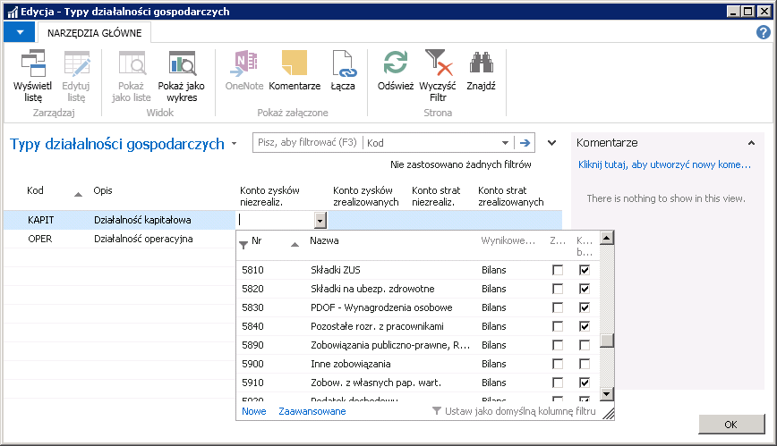
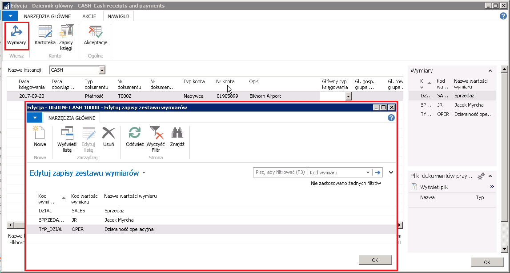
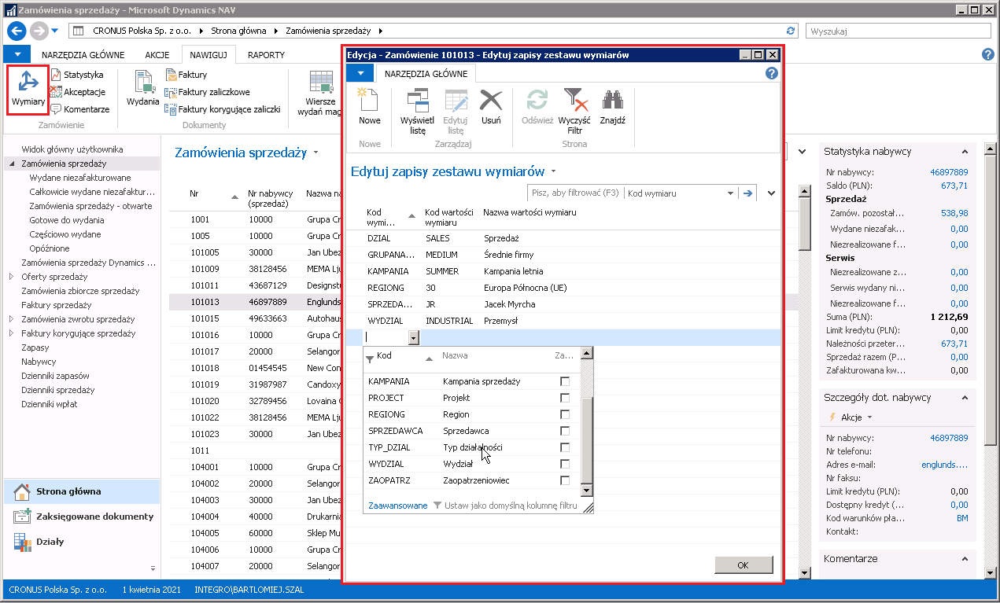

Typy działalności {#typy-działalności .Poziom-1}
––––––––-

## Informacje ogólne

Ustawa CIT na rok 2018 wprowadza wymóg podziału wyniku finansowego na
część operacyjną i kapitałową, z zakazem kompensaty strat pomiędzy tymi
typami działalności. W większości przypadków, podział księgowań pomiędzy
typy działalności, może być zrealizowany za pomocą standardowej
funkcjonalności systemu Microsoft Dynamics 365 Business Central
on‑premises, przy użyciu kont K/G, czy też funkcjonalności wymiarów
księgowych. Tego typu podział jest niestety niemożliwy w przypadku
księgowań automatycznych związanych z naliczaniem różnic kursowych. W
standardzie systemu, konta różnic kursowych są przypisane do waluty. Nie
jest zatem możliwe rozdzielenie różnic kursowych, dotyczących różnych
typów działalności na odrębne konta księgi głównej. W przypadku
wykorzystania wymiarów księgowych, pobierane są one automatycznie
z zapisów ksiąg nabywców i dostawców. Użytkownik nie ma możliwości
zmiany wartości wymiarów, z jakimi będą zaksięgowane różnice kursowe
podczas procesu rozliczania należności i zobowiązań.

Opisana poniżej funkcjonalność umożliwia podział zapisów ksiąg nabywców
i dostawców pomiędzy definiowalne przez użytkownika typy działalności.
Do typu działalności można przypisać zestaw kont różnic kursowych, co
sprawia, iż w przypadku rozliczenia zapisu księgi nabywcy lub dostawcy z
określonym typem działalności, konta różnic kursowych nie są pobierane z
ustawień waluty, lecz z ustawień typu działalności.

## Ustawienia

Z uwagi na to, że do podziału wyniku finansowego wykorzystywana jest
standardowa funkcjonalność wymiarów, należy utworzyć nowy, dedykowany,
wymiar. W tym celu, należy postępować według następujących kroków:

1.  Należy wybrać **Działy \> Zarządzanie Finansami \> Administracja \>
     Wymiary**.

2.  W oknie **Wymiary**, które się otworzy, należy utworzyć nowy wiersz
     i wprowadzić **Kod**, **Nazwę** oraz pozostałe dane wymiaru,
     którego wartości będą używane do podziału różnic kursowych.

3.  Należy ustawić kursor w wierszu z nowym wymiarem i na wstążce, na
     karcie **Nawiguj**, wybrać **Wartości wymiaru**.

4.  W oknie **Wartości wymiaru**, które się otworzy, należy w kolejnych
     wierszach wprowadzić **Kod**, **Nazwę** i pozostałe dane wartości
     nowego wymiaru.

  

Aby możliwe było korzystanie z opisywanej funkcjonalności, konieczne
jest wskazanie w **Ustawieniach księgi głównej** nowo utworzonego
wymiaru. W tym celu, należy postępować według następujących kroków:

1.  Należy wybrać **Działy \> Zarządzanie Finansami \> Administracja \>
    Ustawienia księgi głównej**.

2.  W oknie **Ustawienia księgi głównej**, które się otworzy, na karcie
     skróconej **Wymiary**, w polu **Kod wymiaru typu działalności** z
     listy rozwijanej należy wybrać zdefiniowany w poprzednich krokach
     wymiar.

  

Po utworzeniu odpowiedniego wymiaru wraz z wartościami, należy
zdefiniować konta różnic kursowych. W tym celu, należy postępować według
następujących kroków:

1.  Należy wybrać **Działy \> Zarządzanie Finansami \> Administracja \>
    Typy działalności gospodarczych**.

2.  W oknie **Typy działalności gospodarczych**, które się otworzy,
    należy wybrać właściwe konta księgi głównej, na których księgowane
    będą zrealizowane i niezrealizowane różnice kursowe związane z
    wybranymi wartościami wymiaru:

    -   **Konto zysków niezrealiz.**– w tym polu należy wybrać konto do
         zaksięgowania niezrealizowanych dodatnich różnic kursowych.
    
    -   **Konto zysków zrealizowanych** – w tym polu należy wybrać konto
         do zaksięgowania zrealizowanych dodatnich różnic kursowych.
    
    -   **Konto strat niezrealiz.** – w tym polu należy wybrać konto do
         zaksięgowania niezrealizowanych ujemnych różnic kursowych.
    
    -   **Konto strat zrealizowanych** – w tym polu należy wybrać konto
         do zaksięgowania zrealizowanych ujemnych różnic kursowych.

    >[!NOTE]
    >W oknie **Typy działalności gospodarczych** nie można
    tworzyć nowych wierszy, ponieważ są one zsynchronizowane z wartościami
    wymiaru wybranego w polu **Kod wymiaru typu działalności** w oknie
    **Ustawienia księgi głównej**.

  

## Obsługa

Dzięki wykorzystaniu wymiarów, przypisywanie odpowiednich typów działalności może odbywać się w wielu miejscach w systemie Microsoft Dynamics 365 Business Central on‑premises. Można przypisać domyślny typ działalności do nabywcy lub dostawcy, do dokumentu sprzedaży lub zakupu, oraz do każdego wiersza dziennika głównego.

Z uwagi na to, że dostawcy i nabywcy mogą mieć przypisane różne typy działalności, może zdarzyć się, że będą wzajemnie rozliczane zapisy księgi nabywców lub dostawców z przypisanymi różnymi typami działalności. W takiej sytuacji do określenia kont różnic kursowych zostanie wykorzystany typ działalności z zapisu rozliczającego.

Można ustawić domyślną wartość wymiaru typu działalności dla danej tabeli w systemie. W tym celu, należy postępować według następujących kroków:

1.  Należy wybrać **Działy \> Zarządzanie Finansami \> Administracja \>
    Wymiary**.

2.  W oknie **Wymiary**, które się otworzy, należy ustawić kursor w
    wierszu z wybranym wymiarem i na wstążce, na karcie **Nawiguj**
    wybrać **Wymiar domyślny typu konta**.

3.  W oknie **Wymiar domyślny typu konta**, które się otworzy, należy
    wypełnić poszczególne pola, w oddzielnym wierszu dla każdej wybranej
    tabeli:

    -   **Identyfikator tabeli** – w tym polu należy wybrać z listy
         rozwijanej tabelę, dla której wybrana wartość wymiaru będzie
         traktowana jako wartość domyślna.
    
    -   **Kod wartości wymiaru** – w tym polu należy wybrać domyślną dla
         danej tabeli wartość wymiaru.
    
    -   **Księgowanie wartości** – w tym polu należy wybrać jedną z opcji:
    
        -   **pusta**
        
        -   **Kod obowiązkowy**
        
        -   **Ten sam kod**
        
        -   **Bez kodu**.

  

 Domyślne wartości wymiarów można również przypisywać do kartotek nabywców i dostawców. W tym celu, należy postępować według następujących kroków:

1.  Należy otworzyć kartotekę wybranego nabywcy lub dostawcy i na
    wstążce wybrać **Wymiary**

     lub
    
     na liście nabywców lub dostawców zaznaczyć wiersze z wybranymi
     kontrahentami (lub jednym kontrahentem) i na wstążce wybrać **Wymiary
     – zakres** (lub **Wymiary – wiersz)**.

2.  W oknie **Wymiary domyślne**, które się otworzy, należy utworzyć
    nowy wiersz, wypełniając pola:

    -   **Kod wymiaru –** w tym polu należy wybrać z listy rozwijanej
         utworzony wcześniej wymiar.
    
    -   **Kod wartości wymiaru** – w tym polu należy wybrać domyślną dla
         wybranych kontrahentów (lub kontrahenta) wartość wymiaru.
    
    -   **Księgowanie wartości** – w tym polu należy wybrać jedną z opcji:

        -   **pusta**
        
        -   **Kod obowiązkowy**
        
        -   **Ten sam kod**
        
        -   **Bez kodu**.
    
  

  

Typ działalności można również przypisywać bezpośrednio do dokumentu, zarówno w kartotekach dokumentów, jak i w wierszach dzienników. Aby przypisać wartość wymiaru do dokumentu w wierszu dziennika, należy postępować według następujących kroków:

1.  W oknie **Dziennik główny** należy zaznaczyć wybrany wiersz i na
    wstążce, na karcie **Nawiguj**, wybrać **Wymiary**.

2.  W oknie **Edytuj zapisy zestawu wymiarów**, które się otworzy,
    należy ustawić żądaną wartość wymiaru odpowiedzialnego za podział
    różnic kursowych, wypełniając pola:

    -   **Kod wymiaru** – w tym polu należy wybrać z listy rozwijanej
         utworzony wcześniej wymiar.
    
    -   **Kod wartości wymiaru** – w tym polu należy wybrać właściwą wartość
         wymiaru wybranego w polu Kod wymiaru.

  

 W celu przypisania typu działalności do dokumentu, należy postępować według następujących kroków:

1.  Należy otworzyć jedną z list lub kartotek dokumentów sprzedaży lub
    zakupu.

2.  W oknie, które się otworzy, należy na wstążce, na karcie
    **Nawiguj**, wybrać **Wymiary.**

3.  W oknie **Edytuj zapisy zestawu wymiarów**, które się otworzy,
    należy ustawić żądaną wartość wymiaru odpowiedzialnego za podział
    różnic kursowych, wypełniając pola:

Zapisy zestawu wymiarów faktury zakupów: 

Zapisy zestawu wymiarów zamówienia sprzedaży:

