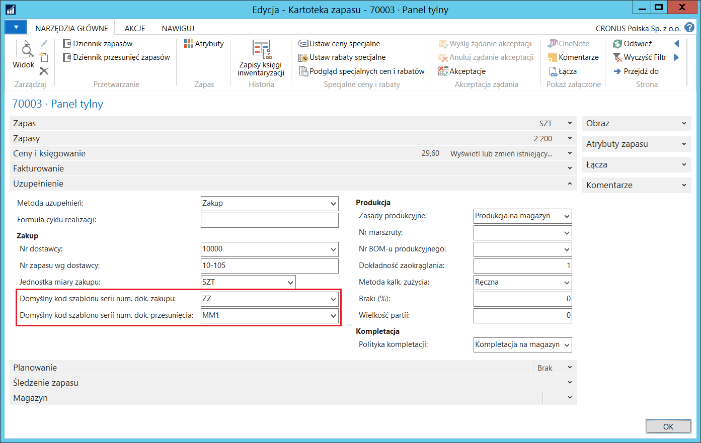

# Szablony serii numeracji dokumentów 

## Informacje ogólne

 Funkcjonalność **Szablony serii numeracji dokumentów** ułatwia
 definiowanie różnych zestawów serii numeracji dla dokumentów
 określonego typu. W ramach tej funkcjonalności możliwe jest
 utworzenie:

-   Szablonów serii numeracji dokumentów sprzedaży,

-   Szablonów serii numeracji dokumentów zakupu,

-   Szablonów serii numeracji zleceń przesunięcia.

## Ustawienia

Każdy obiekt (dokument, dziennik itp.) tworzony w ramach
zdefiniowanego wcześniej szablonu dziedziczy wszystkie jego
ustawienia.

Raport ustawiony dla szablonu zastępuje pierwszy raport z przypisanych
do danej funkcji w standardowej funkcjonalności. Jeśli do formatki
przypisanych jest więcej raportów, dalsze raporty zostaną wydrukowane
po raporcie z szablonu.

W celu zdefiniowania **Szablonu serii numeracji dokumentu sprzedaży**,
należy postępować według następujących kroków:

1.  Należy wybrać **Działy \> Sprzedaż i Marketing \> Administracja \>
     Szablony numeracji dok. sprzedaży**

2.  W oknie **Szablony serii nr dok. sprzedaży**, które się otworzy,
     w pierwszym wolnym wierszu należy wypełnić pola:

    -   **Kod** – w tym polu należy wprowadzić unikalny kod identyfikujący
         szablon numeracji dokumentu sprzedaży
    
    -   **Opis** – w tym polu można wprowadzić tekst opisujący szablon
         numeracji dokumentu sprzedaży
    
    -   **Typ dokumentu** – w tym polu należy wybrać z listy dostępnych
         opcji typ dokumentu sprzedaży, w którym szablon zostanie
         wykorzystany. Dostępne opcje to:
    
    
        -   **Oferta**
        
        -   **Zamówienie**
        
        -   **Faktura**
        
        -   **Faktura korygująca**
        
        
        -   **Zamówienie zbiorcze**
        
        -   **Zamówienie zwrotu**
    
    
    -   **Seria numeracji** – z listy rozwijanej w tym polu należy wybrać
         kod wcześniej zdefiniowanej serii numeracji, na podstawie której
         będą nadawane numery nowotworzonym dokumentom.
    
    
    -   **Seria numeracji księgowania** – z listy rozwijanej w tym polu
         należy wybrać kod wcześniej zdefiniowanej serii numeracji,
         na podstawie której będą nadawane numery dokumentom zaksięgowanym
         (fakturom i fakturom korygującym).
    
    -   **Seria numeracji wydań** – z listy rozwijanej w tym polu należy
         wybrać kod wcześniej zdefiniowanej serii numeracji, na podstawie
         której będą nadawane numery dokumentom wydań.
    
    -   **Seria numeracji zaliczek** – z listy rozwijanej w tym polu należy
         wybrać kod wcześniej zdefiniowanej serii numeracji, na podstawie
         której będą nadawane numery zaksięgowanym fakturom zaliczkowym.
    
    -   **Seria numeracji faktur korygujących zaliczki** – z listy
         rozwijanej w tym polu należy wybrać kod wcześniej zdefiniowanej
         serii numeracji, na podstawie której będą nadawane numery
         zaksięgowanym fakturom korygującym faktury zaliczkowe.
    
    -   **Kod opisu księgowania** – z listy rozwijanej w tym polu można
         wybrać wcześniej zdefiniowany kod opisu księgowania, który będzie
         kopiowany do dokumentów stworzonych w ramach danego szablonu.
         Niewypełnienie tego pola spowoduje przypisywanie kodu opisu
         księgowania ustawionego jako domyślny dla sprzedaży.
    
    -   **Kod VAT'u przekazanego** – z listy rozwijanej w tym polu można
         wybrać wcześniej zdefiniowany kod VAT'u przekazanego,
         którego ustawienia zostaną wykorzystane do automatycznego
         rozliczenia VAT z faktury wystawionej z wykorzystaniem tego
         szablonu.
    
    
    -   **Kod szablonu nast. kroku procesu** – w tym polu należy wskazać,
         jaki kod szablonu ma być przypisany do dokumentu sprzedaży
         w następnym kroku procesu. Kod ten zostanie przypisany
         do zamówienia tworzonego z oferty lub z zamówienia zbiorczego.
         Jeśli pole to jest puste, a w systemie zdefiniowano więcej
         niż jeden szablon dla zamówienia, podczas tworzenia zamówienia
         z oferty lub z zamówienia zbiorczego zostanie otwarte okno wyboru
         szablonu i użytkownik będzie mógł wybrać szablon, jaki zostanie
         przypisany do zamówienia. Jeśli natomiast pole **Kod szablonu
         nast. kroku procesu** jest puste, a w systemie zdefiniowano tylko
         jeden szablon dla zamówienia, ten właśnie szablon zostanie
         automatycznie przypisany do nowego dokumentu.
    
    -   **ID raportu faktury** – z listy rozwijanej w tym polu należy
         wybrać raport, który zawiera wzór dokumentu, na podstawie
         którego zostanie wydrukowana faktura (lub faktura korygująca).
    
    -   **Nazwa raportu faktury** – pole wypełniane automatycznie
         przez system nazwą przypisaną do raportu wybranego w polu **ID
         raportu faktury.**
    
    -   **ID raportu wydania** – z listy rozwijanej w tym polu należy
         wybrać raport, który zawiera wzór dokumentu, na podstawie
         którego zostanie wydrukowane wydanie z magazynu.
    
    -   **Nazwa raportu wydania** – pole wypełniane automatycznie
         przez system nazwą przypisaną do raportu wybranego w polu **ID
         raportu wydania.**
    
    -   **Pobierz kurs wymiany dla daty** – w tym polu należy wybrać datę,
         według której będzie pobierany kurs wymiany waluty. Dostępne opcje
         to:
    
    
        -   **Data księgowania**
        
        -   **Data dokumentu**
        
        -   **Data sprzedaży**

  

W celu zdefiniowania **Szablonu serii numeracji dokumentu zakupu**,
należy postępować według następujących kroków:

1.  Należy wybrać **Działy \> Zakup \> Administracja \> Szablony
    numeracji dok. zakupu**

2.  W oknie **Szablony serii nr dok. zakupu**, które się otworzy,
    w pierwszym wolnym wierszu należy wypełnić pola:

    -   **Kod** – w tym polu należy wprowadzić unikalny kod identyfikujący
         szablon numeracji dokumentu zakupu
    
    -   **Opis** – w tym polu można wprowadzić tekst opisujący szablon
         numeracji dokumentu zakupu
    
    -   **Typ dokumentu** – w tym polu należy wybrać z listy dostępnych
         opcji typ dokumentu zakupu, w którym szablon zostanie
         wykorzystany. Dostępne opcje to:
    
    
        -   **Oferta**
        
        -   **Zamówienie**
        
        -   **Faktura**
        
        -   **Faktura korygująca**
        
        
        -   **Zamówienie zbiorcze**
        
        -   **Zamówienie zwrotu**
    
    
    -   **Seria numeracji** – z listy rozwijanej w tym polu należy wybrać
         kod wcześniej zdefiniowanej serii numeracji, na podstawie której
         będą nadawane numery nowotworzonym dokumentom.
    
    
    -   **Seria numeracji księgowania** – z listy rozwijanej w tym polu
         należy wybrać kod wcześniej zdefiniowanej serii numeracji,
         na podstawie której będą nadawane numery dokumentom zaksięgowanym
         (fakturom i fakturom korygującym).
    
    -   **Seria numeracji przyjęć** – z listy rozwijanej w tym polu należy
         wybrać kod wcześniej zdefiniowanej serii numeracji, na podstawie
         której będą nadawane numery dokumentom przyjęć.
    
    -   **Seria numeracji zaliczek** – z listy rozwijanej w tym polu należy
         wybrać kod wcześniej zdefiniowanej serii numeracji, na podstawie
         której będą nadawane numery zaksięgowanym fakturom zaliczkowym.
    
    -   **Seria numeracji faktur korygujących zaliczki** – z listy
         rozwijanej w tym polu należy wybrać kod wcześniej zdefiniowanej
         serii numeracji, na podstawie której będą nadawane numery
         zaksięgowanym fakturom korygującym faktury zaliczkowe.
    
    -   **Kod opisu księgowania** – z listy rozwijanej w tym polu można
         wybrać wcześniej zdefiniowany kod opisu księgowania, który będzie
         kopiowany do dokumentów stworzonych w ramach danego szablonu.
         Niewypełnienie tego pola spowoduje przypisywanie kodu opisu
         księgowania ustawionego jako domyślny dla zakupu.
    
    
    -   **Kod szablonu nast. kroku procesu** – w tym polu należy wskazać,
         jaki kod szablonu ma być automatycznie przypisany do dokumentu
         zakupu w następnym kroku procesu. Kod ten zostanie przypisany
         do zamówienia tworzonego z oferty lub z zamówienia zbiorczego.
         Jeśli pole to jest puste, a w systemie zdefiniowano więcej
         niż jeden szablon dla zamówienia, podczas tworzenia zamówienia
         z oferty lub z zamówienia zbiorczego zostanie otwarte okno wyboru
         szablonu i użytkownik będzie mógł wybrać szablon, jaki zostanie
         przypisany do zamówienia. Jeśli natomiast pole **Kod szablonu
         nast. kroku procesu** jest puste, a w systemie zdefiniowano tylko
         jeden szablon dla zamówienia, ten właśnie szablon zostanie
         automatycznie przypisany do nowego dokumentu.
    
    -   **ID raportu faktury** – z listy rozwijanej w tym polu należy
         wybrać raport, który zawiera wzór dokumentu, na podstawie
         którego zostanie wydrukowana faktura (lub faktura korygująca).
    
    -   **Nazwa raportu faktury** – pole wypełniane automatycznie
         przez system nazwą przypisaną do raportu wybranego w polu **ID
         raportu faktury.**
    
    -   **Identyfikator raportu przyjęcia** – z listy rozwijanej w tym polu
         należy wybrać raport, który zawiera wzór dokumentu, na podstawie
         którego zostanie wydrukowane przyjęcie do magazynu.
    
    -   **Nazwa raportu przyjęcia** – pole wypełniane automatycznie
         przez system nazwą przypisaną do raportu wybranego w polu
         **Identyfikator raportu przyjęcia.**
    
    -   **Pobierz kurs wymiany dla daty** – w tym polu należy wybrać datę,
         według której będzie pobierany kurs wymiany waluty. Dostępne opcje
         to:
    

        -   **Data księgowania**
        
        -   **Data dokumentu**

  

W celu zdefiniowania **Szablonu serii numeracji zlecenia przesunięcia**,
należy postępować według następujących kroków:

1.  Należy wybrać **Działy \> Magazyn \> Administracja \> Szablony
    numeracji zlec. przesunięcia.**

2.  W oknie **Szablony serii nr zlec. przesunięcia**, które się otworzy,
    w pierwszym wolnym wierszu należy wypełnić pola:

    -   **Kod** – w tym polu należy wprowadzić unikalny kod identyfikujący
         szablon numeracji zlecenia przesunięcia.
    
    -   **Opis** – w tym polu można wprowadzić tekst opisujący szablon
         numeracji zlecenia przesunięcia.
    
    -   **Kod lokalizacji pierwotnej** – z listy rozwijanej w tym polu
         należy wybrać wcześniej zdefiniowaną lokalizację, z której będzie
         dokonane wydanie w ramach przesunięcia międzymagazynowego.
    
    -   **Kod lokalizacji docelowej** – z listy rozwijanej w tym polu
         należy wybrać wcześniej zdefiniowaną lokalizację, w której będzie
         dokonane przyjęcie w ramach przesunięcia międzymagazynowego.
    
    -   **Seria numeracji zlec. przes.** – z listy rozwijanej w tym polu
         należy wybrać kod wcześniej zdefiniowanej serii numeracji,
         na podstawie której będą nadawane numery kolejnym zleceniom
         przesunięcia.
    
    -   **Seria num. zaks. wyd. przes.** – z listy rozwijanej w tym polu
         należy wybrać kod wcześniej zdefiniowanej serii numeracji,
         na podstawie której będą nadawane numery zaksięgowanym dokumentom
         wydań z lokalizacji pierwotnej.
    
    -   **Seria num. zaks. przyj. przes.** – z listy rozwijanej w tym polu
         należy wybrać kod wcześniej zdefiniowanej serii numeracji,
         na podstawie której będą nadawane numery zaksięgowanym dokumentom
         przyjęć do lokalizacji docelowej.

  

 Funkcjonalności **Szablony serii nr dok. zakupu i Szablony serii nr
 zlec. przesunięcia** mają zastosowanie w **Arkuszach
 zapotrzebowania**. W celu ułatwienia pracy użytkownikom, można wybrać
 domyślne kody szablonów serii numeracji dokumentów, które będą użyte
 przy uzupełnianiu stanów magazynowych.

 W celu zdefiniowania domyślnych szablonów serii nr dok. zakupu i zlec.
 przesunięcia dla **Jednostki składowania** **zapasu**, należy
 postępować według następujących kroków:

1.  Należy wybrać **Działy \> Magazyn \> Planowanie i wykonywanie \>
    Jednostki składowania zapasu.**

2.  W oknie **Jednostki składowania zapasu** należy zaznaczyć wiersz
    z wybraną jednostką składowania zapasów i wybrać **Edycja**.

3.  W kartotece wybranej jednostki składowania zapasów, która się
    otworzy, na karcie skróconej **Uzupełnienie** należy wypełnić pola:

    -   **Domyślny kod szablonu serii num. dok. zakupu** – z listy
         rozwijanej w tym polu należy wybrać jeden z wcześniej
         zdefiniowanych szablonów numeracji dokumentów zakupu.
    
    -   **Domyślny kod szablonu serii num. dok. przesunięcia – z **listy
         rozwijanej w tym polu należy wybrać jeden z wcześniej
         zdefiniowanych szablonów numeracji zleceń przesunięcia.
    
  

 W celu zdefiniowania domyślnych szablonów serii nr dok. zakupu i zlec.
 przesunięcia dla **Zapasu**, należy postępować według następujących
 kroków:

1.  Należy wybrać **Działy \> Magazyn \> Planowanie i wykonywanie \>
    Zapasy.**

2.  W oknie **Zapasy** należy zaznaczyć wiersz z wybranym zapasem
    i wybrać **Edycja**.

3.  W kartotece wybranego zapasu, która się otworzy, na karcie skróconej
    **Uzupełnienie** należy wypełnić pola:

    -   **Domyślny kod szablonu serii num. dok. zakupu** – z listy
         rozwijanej w tym polu należy wybrać jeden z wcześniej
         zdefiniowanych szablonów numeracji dokumentów zakupu.
    
    -   **Domyślny kod szablonu serii num. dok. przesunięcia**- z listy
         rozwijanej w tym polu należy wybrać jeden z wcześniej
         zdefiniowanych szablonów numeracji zleceń przesunięcia.

  

 W celu zdefiniowania domyślnego szablonu serii nr dok. zakupu
 dla zapasów nie mających przypisanego domyślnego szablonu serii nr
 dok. zakupu w kartotece ani jednostce składowania, należy postępować
 według następujących kroków:

1.  Należy wybrać **Działy \> Zakup \> Administracja \> Ustawienia
     zakupów i zobowiązań**.

2.  W oknie **Ustawienia zakupów i zobowiązań**, które się otworzy,
     na karcie skróconej **Ogólne** należy z listy rozwijanej w polu
     **Domyślny kod szablonu serii num. dok. zakupu** wybrać jeden
     z wcześniej zdefiniowanych szablonów serii nr dok. zakupu.

  

 W celu zdefiniowania domyślnego szablonu serii nr zlec. przesunięcia
 dla zapasów niemających przypisania domyślnego szablonu serii nr zlec.
 przesunięcia w kartotece ani jednostce składowania, należy postępować
 według następujących kroków:

1.  Należy wybrać **Działy \> Magazyn \> Administracja \> Ustawienia
     magazynu.**

2.  W oknie **Ustawienia magazynu**, które się otworzy, na karcie
     skróconej **Ogólne** należy z listy rozwijanej w polu **Domyślny
     kod szablonu serii num. dok. przesunięcia** wybrać jeden
     z wcześniej zdefiniowanych szablonów serii nr zlec. przesunięcia.

  

## Obsługa

 W celu utworzenia faktury sprzedaży z wykorzystaniem jednego
 z wcześniej zdefiniowanych **Szablonów serii nr dok. sprzedaży**,
 należy postępować według następujących kroków:

1.  Należy wybrać **Działy \> Sprzedaż i Marketing \> Przetwarzanie
    zamówień \> Faktury sprzedaży.**

2.  W oknie **Faktury sprzedaży**, które się otworzy, należy wybrać
     **Nowe**.

3.  W kartotece nowej faktury sprzedaży należy przenieść kursor
     do innego pola niż to, w którym się znalazł domyślnie.

4.  Otworzy się okno **Lista szablonów serii nr dok. sprzedaży**,
     w którym należy zaznaczyć wiersz z wybranym szablonem i wybrać
     **OK**.

  

5.  Do nagłówka wprowadzanej faktury sprzedaży system wstawi parametry
     domyślnie przypisane do wybranego szablonu (np. **Seria
     numeracji**, **Kod opisu księgowania** itp.). Parametry wstawione
     domyślnie do pól edytowalnych mogą zostać ręcznie zmienione.

6.  Dalsze kroki procesu wystawiania faktury należy wykonać standardowo.

>[!NOTE]
>Obsługa funkcjonalności **Szablony serii nr dok.
sprzedaży** działa w ten sam sposób dla następujących typów dokumentów
sprzedaży: **Oferta, Zamówienie, Faktura, Faktura korygująca,
Zamówienie zbiorcze, Zamówienie zwrotu.**

 W celu utworzenia faktury zakupu z wykorzystaniem jednego z wcześniej
 zdefiniowanych **Szablonów serii nr dok. zakupu**, należy postępować
 według następujących kroków:

1.  Należy wybrać **Działy \> Zakup \> Przetwarzanie zamówień \> Faktury
    zakupu.**

2.  W oknie **Faktury zakupu**, które się otworzy, należy wybrać
     **Nowe**.

3.  W kartotece nowej faktury zakupu należy przenieść kursor do innego
     pola niż to, w którym się znalazł domyślnie.

4.  Otworzy się okno **Lista szablonów serii nr dok. zakupu**, w którym
     należy zaznaczyć wiersz z wybranym szablonem i wybrać **OK**.

  

5.  Do nagłówka wprowadzanej faktury zakupu system wstawi parametry
     domyślnie przypisane do wybranego szablonu (np. **Seria
     numeracji**, **Kod opisu księgowania** itp.). Parametry wstawione
     domyślnie do pól edytowalnych mogą zostać ręcznie zmienione.

6.  Dalsze kroki procesu wprowadzania faktury należy wykonać
     standardowo.

>[!NOTE]
>Obsługa funkcjonalności **Szablony serii nr dok. zakupu**
działa w ten sam sposób dla następujących typów dokumentów zakupu:
**Oferta, Zamówienie, Faktura, Faktura korygująca, Zamówienie
zbiorcze, Zamówienie zwrotu.**

 W celu utworzenia zlecenia przesunięcia z wykorzystaniem jednego
 z wcześniej zdefiniowanych **Szablonów serii nr zlec. przesunięcia**,
 należy postępować według następujących kroków:

1.  Należy wybrać **Działy \> Magazyn \> Planowanie i wykonywanie \>
    Zlecenia przesunięcia.**

2.  W oknie **Zlecenia przesunięcia**, które się otworzy, należy wybrać
     **Nowe**.

3.  W kartotece nowego zlecenia przesunięcia należy przenieść kursor
     do innego pola niż to, w którym się znalazł domyślnie.

4.  Otworzy się okno **Lista szablonów serii nr zlec. przesunięcia**,
     w którym należy zaznaczyć wiersz z wybranym szablonem i wybrać
     **OK**.

  

5.  Do nagłówka wprowadzanego zlecenia przesunięcia system wstawi
     parametry domyślnie przypisane do wybranego szablonu (np. **Seria
     numeracji**, **Kody lokalizacji** itp.). Parametry wstawione
     domyślnie do pól edytowalnych mogą zostać ręcznie zmienione.

6.  Dalsze kroki procesu księgowania zlecenia przesunięcia należy
     wykonać standardowo.

 W **Arkuszach zapotrzebowania** funkcja **Wykonaj komunikat akcji**
 tworząca odpowiednie dokumenty korzysta z szablonów serii nr dok.
 zakupu w przypadku metody uzupełnień **Zakup** i z szablonów serii nr
 zlec. przesunięcia w przypadku metody uzupełnień **Przesunięcie**.

 W przypadku tworzenia wierszy arkusza zapotrzebowania przy użyciu
 funkcji **Oblicz plan**, system uzupełnia pole **Kod szablonu serii
 numeracji** w wierszach arkusza zapotrzebowania odpowiednimi kodami
 pobranymi z kartoteki jednostki składowania, a jeśli tam domyślne kody
 nie są przypisane, wtedy pobierane są one z kartoteki zapasu,
 a gdy również tutaj ich brak, wtedy pobierane są z okna **Ustawienia
 zakupów i zobowiązań** lub **Ustawienia magazynu**.

Ręczne wprowadzanie wierszy arkuszy zapotrzebowania wymaga ręcznego
uzupełnienia pola **Kod szablonu serii numeracji**. Pole to można też
pozostawić puste, wtedy system podczas tworzenia dokumentów przy pomocy
funkcji **Wykonaj komunikat akcji** skorzysta z domyślnych szablonów
serii numeracji dokumentów w takiej kolejności, jak przy funkcji
**Oblicz plan**.

  