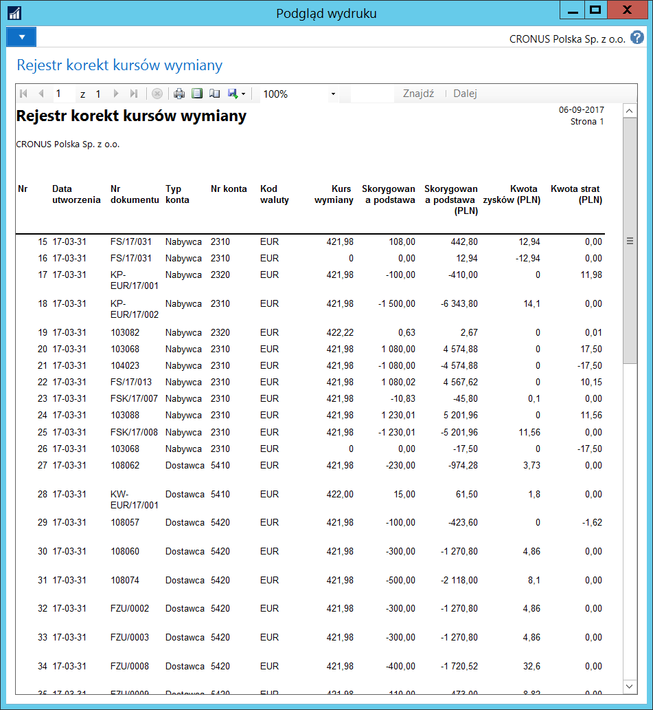

# Rejestry korekt kursów wymiany 

## Informacje ogólne

Zapisy historii korekt kursów wymiany, czyli wycen bilansowych jest
przechowywana w **Rejestrach korekt kursów wymiany**. W ramach Polskiej
Lokalizacji rozszerzono standardowy wygląd okna rejestrów i dodano
raport księgowania. Pozwala to na uzyskanie pełnej informacji o historii
przeprowadzonych korekt kursów wymiany.

## Obsługa

W celu uzyskania informacji o historii dokonanych korekt kursów wymiany,
należy postępować według następujących kroków:

1. Należy wybrać **Działy \> Zarządzanie Finansami \> Działania
    okresowe \> Waluta \>** **Rejestry korekt kursów wymiany**.

2. W oknie **Rejestry korekt kursów wymiany**, które się otworzy,
    wyświetlone są informacje w następujących polach:

    - **Nr** – pole wypełniane automatycznie przez system numerem
    kolejnym księgowania korekty kursów wymiany.
    
    - **Data utworzenia** – pole wypełniane automatycznie przez system
    datą, kiedy fizycznie zostało dokonane księgowanie korekty kursów
    wymiany.
    
    - **Typ konta** – pole wypełniane automatycznie przez system typem
    konta, na którym została dokonana korekta kursów wymiany.
    
    - **Nr konta** – pole wypełniane automatycznie przez system numerem
    konta (zgodnym z **Typem konta**), na którym została dokonana
    korekta kursów wymiany.
    
    - **Nr dokumentu** – pole wypełniane automatycznie przez system
    numerem dokumentu, na podstawie którego zostało dokonane
    księgowanie korekty kursów wymiany.
    
    - **Nr dokumentu źródłowego** – pole wypełniane automatycznie
    przez system numerem dokumentu źródłowego dla zapisu, dla
    którego została dokonana korekta kursów wymiany.
    
    - **Grupa księgowa** – pole wypełniane automatycznie przez system
    kodem grupy księgowej w zapisie, dla którego została dokonana
    korekta kursów wymiany.
    
    - **Kod waluty** – pole wypełniane automatycznie przez system kodem
    waluty, dla której została dokonana korekta kursów wymiany.
    
    - **Skorygowana podstawa** – pole wypełniane automatycznie
    przez system kwotą w walucie źródłowej, dla której została
    dokonana korekta kursów wymiany.
    
    - **Skorygowana podstawa (PLN)** – pole wypełniane automatycznie
    przez system równowartością kwoty w walucie lokalnej, dla której
    została dokonana korekta kursów wymiany.
    
    - **Skorygowana kwota (PLN)** – pole wypełniane automatycznie
    przez system kwotą niezrealizowanych różnic kursowych w walucie
    lokalnej, będącą wynikiem dokonanej korekty kursów wymiany.
    
    - **Kwota zysków (PLN)** – pole wypełniane automatycznie przez system
    kwotą dodatnich niezrealizowanych różnic kursowych w walucie
    lokalnej, będącą wynikiem dokonanej korekty kursów wymiany.
    
    - **Kwota strat (PLN)** – pole wypełniane automatycznie przez system
    kwotą ujemnych niezrealizowanych różnic kursowych w walucie
    lokalnej, będącą wynikiem dokonanej korekty kursów wymiany.

  

**Rejestry korekt kursów wymiany** mogą być też drukowane. W tym celu
należy postępować według następujących kroków:

1. W oknie **Rejestry korekt kursów wymiany** należy wybrać **Rejestr
     korekt kursów wymiany**.

2. W oknie wstępnym raportu, które się otworzy, można ograniczyć zakres
     prezentowanych danych, ustawiając w sposób standardowy filtry
     w polach na karcie skróconej **Rejestr korekt kursu wymiany**.
     Następnie należy wybrać **Drukuj** lub **Podgląd**.

  