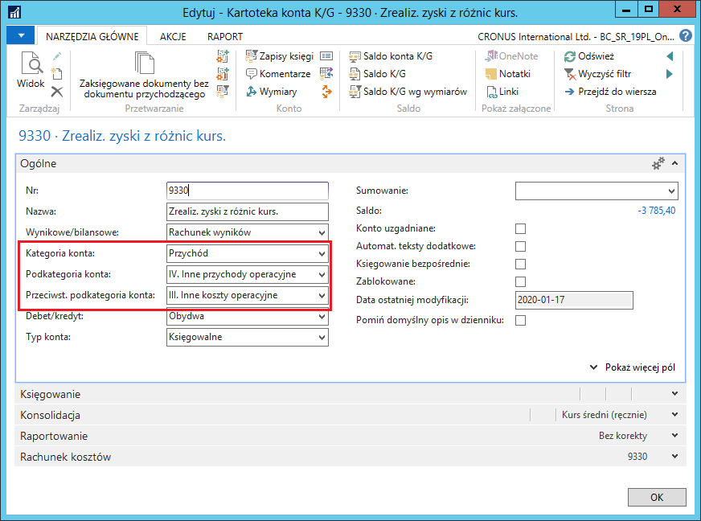

# Rachunek zysków i strat 

## Informacje ogólne

Rozszerzenia dodane w ramach Polskiej Lokalizacji dają możliwość takiego skonfigurowania wybranych pozycji rachunku zysków i strat, aby opierały się one o te same konta księgi głównej, ale prezentowały wartość tylko w przychodach lub tylko w kosztach, w zależności od tego, czy suma ich sald jest dodatnia, czy ujemna. Przepisy prawa wymagają takiej prezentacji różnic kursowych walut w rachunku zysków i strat. Ponadto salda niektórych kont księgi głównej mogą być prezentowane w więcej niż jednej pozycji przychodów lub kosztów, np. w pozycjach „w tym".

## Ustawienia

W standardowej funkcjonalności systemu Microsoft Dynamics 365 Business
Central on‑premises konto księgi głównej może należeć tylko do jednej
kategorii/podkategorii kont. Niektóre pozycje rachunku zysków i strat
sporządzanego zgodnie z polskimi przepisami wymagają, aby jedno konto
księgi głównej przynależało do dwóch kategorii: przychodów i kosztów.

Jeżeli podkategoria konta występująca jako pozycja przychodów, widoczna
w kartotece konta księgi głównej, jest oparta o źródło typu **Wynik**,
należy określić również przeciwstawną podkategorię dla tego konta,
również ze źródłem **Wynik**, ale występującą jako pozycja kosztów (i
odwrotnie). W tym celu, należy wykonać następujące kroki:

1.  Należy wybrać **Działy \> Zarządzanie Finansami \> Księga główna \>
    Plan kont**.

2.  W oknie **Plan kont**, które się otworzy, należy ustawić kursor w
    wierszu z wybranym kontem księgi głównej, np. dotyczącym różnic
    kursowych, a następnie wybrać **Edytuj**.

3.  W oknie **Kartoteka konta K/G**, na karcie skróconej **Ogólne**,
    należy wypełnić pola zgodnie z poniższym opisem:

    -   **Kategoria konta** – należy wybrać opcję Przychód
    
    -   **Podkategoria konta** – z listy rozwijanej w tym polu należy
         wybrać podkategorię, dla której ustawione jest źródło typu
         **Wynik**, należącą do grupy przychodów lub kosztów
    
    -   **Przeciwst. podkategoria konta** – z listy rozwijanej w tym polu
        należy wybrać podkategorię, dla której ustawione jest źródło
        typu **Wynik**, należącą do grupy przychodów lub kosztów,
        przeciwnej do grupy przynależności pozycji wybranej w polu
        **Podkategoria konta**.

W oknie **Kategorie kont K/G**, w polu **Konta K/G w kategorii**
prezentowany jest zestaw kont księgi głównej przyporządkowanych do danej
podkategorii. Konto przyporządkowane do podkategorii ze źródłem typu
**Wynik** w pozycji przychodów, powinno być przyporządkowane również do
podkategorii ze źródłem typu **Wynik** w pozycji kosztów, aby
zagwarantować poprawną prezentację dodatniego lub ujemnego wyniku
wybranych operacji w rachunku zysków i strat.

Standardowa funkcjonalność systemu Microsoft Dynamics 365 Business
Central on‑premises zawiera pole informacji **Konta K/G bez kategorii**,
prezentujące konta księgi głównej, które nie zostały przypisane do
żadnej kategorii i podkategorii. W ramach Polskiej Lokalizacji zostało
dodane pole informacji **Błędnie przypisane konta K/G**, które
prezentuje konta księgi głównej przypisane wyłącznie do jednej
podkategorii, mającej źródło typu **Wynik,** czyli prezentującej
wyłącznie saldo po jednej stronie danego konta. Aby w bilansie pojawiła
się całość obrotów danego konta księgi głównej, należy przypisać je
do przeciwstawnej kategorii lub wybrać dla niego kategorię ze źródłem
typu **K/G**.

W oknie Kategorie kont K/G, do nadrzędnych pozycji rachunku zysków i strat, zawierających treść „w tym", należy w polu Typ źródła wybrać opcję Formuła, a następnie w polu Konta K/G w kategorii wprowadzić odpowiedni zestaw kont księgi głównej. W ten sposób salda wybranych kont księgi głównej będą zaprezentowane dwukrotnie, w dwóch różnych, ale powiązanych ze sobą pozycjach.

## Obsługa

Na podstawie kategorii kont można w standardowy sposób wygenerować
arkusze kont, przy użyciu akcji **Wygeneruj arkusze kont** w oknie
**Kategorie kont K/G**. W ramach Polskiej Lokalizacji funkcja generująca
arkusze kont została dostosowana w taki sposób, aby ustawiać typ źródła
w poszczególnych pozycjach rachunku zysków i strat w wygenerowanym
arkuszu kont, na podstawie ustawienia typów źródła poszczególnych
podkategorii kont K/G.

Arkusze kont mogą być też tworzone ręcznie. W tej sytuacji, w wierszu
arkusza kont należy odpowiednio wypełnić pole **Typ źródła.**

Aby w pozycjach z typem źródła **Wynik** saldo było poprawnie obliczone,
program analizuje znak kwoty sumy sald wszystkich kont księgi głównej
przypisanych do danej pozycji.

***Przykład:***

Do dwóch pozycji rachunku zysków i strat z typem źródła **Wynik**
(jednej w przychodach i jednej w kosztach) przypisane są trzy konta
księgi głównej, prezentujące salda dodatnie i ujemne:

**Konto nr 1** -50 zł  
**Konto nr 2** 100 zł  
**Konto nr 3** -250 zł

Oto wyniki, które dla tych kont pokaże arkusz kont:

**Przychody** 200 zł  
**Koszty** 0 zł

W powyższym przykładzie można zauważyć, że aby w bilansie poprawnie
zostały ujęte salda niektórych kont księgi głównej, każde konto musi
wystąpić w dwóch pozycjach rachunku zysków i strat, raz w grupie
przychodów, raz w **grupie kosztów**. Alternatywnie obroty tych kont
można ująć całościowo (per saldo) w jednej pozycji z typem źródła
**K/G.**