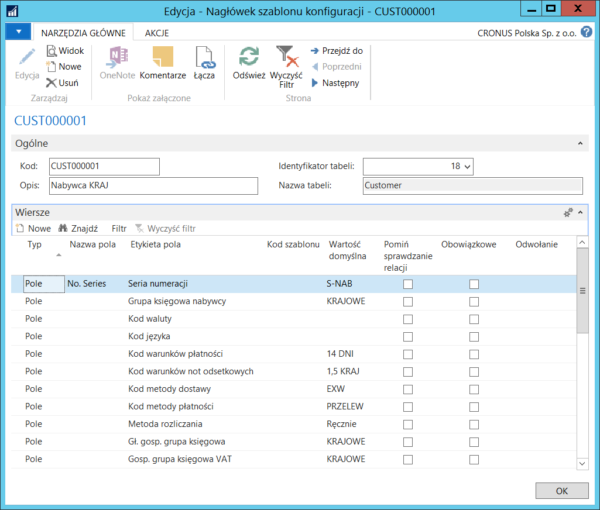
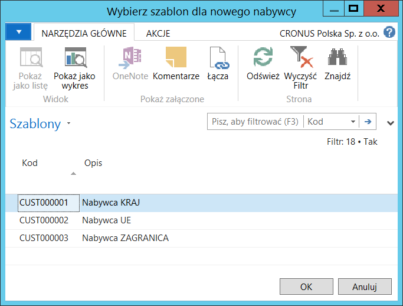
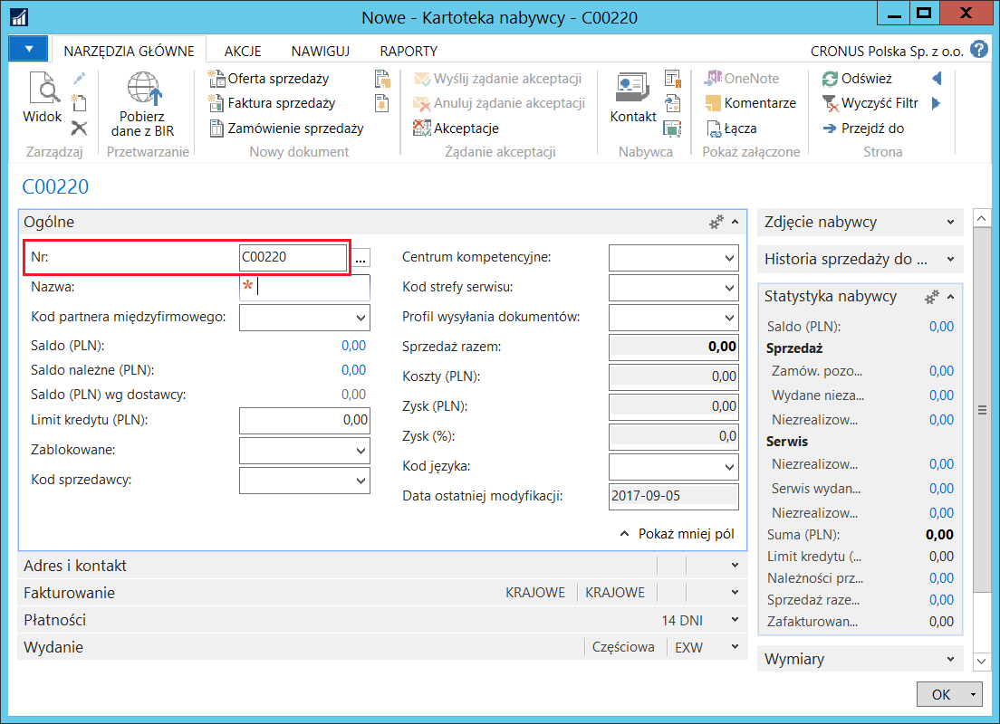

# Seria numeracji w szablonach głównych

## Informacje ogólne

Standardowa funkcjonalność **Szablony główne** umożliwia zdefiniowanie
domyślnych parametrów w różnych zestawach, na podstawie których system
automatycznie uzupełnia część pól w rekordach zakładanych przy użyciu
wybranego szablonu głównego. Polska Lokalizacja umożliwia dodatkowo
przypisywanie domyślnej serii numeracji w szablonach zdefiniowanych
dla nabywców, dostawców i środków trwałych.

## Ustawienia

W celu przypisania serii numeracji do szablonu głównego, należy
postępować według następujących kroków:

1.  Należy wybrać **Działy \> Administracja \> Ustawienia aplikacji \>
    Ogólne \> Konfiguruj szablony główne.**

2.  W oknie **Konfiguruj szablony główne**, które się otworzy, należy
    zaznaczyć wiersz z wybranym szablonem i wybrać **Edycja**.

3.  Na karcie skróconej **Wiersze** należy wstawić nowy wiersz, w którym
    w polu **Nazwa pola** należy wybrać **No. Series**, a w polu
    **Wartość domyślna** należy ręcznie wprowadzić kod wcześniej
    zdefiniowanej serii numeracji, przeznaczonej do numerowania
    kartotek zakładanych przy użyciu danego szablonu. Pozostałe pola
    należy uzupełnić w sposób standardowy.

  

>[!NOTE]
>Przypisywanie domyślnych serii numeracji jest możliwe
dla **Szablonów głównych** zdefiniowanych dla nabywców (identyfikator
tabeli = 18), dostawców (identyfikator tabeli = 23) i środków trwałych
(identyfikator tabeli = 5600).
>
>Brak przypisania domyślnej serii numeracji do szablonu głównego
skutkuje tym, że podczas tworzenia nowej kartoteki z wykorzystaniem
tego szablonu, system zastosuje odpowiednią serię numeracji
ze standardowych ustawień zdefiniowanych w oknach: **Ustawienia
sprzedaży i należn.**, **Ustawienia zakupów i zobowiązań**,
**Ustawienia ŚT.**

## Obsługa

Zasada działania funkcjonalności jest taka sama dla nabywców, dostawców
i środków trwałych, dlatego obsługa zostanie opisana tylko
na przykładzie nabywcy.

W celu zdefiniowania kartoteki nabywcy z wykorzystaniem szablonu
głównego z przypisaną domyślną serią numeracji, należy postępować
według następujących kroków:

1.  Należy wybrać **Działy \> Zarządzanie Finansami \> Należności \>
     Nabywcy**.

2.  W oknie **Nabywcy**, które się otworzy, należy wybrać **Nowe**.

3.  W oknie **Wybierz szablon dla nowego nabywcy** należy zaznaczyć
     wiersz z wybranym szablonem i wybrać **OK.**

  

4.  System nadał nowej kartotece nabywcy numer kolejny zgodny z serią
    numeracji przypisaną do wybranego szablonu głównego:

  

5.  Pozostałe pola w kartotece nabywcy należy uzupełnić standardowo.
