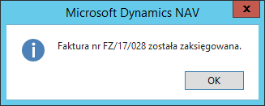

# Informacja o numerze zaksięgowanego dokumentu 

## Informacje ogólne

Polskie ustawodawstwo wymaga umieszczania na dokumencie papierowym
informacji o numerze księgowym, pod jakim dokument został
zaewidencjonowany w księgach firmy. W celu ułatwienia użytkownikom
odnalezienia numeru księgowego, do standardowej funkcjonalności systemu
Microsoft Dynamics 365 Business Central on‑premises został dodany
komunikat, który wyświetla numer księgowy dokumentu po jego poprawnym
zaksięgowaniu.

## Obsługa

Poprawne zaksięgowanie dokumentu po wywołaniu funkcji księgującej
powoduje wyświetlenie komunikatu o numerze zaksięgowanego dokumentu, pod
jakim zaewidencjonowany jest dokument w księgach firmy. Komunikat ten
wyświetla się po zaksięgowaniu następujących typów dokumentu:

1. Wydanie sprzedaży

2. Faktura sprzedaży

3. Przyjęcie zwrotu sprzedaży

4. Faktura korygująca sprzedaży

5. Przyjęcie zakupu

6. Faktura zakupu

7. Wydanie zwrotu zakupu

8. Faktura korygująca zakupu

  