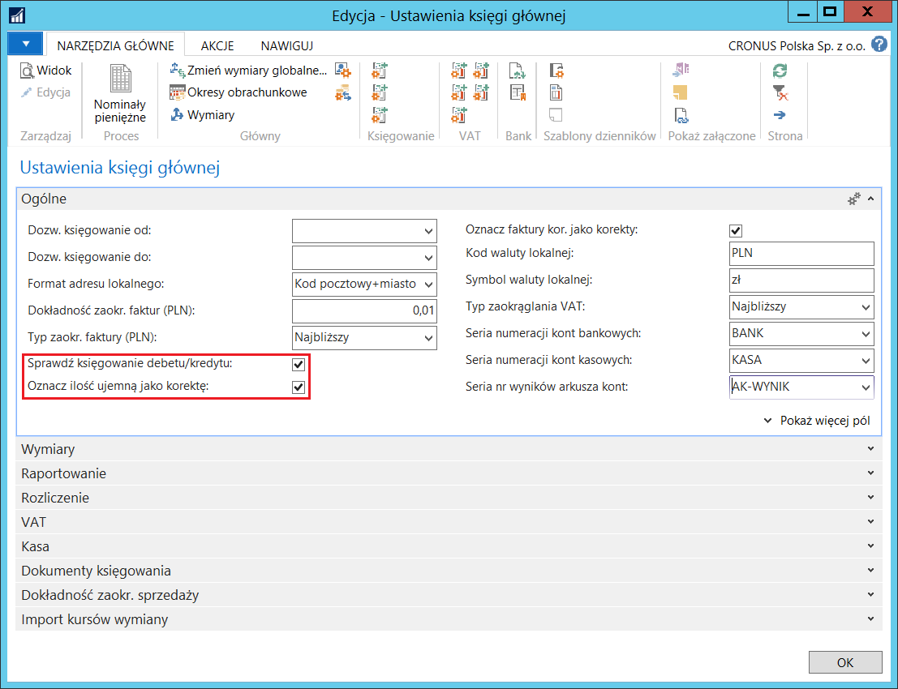

# Księgowanie korekty (storno czerwone)

## Informacje ogólne

Dla wielu kont bilansowych, księgowi muszą wiedzieć, jakie w danym
okresie były dokładne przychody i rozchody z konta. W polskiej praktyce
ewidencyjnej, w celu określenia kwot przychodów i rozchodów z konta
używa się obrotów konta po określonej stronie, na przykład dla konta
„Środki trwałe" przychodami są obroty strony debet a rozchodami obroty
strony kredyt. Aby zapewnić, że tak określone kwoty rozchodów
i przychodów są prawidłowe, księgowi muszą zachować tak zwaną „czystość
obrotów", czyli księgować korekty po tej samej stronie konta, po której
była zaksięgowana pierwotna operacja, lecz z przeciwnym znakiem
(„czerwone storno"). Co prawda w wersji międzynarodowej możliwe jest
ręczne zaksięgowanie takiej operacji, jednak system nie wspiera
wymuszania tego sposobu księgowania, dodatkowo, automatycznie księgowane
przez system korekty są księgowane po przeciwnej stronie konta
niż pierwotna transakcja („czarne storno").

Aby ułatwić użytkownikom stosowanie „czerwonego" storna do księgowania
operacji korygujących, do modułu Polska Lokalizacja dodano następujące
elementy:

- Możliwość wymuszenia księgowań po właściwych stronach właściwych
     kont księgi głównej.

- Możliwość księgowania korekt transakcji magazynowych jako „czerwone
     storno" (wydania w transakcjach przesunięć magazynowych,
     wyksięgowanie kosztu przewidywanego itp.).

- Ułatwienia procesu – obsługi księgowania korekt – za pomocą
     jednego kliknięcia (księgowania w księdze głównej, zapasach
     i zleceniach).

## Ustawienia

Aby wymusić zasadę polityki rachunkowości, w której kontach księgi
głównej zapisy mogą być dokonywane tylko po jednej stronie (debet
lub kredyt) oraz ustawić automatyczne księgowanie korekt dla ilości
ujemnych, należy postępować według następujących kroków:

1. Należy wybrać **Działy \> Zarządzanie Finansami \> Administracja \>
    Ustawienia księgi głównej.**

2. W oknie **Ustawienia księgi głównej**, które się otworzy, na karcie
    skróconej **Ogólne** należy zaznaczyć pole **Sprawdź księgowanie
    debetu/kredytu**. Efektem tego ustawienia będzie wyświetlenie
    komunikatu o błędzie, jeśli podjęta zostanie próba zaksięgowania
    kwoty po stronie kredyt na koncie K/G, które w polu
    **Debet/kredyt** ma wybraną opcję **Debet** (i odwrotnie).

    >[!NOTE]
    >To ustawienie działa dla kont K/G, dla których w polu
    **Debet/kredyt** została wybrana inna opcja niż **Obydwa**.

3.  W oknie **Ustawienia księgi głównej** na karcie skróconej **Ogólne**
    należy zaznaczyć pole **Oznacz ilość ujemną jako korektę**.
    Efektem tego ustawienia będzie zaksięgowanie wierszy sprzedaży
    i zakupu z ilością ujemną, jako zapisy korekty. To ustawienie
    dotyczy dokumentów:

    - **Zamówienie**
    
    - **Faktura**
    
    - **Zamówienie zwrotu**
    
    - **Faktura korygująca**

    >[!NOTE]
    >To ustawienie odnosi się również do transakcji
    zaksięgowanych w dziennikach zapasów i zleceń.

  

Definiując odpowiednie ustawienia w oknie **Ustawienia księgi głównej**
można zdecydować, czy faktury korygujące sprzedaży domyślnie będą
oznaczane jako korekty, czyli tzw. storno czerwone. W celu zdefiniowania
takiego ustawienia, należy postępować według następujących kroków:

1.  Należy wybrać **Działy \> Zarządzanie Finansami \>
    Administracja \> Ustawienia księgi głównej**.

2.  W oknie **Ustawienia księgi głównej**, które się otworzy, na karcie
    skróconej **Ogólne** należy zaznaczyć pole **Oznacz faktury kor.
    jako korekty**:

  

>[!NOTE]
>Ustawienie **Oznacz faktury kor. jako korekty** w oknie
**Ustawienia księgi głównej** ma odniesienie również do serwisowych faktur korygujących wystawianych w module Serwis. Zasady działania i sposób obsługi tego ustawienia są takie same w obydwu modułach: Sprzedaż i Marketing oraz Serwis. 
>
>Więcej informacji na temat wystawiania faktur korygujących sprzedaży znajduje się w rozdziale **Faktury korygujące sprzedaży**.

Aby wymusić zasadę polityki rachunkowości i wyksięgowanie kosztu
przewidywanego zarejestrować jako korektę oraz w ten sam sposób
rejestrować zapisy wydań magazynowych w ramach przesunięć
międzymagazynowych, należy postępować według następujących kroków:

1.  Należy wybrać **Działy \> Zarządzanie Finansami \> Administracja \>
    Ustawienia zapasów.**

2.  W oknie **Ustawienia zapasów**, które się otworzy, na karcie
    skróconej **Ogólne**, należy zaznaczyć pole **Księguj przeks.
    kosztu przew. jako korekty.** Efektem tego ustawienia będzie
    wyksięgowanie kosztu przewidywanego jako korekty, w ramach jego
    konwersji w koszt rzeczywisty.

3.  W tym samym oknie, na tej samej karcie skróconej, należy zaznaczyć
    pole **Księguj przesunięcia ujemne jako korekty**. Efektem tego
    ustawienia będą zapisy księgi głównej utworzone jako korekty,
    będące rezultatem księgowania wydania przesunięcia
    międzymagazynowego z lokalizacji pierwotnej i lokalizacji zapasów
    w drodze.

    >[!NOTE]
    >To ustawienie odnosi się również do transakcji
    zaksięgowanych w dziennikach przeszacowań.
    
  