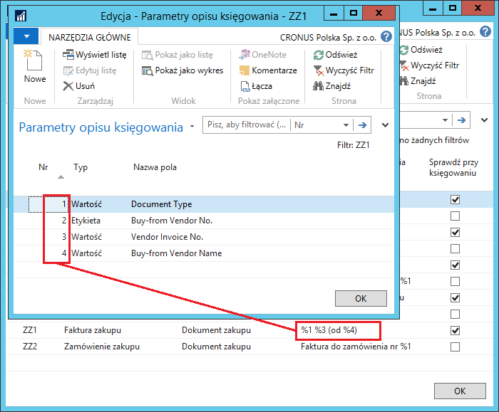
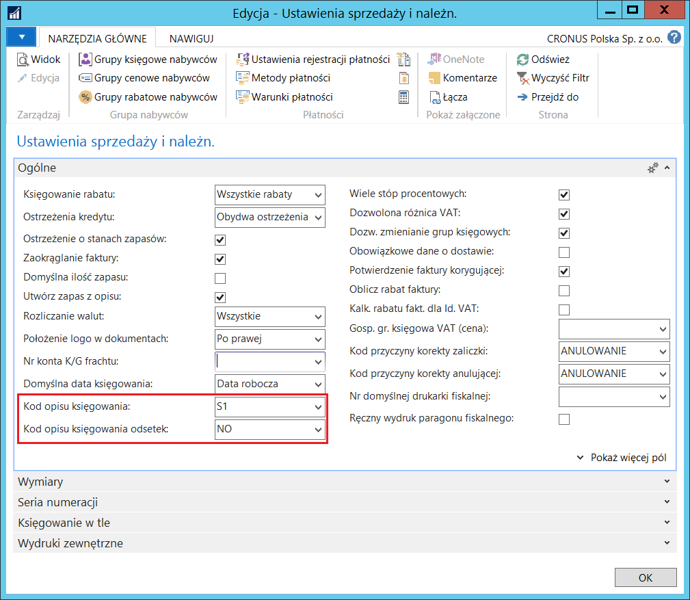
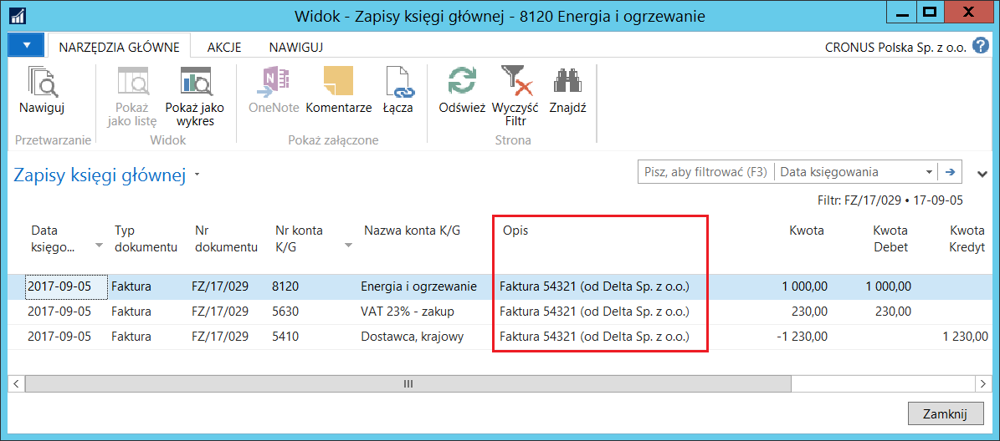

# Opis księgowania 

## Informacje ogólne

Jest to element Polskiej Lokalizacji systemu Microsoft Dynamics 365
Business Central on‑premises wprowadzający ułatwienia w opisywaniu
księgowanych transakcji zapisywanych w tabeli **Zapis księgi głównej**.
Pozwala też na ujednolicenie systemu opisywania transakcji poprzez
zablokowanie dokonywania zmian w wybranych opisach wstawianych
domyślnie.

## Ustawienia

Możliwe jest zdefiniowanie różnych sposobów tworzenia opisów transakcji zapisywanych w tabeli **Zapis księgi głównej**, które będą generowane przez system w różnych typach dokumentów. W tym celu należy postępować według następujących kroków:

1. Należy wybrać **Działy \> Zarządzanie Finansami \> Administracja \>
Opisy księgowania.**

2. W oknie **Opisy księgowania**, które się otworzy, należy w pustym
wierszu wypełnić kolejno pola:

- **Kod** – w tym polu należy wprowadzić unikalny kod dla opisu księgowania

- **Opis** – w tym polu należy wprowadzić krótki opis dla opisu księgowania

- **Typ** – w tym polu należy wybrać spośród dostępnych opcji, gdzie opis księgowania będzie używany. Dostępne opcje:

    - **Dokument sprzedaży**
    
    - **Dokument zakupu**
    
    - **Księgowanie kosztu zapasów**
    
    - **Nota odsetkowa**
    
    - **Dokument serwisowy**
    

- **Formuła opisu księgowania** – to pole przedstawia, w jaki sposób
 będą generowane elementy opisu sięgowania. Tutaj można wprowadzić znaki specjalne, jak np. %1 lub %2, w miejsce tórych system wstawi wartości z księgowanego dokumentu. Parametry dla znaków specjalnych definiowane są w odrębnym oknie, co zostanie opisane w dalszej części tego rozdziału.

- **Sprawdź przy księgowaniu** – jeśli pole jest zaznaczone, system
     podczas księgowania umieści w zapisach domyślną treść opisu.
     Jakiekolwiek zmiany w opisie wprowadzone przez użytkownika,
     zostaną zignorowane. W przypadku, gdy pole nie jest zaznaczone,
     opis, który zostanie przeniesiony do zapisów księgi głównej
     podczas księgowania, będzie uwzględniał wszystkie zmiany
     wprowadzone przez użytkownika.

  
  

3. W następnym kroku, dla każdego wiersza, w którym, w polu **Formuła
     opisu księgowania** umieszczone zostały znaki specjalne %1 %2 %3
     ... , konieczne jest zdefiniowanie parametrów, według
     których system będzie podstawiał odpowiednie wartości w miejsce
     znaków specjalnych. W tym celu, dla każdego opisu oddzielnie,
     należy wybrać **Parametry.**

4. W oknie **Parametry opisu księgowania**, które się otworzy, należy
     odpowiednio wypełnić pola:

    - **Nr** – w tym polu należy wprowadzić cyfrę odpowiadającą znakowi
         specjalnemu zawartemu w polu **Formuła opisu księgowania**.
         Parametr wprowadzony w wierszu z tym numerem zostanie wstawiony
         w odpowiednie miejsce opisu księgowania, np. parametr w wierszu
         z numerem 1 zostanie wstawiony w miejsce znaku specjalnego %1.

         >[!NOTE]
         >Z uwagi na ograniczenia techniczne, numery
         w oknie **Parametry opisu księgowania** zawsze muszą zaczynać się od 1
         i nie może być ich więcej niż 10 dla każdego opisu księgowania.
         Dodatkowo, pole **Opis** w oknie **Zapis księgi głównej** nie może
         zawierać więcej niż 50 znaków.

    - **Typ** – w tym polu należy wybrać, jakiego typu parametr będzie
    użyty. Dostępne opcje to:

        - **Etykieta** – wybranie tej opcji oznacza, że w miejsce
        odpowiedniego znaku specjalnego zostanie podstawiona nazwa pola
        wybranego w polu **Nazwa pola**

        - **Wartość** – wybranie tej opcji oznacza, że w miejsce
        odpowiedniego znaku specjalnego zostanie podstawiona zawartość
        pola wybranego w polu **Nazwa pola**

        - **Stała** – wybranie tej opcji oznacza, że w miejsce odpowiedniego
        znaku specjalnego zostanie podstawiona treść ręcznie wpisana
        w polu **Nazwa pola.**

        >[!NOTE]
        >Należy pamiętać, że zawartość niektórych rodzajów pól (np.
        typu **Opcja**) oraz nazwy pól będą tłumaczone na język aplikacji.
        Jeśli wymagane jest, aby parametry ulegające tłumaczeniom w opisach
        były wyświetlane zawsze w jednym, wybranym, języku, należy użyć opcji
        **Stała** i ręcznie wpisać treść.
        
    - **Nazwa pola** – w tym polu należy wybrać pola, których nazwa
    lub zawartość (dla typów: **Etykieta** lub **Wartość**) będą użyte
    w miejscu znaków specjalnych w polu **Formuła Opisu Księgowania**
    albo wprowadzić stałą treść (dla typu **Stała**) w tym samym celu.
    W zależności od wybranego typu w polu **Typ** w oknie **Opisy
    księgowania**, lista pól dostępnych do wyboru w polu **Nazwa
    pola** będzie różna:

        - **Dokument sprzedaży** – lista rozwijana w polu **Nazwa pola**
        będzie zestawieniem pól tabeli **Nagłówek sprzedaży**.
        
        - **Dokument zakupu** – lista rozwijana w polu **Nazwa pola** będzie
        zestawieniem pól tabeli **Nagłówek zakupu**.
        
        - **Księgowanie kosztu zapasów –** lista rozwijana w polu **Nazwa
        pola** będzie zestawieniem pól tabeli **Zapisy wyceny**.
        
        - **Nota odsetkowa –** lista rozwijana w polu **Nazwa pola** będzie
        zestawieniem pól tabeli **Nagłówek noty odsetkowej**.
        
        - **Dokument serwisowy –** lista rozwijana w polu **Nazwa pola**
        będzie zestawieniem pól tabeli **Nagłówek serwisu**.

  

Na podstawie przykładowych ustawień zaprezentowanych na powyższym
rysunku, dla faktury zakupu z numerem 13/078 od firmy o nazwie Delta Sp. z o. o. system wygeneruje opis
księgowania:  **Faktura 2017/548765 (od Delta Sp. z o.o.)**

W ramach definiowania ustawień konieczne jest też wybranie opisów
domyślnych, które system będzie automatycznie generował w różnych
miejscach. W tym celu należy postępować według następujących kroków:

1. Należy wybrać **Działy \ Zarządzanie Finansami \ Administracja \
    Ustawienia sprzedaży i należności**.

2. W oknie **Ustawienia sprzedaży i należn.**, które się otworzy,
    na karcie skróconej **Ogólne**, należy uzupełnić pola:

    - **Kod opisu księgowania** – z listy rozwijanej należy wybrać
    właściwy kod spośród wcześniej zdefiniowanych opisów, który będzie
    domyślnie stosowany w dokumentach sprzedaży: ofercie, zamówieniu,
    fakturze, zamówieniu zwrotu oraz fakturze korygującej.
    
    - **Kod opisu księgowania odsetek** – z listy rozwijanej należy
    wybrać właściwy kod spośród wcześniej zdefiniowanych opisów,
    który będzie domyślnie stosowany w notach odsetkowych.

  

 >[!NOTE]
 > Należy zwrócić uwagę, że lista rozwijana w polu **Kod opisu
 księgowania** składa się wyłącznie z kodów opisów zdefiniowanych
 z typem **Dokument sprzedaży**, a w polu **Kod opisu księgowania
 odsetek** – z kodów opisów zdefiniowanych z typem **Nota odsetkowa.**

3. Należy wybrać **Działy \> Zarządzanie Finansami \> Administracja \
Ustawienia zakupów i zobowiązań**.

4. W oknie **Ustawienia zakupów i zobow.**, które się otworzy,
na karcie skróconej **Ogólne**, należy uzupełnić pole **Kod opisu
księgowania** – z listy rozwijanej należy wybrać właściwy kod
spośród wcześniej zdefiniowanych opisów, który będzie domyślnie
stosowany w dokumentach zakupu: ofercie, zamówieniu, fakturze,
zamówieniu zwrotu oraz fakturze korygującej.

  

 >[!NOTE]
 > Należy zwrócić uwagę, że lista rozwijana w polu **Kod opisu
 księgowania** składa się wyłącznie z kodów opisów zdefiniowanych
 z typem **Dokument zakupu.**

5. Należy wybrać **Działy \> Zarządzanie Finansami \> Administracja \>
Ustawienia zapasów**.

6. W oknie **Ustawienia zapasów**, które się otworzy, na karcie
skróconej **Ogólne**, należy uzupełnić pole **Kod opisu
księgowania** – z listy rozwijanej należy wybrać właściwy kod
spośród wcześniej zdefiniowanych opisów, który będzie domyślnie
stosowany w skrypcie **Księguj koszt zapasów do K/G**.

  

 >[!NOTE]
 > Należy zwrócić uwagę, że lista rozwijana w polu **Kod opisu
 księgowania** składa się wyłącznie z kodów opisów zdefiniowanych
 z typem **Księgowanie kosztów zapasu.**

7. Należy wybrać **Działy \> Serwis \> Administracja \> Ustawienia
serwisu.**

8. W oknie **Ustawienia zarz. serwisem**, które się otworzy, na karcie
skróconej **Ogólne**, należy uzupełnić pole **Kod opisu
księgowania** – z listy rozwijanej należy wybrać właściwy kod
spośród wcześniej zdefiniowanych opisów, który będzie domyślnie
stosowany w dokumentach serwisu: zleceniu, fakturze oraz fakturze
korygującej.

  

 >[!NOTE]
 > Należy zwrócić uwagę, że lista rozwijana w polu **Kod opisu
 księgowania** składa się wyłącznie z kodów opisów zdefiniowanych
 z typem **Dokument serwisowy.**

## Obsługa

 Po zdefiniowaniu opisów księgowania i ustawieniu reguł ich księgowania, można zacząć korzystać z tej funkcjonalności, np. w fakturze zakupu. W tym celu należy postępować według następujących kroków:

1. Należy wybrać **Nowe** w oknie **Faktury zakupu** i wprowadzić co
najmniej dostawcę oraz numer jego faktury.

2. W kartotece nowej faktury zakupu system uzupełni domyślnie pole Kod
**opisu księgowania** oraz **Opis księgowania** na podstawie
wcześniej zdefiniowanych ustawień i parametrów.

  

3. Pozostałe pola faktury zakupu należy uzupełnić standardowo.

4. Jeśli konieczna jest zmiana treści w polu **Opis księgowania**,
    można to zrobić w dwojaki sposób, w zależności od ustawień:

    - Jeżeli pole **Sprawdź przy księgowaniu** nie jest zaznaczone
    dla wybranego **Kodu opisu księgowania**, wszelkie konieczne
    zmiany należy wprowadzić w treści opisu wstawionego domyślnie
    
    - Jeżeli pole **Sprawdź przy księgowaniu** jest zaznaczone
    dla wybranego **Kodu opisu księgowania**, wszelkie zmiany
    wprowadzone w treści opisu wstawionego domyślnie zostaną
    zignorowane w trakcie księgowania. Wprowadzenie nowej treści opisu
    w zamówieniu zakupu jest możliwe po wyczyszczeniu pola **Kod opisu
    księgowania.**

5.  Należy zaksięgować fakturę zakupu, aby sprawdzić opis księgowania
utworzony w tabeli **Zapis księgi głównej**.

  

 >[!NOTE]
 > Jeżeli w oknach z ustawieniami nie zostanie wskazany
 domyślny **Kod opisu księgowania**, system wygeneruje opis zgodnie
 ze standardem wersji międzynarodowej.