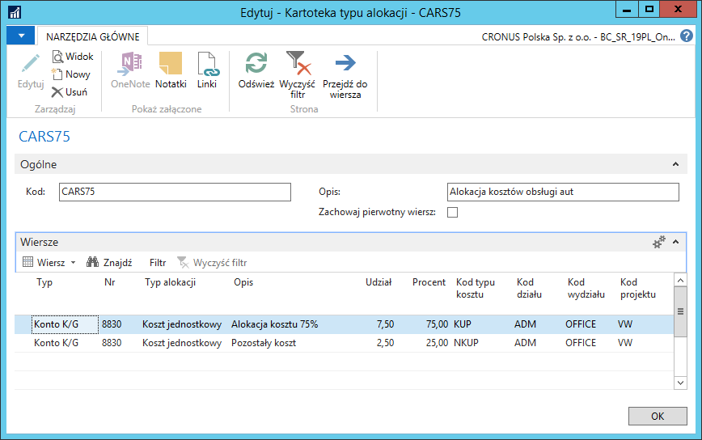
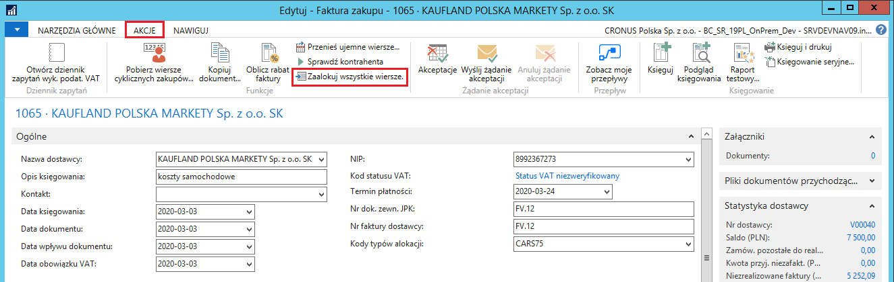

# Podział kosztów na podatkowe i niepodatkowe 

## Informacje ogólne

Zgodnie z aktualnie obowiązującymi przepisami, podatnik może zaliczyć
tylko 75% wydatków związanych z używaniem samochodu do kosztów uzyskania
przychodu w przypadku, gdy wykorzystuje ten samochód również do celów
niezwiązanych z prowadzoną działalnością, czyli również do celów
prywatnych. W ramach Polskiej Lokalizacji w systemie Microsoft Dynamics
365 Business Central on‑premises zostało dodane narzędzie umożliwiające
poprawne i przejrzyste rozliczenie takich wydatków.

## Ustawienia

W celu ustawienia zasad alokacji kosztów, należy wykonać następujące
kroki:

1.  Należy wybrać **Działy \> Zarządzanie Finansami \> Administracja \>
    Zobowiązania \> Ustawienia \> Typy alokacji.**

2.  W oknie **Typy alokacji**, które się otworzy, należy na wstążce
    kliknąć **Nowy**.

3.  W oknie **Kartoteka typu alokacji** należy wypełnić pola zgodnie z
    poniższym opisem:

    Karta skrócona **Ogólne**:
    
    -   **Kod** – w tym polu należy wprowadzić unikalny kod identyfikujący
        dany schemat alokacji kosztów,
    
    -   **Opis** – w tym polu można wprowadzić opis danego schematu
        alokacji kosztów,
    
    -   **Zachowaj pierwotny wiersz** – zaznaczenie tego pola spowoduje,
        że źródłowy wiersz dokumentu z kosztem podlegającym alokowaniu
        nie zostanie usunięty po wykonaniu alokacji. Brak znacznika
        spowoduje, że wiersz źródłowy zostanie usunięty z dokumentu.
    
    Karta skrócona **Wiersze**:
    
    -   **Typ** – domyślnie ustawiona jest opcja **Konto K/G**, bez
        możliwości zmiany – wskazuje na bezpośrednią ewidencję kosztu na
        kontach księgi głównej (ewidencja wartościowa),
    
    
    -   **Nr** – z listy rozwijanej w tym polu należy wybrać właściwe dla
        ewidencji kosztów konto księgi głównej,
    
    -   **Typ alokacji** – z listy rozwijanej w tym polu należy wybrać
        wartość w dokumencie zakupu, która będzie dzielona w wyniku
        alokowania kosztu:
    
    -   **Ilość** – nowe wiersze dokumentu zakupu zostaną utworzone w
        wyniku podzielenia wartości z pola **Ilość** w pierwotnym wierszu
        zakupu,
    
    -   **Koszt jednostkowy** – nowe wiersze dokumentu zakupu zostaną
        utworzone w wyniku podzielenia wartości z pola **Bezpośr. koszt
        jedn.** w pierwotnym wierszu zakupu.
    
    -   **Opis** – pole opcjonalne – w tym polu można wprowadzić krótki
        opis wiersza (np. zdefiniowanych w nim zasad alokacji),
    
    -   **Udział** – w tym polu należy wprowadzić wartość klucza podziału
        kosztów według udziału ilościowego – na tej podstawie zostanie
        wyliczona wartość procentowa w polu **Procent**,
    
    -   **Procent** – pole nieedytowalne, prezentujące wartość klucza
        podziału kosztów według udziału procentowego, wyliczonego na
        podstawie wartości wprowadzonych w polu **Udział**.

    Do każdego wiersza alokacji można przypisać zestaw wartości wymiarów,
    który będzie miał zastosowanie w utworzonych wierszach dokumentu
    zakupu. Aby przypisać wartości wymiarów, w karcie skróconej
    **Wiersze** można wyświetlić kolumny z odpowiednimi wymiarami, lub
    zaznaczyć wiersz i kliknąć akcję **Wiersze**, następnie kliknąć
    **Wymiary** (można też nacisnąć **Ctrl+Shift+D**). Czynność należy
    powtórzyć dla każdego wiersza w oknie **Kartoteka typu alokacji**.

  

## Obsługa

Alokowanie kosztów w głównej mierze dotyczy wydatków, które należy
podzielić na podatkowe i niepodatkowe, dlatego funkcjonalność jest
dostępna w dokumentach zakupu typu faktura i zamówienie.

>[!NOTE]
>Opis funkcji alokowania kosztów zamieszczony w dalszej części
rozdziału bazuje na przykładzie faktury zakupu. W zamówieniu zakupu
mechanizm jest identyczny, więc należy wzorować się na opisie dotyczącym
faktury zakupu.

W celu zaksięgowania kosztów z faktury zakupu według wybranego klucza
alokacji, należy wykonać następujące kroki:

1.  Należy wybrać **Działy \> Zarządzanie Finansami \> Zobowiązania \>
    Faktury zakupu.**

2.  W oknie **Faktury zakupu**, które się otworzy, należy na wstążce
    kliknąć **Nowy**.

3.  Należy wypełnić nagłówek i wiersze nowej faktury zakupu w
    standardowy sposób.

4.  W wybranych wierszach faktury z kosztami do alokowania należy z
    listy rozwijanej w polu **Typ alokacji** wybrać wcześniej
    zdefiniowany klucz, według którego ma zostać dokonany podział
    kosztu z danego wiersza.

5.  Jeśli wszystkie koszty, we wszystkich wierszach faktury, mają zostać
    podzielone według tego samego klucza, można w nagłówku dokumentu,
    w karcie skróconej **Ogólne**, z listy rozwijanej w polu **Typ
    alokacji** wybrać klucz, który zostanie skopiowany do wszystkich
    wierszy.

    Zmiana wartości w polu **Typ alokacji** w karcie skróconej **Ogólne**
    w sytuacji, gdy istnieje choć jeden wiersz dokumentu, spowoduje
    wyświetlenie komunikatu, w którym należy kliknąć **Tak**, aby
    zastosować zmianę do wszystkich wierszy dokumentu.

6.  Po przypisaniu typu alokacji do wszystkich wymaganych wierszy,
     należy na wstążce kliknąć **Zaalokuj wszystkie wiersze**.

W wyniku działania tej funkcji, system utworzył nowe wiersze faktury
zakupu na podstawie wybranego typu alokacji, włącznie z wymiarami.
Wiersz źródłowy, który podlegał alokowaniu, został zachowany lub
usunięty, w zależności od parametru **Zachowaj pierwotny wiersz**
ustawionego dla wybranego typu alokacji.

Dalsze procesy weryfikacji i księgowania faktury zakupu należy wykonać
w standardowy sposób.