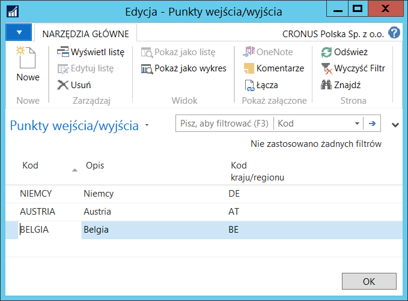
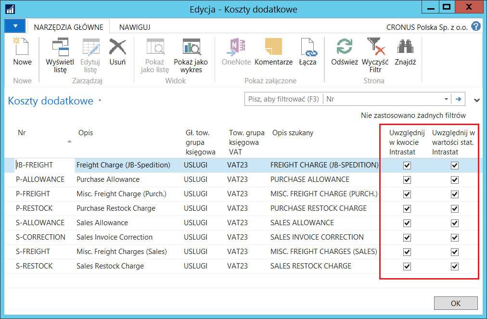
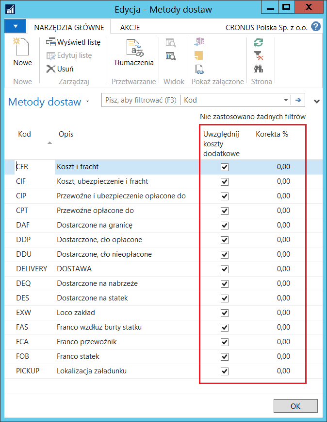
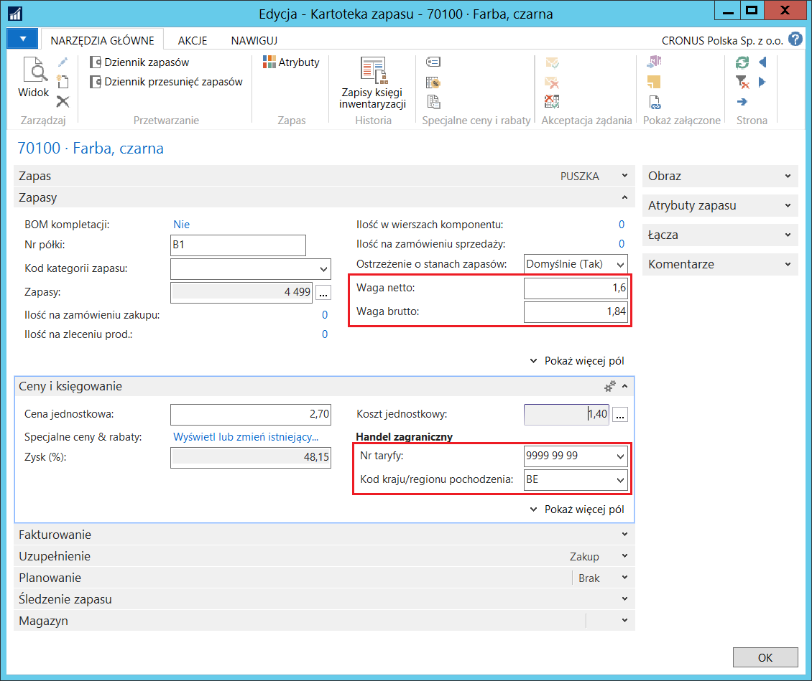
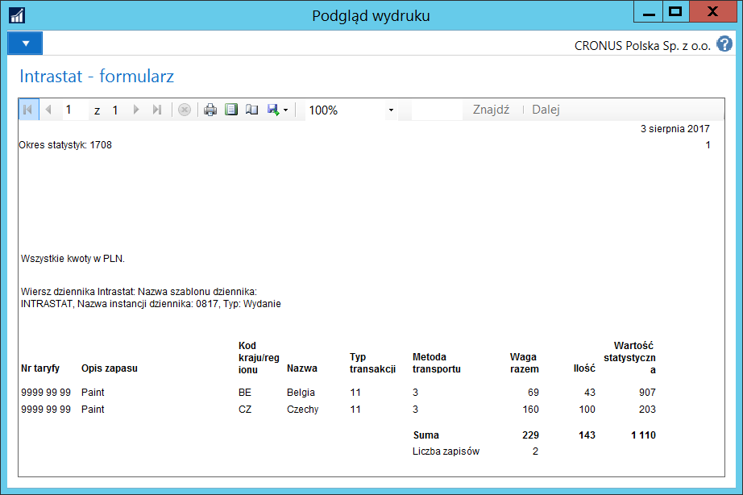
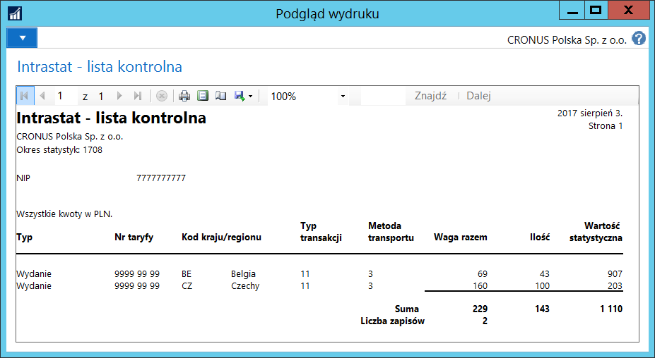
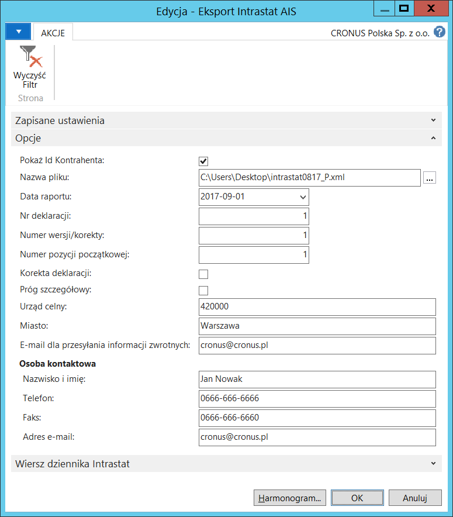
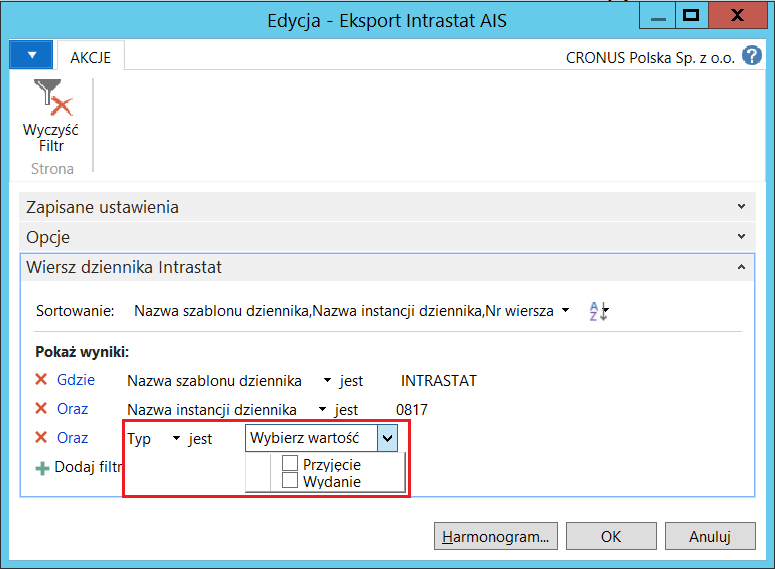

# Intrastat

## Informacje ogólne

Przystąpienie Polski do Unii Europejskiej spowodowało nałożenie nowego obowiązku sprawozdawczego na podmioty prowadzące wymianę towarową z państwami członkowskimi Unii Europejskiej. Obowiązek ten polega na dokonywaniu przez podmiot zgłoszeń Intrastat, czyli na przekazywaniu organom celnym, w wymaganej formie i w określony sposób, informacji na temat obrotu towarowego z państwami członkowskimi Wspólnoty. Standardowa funkcjonalność systemu Microsoft Dynamics 365 Business Central on‑premises zawiera narzędzia ułatwiające przygotowanie deklaracji Intrastat, a w ramach Polskiej Lokalizacji zostały dodane ulepszenia, w tym również możliwość eksportu deklaracji Intrastat do pliku w formacie XML.

## Ustawienia

W celu zdefiniowania podstawowych parametrów Intrastat, należy
postępować według następujących kroków:

1.  Należy wybrać **Działy \> Zarządzanie Finansami \> Administracja \>
    Ustawienia raportowania stat.**

2.  W oknie **Ustawienia raportowania stat.**, które się otworzy, należy
    odpowiednio wypełnić pola na karcie skróconej **Intrastat**:

    -   **Obowiązkowy typ transakcji** – zaznaczenie tego pola powoduje,
         że podczas księgowania system sprawdza, czy pole **Typ
         transakcji** jest wypełnione w dokumentach sprzedaży, zakupu
         i przesunięć, po zaksięgowaniu których powstaną zapisy w tabelach:
         **Zapisy księgi zapasu** lub **Zapisy księgi zleceń**.
    
    -   **Obowiązkowa specyfikacja transakcji** – zaznaczenie tego pola
         powoduje, że podczas księgowania system sprawdza, czy pole
         **Specyfikacja transakcji** jest wypełnione w dokumentach
         sprzedaży, zakupu i przesunięć, po zaksięgowaniu których powstaną
         zapisy w tabelach: **Zapisy księgi zapasu** lub **Zapisy księgi
         zleceń**.
    
    -   **Obowiązkowa metoda transportu** – zaznaczenie tego pola powoduje,
         że podczas księgowania system sprawdza, czy pole **Metoda
         transportu** jest wypełnione w dokumentach sprzedaży, zakupu
         i przesunięć, po zaksięgowaniu których powstaną zapisy w tabelach:
         **Zapisy księgi zapasu** lub **Zapisy księgi zleceń**.
    
    -   **Obowiązkowa metoda dostawy** – zaznaczenie tego pola powoduje,
         że podczas księgowania system sprawdza, czy pole **Kod metody
         dostawy** jest wypełnione w dokumentach sprzedaży, zakupu
         i przesunięć, po zaksięgowaniu których powstaną zapisy w tabelach:
         **Zapisy księgi zapasu** lub **Zapisy księgi zleceń**.
    
    -   **Obowiązkowy nr taryfy** – zaznaczenie tego pola powoduje,
         że podczas księgowania system sprawdza, czy pole **Nr taryfy**
         jest wypełnione w dokumentach sprzedaży, zakupu i przesunięć,
         po zaksięgowaniu których powstaną zapisy w tabelach: **Zapisy
         księgi zapasu** lub **Zapisy księgi zleceń**.
    
    -   **Pobierz nr taryfy z**– z listy rozwijanej w tym polu należy
         wybrać, skąd podczas tworzenia wierszy dziennika Intrastat, system
         ma pobrać numer taryfy. Dostępne opcje to:
    
        -   **Zaksięgowane zapisy** – przy tej opcji system pobierze numer
             taryfy z zapisów w tabelach: **Zapis księgi zapasu** lub **Zapis
             księgi zleceń**.
        
        -   **Kartoteka zapasu** – przy tej opcji system pobierze numer taryfy
             z kartoteki zapasu.
    
    -   **Obowiązkowa waga netto** – zaznaczenie tego pola powoduje,
         że podczas księgowania system sprawdza, czy pole **Waga netto**
         jest wypełnione w dokumentach sprzedaży, zakupu i przesunięć,
         po zaksięgowaniu których powstaną zapisy w tabelach: **Zapisy
         księgi zapasu** lub **Zapisy księgi zleceń**.
    
    -   **Pobierz wagę netto z**– z listy rozwijanej w tym polu należy
         wybrać, skąd podczas tworzenia wierszy dziennika Intrastat, system
         ma pobrać wagę netto. Dostępne opcje to:
    
        -   **Zaksięgowane zapisy** – przy tej opcji system pobierze wagę netto
             z zapisów w tabelach: **Zapis księgi zapasu** lub **Zapis księgi
             zleceń**.
        
        -   **Kartoteka zapasu** – przy tej opcji system pobierze wagę netto
             z kartoteki zapasu.
    
    -   **Obowiązkowy kraj/region pochodzenia** – zaznaczenie tego pola
         powoduje, że podczas księgowania system sprawdza, czy pole **Kod
         kraju/regionu pochodzenia** jest wypełnione w dokumentach
         sprzedaży, zakupu i przesunięć, po zaksięgowaniu których powstaną
         zapisy w tabelach: **Zapisy księgi zapasu** lub **Zapisy księgi
         zleceń**.
    
    -   **Pobierz kraj/region pochodzenia** – z listy rozwijanej w tym polu
         należy wybrać, skąd podczas tworzenia wierszy dziennika Intrastat,
         system ma pobrać kraj/region pochodzenia. Dostępne opcje to:
    
        -   **Zaksięgowane zapisy** – przy tej opcji system pobierze
             kraj/region pochodzenia z zapisów w tabelach: **Zapis księgi
             zapasu** lub **Zapis księgi zleceń**.
        
        -   **Kartoteka zapasu** – przy tej opcji system pobierze kraj/region
             pochodzenia z kartoteki zapasu.
    
    -   **Brak kosztów dodatkowych w deklaracji Intrastat** – zaznaczenie
         tego pola powoduje, że wartość kosztów dodatkowych powiązanych
         z transakcjami sprzedaży, zakupu i przesunięć zostanie pominięta
         w kalkulacji kwot Intrastat i wartości statystycznych.
    
    -   **Typ zaokrąglania Intrastat** – z listy rozwijanej w tym polu
         należy wybrać sposób zaokrąglania kwot Intrastat i wartości
         statystycznych. Dostępne są trzy opcje: **Najbliższy**,
         W **górę**, W **dół**.
    
  

W ramach funkcjonalności Intrastat można też zdefiniować punkty
wejścia/wyjścia. Ma to znaczenie dla poprawnego pobierania przez system
zapisów do dziennika Intrastat. Punkty wejścia/wyjścia są przypisane
do konkretnych krajów/regionów. W sytuacji, gdy w dokumencie zakupu,
sprzedaży lub przesunięcia zostanie wybrany punkt wejścia/wyjścia
powiązany z kodem kraju/regionu mającym zaznaczone pole **Intrastat**,
to system pobierze taką transakcje do dziennika Intrastat, nawet, jeśli
kraj dostawcy lub nabywcy jest poza Unią Europejską. W celu
zdefiniowania punktów wejścia/wyjścia, należy postępować
według następujących kroków:

1.  Należy wybrać **Działy \> Zarządzanie Finansami \> Administracja \>
    Punkty wejścia/wyjścia**.

2.  W oknie **Punkty wejścia/wyjścia**, które się otworzy, w kolejnych
    wierszach należy zdefiniować niezbędne punkty wejścia/wyjścia,
    wypełniając pola:

    -   **Kod** – w tym polu należy wprowadzić unikalny kod dla punktu
         wejścia/wyjścia.
    
    -   **Opis** – w tym polu należy wprowadzić opis punktu
         wejścia/wyjścia.
    
    -   **Kod kraju/regionu** – z listy rozwijanej w tym polu należy wybrać
         kod kraju/regionu powiązanych z punktem wejścia/wyjścia.

  

Może zdarzyć się wymaganie, żeby w deklaracji Intrastat niektóre numery
taryf były zgłaszane w dodatkowej jednostce miary. W celu przypisania
dodatkowych jednostek miary do wybranych numerów taryf, należy
postępować według następujących kroków:

1.  Należy wybrać **Działy \> Zarządzanie Finansami \> Administracja \>
     Numery taryf**.

2.  W oknie **Numery taryf**, które się otworzy, należy w wierszu
     z wybranym numerem taryfy uzupełnić pole **Kod dodatkowej
     jednostki miary**, wybierając z listy jeden z wcześniej
     zdefiniowanych kodów jednostki miary. System automatycznie zmieni
     opcję na **Tak** w polu **Wymag. Dodatkowe informacje**.

  

W sytuacji, gdy wymagane jest uwzględnianie wartości kosztów dodatkowych
powiązanych z transakcjami sprzedaży, zakupu i przesunięć w kalkulacji
kwot Intrastat i/lub wartości statystycznych, konieczne jest specjalne
oznaczenie tych kosztów. W tym celu, należy postępować
według następujących kroków:

1.  Należy wybrać **Działy \> Zarządzanie Finansami \> Administracja \>
     Koszty dodatkowe**.

2.  W oknie **Koszty dodatkowe**, które się otworzy, należy w wierszu
     z wybranym kosztem dodatkowym zaznaczyć jedno lub obydwa pola:
     **Uwzględnij w kwocie Intrastat**, **Uwzględnij w wartości stat.
     Intrastat**, w zależności, do której kwoty ma zostać dodana kwota
     wybranych kosztów dodatkowych powiązanych z transakcjami zakupu,
     sprzedaży i przesunięć wykazywanymi w deklaracji Intrastat.

>[!NOTE]
>Zaznaczenie pól **Uwzględnij w kwocie Intrastat i Uwzględnij w wartości stat. Intrastat w **oknie
 **Koszty dodatkowe** jest wymagane wtedy, gdy pole **Brak kosztów
 dodatkowych w deklaracji Intrastat** w oknie **Ustawienia raportowania
 stat.** nie jest zaznaczone. W przeciwnym wypadku, parametry w oknie
 **Koszty dodatkowe** nie mają wpływu na wartości w deklaracji
 Intrastat.

  

W sytuacji, gdy w kalkulacji kwot Intrastat i/lub wartości
statystycznych wymagane jest uwzględnianie wartości kosztów dodatkowych
powiązanych z transakcjami sprzedaży, zakupu i przesunięć dla wybranych
metod dostaw, należy odpowiednio sparametryzować metody dostaw. W tym
celu, należy postępować według następujących kroków:

1.  Należy wybrać **Działy \> Zakupy \> Administracja \> Metody
     dostaw**.

2.  W oknie **Metody dostaw**, które się otworzy, należy w wierszu
     z wybraną metodą zaznaczyć pole **Uwzględnij koszty dodatkowe.**

 >[!NOTE]
 >Zaznaczenie pola **Uwzględnij koszty dodatkowe w **oknie
 **Metody dostaw** jest możliwe wtedy, gdy w polu **Korekta (%)**
 w oknie **Metody dostaw** jest 0, a pole **Brak kosztów dodatkowych
 w deklaracji Intrastat** w oknie **Ustawienia raportowania stat**. nie
 jest zaznaczone.

3.  W tym samym oknie, w polu **Korekta (%)** można wprowadzić wartość
     procentową, o jaką zostanie zwiększona (dodatnia wartość
     procentowa) lub zmniejszona (ujemna wartość procentowa) wartość
     statystyczna zakupów/sprzedaży dla wybranej metody dostaw
     w dzienniku Intrastat.

  

Można ustawić domyślny dla danej lokalizacji Obszar, który będzie
automatycznie podpowiadany w transakcjach sprzedaży, zakupu
i przesunięć. W tym celu należy w oknie kartoteki wybranej lokalizacji
uzupełnić pole **Obszar** na karcie skróconej **Ogólne**, wybierając
właściwy, wcześniej zdefiniowany kod z listy rozwijanej w tym polu:

  

Domyślne dane niezbędne w przygotowaniu deklaracji Intrastat mogą być
przypisane do kartotek nabywców i dostawców, w tym celu należy uzupełnić
pola: **Typ transakcji**, **Specyfikacja transakcji**, **Metoda
transportu** i **Kod metody dostawy**:

  

  

Domyślne dane niezbędne w przygotowaniu deklaracji Intrastat mogą (lub
muszą – gdy w **Ustawieniach raportowania stat.** kartoteka zapasu jest
wybrana jako źródło danych) być też przypisane do kartotek zapasów,
w tym celu należy uzupełnić pola: **Nr taryfy**, **Kod kraju/regionu
pochodzenia**, **Waga netto** i **Waga brutto**:

  

## Obsługa

W celu zaksięgowania transakcji zakupu, sprzedaży i przesunięcia,
które mają być wykazane w deklaracji Intrastat, należy postępować
według następujących kroków:

1.  Należy w sposób standardowy wprowadzić fakturę zakupu towaru
     od dostawcy z kraju przynależącego do Unii Europejskiej.

2.  W wierszach oraz w nagłówku faktury zakupu niektóre z pól ważnych
     dla deklaracji Intrastat zostały uzupełnione automatycznie
     domyślnymi danymi, w razie potrzeby można je ręcznie zmienić.
     Należy też zwrócić uwagę, że system identyfikuje transakcje
     Intrastat (sprawdza, czy **Kod kraju/regionu** przypisany
     do kartoteki dostawcy ma wypełnione pole **Kod Intrastat**)
     i wstawia znacznik w polu **Transakcja Intrastat**.

  

3.  Przyjęcie i fakturę zakupu należy zaksięgować w standardowy sposób.

    >[!NOTE]
    >Podczas księgowania system sprawdza, czy zostały wypełnione
    wszystkie pola oznaczone jako obowiązkowe w **Ustawieniach
    raportowania statystycznego**.
    >
    >W oknie **Przypisanie kosztu dodatkowego** dla wiersza zakupu typu
    **koszt dodatkowy** system, na podstawie domyślnych ustawień, zaznacza
    (lub nie) pola **Uwzględnij w kwocie Intrastat** i **Uwzględnij
    w wartości stat. Intrastat**. W razie potrzeby, zaznaczenie może być
    zmienione ręcznie, przy zachowaniu reguł ujmowania kosztów dodatkowych
    w transakcjach Intrastat.
    >
    >Pola związane z Intrastatem są dostępne w dokumentach zakupu:
    **Zamówienie**, **Faktura**, **Zamówienie zwrotu i Faktura
    korygująca**.

4.  Należy w sposób standardowy wprowadzić zamówienie sprzedaży towaru
     nabywcy z kraju przynależącego do Unii Europejskiej.

5.  W wierszach oraz w nagłówku faktury sprzedaży niektóre z pól ważnych
     dla deklaracji Intrastat zostały uzupełnione automatycznie
     domyślnymi danymi, w razie potrzeby można je ręcznie zmienić.
     Należy też zwrócić uwagę, że system identyfikuje transakcje
     Intrastat (sprawdza, czy **Kod kraju/regionu** przypisany
     do kartoteki nabywcy ma wypełnione pole **Kod Intrastat**)
     i wstawia znacznik w polu **Transakcja Intrastat**.

  

6.  Wydanie i fakturę sprzedaży należy zaksięgować w standardowy sposób.

    >[!NOTE]
    >Podczas księgowania system sprawdza, czy zostały wypełnione
    wszystkie pola oznaczone jako obowiązkowe w **Ustawieniach
    raportowania statystycznego**.
    >
    >W oknie **Przypisanie kosztu dodatkowego** dla wiersza sprzedaży typu
    **koszt dodatkowy** system, na podstawie domyślnych ustawień, zaznacza
    (lub nie) pola **Uwzględnij w kwocie Intrastat** i **Uwzględnij
    w wartości stat. Intrastat**. W razie potrzeby, zaznaczenie może być
    zmienione ręcznie, przy zachowaniu reguł ujmowania kosztów dodatkowych
    w transakcjach Intrastat.
    >
    >Pola związane z Intrastatem są dostępne w dokumentach sprzedaży:
    **Zamówienie**, **Faktura**, **Zamówienie zwrotu i Faktura
    korygująca**.

7.  Należy w sposób standardowy wprowadzić zlecenie przesunięcia.

8.  W wierszach oraz w nagłówku zlecenia przesunięcia, w kartach
     skróconych: **Lokalizacja pierwotna i Handel zagraniczny**
     niektóre z pól ważnych dla deklaracji Intrastat zostały
     uzupełnione automatycznie domyślnymi danymi, w razie potrzeby
     można je ręcznie zmienić. Należy też zwrócić uwagę, że system
     identyfikuje transakcje Intrastat (sprawdza, czy **Kod
     kraju/regionu** przypisany do kartoteki lokalizacji pierwotnej
     lub docelowej ma wypełnione pole **Kod Intrastat**) i wstawia
     znacznik w polu **Transakcja Intrastat**.

  

9.  Wydanie przesunięcia i przyjęcie przesunięcia należy zaksięgować
     w standardowy sposób.

W celu przygotowania deklaracji Intrastat, należy postępować
według następujących kroków:

1.  Należy wybrać **Działy \> Zarządzanie Finansami \> Działania
    okresowe \> Księga główna \> Dzienniki Intrastat**.

2.  W oknie **Dziennik Intrastat**, które się otworzy, należy kliknąć
    przycisk asysty w polu **Nazwa instancji**.

3.  W oknie **Instancje dziennika Intrastat**, które się otworzy, należy
    wybrać **Nowe**, aby zdefiniować nową instancję dziennika. W nowym
    wierszu należy uzupełnić pola:

    -   **Kod** – w tym polu należy wpisać dowolny kod identyfikujący
         instancję dziennika
    
    -   **Opis** – w tym polu należy wpisać dowolny opis instancji
         dziennika
    
    -   **Okres statystyk** – w tym polu należy wpisać cztery cyfry
         identyfikujące okres deklaracji Intrastat, np. 1708 to sierpień
         2017 roku.

4.  Należy wybrać **OK**, aby otworzyć wiersze dziennika w nowej
    instancji.

5.  W oknie **Dziennik Intrastat** należy wybrać **Pobierz zapisy**
    w celu automatycznego wstawienia transakcji Intrastat do wierszy
    dziennika.

6.  W oknie wstępnym skryptu **Pobierz zap. księgi zapasów**, które się
    otworzy należy uzupełnić pola:

    -   **Data początkowa** – w tym polu należy wprowadzić datę początkową
         okresu, w jakim zostały zaksięgowane transakcje Intrastat,
         na podstawie których ma zostać przygotowana deklaracja Intrastat.
    
    -   **Data końcowa** – w tym polu należy wprowadzić datę końcową
         okresu, w jakim zostały zaksięgowane transakcje Intrastat,
         na podstawie których ma zostać przygotowana deklaracja Intrastat.
    
    -   **Korekta kosztu (%)** – w tym polu należy wprowadzić wartość
         procentową na pokrycie kosztów frachtu i ubezpieczenia, o jaką
         zostanie zwiększona wartość statystyczna we wszystkich wierszach
         dziennika Intrastat.

7.  W celu wykonania skryptu, należy wybrać **OK**.

  

8.  W czasie wykonywania skryptu system wykonuje czynności wymienione
     poniżej:

    -   System pobiera **Zapisy księgi zapasów** i **Zapisy księgi zleceń**
         pochodzące z transakcji zidentyfikowanych jako **Transakcje
         Intrastat**.
    
    -   System ignoruje **Transakcje Intrastat** zakupu i sprzedaży,
         które zostały jednocześnie oznaczone jako **Handel 3-stronny UE**.
    
    -   System pilnuje, aby zostały uwzględnione **Transakcje Intrastat**
         mające punkty wejścia/wyjścia w krajach Unii Europejskiej.
    
    -   System pilnuje, aby korygujące dokumenty sprzedaży i zakupu
         oznaczone jako **Korekta** zostały wstawione w dzienniku Intrastat
         jako ten sam typ dokumentu, co korygowany, ale z przeciwnym
         znakiem.
    
    -   System pilnuje, aby wycofane **Transakcje Intrastat** (np. powstałe
         w wyniku użycia funkcji **Cofnij przyjęcie** lub **Cofnij
         wydanie**) zostały wykluczone: zarówno transakcja wycofana,
         jak i wycofująca.
    
    -   System pilnuje, żeby **Koszty dodatkowe** zostały uwzględnione (lub
         nie) w skorygowaniu i kalkulacji **Kwoty Intrastat oraz Wartości
         statystycznej**, zgodnie z ustawieniami w **Ustawieniach
         raportowania stat.**, **Kosztach dodatkowych**, **Metodach
         dostawy** i **Przypisaniu kosztu dodatkowego**.
    
    -   System pilnuje, aby były użyte **Dodatkowe jednostki miary** podczas
         tworzenia wierszy dziennika Intrastat.
    
    -   System pilnuje, aby użyte dane źródłowe dla **Numeru taryfy**,
         **Wagi netto** i **Kraju/regionu pochodzenia** były poprawne
         i zgodne z **Ustawieniami raportowania statystycznego**.
    
    -   Na podstawie informacji o nabywcy przypisanym do zaksięgowanego
         wydania lub zlecenia, pobierany jest z kartoteki nabywcy NIP.
         W **Dzienniku Intrastat** tylko dla wierszy z **Typem** =
         **Wydanie**, pole **NIP kontrahenta** musi być wypełnione,
         dla wierszy z **Typem** = **Przyjęcie** pole to musi pozostać
         puste.
    
         Zwrot zakupionych zapasów do dostawcy, jeśli dokument zwrotu nie jest
         oznaczony jako **Korekta**, ujmowany jest w deklaracji Intrastat
         z **Typem** = **Wydanie**, dlatego w wierszach dziennika Intrastat
         z takimi zapisami system uzupełnia pole **NIP kontrahenta**
         na podstawie NIP-u pobranego z kartoteki właściwego dostawcy.

9.  Efektem poprawnego wykonania skryptu są wiersze w oknie **Dziennika
     Intrastat**:

  

10. W razie potrzeby, należy ręcznie zmienić lub uzupełnić dane
     wstawione automatycznie do wierszy **Dziennika Intrastat**.
     Możliwe też jest ręczne dodawanie i usuwanie wierszy.

11. Wiersze **Dziennika Intrastat** mogą być wydrukowane. W tym celu
     należy wydrukować **Formularz** lub **Raport kontrolny**,
     wybierając odpowiednią opcję w oknie **Dziennik Intrastat**.
     Obydwa raporty pokazują te same dane, ale w innym układzie.

  

  

12. Eksport danych do deklaracji w formacie xml należy uruchomić
     wybierając **Eksportuj deklarację Intrastat do pliku XML – AIS
     (PUESC)** w oknie **Dziennik Intrastat**. Format ten obowiązuje
     od 01.06.2017.

13. W oknie z opcjami wstępnymi eksportu znajdują się m.in. pola:

    -   **Pokaż ID Kontrahenta** – pole domyślnie zaznaczone przy
         uruchamianiu eksportu. Jeżeli wiersz dziennika dotyczy wywozu
         towarów do różnych kontrahentów w tym samym kraju, należy wykazać
         to w różnych pozycjach zgłoszenia. Tym samym, w przypadku,
         gdy taki sam towar dostarczany do tego samego kraju UE, odbierany
         jest przez kilku kontrahentów w tym kraju, konieczne jest
         zadeklarowanie dostawy (wykazywanej w jednej pozycji przed
         wejściem w życie obowiązku podawania ID kontrahenta) w rozbiciu
         na kilka pozycji zgłoszenia.
    
    -   **Nazwa pliku** – w tym polu należy podać ścieżkę i nazwę pliku
         zgłoszenia (z rozszerzeniem .xml)
    
    -   **Próg szczegółowy** – to pole należy zaznaczyć w przypadku,
         gdy podmiot zobowiązany przekroczy próg szczegółowy.
    
    -   Na 2017 r. ustalono następujące wartości progów statystycznych
         dla podmiotów realizujących obroty z krajami Unii Europejskiej:
    
        -   dla przywozu 50.000.000 zł
        
        -   dla wywozu 93.000.000 zł
    
         W takim przypadku w pliku wypełniane są dodatkowe pola:
        
         7 – Łączna wartość statystyczna w PLN
        
         12 – Kod warunków dostawy
        
         15 – Kod rodzaju transportu
        
         20 – Wartość statystyczna w PLN
        
         Wartość statystyczna uwzględnia dodatkowe koszty dotyczące tej części
         przewozu, która odbywa się na polskim obszarze statystycznym (koszty
         opakowania, opłaty transportowe, opłaty za załadunek i magazynowanie).

    -   Ponadto należy uzupełnić pole **E-mail dla przesyłania informacji
         zwrotnych**, a także pola, które dotyczą osoby składającej
         deklarację: **Nazwisko** i **imię oraz E‑mail**.

  

14. Należy również wybrać opcję w filtrze dla pola **Typ**.

  

15. Eksport należy uruchomić wybierając **OK**.

16. Wygenerowany plik zgłoszenia w formacie xml należy przesłać
    przez platformę (**PUESC**)

## Generowanie zgłoszenia zerowego

Jeżeli w miesiącu sprawozdawczym przedsiębiorstwo zobowiązane
do złożenia zgłoszenia nie zrealizowało żadnych przywozów lub wywozów
towarów, należy za ten miesiąc dokonać zgłoszenia zerowego

W celu przygotowania zerowego zgłoszenia Intrastat, należy postępować
według następujących kroków:

1.  Należy wybrać **Działy \> Zarządzanie Finansami \> Działania
    okresowe \> Księga główna \> Dzienniki Intrastat**.

2.  W otwartym oknie dziennika, w którym nie ma wierszy typu **Wydanie
    lub Przyjęcie**, lub w ogóle nie ma żadnych wierszy, należy wybrać
    **Eksportuj deklarację Intrastat do pliku XML – AIS (PUESC)**
    i wypełnić opcje wstępne eksportu odpowiednio dla wywozu
    lub przywozu.

    Wygenerowany zostanie plik spełniający wymagania zgłoszenia zerowego,
    który należy przesłać przez platformę (**PUESC**).