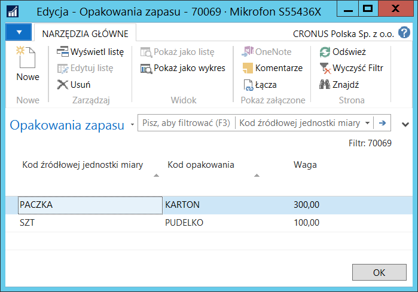

# Kalkulacja podatku od opakowań

## Informacje ogólne

Firmy sprzedające lub zużywające towary na rynku lokalnym
są zobowiązane do przygotowania deklaracji podatku od opakowań
na potrzeby kalkulacji opłaty produktowej. Polska Lokalizacja zawiera
narzędzia ułatwiające przygotowanie takiej deklaracji poprzez:

-   Zdefiniowanie listy **Opakowań**

-   Zbieranie danych o sprzedaży i zużyciu zapasów w powiązaniu
    ze zdefiniowaną listą opakowań

-   Kalkulacja i raportowanie podatku od opakowań dla wymienionych wyżej
    transakcji i zapasów

## Ustawienia

W celu zdefiniowania opakowań i przypisania im właściwych parametrów,
należy postępować według następujących kroków:

1.  Należy wybrać **Działy \> Zarządzanie Finansami \> Zapasy \>
    Opakowania.**

2.  W oknie **Opakowania**, które się otworzy, należy każdy rodzaj
    opakowania wprowadzić w nowym wierszu, wypełniając we właściwy
    sposób pola:

    -   **Kod –** w tym polu należy wprowadzić unikalny kod, jednoznacznie
        identyfikujący dany rodzaj opakowania.
    
    -   **Opis** – w tym polu należ wprowadzić opis opakowania zgodny
        z **Kodem**.
    
    -   **Stawka podatku (PLN)** – w tym polu należy wprowadzić stawkę
        podatku od opakowań wyrażoną w kwocie waluty lokalnej.
    
    -   **Rabat (%)** – w tym polu należy wprowadzić wysokość rabatu
        w podatku od opakowań, wyrażonego w procentach, przyznanego
        dla opakowań przyjaznych środowisku.
    
    -   **Zwolnienie (%)** – w tym polu należy wprowadzić wysokość
        zwolnienia od podatku, wyrażonego w procentach, które może być
        przyznane firmom mającym umowy recyklingu z firmami zajmującymi
        się gospodarowaniem odpadami.

  

W celu przypisania domyślnych opakowań do kartotek zapasów, należy
postępować według następujących kroków:

1.  W oknie kartoteki wybranego zapasu należy wybrać **Opakowania**.

2.  W oknie **Opakowania zapasu**, które się otworzy, należy wybrać
    **Nowe**. W nowym wierszu należy wprowadzić informację o opakowaniu
    stosowanym dla wybranej jednostki miary wybranego zapasu,
    wypełniając pola:

    -   **Kod jednostki miary zapasu** – z listy rozwijanej w tym polu
        należy wybrać jednostkę miary zdefiniowaną wcześniej dla zapasu,
        która będzie podstawą do kalkulacji podatku od opakowań.
    
    -   **Kod opakowania** – z listy rozwijanej w tym polu należy wybrać
        wcześniej zdefiniowany rodzaj opakowania używany do obrotu
        zapasami w jednostkach miary wybranej w poprzednim polu.
        Wypełnienie tego pola jest wyznacznikiem do skalkulowania podatku
        od opakowań.
    
    -   **Waga** – w tym polu należy wprowadzić wagę opakowania
        przypadającą na jedną jednostkę zapasu zgodną z wybraną w polu
        **Kod jednostki miary zapasu**.
    
  

## Obsługa

W celu wygenerowania raportu przedstawiającego kalkulację podatku
od opakowań, należy postępować według następujących kroków:

1.  Należy wybrać **Działy \> Zarządzanie Finansami \> Zapasy \>
    Kalkulacja podatku od opakowań**.

2.  W oknie wstępnym raportu, na karcie skróconej **Opcje**, w polu
    **Typ zapisu** należy wybrać jedną z dostępnych opcji: **Zakup**
    lub **Sprzedaż**, decydując w ten sposób czy podatek ma zostać
    skalkulowany dla opakowań w transakcjach zakupu,
    czy w transakcjach sprzedaży. Można też zaznaczyć pole **Drukuj
    szczegóły**, żeby w raporcie zostały wydrukowane szczegóły obrotu
    zapasów składające się na skalkulowaną kwotę podatku od opakowań.
    Niezaznaczenie tego pola spowoduje wyświetlenie kwoty podatku
    od opakowań sumarycznie dla każdego rodzaju opakowania. Na karcie
    skróconej **Zapas** można w standardowy sposób ustawić filtry,
    w celu ograniczenia danych wyświetlanych w raporcie:

  

3.  Należy wybrać **Drukuj** w celu wydrukowania zestawienia
    lub **Podgląd w**celu wyświetlenia zestawienia na ekranie:

  