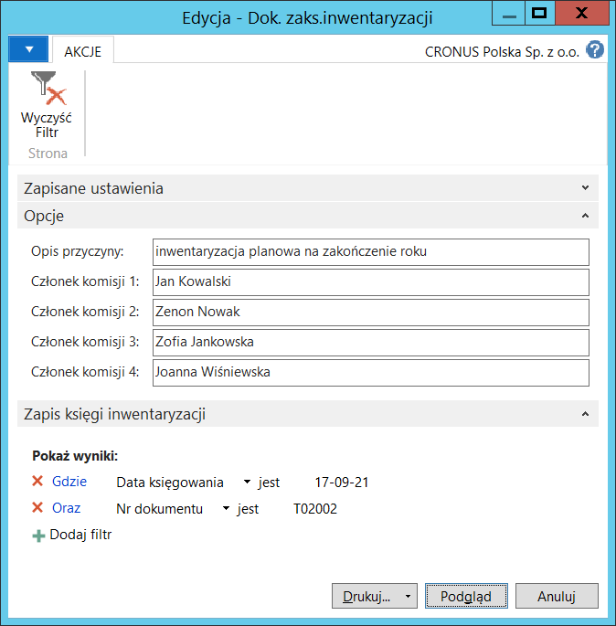

# Dokument inwentaryzacji

## Informacje ogólne

 Na koniec roku obrachunkowego użytkownicy dokonują fizycznego zliczenia zapasów w celu ich uzgodnienia ze stanem ilościowym i wartościowym zarejestrowanym w systemie. W ramach Polskiej Lokalizacji systemu Microsoft Dynamics 365 Business Central on‑premises został dodany raport Dokumentu inwentaryzacji, który może zostać zarchiwizowany przez dział księgowości jako potwierdzenie zakończenia procesu inwentaryzacji. Dokument inwentaryzacji zawiera zaksięgowane wartości i ilości zapasów magazynowych oraz nazwiska przedstawicieli firmy, którzy własnoręcznym podpisem potwierdzają, że ilości i kwoty wykazane w dokumencie są zgodne z rzeczywistym stanem magazynowym.

## Obsługa

W celu przygotowania i wydrukowania raportu **Dokument inwentaryzacji**,
należy postępować według następujących kroków:

1.  Należy wybrać **Działy \> Zarządzanie Finansami \> Zapasy \> Dok.
    zaks. inwentaryzacji**.

2.  W oknie wstępnym raportu, które się otworzy, należy na karcie
    skróconej **Zapis księgi inwentaryzacji** wypełnić pola filtrów:
    **Nr dokumentu** i **Data księgowania** w celu wskazania konkretnego
    dokumentu księgowania inwentaryzacji. W razie potrzeby można
    wypełnić inne pola w celu ograniczenia danych ujętych w raporcie.

    Na karcie skróconej **Opcje** należy uzupełnić pola:

    -   **Opis przyczyny** – w tym polu należy opisać powód przeprowadzenia
         inwentaryzacji
    
    -   **Członek komisji 1** – w tym polu należy wprowadzić imię
         i nazwisko pierwszego przedstawiciela firmy będącego członkiem
         komisji odpowiedzialnej za poprawne przeprowadzenie inwentaryzacji
    
    -   **Członek komisji 2** – w tym polu należy wprowadzić imię
         i nazwisko drugiego przedstawiciela firmy będącego członkiem
         komisji odpowiedzialnej za poprawne przeprowadzenie inwentaryzacji
    
    -   **Członek komisji 3** – w tym polu należy wprowadzić imię
         i nazwisko trzeciego przedstawiciela firmy będącego członkiem
         komisji odpowiedzialnej za poprawne przeprowadzenie inwentaryzacji
    
    -   **Członek komisji 4** – w tym polu należy wprowadzić imię
         i nazwisko czwartego przedstawiciela firmy będącego członkiem
         komisji odpowiedzialnej za poprawne przeprowadzenie
         inwentaryzacji.

  

3.  Po wprowadzeniu właściwych opcji i filtrów, należy wybrać **Drukuj**
    w celu wydrukowania raportu lub **Podgląd** w celu wyświetlenia
    raportu na ekranie:

  