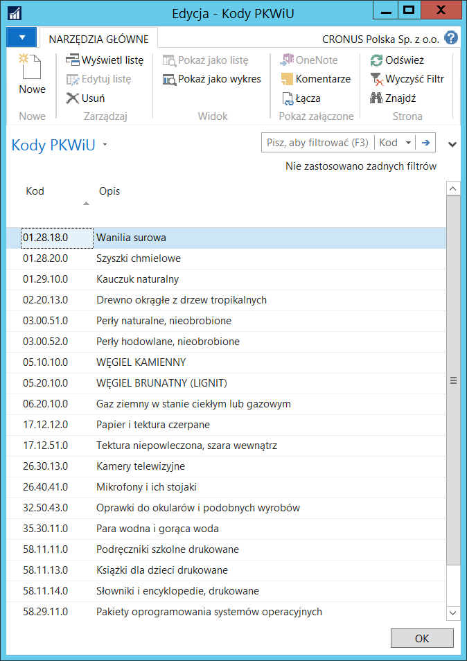
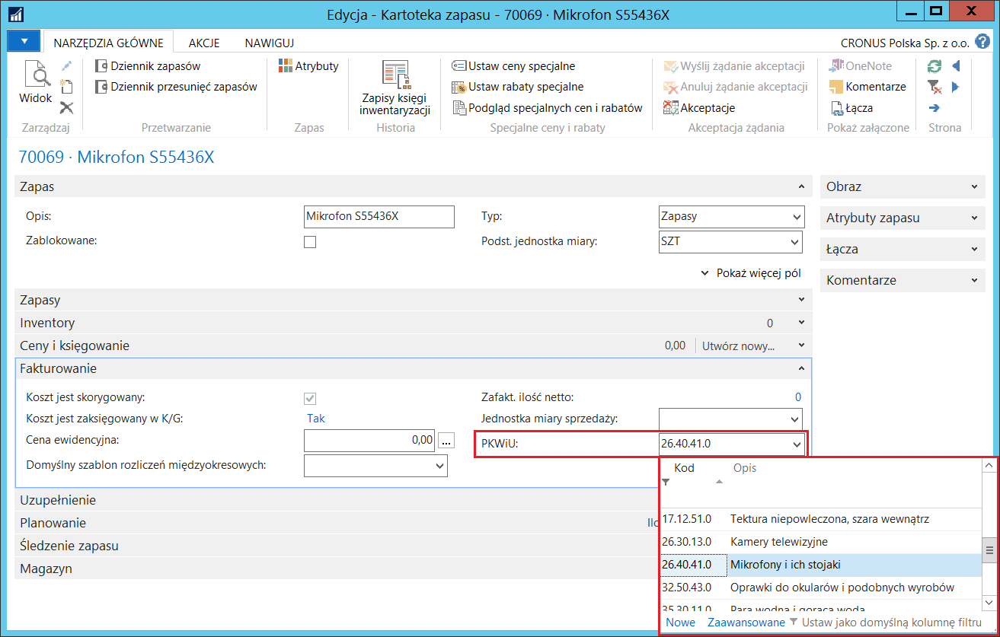
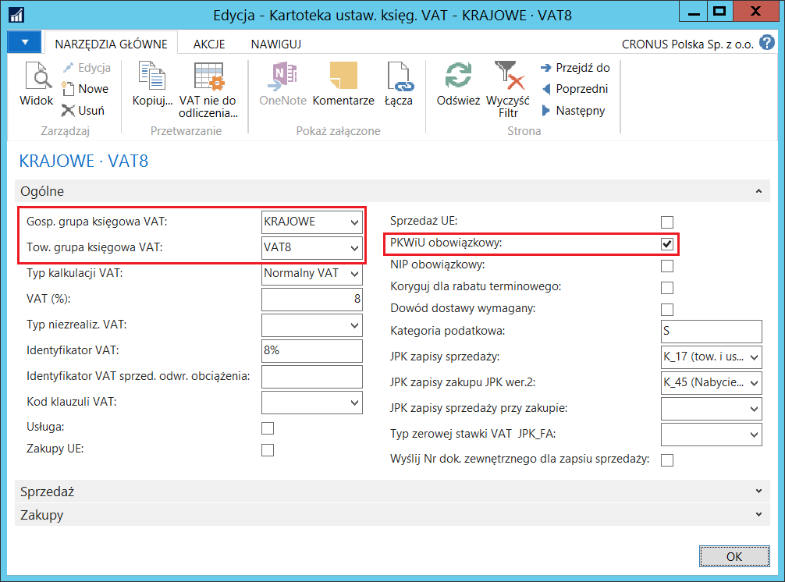
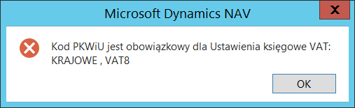
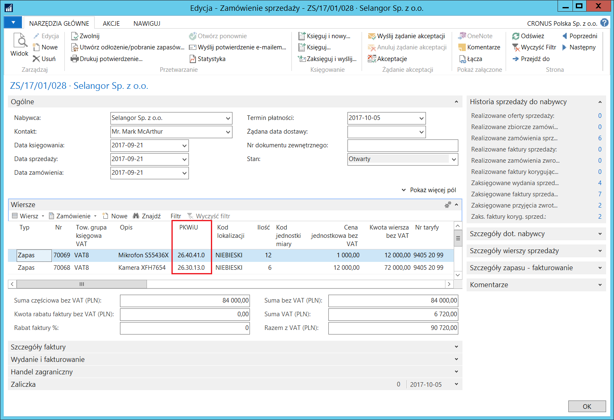
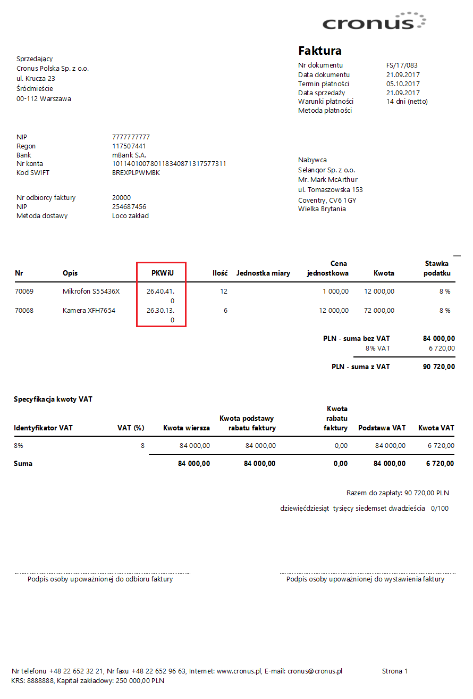

# Polska Klasyfikacja Wyrobów i Usług (PKWiU)

## Informacje ogólne

Polska Klasyfikacja Wyrobów i Usług przeznaczona jest do stosowania
w statystyce, ewidencji i dokumentacji oraz rachunkowości, a także
w sprawach podatkowych (w tym w sprawach podatku od towarów i usług
VAT), w urzędowych rejestrach czy w systemach informacyjnych
administracji publicznej. Od 1 stycznia 2016 obowiązuje klasyfikacja
PKWiU 2015.

Funkcjonalność PKWiU, będąca elementem Polskiej Lokalizacji, umożliwia
ewidencję transakcji zakupu i sprzedaży z właściwym dla danego towaru
kodem PKWiU. Kod ten, w razie potrzeby, jest drukowany na fakturach
sprzedaży.

## Ustawienia

W celu uniknięcia pomyłek przy wprowadzaniu kodów PKWiU w transakcjach,
należy najpierw zdefiniować słownik dopuszczalnych kodów PKWiU,
który będzie wykorzystywany w powiązanych z nim polach. W tym celu
należy postępować według następujących kroków:

1.  Należy wybrać **Działy \> Magazyn \> Administracja \> Kody PKWiU**.

2.  W oknie **Kody PKWiU** należy w kolejnych wierszach wprowadzić kody
    i stosowne opisy, zgodne z Polską Klasyfikacją Wyrobów i Usług:

  

W sytuacji, gdy w firmie występuje obrót towarami, dla których istnieje
obowiązek umieszczania informacji o PKWiU, do kartoteki zapasu można
przypisać domyślny kod PKWiU, który będzie kopiowany do dokumentów
zakupu i sprzedaży z tym zapasem. W tym celu należy postępować
według następujących kroków:

1.  Należy otworzyć kartotekę wybranego zapasu.

2.  Na karcie skróconej **Fakturowanie**, z listy rozwijanej w polu
    **PKWiU** należy wybrać właściwy kod PKWiU z wcześniej
    zdefiniowanego słownika:

  

Jako że dla wybranych stawek podatku VAT podawanie kodu PKWiU jest
obowiązkowe, konieczna jest kontrola jego wypełnienia, aby zapobiec
ewentualnemu zapomnieniu. W celu ustawienia reguł kontroli, należy
postępować według następujących kroków:

1.  Należy wybrać **Działy \> Zarządzanie Finansami \> Administracja \>
    Ustawienia księgowe VAT.**

2.  W oknie **Ustawienia księgowe VAT**, które się otworzy, należy
    zaznaczyć wiersz z wybraną kombinacją kodów w polach: **Gosp.
    grupa księgowa** **VAT** i **Tow. grupa księgowa VAT**,
    a następnie wybrać **Edycja**.

3.  W oknie **Kartoteka ustaw. księg. VAT**, które się otworzy,
    na karcie skróconej **Ogólne** należy zaznaczyć pole **PKWiU
    obowiązkowe**.

  

Próba zaksięgowania dokumentu sprzedaży bez uzupełnionego pola PKWiU
w wierszu, w którym występuje kombinacja kodów w polach: **Gosp. grupa
księgowa** **VAT** i **Tow. grupa księgowa VAT**, dla której zostało
zaznaczone pole **PKWiU obowiązkowe** skutkuje wyświetleniem komunikatu
o błędzie:

  

## Obsługa

Zasada umieszczania kodów na fakturze sprzedaży jest identyczna
w oknach: **Zamówienie sprzedaży i Faktura sprzedaży**, dlatego poniżej jako
przykład zostanie opisane **Zamówienie sprzedaży**.

W celu umieszczenia kodu PKWiU na fakturze sprzedaży, należy
postępować według następujących kroków:

1.  Należy wybrać **Działy \> Sprzedaż i Marketing \> Przetwarzanie
    zamówień \> Zamówienia sprzedaży.**

2.  W oknie, które się otworzy, należy wybrać **Nowe** i wprowadzić
    wszystkie dane standardowo.

3.  Na karcie skróconej **Wiersze** należy zwrócić uwagę na pole
    **PKWiU**.

    -   W wierszu, w którym w polu **Typ** wybrany jest **Zapas**, a w polu
        **Nr** wybrany jest zapas, do którego został przypisany domyślny
        kod PKWiU, pole **PKWiU** wypełnia się automatycznie. Możliwa jest
        zmiana wstawionego kodu PKWiU na inny, wybrany z listy wcześniej
        zdefiniowanych kodów, rozwijanej w polu **PKWiU**.
    
    -   W wierszu, w którym w polu **Typ** wybrane jest **Konto K/G**, a
        w polu **Nr** wybrane jest konto przychodów ze sprzedaży usług,
        to pole **PKWiU** pozostaje puste. Jeśli jest to wymagane, należy
        wstawić właściwy kod PKWiU z listy wcześniej zdefiniowanych kodów,
        rozwijanej w polu **PKWiU**.

  

4.  Z tak przygotowanego zamówienia można wystawić i wydrukować fakturę
    sprzedaży. W tym celu należy wybrać **Księguj i drukuj**. Na wydruku
    faktury sprzedaży umieszczona jest stosowna informacja o kodach
    PKWiU dla sprzedawanych wyrobów i usług.

  

>[!NOTE]
>Pole **PKWiU** jest dostępne w wierszach dokumentów:
**Zamówienie sprzedaży**, **Faktura sprzedaży**, **Zamówienie zwrotu
sprzedaży**, **Faktura korygująca sprzedaży** oraz na wydrukach:
**Faktury sprzedaży i Faktury korygującej sprzedaży**.