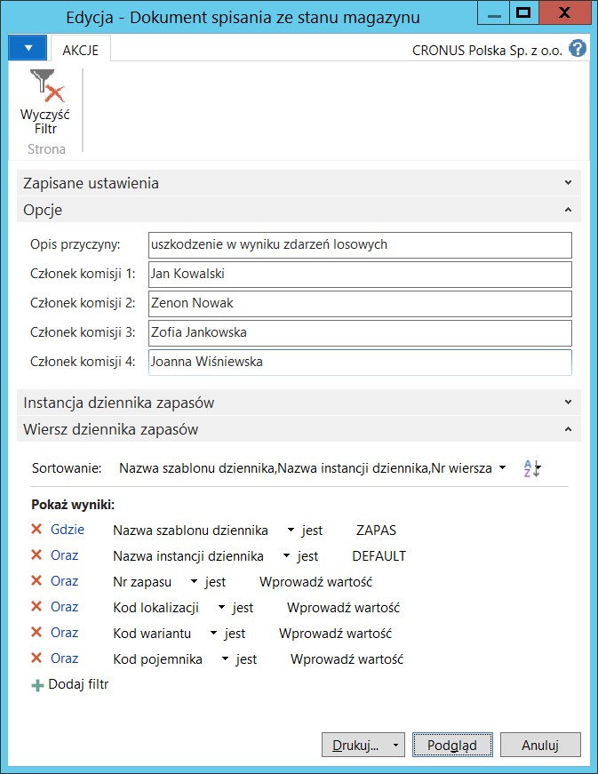

# Dokumenty operacji magazynowych

## Informacje ogólne

Do typowych operacji magazynowych realizowanych w systemie Microsoft
Dynamics 365 Business Central on‑premises należą: spisanie ze stanu
magazynu, przeszacowanie wartości i przesunięcie międzymagazynowe.
W standardowej wersji systemu Microsoft Dynamics 365 Business Central
on‑premises możliwe jest wydrukowanie dokumentu Przesunięcie zapasu
dostępnego w oknie Dzienniki przesunięć zapasów. W ramach Polskiej
Lokalizacji dodane zostały raporty dokumentujące operacje magazynowe:

-   **Dokument spisania ze stanu magazynu** – dostępny w oknie
     **Dzienniki zapasów** przed zaksięgowaniem operacji

-   **Zaksięgowany dokument spisania ze stanu magazynu** – dostępny
     w raportach modułu **Zarządzanie Finansami** po zaksięgowaniu
     operacji

-   **Dokument przeszacowania zapasów** – dostępny w oknie **Dzienniki
     przeszacowań** przed zaksięgowaniem operacji.

## Obsługa

W celu przygotowania i wydrukowania raportu **Dokument spisania ze stanu
magazynu**, należy postępować według następujących kroków:

1.  Należy wybrać **Działy \> Magazyn \> Zapasy \> Dzienniki zapasów**.

2.  W sposób standardowy należy wprowadzić wiersze wybranego dziennika
    przeznaczone do zaksięgowania operacji spisania zapasu ze stanu
    magazynowego.

3.  Należy wybrać **Dokument spisania ze stanu**.

4.  W oknie wstępnym raportu, które się otworzy, na kartach skróconych
    **Instancja dziennika zapasów i Wiersz dziennika zapasów** system
    automatycznie uzupełnia niektóre pola filtrów. W razie potrzeby
    można wypełnić inne pola w celu ograniczenia danych ujętych
    w raporcie.

    Na karcie skróconej **Opcje** należy uzupełnić pola:

    -   **Opis przyczyny** – w tym polu należy opisać powód spisania zapasu
        ze stanu magazynowego
    
    -   **Członek komisji 1** – w tym polu należy wprowadzić imię
        i nazwisko pierwszego przedstawiciela firmy będącego członkiem
        komisji odpowiedzialnej za spisanie zapasu ze stanu magazynowego
    
    -   **Członek komisji 2** – w tym polu należy wprowadzić imię
        i nazwisko drugiego przedstawiciela firmy będącego członkiem
        komisji odpowiedzialnej za spisanie zapasu ze stanu magazynowego
    
    -   **Członek komisji 3** – w tym polu należy wprowadzić imię
        i nazwisko trzeciego przedstawiciela firmy będącego członkiem
        komisji odpowiedzialnej za spisanie zapasu ze stanu magazynowego
    
    -   **Członek komisji 4** – w tym polu należy wprowadzić imię
        i nazwisko czwartego przedstawiciela firmy będącego członkiem
        komisji odpowiedzialnej za spisanie zapasu ze stanu magazynowego.

  

5.  Po wprowadzeniu właściwych opcji i filtrów, należy wybrać **Drukuj**
    w celu wydrukowania raportu lub **Podgląd** w celu wyświetlenia
    raportu na ekranie:

  

W celu przygotowania i wydrukowania raportu **Zaksięgowany dokument
spisania ze stanu magazynu**, należy postępować według następujących
kroków:

1.  Należy wybrać **Działy \> Zarządzanie Finansami \> Zapasy \>
    Zaksięg. dokument spisania ze stanu magazynu**.

2.  W oknie wstępnym raportu, które się otworzy, na karcie skróconej
    **Zapis księgi zapasów** należy wypełnić pola filtrów: **Nr
    dokumentu** i (ewentualnie) **Data księgowania** w celu wskazania
    konkretnego dokumentu księgowania spisania zapasu ze stanu magazynu.
    W razie potrzeby można wypełnić inne pola w celu ograniczenia danych
    ujętych w raporcie.

    Na karcie skróconej **Opcje** należy uzupełnić pola:

    -   **Opis przyczyny** – w tym polu należy opisać powód spisania zapasu
        ze stanu magazynowego
    
    -   **Członek komisji 1** – w tym polu należy wprowadzić imię
        i nazwisko pierwszego przedstawiciela firmy będącego członkiem
        komisji odpowiedzialnej za spisanie zapasu ze stanu magazynowego
    
    -   **Członek komisji 2** – w tym polu należy wprowadzić imię
        i nazwisko drugiego przedstawiciela firmy będącego członkiem
        komisji odpowiedzialnej za spisanie zapasu ze stanu magazynowego
    
    -   **Członek komisji 3** – w tym polu należy wprowadzić imię
        i nazwisko trzeciego przedstawiciela firmy będącego członkiem
        komisji odpowiedzialnej za spisanie zapasu ze stanu magazynowego
    
    -   **Członek komisji 4** – w tym polu należy wprowadzić imię
        i nazwisko czwartego przedstawiciela firmy będącego członkiem
        komisji odpowiedzialnej za spisanie zapasu ze stanu magazynowego.
    
  

3.  Po wprowadzeniu właściwych opcji i filtrów, należy wybrać **Drukuj**
    w celu wydrukowania raportu lub **Podgląd** w celu wyświetlenia
    raportu na ekranie:

  

 >[!NOTE]
 >Wartości zapasów spisanych ze stanu magazynu mogą się
 różnić na raportach: **Dokument spisania ze stanu magazynu**
 i **Zaksięgowany dokument spisania ze stanu magazynu,** jeżeli
 w czasie pomiędzy drukowaniem raportów został uruchomiony skrypt:
 **Koryguj koszt – zapisy zapasów**.

W celu przygotowania i wydrukowania raportu **Dokument przeszacowania
zapasów**, należy postępować według następujących kroków:

1.  Należy wybrać **Działy \> Magazyn \> Zapasy \> Dzienniki
    przeszacowań**.

2.  W sposób standardowy należy wprowadzić wiersze wybranego dziennika
    przeznaczone do zaksięgowania operacji przeszacowania wartości
    wybranego zapasu.

3.  Należy wybrać **Dokument przeszacowania**.

4.  W oknie wstępnym raportu, które się otworzy, na kartach skróconych
    **Instancja dziennika zapasów i Wiersz dziennika zapasów** system
    automatycznie uzupełnia niektóre pola filtrów. W razie potrzeby
    można wypełnić inne pola w celu ograniczenia danych ujętych
    w raporcie.

    Na karcie skróconej **Opcje** należy uzupełnić pola:

    -   **Opis przyczyny** – w tym polu należy opisać powód przeszacowania
        wartości zapasów
    
    -   **Członek komisji 1** – w tym polu należy wprowadzić imię
        i nazwisko pierwszego przedstawiciela firmy będącego członkiem
        komisji odpowiedzialnej za przeszacowanie wartości zapasów
    
    -   **Członek komisji 2** – w tym polu należy wprowadzić imię
        i nazwisko drugiego przedstawiciela firmy będącego członkiem
        komisji odpowiedzialnej za przeszacowanie wartości zapasów
    
    -   **Członek komisji 3** – w tym polu należy wprowadzić imię
        i nazwisko trzeciego przedstawiciela firmy będącego członkiem
        komisji odpowiedzialnej za przeszacowanie wartości zapasów
    
    -   **Członek komisji 4** – w tym polu należy wprowadzić imię
        i nazwisko czwartego przedstawiciela firmy będącego członkiem
        komisji odpowiedzialnej za przeszacowanie wartości zapasów.
    
  

5.  Po wprowadzeniu właściwych opcji i filtrów, należy wybrać **Drukuj**
    w celu wydrukowania raportu lub **Podgląd** w celu wyświetlenia
    raportu na ekranie:

  