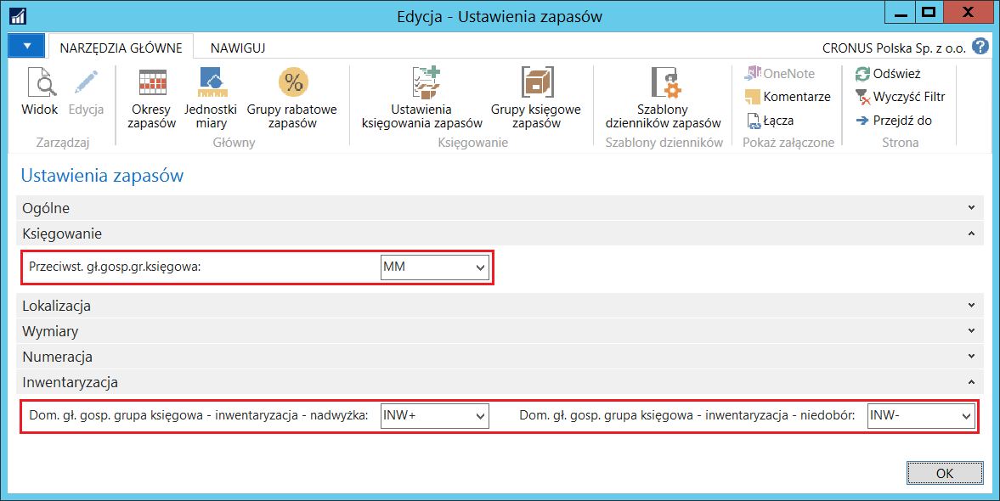
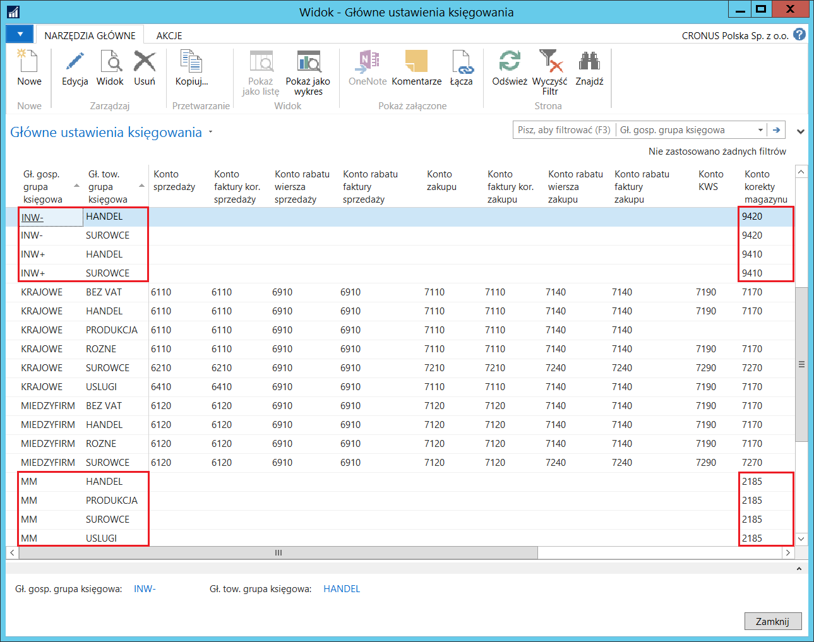
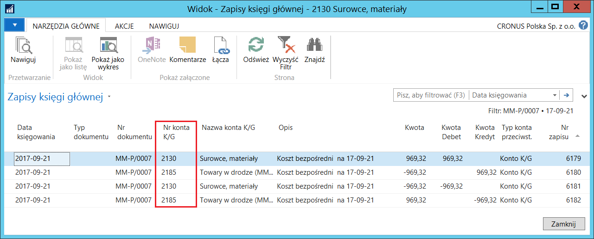
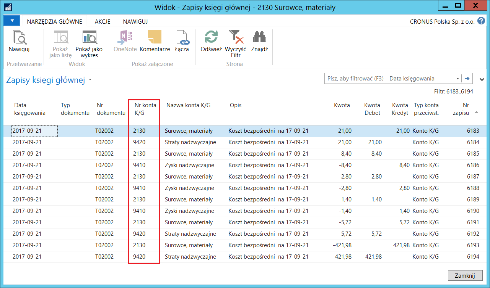

# Obsługa gł. gospodarczej grupy księgowej w operacjach magazynowych 

## Informacje ogólne

W standardowej wersji systemu Microsoft Dynamics 365 Business Central
on‑premises **Zlecenia przesunięcia, Zlecenia produkcyjne i Zlecenia
kompletacji** księgowane są domyślnie według ustawień zdefiniowanych
w oknie **Główne ustawienia księgowania**, w wierszach z pustym polem
**Gł. gosp. grupa księgowa**. Polska Lokalizacja umożliwia wybór kodu
**Gł. gosp. grupy księgowej** w kartotece **Zlecenia przesunięcia,
Zlecenia produkcyjnego i Zlecenia kompletacji**. Możliwe jest również
zdefiniowanie domyślnego kodu **Gł. gosp. grupy księgowej**. Poniżej
opisane jest zastosowanie kodu **Gł. gosp. grupy księgowej**
w zleceniach przesunięcia. Kody **Gł. gosp. grup księgowych** mają
analogiczne zastosowanie w zleceniach produkcyjnych i zleceniach
kompletacji.

W dziennikach inwentaryzacji standardowo jest możliwość ręcznego wyboru
kodu **Gł. gosp. grupy księgowej w **celu pośredniego określenia kont
do zaksięgowania wartości niedoborów i nadwyżek. Polska Lokalizacja
umożliwia zdefiniowanie domyślnych kodów **Gł. gosp. grupy księgowej**
dla nadwyżek i niedoborów wynikających z inwentaryzacji.

## Ustawienia

Aby zdefiniować domyślne kody Gł. gosp. grupy księgowej dla zleceń przesunięcia oraz niedoborów i nadwyżek inwentaryzacyjnych, należy postępować według następujących kroków:

1.  Należy wybrać **Działy \> Magazyn \> Administracja \> Ustawienia
    zapasów**.

2.  W oknie **Ustawienia zapasów**, które się otworzy, na karcie
    skróconej **Księgowanie** należy z listy rozwijanej w polu
    **Przeciwst. gł.gosp.gr.księgowa** wybrać kod **Gł. gosp. grupy
    księgowej**, której ustawienia zdefiniowane w oknie **Główne
    ustawienia księgowania** będą obowiązywały podczas księgowania
    transakcji wydań/przyjęć zapasów w ramach **Zleceń przesunięcia**.

3.  Na karcie skróconej **Inwentaryzacja** należy z listy rozwijanej
    w polu **Dom. gł. gosp. grupa księgowa – inwentaryzacja –
    nadwyżka** wybrać kod **Gł. gosp. grupy księgowej**, której
    ustawienia zdefiniowane w oknie **Główne ustawienia księgowania**
    będą obowiązywały podczas księgowania zapisów typu **Korekta
    in-plus** w dzienniku inwentaryzacji, a w polu **Dom. gł. gosp.
    grupa księgowa – inwentaryzacja – niedobór** należy wybrać kod
    **Gł. gosp. grupy księgowej**, której ustawienia zdefiniowane
    w oknie **Główne ustawienia księgowania** będą obowiązywały
    podczas księgowania zapisów typu **Korekta in-minus** w dzienniku
    inwentaryzacji.

  

  

## Obsługa

W celu utworzenia zlecenia przesunięcia z wykorzystaniem **Gł. gosp. grupy księgowej**, należy postępować według następujących kroków:

1.  Należy wybrać **Działy \> Magazyn \> Planowanie i wykonywanie \>
    Zlecenia przesunięcia**.

2.  W oknie **Zlecenia przesunięcia**, które się otworzy, należy wybrać
    **Nowe**.

3.  W kartotece nowego zlecenia przesunięcia, po nadaniu numeru, system
    automatycznie uzupełni pole **Gł. gosp. grupa księgowa** kodem
    wybranym w polu **Przeciwst. gł.gosp.gr.księgowa** w oknie
    **Ustawienia zapasów**. W razie potrzeby, kod wstawiony domyślnie
    może zostać ręcznie zmieniony:

  

4.  Należy zaksięgować wydanie i przyjęcie.

Efekt księgowania można obejrzeć nawigując zaksięgowane dokumenty. W tym
celu, należy postępować według następujących kroków:

1.  Należy wybrać **Działy \> Magazyn \> Archiwum \> Zaksięgowane
    dokumenty \> Zaks. wydania przesunięcia.**

2.  W oknie **Zaks. wydania przesunięcia**, które się otworzy, należy
    zaznaczyć wybrany wiersz i wybrać **Nawiguj**.

3.  W oknie **Nawigacja** należy zaznaczyć tabelę **Zapis K/G** i wybrać
    **Pokaż powiązane zapisy**.

  

4.  Należy wybrać **Działy \> Magazyn \> Archiwum \> Zaksięgowane
    dokumenty \> Zaks. przyjęcia przesunięcia.**

5.  W oknie **Zaks. przyjęcia przesunięcia**, które się otworzy, należy
    zaznaczyć wybrany wiersz i wybrać **Nawiguj**.

6.  W oknie **Nawigacja** należy zaznaczyć tabelę **Zapis K/G** i wybrać
    **Pokaż powiązane zapisy**.

  

W celu użycia **Gł. gosp. grupy księgowej** w dzienniku inwentaryzacji, należy postępować według następujących kroków:

1.  Należy wybrać **Działy \> Magazyn \> Zapasy \> Dzienniki
    inwentaryzacji**.

2.  W oknie **Dziennik inwentaryzacji**, które się otworzy, należy
    wybrać akcję **Oblicz ilość zapasów**.

3.  W wierszach dziennika system automatycznie uzupełni pole **Gł. gosp.
    grupa księgowa** kodem wybranym w polu **Dom. gł. gosp. grupa
    księgowa – inwentaryzacja – nadwyżka** w oknie **Ustawienia
    zapasów**. Po wypełnieniu pola **Ilość (inwentaryzacja)** system
    automatycznie rozpoznaje czy jest to nadwyżka, czy niedobór
    i automatycznie zmienia kod w polu **Gł. gosp. grupa księgowa**
    zgodnie z kodem wybranym w polach **Dom. gł. gosp. grupa księgowa
    – inwentaryzacja – nadwyżka** i **Dom. gł. gosp. grupa księgowa
    – inwentaryzacja – niedobór** w oknie **Ustawienia zapasów**:

  

4.  Należy zaksięgować dziennik inwentaryzacji.

Efekt księgowania można obejrzeć w zapisach księgowych. W tym celu,
należy postępować według następujących kroków:

1.  Należy wybrać **Działy \> Zarządzanie Finansami \> Archiwum \>
    Rejestry K/G.**

2.  W oknie **Rejestry K/G**, które się otworzy, należy zaznaczyć wiersz
    z ostatnim rejestrem i na wstążce należy kliknąć przycisk **Księga
    główna**.

  