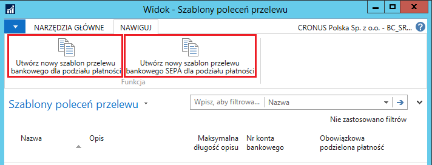
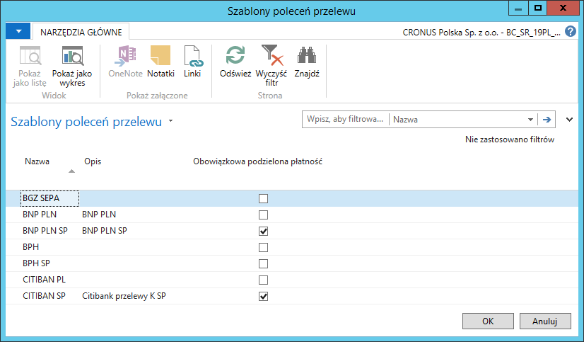
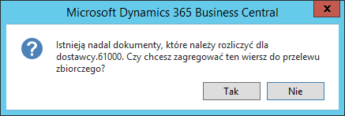
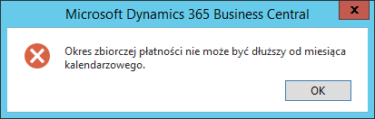
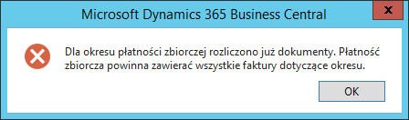
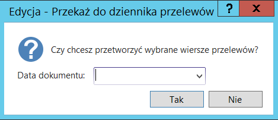
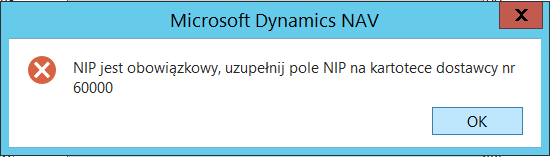
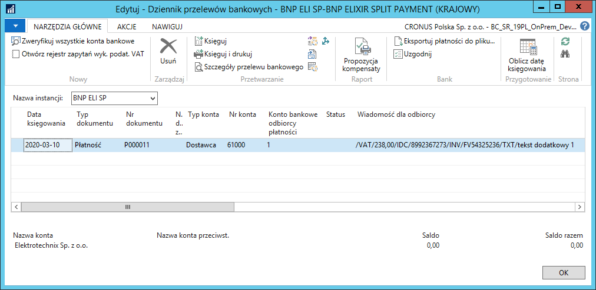
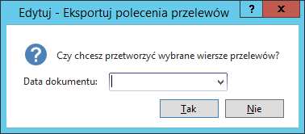

# Generowanie przelewów

## Ustawienia

### Szablony przelewów

Każde konto bankowe, z którego będą wykonywane przelewy w mechanizmie
podzielonej płatności, w związku ze zmianą struktury pliku, musi mieć
utworzony nowy szablon przelewów. Nowy szablon wymaga oznaczenia w polu
**Obowiązkowa podzielona płatność**, przypisania nowej **Metody
płatności** (SPLIT, lub SEPA SPLIT), utworzenia i przypisania nowej
**Instancji dziennika głównego** dla tego rodzaju przelewów.

W celu zdefiniowania nowego szablonu poleceń przelewów, należy wykonać
następujące kroki:

1.  Należy wybrać **Działy \> Zarządzanie Finansami \> Bankowość
    elektroniczna \> Szablony poleceń przelewu**.

2.  W oknie **Szablony poleceń przelewu**, które się otworzy, na wstążce
     należy wybrać **Nowe**.

3.  W oknie **Kartoteka szablonu poleceń przelewów**, które się otworzy,
     należy wprowadzić parametry identyczne, jak w dotychczasowym
     szablonie i uzupełnić ustawienia charakterystyczne dla mechanizmu
     podzielonej płatności w polach:

    -   **Kod metody płatności** – należy wybrać kod **SPLIT** lub **SEPA
         SPLIT**,
    
    -   **Obowiązkowa podzielona płatność** – należy zaznaczyć pole,
    
    -   **Nazwa instancji dziennika głównego** – należy wybrać dedykowaną
         instancję dziennika głównego.

  

Przygotowane zostały funkcje, które na bazie istniejącego szablonu
polecenia przelewu tworzą jego kopię z właściwymi ustawieniami dla
mechanizmu podzielonej płatności.

Aby utworzyć kopię szablonu z ustawieniami dla mechanizmu podzielonej
płatności, należy wykonać następujące kroki:

1.  W oknie **Szablony poleceń przelewu** należy zaznaczyć wiersz z
    wybranym podstawowym szablonem, następnie na wstążce należy kliknąć:

    **Utwórz nowy szablon przelewu bankowego dla podziału płatności**

    (dla szablonu zwykłego)

    lub

    **Utwórz nowy szablon przelewu bankowego SEPA dla podziału płatności**

    (dla struktury SEPA krajowej PLN)
    
Funkcja tworzy nowy szablon, w którym:

-   w nazwie i opisie dodawane są litery SP (skrót od ang. Split
    Payment),

-   tworzona i przypisywana jest nowa metoda płatności,

-   tworzona i przypisana jest nowa instancja dziennika głównego.

>[!NOTE]
>Funkcje: **Utwórz nowy szablon przelewu bankowego dla
podziału płatności** i **Utwórz nowy szablon przelewu bankowego SEPA dla
podziału płatności** mogą być użyte tylko dla istniejącego, prawidłowo
ustawionego szablonu dla konta bankowego w walucie PLN.

  

Bazując na takim szablonie można rozpocząć przygotowywanie przelewów
w nowym formacie.

### Definicje schematów wymiany danych

Ustawienia definicji schematów wymiany danych są ustawieniami
zaawansowanymi i przygotowywane są jako predefiniowane i zaimportowane
do systemu lub przygotowywane i korygowane podczas implementacji zmian
w module bankowości elektronicznej.

Informacyjnie, dla każdej **Definicji schematu wymiany danych**
konieczne jest zdefiniowanie nowych ustawień dla metody płatności
**SPLIT** (lub **SEPA SPLIT**), które wykorzystywane są przy generowaniu
właściwej struktury pliku przelewu

  

### Zmiany w Arkuszu płatności do dostawców/nabywców

Wprowadzanie przelewów odbywa się w oknach **Arkusz płatności do dostawców** i **Arkusz płatności do nabywców**, które następnie przenoszone są do dziennika przelewów bankowych, skąd mogą być wyeksportowane do systemu bankowego. Informacje o nich przenoszone są również do zapisów w rejestrach przelewów. 

**Arkusz płatności do dostawców/nabywców** dla wybranego Szablonu przelewu
oznaczonego jako **Obowiązkowa podzielona płatność** został rozszerzony
o dodatkowe pola i ma poniższą strukturę:

  

W poniższym zestawieniu wymienione są nowe pola, widoczne tylko dla
szablonu z obowiązkową podzieloną płatnością:

|**Nazwa**|**Wypełnienie**|**Uwagi**|
|--------|---------|-------|
|**Opis przelewu bankowego**|• opcjonalne|pole do wprowadzenia dodatkowego, opcjonalnego opisu przelewu (max. 33 znaki)|
|**Kwota VAT polecenia przelewu (PLN)**|\^ obowiązkowe|kwota VAT stanowiąca część kwoty przelewu, która będzie zapłacona w mechanizmie podzielonej płatności; kwota musi być większa od zera i nie może być większa od kwoty przelewu|
|**Kwota VAT polecenia przelewu (dziennik)**|○ automatyczne|zsumowana kwota VAT wszystkich przelewów dotyczących danego zapisu, znajdujących się w różnych dziennikach|
|**Kwota VAT polecenia przelewu (zapisy)**|○ automatyczne|zsumowana kwota VAT wszystkich przelewów dotyczących danego zapisu, które zostały już wyeksportowane|

W sytuacji, gdy w ewidencji dokumentów zakupu i sprzedaży wykorzystywany
jest moduł *Split Payment Dokumenty*, zapisy księgi dostawcy wyświetlone
w **Arkuszu płatności do dostawców** będą miały zaznaczone pole
**Obowiązkowa podzielona płatność** lub można takie zapisy oznaczyć
ręcznie.

W oknie **Arkusz płatności do dostawców** dodane zostało pole
informacji, w którym dla każdego zapisu podawane są kwoty pozostałe dla
płatności i dla podatku VAT (obliczonego z dokumentu źródłowego). Kwoty
te są sugerowane podczas użycia akcji **Przypisz kwotę polecenia
przelewu**. Jeżeli dokument nie zostanie odnaleziony (np. księgowany z
dziennika), wówczas **Kwotę przelewu VAT** należy wpisać ręcznie.

  

>[!NOTE]
>Analogiczne informacje znajdują się w oknie **Arkusz
płatności do nabywców**.

## Obsługa

**Przygotowanie płatności do przelewu**

Moduł **Bankowość elektroniczna** umożliwia automatyczne tworzenie
przelewów dla dostawców lub nabywców. Do automatycznego tworzenia
przelewów służą funkcje znajdujące się w oknach **Arkusz płatności
do dostawców** i **Arkusz płatności do nabywców**.

>[!NOTE]
>Opis generowania przelewów w dalszej części tego rozdziału
bazuje na  **Arkuszu płatności do dostawców.** *Mechanizm generowania
przelewów z Arkusza płatności do nabywców jest identyczny, jak opisany
na przykładzie Arkusza płatności do dostawców, więc należy się na nim
wzorować.*

Wybranie z menu **Arkusza płatności do dostawców** lub **Arkusza
płatności do nabywców**, gdy zdefiniowanych jest klika szablonów poleceń
przelewu, spowoduje wyświetlenie pełnej listy dostępnych szablonów.
Gdy jest tylko jeden szablon, automatycznie otworzy się odpowiednia
strona. Brak szablonów sygnalizowany jest odpowiednim komunikatem.

W przypadku przelewów z mechanizmem podzielonej płatności, z listy
szablonów należy wybierać tylko te, które mają zaznaczone pole
**Obowiązkowa podzielona płatność**.

  

Po wybraniu szablonu wyświetlona zostanie lista zapisów księgi
dostawców/nabywców, wyfiltrowana według waluty konta bankowego
zdefiniowanego w szablonie polecenia przelewu. W przypadku zaznaczenia
opcji **Dozwolona inna waluta przelewu** w szablonie polecenia przelewu,
filtr ten nie jest stosowany.

W przypadku wypełnienia pola **Kod konta bank. dostawcy** są trzy
możliwości:

-   gdy konto bankowe dostawcy zostało wcześniej wybrane z listy,
     wpisanie wartości w polu **Kwota polecenia przelewu** niczego nie
     zmienia,

-   gdy pole **Kod konta bank. dostawcy** nie jest wypełnione, wpisanie
     wartości w polu **Kwota polecenia przelewu** powoduje wybranie
     domyślnego konta bankowego dostawcy,

-   gdy żadne konto bankowe dostawcy nie zostało oznaczone jako
     domyślne, pojawi się błąd i wymagane będzie ręczne uzupełnienie
     pola **Kod konta bank. dostawcy**.

W **Arkuszu płatności do dostawców** wystarczy uzupełnić pola **Kwota
polecenia przelewu i Kwota VAT polecenia przelewu (PLN)**. Istnieją trzy
sposoby uzupełnienia pola **Kwota polecenia przelewu**:

1.  Ręczne wprowadzanie kwoty

Użytkownik może ręcznie wpisać kwotę w polach **Kwota polecenia
przelewu**\
i **Kwota VAT polecenia przelewu (PLN)**. Zostaną one zweryfikowane pod
kątem poprawności:

-   wpisanie kwoty większej od **Kwoty pozostałej** spowoduje błąd,

-   wpisanie kwoty większej od **Kwoty pozostałej** pomniejszonej o już
     zdefiniowane lub wyeksportowane przelewy wywoła komunikat
     z informacją o błędzie. Od decyzji użytkownika zależeć będzie, czy
     dana kwota zostanie przypisana, czy też nie,

-   wpisanie **Kwoty VAT polecenia przelewu (PLN)** większej niż **Kwota
     polecenia przelewu** spowoduje błąd,

-   niewpisanie **Kwoty VAT polecenia przelewu (PLN)** spowoduje, że
     dany przelew nie zostanie utworzony w tym szablonie, należy go
     utworzyć w szablonie dla normalnego przelewu.

2.  Automatyczne wprowadzanie kwoty

Przypisana zostanie kwota równa **Kwocie pozostałej** pomniejszonej
o już zdefiniowane lub wyeksportowane przelewy, także **Kwota VAT
polecenia przelewu (PLN)** zostanie odpowiednio uzupełniona. Można
to uczynić zarówno dla jednego, jak i wielu wierszy, przy użyciu funkcji
**Przypisz kwotę polecenia przelewu (można też nacisnąć F9)**. Pola
**Szablon przelewu i Metoda płatności** zostaną wypełnione
automatycznie, zgodnie z parametrami przypisanymi do wybranego szablonu.

  

Do 30.10.2019 nie było możliwości grupowania przelewów dla mechanizmu
podzielonej płatności, jeden przelew odpowiadał jednej fakturze. Od
1.11.2019 możliwa jest zapłata zbiorcza z wykorzystaniem mechanizmu
podzielonej płatności, gdy spełnione są odpowiednie warunki, czyli
przelew dotyczy zobowiązań z tytułu wszystkich faktur od danego dostawcy
za wybrany okres (nie dłuższy niż miesiąc), wówczas w opisie zamiast
numeru faktury podawany jest okres*.* W przypadku zapłaty zaliczki, w
polu numer faktury podawany jest tekst „zaliczka".

Podczas przypisywania kwoty przelewu, w przypadku wybrania pierwszego
zapisu dostawcy, który ma więcej otwartych zobowiązań, zostanie
wyświetlony komunikat.

  

Po kliknięciu **Tak** – zapis zostanie oznaczony jako **Zapisy do
agregacji** i zostanie wyświetlony komunikat informacyjny.

  

Po kliknięciu **Nie** – dla danej faktury utworzony zostanie pojedynczy
przelew.

W przypadku wybrania kolejnego zapisu do przelewu dla tego samego
dostawcy, otrzymamy komunikat z pytaniem.

  

Po kliknięciu **Tak** system sprawdzi, czy okres pomiędzy najstarszą i
najnowszą fakturą nie jest dłuższy niż miesiąc, czy w tym okresie nie
było już innych rozliczonych faktur oraz poda informację, jeżeli są
jeszcze inne faktury w tym okresie do rozliczenia. Jeżeli warunki będą
spełnione, zapisy zostaną oznaczone jako **Zapisy do agregacji**.

Po kliknięciu **Nie** – dla danej faktury utworzony zostanie pojedynczy
przelew.

  

  

Nie są też dozwolone częściowe zapłaty.

  

W przygotowanym przelewie dla kilku faktur w opisie przelewu zamiast
numeru faktury pojawi się okres jako np. 01.11.2019 do 15.11.2019 lub
pojedyncza data w przypadku zapłaty kilku faktur z tą samą datą
wystawienia.

**Przelew dotyczący zaliczki**

W przypadku płatności z tytułu zaliczki, należy w oknie **Arkusz
płatności do dostawców** zaznaczyć pole **Zaliczka** w wierszu z
wybranym zapisem księgi dostawcy. W opisie przelewu, zamiast numeru
faktury, pojawi się wyraz „zaliczka".

  

**Przekazanie przelewów do dziennika przelewów**

Po uzupełnieniu danych w wybranych wierszach **Arkusza płatności
do dostawców** można przekazać je do **Dziennika przelewów**. W tym
celu, w oknie **Arkusz płatności do dostawców**, należy na wstążce
kliknąć **Wyślij do dziennika przelewów**.

  

Pojawi się komunikat z pytaniem, z jaką datą utworzyć przelewy.

  

System utworzy przelewy, a efekt można będzie zobaczyć w odpowiednim
**Dzienniku przelewów**. Najprostszym sposobem przejścia do **Dziennika
przelewów** jest kliknięcie akcji **Dziennik płatności** na wstążce w
oknie **Arkusz płatności do dostawców**.

Podczas tworzenia przelewów sprawdzane są wymagane pola, m.in. NIP
dostawcy (nabywcy). Wartość jest pobierana z kartoteki dostawcy
(nabywcy) i w przypadku poniższego komunikatu wystarczy uzupełnić NIP w
kartotece dostawcy (nabywcy):

  

W oknie **Dziennik przelewów bankowych**, najważniejszą informacją\
dla mechanizmu podzielonej płatności jest zawartość pola **Wiadomość
dla odbiorcy** wysyłana jako tytuł przelewu. Musi ona zawierać kwotę
VAT, NIP i numer faktury w odpowiedniej strukturze:

**/VAT/10n,2n / IDC/14x / INV/35x / TXT/33x**

gdzie: **n**- liczba naturalna, **x** – dowolny znak, **VAT** – kwota
VAT, **IDC** - NIP dostawcy, **INV** -numer jednej faktury, **TXT** –
dowolny tekst o długości 33 znaków

Pole to nie jest edytowalne, w przypadku błędnych danych należy wiersz
usunąć\
i wygenerować ponownie przelew.

  

### Wyeksportowanie płatności do pliku

**Wariant 1**

W oknie **Dziennik przelewów bankowych**, po sprawdzeniu wierszy, należy
na wstążce kliknąć **Eksportuj płatności do pliku**.

  

W wyświetlonym oknie **Eksportuj plik** należy kliknąć przycisk
**Zapisz** i wybrać katalog, w którym zostanie zapisany plik. Następnie
plik należy przekazać do banku.

  

**Wariant 2**

W oknie **Arkusz płatności do dostawców** można bezpośrednio
wyeksportować plik płatności pomijając krok sprawdzania w **Dzienniku
przelewów bankowych**. W tym celu, w oknie **Arkusz płatności do
dostawców**, należy na wstążce kliknąć **Eksportuj przelewy do pliku.**

  

Zostanie wyświetlony komunikat z pytaniem, z jaką datą utworzyć przelew:

  

System przygotuje przelewy, a następnie wyświetli okno **Eksportuj
plik**. W wyświetlonym oknie **Eksportuj plik** należy kliknąć przycisk
**Zapisz** i wybrać katalog, w którym zostanie zapisany plik. Następnie
plik należy przekazać do banku.

  

**Rejestry przelewów**

Wyeksportowane przelewy są przechowywane w rejestrach. W oknie rejestrów
przelewy można wyświetlać na ekranie, ponownie wyeksportować plik
lub podejrzeć szczegóły przelewu.

Rejestry zostały rozszerzone o **Kwotę VAT przelewu**, również ta kwota
jest zapisywana aktualnie w rejestrach.