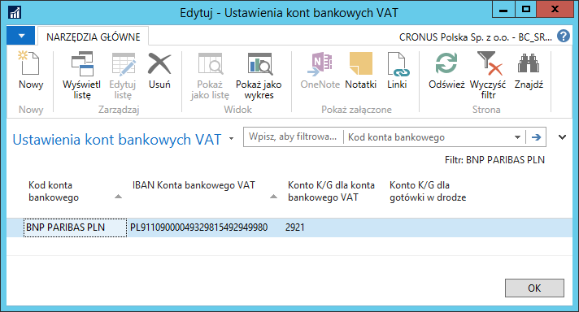
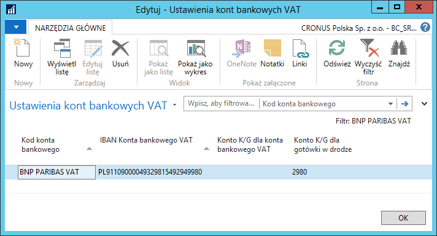
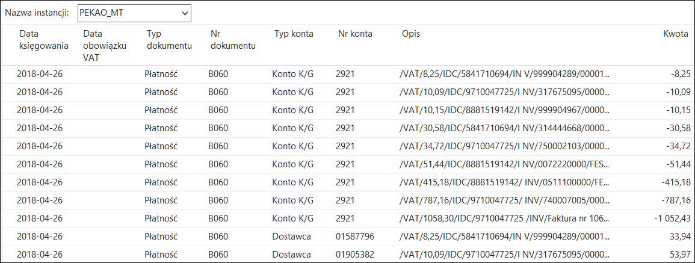

# Import wyciągów bankowych

## Ustawienia

Wyciągi bankowe są dostępne w banku zarówno dla konta podstawowego,
jak i konta pomocniczego VAT. Z rachunku VAT nie ma możliwości
wykonywania żadnych własnych przelewów, zapisy na tym koncie związane są
tylko z automatycznym przeksięgowywaniem kwot podatku VAT na konto
podstawowe i z konta podstawowego. W związku z powyższym, przyjęte
zostały dwa warianty wprowadzania wyciągów dla konta pomocniczego VAT do
systemu Microsoft Dynamics 365 Business Central on‑premises:

1.  Dla konta VAT utworzone może być tylko odrębne konto K/G, a
    księgowanie będzie dokonywane tylko bezpośrednio na to konto. W
    takim przypadku importowany do systemu jest tylko wyciąg z konta
    podstawowego, a transakcje pomiędzy kontem VAT i kontem podstawowym
    księgowane są na konto K/G pobierane z ustawień.

2.  Dla konta VAT utworzone może być odrębne konto K/G i nowe konto
    bankowe (powiązane z tym kontem K/G). W takim przypadku importowane
    do systemu są oba wyciągi: z konta podstawowego i z konta VAT, a
    transakcje pomiędzy kontem VAT i kontem podstawowym księgowane są
    przez konto środków pieniężnych w drodze (konto K/G), pobierane z
    ustawień.

Aby zdefiniować ustawienia w wybranym wariancie dla konta VAT, należy
wykonać następujące kroki:

1.  Należy wybrać **Działy \> Zarządzanie finansami \> Zarządzanie
    środkami pieniężnymi \> Konta bankowe**.

2.  W oknie **Konta bankowe**, które się otworzy, należy zaznaczyć
    wiersz z kontem podstawowym, następnie na wstążce kliknąć
    **Edytuj**.

3.  W oknie **Kartoteka konta bankowego**, które się otworzy, na wstążce
    należy kliknąć **Ustawienia kont VAT dla podziału płatności**.

  

**Wariant 1**

W przypadku wyboru pierwszej metody księgowania wyciągów bankowych
z mechanizmem podzielonej płatności, należy uzupełnić pola:

-   **IBAN Konta bankowego VAT**

-   **Konto K/G dla konta bankowego VAT**

  

**Wariant 2**

W drugim przypadku, gdy importowane będą oba wyciągi, należy uzupełnić
pola:

-   **IBAN Konta bankowego VAT**

-   **Konto K/G dla gotówki w drodze**

Ustawienie takie należy zdefiniować zarówno dla kartoteki konta
bankowego podstawowego, jak i dla kartoteki konta bankowego VAT.

  

  

## Obsługa

Moduł **Bankowość elektroniczna** umożliwia import pliku z wyciągami
bankowymi, zarówno do konta podstawowego, jak i konta VAT
oraz ich automatyczne rozliczenie z otwartymi zapisami księgi
dostawców/nabywców.

Aby zaimportować wybrany wyciąg bankowy, należy wykonać następujące
kroki:

1.  Należy wybrać **Działy \> Zarządzanie finansami \> Bankowość
    elektroniczna \> Dziennik wyciągów bankowych**.

2.  Należy wybrać właściwy szablon i/lub instancję dziennika głównego.

3.  W oknie **Dziennik wyciągów bankowych**, które się otworzy, należy
    na wstążce kliknąć **Importuj wyciąg bankowy.**

4.  W  oknie, które się otworzy, należy wskazać plik bankowy
    do zaimportowania i zatwierdzić klikając przycisk **OK**.

System zaimportuje pozycje wyciągu bankowego do wierszy dziennika
wyciągów bankowych. Jeśli kartoteka dostawcy/nabywcy posiada
zdefiniowane konta bankowe, system wprowadzi właściwego dostawcę/nabywcę
w wierszu dziennika. Jeśli natomiast nie zostanie znaleziona taka
referencja, użytkownik powinien ręcznie uzupełnić pola **Typ konta**
oraz **Nr konta** w każdym wierszu dziennika wyciągu bankowego.
Pozostałe pola, przy braku błędów w czasie importu, system uzupełnia
automatycznie.

W przypadku mechanizmu podzielonej płatności przeksięgowania wewnętrzne
pomiędzy kontem podstawowym, a kontem VAT zostaną przypisane do konta
K/G wynikającego z ustawień (albo bezpośrednio konto K/G dla VAT, albo
konto K/G dla środków pieniężnych w drodze).

  

  

W dzienniku, po zaimportowaniu wyciągu bankowego, można również
rozliczyć poszczególne wiersze wyciągu z zapisami (dokumentami), na
podstawie których utworzony został odpowiedni przelew, wybierając
na wstążce akcję **Rozlicz automatycznie**. Wykorzystuje ona
identyfikator zdefiniowany w procesie eksportu przelewów do określenia
konkretnych zapisów księgi nabywcy/dostawcy. Określanie konkretnych
zapisów odbywa się na podstawie rejestru.

Po poprawnym uzupełnieniu wierszy **Dziennika wyciągów bankowych**
i rozliczeniu zapisów, należy zaksięgować dziennik klikając na wstążce
akcję **Księguj (można też nacisnąć F9)**.