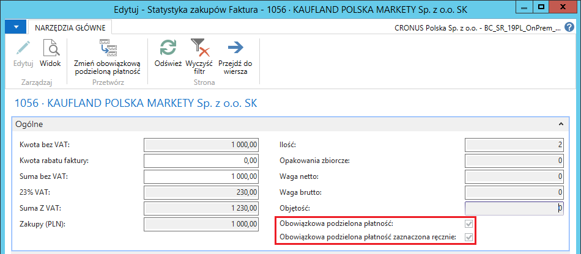
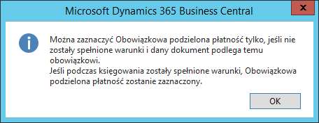
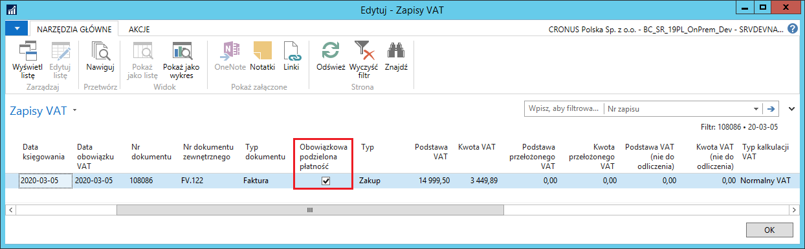
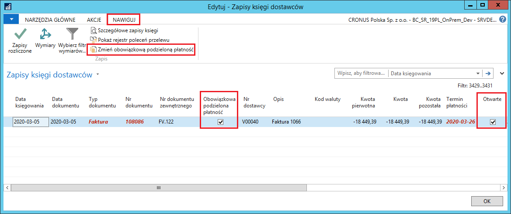

# Wsparcie procesu zakupu z obowiązkową podzieloną płatnością

## Obsługa

Wsparcie procesu zakupu polega na dodaniu kalkulowanego oznaczenia
dla dokumentów zamówienia zakupu, faktury zakupu i faktury korygującej
zakupu. Pole to jest automatycznie zaznaczane w przypadku spełnienia
warunków dla zastosowania obowiązkowej podzielonej płatności:
gdy przynajmniej w jednym wierszu dokumentu wpisany będzie kod PKWiU z
listy z załącznika i faktura przekroczy 15 000,00 zł brutto.

Znacznik w polu **Obowiązkowa podzielona płatność** w dokumentach zakupu
może być również ręcznie zmieniony w szczególnych przypadkach, m.in. gdy
w ewidencjonowanych dokumentach zakupu nie będzie wprowadzany kod PKWiU.

>[!NOTE]
>Opis obsługi mechanizmu podzielonej płatności zamieszczony w
tym rozdziale **bazuje na przykładzie faktury zakupu. W zamówieniach
zakupu i w fakturach korygujących zakupu obsługa mechanizmu
jest identyczna, więc należy wzorować się na opisie dotyczącym faktury
zakupu**.

Aby wprowadzić fakturę zakupu z zastosowaniem mechanizmu podzielonej
płatności, należy wykonać następujące kroki:

1.  Należy wybrać **Działy \> Zakup \> Przetwarzanie zamówień \> Faktury
    zakupu**

2.  W oknie **Faktury zakupu**, które się otworzy, na wstążce należy
    kliknąć **Nowy**.

3.  Fakturę zakupu należy wypełnić w standardowy sposób.

Warunkiem zakwalifikowania przez system faktury zakupu do obowiązku
zastosowania mechanizmu podzielonej płatności jest podanie, w co
najmniej jednym wierszu faktury, kodu PKWiU, dla którego zaznaczone jest
pole **Obowiązkowa podzielona płatność**, przy łącznej wartości brutto
faktury wynoszącej co najmniej 15 000,00 zł.

W skróconej karcie **Szczegóły faktury** widoczne jest nowe pole
**Obowiązkowa podzielona płatność** -- pole to jest nieedytowalne, jego
wartość ustawiana jest automatycznie po zweryfikowaniu przez system
spełnienia kryteriów.

Weryfikacja odbywa się w wyniku:

1.  otworzenia okna **Statystyki**

lub

2.  zmiany stanu na **Zwolniony**

lub

3.  księgowania dokumentu.

  

Aby zweryfikować wartości faktury zakupu i zastosowanie mechanizmu
podzielonej płatności, w oknie **Faktura zakupu** należy na wstążce
kliknąć **Statystyka** (można też nacisnąć **F7**).

W wyniku tego działania system weryfikuje kody PKWiU w wierszach faktury
zakupu oraz łączną wartość brutto do zaksięgowania. Na tej podstawie
zaznacza lub nie pole **Obowiązkowa podzielona płatność**.

  

W oknie **Statystyka zakupów**, na wstążce dostępna jest akcja **Zmień
obowiązkową podzieloną płatność**, której można użyć do ręcznego
oznaczenia MPP w fakturze zakupu, gdy na podstawie danych nie
kwalifikuje się ona do obowiązkowej podzielonej płatności (jej wartość
brutto jest niższa niż 15 000,00 zł lub w wierszach nie ma właściwego
kodu PKWiU). W wyniku działania tej funkcji, system zaznaczy dwa pola:
**Obowiązkowa podzielona płatność** i **Obowiązkowa podzielona
płatność zaznaczona ręcznie** w oknie **Statystyka zakupów**.

>[!NOTE]
>W sytuacji, gdy zmienią się dane faktury np. jej wartość
brutto lub przypisanie kodu PKWiU, ponowne otwarcie okna **Statystyka
zakupów** zweryfikuje obowiązek zastosowania MPP. Weryfikacja
przeprowadzana jest również w wyniku zmiany stanu dokumentu na
**Zwolniony** i podczas jego księgowania.

  

>[!NOTE]
>W sytuacji, gdy parametry faktury zakupu kwalifikują ją
do MPP i system zaznaczył automatycznie pole Obowiązkowa podzielona
płatność, nie ma możliwości ręcznej zmiany zaznaczenia tego pola.

W wyniku użycia akcji **Zmień obowiązkową podzieloną płatność** w
oknie **Statystyka zakupów** faktury spełniającej kryteria
obowiązkowej podzielonej płatności, system usunie zaznaczenie pola
**Obowiązkowa podzielona płatność**, ale podczas kolejnej weryfikacji
tego dokumentu (przy ponownym otwarciu okna **Statystyka zakupów**,
lub przy zmianie stanu na **Zwolniony**, lub przy księgowaniu
dokumentu) pole zostanie ponownie zaznaczone.

Kliknięcie akcji **Zmień obowiązkową podzieloną płatność** w oknie
**Statystyka zakupów** faktury spełniającej kryteria obowiązkowej
podzielonej płatności spowoduje wyświetlenie komunikatu
z ostrzeżeniem:

  

W celu sprawdzenia przewidywanego efektu księgowania danej faktury
zakupu, w oknie **Faktura zakupu** należy na wstążce kliknąć **Podgląd
księgowania**. Dla faktury podlegającej MPP pole **Obowiązkowa
podzielona płatność** zostanie zaznaczone w księgach pomocniczych:
**Zapisy VAT** i **Zapisy księgi dostawców**:

  

  

W celu zaksięgowania faktury zakupu, w oknie **Faktura zakupu** należy
na wstążce kliknąć **Księguj** (można też nacisnąć **F9**). W efekcie
zaksięgowania faktury podlegającej MPP pole **Obowiązkowa podzielona
płatność** zostanie zaznaczone w nagłówku zaksięgowanej faktury zakupu
oraz w księgach pomocniczych: **Zapisy VAT** i **Zapisy księgi
dostawców**.

  

  

  

## Ewidencja dokumentów zakupu przez dzienniki

W przypadku wprowadzania dokumentów zakupu przez dzienniki, transakcję
podlegającą mechanizmowi podzielonej płatności należy oznaczyć ręcznie,
wybierając 1 w polu **Ident. zestawu atrybutów VAT**. Dotyczy to również
transakcji objętych obowiązkiem zastosowania tego mechanizmu.

  

## Zmiana oznaczenia MPP dla zobowiązań

W oknie **Zapisy księgi dostawcy** została dodana możliwość ręcznej
zmiany oznaczenia zobowiązania do zastosowania mechanizmu podzielonej
płatności, co będzie miało wpływ na generowanie przelewu. Aby zmienić
oznaczenie, w oknie **Zapisy księgi dostawcy** należy zaznaczyć wybrany
wiersz, następnie na wstążce należy kliknąć **Zmień obowiązkową
podzieloną płatność**. W wyniku działania tej funkcji zostanie zmienione
zaznaczenie pola **Obowiązkowa podzielona płatność** w wybranym zapisie
księgi dostawcy oraz w powiązanych wierszach w oknie **Zapisy VAT**.

>[!NOTE]
>Zmiana zaznaczenia pola Obowiązkowa podzielona płatność
w oknie **Zapisy księgi dostawcy** możliwa jest tylko dla zapisów, które
mają zaznaczone pole **Otwarte**.

  