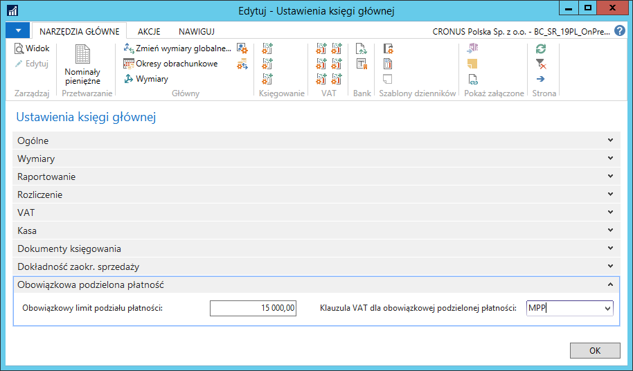
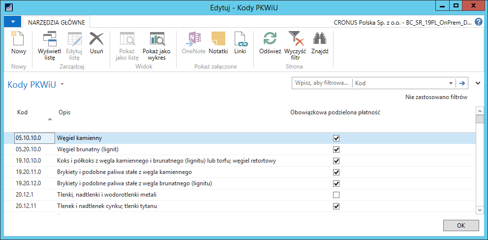

# Dokumenty sprzedaży i zakupu

## Informacje ogólne

W dokumentach sprzedaży i zakupu mechanizm podzielonej płatności działa
w oparciu m.in. o kody PKWiU i klauzule VAT. Podczas instalacji modułu
wgrywane są jego podstawowe ustawienia.

Ustawienia są wspólne dla dokumentów sprzedaży i zakupu.

## Ustawienia

Aby zweryfikować i ewentualnie zmienić/uzupełnić wgrane ustawienia,
należy wykonać następujące kroki:

1.  Należy wybrać **Działy \> Zarządzanie Finansami \> Administracja \>
    Ustawienia księgi głównej**

2.  W oknie **Ustawienia księgi głównej**, które się otworzy, należy
    sprawdzić wypełnienie pól na karcie skróconej **Obowiązkowa
    podzielona płatność**:

    -   **Obowiązkowy limit podziału płatności** – w tym polu wprowadzona
        jest wartość brutto limitu transakcji sprzedaży lub zakupu dla
        zastosowania podzielonej płatności,
    
    -   **Klauzula VAT dla obowiązkowej podzielonej płatności** – w tym
        polu wprowadzony jest kod klauzuli VAT, której treść: *mechanizm
        podzielonej płatności* będzie drukowana na dokumentach sprzedaży
        podlegających obowiązkowi podzielonej płatności.

  

3.  W oknie **Ustawienia księgi głównej** na wstążce należy kliknąć
    **Kody PKWiU**.

4.  W oknie **Kody PKWiU**, które się otworzy, należy sprawdzić
    wypełnienie pola **Obowiązkowa podzielona płatność**.

  