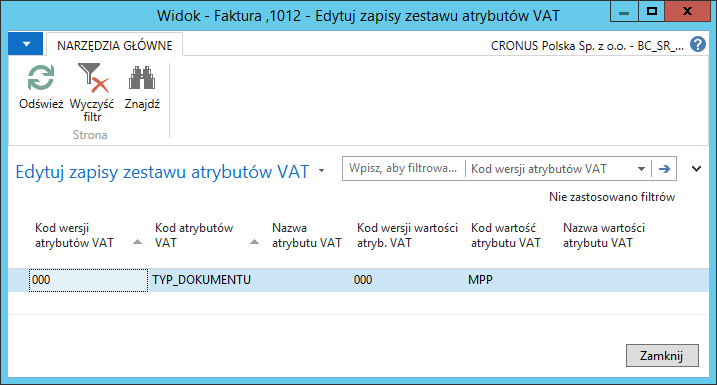
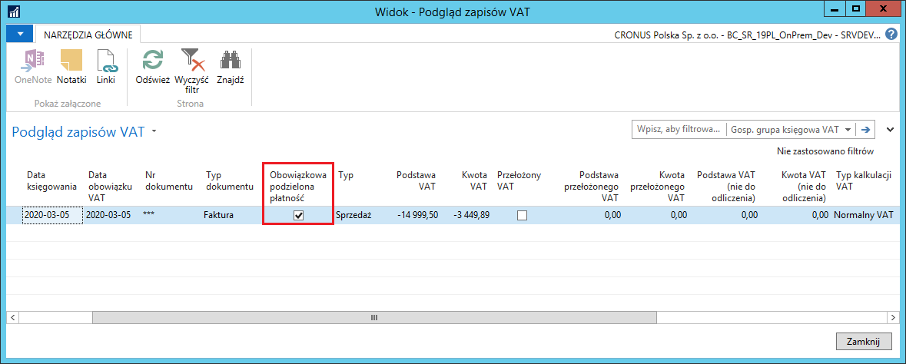
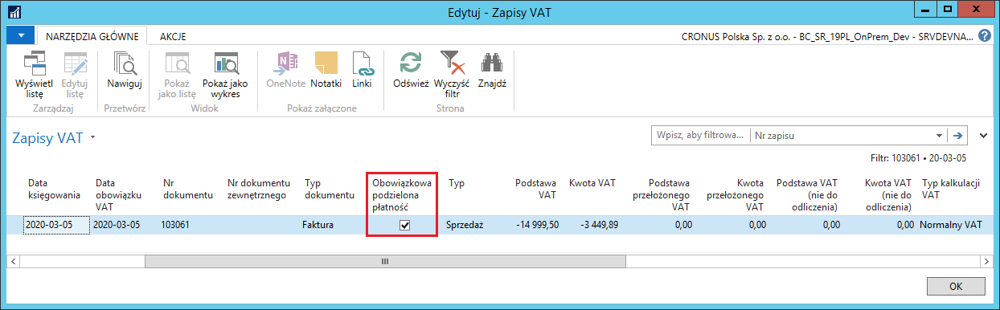

# Wsparcie procesu sprzedaży z obowiązkową podzieloną płatnością

## Obsługa

Wsparcie procesu sprzedaży polega na dodaniu kalkulowanego oznaczenia
dla dokumentów zamówienia sprzedaży, faktury sprzedaży i faktury
korygującej sprzedaży. Pole to jest automatycznie zaznaczane w przypadku
spełnienia warunków dla zastosowania obowiązkowej podzielonej płatności:
gdy przynajmniej w jednym wierszu dokumentu wpisany będzie kod PKWiU z
listy z załącznika i faktura przekroczy 15 000,00 zł brutto.

Znacznik w polu **Obowiązkowa podzielona płatność** w dokumentach
sprzedaży może być również ręcznie zmieniony w szczególnych przypadkach.

>[!NOTE]
>Opis obsługi mechanizmu podzielonej płatności zamieszczony w
tym rozdziale bazuje na przykładzie faktury sprzedaży. W zamówieniach
sprzedaży i w fakturach korygujących sprzedaży obsługa mechanizmu
jest identyczna, więc należy wzorować się na opisie dotyczącym faktury
sprzedaży.

Aby wprowadzić fakturę sprzedaży z zastosowaniem mechanizmu podzielonej
płatności, należy wykonać następujące kroki:

1.  Należy wybrać **Działy \> Sprzedaż i Marketing \> Przetwarzanie
    zamówień \> Faktury sprzedaży**

2.  W oknie **Faktury sprzedaży**, które się otworzy, na wstążce należy
    kliknąć **Nowy**.

3.  Fakturę sprzedaży należy wypełnić w standardowy sposób.

Warunkiem zakwalifikowania przez system faktury sprzedaży do obowiązku
zastosowania mechanizmu podzielonej płatności jest podanie, w co
najmniej jednym wierszu faktury, kodu PKWiU, dla którego zaznaczone jest
pole **Obowiązkowa podzielona płatność**, przy łącznej wartości brutto
faktury wynoszącej co najmniej 15 000,00 zł.

W karcie skróconej **Szczegóły faktury** widoczne jest nowe pole
**Obowiązkowa podzielona płatność** – pole to jest nieedytowalne, jego
wartość ustawiana jest automatycznie po zweryfikowaniu przez system
spełnienia kryteriów.

Weryfikacja odbywa się w wyniku:

1.  otworzenia okna **Statystyki**

lub

2.  zmiany stanu na **Zwolniony**

lub

3.  księgowania dokumentu.

  

Pole **Obowiązkowa podzielona płatność** w karcie skróconej **Szczegóły
faktury** związane jest również z funkcjonalnością **Atrybutów VAT**,
przygotowaną do obsługi nowego formatu i nowej klasyfikacji dokumentów i
transakcji pod kątem **JPK\_VAT z deklaracją**. Na tym etapie można
przejrzeć atrybut VAT tylko dla MPP.

Aby przejrzeć atrybuty VAT przypisane do faktury sprzedaży, należy na
wstążce kliknąć **Atrybuty VAT**.

  

Aby zweryfikować wartości faktury sprzedaży i zastosowanie mechanizmu
podzielonej płatności, w oknie **Faktura sprzedaży** należy na wstążce
kliknąć **Statystyka** (można też nacisnąć **F7**).

W wyniku tego działania system weryfikuje kody PKWiU w wierszach faktury
sprzedaży oraz łączną wartość brutto do fakturowania. Na tej podstawie
zaznacza lub nie pole **Obowiązkowa podzielona płatność**.

  

W oknie **Statystyka sprzedaży**, na wstążce dostępna jest akcja
**Zmień obowiązkową podzieloną płatność**, której można użyć do
ręcznego oznaczenia MPP w fakturze sprzedaży, gdy na podstawie danych
nie kwalifikuje się ona do obowiązkowej podzielonej płatności (jej
wartość brutto jest niższa niż 15 000,00 zł lub w wierszach nie ma
właściwego kodu PKWiU). W wyniku działania tej funkcji, system
zaznaczy dwa pola: **Obowiązkowa podzielona płatność** i **Obowiązkowa
podzielona płatność zaznaczona ręcznie** w oknie **Statystyka
sprzedaży**.

>[!NOTE]
>W sytuacji, gdy zmienią się dane faktury np. jej wartość
brutto lub przypisanie kodu PKWiU, ponowne otwarcie okna **Statystyka
sprzedaży** zweryfikuje obowiązek zastosowania MPP. Weryfikacja
przeprowadzana jest również w wyniku zmiany stanu dokumentu na
**Zwolniony** i podczas jego księgowania.

  

>[!NOTE]
>W sytuacji, gdy parametry faktury sprzedaży kwalifikują ją
do MPP i system zaznaczył automatycznie pole **Obowiązkowa podzielona
płatność**, nie ma możliwości ręcznej zmiany zaznaczenia tego pola.

W wyniku użycia akcji **Zmień obowiązkową podzieloną płatność** w
oknie **Statystyka sprzedaży** faktury spełniającej kryteria
obowiązkowej podzielonej płatności, system usunie zaznaczenie pola
**Obowiązkowa podzielona płatność**, ale podczas kolejnej weryfikacji
tego dokumentu (przy ponownym otwarciu okna **Statystyka sprzedaży**,
lub przy zmianie stanu na **Zwolniony**, lub przy księgowaniu
dokumentu) pole zostanie ponownie zaznaczone.

Kliknięcie akcji **Zmień obowiązkową podzieloną płatność** w oknie
**Statystyka sprzedaży** faktury spełniającej kryteria obowiązkowej
podzielonej płatności spowoduje wyświetlenie komunikatu
z ostrzeżeniem:

  

W celu sprawdzenia przewidywanego efektu księgowania danej faktury
sprzedaży, w oknie **Faktura sprzedaży** należy na wstążce kliknąć
**Podgląd księgowania**. Dla faktury podlegającej MPP pole
**Obowiązkowa podzielona płatność** zostanie zaznaczone w księgach
pomocniczych: **Zapisy VAT** i **Zapisy księgi nabywcy**:

  

  

W celu zaksięgowania faktury sprzedaży, w oknie **Faktura sprzedaży**
należy na wstążce kliknąć **Księguj** (można też nacisnąć **F9**). W
efekcie zaksięgowania faktury podlegającej MPP pole **Obowiązkowa
podzielona płatność** zostanie zaznaczone w nagłówku zaksięgowanej
faktury sprzedaży oraz w księgach pomocniczych: **Zapisy VAT** i
**Zapisy księgi nabywcy**.

  

  

  
Na wydruku zaksięgowanej faktury sprzedaży z zaznaczonym polem
**Obowiązkowa podzielona płatność** wyświetlona jest treść klauzuli VAT
wybrana w oknie **Ustawienia księgi głównej**.

  