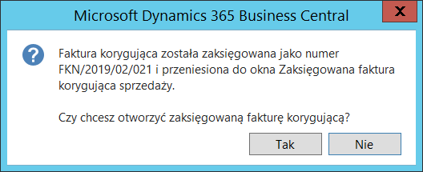

# Korygowanie danych nagłówkowych 

## Informacje ogólne

Zmiana danych nagłówkowych w zaksięgowanej fakturze sprzedaży lub
fakturze korygującej sprzedaży wymaga wystawienia dokumentu korygującego
– faktury korygującej. W przypadku zmiany NIP lub danych pozwalających
na identyfikację podmiotu (nazwy kontrahenta, adresu) oraz daty
dokumentu i daty sprzedaży, konieczne jest wykazanie takiej zmiany w
pliku JPK\_VAT włącznie z wystornowaniem kwot podstawy i VAT pod numerem
zaksięgowanego pierwotnie dokumentu i ponownego wykazania w pliku
JPK\_VAT z numerem faktury korygującej oraz prawidłowymi danymi. Zmiana
terminu płatności aktualizuje zapis księgi nabywcy, a zmiany pozostałych
pól są rejestrowane w zaksięgowanych danych przed/po korekcie i nie
wymagają wysyłania korekty pliku JPK\_VAT.

## Ustawienia

W celu zdefiniowania danych dotyczących faktur korygujących dane
nagłówkowe, należy postępować według następujących kroków:

1.  Należy wybrać **Działy \> Sprzedaż i Marketing \> Administracja \>
    Ustawienia sprzedaży i należności**

2.  W oknie **Ustawienia sprzedaży i należności**, które się otworzy,
    należy uzupełnić pola zgodnie z poniższym opisem:

    -   **Seria nr faktury kor. dane nagłówka** – w tym polu należy
         wprowadzić kod wstępnej numeracji faktur korygujących nagłówek

>[!NOTE]
>dokumenty księgowane są z serią numeracji zaksięgowanych
faktur korygujących sprzedaży lub zgodnie z ustawieniami w szablonach
serii numeracji dokumentów sprzedaży dla typu dokumentu **Faktura
korygująca dane nagłówka**.

  

  

W celu zdefiniowania przyczyn korekty danych nagłówkowych, należy
postępować według następujących kroków:

1.  Należy wybrać **Działy \> Sprzedaż i Marketing \> Administracja \>
    Przyczyny korekty sprzedaży – nagłówek**.

2.  W oknie **Przyczyny korekty sprzedaży – nagłówek**, które się
    otworzy, należy uzupełnić pola zgodnie z poniższym opisem:

    -   **Kod** – w tym polu należy wprowadzić unikalny kod identyfikujący
         przyczynę korekty sprzedaży dla danych nagłówka,
    
    -   **Opis** – w tym polu należy wprowadzić opis przyczyny korekty
         sprzedaży dla danych nagłówka, zgodny z wprowadzonym wcześniej
         kodem,
    
    -   **Typ korekty** – wybrana w tym polu opcja decyduje, czy tworzone
         są zapisy stornujące błędny dokument w rejestrze VAT (JPK\_VAT),
         czy zapisywane są tylko zmiany historyczne przed i po korekcie.

         Z listy rozwijanej w tym polu należy wybrać opcję właściwą dla
         wprowadzonego wcześniej kodu. Dostępne są następujące opcje:

        -   **NIP i dane ewidencyjne** – korekta stornuje w zapisach błędne
             dane i wprowadza zapis z prawidłowymi danymi pod numerem dokumentu
             korekty,
        
        -   **Dane nagłówka** – przy zmianie daty w polu **Termin płatności**
             zmiana zapisywana jest w zapisie księgi nabywcy, dla pozostałych
             pól zapisane są historyczne dane przed/po dla faktury korygującej
             dane nagłówka.

>[!NOTE]
>W przypadku zastosowania **Typu korekty**: **NIP i dane
ewidencyjne** można również w tym samym dokumencie zmienić wartości
innych pól.

  

## Obsługa

W celu utworzenia dokumentu faktury korygującej dane nagłówkowe, należy
postępować według następujących kroków:

1.  Należy wybrać **Działy \> Zarządzanie Finansami \> Należności \>
    Faktury korygujące sprzedaży – dane nagłówka**.

2.  W oknie **Faktury korygujące sprzedaży**, które się otworzy, należy
    wybrać **Nowe**.

3.  Otworzy się okno ze zdefiniowanymi przyczynami faktury korygującej
    dane nagłówka, w którym należy zaznaczyć wiersz z wybraną przyczyną
    i potwierdzić klikając przycisk **OK**.

4.  W kartotece nowej faktury korygującej sprzedaży należy nadać jej
    numer kolejny i z listy rozwijanej w polu **Nabywca** wybrać
    nabywcę, dla którego zostały wystawione faktury sprzedaży lub
    faktury korygujące podlegające skorygowaniu. Dane w kartotece
    nabywcy powinny być jak najbardziej aktualne, dla tych danych
    wystawiony będzie dokument.

5.  W karcie skróconej **Ogólne** należy wprowadzić **Datę księgowania**
    faktury korygującej, **Data obowiązku VAT** zostanie uzupełniona na
    podstawie dokumentu korygowanego i musi być zgodna z **Datą
    obowiązku VAT** dla tego dokumentu.

6.  W karcie skróconej **Szczegóły faktury korygującej**, w polu
    **Przyczyna korekty** wyświetli się wybrany wcześniej kod przyczyny
    korekty.

7.  Należy wypełnić pole **Typ dokumentu korygowanego**. Dostępne opcje
    są następujące:

    -   **Zaksięgowana faktura**
    
    -   **Zaksięgowana faktura korygująca**
    
8.  Z rozwijanej listy w polu **Nr dokumentu korygowanego** należy
    wybrać dokument do skorygowania, dane z tego dokumentu wstawione
    zostaną w wierszach jako wiersz danych nagłówkowych **Przed
    korektą** i drugi, jako wiersz danych nagłówkowych **Po korekcie**.

9.  Pole **Filtr dat sprzedaży faktury korygującej** należy wypełnić dla
    faktury korygującej bonusowej wpisując okres, z jakiego pochodzą
    faktury sprzedaży przeznaczone do skorygowania.

10. Pozostałe pola w nagłówku dokumentu należy wypełnić w sposób
    standardowy.

  

  

11. W każdym wierszu typu **Po** należy wprowadzić właściwe zmiany,
     zgodne z wybraną opcją w polu **Przyczyna korekty**. W zależności
     od wybranego typu faktury korygującej, część pól może być
     nieedytowalna. Dla typu korekty **Dane nagłówka** nie można
     zmieniać danych związanych z ewidencją VAT: NIP, nazwy,
     podstawowych danych adresowych, daty sprzedaży, daty dokumentu.

12. Należy w sposób standardowy zaksięgować fakturę korygującą
    sprzedaży.

13. Po zaksięgowaniu pojawi się komunikat z numerem zaksięgowanej
     faktury korygującej.

  

14. Należy w sposób standardowy wydrukować fakturę korygującą sprzedaży.
     Można zauważyć, że wszystkie zmiany w polach zostały dodane jako
     wiersze typu **Przed i Po**:

  

  