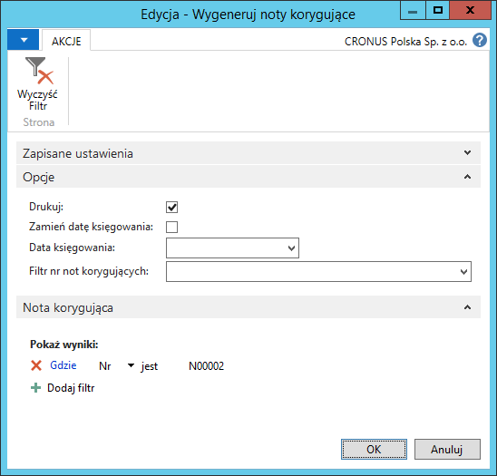
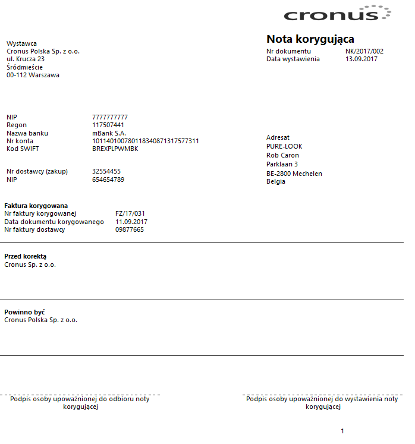

# Noty korygujące

## Informacje ogólne

 Zgodnie z przepisami polskiego prawa, jeśli firma otrzyma fakturę VAT
 z drobnymi błędami, jak np. pomyłka w adresie nabywcy, może wystawić
 notę korygującą, która wskazuje błędne dane i poprawne dane, jakie
 powinny być umieszczone na otrzymanym dokumencie. W ramach Polskiej
 Lokalizacji systemu Microsoft Dynamics 365 Business Central
 on‑premises została zaimplementowana funkcjonalność **Noty
 korygujące** mająca na celu ułatwienie obsługi poprawiania drobnych
 błędów, o których mowa wyżej.

## Ustawienia

 Dla not korygujących, podobnie jak dla wszystkich innych dokumentów
 księgowanych w Microsoft Dynamics 365 Business Central on‑premises,
 konieczne jest zdefiniowanie w standardowy sposób 2 serii
 numeracyjnych: serii numeracji przed zaksięgowaniem i serii numeracji
 po zaksięgowaniu. Następnie serie należy przypisać jako domyślne
 dla wystawiania not korygujących. W tym celu należy postępować
 według następujących kroków:

1.  Należy wybrać **Działy \> Zarządzanie Finansami \> Administracja \>
     Ustawienia zakupów i zobowiązań.**

2.  W oknie **Ustawienia zakupów i zobowiązań**, które się otworzy,
     na karcie skróconej **Numeracja**, należy w polach **Seria nr not
     koryg.** i **Seria nr wygen. not kor.** wybrać odpowiednie,
     wcześniej zdefiniowane serie numeracji:

  

## Obsługa

 Do wystawiania not korygujących przeznaczone jest specjalne okno.
 Aby je otworzyć, należy postępować według następujących kroków:

1.  Należy wybrać **Działy \> Zarządzanie Finansami \> Zobowiązania \>
    Noty korygujące**.

2.  W oknie **Noty korygujące**, które się otworzy, należy wybrać
    **Nowe.**

3.  W oknie nowej noty korygującej niektóre pola wypełniane
    są automatycznie, inne należy wypełnić, a niektóre można pozostawić
    puste.

    Pola na karcie skróconej **Ogólne**:

    -   **Nr** – w tym polu automatycznie pojawi się numer kolejny
         dokumenty, nadany przez system zgodnie z przypisaną serią
         numeracji
    
    -   **Nr dostawcy (zakup)** - z listy rozwijanej w tym polu należy
         wybrać dostawcę, który dostarczył fakturę z drobnymi błędami.
    
    -   Pozostałe pola dotyczące dostawcy są nieedytowalne, zawierają jego
         dane podstawowe oraz dane adresowe pobrane z kartoteki dostawcy
         wybranego w polu **Nr dostawcy (zakup).**
    
    -   **Data dokumentu** i **Data księgowania** – są to daty dotyczące
         wystawianej noty korygującej. Pola uzupełniane są automatycznie
         datą roboczą, ale można je zmienić na inne.
    
    -   **Nr faktury korygowanej** – z listy rozwijanej w tym polu należy
         wybrać zaksięgowaną fakturę od dostawcy, podlegającą korekcie.
         Lista ograniczona jest do faktur zakupu od dostawcy wybranego
         w polu **Nr dostawcy (zakup)**.
    
    -   Pola: **Nr faktury dostawcy, Data dokumentu fak. kor. i Data
         przyjęcia dokumentu fak. kor.** są nieedytowalne, uzupełniane
         automatycznie przez system danymi pobranymi z dokumentu wybranego
         w polu **Nr faktury korygowanej**.

 Pola na karcie skróconej **Korekta** pogrupowane są w 2 kolumnach:
 **Przed korektą** i **Powinno być**. W polach **Tekst** w kolumnie
 **Przed korektą** należy wprowadzić błędne dane do skorygowania,
 przepisując je z faktury od dostawcy, a w odpowiadających im polach
 **Tekst** w kolumnie **Powinno być**, należy wprowadzić poprawne dane.

  

4.  Tak przygotowaną notę korygującą należy wygenerować i wydrukować,
     w tym celu należy wybrać **Generuj**.

5.  W oknie wstępnym skryptu **Wygeneruj noty korygujące**, które się
    otworzy, należy wprowadzić właściwe parametry:

    -   **Drukuj** – pole należy zaznaczyć, jeśli noty korygujące powinny
         być wydrukowane w trakcie generowania. Noty wygenerowane bez
         drukowania można wydrukować później, w innym oknie, co będzie
         opisane w dalszej części rozdziału.
    
    -   **Zamień datę księgowania** – pole należy zaznaczyć, jeśli
         w trakcie generowania not korygujących, data księgowania
         wprowadzona na nocie korygującej ma zostać zamieniona na inną,
         podana ręcznie w następnym polu.
    
    -   **Data księgowania** – jest to pole współpracujące z polem powyżej.
         Należy wprowadzić w nim datę księgowania, na jaką ma zostać
         zamieniona data księgowania wprowadzona wcześniej w nocie
         korygującej.
    
    -   **Filtr nr not korygujących** – z listy rozwijanej w tym polu można
         wybrać noty korygujące, które zostały poprawnie wprowadzone
         i powinny być wygenerowane w tym samym czasie. Pozostawienie pola
         pustego spowoduje wygenerowanie tylko jednej noty odsetkowej,
         z której uruchomiony został skrypt **Wygeneruj noty korygujące.**

>[!NOTE]
>Skrypt **Wygeneruj noty korygujące** domyślnie dotyczy
 jednej noty korygującej, w oknie której jest uruchomiony. Zmiana daty
 księgowania odnosi się do wszystkich not korygujących podlegających
 generowaniu, czyli tych, które zostały wybrane w polu **Filtr nr not
 korygujących** lub do jednej, jeśli pole to pozostało puste. Oznacza
 to, że nawet jeśli noty korygujące były tworzone w różnych odstępach
 czasu, z różnymi datami, to zmiana daty księgowania podczas
 ich generowania spowoduje, że w księgach będą widniały z tą samą datą.
 W przeciwnym wypadku, każda z wygenerowanych not korygujących zostanie
 zapisana z datą księgowania, jaka była umieszczona w jej nagłówku
 podczas generowania.

6.  Po wybraniu **OK** noty zostaną wygenerowane i wydrukowane, jeśli
     została zaznaczona opcja **Drukuj**.

  

Notę korygującą można wydrukować nie tylko podczas generowania, ale
też po wygenerowaniu. W tym celu należy postępować
według następujących kroków:

1.  Należy wybrać **Działy \> Zarządzanie Finansami \> Zobowiązania \>
     Wygenerowane noty korygujące.**

2.  W oknie **Wygenerowane noty korygujące**, które się otworzy, należy
     zaznaczyć wiersz z wybraną notą korygującą i wybrać **Drukuj**.

  