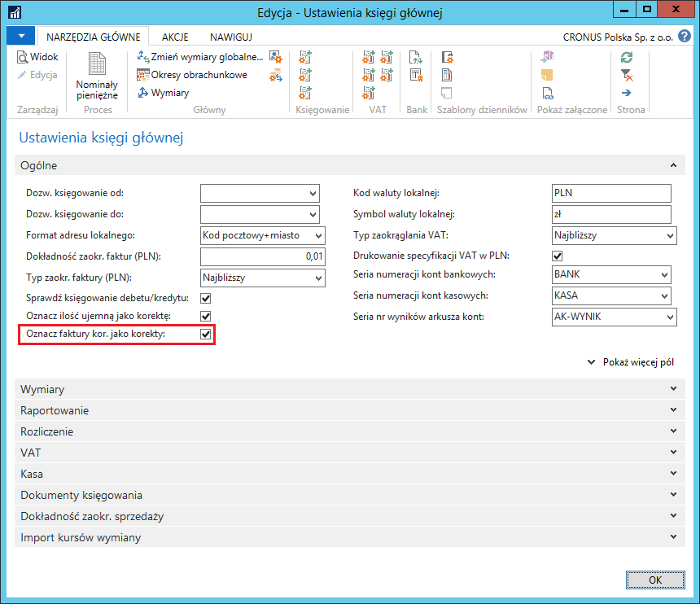
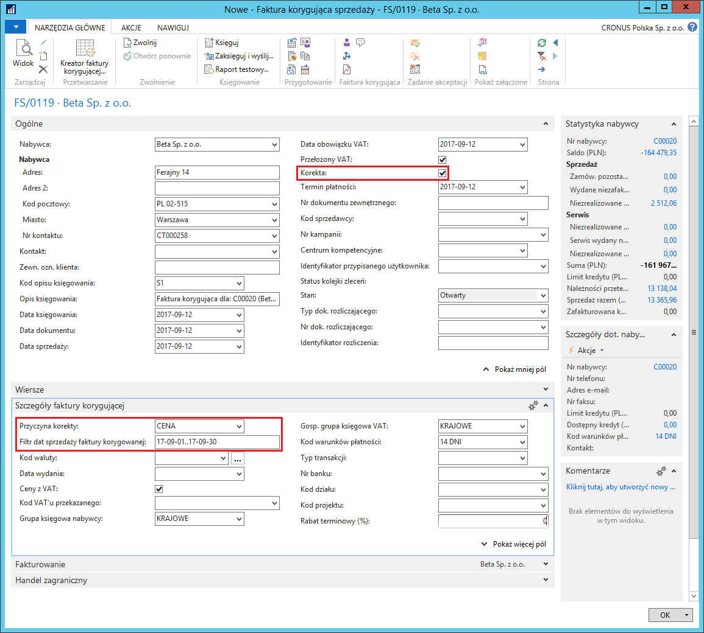
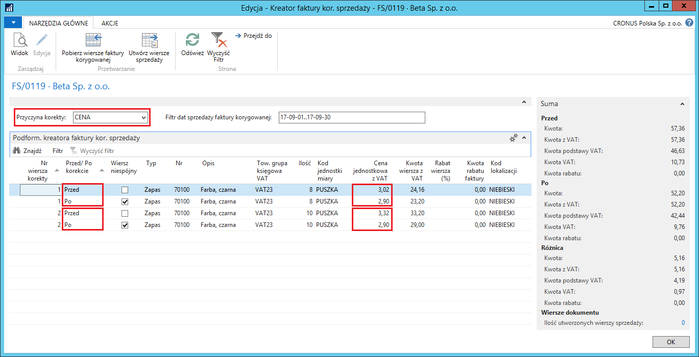
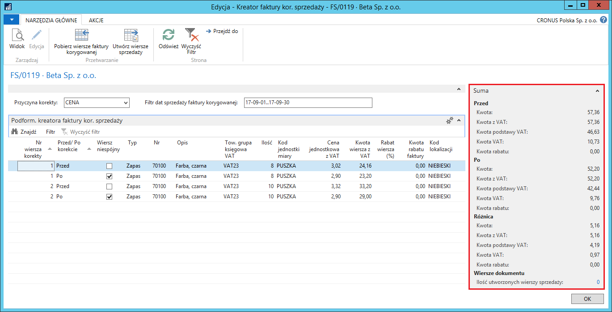
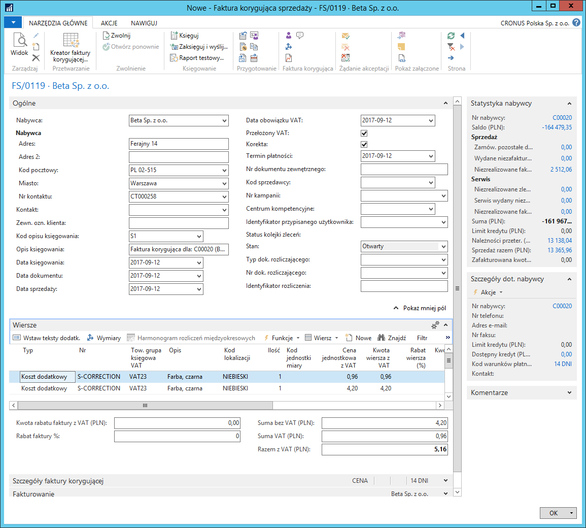
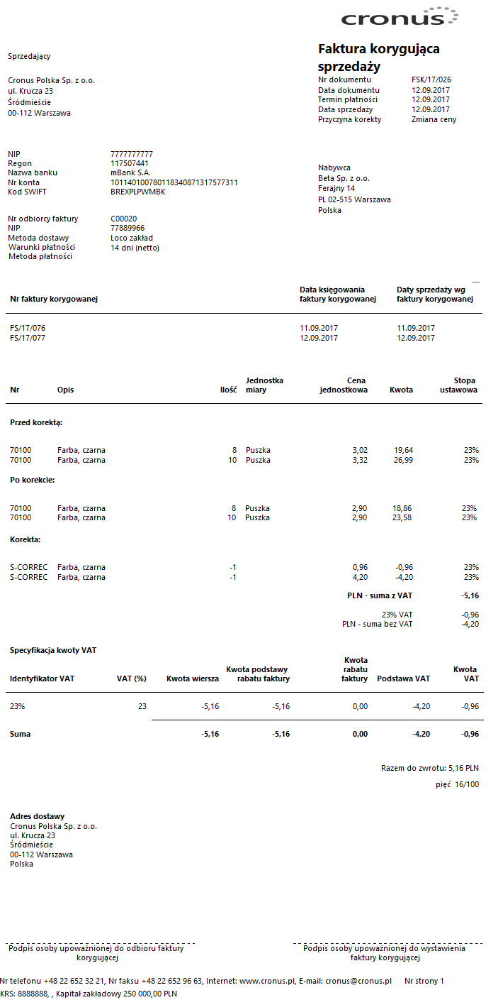

# Kreator faktury korygującej

## Informacje ogólne

W sytuacji, gdy zachodzi potrzeba skorygowania sprzedaży udokumentowanej
fakturą sprzedaży, firmy zwykle wystawiają fakturę korygującą sprzedaży.
W ramach Polskiej Lokalizacji zostały dodane ułatwienia w tworzeniu
faktur korygujących sprzedaży, m.in.:

-   Kreator tworzenia wierszy korekty.

-   Typy korekty kontrolujące poprawność tworzonych korekt.

-   Możliwość wystawiania jednej faktury korygującej sprzedaży do wielu
     faktur sprzedaży.

## Ustawienia

Przed rozpoczęciem korzystania z ułatwień w tworzeniu faktur
korygujących sprzedaży konieczne jest zdefiniowanie przynajmniej jednej
**Przyczyny korekty sprzedaży**. W tym celu, należy postępować
według następujących kroków:

1.  Należy wybrać **Działy \> Sprzedaż i Marketing \> Administracja \>**
    **Przyczyny korekty sprzedaży**.

2.  W oknie **Przyczyny korekty sprzedaży**, które się otworzy,
    w pierwszym wolnym wierszu należy zdefiniować nową przyczynę
    korekty, wypełniając odpowiednio pola:

    -   **Kod** – w tym polu należy wprowadzić unikalny kod identyfikujący
         przyczynę korekty sprzedaży
    
    -   **Opis** – w tym polu należy wprowadzić opis przyczyny korekty
         sprzedaży, zgodny z wprowadzonym wcześniej kodem
    
    -   **Typ korekty** – z listy rozwijanej w tym polu należy wybrać opcję
         właściwą dla wprowadzonego wcześniej kodu. Dostępne opcje
         są następujące:
    
        -   **Ilość** – dopuszczalna jest zmiana wyłącznie ilości
        
        -   **Cena jedn.** – dopuszczalna jest zmiana wyłącznie ceny
             jednostkowej
        
        -   **Rabat** – dopuszczalna jest zmiana wyłącznie wysokości rabatu
             wiersza
        
        -   **Stawka VAT** – dopuszczalna jest zmiana wyłącznie stawki VAT
             (kodu w polu **Tow. grupa księgowa VAT**)
        
        -   **Ilość i wartość** – dopuszczalna jest zmiana jednocześnie ilości
             i ceny jednostkowej
        
        -   **Anuluj** – powoduje anulowanie faktury sprzedaży w taki sposób,
             aby zachować czystość obrotów w księgach. Ta opcja przeznaczona
             jest do korygowania faktur sprzedaży wystawionych pomyłkowo
             lub tych, które nie zostały jeszcze dostarczone nabywcy. Opcja
             **Anuluj** powoduje, że dane na fakturze korygującej są dokładnym
             odwróceniem danych z korygowanej faktury sprzedaży. System
             pilnuje, aby daty faktury korygującej sprzedaży były identyczne,
             jak daty korygowanej faktury sprzedaży.
    
    -   **Kod kosztu dod.** – z listy rozwijanej w tym polu należy wybrać
         wcześniej zdefiniowany kod kosztu dodatkowego, który będzie
         pomocniczo wykorzystany do zaksięgowania korekty. Pole jest
         wymagane dla wybranych **Typów korekty**: **Ilość**, **Cena
         jedn.**, **Ilość i wartość**, **Rabat**.

Definiując odpowiednie ustawienia można zdecydować, czy faktury
korygujące sprzedaży domyślnie będą oznaczane jako korekty, czyli tzw.
storno czerwone. W celu zdefiniowania takiego ustawienia, należy
postępować według następujących kroków

1.  Należy wybrać **Działy \> Zarządzanie Finansami \>
    Administracja \>** **Ustawienia księgi głównej**.

2.  W oknie **Ustawienia księgi głównej**, które się otworzy, na karcie
     skróconej **Ogólne** należy zaznaczyć pole **Oznacz faktury kor.
     jako korekty**:

  

>[!NOTE]
>Ustawienie **Oznacz faktury kor. jako korekty** w oknie
 **Ustawienia księgi głównej** ma odniesienie również do serwisowych
 faktur korygujących wystawianych w module Serwis. Zasady działania
 i sposób obsługi tego ustawienia są takie same w obydwu modułach:
 Sprzedaż i należności oraz Serwis.

## Obsługa

W celu wystawienia faktury korygującej sprzedaży wykorzystując
ułatwienia Polskiej Lokalizacji, należy postępować według następujących
kroków:

1.  Należy wybrać **Działy \> Sprzedaż i Marketing \> Przetwarzanie
     zamówień \>** **Faktury korygujące sprzedaży**.

2.  W oknie **Faktury korygujące sprzedaży**, które się otworzy, należy
     wybrać **Nowe**.

3.  W kartotece nowej faktury korygującej sprzedaży należy nadać jej
     numer kolejny i z listy rozwijanej w polu **Nr nabywcy
     (sprzedaż)** wybrać nabywcę, dla którego zostały wystawione
     faktury sprzedaży podlegające skorygowaniu. W karcie skróconej
     **Szczegóły faktury korygującej**, z listy rozwijanej w polu
     **Przyczyna korekty** należy wybrać jedną z wcześniej
     zdefiniowanych przyczyn korekty. W polu **Filtr dat sprzedaży
     faktury korygującej** należy ustawić filtr ograniczający okres,
     z jakiego pochodzą faktury sprzedaży przeznaczone do skorygowania.
     Pozostałe pola w nagłówku dokumentu należy wypełnić w sposób
     standardowy.

  

>[!NOTE]
>Pole **Korekta** w nagłówku faktury sprzedaży zostało
 zaznaczone automatycznie na podstawie domyślnych ustawień. W sytuacji,
 gdy kwoty z faktury korygującej sprzedaży nie powinny być zaksięgowane
 jako tzw. storno czerwone (np. w przypadku faktur korygujących
 zwiększających), należy ręcznie zdjąć znacznik z pola **Korekta
 w **nagłówku konkretnej faktury korygującej sprzedaży.

4.  Należy wybrać **Kreator faktury korygującej**.

5.  W oknie **Kreator faktury kor. sprzedaży** należy wybrać **Pobierz
     wiersze faktury korygowanej**.

6.  Otworzy się okno z wierszami sprzedaży pochodzącymi z faktur
     sprzedaży wystawionych z datą sprzedaży przypadającą w okresie
     ograniczonym datami w polu **Filtr dat sprzedaży faktury
     korygującej dla **nabywcy wybranego w polu **Nr nabywcy
     (sprzedaż)**. Należy w standardowy sposób zaznaczyć wszystkie
     korygowane wiersze sprzedaży, a następnie wybrać **OK**.

7.  W oknie **Kreator faktury kor. sprzedaży** dla każdego wybranego
     wcześniej wiersza sprzedaży do korekty, system utworzył 2 wiersze:
     jeden typu **Przed i **drugi typu **Po**.

8.  W każdym wierszu typu Po należy wprowadzić właściwe zmiany, zgodne
     z wybraną opcją w polu **Przyczyna korekty**.

  

9.  W okienku informacyjnym można sprawdzić podsumowanie wartości przed
    korektą, po korekcie i różnicę między nimi:

  

10. Należy wybrać **Utwórz wiersze sprzedaży**.

11. System, na podstawie zmian wprowadzonych w wierszach typu **Po**,
     tworzy wiersze w oknie kartoteki faktury korygującej sprzedaży.

  

>[!NOTE]
>Nie należy modyfikować wierszy sprzedaży utworzonych
 automatycznie przez system, aby nie dopuścić do braku spójności
 pomiędzy danymi w wierszu faktury korygującej sprzedaży a danymi
 w wierszach typu **Przed** i **Po**.

12. Należy w sposób standardowy zaksięgować fakturę korygującą
     sprzedaży.

13. Należy w sposób standardowy wydrukować fakturę korygującą sprzedaży.
     Można zauważyć, że jest więcej wierszy na wydruku, gdyż zostały
     dodane wiersze typu **Przed i Po**:

  