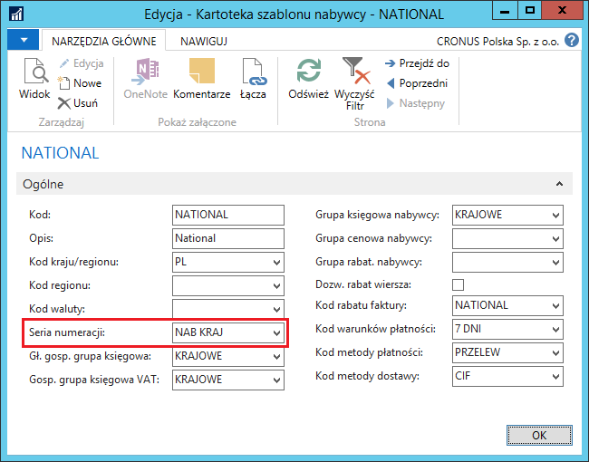
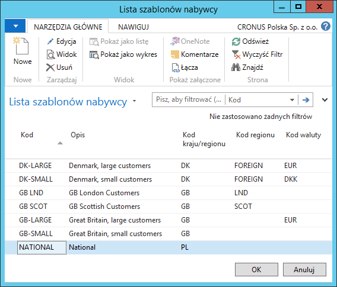
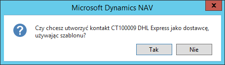
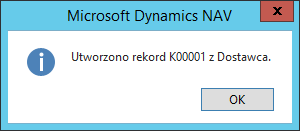

# Szablony nabywców i dostawców

## Informacje ogólne

Standardowa funkcjonalność Microsoft Dynamics 365 Business Central
on‑premises umożliwia wykorzystanie **szablonu nabywcy** podczas
tworzenia kartoteki nabywcy z kartoteki wcześniej wprowadzonego
kontaktu. Polska Lokalizacja zawiera dwie istotne modyfikacje w tym
obszarze:

-   Możliwość definiowania domyślnej serii numeracji w ramach **szablonu
     nabywcy**.

-   Obsługę **szablonów dostawców**, na wzór szablonów nabywców,
     włącznie z domyślną serią numeracji.

## Ustawienia

W celu przypisania domyślnej serii numeracji do **Szablonu nabywcy**,
należy postępować według następujących kroków:

1.  Należy wybrać **Działy \> Sprzedaż i Marketing \> Administracja \>
     Szablony nabywcy.**

2.  W oknie **Lista szablonów nabywcy**, które się otworzy, należy
     zaznaczyć wiersz z wybranym szablonem i wybrać **Edycja**.

3.  W kartotece wybranego szablonu nabywcy, z listy rozwijanej w polu
     **Seria numeracji** należy wybrać jedną z wcześniej zdefiniowanych
     serii numeracji, przeznaczoną do numerowania kartotek zakładanych
     przy użyciu danego szablonu.

  

W celu zdefiniowania **Szablonu dostawcy**, należy postępować
według następujących kroków:

1.  Należy wybrać **Działy \> Zakup \> Administracja \> Szablony
     dostawcy.**

2.  W oknie **Lista szablonów dostawcy**, które się otworzy, należy
     wybrać **Nowe**.

3.  W nowej kartotece szablonu dostawcy należy uzupełnić pola domyślnymi
     parametrami, które będą kopiowane do kartoteki dostawcy podczas
     jej tworzenia z kartoteki kontaktu, z wykorzystaniem tego
     szablonu.

  

## Obsługa

W celu utworzenia kartoteki nabywcy z kartoteki kontaktu
z wykorzystaniem wybranego **Szablonu nabywcy**, należy postępować
według następujących kroków:

1.  Należy wybrać **Działy \> Sprzedaż i Marketing \> Marketing \>
     Kontakty.**

2.  W oknie **Kontakty**, które się otworzy, należy zaznaczyć wiersz
     z wybranym kontaktem i wybrać **Utwórz jako \> Nabywca**.

3.  Należy odpowiedzieć twierdząco na pytanie wyświetlone w komunikacie:

  

4.  W oknie **Lista szablonów nabywcy** należy zaznaczyć wiersz
    z szablonem, którego domyślne parametry (m.in. **Seria numeracji**)
    mają być wykorzystane do utworzenia kartoteki nabywcy

  

5.  Poprawne utworzenie kartoteki nabywcy system sygnalizuje
    komunikatem:

  

6.  Numer kartoteki nowego nabywcy został nadany zgodnie z domyślną
    serią numeracji przypisaną do **Szablonu nabywcy**:

  

W celu utworzenia kartoteki dostawcy z kartoteki kontaktu
z wykorzystaniem wybranego **Szablonu dostawcy**, należy postępować
według następujących kroków:

1.  Należy wybrać **Działy \> Sprzedaż i Marketing \> Marketing \>
     Kontakty.**

2.  W oknie **Kontakty**, które się otworzy, należy zaznaczyć wiersz
     z wybranym kontaktem i wybrać **Utwórz jako \> Dostawca**.

3.  Należy odpowiedzieć twierdząco na pytanie wyświetlone w komunikacie:

  

4.  W oknie **Lista szablonów dostawcy** należy zaznaczyć wiersz
    z szablonem, którego domyślne parametry mają być wykorzystane
    do utworzenia kartoteki dostawcy

  

5.  Poprawne utworzenie kartoteki dostawcy system sygnalizuje
    komunikatem:

  

6.  Niektóre pola w kartotece nowego dostawcy zostały wypełnione zgodnie
    z domyślnymi parametrami przypisanymi do **Szablonu dostawcy**:

  