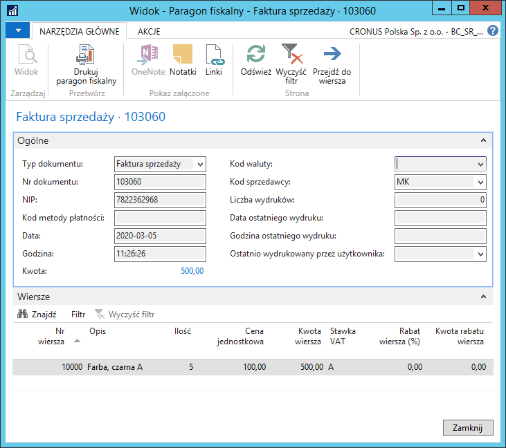

# NIP nabywcy na paragonie fiskalnym

## Podstawa prawna i dodatkowe informacje

### Podstawa prawna

Zgodnie z art. 106b ust. 5 znowelizowanej ustawy o VAT, kiedy dokonujemy
sprzedaży na rzecz podmiotu prowadzącego działalność (tzw. B2B),
istnieje możliwość wystawienia faktury do paragonu wyłącznie w sytuacji,
gdy na paragonie dokumentującym sprzedaż został zamieszczony NIP
nabywcy. Ustawa nowelizująca (art.28 pkt 5) z dnia 04.07.2019, termin
obowiązywania (Ustawa o VAT art.106b ust.5) od 01.01.2020. Przepis
dotyczy sprzedaży ewidencjonowanej na urządzeniach fiskalnych od
01.01.2020.

### Brak możliwości wystawienia faktury do paragonu dla osoby prywatnej?

Zmiana przepisów wprowadzająca NIP jako obowiązkowy element paragonu,
na podstawie którego może zostać wystawiona faktura, dotyczy wyłącznie
transakcji pomiędzy firmami. W przypadku transakcji tzw. B2C, czyli
pomiędzy firmą a osobą prywatną, obowiązują przepisy w brzmieniu
dotychczasowym. Oznacza to, że zgodnie z art. 106i ust. 6 ustawy o VAT
przedsiębiorca ma obowiązek wystawić fakturę do paragonu na żądanie
nabywcy w terminie:

-   do 15-tego dnia miesiąca następującego po miesiącu sprzedaży,
    pod warunkiem, że żądanie ma miejsce przed upływem końca miesiąca,
    w którym sprzedaż miała miejsce bądź otrzymano całość lub część
    zapłaty;

-   nie później niż 15-tego dnia od dnia zgłoszenia żądania, pod
    warunkiem, że żądanie ma miejsce po końcu miesiąca, w którym miała
    miejsce sprzedaż bądź otrzymano całość lub część zapłaty.

### Konsekwencje wystawienia faktury do paragonu, który nie zawiera NIP-u nabywcy

Zgodnie z art. 106b ust. 6 wystawienie na rzecz innej firmy faktury do
paragonu, na którym nie znajdował się NIP nabywcy, będzie skutkowało
nałożeniem 100% sankcji na sprzedawcę. Oznacza to, że organ podatkowy
nałoży na przedsiębiorcę dodatkowe zobowiązanie podatkowe w wysokości
100% VAT wykazanego na wystawionej fakturze do paragonu.

### Czy nowe przepisy dotyczące faktur do paragonów dotyczą wszystkich przedsiębiorców?

Nowelizacja ustawy o VAT przewiduje wyłączenia z przepisów dotyczących
obowiązku zamieszczania NIP-u firmy na paragonie, do którego ma zostać
wystawiona faktura. Zgodnie z art. 106b ust. 7 ustawy o VAT obowiązku
tego nie stosuje się do podatników świadczących usługi taksówek
osobowych, z wyłączeniem wynajmu samochodów osobowych z kierowcą (PKWiU
49.32.11.0). Co więcej, ustawodawca jednocześnie wyłączył tę grupę
przedsiębiorców ze 100% sankcji VAT za wystawienie faktury do paragonu,
na którym nie został zamieszczony NIP nabywcy.

/Opracowano na podstawie www.ksiegowosc-infor.pl/

## Informacje ogólne

NIP nabywcy drukowany na paragonie fiskalnym, jak i pozostałe dane
zawarte na paragonie fiskalnym powinny znajdować się w kolejności
określonej w rozporządzeniu. NIP nie może być drukowany jako linia
paragonu, czy inny dodatkowy opis, musi się znajdować pod linią z
numerem kasy i kasjerem, a logo fiskalnym.

Wydruk uzależniony jest od samej drukarki fiskalnej i jej
oprogramowania. Jeżeli drukarka tego nie obsługuje, nie ma możliwości
wysłania NIP z systemu Microsoft Dynamics 365 Business Central
on‑premises do drukarki fiskalnej i konieczny jest zakup nowego
urządzenia spełniającego ten wymóg. Aktualnie przetestowane są wydruki
dla drukarek z protokołem Posnet DFxxx (w dwóch wariantach, dla drukarek
produkowanych przez Posnet i drukarek Novitus), z protokołem Posnet i
dla drukarki ELZAB (z protokołem Thermal).

>[!NOTE]
>Wydruk NIP-u nabywcy może być uzyskany tylko na drukarkach
do tego przystosowanych (pierwsze homologacje mogły być już w 2015
roku), dlatego konieczne jest sprawdzenie przez Klienta u swojego
dostawcy/opiekuna serwisowego posiadanych urządzeń fiskalnych pod kątem
wydruku NIP-u nabywcy na paragonie fiskalnym.

## Ustawienia

### Ustawienia komunikacji

W ramach Polskiej Lokalizacji systemu Microsoft Dynamics 365 Business
Central on‑premises przygotowane zostały nowe opcje dotyczące ustawień
komunikacji drukarki fiskalnej z systemem. Dotychczasowe połączenie
przez port szeregowy zostało rozbudowane o możliwość ustawienia dla
każdej kasy prędkości transmisji od 9600 do 115200 B/s, drugą opcją jest
bezpośrednie połączenie do sieci Ethernet z protokołem TCP/IP
(ustawienie adresu IP i Nr portu).

### Ustawienie protokołu zgodnego z ustawieniem drukarki fiskalnej

W oknie **Ustawienia drukarki fiskalnej** pojawiły się nowe elementy:

1.  w polu **Protokół drukarki fiskalnej** dostępne są opcje:

    -   **ELZAB FP600**,
    
    -   **Posnet Thermal/Novitus**,
    
    -   **Posnet**.

2.  w polu **Opcje wydruku NIP** dostępne są opcje:

    -   **Bez nr VAT/NIP**,
    
    -   **Nr VAT/NIP Posnet Thermal**,
    
    -   **Nr VAT/NIP Novitus**,
    
    -   **Nr VAT/NIP nowy Posnet**.

  

## Obsługa

W systemie Microsoft Dynamics 365 Business Central on‑premises paragon
fiskalny drukowany jest z zaksięgowanej faktury sprzedaży. Wydruk
paragonu bazuje na danych pobieranych z nagłówka i wierszy zaksięgowanej
faktury sprzedaży, dodatkowo wstawiany jest NIP nabywcy.

  

  